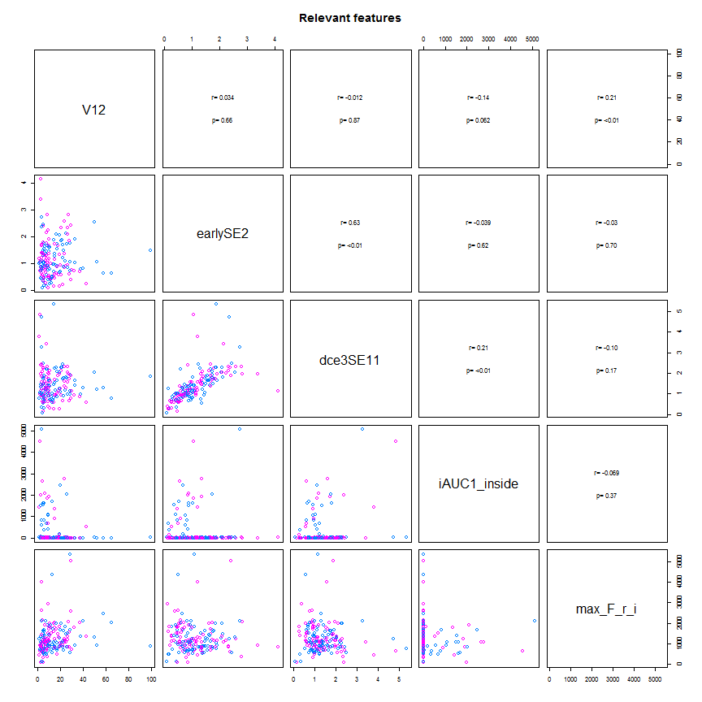
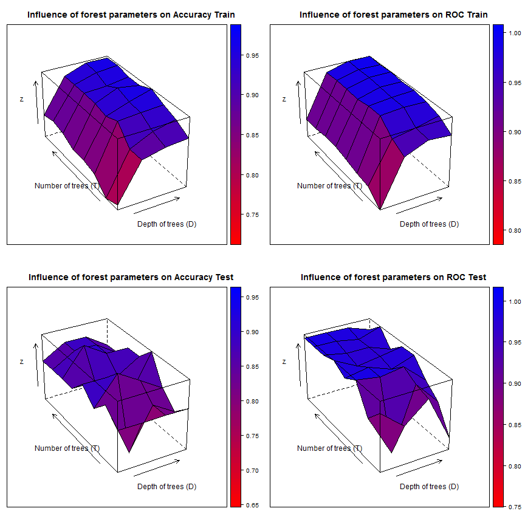
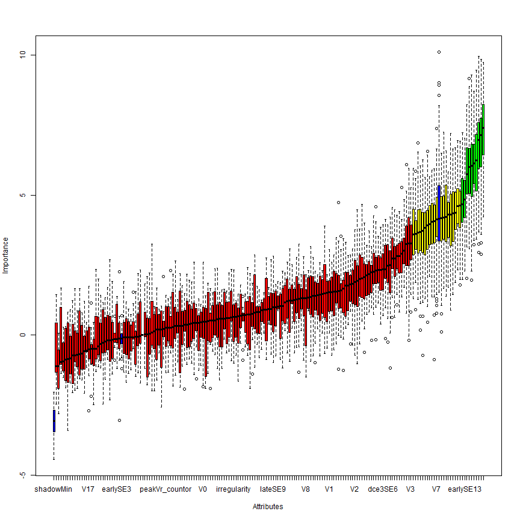
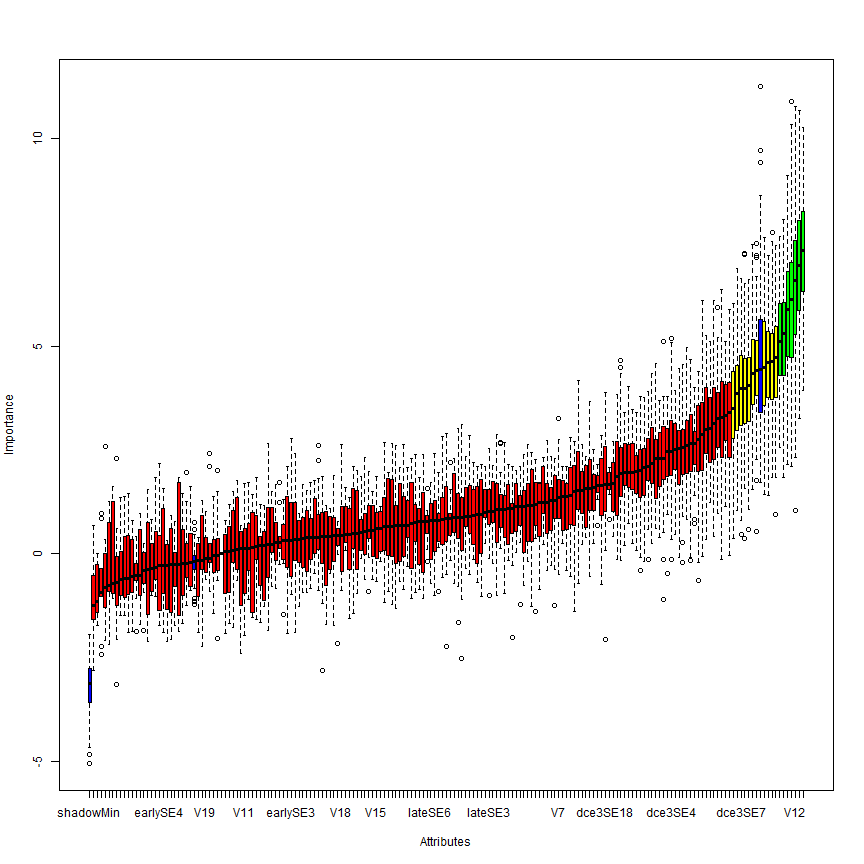
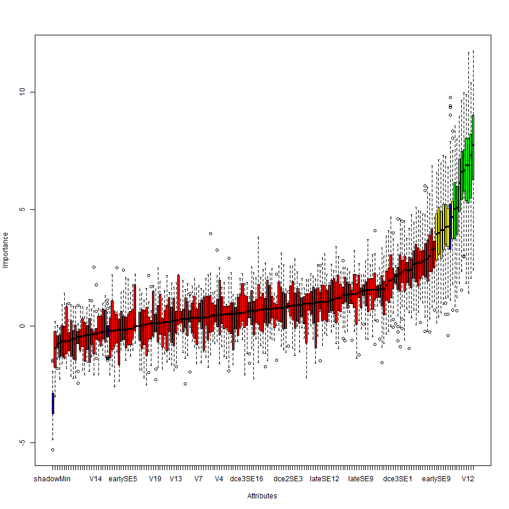
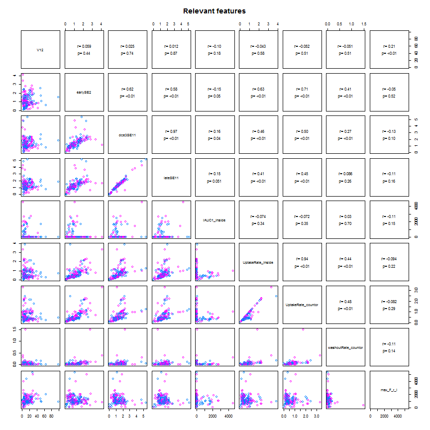
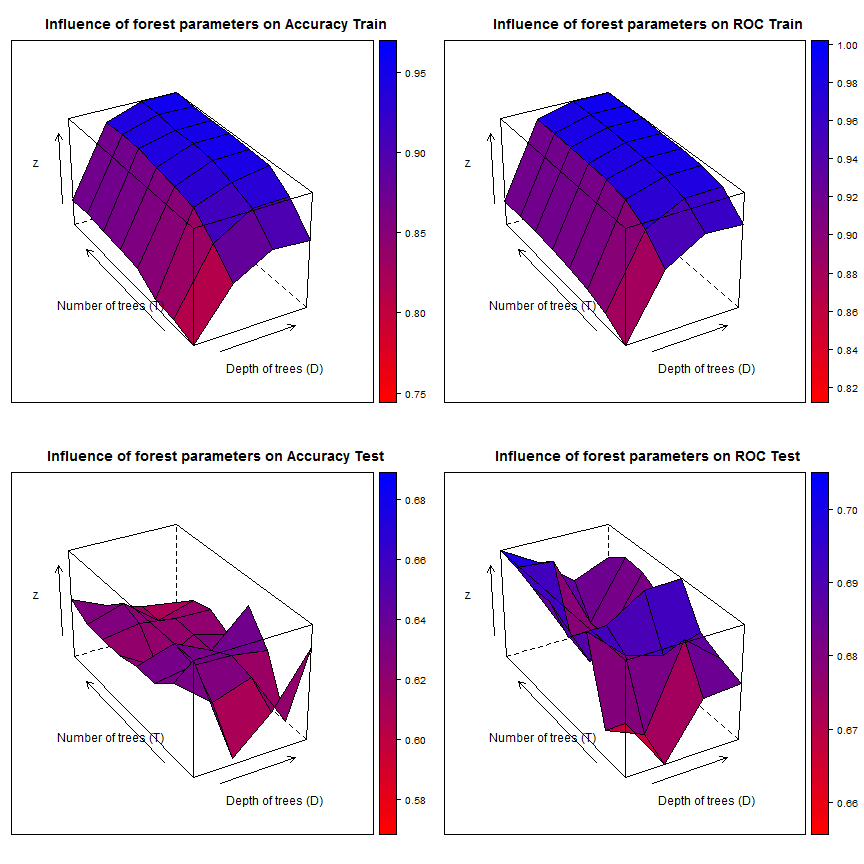
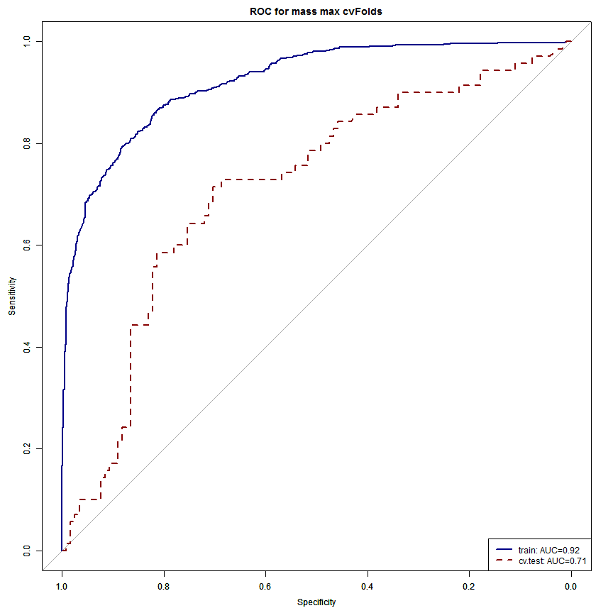

### code Read and partition data   

```r
setwd("Z:/Cristina/MassNonmass/Section1 - ExperimentsUpToDate/experimentsRadiologypaper-revision/Tree-based-RF/ensemble-Treebased-RF")
library("RSQLite")

rpart_inputdata <- function(subdata) {
    sqlite <- dbDriver("SQLite")
    conn <- dbConnect(sqlite, "stage1localData.db")
    
    # 2) all T1W features
    lesionsQuery <- dbGetQuery(conn, "SELECT *\n           FROM  stage1features\n           INNER JOIN lesion ON (stage1features.lesion_id = lesion.lesion_id)\n           INNER JOIN f_dynamic ON (stage1features.lesion_id = f_dynamic.lesion_id)\n           INNER JOIN f_morphology ON (stage1features.lesion_id = f_morphology.lesion_id)\n           INNER JOIN f_texture ON (stage1features.lesion_id = f_texture.lesion_id)")
    
    # prune entries and extract feature subsets corresponds to 5 entries
    # lesion info, 34 dynamic, 19 morpho, 34 texture fueatures
    lesionfields = names(lesionsQuery)
    lesioninfo = lesionsQuery[c(1, 2, 150, 151)]
    stage1features = lesionsQuery[c(3:103, 124:127)]
    dynfeatures = lesionsQuery[c(154:187)]
    morphofeatures = lesionsQuery[c(190:208)]
    texfeatures = lesionsQuery[c(211:234)]
    
    # combine all features
    allfeatures = cbind(lesioninfo[1:272, 2:3], stage1features[1:272, 1:ncol(stage1features)], 
        dynfeatures[1:272, 1:ncol(dynfeatures)], morphofeatures[1:272, 1:ncol(morphofeatures)], 
        texfeatures[1:272, 1:ncol(texfeatures)])
    # combine all features
    
    
    if (subdata == "mass") {
        # organized the data by subdata
        M <- subset(allfeatures, lesion_label == "massB" | lesion_label == "massM")
        M$lesion_label <- ifelse(M$lesion_label == "massB", "NC", "C")
        allfeatures = M
    }
    if (subdata == "nonmass") {
        # organized the data by subdata
        N <- subset(allfeatures, lesion_label == "nonmassB" | lesion_label == 
            "nonmassM")
        N$lesion_label <- ifelse(N$lesion_label == "nonmassB", "NC", "C")
        allfeatures = N
    }
    if (subdata == "stage1") {
        # organized the data by subdata
        M <- subset(allfeatures, lesion_label == "massB" | lesion_label == "massM")
        M$lesion_label <- ifelse(M$lesion_label == "massB", "mass", "mass")
        N <- subset(allfeatures, lesion_label == "nonmassB" | lesion_label == 
            "nonmassM")
        N$lesion_label <- ifelse(N$lesion_label == "nonmassB", "nonmass", "nonmass")
        allfeatures = data.frame(rbind(M, N))
    }
    if (subdata == "oneshot") {
        # organized the data by subdata
        M <- subset(allfeatures, lesion_label == "massB" | lesion_label == "massM")
        M$lesion_label <- ifelse(M$lesion_label == "massB", "NC", "C")
        N <- subset(allfeatures, lesion_label == "nonmassB" | lesion_label == 
            "nonmassM")
        N$lesion_label <- ifelse(N$lesion_label == "nonmassB", "NC", "C")
        allfeatures = data.frame(rbind(M, N))
    }
    # procees data
    allfeatures$lesion_label <- as.factor(allfeatures$lesion_label)
    allfeatures$peakCr_inside <- as.factor(allfeatures$peakCr_inside)
    allfeatures$peakVr_inside <- as.factor(allfeatures$peakVr_inside)
    allfeatures$peakCr_countor <- as.factor(allfeatures$peakCr_countor)
    allfeatures$peakVr_countor <- as.factor(allfeatures$peakVr_countor)
    allfeatures$k_Max_Margin_Grad <- as.factor(allfeatures$k_Max_Margin_Grad)
    allfeatures$max_RGH_mean_k <- as.factor(allfeatures$max_RGH_mean_k)
    allfeatures$max_RGH_var_k <- as.factor(allfeatures$max_RGH_var_k)
    
    output <- allfeatures
    return(output)
}
```


### code to create a cross-validation set up: 
### cvfoldk = number of cv folds typically 5 or 10
### out: particvfoldK = all cv-K ids

```r
library(MASS)
library(caret)
```

```
## Loading required package: cluster
## Loading required package: foreach
## Loading required package: lattice
## Loading required package: plyr
## Loading required package: reshape2
```

```r

cvfold_partition <- function(dat, cvfoldK){
  ndat = nrow(dat)
  outcomesetDi  <- dat$lesion_label
  #For multiple k-fold cross-validation, completely independent folds are created.
  #when y is a factor in an attempt to balance the class distributions within the splits.
  #The names of the list objects will denote the fold membership using the pattern 
  #"Foldi.Repj" meaning the ith section (of k) of the jth cross-validation set (of times).
  partitionsetDi <- createFolds(y = outcomesetDi, ## the outcome data are needed
                                k = cvfoldK, ## The percentage of data in the training set
                                list = TRUE) ## The format of the results. 
  return(partitionsetDi)
}
```


### code to sample kparti from a cross-validation set up: 
### kparti = k fold to exclude
### outs: cvTrainsetD, cvTestsetD

```r
kparti_sample <- function(dat, particvfoldK, cvfoldK, kparti) {
    allparti = 1:cvfoldK
    allbutkparti = allparti[-kparti]
    cvfoldadd = c()
    for (i in 1:length(allbutkparti)) {
        kadd = allbutkparti[i]
        cvfoldadd = c(cvfoldadd, particvfoldK[[kadd]])
    }
    # partition data
    cvTrainsetD <- dat[cvfoldadd, ]
    cvTestsetD <- dat[-cvfoldadd, ]
    
    output <- list(cvTrainsetD = cvTrainsetD, cvTestsetD = cvTestsetD)
    return(output)
}
```


### code Feature selection: 
### Boruta, cvfold, 

```r
library(Boruta)
```

```
## Loading required package: randomForest
## randomForest 4.6-7
## Type rfNews() to see new features/changes/bug fixes.
```

```r
require(data.table)
```

```
## Loading required package: data.table
```

```r
require(ggplot2)
```

```
## Loading required package: ggplot2
```

```r

# function to produce correlation coefficients on pair plots
panel.cor <- function(x, y, digits = 2, cex.cor, ...) {
    usr <- par("usr")
    on.exit(par(usr))
    par(usr = c(0, 1, 0, 1))
    # correlation coefficient
    r <- cor(x, y)
    txt <- format(c(r, 0.123456789), digits = digits)[1]
    txt <- paste("r= ", txt, sep = "")
    text(0.5, 0.6, txt)
    
    # p-value calculation
    p <- cor.test(x, y)$p.value
    txt2 <- format(c(p, 0.123456789), digits = digits)[1]
    txt2 <- paste("p= ", txt2, sep = "")
    if (p < 0.01) 
        txt2 <- paste("p= ", "<0.01", sep = "")
    text(0.5, 0.4, txt2)
}

subset_select <- function(setTrain) {
    featsel_boruta <- Boruta(lesion_label ~ ., data = setTrain[, 2:ncol(setTrain)], 
        doTrace = 2, ntree = 1000)
    print(featsel_boruta)
    plot(featsel_boruta)
    
    relevant <- featsel_boruta$finalDecision[featsel_boruta$finalDecision == 
        "Confirmed"]
    relevant_features = setTrain[c(names(relevant))]
    tentative <- featsel_boruta$finalDecision[featsel_boruta$finalDecision == 
        "Tentative"]
    tentative_features = setTrain[c(names(tentative))]
    sel_features = cbind(setTrain[c(1, 2)], relevant_features, tentative_features)
    
    super.sym <- trellis.par.get("superpose.symbol")
    ## pair plots for reatures
    setTrainrelevant = setTrain[c(names(relevant))]
    pairs(relevant_features, upper.panel = panel.cor, pch = super.sym$pch[1:2], 
        col = super.sym$col[1:2], text = list(levels(setTrainrelevant$lesion_label)), 
        main = "Relevant features")
    
    return(sel_features)
}
```


### code forest Train: 
### parameters, T= # of trees, D= tree depth, dat

```r
library(klaR)
library(rpart)
library(rpart.plot)

# bagged training was introduced as a way of reducing possible overfitting
# and improving the generalization capabilities of random forests.  The
# idea is to train each tree in a forest on a different training subset,
# sampled at random from the same labeled database.
rpart_looforestTrain <- function(T, D, dat) {
    # set control
    fitparm = rpart.control(maxdepth = D, minsplit = 5, minbucket = 4, cp = 1e-05, 
        xval = 5, maxcompete = 0, maxsurrogate = 0, usesurrogate = 0, surrogatestyle = 0)
    
    # init forest
    forest = list()
    for (t in 1:T) {
        # cat('Tree # ', t, '\n')
        
        # build bagged trees from a bootstrap sample of trainSetD
        setD = dat[sample(1:nrow(dat), nrow(dat), replace = TRUE), ]
        
        # find subsample of var when training the ith tree we only make available
        # a small random subset
        subvar = sample(2:ncol(setD), sqrt(ncol(setD) - 1), replace = FALSE)
        subfeat = colnames(setD)[subvar]
        
        # train tree
        treedata <- rpart(paste("lesion_label ~ ", paste(subfeat, collapse = "+")), 
            method = "class", data = setD, control = fitparm)
        
        # display the probability per class of observations in the node
        # (conditioned on the node, sum across a node is 1) plus the percentage of
        # observations in the node.
        if (T == 1) {
            print(treedata)
            prp(treedata, type = 2, digits = 3, extra = 102, under = TRUE, nn = TRUE, 
                col = "black", box.col = rainbow(2)[2], varlen = 0, faclen = 0, 
                branch.type = 0, gap = 0, cex = 0.7, fallen.leaves = TRUE)  # use fallen.leaves=TRUE, to plot at bottom  
        }
        
        # append
        forest <- append(forest, list(tree = treedata))
    }
    
    output <- list(forest = forest)
    return(output)
}
```


### code forest Test: 
### parameters, T= # of trees, forest, TrainsetD, TestsetD

```r

library(pROC)
```

```
## Type 'citation("pROC")' for a citation.
## 
## Attaching package: 'pROC'
## 
## The following object(s) are masked from 'package:stats':
## 
##     cov, smooth, var
```

```r
rpart_looforestTest <- function(T, TrainsetD, TestsetD, forest) {
    
    fclasspotrain = list()
    for (t in 1:T) {
        # Calcultate posterior Probabilities on grid points
        temp <- predict(forest[t]$tree, newdata = TrainsetD)  #
        fclasspotrain <- append(fclasspotrain, list(cpo = temp))
    }
    
    # run testing cases
    fclasspotest = list()
    for (t in 1:T) {
        # Calcultate posterior Probabilities on grid points
        temp <- predict(forest[t]$tree, newdata = TestsetD)  #
        fclasspotest <- append(fclasspotest, list(cpo = temp))
    }
    
    # performance on Train/Test set separately extract ensamble class
    # probabilities (when T > 1)
    trainpts = fclasspotrain[1]$cpo
    testpts = fclasspotest[1]$cpo
    # init ensample class posteriors
    enclasspotrain <- matrix(, nrow = nrow(as.data.frame(trainpts)), ncol = 2)
    enclasspotest <- matrix(, nrow = nrow(as.data.frame(testpts)), ncol = 2)
    enclasspotrain[, 1] = fclasspotrain[1]$cpo[, 1]
    enclasspotest[, 1] = fclasspotest[1]$cpo[, 1]
    enclasspotrain[, 2] = fclasspotrain[1]$cpo[, 2]
    enclasspotest[, 2] = fclasspotest[1]$cpo[, 2]
    if (T >= 2) {
        for (t in 2:T) {
            # train
            enclasspotrain[, 1] = enclasspotrain[, 1] + fclasspotrain[t]$cpo[, 
                1]
            enclasspotrain[, 2] = enclasspotrain[, 2] + fclasspotrain[t]$cpo[, 
                2]
            # test
            enclasspotest[, 1] = enclasspotest[, 1] + fclasspotest[t]$cpo[, 
                1]
            enclasspotest[, 2] = enclasspotest[, 2] + fclasspotest[t]$cpo[, 
                2]
        }
    }
    # majority voting averaging
    enclasspotrain = (1/T) * enclasspotrain
    enclasspotest = (1/T) * enclasspotest
    
    # on training
    classes = levels(TrainsetD$lesion_label)
    trainprob = data.frame(C1 = enclasspotrain[, 1], C2 = enclasspotrain[, 2], 
        pred = classes[apply(enclasspotrain, 1, which.max)], obs = TrainsetD$lesion_label)
    colnames(trainprob)[1:2] <- classes
    pred = as.factor(apply(enclasspotrain, 1, which.max))
    levels(pred) = levels(as.factor(unclass(TrainsetD$lesion_label)))
    perf_train = confusionMatrix(pred, as.factor(unclass(TrainsetD$lesion_label)))
    # print(perf_train)
    
    # on testing
    testprob = data.frame(C1 = enclasspotest[, 1], C2 = enclasspotest[, 2], 
        pred = classes[apply(enclasspotest, 1, which.max)], obs = TestsetD$lesion_label)
    colnames(testprob)[1:2] <- classes
    pred = as.factor(apply(enclasspotest, 1, which.max))
    levels(pred) = levels(as.factor(unclass(TrainsetD$lesion_label)))
    pred[1] = as.factor(apply(enclasspotest, 1, which.max))
    
    groundT = as.factor(unclass(TestsetD$lesion_label))
    levels(groundT) = levels(as.factor(unclass(TrainsetD$lesion_label)))
    groundT[1] = as.factor(unclass(TestsetD$lesion_label))
    
    perf_test = confusionMatrix(pred, groundT)
    # print(perf_test)
    
    output <- list(etrain = perf_train, etest = perf_test, trainprob = trainprob, 
        testprob = testprob)
    return(output)
}
```


### code for running and plotting perfm results: 
###statsAU

```r
create_ensemble <- function(dat, particvfoldK, cvK) {
    # inint
    ensemblegrdperf = list()
    maxM = list()
    for (r in 1:cvK) {
        ## pick one of cvfold for held-out test, train on the rest
        kparti_setdata = kparti_sample(dat, particvfoldK, cvK, r)
        
        # Boruta on $cvTrainsetD
        selfeatures_kfold = subset_select(kparti_setdata$cvTrainsetD)
        names(selfeatures_kfold)
        
        ################################################### create grid of
        ################################################### evaluation points
        gT = c(5, 10, 30, 60, 100, 250, 500, 750)
        gD = c(2, 5, 10, 20)
        grd <- expand.grid(x = gD, y = gT)
        
        ################################################### for oneshot
        grdperf = data.frame(grd)
        grdperf$acuTrain = 0
        grdperf$rocTrain = 0
        grdperf$senTrain = 0
        grdperf$speTrain = 0
        
        grdperf$acuTest = 0
        grdperf$rocTest = 0
        grdperf$senTest = 0
        grdperf$speTest = 0
        
        M = list()
        for (k in 1:nrow(grd)) {
            D = grd[k, 1]
            T = grd[k, 2]
            # Build in l
            cat("D: ", D, "T: ", T, "\n")
            TrainsetD <- kparti_setdata$cvTrainsetD[c(names(selfeatures_kfold))]
            TestsetD <- kparti_setdata$cvTestsetD[c(names(selfeatures_kfold))]
            fit <- rpart_looforestTrain(T, D, TrainsetD[c(2:ncol(TrainsetD))])
            # # predict
            perf <- rpart_looforestTest(T, TrainsetD[c(2:ncol(TrainsetD))], 
                TestsetD[c(2:ncol(TestsetD))], fit$forest)
            # for train
            ROCF_train <- roc(perf$trainprob$obs, perf$trainprob$C, col = "#000086", 
                main = paste0("ROC T=", T, " D=", D, " cv=", r))
            print(ROCF_train$auc)
            # collect data
            grdperf$acuTrain[k] = grdperf$acuTrain[k] + as.numeric(perf$etrain$overall[1])
            grdperf$rocTrain[k] = grdperf$rocTrain[k] + as.numeric(ROCF_train$auc)
            grdperf$senTrain[k] = grdperf$senTrain[k] + as.numeric(perf$etrain$byClass[1])
            grdperf$speTrain[k] = grdperf$speTrain[k] + as.numeric(perf$etrain$byClass[2])
            # for test par(new=TRUE)
            ROCF_test <- roc(perf$testprob$obs, perf$testprob$C, col = "#860000", 
                main = paste0("ROC T=", T, " D=", D, " cv=", r))
            # legend('bottomright', legend = c('train', 'test'), col = c('#000086',
            # '#860000'),lwd = 2)
            print(ROCF_test$auc)
            # collect data
            grdperf$acuTest[k] = grdperf$acuTest[k] + as.numeric(perf$etest$overall[1])
            grdperf$rocTest[k] = grdperf$rocTest[k] + as.numeric(ROCF_test$auc)
            grdperf$senTest[k] = grdperf$senTest[k] + as.numeric(perf$etest$byClass[1])
            grdperf$speTest[k] = grdperf$speTest[k] + as.numeric(perf$etest$byClass[2])
            
            # append perfm for ROC
            M = append(M, list(M = list(D = D, T = T, trainprob = perf$trainprob, 
                testprob = perf$testprob, forest = fit$forest)))
        }
        print(grdperf)
        surface_forestperfm(grdperf)
        index = which(grdperf$rocTest == max(grdperf$rocTest), arr.ind = TRUE)
        Dmax = grdperf$x[index]
        Tmax = grdperf$y[index]
        resamMax = M[index]$M$testprob
        # append
        maxM <- append(maxM, list(maxp = list(D = Dmax, T = Tmax, trainprob = M[index]$M$trainprob, 
            testprob = M[index]$M$testprob, forest = M[index]$M$forest)))
        ensemblegrdperf <- append(ensemblegrdperf, list(grdperf = grdperf))
    }
    output <- list(ensemblegrdperf = ensemblegrdperf, maxM = maxM)
    return(output)
}

surface_forestperfm <- function(grdperf) {
    library(gridExtra)
    library(base)
    library(lattice)
    
    graphlist <- list()
    count <- 1
    # design acuTrain
    z = grdperf$acuTrain
    gD = unique(grdperf$x)
    gT = unique(grdperf$y)
    dim(z) <- c(length(gD), length(gT))
    w1 <- wireframe(z, gD, gT, box = FALSE, xlab = "Depth of trees (D)", ylab = "Number of trees (T)", 
        main = "Influence of forest parameters on Accuracy Train", drape = TRUE, 
        colorkey = TRUE, light.source = c(10, 0, 10), col.regions = colorRampPalette(c("red", 
            "blue"))(100), screen = list(z = 30, x = -60))
    graphlist[[count]] <- w1
    count <- count + 1
    
    # design rocTrain
    z = grdperf$rocTrain
    dim(z) <- c(length(gD), length(gT))
    w2 <- wireframe(z, gD, gT, box = FALSE, xlab = "Depth of trees (D)", ylab = "Number of trees (T)", 
        main = "Influence of forest parameters on ROC Train", drape = TRUE, 
        colorkey = TRUE, light.source = c(10, 0, 10), col.regions = colorRampPalette(c("red", 
            "blue"))(100), screen = list(z = 30, x = -60))
    graphlist[[count]] <- w2
    count <- count + 1
    
    # design acuTest
    z = grdperf$acuTest
    dim(z) <- c(length(gD), length(gT))
    w3 <- wireframe(z, gD, gT, box = FALSE, xlab = "Depth of trees (D)", ylab = "Number of trees (T)", 
        main = "Influence of forest parameters on Accuracy Test", drape = TRUE, 
        colorkey = TRUE, light.source = c(10, 0, 10), col.regions = colorRampPalette(c("red", 
            "blue"))(100), screen = list(z = 30, x = -60))
    graphlist[[count]] <- w3
    count <- count + 1
    
    # design rocTest
    z = grdperf$rocTest
    dim(z) <- c(length(gD), length(gT))
    w4 <- wireframe(z, gD, gT, box = FALSE, xlab = "Depth of trees (D)", ylab = "Number of trees (T)", 
        main = "Influence of forest parameters on ROC Test", drape = TRUE, colorkey = TRUE, 
        light.source = c(10, 0, 10), col.regions = colorRampPalette(c("red", 
            "blue"))(100), screen = list(z = 30, x = -60))
    graphlist[[count]] <- w4
    count <- count + 1
    
    
    # finally plot in grid
    do.call("grid.arrange", c(graphlist, ncol = 2))
}
```


Run for mass lesions:
=====

```r
# read mass features
massdat = rpart_inputdata(subdata = "mass")
## create CV
cvK = 10
# run for mass
particvfoldK = cvfold_partition(massdat, cvK)
res = create_ensemble(massdat, particvfoldK, cvK)
```

```
## Initial round 1: ..........
##  89  attributes rejected after this test:  V0 V1 V5 V9 V10 V11 V14 V15 V16 V17 V19 earlySE3 earlySE5 earlySE7 earlySE8 earlySE14 earlySE15 earlySE16 earlySE17 dce2SE0 dce2SE3 dce2SE5 dce2SE17 dce3SE0 dce3SE9 dce3SE12 dce3SE14 dce3SE16 dce3SE17 dce3SE19 lateSE0 lateSE2 lateSE3 lateSE5 lateSE7 lateSE8 lateSE9 lateSE12 lateSE13 lateSE16 lateSE17 lateSE19 closenessC betweennessC no_triangles alpha_inside beta_inside Tpeak_inside SER_inside maxVr_inside peakVr_inside Vr_decreasingRate_inside Vr_post_1_inside A_countor alpha_countor beta_countor peakCr_countor peakVr_countor Vr_decreasingRate_countor Vr_post_1_countor min_F_r_i skew_F_r_i kurt_F_r_i iiiMax_Margin_Gradient k_Max_Margin_Grad circularity irregularity edge_sharp_mean max_RGH_mean_k max_RGH_var_k texture_contrast_zero texture_contrast_halfRad texture_contrast_threeQuaRad texture_homogeneity_zero texture_homogeneity_quarterRad texture_homogeneity_halfRad texture_homogeneity_threeQuaRad texture_dissimilarity_zero texture_dissimilarity_quarterRad texture_dissimilarity_halfRad texture_dissimilarity_threeQuaRad texture_correlation_zero texture_correlation_quarterRad texture_correlation_halfRad texture_correlation_threeQuaRad texture_ASM_halfRad texture_ASM_threeQuaRad texture_energy_halfRad texture_energy_threeQuaRad 
## 
## Initial round 2: ..........
##  18  attributes rejected after this test:  V2 V7 V13 earlySE4 dce2SE12 dce2SE13 dce2SE15 dce2SE16 dce3SE3 dce3SE5 lateSE4 Vr_increasingRate_inside maxVr_countor ivVariance max_RGH_mean max_RGH_var texture_ASM_quarterRad texture_energy_zero 
## 
## Initial round 3: ..........
##  16  attributes rejected after this test:  V4 V6 V18 earlySE10 earlySE18 dce2SE9 dce2SE14 lateSE14 Kpeak_inside peakCr_inside washoutRate_inside Vr_increasingRate_countor iMax_Variance_uptake edge_sharp_std texture_contrast_quarterRad texture_ASM_zero 
## 
## Final round: ..........
##  3  attributes confirmed after this test:  earlySE11 lateSE11 max_F_r_i 
## 
##  19  attributes rejected after this test:  V3 dce2SE1 dce2SE2 dce2SE6 dce2SE7 dce3SE2 dce3SE4 dce3SE8 dce3SE13 dce3SE15 lateSE1 lateSE6 lateSE18 degreeC no_con_comp A_inside Tpeak_countor var_F_r_i texture_energy_quarterRad 
## ....
##  1  attributes rejected after this test:  dce2SE4 
## ....
##  1  attributes confirmed after this test:  dce3SE11 
## 
##  3  attributes rejected after this test:  dce2SE10 iAUC1_countor Kpeak_countor 
## ...
##  2  attributes rejected after this test:  Slope_ini_inside SER_countor 
## ...
##  3  attributes rejected after this test:  earlySE9 dce2SE8 washoutRate_countor 
## ...
##  2  attributes rejected after this test:  V8 dce3SE6 
## ..............
##  2  attributes rejected after this test:  earlySE6 dce2SE18 
## ........
##  2  attributes confirmed after this test:  iAUC1_inside UptakeRate_countor 
## .....
##  1  attributes confirmed after this test:  iiMin_change_Variance_uptake 
## .....
##  1  attributes confirmed after this test:  maxCr_inside 
## ..........
##  1  attributes confirmed after this test:  dce2SE11 
## ...............................
## Boruta performed 130 randomForest runs in 2.167 mins.
##         9 attributes confirmed important: earlySE11 dce2SE11
## dce3SE11 lateSE11 iAUC1_inside maxCr_inside UptakeRate_countor
## max_F_r_i iiMin_change_Variance_uptake
##         155 attributes confirmed unimportant: V0 V1 V2 V3 V4 V5 V6
## V7 V8 V9 V10 V11 V13 V14 V15 V16 V17 V18 V19 earlySE3 earlySE4
## earlySE5 earlySE6 earlySE7 earlySE8 earlySE9 earlySE10 earlySE14
## earlySE15 earlySE16 earlySE17 earlySE18 dce2SE0 dce2SE1 dce2SE2
## dce2SE3 dce2SE4 dce2SE5 dce2SE6 dce2SE7 dce2SE8 dce2SE9 dce2SE10
## dce2SE12 dce2SE13 dce2SE14 dce2SE15 dce2SE16 dce2SE17 dce2SE18
## dce3SE0 dce3SE2 dce3SE3 dce3SE4 dce3SE5 dce3SE6 dce3SE8 dce3SE9
## dce3SE12 dce3SE13 dce3SE14 dce3SE15 dce3SE16 dce3SE17 dce3SE19
## lateSE0 lateSE1 lateSE2 lateSE3 lateSE4 lateSE5 lateSE6 lateSE7
## lateSE8 lateSE9 lateSE12 lateSE13 lateSE14 lateSE16 lateSE17
## lateSE18 lateSE19 degreeC closenessC betweennessC no_triangles
## no_con_comp A_inside alpha_inside beta_inside Slope_ini_inside
## Tpeak_inside Kpeak_inside SER_inside peakCr_inside
## washoutRate_inside maxVr_inside peakVr_inside
## Vr_increasingRate_inside Vr_decreasingRate_inside Vr_post_1_inside
## A_countor alpha_countor beta_countor iAUC1_countor Tpeak_countor
## Kpeak_countor SER_countor peakCr_countor washoutRate_countor
## maxVr_countor peakVr_countor Vr_increasingRate_countor
## Vr_decreasingRate_countor Vr_post_1_countor min_F_r_i var_F_r_i
## skew_F_r_i kurt_F_r_i iMax_Variance_uptake iiiMax_Margin_Gradient
## k_Max_Margin_Grad ivVariance circularity irregularity
## edge_sharp_mean edge_sharp_std max_RGH_mean max_RGH_mean_k
## max_RGH_var max_RGH_var_k texture_contrast_zero
## texture_contrast_quarterRad texture_contrast_halfRad
## texture_contrast_threeQuaRad texture_homogeneity_zero
## texture_homogeneity_quarterRad texture_homogeneity_halfRad
## texture_homogeneity_threeQuaRad texture_dissimilarity_zero
## texture_dissimilarity_quarterRad texture_dissimilarity_halfRad
## texture_dissimilarity_threeQuaRad texture_correlation_zero
## texture_correlation_quarterRad texture_correlation_halfRad
## texture_correlation_threeQuaRad texture_ASM_zero
## texture_ASM_quarterRad texture_ASM_halfRad texture_ASM_threeQuaRad
## texture_energy_zero texture_energy_quarterRad
## texture_energy_halfRad texture_energy_threeQuaRad
##         18 tentative attributes left: V12 earlySE0 earlySE1
## earlySE2 earlySE12 earlySE13 earlySE19 dce2SE19 dce3SE1 dce3SE7
## dce3SE10 dce3SE18 lateSE10 lateSE15 UptakeRate_inside
## Slope_ini_countor maxCr_countor mean_F_r_i
```

  

```
## D:  2 T:  5 
## Area under the curve: 0.835
## Area under the curve: 0.643
## D:  5 T:  5 
## Area under the curve: 0.923
## Area under the curve: 0.518
## D:  10 T:  5 
## Area under the curve: 0.939
## Area under the curve: 0.589
## D:  20 T:  5 
## Area under the curve: 0.936
## Area under the curve: 0.661
## D:  2 T:  10 
## Area under the curve: 0.86
## Area under the curve: 0.5
## D:  5 T:  10 
## Area under the curve: 0.953
## Area under the curve: 0.577
## D:  10 T:  10 
## Area under the curve: 0.98
## Area under the curve: 0.488
## D:  20 T:  10 
## Area under the curve: 0.968
## Area under the curve: 0.47
## D:  2 T:  30 
## Area under the curve: 0.851
## Area under the curve: 0.518
## D:  5 T:  30 
## Area under the curve: 0.965
## Area under the curve: 0.554
## D:  10 T:  30 
## Area under the curve: 0.979
## Area under the curve: 0.548
## D:  20 T:  30 
## Area under the curve: 0.983
## Area under the curve: 0.655
## D:  2 T:  60 
## Area under the curve: 0.861
## Area under the curve: 0.577
## D:  5 T:  60 
## Area under the curve: 0.975
## Area under the curve: 0.488
## D:  10 T:  60 
## Area under the curve: 0.98
## Area under the curve: 0.583
## D:  20 T:  60 
## Area under the curve: 0.981
## Area under the curve: 0.571
## D:  2 T:  100 
## Area under the curve: 0.875
## Area under the curve: 0.583
## D:  5 T:  100 
## Area under the curve: 0.974
## Area under the curve: 0.524
## D:  10 T:  100 
## Area under the curve: 0.984
## Area under the curve: 0.607
## D:  20 T:  100 
## Area under the curve: 0.985
## Area under the curve: 0.583
## D:  2 T:  250 
## Area under the curve: 0.876
## Area under the curve: 0.512
## D:  5 T:  250 
## Area under the curve: 0.972
## Area under the curve: 0.595
## D:  10 T:  250 
## Area under the curve: 0.985
## Area under the curve: 0.56
## D:  20 T:  250 
## Area under the curve: 0.982
## Area under the curve: 0.548
## D:  2 T:  500 
## Area under the curve: 0.873
## Area under the curve: 0.536
## D:  5 T:  500 
## Area under the curve: 0.974
## Area under the curve: 0.56
## D:  10 T:  500 
## Area under the curve: 0.984
## Area under the curve: 0.571
## D:  20 T:  500 
## Area under the curve: 0.987
## Area under the curve: 0.56
## D:  2 T:  750 
## Area under the curve: 0.874
## Area under the curve: 0.548
## D:  5 T:  750 
## Area under the curve: 0.973
## Area under the curve: 0.56
## D:  10 T:  750 
## Area under the curve: 0.985
## Area under the curve: 0.571
## D:  20 T:  750 
## Area under the curve: 0.985
## Area under the curve: 0.571
##     x   y acuTrain rocTrain senTrain speTrain acuTest rocTest senTest
## 1   2   5   0.7515   0.8348   0.7736   0.7143  0.6316  0.6429  0.6667
## 2   5   5   0.8462   0.9227   0.8962   0.7619  0.4737  0.5179  0.5833
## 3  10   5   0.8757   0.9393   0.9245   0.7937  0.5789  0.5893  0.5833
## 4  20   5   0.8639   0.9355   0.9623   0.6984  0.6842  0.6607  0.8333
## 5   2  10   0.8225   0.8601   0.9245   0.6508  0.4211  0.5000  0.5833
## 6   5  10   0.8757   0.9533   0.9340   0.7778  0.5263  0.5774  0.5000
## 7  10  10   0.9290   0.9804   0.9717   0.8571  0.5263  0.4881  0.6667
## 8  20  10   0.9053   0.9684   0.9717   0.7937  0.5263  0.4702  0.6667
## 9   2  30   0.7337   0.8509   0.7264   0.7460  0.5263  0.5179  0.5833
## 10  5  30   0.9172   0.9651   0.9717   0.8254  0.6842  0.5536  0.7500
## 11 10  30   0.9349   0.9789   0.9811   0.8571  0.5789  0.5476  0.6667
## 12 20  30   0.9527   0.9832   1.0000   0.8730  0.6842  0.6548  0.7500
## 13  2  60   0.7988   0.8607   0.9057   0.6190  0.5789  0.5774  0.6667
## 14  5  60   0.9467   0.9753   0.9906   0.8730  0.5263  0.4881  0.6667
## 15 10  60   0.9527   0.9804   1.0000   0.8730  0.5789  0.5833  0.8333
## 16 20  60   0.9349   0.9813   0.9811   0.8571  0.5789  0.5714  0.6667
## 17  2 100   0.8107   0.8750   0.8679   0.7143  0.5789  0.5833  0.5833
## 18  5 100   0.9349   0.9742   0.9717   0.8730  0.5263  0.5238  0.5833
## 19 10 100   0.9586   0.9838   1.0000   0.8889  0.6842  0.6071  0.7500
## 20 20 100   0.9527   0.9850   1.0000   0.8730  0.6316  0.5833  0.7500
## 21  2 250   0.8343   0.8757   0.9151   0.6984  0.5789  0.5119  0.6667
## 22  5 250   0.9467   0.9720   1.0000   0.8571  0.6316  0.5952  0.7500
## 23 10 250   0.9527   0.9850   1.0000   0.8730  0.6316  0.5595  0.7500
## 24 20 250   0.9586   0.9825   1.0000   0.8889  0.5263  0.5476  0.5833
## 25  2 500   0.8284   0.8735   0.8962   0.7143  0.5789  0.5357  0.5833
## 26  5 500   0.9527   0.9738   1.0000   0.8730  0.6842  0.5595  0.7500
## 27 10 500   0.9527   0.9840   1.0000   0.8730  0.6316  0.5714  0.7500
## 28 20 500   0.9527   0.9867   1.0000   0.8730  0.5789  0.5595  0.5833
## 29  2 750   0.8343   0.8741   0.9151   0.6984  0.6316  0.5476  0.6667
## 30  5 750   0.9408   0.9726   0.9906   0.8571  0.6316  0.5595  0.7500
## 31 10 750   0.9527   0.9846   1.0000   0.8730  0.6316  0.5714  0.6667
## 32 20 750   0.9527   0.9852   1.0000   0.8730  0.6316  0.5714  0.6667
##    speTest
## 1   0.5714
## 2   0.2857
## 3   0.5714
## 4   0.4286
## 5   0.1429
## 6   0.5714
## 7   0.2857
## 8   0.2857
## 9   0.4286
## 10  0.5714
## 11  0.4286
## 12  0.5714
## 13  0.4286
## 14  0.2857
## 15  0.1429
## 16  0.4286
## 17  0.5714
## 18  0.4286
## 19  0.5714
## 20  0.4286
## 21  0.4286
## 22  0.4286
## 23  0.4286
## 24  0.4286
## 25  0.5714
## 26  0.5714
## 27  0.4286
## 28  0.5714
## 29  0.5714
## 30  0.4286
## 31  0.5714
## 32  0.5714
```

 

```
## Initial round 1: ..........
##  88  attributes rejected after this test:  V0 V2 V3 V4 V5 V6 V7 V8 V9 V10 V11 V13 V14 V15 V16 V17 V19 earlySE5 earlySE14 earlySE17 dce2SE7 dce2SE12 dce2SE17 dce2SE19 dce3SE0 dce3SE2 dce3SE5 dce3SE17 lateSE0 lateSE2 lateSE5 lateSE6 lateSE14 lateSE17 degreeC closenessC betweennessC alpha_inside Tpeak_inside washoutRate_inside maxVr_inside peakVr_inside Vr_increasingRate_inside Vr_decreasingRate_inside Vr_post_1_inside A_countor alpha_countor beta_countor SER_countor washoutRate_countor maxVr_countor peakVr_countor Vr_increasingRate_countor Vr_decreasingRate_countor Vr_post_1_countor min_F_r_i var_F_r_i skew_F_r_i kurt_F_r_i iMax_Variance_uptake iiiMax_Margin_Gradient k_Max_Margin_Grad circularity irregularity edge_sharp_std max_RGH_mean max_RGH_mean_k max_RGH_var max_RGH_var_k texture_contrast_halfRad texture_homogeneity_zero texture_homogeneity_quarterRad texture_homogeneity_halfRad texture_homogeneity_threeQuaRad texture_dissimilarity_zero texture_dissimilarity_halfRad texture_dissimilarity_threeQuaRad texture_correlation_zero texture_correlation_quarterRad texture_correlation_halfRad texture_correlation_threeQuaRad texture_ASM_zero texture_ASM_quarterRad texture_ASM_halfRad texture_ASM_threeQuaRad texture_energy_zero texture_energy_quarterRad texture_energy_halfRad 
## 
## Initial round 2: ..........
##  24  attributes rejected after this test:  V1 earlySE7 dce2SE0 dce2SE5 dce2SE15 dce2SE16 dce3SE16 lateSE3 lateSE7 lateSE9 lateSE12 lateSE16 lateSE19 beta_inside Slope_ini_inside SER_inside peakCr_countor iiMin_change_Variance_uptake ivVariance edge_sharp_mean texture_contrast_quarterRad texture_contrast_threeQuaRad texture_dissimilarity_quarterRad texture_energy_threeQuaRad 
## 
## Initial round 3: ..........
##  16  attributes rejected after this test:  V18 earlySE4 earlySE8 earlySE16 dce2SE3 dce2SE4 dce2SE14 dce3SE3 dce3SE12 lateSE8 lateSE13 no_triangles no_con_comp Kpeak_inside peakCr_inside texture_contrast_zero 
## 
## Final round: ..........
##  1  attributes rejected after this test:  dce2SE6 
## ....
##  3  attributes confirmed after this test:  earlySE2 dce3SE11 max_F_r_i 
## 
##  4  attributes rejected after this test:  earlySE15 dce3SE14 lateSE4 Tpeak_countor 
## ....
##  4  attributes rejected after this test:  earlySE3 earlySE12 dce2SE13 dce3SE6 
## ...
##  1  attributes confirmed after this test:  iAUC1_inside 
## 
##  4  attributes rejected after this test:  earlySE6 dce2SE1 lateSE18 mean_F_r_i 
## ...
##  1  attributes rejected after this test:  maxCr_inside 
## ...
##  1  attributes confirmed after this test:  UptakeRate_countor 
## 
##  2  attributes rejected after this test:  dce2SE2 dce3SE13 
## ...
##  6  attributes rejected after this test:  dce2SE8 dce3SE9 dce3SE15 dce3SE19 lateSE1 Slope_ini_countor 
## ...
##  3  attributes rejected after this test:  earlySE10 earlySE18 dce2SE9 
## ..
##  1  attributes rejected after this test:  dce3SE18 
## ...
##  1  attributes confirmed after this test:  UptakeRate_inside 
## .....
##  1  attributes confirmed after this test:  lateSE11 
## 
##  1  attributes rejected after this test:  A_inside 
## ...
##  1  attributes confirmed after this test:  lateSE10 
## ...
##  2  attributes rejected after this test:  earlySE9 dce2SE11 
## .....
##  1  attributes rejected after this test:  iAUC1_countor 
## .....
##  1  attributes rejected after this test:  dce3SE4 
## ...............
##  1  attributes confirmed after this test:  earlySE0 
## ..
##  1  attributes rejected after this test:  dce2SE10 
## .......
##  1  attributes confirmed after this test:  earlySE11 
## ........
##  1  attributes confirmed after this test:  V12 
## .........
## Boruta performed 130 randomForest runs in 1.996 mins.
##         11 attributes confirmed important: V12 earlySE0 earlySE2
## earlySE11 dce3SE11 lateSE10 lateSE11 iAUC1_inside
## UptakeRate_inside UptakeRate_countor max_F_r_i
##         160 attributes confirmed unimportant: V0 V1 V2 V3 V4 V5 V6
## V7 V8 V9 V10 V11 V13 V14 V15 V16 V17 V18 V19 earlySE3 earlySE4
## earlySE5 earlySE6 earlySE7 earlySE8 earlySE9 earlySE10 earlySE12
## earlySE14 earlySE15 earlySE16 earlySE17 earlySE18 dce2SE0 dce2SE1
## dce2SE2 dce2SE3 dce2SE4 dce2SE5 dce2SE6 dce2SE7 dce2SE8 dce2SE9
## dce2SE10 dce2SE11 dce2SE12 dce2SE13 dce2SE14 dce2SE15 dce2SE16
## dce2SE17 dce2SE19 dce3SE0 dce3SE2 dce3SE3 dce3SE4 dce3SE5 dce3SE6
## dce3SE9 dce3SE12 dce3SE13 dce3SE14 dce3SE15 dce3SE16 dce3SE17
## dce3SE18 dce3SE19 lateSE0 lateSE1 lateSE2 lateSE3 lateSE4 lateSE5
## lateSE6 lateSE7 lateSE8 lateSE9 lateSE12 lateSE13 lateSE14
## lateSE16 lateSE17 lateSE18 lateSE19 degreeC closenessC
## betweennessC no_triangles no_con_comp A_inside alpha_inside
## beta_inside Slope_ini_inside Tpeak_inside Kpeak_inside SER_inside
## maxCr_inside peakCr_inside washoutRate_inside maxVr_inside
## peakVr_inside Vr_increasingRate_inside Vr_decreasingRate_inside
## Vr_post_1_inside A_countor alpha_countor beta_countor
## iAUC1_countor Slope_ini_countor Tpeak_countor SER_countor
## peakCr_countor washoutRate_countor maxVr_countor peakVr_countor
## Vr_increasingRate_countor Vr_decreasingRate_countor
## Vr_post_1_countor min_F_r_i mean_F_r_i var_F_r_i skew_F_r_i
## kurt_F_r_i iMax_Variance_uptake iiMin_change_Variance_uptake
## iiiMax_Margin_Gradient k_Max_Margin_Grad ivVariance circularity
## irregularity edge_sharp_mean edge_sharp_std max_RGH_mean
## max_RGH_mean_k max_RGH_var max_RGH_var_k texture_contrast_zero
## texture_contrast_quarterRad texture_contrast_halfRad
## texture_contrast_threeQuaRad texture_homogeneity_zero
## texture_homogeneity_quarterRad texture_homogeneity_halfRad
## texture_homogeneity_threeQuaRad texture_dissimilarity_zero
## texture_dissimilarity_quarterRad texture_dissimilarity_halfRad
## texture_dissimilarity_threeQuaRad texture_correlation_zero
## texture_correlation_quarterRad texture_correlation_halfRad
## texture_correlation_threeQuaRad texture_ASM_zero
## texture_ASM_quarterRad texture_ASM_halfRad texture_ASM_threeQuaRad
## texture_energy_zero texture_energy_quarterRad
## texture_energy_halfRad texture_energy_threeQuaRad
##         11 tentative attributes left: earlySE1 earlySE13 earlySE19
## dce2SE18 dce3SE1 dce3SE7 dce3SE8 dce3SE10 lateSE15 Kpeak_countor
## maxCr_countor
```

  

```
## D:  2 T:  5 
## Area under the curve: 0.821
## Area under the curve: 0.464
## D:  5 T:  5 
## Area under the curve: 0.913
## Area under the curve: 0.601
## D:  10 T:  5 
## Area under the curve: 0.956
## Area under the curve: 0.589
## D:  20 T:  5 
## Area under the curve: 0.951
## Area under the curve: 0.536
## D:  2 T:  10 
## Area under the curve: 0.856
## Area under the curve: 0.446
## D:  5 T:  10 
## Area under the curve: 0.914
## Area under the curve: 0.679
## D:  10 T:  10 
## Area under the curve: 0.963
## Area under the curve: 0.524
## D:  20 T:  10 
## Area under the curve: 0.984
## Area under the curve: 0.548
## D:  2 T:  30 
## Area under the curve: 0.829
## Area under the curve: 0.524
## D:  5 T:  30 
## Area under the curve: 0.954
## Area under the curve: 0.571
## D:  10 T:  30 
## Area under the curve: 0.978
## Area under the curve: 0.583
## D:  20 T:  30 
## Area under the curve: 0.97
## Area under the curve: 0.476
## D:  2 T:  60 
## Area under the curve: 0.833
## Area under the curve: 0.536
## D:  5 T:  60 
## Area under the curve: 0.966
## Area under the curve: 0.619
## D:  10 T:  60 
## Area under the curve: 0.979
## Area under the curve: 0.56
## D:  20 T:  60 
## Area under the curve: 0.989
## Area under the curve: 0.571
## D:  2 T:  100 
## Area under the curve: 0.857
## Area under the curve: 0.583
## D:  5 T:  100 
## Area under the curve: 0.965
## Area under the curve: 0.595
## D:  10 T:  100 
## Area under the curve: 0.983
## Area under the curve: 0.583
## D:  20 T:  100 
## Area under the curve: 0.98
## Area under the curve: 0.548
## D:  2 T:  250 
## Area under the curve: 0.856
## Area under the curve: 0.595
## D:  5 T:  250 
## Area under the curve: 0.968
## Area under the curve: 0.583
## D:  10 T:  250 
## Area under the curve: 0.984
## Area under the curve: 0.583
## D:  20 T:  250 
## Area under the curve: 0.982
## Area under the curve: 0.536
## D:  2 T:  500 
## Area under the curve: 0.858
## Area under the curve: 0.595
## D:  5 T:  500 
## Area under the curve: 0.971
## Area under the curve: 0.583
## D:  10 T:  500 
## Area under the curve: 0.984
## Area under the curve: 0.524
## D:  20 T:  500 
## Area under the curve: 0.984
## Area under the curve: 0.548
## D:  2 T:  750 
## Area under the curve: 0.854
## Area under the curve: 0.607
## D:  5 T:  750 
## Area under the curve: 0.969
## Area under the curve: 0.548
## D:  10 T:  750 
## Area under the curve: 0.984
## Area under the curve: 0.56
## D:  20 T:  750 
## Area under the curve: 0.985
## Area under the curve: 0.607
##     x   y acuTrain rocTrain senTrain speTrain acuTest rocTest senTest
## 1   2   5   0.7633   0.8212   0.8491   0.6190  0.6316  0.4643  0.7500
## 2   5   5   0.8462   0.9131   0.8868   0.7778  0.6316  0.6012  0.6667
## 3  10   5   0.8817   0.9563   0.8868   0.8730  0.4211  0.5893  0.4167
## 4  20   5   0.8698   0.9505   0.9151   0.7937  0.5263  0.5357  0.6667
## 5   2  10   0.7692   0.8560   0.8962   0.5556  0.4211  0.4464  0.6667
## 6   5  10   0.8402   0.9143   0.8774   0.7778  0.6842  0.6786  0.7500
## 7  10  10   0.9172   0.9632   0.9434   0.8730  0.6316  0.5238  0.7500
## 8  20  10   0.9231   0.9835   0.9717   0.8413  0.4737  0.5476  0.5833
## 9   2  30   0.7456   0.8288   0.8019   0.6508  0.5263  0.5238  0.7500
## 10  5  30   0.9112   0.9540   0.9528   0.8413  0.4737  0.5714  0.6667
## 11 10  30   0.9586   0.9781   0.9906   0.9048  0.5263  0.5833  0.6667
## 12 20  30   0.9527   0.9698   0.9906   0.8889  0.5789  0.4762  0.7500
## 13  2  60   0.7515   0.8335   0.8208   0.6349  0.5789  0.5357  0.8333
## 14  5  60   0.9290   0.9665   0.9717   0.8571  0.5789  0.6190  0.7500
## 15 10  60   0.9408   0.9790   0.9906   0.8571  0.4737  0.5595  0.6667
## 16 20  60   0.9527   0.9886   0.9906   0.8889  0.5263  0.5714  0.6667
## 17  2 100   0.7811   0.8567   0.8396   0.6825  0.5789  0.5833  0.8333
## 18  5 100   0.9112   0.9651   0.9717   0.8095  0.5263  0.5952  0.7500
## 19 10 100   0.9586   0.9834   0.9906   0.9048  0.4737  0.5833  0.7500
## 20 20 100   0.9527   0.9796   1.0000   0.8730  0.5263  0.5476  0.6667
## 21  2 250   0.7988   0.8562   0.8868   0.6508  0.5789  0.5952  0.8333
## 22  5 250   0.9408   0.9675   1.0000   0.8413  0.5263  0.5833  0.7500
## 23 10 250   0.9586   0.9838   1.0000   0.8889  0.5789  0.5833  0.7500
## 24 20 250   0.9527   0.9825   1.0000   0.8730  0.5263  0.5357  0.7500
## 25  2 500   0.7870   0.8579   0.8679   0.6508  0.5263  0.5952  0.7500
## 26  5 500   0.9408   0.9709   0.9906   0.8571  0.5263  0.5833  0.7500
## 27 10 500   0.9586   0.9838   1.0000   0.8889  0.5263  0.5238  0.7500
## 28 20 500   0.9527   0.9840   1.0000   0.8730  0.5263  0.5476  0.7500
## 29  2 750   0.7929   0.8544   0.8679   0.6667  0.5263  0.6071  0.7500
## 30  5 750   0.9408   0.9690   0.9906   0.8571  0.5263  0.5476  0.7500
## 31 10 750   0.9586   0.9838   1.0000   0.8889  0.5263  0.5595  0.7500
## 32 20 750   0.9586   0.9853   1.0000   0.8889  0.4737  0.6071  0.6667
##    speTest
## 1   0.4286
## 2   0.5714
## 3   0.4286
## 4   0.2857
## 5   0.0000
## 6   0.5714
## 7   0.4286
## 8   0.2857
## 9   0.1429
## 10  0.1429
## 11  0.2857
## 12  0.2857
## 13  0.1429
## 14  0.2857
## 15  0.1429
## 16  0.2857
## 17  0.1429
## 18  0.1429
## 19  0.0000
## 20  0.2857
## 21  0.1429
## 22  0.1429
## 23  0.2857
## 24  0.1429
## 25  0.1429
## 26  0.1429
## 27  0.1429
## 28  0.1429
## 29  0.1429
## 30  0.1429
## 31  0.1429
## 32  0.1429
```

 

```
## Initial round 1: ..........
##  109  attributes rejected after this test:  V0 V4 V5 V6 V8 V11 V13 V14 V15 V16 V17 V19 earlySE3 earlySE4 earlySE5 earlySE6 earlySE9 earlySE10 earlySE15 earlySE17 dce2SE1 dce2SE3 dce2SE4 dce2SE5 dce2SE12 dce2SE13 dce2SE14 dce2SE16 dce2SE17 dce3SE0 dce3SE2 dce3SE3 dce3SE5 dce3SE9 dce3SE13 dce3SE15 dce3SE16 dce3SE17 lateSE0 lateSE1 lateSE2 lateSE3 lateSE5 lateSE7 lateSE9 lateSE12 lateSE14 lateSE17 lateSE18 lateSE19 betweennessC no_triangles alpha_inside Tpeak_inside Kpeak_inside SER_inside peakCr_inside washoutRate_inside maxVr_inside peakVr_inside Vr_increasingRate_inside Vr_decreasingRate_inside Vr_post_1_inside beta_countor SER_countor peakCr_countor maxVr_countor peakVr_countor Vr_increasingRate_countor Vr_decreasingRate_countor min_F_r_i var_F_r_i skew_F_r_i kurt_F_r_i iMax_Variance_uptake iiiMax_Margin_Gradient k_Max_Margin_Grad ivVariance circularity irregularity edge_sharp_mean edge_sharp_std max_RGH_mean max_RGH_var max_RGH_var_k texture_contrast_zero texture_contrast_quarterRad texture_contrast_halfRad texture_contrast_threeQuaRad texture_homogeneity_zero texture_homogeneity_quarterRad texture_homogeneity_halfRad texture_homogeneity_threeQuaRad texture_dissimilarity_zero texture_dissimilarity_quarterRad texture_dissimilarity_halfRad texture_dissimilarity_threeQuaRad texture_correlation_zero texture_correlation_quarterRad texture_correlation_halfRad texture_correlation_threeQuaRad texture_ASM_zero texture_ASM_quarterRad texture_ASM_halfRad texture_ASM_threeQuaRad texture_energy_zero texture_energy_quarterRad texture_energy_halfRad texture_energy_threeQuaRad 
## 
## Initial round 2: ..........
##  22  attributes rejected after this test:  V3 V7 V10 V18 earlySE14 earlySE18 dce2SE0 dce2SE2 dce2SE7 dce2SE9 dce2SE15 dce3SE12 lateSE4 lateSE6 lateSE8 lateSE16 closenessC no_con_comp beta_inside Slope_ini_inside A_countor Vr_post_1_countor 
## 
## Initial round 3: ..........
##  19  attributes rejected after this test:  V9 earlySE8 earlySE16 dce2SE6 dce2SE8 dce2SE10 dce2SE18 dce2SE19 dce3SE4 dce3SE7 dce3SE8 dce3SE19 lateSE13 UptakeRate_inside alpha_countor iAUC1_countor maxCr_countor washoutRate_countor max_RGH_mean_k 
## 
## Final round: ..........
##  1  attributes confirmed after this test:  max_F_r_i 
## 
##  7  attributes rejected after this test:  V2 dce3SE18 degreeC A_inside maxCr_inside Tpeak_countor Kpeak_countor 
## ....
##  2  attributes confirmed after this test:  dce3SE11 iAUC1_inside 
## 
##  1  attributes rejected after this test:  dce2SE11 
## ....
##  1  attributes confirmed after this test:  earlySE2 
## 
##  1  attributes rejected after this test:  dce3SE14 
## ......
##  1  attributes rejected after this test:  earlySE7 
## ..............................
##  1  attributes rejected after this test:  earlySE1 
## ..
##  1  attributes rejected after this test:  V1 
## ...
##  1  attributes confirmed after this test:  V12 
## ..........
##  1  attributes rejected after this test:  dce3SE6 
## .....
##  1  attributes rejected after this test:  dce3SE1 
## ..
##  1  attributes rejected after this test:  earlySE12 
## ........................
## Boruta performed 130 randomForest runs in 1.722 mins.
##         5 attributes confirmed important: V12 earlySE2 dce3SE11
## iAUC1_inside max_F_r_i
##         165 attributes confirmed unimportant: V0 V1 V2 V3 V4 V5 V6
## V7 V8 V9 V10 V11 V13 V14 V15 V16 V17 V18 V19 earlySE1 earlySE3
## earlySE4 earlySE5 earlySE6 earlySE7 earlySE8 earlySE9 earlySE10
## earlySE12 earlySE14 earlySE15 earlySE16 earlySE17 earlySE18
## dce2SE0 dce2SE1 dce2SE2 dce2SE3 dce2SE4 dce2SE5 dce2SE6 dce2SE7
## dce2SE8 dce2SE9 dce2SE10 dce2SE11 dce2SE12 dce2SE13 dce2SE14
## dce2SE15 dce2SE16 dce2SE17 dce2SE18 dce2SE19 dce3SE0 dce3SE1
## dce3SE2 dce3SE3 dce3SE4 dce3SE5 dce3SE6 dce3SE7 dce3SE8 dce3SE9
## dce3SE12 dce3SE13 dce3SE14 dce3SE15 dce3SE16 dce3SE17 dce3SE18
## dce3SE19 lateSE0 lateSE1 lateSE2 lateSE3 lateSE4 lateSE5 lateSE6
## lateSE7 lateSE8 lateSE9 lateSE12 lateSE13 lateSE14 lateSE16
## lateSE17 lateSE18 lateSE19 degreeC closenessC betweennessC
## no_triangles no_con_comp A_inside alpha_inside beta_inside
## Slope_ini_inside Tpeak_inside Kpeak_inside SER_inside maxCr_inside
## peakCr_inside UptakeRate_inside washoutRate_inside maxVr_inside
## peakVr_inside Vr_increasingRate_inside Vr_decreasingRate_inside
## Vr_post_1_inside A_countor alpha_countor beta_countor
## iAUC1_countor Tpeak_countor Kpeak_countor SER_countor
## maxCr_countor peakCr_countor washoutRate_countor maxVr_countor
## peakVr_countor Vr_increasingRate_countor Vr_decreasingRate_countor
## Vr_post_1_countor min_F_r_i var_F_r_i skew_F_r_i kurt_F_r_i
## iMax_Variance_uptake iiiMax_Margin_Gradient k_Max_Margin_Grad
## ivVariance circularity irregularity edge_sharp_mean edge_sharp_std
## max_RGH_mean max_RGH_mean_k max_RGH_var max_RGH_var_k
## texture_contrast_zero texture_contrast_quarterRad
## texture_contrast_halfRad texture_contrast_threeQuaRad
## texture_homogeneity_zero texture_homogeneity_quarterRad
## texture_homogeneity_halfRad texture_homogeneity_threeQuaRad
## texture_dissimilarity_zero texture_dissimilarity_quarterRad
## texture_dissimilarity_halfRad texture_dissimilarity_threeQuaRad
## texture_correlation_zero texture_correlation_quarterRad
## texture_correlation_halfRad texture_correlation_threeQuaRad
## texture_ASM_zero texture_ASM_quarterRad texture_ASM_halfRad
## texture_ASM_threeQuaRad texture_energy_zero
## texture_energy_quarterRad texture_energy_halfRad
## texture_energy_threeQuaRad
##         12 tentative attributes left: earlySE0 earlySE11 earlySE13
## earlySE19 dce3SE10 lateSE10 lateSE11 lateSE15 Slope_ini_countor
## UptakeRate_countor mean_F_r_i iiMin_change_Variance_uptake
```

  

```
## D:  2 T:  5 
## Area under the curve: 0.799
## Area under the curve: 0.961
## D:  5 T:  5 
## Area under the curve: 0.926
## Area under the curve: 0.896
## D:  10 T:  5 
## Area under the curve: 0.951
## Area under the curve: 0.961
## D:  20 T:  5 
## Area under the curve: 0.945
## Area under the curve: 0.805
## D:  2 T:  10 
## Area under the curve: 0.834
## Area under the curve: 0.909
## D:  5 T:  10 
## Area under the curve: 0.945
## Area under the curve: 0.766
## D:  10 T:  10 
## Area under the curve: 0.957
## Area under the curve: 0.974
## D:  20 T:  10 
## Area under the curve: 0.971
## Area under the curve: 0.896
## D:  2 T:  30 
## Area under the curve: 0.839
## Area under the curve: 1
## D:  5 T:  30 
## Area under the curve: 0.98
## Area under the curve: 0.987
## D:  10 T:  30 
## Area under the curve: 0.986
## Area under the curve: 1
## D:  20 T:  30 
## Area under the curve: 0.984
## Area under the curve: 0.935
## D:  2 T:  60 
## Area under the curve: 0.848
## Area under the curve: 0.974
## D:  5 T:  60 
## Area under the curve: 0.981
## Area under the curve: 0.987
## D:  10 T:  60 
## Area under the curve: 0.987
## Area under the curve: 0.961
## D:  20 T:  60 
## Area under the curve: 0.99
## Area under the curve: 0.987
## D:  2 T:  100 
## Area under the curve: 0.856
## Area under the curve: 1
## D:  5 T:  100 
## Area under the curve: 0.974
## Area under the curve: 0.961
## D:  10 T:  100 
## Area under the curve: 0.99
## Area under the curve: 0.974
## D:  20 T:  100 
## Area under the curve: 0.99
## Area under the curve: 0.987
## D:  2 T:  250 
## Area under the curve: 0.857
## Area under the curve: 0.987
## D:  5 T:  250 
## Area under the curve: 0.977
## Area under the curve: 0.974
## D:  10 T:  250 
## Area under the curve: 0.993
## Area under the curve: 0.974
## D:  20 T:  250 
## Area under the curve: 0.994
## Area under the curve: 0.948
## D:  2 T:  500 
## Area under the curve: 0.853
## Area under the curve: 0.987
## D:  5 T:  500 
## Area under the curve: 0.978
## Area under the curve: 0.987
## D:  10 T:  500 
## Area under the curve: 0.994
## Area under the curve: 0.974
## D:  20 T:  500 
## Area under the curve: 0.993
## Area under the curve: 1
## D:  2 T:  750 
## Area under the curve: 0.854
## Area under the curve: 0.987
## D:  5 T:  750 
## Area under the curve: 0.976
## Area under the curve: 0.987
## D:  10 T:  750 
## Area under the curve: 0.994
## Area under the curve: 0.987
## D:  20 T:  750 
## Area under the curve: 0.994
## Area under the curve: 0.961
##     x   y acuTrain rocTrain senTrain speTrain acuTest rocTest senTest
## 1   2   5   0.7471   0.7992   0.8598   0.5556  0.8333  0.9610  0.9091
## 2   5   5   0.8765   0.9264   0.9533   0.7460  0.8333  0.8961  0.9091
## 3  10   5   0.8941   0.9513   0.9533   0.7937  0.8333  0.9610  1.0000
## 4  20   5   0.9000   0.9450   0.9533   0.8095  0.8333  0.8052  1.0000
## 5   2  10   0.7294   0.8336   0.8598   0.5079  0.8889  0.9091  1.0000
## 6   5  10   0.8765   0.9453   0.9252   0.7937  0.6667  0.7662  0.8182
## 7  10  10   0.9118   0.9568   0.9720   0.8095  0.8333  0.9740  0.9091
## 8  20  10   0.9294   0.9711   0.9720   0.8571  0.7778  0.8961  0.8182
## 9   2  30   0.7765   0.8389   0.9159   0.5397  0.8333  1.0000  1.0000
## 10  5  30   0.9353   0.9800   1.0000   0.8254  0.9444  0.9870  1.0000
## 11 10  30   0.9412   0.9856   1.0000   0.8413  0.8889  1.0000  1.0000
## 12 20  30   0.9471   0.9841   1.0000   0.8571  0.8333  0.9351  0.9091
## 13  2  60   0.7882   0.8478   0.9252   0.5556  0.8889  0.9740  1.0000
## 14  5  60   0.9176   0.9806   0.9907   0.7937  0.8889  0.9870  1.0000
## 15 10  60   0.9471   0.9874   1.0000   0.8571  0.7778  0.9610  0.9091
## 16 20  60   0.9706   0.9896   1.0000   0.9206  0.9444  0.9870  1.0000
## 17  2 100   0.7882   0.8555   0.9439   0.5238  0.8333  1.0000  1.0000
## 18  5 100   0.9294   0.9742   1.0000   0.8095  0.8333  0.9610  1.0000
## 19 10 100   0.9647   0.9901   1.0000   0.9048  0.8333  0.9740  0.9091
## 20 20 100   0.9529   0.9896   1.0000   0.8730  0.8889  0.9870  1.0000
## 21  2 250   0.8118   0.8568   0.9439   0.5873  0.8333  0.9870  1.0000
## 22  5 250   0.9353   0.9772   1.0000   0.8254  0.9444  0.9740  1.0000
## 23 10 250   0.9412   0.9933   1.0000   0.8413  0.8889  0.9740  1.0000
## 24 20 250   0.9529   0.9942   1.0000   0.8730  0.8889  0.9481  1.0000
## 25  2 500   0.8235   0.8533   0.9439   0.6190  0.8333  0.9870  1.0000
## 26  5 500   0.9353   0.9776   1.0000   0.8254  0.8889  0.9870  1.0000
## 27 10 500   0.9588   0.9936   1.0000   0.8889  0.8889  0.9740  1.0000
## 28 20 500   0.9647   0.9927   1.0000   0.9048  0.8333  1.0000  1.0000
## 29  2 750   0.8118   0.8540   0.9346   0.6032  0.8333  0.9870  1.0000
## 30  5 750   0.9353   0.9763   1.0000   0.8254  0.8889  0.9870  1.0000
## 31 10 750   0.9647   0.9944   1.0000   0.9048  0.8889  0.9870  1.0000
## 32 20 750   0.9647   0.9936   1.0000   0.9048  0.8333  0.9610  0.9091
##    speTest
## 1   0.7143
## 2   0.7143
## 3   0.5714
## 4   0.5714
## 5   0.7143
## 6   0.4286
## 7   0.7143
## 8   0.7143
## 9   0.5714
## 10  0.8571
## 11  0.7143
## 12  0.7143
## 13  0.7143
## 14  0.7143
## 15  0.5714
## 16  0.8571
## 17  0.5714
## 18  0.5714
## 19  0.7143
## 20  0.7143
## 21  0.5714
## 22  0.8571
## 23  0.7143
## 24  0.7143
## 25  0.5714
## 26  0.7143
## 27  0.7143
## 28  0.5714
## 29  0.5714
## 30  0.7143
## 31  0.7143
## 32  0.7143
```

 

```
## Initial round 1: ..........
##  82  attributes rejected after this test:  V0 V1 V2 V4 V5 V7 V9 V10 V11 V13 V14 V15 V17 V18 V19 earlySE3 earlySE5 earlySE16 earlySE17 dce2SE3 dce2SE6 dce2SE13 dce2SE15 dce2SE16 dce2SE17 dce2SE18 dce3SE0 dce3SE2 dce3SE5 dce3SE12 dce3SE17 lateSE0 lateSE1 lateSE2 lateSE4 lateSE6 lateSE7 lateSE8 lateSE9 lateSE12 lateSE16 lateSE17 lateSE18 lateSE19 betweennessC A_inside alpha_inside beta_inside Tpeak_inside maxVr_inside peakVr_inside Vr_decreasingRate_inside Vr_post_1_inside A_countor alpha_countor Slope_ini_countor Tpeak_countor SER_countor peakCr_countor maxVr_countor peakVr_countor Vr_decreasingRate_countor min_F_r_i mean_F_r_i skew_F_r_i kurt_F_r_i iiiMax_Margin_Gradient k_Max_Margin_Grad ivVariance circularity irregularity edge_sharp_mean max_RGH_var_k texture_contrast_halfRad texture_homogeneity_zero texture_dissimilarity_zero texture_dissimilarity_quarterRad texture_correlation_zero texture_correlation_quarterRad texture_correlation_halfRad texture_correlation_threeQuaRad texture_energy_halfRad 
## 
## Initial round 2: ..........
##  39  attributes rejected after this test:  V8 V16 earlySE4 earlySE7 earlySE8 earlySE9 earlySE14 earlySE15 earlySE18 dce2SE1 dce2SE5 dce2SE12 dce2SE14 dce2SE19 dce3SE4 dce3SE8 dce3SE14 dce3SE16 dce3SE19 lateSE5 lateSE13 lateSE14 degreeC SER_inside peakCr_inside Vr_increasingRate_inside beta_countor Vr_increasingRate_countor Vr_post_1_countor var_F_r_i iMax_Variance_uptake texture_contrast_zero texture_contrast_threeQuaRad texture_homogeneity_quarterRad texture_homogeneity_halfRad texture_homogeneity_threeQuaRad texture_dissimilarity_halfRad texture_dissimilarity_threeQuaRad texture_ASM_threeQuaRad 
## 
## Initial round 3: ..........
##  8  attributes rejected after this test:  V6 earlySE10 dce2SE0 dce2SE4 dce2SE9 dce2SE11 dce3SE9 texture_ASM_quarterRad 
## 
## Final round: ..........
##  14  attributes rejected after this test:  V3 V12 earlySE6 dce2SE2 dce2SE7 dce3SE7 dce3SE13 dce3SE15 lateSE3 closenessC texture_contrast_quarterRad texture_ASM_halfRad texture_energy_quarterRad texture_energy_threeQuaRad 
## ....
##  11  attributes rejected after this test:  earlySE0 earlySE1 earlySE11 dce3SE3 dce3SE18 no_triangles Slope_ini_inside iAUC1_countor Kpeak_countor edge_sharp_std texture_energy_zero 
## .......
##  1  attributes confirmed after this test:  max_F_r_i 
## 
##  3  attributes rejected after this test:  earlySE12 dce2SE8 texture_ASM_zero 
## ...
##  1  attributes rejected after this test:  earlySE13 
## ...
##  1  attributes confirmed after this test:  UptakeRate_countor 
## ......
##  1  attributes confirmed after this test:  earlySE2 
## ..
##  1  attributes confirmed after this test:  iAUC1_inside 
## ..............
##  1  attributes confirmed after this test:  washoutRate_countor 
## .......
##  1  attributes confirmed after this test:  UptakeRate_inside 
## ...
##  1  attributes confirmed after this test:  dce3SE11 
## ..
##  1  attributes confirmed after this test:  iiMin_change_Variance_uptake 
## .........................
##  1  attributes confirmed after this test:  max_RGH_mean_k 
## .....
##  1  attributes confirmed after this test:  lateSE10 
## ....
##  1  attributes confirmed after this test:  lateSE15 
## .....
## Boruta performed 130 randomForest runs in 1.928 mins.
##         11 attributes confirmed important: earlySE2 dce3SE11
## lateSE10 lateSE15 iAUC1_inside UptakeRate_inside
## UptakeRate_countor washoutRate_countor max_F_r_i
## iiMin_change_Variance_uptake max_RGH_mean_k
##         158 attributes confirmed unimportant: V0 V1 V2 V3 V4 V5 V6
## V7 V8 V9 V10 V11 V12 V13 V14 V15 V16 V17 V18 V19 earlySE0 earlySE1
## earlySE3 earlySE4 earlySE5 earlySE6 earlySE7 earlySE8 earlySE9
## earlySE10 earlySE11 earlySE12 earlySE13 earlySE14 earlySE15
## earlySE16 earlySE17 earlySE18 dce2SE0 dce2SE1 dce2SE2 dce2SE3
## dce2SE4 dce2SE5 dce2SE6 dce2SE7 dce2SE8 dce2SE9 dce2SE11 dce2SE12
## dce2SE13 dce2SE14 dce2SE15 dce2SE16 dce2SE17 dce2SE18 dce2SE19
## dce3SE0 dce3SE2 dce3SE3 dce3SE4 dce3SE5 dce3SE7 dce3SE8 dce3SE9
## dce3SE12 dce3SE13 dce3SE14 dce3SE15 dce3SE16 dce3SE17 dce3SE18
## dce3SE19 lateSE0 lateSE1 lateSE2 lateSE3 lateSE4 lateSE5 lateSE6
## lateSE7 lateSE8 lateSE9 lateSE12 lateSE13 lateSE14 lateSE16
## lateSE17 lateSE18 lateSE19 degreeC closenessC betweennessC
## no_triangles A_inside alpha_inside beta_inside Slope_ini_inside
## Tpeak_inside SER_inside peakCr_inside maxVr_inside peakVr_inside
## Vr_increasingRate_inside Vr_decreasingRate_inside Vr_post_1_inside
## A_countor alpha_countor beta_countor iAUC1_countor
## Slope_ini_countor Tpeak_countor Kpeak_countor SER_countor
## peakCr_countor maxVr_countor peakVr_countor
## Vr_increasingRate_countor Vr_decreasingRate_countor
## Vr_post_1_countor min_F_r_i mean_F_r_i var_F_r_i skew_F_r_i
## kurt_F_r_i iMax_Variance_uptake iiiMax_Margin_Gradient
## k_Max_Margin_Grad ivVariance circularity irregularity
## edge_sharp_mean edge_sharp_std max_RGH_var_k texture_contrast_zero
## texture_contrast_quarterRad texture_contrast_halfRad
## texture_contrast_threeQuaRad texture_homogeneity_zero
## texture_homogeneity_quarterRad texture_homogeneity_halfRad
## texture_homogeneity_threeQuaRad texture_dissimilarity_zero
## texture_dissimilarity_quarterRad texture_dissimilarity_halfRad
## texture_dissimilarity_threeQuaRad texture_correlation_zero
## texture_correlation_quarterRad texture_correlation_halfRad
## texture_correlation_threeQuaRad texture_ASM_zero
## texture_ASM_quarterRad texture_ASM_halfRad texture_ASM_threeQuaRad
## texture_energy_zero texture_energy_quarterRad
## texture_energy_halfRad texture_energy_threeQuaRad
##         13 tentative attributes left: earlySE19 dce2SE10 dce3SE1
## dce3SE6 dce3SE10 lateSE11 no_con_comp Kpeak_inside maxCr_inside
## washoutRate_inside maxCr_countor max_RGH_mean max_RGH_var
```

  

```
## D:  2 T:  5 
## Area under the curve: 0.822
## Area under the curve: 0.636
## D:  5 T:  5 
## Area under the curve: 0.918
## Area under the curve: 0.649
## D:  10 T:  5 
## Area under the curve: 0.958
## Area under the curve: 0.61
## D:  20 T:  5 
## Area under the curve: 0.934
## Area under the curve: 0.766
## D:  2 T:  10 
## Area under the curve: 0.841
## Area under the curve: 0.883
## D:  5 T:  10 
## Area under the curve: 0.951
## Area under the curve: 0.675
## D:  10 T:  10 
## Area under the curve: 0.985
## Area under the curve: 0.727
## D:  20 T:  10 
## Area under the curve: 0.975
## Area under the curve: 0.74
## D:  2 T:  30 
## Area under the curve: 0.829
## Area under the curve: 0.766
## D:  5 T:  30 
## Area under the curve: 0.973
## Area under the curve: 0.766
## D:  10 T:  30 
## Area under the curve: 0.988
## Area under the curve: 0.74
## D:  20 T:  30 
## Area under the curve: 0.992
## Area under the curve: 0.675
## D:  2 T:  60 
## Area under the curve: 0.843
## Area under the curve: 0.779
## D:  5 T:  60 
## Area under the curve: 0.965
## Area under the curve: 0.753
## D:  10 T:  60 
## Area under the curve: 0.995
## Area under the curve: 0.74
## D:  20 T:  60 
## Area under the curve: 0.992
## Area under the curve: 0.818
## D:  2 T:  100 
## Area under the curve: 0.852
## Area under the curve: 0.805
## D:  5 T:  100 
## Area under the curve: 0.968
## Area under the curve: 0.779
## D:  10 T:  100 
## Area under the curve: 0.991
## Area under the curve: 0.727
## D:  20 T:  100 
## Area under the curve: 0.99
## Area under the curve: 0.766
## D:  2 T:  250 
## Area under the curve: 0.847
## Area under the curve: 0.831
## D:  5 T:  250 
## Area under the curve: 0.976
## Area under the curve: 0.779
## D:  10 T:  250 
## Area under the curve: 0.993
## Area under the curve: 0.805
## D:  20 T:  250 
## Area under the curve: 0.989
## Area under the curve: 0.818
## D:  2 T:  500 
## Area under the curve: 0.846
## Area under the curve: 0.805
## D:  5 T:  500 
## Area under the curve: 0.977
## Area under the curve: 0.792
## D:  10 T:  500 
## Area under the curve: 0.993
## Area under the curve: 0.818
## D:  20 T:  500 
## Area under the curve: 0.99
## Area under the curve: 0.831
## D:  2 T:  750 
## Area under the curve: 0.85
## Area under the curve: 0.818
## D:  5 T:  750 
## Area under the curve: 0.978
## Area under the curve: 0.818
## D:  10 T:  750 
## Area under the curve: 0.991
## Area under the curve: 0.805
## D:  20 T:  750 
## Area under the curve: 0.993
## Area under the curve: 0.805
##     x   y acuTrain rocTrain senTrain speTrain acuTest rocTest senTest
## 1   2   5   0.7588   0.8215   0.8972   0.5238  0.6667  0.6364  0.9091
## 2   5   5   0.8529   0.9176   0.9533   0.6825  0.6111  0.6494  0.8182
## 3  10   5   0.8529   0.9585   0.9533   0.6825  0.5556  0.6104  0.6364
## 4  20   5   0.8529   0.9342   0.9533   0.6825  0.7778  0.7662  0.9091
## 5   2  10   0.7765   0.8415   0.9252   0.5238  0.7778  0.8831  1.0000
## 6   5  10   0.8941   0.9507   0.9813   0.7460  0.5000  0.6753  0.7273
## 7  10  10   0.9353   0.9850   0.9720   0.8730  0.6111  0.7273  0.8182
## 8  20  10   0.9294   0.9752   1.0000   0.8095  0.6111  0.7403  0.7273
## 9   2  30   0.7882   0.8292   0.9159   0.5714  0.7222  0.7662  0.8182
## 10  5  30   0.9059   0.9731   0.9907   0.7619  0.6667  0.7662  0.9091
## 11 10  30   0.9294   0.9880   1.0000   0.8095  0.6111  0.7403  0.9091
## 12 20  30   0.9529   0.9915   1.0000   0.8730  0.5556  0.6753  0.8182
## 13  2  60   0.7941   0.8435   0.9439   0.5397  0.6111  0.7792  0.9091
## 14  5  60   0.9118   0.9651   0.9813   0.7937  0.6667  0.7532  0.9091
## 15 10  60   0.9529   0.9954   1.0000   0.8730  0.6111  0.7403  0.9091
## 16 20  60   0.9588   0.9923   1.0000   0.8889  0.7222  0.8182  0.9091
## 17  2 100   0.8118   0.8515   0.9252   0.6190  0.7222  0.8052  0.8182
## 18  5 100   0.9353   0.9678   1.0000   0.8254  0.5556  0.7792  0.7273
## 19 10 100   0.9588   0.9905   1.0000   0.8889  0.6111  0.7273  0.9091
## 20 20 100   0.9471   0.9901   1.0000   0.8571  0.6667  0.7662  0.9091
## 21  2 250   0.8118   0.8474   0.9626   0.5556  0.6667  0.8312  0.9091
## 22  5 250   0.9471   0.9763   1.0000   0.8571  0.7222  0.7792  0.9091
## 23 10 250   0.9588   0.9926   1.0000   0.8889  0.7222  0.8052  0.9091
## 24 20 250   0.9529   0.9892   1.0000   0.8730  0.7222  0.8182  0.9091
## 25  2 500   0.8000   0.8465   0.9626   0.5238  0.6667  0.8052  0.9091
## 26  5 500   0.9412   0.9772   1.0000   0.8413  0.7222  0.7922  0.9091
## 27 10 500   0.9588   0.9927   1.0000   0.8889  0.6111  0.8182  0.9091
## 28 20 500   0.9529   0.9898   1.0000   0.8730  0.7222  0.8312  0.9091
## 29  2 750   0.7941   0.8497   0.9533   0.5238  0.7222  0.8182  0.9091
## 30  5 750   0.9412   0.9780   1.0000   0.8413  0.6667  0.8182  0.9091
## 31 10 750   0.9529   0.9914   1.0000   0.8730  0.6667  0.8052  0.9091
## 32 20 750   0.9588   0.9926   1.0000   0.8889  0.6667  0.8052  0.9091
##    speTest
## 1   0.2857
## 2   0.2857
## 3   0.4286
## 4   0.5714
## 5   0.4286
## 6   0.1429
## 7   0.2857
## 8   0.4286
## 9   0.5714
## 10  0.2857
## 11  0.1429
## 12  0.1429
## 13  0.1429
## 14  0.2857
## 15  0.1429
## 16  0.4286
## 17  0.5714
## 18  0.2857
## 19  0.1429
## 20  0.2857
## 21  0.2857
## 22  0.4286
## 23  0.4286
## 24  0.4286
## 25  0.2857
## 26  0.4286
## 27  0.1429
## 28  0.4286
## 29  0.4286
## 30  0.2857
## 31  0.2857
## 32  0.2857
```

 

```
## Initial round 1: ..........
##  96  attributes rejected after this test:  V0 V2 V4 V6 V7 V8 V9 V10 V11 V13 V14 V15 V17 V18 V19 earlySE3 earlySE4 earlySE5 earlySE14 earlySE15 earlySE16 earlySE17 dce2SE0 dce2SE1 dce2SE4 dce2SE5 dce2SE12 dce2SE15 dce2SE16 dce3SE3 dce3SE4 dce3SE14 dce3SE16 dce3SE17 dce3SE19 lateSE1 lateSE2 lateSE3 lateSE4 lateSE5 lateSE7 lateSE9 lateSE12 lateSE13 lateSE14 lateSE16 lateSE17 lateSE18 lateSE19 betweennessC alpha_inside beta_inside Tpeak_inside SER_inside washoutRate_inside maxVr_inside peakVr_inside Vr_increasingRate_inside Vr_decreasingRate_inside Vr_post_1_inside alpha_countor beta_countor iAUC1_countor SER_countor maxVr_countor peakVr_countor Vr_increasingRate_countor Vr_decreasingRate_countor Vr_post_1_countor min_F_r_i var_F_r_i skew_F_r_i kurt_F_r_i iMax_Variance_uptake iiiMax_Margin_Gradient k_Max_Margin_Grad ivVariance irregularity edge_sharp_std max_RGH_mean max_RGH_mean_k max_RGH_var_k texture_contrast_zero texture_contrast_quarterRad texture_contrast_threeQuaRad texture_homogeneity_zero texture_homogeneity_quarterRad texture_homogeneity_halfRad texture_dissimilarity_zero texture_dissimilarity_quarterRad texture_dissimilarity_halfRad texture_dissimilarity_threeQuaRad texture_correlation_zero texture_correlation_quarterRad texture_correlation_halfRad texture_correlation_threeQuaRad 
## 
## Initial round 2: ..........
##  15  attributes rejected after this test:  V1 V5 V16 earlySE18 dce2SE14 dce2SE17 dce3SE8 lateSE0 lateSE6 lateSE8 A_countor edge_sharp_mean max_RGH_var texture_contrast_halfRad texture_homogeneity_threeQuaRad 
## 
## Initial round 3: ..........
##  6  attributes rejected after this test:  dce2SE3 dce2SE6 dce3SE5 Kpeak_inside peakCr_countor texture_ASM_quarterRad 
## 
## Final round: ..........
##  1  attributes confirmed after this test:  max_F_r_i 
## 
##  19  attributes rejected after this test:  V3 V12 earlySE7 earlySE12 earlySE19 dce2SE7 dce3SE0 dce3SE1 dce3SE2 dce3SE15 dce3SE18 lateSE11 lateSE15 Tpeak_countor washoutRate_countor texture_ASM_zero texture_energy_quarterRad texture_energy_halfRad texture_energy_threeQuaRad 
## ....
##  8  attributes rejected after this test:  earlySE6 earlySE8 dce3SE7 dce3SE13 lateSE10 Slope_ini_countor circularity texture_ASM_halfRad 
## ....
##  2  attributes confirmed after this test:  iAUC1_inside UptakeRate_inside 
## 
##  1  attributes rejected after this test:  dce2SE8 
## ...
##  1  attributes confirmed after this test:  earlySE2 
## 
##  3  attributes rejected after this test:  dce2SE13 dce3SE12 texture_energy_zero 
## ...
##  2  attributes confirmed after this test:  dce3SE10 UptakeRate_countor 
## 
##  2  attributes rejected after this test:  dce3SE9 Slope_ini_inside 
## ......
##  2  attributes confirmed after this test:  earlySE11 dce2SE10 
## .....
##  2  attributes confirmed after this test:  dce3SE11 A_inside 
## 
##  1  attributes rejected after this test:  earlySE0 
## ................
##  2  attributes confirmed after this test:  earlySE10 dce2SE11 
## .............
##  1  attributes confirmed after this test:  iiMin_change_Variance_uptake 
## ..
##  1  attributes rejected after this test:  texture_ASM_threeQuaRad 
## .........................
##  1  attributes confirmed after this test:  no_con_comp 
## .........
##  1  attributes confirmed after this test:  maxCr_inside 
## 
## Boruta performed 130 randomForest runs in 1.92 mins.
##         15 attributes confirmed important: earlySE2 earlySE10
## earlySE11 dce2SE10 dce2SE11 dce3SE10 dce3SE11 no_con_comp A_inside
## iAUC1_inside maxCr_inside UptakeRate_inside UptakeRate_countor
## max_F_r_i iiMin_change_Variance_uptake
##         152 attributes confirmed unimportant: V0 V1 V2 V3 V4 V5 V6
## V7 V8 V9 V10 V11 V12 V13 V14 V15 V16 V17 V18 V19 earlySE0 earlySE3
## earlySE4 earlySE5 earlySE6 earlySE7 earlySE8 earlySE12 earlySE14
## earlySE15 earlySE16 earlySE17 earlySE18 earlySE19 dce2SE0 dce2SE1
## dce2SE3 dce2SE4 dce2SE5 dce2SE6 dce2SE7 dce2SE8 dce2SE12 dce2SE13
## dce2SE14 dce2SE15 dce2SE16 dce2SE17 dce3SE0 dce3SE1 dce3SE2
## dce3SE3 dce3SE4 dce3SE5 dce3SE7 dce3SE8 dce3SE9 dce3SE12 dce3SE13
## dce3SE14 dce3SE15 dce3SE16 dce3SE17 dce3SE18 dce3SE19 lateSE0
## lateSE1 lateSE2 lateSE3 lateSE4 lateSE5 lateSE6 lateSE7 lateSE8
## lateSE9 lateSE10 lateSE11 lateSE12 lateSE13 lateSE14 lateSE15
## lateSE16 lateSE17 lateSE18 lateSE19 betweennessC alpha_inside
## beta_inside Slope_ini_inside Tpeak_inside Kpeak_inside SER_inside
## washoutRate_inside maxVr_inside peakVr_inside
## Vr_increasingRate_inside Vr_decreasingRate_inside Vr_post_1_inside
## A_countor alpha_countor beta_countor iAUC1_countor
## Slope_ini_countor Tpeak_countor SER_countor peakCr_countor
## washoutRate_countor maxVr_countor peakVr_countor
## Vr_increasingRate_countor Vr_decreasingRate_countor
## Vr_post_1_countor min_F_r_i var_F_r_i skew_F_r_i kurt_F_r_i
## iMax_Variance_uptake iiiMax_Margin_Gradient k_Max_Margin_Grad
## ivVariance circularity irregularity edge_sharp_mean edge_sharp_std
## max_RGH_mean max_RGH_mean_k max_RGH_var max_RGH_var_k
## texture_contrast_zero texture_contrast_quarterRad
## texture_contrast_halfRad texture_contrast_threeQuaRad
## texture_homogeneity_zero texture_homogeneity_quarterRad
## texture_homogeneity_halfRad texture_homogeneity_threeQuaRad
## texture_dissimilarity_zero texture_dissimilarity_quarterRad
## texture_dissimilarity_halfRad texture_dissimilarity_threeQuaRad
## texture_correlation_zero texture_correlation_quarterRad
## texture_correlation_halfRad texture_correlation_threeQuaRad
## texture_ASM_zero texture_ASM_quarterRad texture_ASM_halfRad
## texture_ASM_threeQuaRad texture_energy_zero
## texture_energy_quarterRad texture_energy_halfRad
## texture_energy_threeQuaRad
##         15 tentative attributes left: earlySE1 earlySE9 earlySE13
## dce2SE2 dce2SE9 dce2SE18 dce2SE19 dce3SE6 degreeC closenessC
## no_triangles peakCr_inside Kpeak_countor maxCr_countor mean_F_r_i
```

  

```
## D:  2 T:  5 
## Area under the curve: 0.814
## Area under the curve: 0.56
## D:  5 T:  5 
## Area under the curve: 0.942
## Area under the curve: 0.512
## D:  10 T:  5 
## Area under the curve: 0.966
## Area under the curve: 0.548
## D:  20 T:  5 
## Area under the curve: 0.97
## Area under the curve: 0.464
## D:  2 T:  10 
## Area under the curve: 0.853
## Area under the curve: 0.524
## D:  5 T:  10 
## Area under the curve: 0.966
## Area under the curve: 0.583
## D:  10 T:  10 
## Area under the curve: 0.976
## Area under the curve: 0.571
## D:  20 T:  10 
## Area under the curve: 0.97
## Area under the curve: 0.583
## D:  2 T:  30 
## Area under the curve: 0.858
## Area under the curve: 0.53
## D:  5 T:  30 
## Area under the curve: 0.977
## Area under the curve: 0.548
## D:  10 T:  30 
## Area under the curve: 0.981
## Area under the curve: 0.512
## D:  20 T:  30 
## Area under the curve: 0.987
## Area under the curve: 0.56
## D:  2 T:  60 
## Area under the curve: 0.862
## Area under the curve: 0.5
## D:  5 T:  60 
## Area under the curve: 0.973
## Area under the curve: 0.512
## D:  10 T:  60 
## Area under the curve: 0.989
## Area under the curve: 0.524
## D:  20 T:  60 
## Area under the curve: 0.986
## Area under the curve: 0.548
## D:  2 T:  100 
## Area under the curve: 0.861
## Area under the curve: 0.464
## D:  5 T:  100 
## Area under the curve: 0.975
## Area under the curve: 0.56
## D:  10 T:  100 
## Area under the curve: 0.992
## Area under the curve: 0.512
## D:  20 T:  100 
## Area under the curve: 0.987
## Area under the curve: 0.452
## D:  2 T:  250 
## Area under the curve: 0.867
## Area under the curve: 0.524
## D:  5 T:  250 
## Area under the curve: 0.974
## Area under the curve: 0.512
## D:  10 T:  250 
## Area under the curve: 0.989
## Area under the curve: 0.464
## D:  20 T:  250 
## Area under the curve: 0.992
## Area under the curve: 0.488
## D:  2 T:  500 
## Area under the curve: 0.867
## Area under the curve: 0.512
## D:  5 T:  500 
## Area under the curve: 0.976
## Area under the curve: 0.5
## D:  10 T:  500 
## Area under the curve: 0.992
## Area under the curve: 0.548
## D:  20 T:  500 
## Area under the curve: 0.993
## Area under the curve: 0.476
## D:  2 T:  750 
## Area under the curve: 0.868
## Area under the curve: 0.512
## D:  5 T:  750 
## Area under the curve: 0.976
## Area under the curve: 0.464
## D:  10 T:  750 
## Area under the curve: 0.992
## Area under the curve: 0.536
## D:  20 T:  750 
## Area under the curve: 0.992
## Area under the curve: 0.464
##     x   y acuTrain rocTrain senTrain speTrain acuTest rocTest senTest
## 1   2   5   0.7515   0.8138   0.8208   0.6349  0.6316  0.5595  0.6667
## 2   5   5   0.8639   0.9418   0.9151   0.7778  0.4737  0.5119  0.5000
## 3  10   5   0.8876   0.9656   0.9623   0.7619  0.6842  0.5476  0.7500
## 4  20   5   0.9112   0.9702   0.9717   0.8095  0.4737  0.4643  0.5000
## 5   2  10   0.7988   0.8528   0.8868   0.6508  0.5263  0.5238  0.5833
## 6   5  10   0.8935   0.9656   0.9623   0.7778  0.5263  0.5833  0.6667
## 7  10  10   0.8935   0.9765   0.9623   0.7778  0.4737  0.5714  0.5000
## 8  20  10   0.9231   0.9699   0.9717   0.8413  0.5263  0.5833  0.4167
## 9   2  30   0.7692   0.8582   0.8585   0.6190  0.4737  0.5298  0.5833
## 10  5  30   0.9231   0.9772   0.9528   0.8730  0.6316  0.5476  0.7500
## 11 10  30   0.9231   0.9807   0.9623   0.8571  0.5263  0.5119  0.5000
## 12 20  30   0.9586   0.9865   0.9811   0.9206  0.5789  0.5595  0.7500
## 13  2  60   0.8047   0.8625   0.8868   0.6667  0.5263  0.5000  0.5833
## 14  5  60   0.9231   0.9733   0.9717   0.8413  0.5789  0.5119  0.5833
## 15 10  60   0.9527   0.9892   0.9906   0.8889  0.5789  0.5238  0.6667
## 16 20  60   0.9527   0.9861   0.9811   0.9048  0.5263  0.5476  0.5833
## 17  2 100   0.8225   0.8613   0.9245   0.6508  0.4211  0.4643  0.5000
## 18  5 100   0.9231   0.9753   0.9623   0.8571  0.4737  0.5595  0.5833
## 19 10 100   0.9408   0.9921   0.9906   0.8571  0.5263  0.5119  0.5833
## 20 20 100   0.9586   0.9871   1.0000   0.8889  0.5263  0.4524  0.5833
## 21  2 250   0.8047   0.8673   0.8868   0.6667  0.4211  0.5238  0.5000
## 22  5 250   0.9290   0.9744   0.9717   0.8571  0.5263  0.5119  0.6667
## 23 10 250   0.9467   0.9894   0.9811   0.8889  0.4737  0.4643  0.5833
## 24 20 250   0.9527   0.9922   0.9906   0.8889  0.5789  0.4881  0.6667
## 25  2 500   0.8166   0.8670   0.9151   0.6508  0.5263  0.5119  0.6667
## 26  5 500   0.9172   0.9760   0.9623   0.8413  0.5263  0.5000  0.6667
## 27 10 500   0.9527   0.9918   1.0000   0.8730  0.5263  0.5476  0.6667
## 28 20 500   0.9586   0.9928   0.9906   0.9048  0.5789  0.4762  0.6667
## 29  2 750   0.8225   0.8682   0.9151   0.6667  0.4737  0.5119  0.5833
## 30  5 750   0.9112   0.9762   0.9623   0.8254  0.5263  0.4643  0.6667
## 31 10 750   0.9527   0.9918   0.9906   0.8889  0.5263  0.5357  0.6667
## 32 20 750   0.9467   0.9919   0.9811   0.8889  0.5263  0.4643  0.6667
##    speTest
## 1   0.5714
## 2   0.4286
## 3   0.5714
## 4   0.4286
## 5   0.4286
## 6   0.2857
## 7   0.4286
## 8   0.7143
## 9   0.2857
## 10  0.4286
## 11  0.5714
## 12  0.2857
## 13  0.4286
## 14  0.5714
## 15  0.4286
## 16  0.4286
## 17  0.2857
## 18  0.2857
## 19  0.4286
## 20  0.4286
## 21  0.2857
## 22  0.2857
## 23  0.2857
## 24  0.4286
## 25  0.2857
## 26  0.2857
## 27  0.2857
## 28  0.4286
## 29  0.2857
## 30  0.2857
## 31  0.2857
## 32  0.2857
```

 

```
## Initial round 1: ..........
##  96  attributes rejected after this test:  V0 V2 V4 V6 V7 V8 V9 V10 V11 V14 V15 V17 V19 earlySE3 earlySE4 earlySE5 earlySE14 earlySE17 dce2SE0 dce2SE3 dce2SE5 dce2SE8 dce2SE12 dce2SE13 dce2SE15 dce2SE16 dce2SE17 dce3SE0 dce3SE5 dce3SE16 dce3SE17 lateSE0 lateSE2 lateSE5 lateSE8 lateSE12 lateSE13 lateSE14 lateSE16 lateSE17 degreeC closenessC betweennessC no_triangles A_inside alpha_inside beta_inside Tpeak_inside Kpeak_inside SER_inside peakCr_inside washoutRate_inside peakVr_inside Vr_increasingRate_inside Vr_decreasingRate_inside Vr_post_1_inside A_countor alpha_countor beta_countor iAUC1_countor Tpeak_countor Kpeak_countor peakCr_countor maxVr_countor peakVr_countor Vr_decreasingRate_countor Vr_post_1_countor var_F_r_i skew_F_r_i iMax_Variance_uptake iiiMax_Margin_Gradient k_Max_Margin_Grad ivVariance irregularity edge_sharp_mean edge_sharp_std max_RGH_mean_k max_RGH_var max_RGH_var_k texture_contrast_halfRad texture_contrast_threeQuaRad texture_homogeneity_zero texture_homogeneity_quarterRad texture_homogeneity_halfRad texture_homogeneity_threeQuaRad texture_dissimilarity_zero texture_dissimilarity_quarterRad texture_dissimilarity_threeQuaRad texture_correlation_zero texture_correlation_quarterRad texture_correlation_halfRad texture_correlation_threeQuaRad texture_ASM_quarterRad texture_ASM_halfRad texture_energy_quarterRad texture_energy_threeQuaRad 
## 
## Initial round 2: ..........
##  22  attributes rejected after this test:  V3 V12 V13 V18 dce2SE4 dce2SE14 dce3SE3 dce3SE15 lateSE3 lateSE6 lateSE7 lateSE9 lateSE19 maxVr_inside maxCr_countor Vr_increasingRate_countor kurt_F_r_i iiMin_change_Variance_uptake texture_ASM_zero texture_ASM_threeQuaRad texture_energy_zero texture_energy_halfRad 
## 
## Initial round 3: ..........
##  15  attributes rejected after this test:  V5 dce2SE1 dce2SE7 dce2SE9 dce2SE18 dce3SE2 dce3SE12 lateSE4 lateSE18 no_con_comp Slope_ini_countor SER_countor max_RGH_mean texture_contrast_zero texture_dissimilarity_halfRad 
## 
## Final round: ..........
##  2  attributes confirmed after this test:  earlySE2 max_F_r_i 
## 
##  20  attributes rejected after this test:  V1 V16 earlySE1 earlySE7 earlySE8 earlySE12 earlySE15 earlySE18 dce2SE2 dce2SE10 dce2SE11 dce2SE19 dce3SE13 lateSE1 maxCr_inside UptakeRate_inside washoutRate_countor min_F_r_i mean_F_r_i circularity 
## ....
##  1  attributes rejected after this test:  dce2SE6 
## ....
##  2  attributes rejected after this test:  dce3SE8 dce3SE9 
## ......
##  2  attributes confirmed after this test:  earlySE19 dce3SE11 
## 
##  1  attributes rejected after this test:  earlySE16 
## .........
##  2  attributes rejected after this test:  earlySE10 dce3SE14 
## ..........
##  1  attributes confirmed after this test:  earlySE0 
## ......
##  1  attributes confirmed after this test:  earlySE11 
## .......
##  1  attributes confirmed after this test:  iAUC1_inside 
## ..........
##  1  attributes rejected after this test:  lateSE15 
## ..................................
## Boruta performed 130 randomForest runs in 1.897 mins.
##         7 attributes confirmed important: earlySE0 earlySE2
## earlySE11 earlySE19 dce3SE11 iAUC1_inside max_F_r_i
##         160 attributes confirmed unimportant: V0 V1 V2 V3 V4 V5 V6
## V7 V8 V9 V10 V11 V12 V13 V14 V15 V16 V17 V18 V19 earlySE1 earlySE3
## earlySE4 earlySE5 earlySE7 earlySE8 earlySE10 earlySE12 earlySE14
## earlySE15 earlySE16 earlySE17 earlySE18 dce2SE0 dce2SE1 dce2SE2
## dce2SE3 dce2SE4 dce2SE5 dce2SE6 dce2SE7 dce2SE8 dce2SE9 dce2SE10
## dce2SE11 dce2SE12 dce2SE13 dce2SE14 dce2SE15 dce2SE16 dce2SE17
## dce2SE18 dce2SE19 dce3SE0 dce3SE2 dce3SE3 dce3SE5 dce3SE8 dce3SE9
## dce3SE12 dce3SE13 dce3SE14 dce3SE15 dce3SE16 dce3SE17 lateSE0
## lateSE1 lateSE2 lateSE3 lateSE4 lateSE5 lateSE6 lateSE7 lateSE8
## lateSE9 lateSE12 lateSE13 lateSE14 lateSE15 lateSE16 lateSE17
## lateSE18 lateSE19 degreeC closenessC betweennessC no_triangles
## no_con_comp A_inside alpha_inside beta_inside Tpeak_inside
## Kpeak_inside SER_inside maxCr_inside peakCr_inside
## UptakeRate_inside washoutRate_inside maxVr_inside peakVr_inside
## Vr_increasingRate_inside Vr_decreasingRate_inside Vr_post_1_inside
## A_countor alpha_countor beta_countor iAUC1_countor
## Slope_ini_countor Tpeak_countor Kpeak_countor SER_countor
## maxCr_countor peakCr_countor washoutRate_countor maxVr_countor
## peakVr_countor Vr_increasingRate_countor Vr_decreasingRate_countor
## Vr_post_1_countor min_F_r_i mean_F_r_i var_F_r_i skew_F_r_i
## kurt_F_r_i iMax_Variance_uptake iiMin_change_Variance_uptake
## iiiMax_Margin_Gradient k_Max_Margin_Grad ivVariance circularity
## irregularity edge_sharp_mean edge_sharp_std max_RGH_mean
## max_RGH_mean_k max_RGH_var max_RGH_var_k texture_contrast_zero
## texture_contrast_halfRad texture_contrast_threeQuaRad
## texture_homogeneity_zero texture_homogeneity_quarterRad
## texture_homogeneity_halfRad texture_homogeneity_threeQuaRad
## texture_dissimilarity_zero texture_dissimilarity_quarterRad
## texture_dissimilarity_halfRad texture_dissimilarity_threeQuaRad
## texture_correlation_zero texture_correlation_quarterRad
## texture_correlation_halfRad texture_correlation_threeQuaRad
## texture_ASM_zero texture_ASM_quarterRad texture_ASM_halfRad
## texture_ASM_threeQuaRad texture_energy_zero
## texture_energy_quarterRad texture_energy_halfRad
## texture_energy_threeQuaRad
##         15 tentative attributes left: earlySE6 earlySE9 earlySE13
## dce3SE1 dce3SE4 dce3SE6 dce3SE7 dce3SE10 dce3SE18 dce3SE19
## lateSE10 lateSE11 Slope_ini_inside UptakeRate_countor
## texture_contrast_quarterRad
```

  

```
## D:  2 T:  5 
## Area under the curve: 0.832
## Area under the curve: 0.524
## D:  5 T:  5 
## Area under the curve: 0.894
## Area under the curve: 0.506
## D:  10 T:  5 
## Area under the curve: 0.951
## Area under the curve: 0.47
## D:  20 T:  5 
## Area under the curve: 0.937
## Area under the curve: 0.524
## D:  2 T:  10 
## Area under the curve: 0.849
## Area under the curve: 0.458
## D:  5 T:  10 
## Area under the curve: 0.968
## Area under the curve: 0.565
## D:  10 T:  10 
## Area under the curve: 0.976
## Area under the curve: 0.607
## D:  20 T:  10 
## Area under the curve: 0.98
## Area under the curve: 0.655
## D:  2 T:  30 
## Area under the curve: 0.864
## Area under the curve: 0.542
## D:  5 T:  30 
## Area under the curve: 0.961
## Area under the curve: 0.595
## D:  10 T:  30 
## Area under the curve: 0.981
## Area under the curve: 0.583
## D:  20 T:  30 
## Area under the curve: 0.976
## Area under the curve: 0.595
## D:  2 T:  60 
## Area under the curve: 0.859
## Area under the curve: 0.524
## D:  5 T:  60 
## Area under the curve: 0.965
## Area under the curve: 0.512
## D:  10 T:  60 
## Area under the curve: 0.981
## Area under the curve: 0.595
## D:  20 T:  60 
## Area under the curve: 0.98
## Area under the curve: 0.56
## D:  2 T:  100 
## Area under the curve: 0.863
## Area under the curve: 0.536
## D:  5 T:  100 
## Area under the curve: 0.97
## Area under the curve: 0.536
## D:  10 T:  100 
## Area under the curve: 0.988
## Area under the curve: 0.524
## D:  20 T:  100 
## Area under the curve: 0.986
## Area under the curve: 0.548
## D:  2 T:  250 
## Area under the curve: 0.865
## Area under the curve: 0.512
## D:  5 T:  250 
## Area under the curve: 0.972
## Area under the curve: 0.548
## D:  10 T:  250 
## Area under the curve: 0.984
## Area under the curve: 0.536
## D:  20 T:  250 
## Area under the curve: 0.986
## Area under the curve: 0.56
## D:  2 T:  500 
## Area under the curve: 0.859
## Area under the curve: 0.548
## D:  5 T:  500 
## Area under the curve: 0.969
## Area under the curve: 0.548
## D:  10 T:  500 
## Area under the curve: 0.987
## Area under the curve: 0.524
## D:  20 T:  500 
## Area under the curve: 0.984
## Area under the curve: 0.56
## D:  2 T:  750 
## Area under the curve: 0.863
## Area under the curve: 0.548
## D:  5 T:  750 
## Area under the curve: 0.971
## Area under the curve: 0.548
## D:  10 T:  750 
## Area under the curve: 0.987
## Area under the curve: 0.583
## D:  20 T:  750 
## Area under the curve: 0.984
## Area under the curve: 0.536
##     x   y acuTrain rocTrain senTrain speTrain acuTest rocTest senTest
## 1   2   5   0.7574   0.8318   0.8491   0.6032  0.5789  0.5238  0.5000
## 2   5   5   0.8166   0.8942   0.8868   0.6984  0.4211  0.5060  0.5000
## 3  10   5   0.8876   0.9507   0.9340   0.8095  0.4211  0.4702  0.5000
## 4  20   5   0.8994   0.9367   0.9623   0.7937  0.4737  0.5238  0.5000
## 5   2  10   0.7751   0.8489   0.8585   0.6349  0.4737  0.4583  0.5000
## 6   5  10   0.9172   0.9684   0.9623   0.8413  0.6316  0.5655  0.7500
## 7  10  10   0.9112   0.9765   0.9434   0.8571  0.4211  0.6071  0.4167
## 8  20  10   0.9290   0.9804   0.9528   0.8889  0.3684  0.6548  0.3333
## 9   2  30   0.7751   0.8643   0.8302   0.6825  0.4211  0.5417  0.5000
## 10  5  30   0.9290   0.9614   0.9717   0.8571  0.3684  0.5952  0.4167
## 11 10  30   0.9290   0.9814   0.9811   0.8413  0.5263  0.5833  0.5833
## 12 20  30   0.9527   0.9759   1.0000   0.8730  0.4737  0.5952  0.5000
## 13  2  60   0.8047   0.8595   0.8774   0.6825  0.4737  0.5238  0.5833
## 14  5  60   0.9112   0.9645   0.9528   0.8413  0.5263  0.5119  0.5833
## 15 10  60   0.9527   0.9813   0.9906   0.8889  0.4737  0.5952  0.5000
## 16 20  60   0.9527   0.9799   1.0000   0.8730  0.4211  0.5595  0.5000
## 17  2 100   0.7811   0.8634   0.8302   0.6984  0.3684  0.5357  0.4167
## 18  5 100   0.9349   0.9702   0.9906   0.8413  0.5789  0.5357  0.6667
## 19 10 100   0.9467   0.9877   1.0000   0.8571  0.5263  0.5238  0.5833
## 20 20 100   0.9645   0.9862   1.0000   0.9048  0.4737  0.5476  0.5833
## 21  2 250   0.7633   0.8651   0.8113   0.6825  0.4737  0.5119  0.5000
## 22  5 250   0.9290   0.9721   0.9811   0.8413  0.4211  0.5476  0.5000
## 23 10 250   0.9467   0.9840   0.9906   0.8730  0.4737  0.5357  0.5000
## 24 20 250   0.9467   0.9862   0.9906   0.8730  0.4211  0.5595  0.5000
## 25  2 500   0.7811   0.8594   0.8396   0.6825  0.4211  0.5476  0.5000
## 26  5 500   0.9349   0.9692   0.9811   0.8571  0.4211  0.5476  0.5000
## 27 10 500   0.9467   0.9865   0.9906   0.8730  0.4737  0.5238  0.5000
## 28 20 500   0.9467   0.9835   0.9906   0.8730  0.4737  0.5595  0.5833
## 29  2 750   0.7751   0.8631   0.8396   0.6667  0.4211  0.5476  0.5000
## 30  5 750   0.9290   0.9706   0.9811   0.8413  0.4211  0.5476  0.5000
## 31 10 750   0.9527   0.9870   1.0000   0.8730  0.4211  0.5833  0.5000
## 32 20 750   0.9527   0.9843   1.0000   0.8730  0.4211  0.5357  0.5000
##    speTest
## 1   0.7143
## 2   0.2857
## 3   0.2857
## 4   0.4286
## 5   0.4286
## 6   0.4286
## 7   0.4286
## 8   0.4286
## 9   0.2857
## 10  0.2857
## 11  0.4286
## 12  0.4286
## 13  0.2857
## 14  0.4286
## 15  0.4286
## 16  0.2857
## 17  0.2857
## 18  0.4286
## 19  0.4286
## 20  0.2857
## 21  0.4286
## 22  0.2857
## 23  0.4286
## 24  0.2857
## 25  0.2857
## 26  0.2857
## 27  0.4286
## 28  0.2857
## 29  0.2857
## 30  0.2857
## 31  0.2857
## 32  0.2857
```

 

```
## Initial round 1: ..........
##  103  attributes rejected after this test:  V0 V1 V2 V8 V10 V11 V13 V14 V15 V17 V19 earlySE3 earlySE4 earlySE5 earlySE6 earlySE7 earlySE14 earlySE15 earlySE17 earlySE18 dce2SE0 dce2SE1 dce2SE3 dce2SE4 dce2SE5 dce2SE7 dce2SE8 dce2SE9 dce2SE12 dce2SE14 dce2SE15 dce2SE16 dce2SE17 dce2SE18 dce3SE0 dce3SE2 dce3SE4 dce3SE8 dce3SE9 dce3SE12 dce3SE14 dce3SE16 dce3SE17 dce3SE19 lateSE0 lateSE2 lateSE5 lateSE6 lateSE7 lateSE8 lateSE9 lateSE12 lateSE13 lateSE14 lateSE16 lateSE17 lateSE19 degreeC closenessC betweennessC no_triangles no_con_comp A_inside alpha_inside beta_inside Tpeak_inside SER_inside maxVr_inside peakVr_inside Vr_increasingRate_inside Vr_decreasingRate_inside Vr_post_1_inside A_countor alpha_countor beta_countor iAUC1_countor Kpeak_countor maxVr_countor peakVr_countor Vr_decreasingRate_countor Vr_post_1_countor min_F_r_i skew_F_r_i iMax_Variance_uptake iiiMax_Margin_Gradient k_Max_Margin_Grad ivVariance irregularity edge_sharp_mean max_RGH_mean_k max_RGH_var_k texture_contrast_halfRad texture_contrast_threeQuaRad texture_homogeneity_zero texture_homogeneity_quarterRad texture_homogeneity_halfRad texture_homogeneity_threeQuaRad texture_dissimilarity_zero texture_dissimilarity_quarterRad texture_correlation_zero texture_correlation_quarterRad texture_correlation_halfRad texture_correlation_threeQuaRad 
## 
## Initial round 2: ..........
##  21  attributes rejected after this test:  V3 V4 V5 V9 earlySE16 dce2SE2 dce2SE13 dce2SE19 dce3SE3 dce3SE5 dce3SE15 lateSE18 Kpeak_inside peakCr_inside peakCr_countor Vr_increasingRate_countor var_F_r_i texture_contrast_zero texture_contrast_quarterRad texture_dissimilarity_halfRad texture_dissimilarity_threeQuaRad 
## 
## Initial round 3: ..........
##  4  attributes rejected after this test:  V18 dce2SE6 SER_countor edge_sharp_std 
## 
## Final round: ..........
##  26  attributes rejected after this test:  V6 earlySE0 earlySE8 earlySE9 earlySE10 earlySE12 earlySE13 dce2SE11 dce3SE7 dce3SE13 dce3SE18 lateSE3 lateSE4 Slope_ini_inside Slope_ini_countor Tpeak_countor mean_F_r_i kurt_F_r_i iiMin_change_Variance_uptake texture_ASM_zero texture_ASM_quarterRad texture_ASM_halfRad texture_energy_zero texture_energy_quarterRad texture_energy_halfRad texture_energy_threeQuaRad 
## ....
##  10  attributes rejected after this test:  V7 earlySE1 earlySE19 dce3SE1 dce3SE10 lateSE1 maxCr_inside maxCr_countor max_RGH_mean texture_ASM_threeQuaRad 
## .......
##  2  attributes confirmed after this test:  iAUC1_inside max_F_r_i 
## ......
##  2  attributes confirmed after this test:  V12 earlySE2 
## ......
##  1  attributes confirmed after this test:  UptakeRate_countor 
## ..
##  1  attributes confirmed after this test:  lateSE11 
## ........
##  2  attributes confirmed after this test:  earlySE11 UptakeRate_inside 
## ........
##  1  attributes rejected after this test:  dce3SE6 
## .....
##  1  attributes confirmed after this test:  washoutRate_countor 
## .....
##  1  attributes rejected after this test:  circularity 
## ...
##  1  attributes confirmed after this test:  lateSE10 
## .................
##  1  attributes confirmed after this test:  lateSE15 
## .......
##  1  attributes confirmed after this test:  dce3SE11 
## ..........
##  1  attributes confirmed after this test:  washoutRate_inside 
## ..
## Boruta performed 130 randomForest runs in 1.593 mins.
##         13 attributes confirmed important: V12 earlySE2 earlySE11
## dce3SE11 lateSE10 lateSE11 lateSE15 iAUC1_inside UptakeRate_inside
## washoutRate_inside UptakeRate_countor washoutRate_countor
## max_F_r_i
##         166 attributes confirmed unimportant: V0 V1 V2 V3 V4 V5 V6
## V7 V8 V9 V10 V11 V13 V14 V15 V17 V18 V19 earlySE0 earlySE1
## earlySE3 earlySE4 earlySE5 earlySE6 earlySE7 earlySE8 earlySE9
## earlySE10 earlySE12 earlySE13 earlySE14 earlySE15 earlySE16
## earlySE17 earlySE18 earlySE19 dce2SE0 dce2SE1 dce2SE2 dce2SE3
## dce2SE4 dce2SE5 dce2SE6 dce2SE7 dce2SE8 dce2SE9 dce2SE11 dce2SE12
## dce2SE13 dce2SE14 dce2SE15 dce2SE16 dce2SE17 dce2SE18 dce2SE19
## dce3SE0 dce3SE1 dce3SE2 dce3SE3 dce3SE4 dce3SE5 dce3SE6 dce3SE7
## dce3SE8 dce3SE9 dce3SE10 dce3SE12 dce3SE13 dce3SE14 dce3SE15
## dce3SE16 dce3SE17 dce3SE18 dce3SE19 lateSE0 lateSE1 lateSE2
## lateSE3 lateSE4 lateSE5 lateSE6 lateSE7 lateSE8 lateSE9 lateSE12
## lateSE13 lateSE14 lateSE16 lateSE17 lateSE18 lateSE19 degreeC
## closenessC betweennessC no_triangles no_con_comp A_inside
## alpha_inside beta_inside Slope_ini_inside Tpeak_inside
## Kpeak_inside SER_inside maxCr_inside peakCr_inside maxVr_inside
## peakVr_inside Vr_increasingRate_inside Vr_decreasingRate_inside
## Vr_post_1_inside A_countor alpha_countor beta_countor
## iAUC1_countor Slope_ini_countor Tpeak_countor Kpeak_countor
## SER_countor maxCr_countor peakCr_countor maxVr_countor
## peakVr_countor Vr_increasingRate_countor Vr_decreasingRate_countor
## Vr_post_1_countor min_F_r_i mean_F_r_i var_F_r_i skew_F_r_i
## kurt_F_r_i iMax_Variance_uptake iiMin_change_Variance_uptake
## iiiMax_Margin_Gradient k_Max_Margin_Grad ivVariance circularity
## irregularity edge_sharp_mean edge_sharp_std max_RGH_mean
## max_RGH_mean_k max_RGH_var_k texture_contrast_zero
## texture_contrast_quarterRad texture_contrast_halfRad
## texture_contrast_threeQuaRad texture_homogeneity_zero
## texture_homogeneity_quarterRad texture_homogeneity_halfRad
## texture_homogeneity_threeQuaRad texture_dissimilarity_zero
## texture_dissimilarity_quarterRad texture_dissimilarity_halfRad
## texture_dissimilarity_threeQuaRad texture_correlation_zero
## texture_correlation_quarterRad texture_correlation_halfRad
## texture_correlation_threeQuaRad texture_ASM_zero
## texture_ASM_quarterRad texture_ASM_halfRad texture_ASM_threeQuaRad
## texture_energy_zero texture_energy_quarterRad
## texture_energy_halfRad texture_energy_threeQuaRad
##         3 tentative attributes left: V16 dce2SE10 max_RGH_var
```

  

```
## D:  2 T:  5 
## Area under the curve: 0.833
## Area under the curve: 0.804
## D:  5 T:  5 
## Area under the curve: 0.922
## Area under the curve: 0.798
## D:  10 T:  5 
## Area under the curve: 0.942
## Area under the curve: 0.786
## D:  20 T:  5 
## Area under the curve: 0.935
## Area under the curve: 0.893
## D:  2 T:  10 
## Area under the curve: 0.82
## Area under the curve: 0.792
## D:  5 T:  10 
## Area under the curve: 0.954
## Area under the curve: 0.738
## D:  10 T:  10 
## Area under the curve: 0.99
## Area under the curve: 0.857
## D:  20 T:  10 
## Area under the curve: 0.983
## Area under the curve: 0.774
## D:  2 T:  30 
## Area under the curve: 0.859
## Area under the curve: 0.833
## D:  5 T:  30 
## Area under the curve: 0.974
## Area under the curve: 0.738
## D:  10 T:  30 
## Area under the curve: 0.977
## Area under the curve: 0.81
## D:  20 T:  30 
## Area under the curve: 0.988
## Area under the curve: 0.81
## D:  2 T:  60 
## Area under the curve: 0.863
## Area under the curve: 0.881
## D:  5 T:  60 
## Area under the curve: 0.978
## Area under the curve: 0.798
## D:  10 T:  60 
## Area under the curve: 0.99
## Area under the curve: 0.821
## D:  20 T:  60 
## Area under the curve: 0.992
## Area under the curve: 0.881
## D:  2 T:  100 
## Area under the curve: 0.867
## Area under the curve: 0.845
## D:  5 T:  100 
## Area under the curve: 0.981
## Area under the curve: 0.798
## D:  10 T:  100 
## Area under the curve: 0.994
## Area under the curve: 0.798
## D:  20 T:  100 
## Area under the curve: 0.993
## Area under the curve: 0.833
## D:  2 T:  250 
## Area under the curve: 0.861
## Area under the curve: 0.845
## D:  5 T:  250 
## Area under the curve: 0.981
## Area under the curve: 0.81
## D:  10 T:  250 
## Area under the curve: 0.994
## Area under the curve: 0.821
## D:  20 T:  250 
## Area under the curve: 0.996
## Area under the curve: 0.869
## D:  2 T:  500 
## Area under the curve: 0.861
## Area under the curve: 0.845
## D:  5 T:  500 
## Area under the curve: 0.981
## Area under the curve: 0.845
## D:  10 T:  500 
## Area under the curve: 0.994
## Area under the curve: 0.81
## D:  20 T:  500 
## Area under the curve: 0.996
## Area under the curve: 0.821
## D:  2 T:  750 
## Area under the curve: 0.858
## Area under the curve: 0.845
## D:  5 T:  750 
## Area under the curve: 0.981
## Area under the curve: 0.821
## D:  10 T:  750 
## Area under the curve: 0.996
## Area under the curve: 0.81
## D:  20 T:  750 
## Area under the curve: 0.994
## Area under the curve: 0.798
##     x   y acuTrain rocTrain senTrain speTrain acuTest rocTest senTest
## 1   2   5   0.7337   0.8333   0.9151   0.4286  0.7368  0.8036  0.9167
## 2   5   5   0.8402   0.9218   0.8962   0.7460  0.6316  0.7976  0.9167
## 3  10   5   0.8698   0.9423   0.9434   0.7460  0.6842  0.7857  0.7500
## 4  20   5   0.8402   0.9351   0.9340   0.6825  0.7895  0.8929  0.9167
## 5   2  10   0.7515   0.8204   0.9340   0.4444  0.7368  0.7917  0.9167
## 6   5  10   0.8580   0.9537   0.9434   0.7143  0.6842  0.7381  0.9167
## 7  10  10   0.9349   0.9899   0.9906   0.8413  0.7368  0.8571  0.9167
## 8  20  10   0.9408   0.9826   0.9623   0.9048  0.6316  0.7738  0.7500
## 9   2  30   0.7692   0.8590   0.8491   0.6349  0.6842  0.8333  0.9167
## 10  5  30   0.9172   0.9738   0.9717   0.8254  0.5789  0.7381  0.7500
## 11 10  30   0.9290   0.9774   1.0000   0.8095  0.6842  0.8095  0.9167
## 12 20  30   0.9290   0.9882   0.9811   0.8413  0.6842  0.8095  0.9167
## 13  2  60   0.7988   0.8625   0.9340   0.5714  0.6316  0.8810  0.8333
## 14  5  60   0.9112   0.9781   1.0000   0.7619  0.6316  0.7976  0.8333
## 15 10  60   0.9290   0.9898   0.9906   0.8254  0.6316  0.8214  0.8333
## 16 20  60   0.9290   0.9916   0.9906   0.8254  0.7895  0.8810  0.9167
## 17  2 100   0.7870   0.8673   0.9340   0.5397  0.6842  0.8452  0.9167
## 18  5 100   0.9231   0.9805   0.9906   0.8095  0.6316  0.7976  0.8333
## 19 10 100   0.9586   0.9940   1.0000   0.8889  0.6316  0.7976  0.8333
## 20 20 100   0.9349   0.9930   1.0000   0.8254  0.6316  0.8333  0.8333
## 21  2 250   0.8107   0.8613   0.9434   0.5873  0.6316  0.8452  0.8333
## 22  5 250   0.9231   0.9811   0.9811   0.8254  0.6842  0.8095  0.9167
## 23 10 250   0.9408   0.9942   1.0000   0.8413  0.6316  0.8214  0.8333
## 24 20 250   0.9527   0.9961   1.0000   0.8730  0.6316  0.8690  0.8333
## 25  2 500   0.8166   0.8607   0.9340   0.6190  0.6316  0.8452  0.8333
## 26  5 500   0.9290   0.9814   0.9906   0.8254  0.6316  0.8452  0.8333
## 27 10 500   0.9527   0.9943   1.0000   0.8730  0.6316  0.8095  0.8333
## 28 20 500   0.9527   0.9960   1.0000   0.8730  0.6316  0.8214  0.8333
## 29  2 750   0.8107   0.8582   0.9340   0.6032  0.6316  0.8452  0.8333
## 30  5 750   0.9408   0.9807   1.0000   0.8413  0.6316  0.8214  0.8333
## 31 10 750   0.9527   0.9958   0.9906   0.8889  0.6316  0.8095  0.8333
## 32 20 750   0.9527   0.9945   1.0000   0.8730  0.6316  0.7976  0.8333
##    speTest
## 1   0.4286
## 2   0.1429
## 3   0.5714
## 4   0.5714
## 5   0.4286
## 6   0.2857
## 7   0.4286
## 8   0.4286
## 9   0.2857
## 10  0.2857
## 11  0.2857
## 12  0.2857
## 13  0.2857
## 14  0.2857
## 15  0.2857
## 16  0.5714
## 17  0.2857
## 18  0.2857
## 19  0.2857
## 20  0.2857
## 21  0.2857
## 22  0.2857
## 23  0.2857
## 24  0.2857
## 25  0.2857
## 26  0.2857
## 27  0.2857
## 28  0.2857
## 29  0.2857
## 30  0.2857
## 31  0.2857
## 32  0.2857
```

 

```
## Initial round 1: ..........
##  99  attributes rejected after this test:  V5 V8 V9 V10 V11 V13 V14 V16 V17 V19 earlySE3 earlySE4 earlySE5 earlySE14 earlySE17 dce2SE3 dce2SE4 dce2SE5 dce2SE6 dce2SE12 dce2SE16 dce2SE17 dce3SE3 dce3SE5 dce3SE16 dce3SE17 dce3SE19 lateSE0 lateSE2 lateSE5 lateSE6 lateSE7 lateSE8 lateSE12 lateSE14 lateSE16 lateSE17 lateSE18 lateSE19 degreeC betweennessC no_triangles no_con_comp alpha_inside beta_inside Tpeak_inside Kpeak_inside SER_inside peakCr_inside maxVr_inside peakVr_inside Vr_increasingRate_inside Vr_decreasingRate_inside Vr_post_1_inside A_countor alpha_countor beta_countor peakCr_countor maxVr_countor peakVr_countor Vr_increasingRate_countor Vr_decreasingRate_countor Vr_post_1_countor var_F_r_i skew_F_r_i kurt_F_r_i iMax_Variance_uptake iiMin_change_Variance_uptake iiiMax_Margin_Gradient k_Max_Margin_Grad ivVariance circularity irregularity edge_sharp_mean max_RGH_mean max_RGH_mean_k max_RGH_var max_RGH_var_k texture_contrast_zero texture_contrast_halfRad texture_contrast_threeQuaRad texture_homogeneity_zero texture_homogeneity_quarterRad texture_homogeneity_halfRad texture_homogeneity_threeQuaRad texture_dissimilarity_zero texture_dissimilarity_halfRad texture_dissimilarity_threeQuaRad texture_correlation_zero texture_correlation_quarterRad texture_correlation_threeQuaRad texture_ASM_zero texture_ASM_quarterRad texture_ASM_halfRad texture_ASM_threeQuaRad texture_energy_zero texture_energy_quarterRad texture_energy_halfRad texture_energy_threeQuaRad 
## 
## Initial round 2: ..........
##  22  attributes rejected after this test:  V0 V4 V15 earlySE7 earlySE16 earlySE18 dce2SE1 dce2SE14 dce2SE15 dce3SE0 dce3SE2 dce3SE9 dce3SE12 dce3SE14 lateSE1 lateSE4 lateSE9 A_inside Kpeak_countor min_F_r_i texture_dissimilarity_quarterRad texture_correlation_halfRad 
## 
## Initial round 3: ..........
##  4  attributes rejected after this test:  dce2SE0 dce2SE9 lateSE13 SER_countor 
## 
## Final round: ..........
##  13  attributes rejected after this test:  V1 V2 earlySE6 earlySE10 earlySE12 dce2SE2 dce2SE7 dce2SE8 dce3SE6 closenessC maxCr_inside Tpeak_countor texture_contrast_quarterRad 
## ....
##  2  attributes confirmed after this test:  earlySE2 iAUC1_inside 
## 
##  3  attributes rejected after this test:  dce3SE13 lateSE3 iAUC1_countor 
## ....
##  1  attributes confirmed after this test:  earlySE11 
## 
##  5  attributes rejected after this test:  V6 earlySE15 dce2SE19 dce3SE15 washoutRate_inside 
## ...
##  1  attributes confirmed after this test:  V12 
## 
##  2  attributes rejected after this test:  earlySE8 dce3SE18 
## ...
##  2  attributes confirmed after this test:  UptakeRate_countor max_F_r_i 
## ...
##  1  attributes confirmed after this test:  UptakeRate_inside 
## 
##  1  attributes rejected after this test:  dce2SE13 
## ........
##  1  attributes confirmed after this test:  dce3SE11 
## ......
##  1  attributes rejected after this test:  dce3SE8 
## ..................
##  1  attributes rejected after this test:  V3 
## ............
##  1  attributes confirmed after this test:  dce3SE10 
## ..........
##  1  attributes rejected after this test:  mean_F_r_i 
## .....
##  1  attributes confirmed after this test:  earlySE13 
## ..............
## Boruta performed 130 randomForest runs in 1.867 mins.
##         10 attributes confirmed important: V12 earlySE2 earlySE11
## earlySE13 dce3SE10 dce3SE11 iAUC1_inside UptakeRate_inside
## UptakeRate_countor max_F_r_i
##         152 attributes confirmed unimportant: V0 V1 V2 V3 V4 V5 V6
## V8 V9 V10 V11 V13 V14 V15 V16 V17 V19 earlySE3 earlySE4 earlySE5
## earlySE6 earlySE7 earlySE8 earlySE10 earlySE12 earlySE14 earlySE15
## earlySE16 earlySE17 earlySE18 dce2SE0 dce2SE1 dce2SE2 dce2SE3
## dce2SE4 dce2SE5 dce2SE6 dce2SE7 dce2SE8 dce2SE9 dce2SE12 dce2SE13
## dce2SE14 dce2SE15 dce2SE16 dce2SE17 dce2SE19 dce3SE0 dce3SE2
## dce3SE3 dce3SE5 dce3SE6 dce3SE8 dce3SE9 dce3SE12 dce3SE13 dce3SE14
## dce3SE15 dce3SE16 dce3SE17 dce3SE18 dce3SE19 lateSE0 lateSE1
## lateSE2 lateSE3 lateSE4 lateSE5 lateSE6 lateSE7 lateSE8 lateSE9
## lateSE12 lateSE13 lateSE14 lateSE16 lateSE17 lateSE18 lateSE19
## degreeC closenessC betweennessC no_triangles no_con_comp A_inside
## alpha_inside beta_inside Tpeak_inside Kpeak_inside SER_inside
## maxCr_inside peakCr_inside washoutRate_inside maxVr_inside
## peakVr_inside Vr_increasingRate_inside Vr_decreasingRate_inside
## Vr_post_1_inside A_countor alpha_countor beta_countor
## iAUC1_countor Tpeak_countor Kpeak_countor SER_countor
## peakCr_countor maxVr_countor peakVr_countor
## Vr_increasingRate_countor Vr_decreasingRate_countor
## Vr_post_1_countor min_F_r_i mean_F_r_i var_F_r_i skew_F_r_i
## kurt_F_r_i iMax_Variance_uptake iiMin_change_Variance_uptake
## iiiMax_Margin_Gradient k_Max_Margin_Grad ivVariance circularity
## irregularity edge_sharp_mean max_RGH_mean max_RGH_mean_k
## max_RGH_var max_RGH_var_k texture_contrast_zero
## texture_contrast_quarterRad texture_contrast_halfRad
## texture_contrast_threeQuaRad texture_homogeneity_zero
## texture_homogeneity_quarterRad texture_homogeneity_halfRad
## texture_homogeneity_threeQuaRad texture_dissimilarity_zero
## texture_dissimilarity_quarterRad texture_dissimilarity_halfRad
## texture_dissimilarity_threeQuaRad texture_correlation_zero
## texture_correlation_quarterRad texture_correlation_halfRad
## texture_correlation_threeQuaRad texture_ASM_zero
## texture_ASM_quarterRad texture_ASM_halfRad texture_ASM_threeQuaRad
## texture_energy_zero texture_energy_quarterRad
## texture_energy_halfRad texture_energy_threeQuaRad
##         20 tentative attributes left: V7 V18 earlySE0 earlySE1
## earlySE9 earlySE19 dce2SE10 dce2SE11 dce2SE18 dce3SE1 dce3SE4
## dce3SE7 lateSE10 lateSE11 lateSE15 Slope_ini_inside
## Slope_ini_countor maxCr_countor washoutRate_countor edge_sharp_std
```

  

```
## D:  2 T:  5 
## Area under the curve: 0.833
## Area under the curve: 0.685
## D:  5 T:  5 
## Area under the curve: 0.915
## Area under the curve: 0.524
## D:  10 T:  5 
## Area under the curve: 0.953
## Area under the curve: 0.667
## D:  20 T:  5 
## Area under the curve: 0.96
## Area under the curve: 0.536
## D:  2 T:  10 
## Area under the curve: 0.842
## Area under the curve: 0.601
## D:  5 T:  10 
## Area under the curve: 0.945
## Area under the curve: 0.583
## D:  10 T:  10 
## Area under the curve: 0.97
## Area under the curve: 0.589
## D:  20 T:  10 
## Area under the curve: 0.967
## Area under the curve: 0.583
## D:  2 T:  30 
## Area under the curve: 0.868
## Area under the curve: 0.595
## D:  5 T:  30 
## Area under the curve: 0.96
## Area under the curve: 0.56
## D:  10 T:  30 
## Area under the curve: 0.986
## Area under the curve: 0.452
## D:  20 T:  30 
## Area under the curve: 0.985
## Area under the curve: 0.631
## D:  2 T:  60 
## Area under the curve: 0.857
## Area under the curve: 0.595
## D:  5 T:  60 
## Area under the curve: 0.975
## Area under the curve: 0.583
## D:  10 T:  60 
## Area under the curve: 0.992
## Area under the curve: 0.56
## D:  20 T:  60 
## Area under the curve: 0.985
## Area under the curve: 0.56
## D:  2 T:  100 
## Area under the curve: 0.867
## Area under the curve: 0.565
## D:  5 T:  100 
## Area under the curve: 0.972
## Area under the curve: 0.44
## D:  10 T:  100 
## Area under the curve: 0.986
## Area under the curve: 0.536
## D:  20 T:  100 
## Area under the curve: 0.99
## Area under the curve: 0.631
## D:  2 T:  250 
## Area under the curve: 0.863
## Area under the curve: 0.595
## D:  5 T:  250 
## Area under the curve: 0.976
## Area under the curve: 0.393
## D:  10 T:  250 
## Area under the curve: 0.992
## Area under the curve: 0.429
## D:  20 T:  250 
## Area under the curve: 0.993
## Area under the curve: 0.571
## D:  2 T:  500 
## Area under the curve: 0.872
## Area under the curve: 0.595
## D:  5 T:  500 
## Area under the curve: 0.977
## Area under the curve: 0.595
## D:  10 T:  500 
## Area under the curve: 0.991
## Area under the curve: 0.405
## D:  20 T:  500 
## Area under the curve: 0.992
## Area under the curve: 0.583
## D:  2 T:  750 
## Area under the curve: 0.871
## Area under the curve: 0.571
## D:  5 T:  750 
## Area under the curve: 0.976
## Area under the curve: 0.607
## D:  10 T:  750 
## Area under the curve: 0.991
## Area under the curve: 0.429
## D:  20 T:  750 
## Area under the curve: 0.992
## Area under the curve: 0.583
##     x   y acuTrain rocTrain senTrain speTrain acuTest rocTest senTest
## 1   2   5   0.7751   0.8327   0.8962   0.5714  0.7368  0.6845  0.8333
## 2   5   5   0.8166   0.9152   0.8679   0.7302  0.4211  0.5238  0.5000
## 3  10   5   0.8994   0.9525   0.9151   0.8730  0.6316  0.6667  0.7500
## 4  20   5   0.8817   0.9601   0.9717   0.7302  0.5789  0.5357  0.7500
## 5   2  10   0.7870   0.8422   0.8302   0.7143  0.6842  0.6012  0.8333
## 6   5  10   0.8580   0.9447   0.9151   0.7619  0.5789  0.5833  0.5833
## 7  10  10   0.9112   0.9702   0.9717   0.8095  0.6842  0.5893  0.8333
## 8  20  10   0.8935   0.9674   0.9434   0.8095  0.5263  0.5833  0.6667
## 9   2  30   0.7870   0.8676   0.8491   0.6825  0.6316  0.5952  0.7500
## 10  5  30   0.9053   0.9605   0.9528   0.8254  0.5263  0.5595  0.5833
## 11 10  30   0.9467   0.9856   0.9906   0.8730  0.6842  0.4524  0.8333
## 12 20  30   0.9467   0.9853   0.9906   0.8730  0.6316  0.6310  0.7500
## 13  2  60   0.7811   0.8566   0.8302   0.6984  0.5263  0.5952  0.5833
## 14  5  60   0.9290   0.9747   0.9717   0.8571  0.6842  0.5833  0.8333
## 15 10  60   0.9586   0.9919   1.0000   0.8889  0.5789  0.5595  0.6667
## 16 20  60   0.9527   0.9853   1.0000   0.8730  0.6842  0.5595  0.8333
## 17  2 100   0.7988   0.8673   0.8491   0.7143  0.6316  0.5655  0.7500
## 18  5 100   0.9112   0.9723   0.9811   0.7937  0.5263  0.4405  0.5833
## 19 10 100   0.9349   0.9859   1.0000   0.8254  0.6316  0.5357  0.7500
## 20 20 100   0.9527   0.9904   1.0000   0.8730  0.4737  0.6310  0.5000
## 21  2 250   0.7870   0.8628   0.8585   0.6667  0.5789  0.5952  0.6667
## 22  5 250   0.9349   0.9765   0.9811   0.8571  0.5789  0.3929  0.6667
## 23 10 250   0.9586   0.9921   1.0000   0.8889  0.5263  0.4286  0.5833
## 24 20 250   0.9527   0.9925   1.0000   0.8730  0.5263  0.5714  0.5833
## 25  2 500   0.8166   0.8718   0.8868   0.6984  0.6316  0.5952  0.7500
## 26  5 500   0.9290   0.9769   0.9811   0.8413  0.5789  0.5952  0.6667
## 27 10 500   0.9586   0.9906   1.0000   0.8889  0.4737  0.4048  0.5000
## 28 20 500   0.9586   0.9922   1.0000   0.8889  0.5263  0.5833  0.5833
## 29  2 750   0.7988   0.8706   0.8679   0.6825  0.6316  0.5714  0.7500
## 30  5 750   0.9172   0.9760   0.9811   0.8095  0.5789  0.6071  0.6667
## 31 10 750   0.9527   0.9910   1.0000   0.8730  0.4737  0.4286  0.5000
## 32 20 750   0.9586   0.9921   1.0000   0.8889  0.5263  0.5833  0.5833
##    speTest
## 1   0.5714
## 2   0.2857
## 3   0.4286
## 4   0.2857
## 5   0.4286
## 6   0.5714
## 7   0.4286
## 8   0.2857
## 9   0.4286
## 10  0.4286
## 11  0.4286
## 12  0.4286
## 13  0.4286
## 14  0.4286
## 15  0.4286
## 16  0.4286
## 17  0.4286
## 18  0.4286
## 19  0.4286
## 20  0.4286
## 21  0.4286
## 22  0.4286
## 23  0.4286
## 24  0.4286
## 25  0.4286
## 26  0.4286
## 27  0.4286
## 28  0.4286
## 29  0.4286
## 30  0.4286
## 31  0.4286
## 32  0.4286
```

 

```
## Initial round 1: ..........
##  102  attributes rejected after this test:  V0 V1 V5 V8 V10 V11 V13 V14 V15 V16 V17 V19 earlySE4 earlySE5 earlySE7 earlySE8 earlySE10 earlySE15 earlySE17 earlySE18 dce2SE0 dce2SE1 dce2SE4 dce2SE5 dce2SE7 dce2SE10 dce2SE12 dce2SE15 dce2SE17 dce3SE16 dce3SE17 dce3SE19 lateSE0 lateSE1 lateSE2 lateSE4 lateSE6 lateSE7 lateSE8 lateSE9 lateSE10 lateSE12 lateSE13 lateSE16 lateSE17 lateSE18 degreeC closenessC betweennessC no_triangles no_con_comp alpha_inside beta_inside Tpeak_inside SER_inside maxVr_inside peakVr_inside Vr_increasingRate_inside Vr_decreasingRate_inside A_countor alpha_countor beta_countor Tpeak_countor SER_countor peakCr_countor maxVr_countor peakVr_countor Vr_increasingRate_countor Vr_decreasingRate_countor Vr_post_1_countor min_F_r_i mean_F_r_i skew_F_r_i kurt_F_r_i iMax_Variance_uptake iiiMax_Margin_Gradient k_Max_Margin_Grad ivVariance circularity irregularity edge_sharp_mean edge_sharp_std max_RGH_mean_k max_RGH_var_k texture_contrast_zero texture_contrast_quarterRad texture_contrast_halfRad texture_contrast_threeQuaRad texture_homogeneity_zero texture_homogeneity_halfRad texture_homogeneity_threeQuaRad texture_dissimilarity_quarterRad texture_dissimilarity_halfRad texture_dissimilarity_threeQuaRad texture_correlation_zero texture_correlation_quarterRad texture_correlation_halfRad texture_correlation_threeQuaRad texture_ASM_threeQuaRad texture_energy_zero texture_energy_halfRad texture_energy_threeQuaRad 
## 
## Initial round 2: ..........
##  25  attributes rejected after this test:  V4 V7 V18 earlySE3 earlySE12 earlySE14 dce2SE3 dce2SE16 dce3SE0 dce3SE2 dce3SE5 dce3SE10 dce3SE12 dce3SE13 dce3SE15 lateSE3 lateSE5 lateSE19 Kpeak_inside Vr_post_1_inside iiMin_change_Variance_uptake texture_homogeneity_quarterRad texture_dissimilarity_zero texture_ASM_zero texture_energy_quarterRad 
## 
## Initial round 3: ..........
##  13  attributes rejected after this test:  V2 V3 V9 earlySE16 dce2SE18 dce3SE3 dce3SE9 lateSE14 peakCr_inside washoutRate_inside maxCr_countor texture_ASM_quarterRad texture_ASM_halfRad 
## 
## Final round: ..........
##  3  attributes confirmed after this test:  V12 earlySE2 iAUC1_inside 
## 
##  3  attributes rejected after this test:  dce2SE13 dce3SE1 dce3SE18 
## ....
##  1  attributes rejected after this test:  dce2SE14 
## ....
##  2  attributes rejected after this test:  earlySE9 dce2SE6 
## ......
##  1  attributes rejected after this test:  dce2SE9 
## ...
##  4  attributes rejected after this test:  dce2SE2 dce2SE8 dce2SE11 lateSE15 
## ...
##  3  attributes rejected after this test:  dce3SE14 A_inside var_F_r_i 
## ...
##  1  attributes rejected after this test:  dce3SE4 
## ..
##  1  attributes rejected after this test:  iAUC1_countor 
## ......
##  1  attributes rejected after this test:  earlySE1 
## ..
##  1  attributes rejected after this test:  maxCr_inside 
## ......
##  1  attributes confirmed after this test:  UptakeRate_countor 
## .....
##  1  attributes confirmed after this test:  dce3SE11 
## ..
##  1  attributes rejected after this test:  earlySE13 
## .....
##  2  attributes confirmed after this test:  dce2SE19 max_F_r_i 
## .............
##  1  attributes rejected after this test:  V6 
## .....
##  2  attributes rejected after this test:  max_RGH_mean max_RGH_var 
## .......
##  2  attributes rejected after this test:  dce3SE8 Slope_ini_countor 
## ..............
## Boruta performed 130 randomForest runs in 1.78 mins.
##         7 attributes confirmed important: V12 earlySE2 dce2SE19
## dce3SE11 iAUC1_inside UptakeRate_countor max_F_r_i
##         164 attributes confirmed unimportant: V0 V1 V2 V3 V4 V5 V6
## V7 V8 V9 V10 V11 V13 V14 V15 V16 V17 V18 V19 earlySE1 earlySE3
## earlySE4 earlySE5 earlySE7 earlySE8 earlySE9 earlySE10 earlySE12
## earlySE13 earlySE14 earlySE15 earlySE16 earlySE17 earlySE18
## dce2SE0 dce2SE1 dce2SE2 dce2SE3 dce2SE4 dce2SE5 dce2SE6 dce2SE7
## dce2SE8 dce2SE9 dce2SE10 dce2SE11 dce2SE12 dce2SE13 dce2SE14
## dce2SE15 dce2SE16 dce2SE17 dce2SE18 dce3SE0 dce3SE1 dce3SE2
## dce3SE3 dce3SE4 dce3SE5 dce3SE8 dce3SE9 dce3SE10 dce3SE12 dce3SE13
## dce3SE14 dce3SE15 dce3SE16 dce3SE17 dce3SE18 dce3SE19 lateSE0
## lateSE1 lateSE2 lateSE3 lateSE4 lateSE5 lateSE6 lateSE7 lateSE8
## lateSE9 lateSE10 lateSE12 lateSE13 lateSE14 lateSE15 lateSE16
## lateSE17 lateSE18 lateSE19 degreeC closenessC betweennessC
## no_triangles no_con_comp A_inside alpha_inside beta_inside
## Tpeak_inside Kpeak_inside SER_inside maxCr_inside peakCr_inside
## washoutRate_inside maxVr_inside peakVr_inside
## Vr_increasingRate_inside Vr_decreasingRate_inside Vr_post_1_inside
## A_countor alpha_countor beta_countor iAUC1_countor
## Slope_ini_countor Tpeak_countor SER_countor maxCr_countor
## peakCr_countor maxVr_countor peakVr_countor
## Vr_increasingRate_countor Vr_decreasingRate_countor
## Vr_post_1_countor min_F_r_i mean_F_r_i var_F_r_i skew_F_r_i
## kurt_F_r_i iMax_Variance_uptake iiMin_change_Variance_uptake
## iiiMax_Margin_Gradient k_Max_Margin_Grad ivVariance circularity
## irregularity edge_sharp_mean edge_sharp_std max_RGH_mean
## max_RGH_mean_k max_RGH_var max_RGH_var_k texture_contrast_zero
## texture_contrast_quarterRad texture_contrast_halfRad
## texture_contrast_threeQuaRad texture_homogeneity_zero
## texture_homogeneity_quarterRad texture_homogeneity_halfRad
## texture_homogeneity_threeQuaRad texture_dissimilarity_zero
## texture_dissimilarity_quarterRad texture_dissimilarity_halfRad
## texture_dissimilarity_threeQuaRad texture_correlation_zero
## texture_correlation_quarterRad texture_correlation_halfRad
## texture_correlation_threeQuaRad texture_ASM_zero
## texture_ASM_quarterRad texture_ASM_halfRad texture_ASM_threeQuaRad
## texture_energy_zero texture_energy_quarterRad
## texture_energy_halfRad texture_energy_threeQuaRad
##         11 tentative attributes left: earlySE0 earlySE6 earlySE11
## earlySE19 dce3SE6 dce3SE7 lateSE11 Slope_ini_inside
## UptakeRate_inside Kpeak_countor washoutRate_countor
```

  

```
## D:  2 T:  5 
## Area under the curve: 0.839
## Area under the curve: 0.714
## D:  5 T:  5 
## Area under the curve: 0.9
## Area under the curve: 0.738
## D:  10 T:  5 
## Area under the curve: 0.96
## Area under the curve: 0.786
## D:  20 T:  5 
## Area under the curve: 0.939
## Area under the curve: 0.905
## D:  2 T:  10 
## Area under the curve: 0.827
## Area under the curve: 0.75
## D:  5 T:  10 
## Area under the curve: 0.937
## Area under the curve: 0.631
## D:  10 T:  10 
## Area under the curve: 0.976
## Area under the curve: 0.714
## D:  20 T:  10 
## Area under the curve: 0.977
## Area under the curve: 0.702
## D:  2 T:  30 
## Area under the curve: 0.866
## Area under the curve: 0.774
## D:  5 T:  30 
## Area under the curve: 0.957
## Area under the curve: 0.798
## D:  10 T:  30 
## Area under the curve: 0.986
## Area under the curve: 0.738
## D:  20 T:  30 
## Area under the curve: 0.988
## Area under the curve: 0.714
## D:  2 T:  60 
## Area under the curve: 0.858
## Area under the curve: 0.702
## D:  5 T:  60 
## Area under the curve: 0.963
## Area under the curve: 0.75
## D:  10 T:  60 
## Area under the curve: 0.99
## Area under the curve: 0.738
## D:  20 T:  60 
## Area under the curve: 0.985
## Area under the curve: 0.69
## D:  2 T:  100 
## Area under the curve: 0.855
## Area under the curve: 0.738
## D:  5 T:  100 
## Area under the curve: 0.972
## Area under the curve: 0.69
## D:  10 T:  100 
## Area under the curve: 0.988
## Area under the curve: 0.667
## D:  20 T:  100 
## Area under the curve: 0.988
## Area under the curve: 0.702
## D:  2 T:  250 
## Area under the curve: 0.869
## Area under the curve: 0.726
## D:  5 T:  250 
## Area under the curve: 0.974
## Area under the curve: 0.702
## D:  10 T:  250 
## Area under the curve: 0.99
## Area under the curve: 0.667
## D:  20 T:  250 
## Area under the curve: 0.987
## Area under the curve: 0.726
## D:  2 T:  500 
## Area under the curve: 0.869
## Area under the curve: 0.726
## D:  5 T:  500 
## Area under the curve: 0.971
## Area under the curve: 0.702
## D:  10 T:  500 
## Area under the curve: 0.991
## Area under the curve: 0.679
## D:  20 T:  500 
## Area under the curve: 0.987
## Area under the curve: 0.714
## D:  2 T:  750 
## Area under the curve: 0.865
## Area under the curve: 0.726
## D:  5 T:  750 
## Area under the curve: 0.973
## Area under the curve: 0.726
## D:  10 T:  750 
## Area under the curve: 0.988
## Area under the curve: 0.714
## D:  20 T:  750 
## Area under the curve: 0.991
## Area under the curve: 0.69
##     x   y acuTrain rocTrain senTrain speTrain acuTest rocTest senTest
## 1   2   5   0.7870   0.8392   0.8491   0.6825  0.5263  0.7143  0.7500
## 2   5   5   0.8521   0.9000   0.8679   0.8254  0.5789  0.7381  0.5833
## 3  10   5   0.8876   0.9598   0.9340   0.8095  0.6842  0.7857  0.6667
## 4  20   5   0.8580   0.9391   0.8962   0.7937  0.8421  0.9048  0.9167
## 5   2  10   0.7337   0.8269   0.8302   0.5714  0.7368  0.7500  0.7500
## 6   5  10   0.8935   0.9370   0.9528   0.7937  0.5789  0.6310  0.8333
## 7  10  10   0.9467   0.9756   0.9717   0.9048  0.6316  0.7143  0.7500
## 8  20  10   0.9231   0.9769   0.9528   0.8730  0.5789  0.7024  0.6667
## 9   2  30   0.7988   0.8664   0.9245   0.5873  0.6316  0.7738  0.6667
## 10  5  30   0.9112   0.9570   0.9623   0.8254  0.7368  0.7976  0.7500
## 11 10  30   0.9349   0.9859   1.0000   0.8254  0.5789  0.7381  0.7500
## 12 20  30   0.9467   0.9882   1.0000   0.8571  0.5789  0.7143  0.6667
## 13  2  60   0.8166   0.8581   0.9340   0.6190  0.6842  0.7024  0.8333
## 14  5  60   0.9172   0.9635   0.9811   0.8095  0.5789  0.7500  0.6667
## 15 10  60   0.9586   0.9895   1.0000   0.8889  0.6842  0.7381  0.7500
## 16 20  60   0.9586   0.9853   1.0000   0.8889  0.6316  0.6905  0.6667
## 17  2 100   0.7988   0.8553   0.8868   0.6508  0.6842  0.7381  0.7500
## 18  5 100   0.9408   0.9718   0.9906   0.8571  0.6316  0.6905  0.6667
## 19 10 100   0.9467   0.9880   1.0000   0.8571  0.5789  0.6667  0.6667
## 20 20 100   0.9586   0.9877   1.0000   0.8889  0.5789  0.7024  0.6667
## 21  2 250   0.8166   0.8691   0.8962   0.6825  0.7368  0.7262  0.7500
## 22  5 250   0.9290   0.9741   0.9906   0.8254  0.5263  0.7024  0.6667
## 23 10 250   0.9527   0.9897   0.9906   0.8889  0.5789  0.6667  0.6667
## 24 20 250   0.9467   0.9871   0.9906   0.8730  0.6316  0.7262  0.6667
## 25  2 500   0.8107   0.8687   0.8868   0.6825  0.6842  0.7262  0.6667
## 26  5 500   0.9290   0.9711   0.9906   0.8254  0.6316  0.7024  0.6667
## 27 10 500   0.9467   0.9907   1.0000   0.8571  0.5789  0.6786  0.6667
## 28 20 500   0.9467   0.9873   1.0000   0.8571  0.5789  0.7143  0.6667
## 29  2 750   0.7929   0.8651   0.8679   0.6667  0.7368  0.7262  0.7500
## 30  5 750   0.9290   0.9730   0.9906   0.8254  0.5789  0.7262  0.6667
## 31 10 750   0.9586   0.9885   1.0000   0.8889  0.5789  0.7143  0.6667
## 32 20 750   0.9586   0.9907   1.0000   0.8889  0.5789  0.6905  0.6667
##    speTest
## 1   0.1429
## 2   0.5714
## 3   0.7143
## 4   0.7143
## 5   0.7143
## 6   0.1429
## 7   0.4286
## 8   0.4286
## 9   0.5714
## 10  0.7143
## 11  0.2857
## 12  0.4286
## 13  0.4286
## 14  0.4286
## 15  0.5714
## 16  0.5714
## 17  0.5714
## 18  0.5714
## 19  0.4286
## 20  0.4286
## 21  0.7143
## 22  0.2857
## 23  0.4286
## 24  0.5714
## 25  0.7143
## 26  0.5714
## 27  0.4286
## 28  0.4286
## 29  0.7143
## 30  0.4286
## 31  0.4286
## 32  0.4286
```

 

```
## Initial round 1: ..........
##  115  attributes rejected after this test:  V0 V1 V2 V4 V5 V6 V7 V9 V10 V11 V14 V15 V16 V17 V18 V19 earlySE1 earlySE3 earlySE4 earlySE5 earlySE7 earlySE8 earlySE14 earlySE15 earlySE16 earlySE17 earlySE18 dce2SE0 dce2SE1 dce2SE2 dce2SE3 dce2SE5 dce2SE7 dce2SE8 dce2SE10 dce2SE11 dce2SE14 dce2SE15 dce2SE17 dce2SE19 dce3SE0 dce3SE2 dce3SE5 dce3SE16 dce3SE17 dce3SE19 lateSE2 lateSE3 lateSE5 lateSE7 lateSE8 lateSE9 lateSE16 lateSE17 lateSE18 lateSE19 degreeC closenessC betweennessC no_triangles no_con_comp A_inside alpha_inside beta_inside Tpeak_inside SER_inside peakCr_inside maxVr_inside peakVr_inside Vr_increasingRate_inside Vr_decreasingRate_inside Vr_post_1_inside alpha_countor beta_countor iAUC1_countor Kpeak_countor SER_countor peakCr_countor maxVr_countor peakVr_countor Vr_increasingRate_countor Vr_decreasingRate_countor Vr_post_1_countor min_F_r_i skew_F_r_i kurt_F_r_i iMax_Variance_uptake iiiMax_Margin_Gradient k_Max_Margin_Grad ivVariance circularity edge_sharp_mean edge_sharp_std max_RGH_mean max_RGH_mean_k max_RGH_var max_RGH_var_k texture_contrast_quarterRad texture_contrast_halfRad texture_contrast_threeQuaRad texture_homogeneity_zero texture_homogeneity_quarterRad texture_homogeneity_halfRad texture_homogeneity_threeQuaRad texture_dissimilarity_zero texture_dissimilarity_quarterRad texture_correlation_zero texture_correlation_quarterRad texture_correlation_halfRad texture_correlation_threeQuaRad texture_ASM_zero texture_ASM_quarterRad texture_ASM_halfRad texture_ASM_threeQuaRad texture_energy_threeQuaRad 
## 
## Initial round 2: ..........
##  20  attributes rejected after this test:  V3 V8 V13 dce2SE16 dce3SE3 lateSE0 lateSE1 lateSE14 Slope_ini_inside Kpeak_inside A_countor mean_F_r_i var_F_r_i irregularity texture_contrast_zero texture_dissimilarity_halfRad texture_dissimilarity_threeQuaRad texture_energy_zero texture_energy_quarterRad texture_energy_halfRad 
## 
## Initial round 3: ..........
##  6  attributes rejected after this test:  dce2SE4 dce3SE15 lateSE4 lateSE6 lateSE12 Tpeak_countor 
## 
## Final round: ..........
##  7  attributes rejected after this test:  earlySE10 dce2SE9 dce2SE12 dce2SE13 dce3SE12 dce3SE14 lateSE13 
## ....
##  11  attributes rejected after this test:  earlySE19 dce2SE18 dce3SE1 dce3SE7 dce3SE8 dce3SE9 dce3SE10 lateSE10 maxCr_inside washoutRate_inside Slope_ini_countor 
## ....
##  1  attributes rejected after this test:  iiMin_change_Variance_uptake 
## .........
##  1  attributes confirmed after this test:  max_F_r_i 
## 
##  3  attributes rejected after this test:  dce3SE4 dce3SE13 maxCr_countor 
## ........
##  1  attributes confirmed after this test:  UptakeRate_countor 
## ...
##  1  attributes confirmed after this test:  dce3SE11 
## ...
##  1  attributes confirmed after this test:  earlySE2 
## 
##  1  attributes rejected after this test:  dce3SE18 
## ..
##  1  attributes confirmed after this test:  UptakeRate_inside 
## ........
##  1  attributes confirmed after this test:  iAUC1_inside 
## 
##  2  attributes rejected after this test:  earlySE0 earlySE6 
## ........
##  1  attributes confirmed after this test:  V12 
## .....
##  1  attributes confirmed after this test:  washoutRate_countor 
## .............................
##  1  attributes confirmed after this test:  lateSE11 
## .......
## Boruta performed 130 randomForest runs in 1.635 mins.
##         9 attributes confirmed important: V12 earlySE2 dce3SE11
## lateSE11 iAUC1_inside UptakeRate_inside UptakeRate_countor
## washoutRate_countor max_F_r_i
##         166 attributes confirmed unimportant: V0 V1 V2 V3 V4 V5 V6
## V7 V8 V9 V10 V11 V13 V14 V15 V16 V17 V18 V19 earlySE0 earlySE1
## earlySE3 earlySE4 earlySE5 earlySE6 earlySE7 earlySE8 earlySE10
## earlySE14 earlySE15 earlySE16 earlySE17 earlySE18 earlySE19
## dce2SE0 dce2SE1 dce2SE2 dce2SE3 dce2SE4 dce2SE5 dce2SE7 dce2SE8
## dce2SE9 dce2SE10 dce2SE11 dce2SE12 dce2SE13 dce2SE14 dce2SE15
## dce2SE16 dce2SE17 dce2SE18 dce2SE19 dce3SE0 dce3SE1 dce3SE2
## dce3SE3 dce3SE4 dce3SE5 dce3SE7 dce3SE8 dce3SE9 dce3SE10 dce3SE12
## dce3SE13 dce3SE14 dce3SE15 dce3SE16 dce3SE17 dce3SE18 dce3SE19
## lateSE0 lateSE1 lateSE2 lateSE3 lateSE4 lateSE5 lateSE6 lateSE7
## lateSE8 lateSE9 lateSE10 lateSE12 lateSE13 lateSE14 lateSE16
## lateSE17 lateSE18 lateSE19 degreeC closenessC betweennessC
## no_triangles no_con_comp A_inside alpha_inside beta_inside
## Slope_ini_inside Tpeak_inside Kpeak_inside SER_inside maxCr_inside
## peakCr_inside washoutRate_inside maxVr_inside peakVr_inside
## Vr_increasingRate_inside Vr_decreasingRate_inside Vr_post_1_inside
## A_countor alpha_countor beta_countor iAUC1_countor
## Slope_ini_countor Tpeak_countor Kpeak_countor SER_countor
## maxCr_countor peakCr_countor maxVr_countor peakVr_countor
## Vr_increasingRate_countor Vr_decreasingRate_countor
## Vr_post_1_countor min_F_r_i mean_F_r_i var_F_r_i skew_F_r_i
## kurt_F_r_i iMax_Variance_uptake iiMin_change_Variance_uptake
## iiiMax_Margin_Gradient k_Max_Margin_Grad ivVariance circularity
## irregularity edge_sharp_mean edge_sharp_std max_RGH_mean
## max_RGH_mean_k max_RGH_var max_RGH_var_k texture_contrast_zero
## texture_contrast_quarterRad texture_contrast_halfRad
## texture_contrast_threeQuaRad texture_homogeneity_zero
## texture_homogeneity_quarterRad texture_homogeneity_halfRad
## texture_homogeneity_threeQuaRad texture_dissimilarity_zero
## texture_dissimilarity_quarterRad texture_dissimilarity_halfRad
## texture_dissimilarity_threeQuaRad texture_correlation_zero
## texture_correlation_quarterRad texture_correlation_halfRad
## texture_correlation_threeQuaRad texture_ASM_zero
## texture_ASM_quarterRad texture_ASM_halfRad texture_ASM_threeQuaRad
## texture_energy_zero texture_energy_quarterRad
## texture_energy_halfRad texture_energy_threeQuaRad
##         7 tentative attributes left: earlySE9 earlySE11 earlySE12
## earlySE13 dce2SE6 dce3SE6 lateSE15
```

  

```
## D:  2 T:  5 
## Area under the curve: 0.812
## Area under the curve: 0.804
## D:  5 T:  5 
## Area under the curve: 0.912
## Area under the curve: 0.845
## D:  10 T:  5 
## Area under the curve: 0.921
## Area under the curve: 0.786
## D:  20 T:  5 
## Area under the curve: 0.949
## Area under the curve: 0.714
## D:  2 T:  10 
## Area under the curve: 0.842
## Area under the curve: 0.833
## D:  5 T:  10 
## Area under the curve: 0.94
## Area under the curve: 0.833
## D:  10 T:  10 
## Area under the curve: 0.975
## Area under the curve: 0.893
## D:  20 T:  10 
## Area under the curve: 0.982
## Area under the curve: 0.881
## D:  2 T:  30 
## Area under the curve: 0.851
## Area under the curve: 0.917
## D:  5 T:  30 
## Area under the curve: 0.962
## Area under the curve: 0.75
## D:  10 T:  30 
## Area under the curve: 0.982
## Area under the curve: 0.857
## D:  20 T:  30 
## Area under the curve: 0.985
## Area under the curve: 0.821
## D:  2 T:  60 
## Area under the curve: 0.873
## Area under the curve: 0.845
## D:  5 T:  60 
## Area under the curve: 0.971
## Area under the curve: 0.917
## D:  10 T:  60 
## Area under the curve: 0.984
## Area under the curve: 0.929
## D:  20 T:  60 
## Area under the curve: 0.993
## Area under the curve: 0.833
## D:  2 T:  100 
## Area under the curve: 0.85
## Area under the curve: 0.869
## D:  5 T:  100 
## Area under the curve: 0.973
## Area under the curve: 0.833
## D:  10 T:  100 
## Area under the curve: 0.99
## Area under the curve: 0.81
## D:  20 T:  100 
## Area under the curve: 0.992
## Area under the curve: 0.833
## D:  2 T:  250 
## Area under the curve: 0.855
## Area under the curve: 0.857
## D:  5 T:  250 
## Area under the curve: 0.976
## Area under the curve: 0.845
## D:  10 T:  250 
## Area under the curve: 0.989
## Area under the curve: 0.869
## D:  20 T:  250 
## Area under the curve: 0.991
## Area under the curve: 0.869
## D:  2 T:  500 
## Area under the curve: 0.852
## Area under the curve: 0.857
## D:  5 T:  500 
## Area under the curve: 0.977
## Area under the curve: 0.881
## D:  10 T:  500 
## Area under the curve: 0.991
## Area under the curve: 0.857
## D:  20 T:  500 
## Area under the curve: 0.992
## Area under the curve: 0.845
## D:  2 T:  750 
## Area under the curve: 0.854
## Area under the curve: 0.857
## D:  5 T:  750 
## Area under the curve: 0.979
## Area under the curve: 0.857
## D:  10 T:  750 
## Area under the curve: 0.993
## Area under the curve: 0.833
## D:  20 T:  750 
## Area under the curve: 0.992
## Area under the curve: 0.869
##     x   y acuTrain rocTrain senTrain speTrain acuTest rocTest senTest
## 1   2   5   0.7574   0.8119   0.8585   0.5873  0.8421  0.8036  1.0000
## 2   5   5   0.8343   0.9116   0.8679   0.7778  0.7368  0.8452  0.9167
## 3  10   5   0.8698   0.9207   0.9151   0.7937  0.6316  0.7857  0.8333
## 4  20   5   0.8876   0.9488   0.9340   0.8095  0.6316  0.7143  0.6667
## 5   2  10   0.7633   0.8423   0.8962   0.5397  0.7895  0.8333  1.0000
## 6   5  10   0.8994   0.9398   0.9340   0.8413  0.7895  0.8333  0.9167
## 7  10  10   0.9172   0.9753   0.9906   0.7937  0.7368  0.8929  0.9167
## 8  20  10   0.9231   0.9822   0.9811   0.8254  0.7368  0.8810  0.9167
## 9   2  30   0.7870   0.8510   0.8962   0.6032  0.8421  0.9167  1.0000
## 10  5  30   0.8757   0.9624   0.9340   0.7778  0.7368  0.7500  0.9167
## 11 10  30   0.9467   0.9823   0.9811   0.8889  0.7368  0.8571  0.9167
## 12 20  30   0.9349   0.9853   0.9717   0.8730  0.6842  0.8214  0.8333
## 13  2  60   0.8343   0.8727   0.9528   0.6349  0.7895  0.8452  1.0000
## 14  5  60   0.9231   0.9711   0.9811   0.8254  0.7368  0.9167  0.9167
## 15 10  60   0.9408   0.9840   0.9906   0.8571  0.8421  0.9286  1.0000
## 16 20  60   0.9408   0.9927   0.9906   0.8571  0.7368  0.8333  0.9167
## 17  2 100   0.8225   0.8495   0.9340   0.6349  0.7368  0.8690  0.9167
## 18  5 100   0.9290   0.9726   0.9811   0.8413  0.7368  0.8333  0.9167
## 19 10 100   0.9467   0.9897   1.0000   0.8571  0.7368  0.8095  0.9167
## 20 20 100   0.9467   0.9922   1.0000   0.8571  0.7368  0.8333  0.9167
## 21  2 250   0.7988   0.8553   0.9151   0.6032  0.7368  0.8571  0.9167
## 22  5 250   0.9349   0.9762   0.9811   0.8571  0.7368  0.8452  0.9167
## 23 10 250   0.9527   0.9892   0.9906   0.8889  0.7368  0.8690  0.9167
## 24 20 250   0.9527   0.9915   1.0000   0.8730  0.7895  0.8690  1.0000
## 25  2 500   0.8047   0.8516   0.9057   0.6349  0.7368  0.8571  0.9167
## 26  5 500   0.9349   0.9772   0.9906   0.8413  0.7368  0.8810  0.9167
## 27 10 500   0.9527   0.9913   1.0000   0.8730  0.7368  0.8571  0.9167
## 28 20 500   0.9527   0.9916   1.0000   0.8730  0.7368  0.8452  0.9167
## 29  2 750   0.8107   0.8538   0.9057   0.6508  0.7368  0.8571  0.9167
## 30  5 750   0.9408   0.9787   0.9906   0.8571  0.7368  0.8571  0.9167
## 31 10 750   0.9527   0.9925   1.0000   0.8730  0.7368  0.8333  0.9167
## 32 20 750   0.9527   0.9916   1.0000   0.8730  0.7368  0.8690  0.9167
##    speTest
## 1   0.5714
## 2   0.4286
## 3   0.2857
## 4   0.5714
## 5   0.4286
## 6   0.5714
## 7   0.4286
## 8   0.4286
## 9   0.5714
## 10  0.4286
## 11  0.4286
## 12  0.4286
## 13  0.4286
## 14  0.4286
## 15  0.5714
## 16  0.4286
## 17  0.4286
## 18  0.4286
## 19  0.4286
## 20  0.4286
## 21  0.4286
## 22  0.4286
## 23  0.4286
## 24  0.4286
## 25  0.4286
## 26  0.4286
## 27  0.4286
## 28  0.4286
## 29  0.4286
## 30  0.4286
## 31  0.4286
## 32  0.4286
```

 

```r
accum_massgrdperf = res$ensemblegrdperf[1]$grdperf
for (k in 2:cvK) {
    accum_massgrdperf = accum_massgrdperf + res$ensemblegrdperf[k]$grdperf
}
cvKmassgrdperf = accum_massgrdperf/cvK
print(cvKmassgrdperf)
```

```
##     x   y acuTrain rocTrain senTrain speTrain acuTest rocTest senTest
## 1   2   5   0.7583   0.8240   0.8568   0.5921  0.6816  0.6794  0.7902
## 2   5   5   0.8445   0.9164   0.8991   0.7524  0.5813  0.6587  0.6894
## 3  10   5   0.8806   0.9497   0.9322   0.7937  0.6126  0.6792  0.6886
## 4  20   5   0.8765   0.9455   0.9454   0.7603  0.6611  0.6804  0.7659
## 5   2  10   0.7707   0.8425   0.8842   0.5794  0.6456  0.6697  0.7833
## 6   5  10   0.8806   0.9473   0.9388   0.7825  0.6167  0.6632  0.7462
## 7  10  10   0.9208   0.9749   0.9689   0.8397  0.6287  0.6945  0.7477
## 8  20  10   0.9220   0.9758   0.9680   0.8444  0.5757  0.6833  0.6545
## 9   2  30   0.7730   0.8514   0.8568   0.6317  0.6292  0.6998  0.7568
## 10  5  30   0.9131   0.9665   0.9660   0.8238  0.6348  0.6866  0.7492
## 11 10  30   0.9374   0.9824   0.9887   0.8508  0.6342  0.6824  0.7742
## 12 20  30   0.9474   0.9838   0.9915   0.8730  0.6284  0.6872  0.7644
## 13  2  60   0.7973   0.8557   0.9011   0.6222  0.6289  0.6914  0.7826
## 14  5  60   0.9220   0.9713   0.9793   0.8254  0.6398  0.6919  0.7742
## 15 10  60   0.9486   0.9868   0.9953   0.8698  0.6231  0.7011  0.7735
## 16 20  60   0.9503   0.9873   0.9934   0.8778  0.6561  0.7019  0.7659
## 17  2 100   0.8002   0.8603   0.8935   0.6429  0.6240  0.6990  0.7485
## 18  5 100   0.9273   0.9724   0.9840   0.8317  0.6020  0.6716  0.7311
## 19 10 100   0.9515   0.9885   0.9981   0.8730  0.6234  0.6737  0.7652
## 20 20 100   0.9521   0.9881   1.0000   0.8714  0.6135  0.6884  0.7409
## 21  2 250   0.8038   0.8617   0.9020   0.6381  0.6237  0.6985  0.7576
## 22  5 250   0.9350   0.9747   0.9887   0.8444  0.6298  0.6741  0.7742
## 23 10 250   0.9509   0.9893   0.9953   0.8762  0.6243  0.6708  0.7492
## 24 20 250   0.9521   0.9894   0.9972   0.8762  0.6243  0.6933  0.7492
## 25  2 500   0.8085   0.8610   0.9039   0.6476  0.6237  0.7006  0.7576
## 26  5 500   0.9344   0.9751   0.9887   0.8429  0.6348  0.6994  0.7659
## 27 10 500   0.9539   0.9899   0.9991   0.8778  0.6079  0.6709  0.7492
## 28 20 500   0.9539   0.9897   0.9981   0.8794  0.6187  0.6938  0.7492
## 29  2 750   0.8044   0.8611   0.9001   0.6429  0.6345  0.7019  0.7659
## 30  5 750   0.9326   0.9751   0.9887   0.8381  0.6187  0.6936  0.7659
## 31 10 750   0.9551   0.9901   0.9981   0.8825  0.6082  0.6828  0.7409
## 32 20 750   0.9557   0.9902   0.9981   0.8841  0.6026  0.6885  0.7318
##    speTest
## 1   0.5000
## 2   0.4000
## 3   0.4857
## 4   0.4857
## 5   0.4143
## 6   0.4000
## 7   0.4286
## 8   0.4429
## 9   0.4143
## 10  0.4429
## 11  0.4000
## 12  0.4000
## 13  0.3714
## 14  0.4143
## 15  0.3714
## 16  0.4714
## 17  0.4143
## 18  0.3857
## 19  0.3857
## 20  0.4000
## 21  0.4000
## 22  0.3857
## 23  0.4143
## 24  0.4143
## 25  0.4000
## 26  0.4143
## 27  0.3714
## 28  0.4000
## 29  0.4143
## 30  0.3714
## 31  0.3857
## 32  0.3857
```

```r

# plot
surface_forestperfm(cvKmassgrdperf)
```

 

```r

# plot ROC of resamples at max perf across cvFolds
resamROC_train = data.frame()
resamROC_test = data.frame()
for (k in 1:cvK) {
    resamROC_train = rbind(resamROC_train, res$maxM[k]$maxp$trainprob)
    resamROC_test = rbind(resamROC_test, res$maxM[k]$maxp$testprob)
}
# for resamROC
ROCF_train <- plot.roc(resamROC_train$obs, resamROC_train$C, col = "#000086", 
    lty = 1)
par(new = TRUE)
ROCF_test <- plot.roc(resamROC_test$obs, resamROC_test$C, col = "#860000", lty = 2, 
    main = "ROC for mass max cvFolds")
print(ROCF_train$auc)
```

```
## Area under the curve: 0.922
```

```r
print(ROCF_test$auc)
```

```
## Area under the curve: 0.712
```

```r
legend("bottomright", legend = c(paste0("train: AUC=", formatC(ROCF_train$auc, 
    digits = 2, format = "f")), paste0("cv.test: AUC=", formatC(ROCF_test$auc, 
    digits = 2, format = "f"))), col = c("#000086", "#860000"), lwd = 2, lty = c(1, 
    2))
```

 

```r

# save
save.image("Z:/Cristina/MassNonmass/Section1 - ExperimentsUpToDate/experimentsRadiologypaper-revision/Tree-based-RF/ensemble-Treebased-RF/results/cvKmassgrdperf.RData")
```


