### code Read and partition data   

```r
setwd("Z:/Cristina/MassNonmass/Section1 - ExperimentsUpToDate/experimentsRadiologypaper-revision/Tree-based-RF/ensemble-Treebased-RF")
library("RSQLite")

rpart_inputdata <- function(subdata) {
    sqlite <- dbDriver("SQLite")
    conn <- dbConnect(sqlite, "localData.db")
    
    # 2) all T1W features
    lesionsQuery <- dbGetQuery(conn, "SELECT *\n                             FROM  lesion\n                             INNER JOIN f_dynamic ON (lesion.lesion_id = f_dynamic.lesion_id)\n                             INNER JOIN f_morphology ON (lesion.lesion_id = f_morphology.lesion_id)\n                             INNER JOIN f_texture ON (lesion.lesion_id = f_texture.lesion_id)")
    
    # prune entries and extract feature subsets corresponds to 5 entries
    # lesion info, 34 dynamic, 19 morpho, 34 texture fueatures
    lesionsfields = names(lesionsQuery[c(1, 23, 24, 3, 5, 27:60, 63:81, 84:107)])
    lesioninfo = lesionsQuery[c(1, 23, 24, 3, 5)]
    dynfeatures = lesionsQuery[c(1, 23, 27:60)]
    morphofeatures = lesionsQuery[c(1, 23, 63:81)]
    texfeatures = lesionsQuery[c(1, 23, 84:107)]
    
    # combine all features
    allfeatures = cbind(dynfeatures[1:272, ], morphofeatures[1:272, 3:ncol(morphofeatures)], 
        texfeatures[1:272, 3:ncol(morphofeatures)])
    
    if (subdata == "mass") {
        # organized the data by subdata
        M <- subset(allfeatures, lesion_label == "massB" | lesion_label == "massM")
        M$lesion_label <- ifelse(M$lesion_label == "massB", "NC", "C")
        allfeatures = M
    }
    if (subdata == "nonmass") {
        # organized the data by subdata
        N <- subset(allfeatures, lesion_label == "nonmassB" | lesion_label == 
            "nonmassM")
        N$lesion_label <- ifelse(N$lesion_label == "nonmassB", "NC", "C")
        allfeatures = N
    }
    if (subdata == "stage1") {
        # organized the data by subdata
        M <- subset(allfeatures, lesion_label == "massB" | lesion_label == "massM")
        M$lesion_label <- ifelse(M$lesion_label == "massB", "mass", "mass")
        N <- subset(allfeatures, lesion_label == "nonmassB" | lesion_label == 
            "nonmassM")
        N$lesion_label <- ifelse(N$lesion_label == "nonmassB", "nonmass", "nonmass")
        allfeatures = data.frame(rbind(M, N))
    }
    if (subdata == "oneshot") {
        # organized the data by subdata
        M <- subset(allfeatures, lesion_label == "massB" | lesion_label == "massM")
        M$lesion_label <- ifelse(M$lesion_label == "massB", "NC", "C")
        N <- subset(allfeatures, lesion_label == "nonmassB" | lesion_label == 
            "nonmassM")
        N$lesion_label <- ifelse(N$lesion_label == "nonmassB", "NC", "C")
        allfeatures = data.frame(rbind(M, N))
    }
    # procees data
    allfeatures$lesion_label <- as.factor(allfeatures$lesion_label)
    allfeatures$peakCr_inside <- as.factor(allfeatures$peakCr_inside)
    allfeatures$peakVr_inside <- as.factor(allfeatures$peakVr_inside)
    allfeatures$peakCr_countor <- as.factor(allfeatures$peakCr_countor)
    allfeatures$peakVr_countor <- as.factor(allfeatures$peakVr_countor)
    allfeatures$k_Max_Margin_Grad <- as.factor(allfeatures$k_Max_Margin_Grad)
    allfeatures$max_RGH_mean_k <- as.factor(allfeatures$max_RGH_mean_k)
    allfeatures$max_RGH_var_k <- as.factor(allfeatures$max_RGH_var_k)
    
    output <- allfeatures
    return(output)
}
```


### code to create a cross-validation set up: 
### cvfoldk = number of cv folds typically 5 or 10
### out: particvfoldK = all cv-K ids

```r
library(MASS)
library(caret)
```

```
## Loading required package: cluster
## Loading required package: foreach
## Loading required package: lattice
## Loading required package: plyr
## Loading required package: reshape2
```

```r

cvfold_partition <- function(dat, cvfoldK){
  ndat = nrow(dat)
  outcomesetDi  <- dat$lesion_label
  #For multiple k-fold cross-validation, completely independent folds are created.
  #when y is a factor in an attempt to balance the class distributions within the splits.
  #The names of the list objects will denote the fold membership using the pattern 
  #"Foldi.Repj" meaning the ith section (of k) of the jth cross-validation set (of times).
  partitionsetDi <- createFolds(y = outcomesetDi, ## the outcome data are needed
                                k = cvfoldK, ## The percentage of data in the training set
                                list = TRUE) ## The format of the results. 
  return(partitionsetDi)
}
```


### code to sample kparti from a cross-validation set up: 
### kparti = k fold to exclude
### outs: cvTrainsetD, cvTestsetD

```r
kparti_sample <- function(dat, particvfoldK, cvfoldK, kparti) {
    allparti = 1:cvfoldK
    allbutkparti = allparti[-kparti]
    cvfoldadd = c()
    for (i in 1:length(allbutkparti)) {
        kadd = allbutkparti[i]
        cvfoldadd = c(cvfoldadd, particvfoldK[[kadd]])
    }
    # partition data
    cvTrainsetD <- dat[cvfoldadd, ]
    cvTestsetD <- dat[-cvfoldadd, ]
    
    output <- list(cvTrainsetD = cvTrainsetD, cvTestsetD = cvTestsetD)
    return(output)
}
```


### code Feature selection: 
### Boruta, cvfold, 

```r
library(Boruta)
```

```
## Loading required package: randomForest
## randomForest 4.6-7
## Type rfNews() to see new features/changes/bug fixes.
```

```r
require(data.table)
```

```
## Loading required package: data.table
```

```r
require(ggplot2)
```

```
## Loading required package: ggplot2
```

```r

# function to produce correlation coefficients on pair plots
panel.cor <- function(x, y, digits = 2, cex.cor, ...) {
    usr <- par("usr")
    on.exit(par(usr))
    par(usr = c(0, 1, 0, 1))
    # correlation coefficient
    r <- cor(x, y)
    txt <- format(c(r, 0.123456789), digits = digits)[1]
    txt <- paste("r= ", txt, sep = "")
    text(0.5, 0.6, txt)
    
    # p-value calculation
    p <- cor.test(x, y)$p.value
    txt2 <- format(c(p, 0.123456789), digits = digits)[1]
    txt2 <- paste("p= ", txt2, sep = "")
    if (p < 0.01) 
        txt2 <- paste("p= ", "<0.01", sep = "")
    text(0.5, 0.4, txt2)
}

subset_select <- function(setTrain) {
    featsel_boruta <- Boruta(lesion_label ~ ., data = setTrain[, 2:ncol(setTrain)], 
        doTrace = 2, ntree = 1000)
    print(featsel_boruta)
    plot(featsel_boruta)
    
    relevant <- featsel_boruta$finalDecision[featsel_boruta$finalDecision == 
        "Confirmed"]
    relevant_features = setTrain[c(names(relevant))]
    tentative <- featsel_boruta$finalDecision[featsel_boruta$finalDecision == 
        "Tentative"]
    tentative_features = setTrain[c(names(tentative))]
    sel_features = cbind(setTrain[c(1, 2)], relevant_features, tentative_features)
    
    super.sym <- trellis.par.get("superpose.symbol")
    ## pair plots for reatures
    setTrainrelevant = setTrain[c(names(relevant))]
    pairs(relevant_features, upper.panel = panel.cor, pch = super.sym$pch[1:2], 
        col = super.sym$col[1:2], text = list(levels(setTrainrelevant$lesion_label)), 
        main = "Relevant features")
    
    return(sel_features)
}
```


### code forest Train: 
### parameters, T= # of trees, D= tree depth, dat

```r
library(klaR)
library(rpart)
library(rpart.plot)

# bagged training was introduced as a way of reducing possible overfitting
# and improving the generalization capabilities of random forests.  The
# idea is to train each tree in a forest on a different training subset,
# sampled at random from the same labeled database.
rpart_looforestTrain <- function(T, D, dat) {
    # set control
    fitparm = rpart.control(maxdepth = D, minsplit = 5, minbucket = 4, cp = 1e-05, 
        xval = 5, maxcompete = 0, maxsurrogate = 0, usesurrogate = 0, surrogatestyle = 0)
    
    # init forest
    forest = list()
    for (t in 1:T) {
        # cat('Tree # ', t, '\n')
        
        # build bagged trees from a bootstrap sample of trainSetD
        setD = dat[sample(1:nrow(dat), nrow(dat), replace = TRUE), ]
        
        # find subsample of var when training the ith tree we only make available
        # a small random subset
        subvar = sample(2:ncol(setD), sqrt(ncol(setD) - 1), replace = FALSE)
        subfeat = colnames(setD)[subvar]
        
        # train tree
        treedata <- rpart(paste("lesion_label ~ ", paste(subfeat, collapse = "+")), 
            method = "class", data = setD, control = fitparm)
        
        # display the probability per class of observations in the node
        # (conditioned on the node, sum across a node is 1) plus the percentage of
        # observations in the node.
        if (T == 1) {
            print(treedata)
            prp(treedata, type = 2, digits = 3, extra = 102, under = TRUE, nn = TRUE, 
                col = "black", box.col = rainbow(2)[2], varlen = 0, faclen = 0, 
                branch.type = 0, gap = 0, cex = 0.7, fallen.leaves = TRUE)  # use fallen.leaves=TRUE, to plot at bottom  
        }
        
        # append
        forest <- append(forest, list(tree = treedata))
    }
    
    output <- list(forest = forest)
    return(output)
}
```


### code forest Test: 
### parameters, T= # of trees, forest, TrainsetD, TestsetD

```r

library(pROC)
```

```
## Type 'citation("pROC")' for a citation.
## 
## Attaching package: 'pROC'
## 
## The following object(s) are masked from 'package:stats':
## 
##     cov, smooth, var
```

```r
rpartmulti_looforestTest <- function(T, TrainsetD, TestsetD, forest) {
    
    fclasspotrain = list()
    for (t in 1:T) {
        # Calcultate posterior Probabilities on grid points
        temp <- predict(forest[t]$tree, newdata = TrainsetD)  #
        fclasspotrain <- append(fclasspotrain, list(cpo = temp))
    }
    
    # run testing cases
    fclasspotest = list()
    for (t in 1:T) {
        # Calcultate posterior Probabilities on grid points
        temp <- predict(forest[t]$tree, newdata = TestsetD)  #
        fclasspotest <- append(fclasspotest, list(cpo = temp))
    }
    
    # performance on Train/Test set separately extract ensamble class
    # probabilities (when T > 1)
    trainpts = fclasspotrain[1]$cpo
    testpts = fclasspotest[1]$cpo
    # init ensample class posteriors
    enclasspotrain <- matrix(, nrow = nrow(as.data.frame(trainpts)), ncol = 4)
    enclasspotest <- matrix(, nrow = nrow(as.data.frame(testpts)), ncol = 4)
    enclasspotrain[, 1] = fclasspotrain[1]$cpo[, 1]
    enclasspotest[, 1] = fclasspotest[1]$cpo[, 1]
    enclasspotrain[, 2] = fclasspotrain[1]$cpo[, 2]
    enclasspotest[, 2] = fclasspotest[1]$cpo[, 2]
    enclasspotrain[, 3] = fclasspotrain[1]$cpo[, 3]
    enclasspotest[, 3] = fclasspotest[1]$cpo[, 3]
    enclasspotrain[, 4] = fclasspotrain[1]$cpo[4]
    enclasspotest[, 4] = fclasspotest[1]$cpo[, 4]
    if (T >= 2) {
        for (t in 2:T) {
            # train
            enclasspotrain[, 1] = enclasspotrain[, 1] + fclasspotrain[t]$cpo[, 
                1]
            enclasspotrain[, 2] = enclasspotrain[, 2] + fclasspotrain[t]$cpo[, 
                2]
            enclasspotrain[, 3] = enclasspotrain[, 3] + fclasspotrain[t]$cpo[, 
                3]
            enclasspotrain[, 4] = enclasspotrain[, 4] + fclasspotrain[t]$cpo[, 
                4]
            # test
            enclasspotest[, 1] = enclasspotest[, 1] + fclasspotest[t]$cpo[, 
                1]
            enclasspotest[, 2] = enclasspotest[, 2] + fclasspotest[t]$cpo[, 
                2]
            enclasspotest[, 3] = enclasspotest[, 3] + fclasspotest[t]$cpo[, 
                3]
            enclasspotest[, 4] = enclasspotest[, 4] + fclasspotest[t]$cpo[, 
                4]
        }
    }
    # majority voting averaging
    enclasspotrain = (1/T) * enclasspotrain
    enclasspotest = (1/T) * enclasspotest
    
    # on training
    classes = levels(TrainsetD$lesion_label)
    trainprob = data.frame(C1 = enclasspotrain[, 1], C2 = enclasspotrain[, 2], 
        C3 = enclasspotrain[, 3], C4 = enclasspotrain[, 4], pred = classes[apply(enclasspotrain, 
            1, which.max)], obs = TrainsetD$lesion_label)
    colnames(trainprob)[1:4] <- classes
    pred = as.factor(apply(enclasspotrain, 1, which.max))
    levels(pred) = levels(as.factor(unclass(TrainsetD$lesion_label)))
    perf_train = confusionMatrix(pred, as.factor(unclass(TrainsetD$lesion_label)))
    # print(perf_train)
    
    # on testing
    testprob = data.frame(C1 = enclasspotest[, 1], C2 = enclasspotest[, 2], 
        C3 = enclasspotest[, 3], C4 = enclasspotest[, 4], pred = classes[apply(enclasspotest, 
            1, which.max)], obs = TestsetD$lesion_label)
    colnames(testprob)[1:4] <- classes
    pred = as.factor(apply(enclasspotest, 1, which.max))
    levels(pred) = levels(as.factor(unclass(TrainsetD$lesion_label)))
    pred[1] = as.factor(apply(enclasspotest, 1, which.max))
    
    groundT = as.factor(unclass(TestsetD$lesion_label))
    levels(groundT) = levels(as.factor(unclass(TrainsetD$lesion_label)))
    groundT[1] = as.factor(unclass(TestsetD$lesion_label))
    
    perf_test = confusionMatrix(pred, groundT)
    # print(perf_test)
    
    output <- list(etrain = perf_train, etest = perf_test, trainprob = trainprob, 
        testprob = testprob)
    return(output)
}
```


### code for running and plotting perfm results: 
###statsAU

```r
create_ensemble <- function(dat, particvfoldK, cvK) {
    # inint
    ensemblegrdperf = list()
    maxM = list()
    for (r in 1:cvK) {
        ## pick one of cvfold for held-out test, train on the rest
        kparti_setdata = kparti_sample(dat, particvfoldK, cvK, r)
        
        # Boruta on $cvTrainsetD
        selfeatures_kfold = subset_select(kparti_setdata$cvTrainsetD)
        names(selfeatures_kfold)
        
        ################################################### create grid of
        ################################################### evaluation points
        gT = c(5, 10, 30, 60, 100, 250, 500, 750)
        gD = c(2, 5, 10, 20)
        grd <- expand.grid(x = gD, y = gT)
        
        ################################################### for oneshot
        grdperf = data.frame(grd)
        grdperf$acuTrain = 0
        grdperf$rocTrain = 0
        grdperf$senTrain = 0
        grdperf$speTrain = 0
        
        grdperf$acuTest = 0
        grdperf$rocTest = 0
        grdperf$senTest = 0
        grdperf$speTest = 0
        
        M = list()
        for (k in 1:nrow(grd)) {
            D = grd[k, 1]
            T = grd[k, 2]
            # Build in l
            cat("D: ", D, "T: ", T, "\n")
            TrainsetD <- kparti_setdata$cvTrainsetD[c(names(selfeatures_kfold))]
            TestsetD <- kparti_setdata$cvTestsetD[c(names(selfeatures_kfold))]
            fit <- rpart_looforestTrain(T, D, TrainsetD[c(2:ncol(TrainsetD))])
            # # predict
            perf <- rpartmulti_looforestTest(T, TrainsetD[c(2:ncol(TrainsetD))], 
                TestsetD[c(2:ncol(TestsetD))], fit$forest)
            # for train
            ROCF_train_mb <- roc(perf$trainprob$obs, perf$trainprob$massB, col = "#000086", 
                main = paste0("ROC T=", T, " D=", D, " cv=", r))
            print(ROCF_train_mb$auc)
            ROCF_train_mm <- roc(perf$trainprob$obs, perf$trainprob$massM, col = "#000086", 
                main = paste0("ROC T=", T, " D=", D, " cv=", r))
            print(ROCF_train_mm$auc)
            ROCF_train_nb <- roc(perf$trainprob$obs, perf$trainprob$nonmassB, 
                col = "#000086", main = paste0("ROC T=", T, " D=", D, " cv=", 
                  r))
            print(ROCF_train_nb$auc)
            ROCF_train_nm <- roc(perf$trainprob$obs, perf$trainprob$nonmassM, 
                col = "#000086", main = paste0("ROC T=", T, " D=", D, " cv=", 
                  r))
            print(ROCF_train_nm$auc)
            ROCF_trainauc = (ROCF_train_mb$auc + ROCF_train_mm$auc + ROCF_train_nb$auc + 
                ROCF_train_nm$auc)/4
            # collect data
            grdperf$acuTrain[k] = grdperf$acuTrain[k] + as.numeric(perf$etrain$overall[1])
            grdperf$rocTrain[k] = grdperf$rocTrain[k] + as.numeric(ROCF_trainauc)
            grdperf$senTrain[k] = grdperf$senTrain[k] + as.numeric(perf$etrain$byClass[1])
            grdperf$speTrain[k] = grdperf$speTrain[k] + as.numeric(perf$etrain$byClass[2])
            # for test par(new=TRUE)
            ROCF_test_mb <- roc(perf$testprob$obs, perf$testprob$massB, col = "#000086", 
                main = paste0("ROC T=", T, " D=", D, " cv=", r))
            print(ROCF_test_mb$auc)
            ROCF_test_mm <- roc(perf$testprob$obs, perf$testprob$massM, col = "#000086", 
                main = paste0("ROC T=", T, " D=", D, " cv=", r))
            print(ROCF_test_mm$auc)
            ROCF_test_nb <- roc(perf$testprob$obs, perf$testprob$nonmassB, col = "#000086", 
                main = paste0("ROC T=", T, " D=", D, " cv=", r))
            print(ROCF_test_nb$auc)
            ROCF_test_nm <- roc(perf$testprob$obs, perf$testprob$nonmassM, col = "#000086", 
                main = paste0("ROC T=", T, " D=", D, " cv=", r))
            print(ROCF_test_nm$auc)
            ROCF_testauc = (ROCF_test_mb$auc + ROCF_test_mm$auc + ROCF_test_nb$auc + 
                ROCF_test_nm$auc)/4
            # legend('bottomright', legend = c('train', 'test'), col = c('#000086',
            # '#860000'),lwd = 2) collect data
            grdperf$acuTest[k] = grdperf$acuTest[k] + as.numeric(perf$etest$overall[1])
            grdperf$rocTest[k] = grdperf$rocTest[k] + as.numeric(ROCF_testauc)
            grdperf$senTest[k] = grdperf$senTest[k] + as.numeric(perf$etest$byClass[1])
            grdperf$speTest[k] = grdperf$speTest[k] + as.numeric(perf$etest$byClass[2])
            
            # append perfm for ROC
            M = append(M, list(M = list(D = D, T = T, trainprob = perf$trainprob, 
                testprob = perf$testprob, forest = fit$forest)))
        }
        print(grdperf)
        index = which(grdperf$rocTest == max(grdperf$rocTest), arr.ind = TRUE)
        Dmax = grdperf$x[index]
        Tmax = grdperf$y[index]
        resamMax = M[index]$M$testprob
        # append
        maxM <- append(maxM, list(maxp = list(D = Dmax, T = Tmax, trainprob = M[index]$M$trainprob, 
            testprob = M[index]$M$testprob, forest = M[index]$M$forest)))
        ensemblegrdperf <- append(ensemblegrdperf, list(grdperf = grdperf))
    }
    output <- list(ensemblegrdperf = ensemblegrdperf, maxM = maxM)
    return(output)
}

surface_forestperfm <- function(grdperf) {
    library(gridExtra)
    library(base)
    library(lattice)
    
    
    graphlist <- list()
    count <- 1
    # design acuTrain
    z = grdperf$acuTrain
    gD = unique(grdperf$x)
    gT = unique(grdperf$y)
    dim(z) <- c(length(gD), length(gT))
    w1 <- wireframe(z, gD, gT, box = FALSE, xlab = "Depth of trees (D)", ylab = "Number of trees (T)", 
        main = "Influence of forest parameters on Accuracy Train", drape = TRUE, 
        colorkey = TRUE, light.source = c(10, 0, 10), col.regions = colorRampPalette(c("red", 
            "blue"))(100), screen = list(z = 30, x = -60))
    graphlist[[count]] <- w1
    count <- count + 1
    
    # design rocTrain
    z = grdperf$rocTrain
    dim(z) <- c(length(gD), length(gT))
    w2 <- wireframe(z, gD, gT, box = FALSE, xlab = "Depth of trees (D)", ylab = "Number of trees (T)", 
        main = "Influence of forest parameters on ROC Train", drape = TRUE, 
        colorkey = TRUE, light.source = c(10, 0, 10), col.regions = colorRampPalette(c("red", 
            "blue"))(100), screen = list(z = 30, x = -60))
    graphlist[[count]] <- w2
    count <- count + 1
    
    # design acuTest
    z = grdperf$acuTest
    dim(z) <- c(length(gD), length(gT))
    w3 <- wireframe(z, gD, gT, box = FALSE, xlab = "Depth of trees (D)", ylab = "Number of trees (T)", 
        main = "Influence of forest parameters on Accuracy Test", drape = TRUE, 
        colorkey = TRUE, light.source = c(10, 0, 10), col.regions = colorRampPalette(c("red", 
            "blue"))(100), screen = list(z = 30, x = -60))
    graphlist[[count]] <- w3
    count <- count + 1
    
    # design rocTest
    z = grdperf$rocTest
    dim(z) <- c(length(gD), length(gT))
    w4 <- wireframe(z, gD, gT, box = FALSE, xlab = "Depth of trees (D)", ylab = "Number of trees (T)", 
        main = "Influence of forest parameters on ROC Test", drape = TRUE, colorkey = TRUE, 
        light.source = c(10, 0, 10), col.regions = colorRampPalette(c("red", 
            "blue"))(100), screen = list(z = 30, x = -60))
    graphlist[[count]] <- w4
    count <- count + 1
    
    
    # finally plot in grid
    do.call("grid.arrange", c(graphlist, ncol = 2))
}
```


Run for mass lesions:
=====

```r
# read mass features
multidat = rpart_inputdata(subdata = "multi")
## create CV
cvK = 10
# run for mass
particvfoldK = cvfold_partition(multidat, cvK)
res = create_ensemble(multidat, particvfoldK, cvK)
```

```
## Initial round 1: ..........
##  9  attributes rejected after this test:  peakVr_inside peakVr_countor skew_F_r_i iiiMax_Margin_Gradient k_Max_Margin_Grad ivVariance max_RGH_mean_k max_RGH_var_k texture_homogeneity_quarterRad 
## 
## Initial round 2: ..........
##  6  attributes rejected after this test:  Vr_increasingRate_inside Kpeak_countor Vr_increasingRate_countor Vr_post_1_countor texture_dissimilarity_threeQuaRad texture_correlation_halfRad 
## 
## Initial round 3: ..........
##  3  attributes rejected after this test:  maxVr_inside texture_contrast_quarterRad texture_dissimilarity_halfRad 
## 
## Final round: ..........
##  3  attributes confirmed after this test:  Slope_ini_inside maxCr_inside UptakeRate_inside 
## 
##  14  attributes rejected after this test:  Vr_decreasingRate_inside Vr_post_1_inside A_countor iAUC1_countor peakCr_countor maxVr_countor Vr_decreasingRate_countor min_F_r_i var_F_r_i kurt_F_r_i edge_sharp_mean texture_homogeneity_halfRad texture_homogeneity_threeQuaRad texture_correlation_quarterRad 
## ....
##  4  attributes confirmed after this test:  iAUC1_inside SER_inside UptakeRate_countor texture_ASM_halfRad 
## 
##  8  attributes rejected after this test:  beta_countor Tpeak_countor texture_contrast_zero texture_contrast_halfRad texture_dissimilarity_zero texture_dissimilarity_quarterRad texture_correlation_zero texture_correlation_threeQuaRad 
## ....
##  4  attributes confirmed after this test:  Tpeak_inside iiMin_change_Variance_uptake circularity texture_ASM_zero 
## 
##  1  attributes rejected after this test:  beta_inside 
## ...
##  3  attributes confirmed after this test:  alpha_inside maxCr_countor texture_ASM_quarterRad 
## 
##  2  attributes rejected after this test:  SER_countor iMax_Variance_uptake 
## ...
##  1  attributes confirmed after this test:  washoutRate_inside 
## ......
##  1  attributes confirmed after this test:  washoutRate_countor 
## ...
##  2  attributes confirmed after this test:  max_F_r_i edge_sharp_std 
## .....
##  1  attributes confirmed after this test:  alpha_countor 
## ...........
##  1  attributes confirmed after this test:  Slope_ini_countor 
## ..
##  2  attributes confirmed after this test:  mean_F_r_i max_RGH_var 
## .....
##  1  attributes rejected after this test:  texture_contrast_threeQuaRad 
## .....
##  1  attributes confirmed after this test:  irregularity 
## ..............................
##  1  attributes confirmed after this test:  max_RGH_mean 
## .........
## Boruta performed 130 randomForest runs in 4.844 mins.
##         24 attributes confirmed important: alpha_inside
## iAUC1_inside Slope_ini_inside Tpeak_inside SER_inside maxCr_inside
## UptakeRate_inside washoutRate_inside alpha_countor
## Slope_ini_countor maxCr_countor UptakeRate_countor
## washoutRate_countor max_F_r_i mean_F_r_i
## iiMin_change_Variance_uptake circularity irregularity
## edge_sharp_std max_RGH_mean max_RGH_var texture_ASM_zero
## texture_ASM_quarterRad texture_ASM_halfRad
##         44 attributes confirmed unimportant: beta_inside
## maxVr_inside peakVr_inside Vr_increasingRate_inside
## Vr_decreasingRate_inside Vr_post_1_inside A_countor beta_countor
## iAUC1_countor Tpeak_countor Kpeak_countor SER_countor
## peakCr_countor maxVr_countor peakVr_countor
## Vr_increasingRate_countor Vr_decreasingRate_countor
## Vr_post_1_countor min_F_r_i var_F_r_i skew_F_r_i kurt_F_r_i
## iMax_Variance_uptake iiiMax_Margin_Gradient k_Max_Margin_Grad
## ivVariance edge_sharp_mean max_RGH_mean_k max_RGH_var_k
## texture_contrast_zero texture_contrast_quarterRad
## texture_contrast_halfRad texture_contrast_threeQuaRad
## texture_homogeneity_quarterRad texture_homogeneity_halfRad
## texture_homogeneity_threeQuaRad texture_dissimilarity_zero
## texture_dissimilarity_quarterRad texture_dissimilarity_halfRad
## texture_dissimilarity_threeQuaRad texture_correlation_zero
## texture_correlation_quarterRad texture_correlation_halfRad
## texture_correlation_threeQuaRad
##         4 tentative attributes left: A_inside Kpeak_inside
## peakCr_inside texture_homogeneity_zero
```

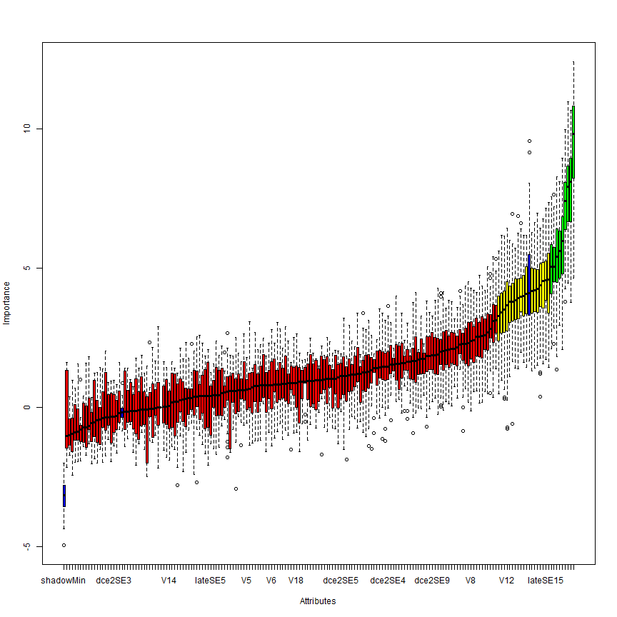 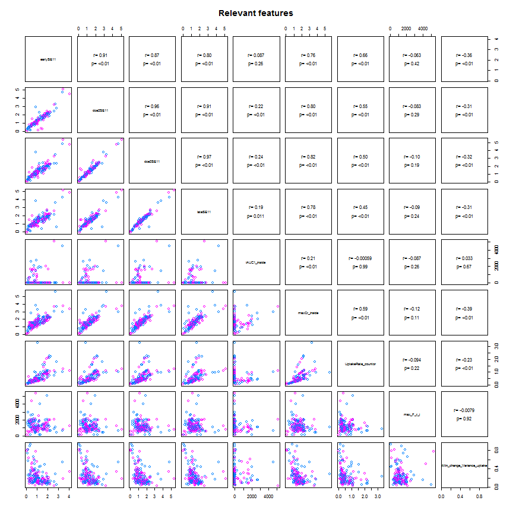 

```
## D:  2 T:  5 
## Area under the curve: 0.832
## Area under the curve: 0.811
## Area under the curve: 0.766
## Area under the curve: 0.727
## Area under the curve: 0.744
## Area under the curve: 0.767
## Area under the curve: 0.767
## Area under the curve: 0.642
## D:  5 T:  5 
## Area under the curve: 0.899
## Area under the curve: 0.876
## Area under the curve: 0.725
## Area under the curve: 0.51
## Area under the curve: 0.585
## Area under the curve: 0.483
## Area under the curve: 0.653
## Area under the curve: 0.597
## D:  10 T:  5 
## Area under the curve: 0.961
## Area under the curve: 0.965
## Area under the curve: 0.687
## Area under the curve: 0.507
## Area under the curve: 0.511
## Area under the curve: 0.648
## Area under the curve: 0.744
## Area under the curve: 0.534
## D:  20 T:  5 
## Area under the curve: 0.977
## Area under the curve: 0.969
## Area under the curve: 0.673
## Area under the curve: 0.509
## Area under the curve: 0.648
## Area under the curve: 0.557
## Area under the curve: 0.528
## Area under the curve: 0.432
## D:  2 T:  10 
## Area under the curve: 0.827
## Area under the curve: 0.818
## Area under the curve: 0.801
## Area under the curve: 0.564
## Area under the curve: 0.602
## Area under the curve: 0.364
## Area under the curve: 0.659
## Area under the curve: 0.511
## D:  5 T:  10 
## Area under the curve: 0.932
## Area under the curve: 0.912
## Area under the curve: 0.759
## Area under the curve: 0.622
## Area under the curve: 0.534
## Area under the curve: 0.693
## Area under the curve: 0.727
## Area under the curve: 0.648
## D:  10 T:  10 
## Area under the curve: 0.992
## Area under the curve: 0.976
## Area under the curve: 0.669
## Area under the curve: 0.57
## Area under the curve: 0.568
## Area under the curve: 0.477
## Area under the curve: 0.716
## Area under the curve: 0.716
## D:  20 T:  10 
## Area under the curve: 0.98
## Area under the curve: 0.973
## Area under the curve: 0.724
## Area under the curve: 0.489
## Area under the curve: 0.614
## Area under the curve: 0.648
## Area under the curve: 0.636
## Area under the curve: 0.534
## D:  2 T:  30 
## Area under the curve: 0.848
## Area under the curve: 0.827
## Area under the curve: 0.784
## Area under the curve: 0.635
## Area under the curve: 0.602
## Area under the curve: 0.636
## Area under the curve: 0.636
## Area under the curve: 0.58
## D:  5 T:  30 
## Area under the curve: 0.984
## Area under the curve: 0.95
## Area under the curve: 0.784
## Area under the curve: 0.645
## Area under the curve: 0.557
## Area under the curve: 0.614
## Area under the curve: 0.716
## Area under the curve: 0.557
## D:  10 T:  30 
## Area under the curve: 0.996
## Area under the curve: 0.981
## Area under the curve: 0.699
## Area under the curve: 0.666
## Area under the curve: 0.727
## Area under the curve: 0.773
## Area under the curve: 0.67
## Area under the curve: 0.568
## D:  20 T:  30 
## Area under the curve: 0.993
## Area under the curve: 0.983
## Area under the curve: 0.776
## Area under the curve: 0.559
## Area under the curve: 0.602
## Area under the curve: 0.659
## Area under the curve: 0.693
## Area under the curve: 0.614
## D:  2 T:  60 
## Area under the curve: 0.845
## Area under the curve: 0.82
## Area under the curve: 0.791
## Area under the curve: 0.557
## Area under the curve: 0.67
## Area under the curve: 0.682
## Area under the curve: 0.693
## Area under the curve: 0.523
## D:  5 T:  60 
## Area under the curve: 0.981
## Area under the curve: 0.947
## Area under the curve: 0.773
## Area under the curve: 0.642
## Area under the curve: 0.727
## Area under the curve: 0.727
## Area under the curve: 0.648
## Area under the curve: 0.591
## D:  10 T:  60 
## Area under the curve: 0.999
## Area under the curve: 0.993
## Area under the curve: 0.769
## Area under the curve: 0.522
## Area under the curve: 0.568
## Area under the curve: 0.58
## Area under the curve: 0.659
## Area under the curve: 0.5
## D:  20 T:  60 
## Area under the curve: 0.999
## Area under the curve: 0.994
## Area under the curve: 0.743
## Area under the curve: 0.589
## Area under the curve: 0.58
## Area under the curve: 0.682
## Area under the curve: 0.716
## Area under the curve: 0.466
## D:  2 T:  100 
## Area under the curve: 0.847
## Area under the curve: 0.824
## Area under the curve: 0.79
## Area under the curve: 0.618
## Area under the curve: 0.648
## Area under the curve: 0.648
## Area under the curve: 0.614
## Area under the curve: 0.58
## D:  5 T:  100 
## Area under the curve: 0.987
## Area under the curve: 0.948
## Area under the curve: 0.78
## Area under the curve: 0.611
## Area under the curve: 0.625
## Area under the curve: 0.705
## Area under the curve: 0.705
## Area under the curve: 0.591
## D:  10 T:  100 
## Area under the curve: 1
## Area under the curve: 0.993
## Area under the curve: 0.766
## Area under the curve: 0.588
## Area under the curve: 0.636
## Area under the curve: 0.636
## Area under the curve: 0.648
## Area under the curve: 0.523
## D:  20 T:  100 
## Area under the curve: 0.999
## Area under the curve: 0.993
## Area under the curve: 0.76
## Area under the curve: 0.516
## Area under the curve: 0.523
## Area under the curve: 0.614
## Area under the curve: 0.636
## Area under the curve: 0.602
## D:  2 T:  250 
## Area under the curve: 0.861
## Area under the curve: 0.836
## Area under the curve: 0.792
## Area under the curve: 0.578
## Area under the curve: 0.636
## Area under the curve: 0.648
## Area under the curve: 0.648
## Area under the curve: 0.443
## D:  5 T:  250 
## Area under the curve: 0.988
## Area under the curve: 0.95
## Area under the curve: 0.783
## Area under the curve: 0.588
## Area under the curve: 0.636
## Area under the curve: 0.67
## Area under the curve: 0.614
## Area under the curve: 0.5
## D:  10 T:  250 
## Area under the curve: 1
## Area under the curve: 0.99
## Area under the curve: 0.78
## Area under the curve: 0.565
## Area under the curve: 0.557
## Area under the curve: 0.614
## Area under the curve: 0.682
## Area under the curve: 0.568
## D:  20 T:  250 
## Area under the curve: 1
## Area under the curve: 0.992
## Area under the curve: 0.775
## Area under the curve: 0.549
## Area under the curve: 0.568
## Area under the curve: 0.636
## Area under the curve: 0.716
## Area under the curve: 0.489
## D:  2 T:  500 
## Area under the curve: 0.854
## Area under the curve: 0.83
## Area under the curve: 0.792
## Area under the curve: 0.598
## Area under the curve: 0.659
## Area under the curve: 0.659
## Area under the curve: 0.625
## Area under the curve: 0.591
## D:  5 T:  500 
## Area under the curve: 0.985
## Area under the curve: 0.947
## Area under the curve: 0.783
## Area under the curve: 0.604
## Area under the curve: 0.67
## Area under the curve: 0.716
## Area under the curve: 0.705
## Area under the curve: 0.545
## D:  10 T:  500 
## Area under the curve: 1
## Area under the curve: 0.995
## Area under the curve: 0.773
## Area under the curve: 0.561
## Area under the curve: 0.58
## Area under the curve: 0.693
## Area under the curve: 0.648
## Area under the curve: 0.557
## D:  20 T:  500 
## Area under the curve: 1
## Area under the curve: 0.994
## Area under the curve: 0.765
## Area under the curve: 0.572
## Area under the curve: 0.602
## Area under the curve: 0.716
## Area under the curve: 0.727
## Area under the curve: 0.455
## D:  2 T:  750 
## Area under the curve: 0.859
## Area under the curve: 0.83
## Area under the curve: 0.795
## Area under the curve: 0.557
## Area under the curve: 0.648
## Area under the curve: 0.659
## Area under the curve: 0.636
## Area under the curve: 0.523
## D:  5 T:  750 
## Area under the curve: 0.983
## Area under the curve: 0.944
## Area under the curve: 0.779
## Area under the curve: 0.617
## Area under the curve: 0.625
## Area under the curve: 0.659
## Area under the curve: 0.636
## Area under the curve: 0.523
## D:  10 T:  750 
## Area under the curve: 1
## Area under the curve: 0.994
## Area under the curve: 0.771
## Area under the curve: 0.573
## Area under the curve: 0.625
## Area under the curve: 0.659
## Area under the curve: 0.67
## Area under the curve: 0.477
## D:  20 T:  750 
## Area under the curve: 1
## Area under the curve: 0.996
## Area under the curve: 0.776
## Area under the curve: 0.576
## Area under the curve: 0.602
## Area under the curve: 0.693
## Area under the curve: 0.727
## Area under the curve: 0.455
##     x   y acuTrain rocTrain senTrain speTrain acuTest rocTest senTest
## 1   2   5   0.5429   0.7837   0.6087   0.8585  0.4444  0.7301   0.375
## 2   5   5   0.6612   0.7524   0.6812   0.8679  0.3704  0.5795   0.250
## 3  10   5   0.8122   0.7801   0.8406   0.9434  0.2963  0.6094   0.125
## 4  20   5   0.8245   0.7821   0.8261   0.9528  0.2963  0.5412   0.375
## 5   2  10   0.5265   0.7525   0.5072   0.8868  0.4074  0.5341   0.250
## 6   5  10   0.7020   0.8063   0.7971   0.8962  0.4074  0.6506   0.375
## 7  10  10   0.8898   0.8018   0.9130   0.9811  0.3704  0.6193   0.125
## 8  20  10   0.8531   0.7915   0.8841   0.9528  0.4074  0.6080   0.250
## 9   2  30   0.5633   0.7734   0.6377   0.8868  0.4815  0.6136   0.375
## 10  5  30   0.7878   0.8410   0.8406   0.9434  0.4444  0.6108   0.500
## 11 10  30   0.9061   0.8356   0.8551   1.0000  0.4815  0.6847   0.375
## 12 20  30   0.8857   0.8279   0.8986   0.9811  0.4815  0.6420   0.500
## 13  2  60   0.5388   0.7532   0.5507   0.8868  0.5185  0.6420   0.500
## 14  5  60   0.7796   0.8357   0.8261   0.9245  0.5185  0.6733   0.500
## 15 10  60   0.9306   0.8210   0.9275   1.0000  0.4444  0.5767   0.500
## 16 20  60   0.9347   0.8312   0.9275   1.0000  0.4444  0.6108   0.500
## 17  2 100   0.5347   0.7699   0.5217   0.8962  0.4815  0.6222   0.375
## 18  5 100   0.7959   0.8315   0.8551   0.9528  0.4815  0.6562   0.500
## 19 10 100   0.9429   0.8369   0.9275   1.0000  0.4444  0.6108   0.500
## 20 20 100   0.9469   0.8172   0.9420   1.0000  0.4074  0.5938   0.375
## 21  2 250   0.5429   0.7667   0.5652   0.8868  0.4815  0.5938   0.375
## 22  5 250   0.7837   0.8273   0.8116   0.9623  0.4815  0.6051   0.500
## 23 10 250   0.9469   0.8339   0.9420   1.0000  0.4815  0.6051   0.625
## 24 20 250   0.9429   0.8292   0.8986   1.0000  0.4074  0.6023   0.375
## 25  2 500   0.5347   0.7686   0.5507   0.8774  0.4815  0.6335   0.375
## 26  5 500   0.7673   0.8299   0.8261   0.9528  0.4444  0.6591   0.500
## 27 10 500   0.9347   0.8322   0.9130   1.0000  0.4074  0.6193   0.375
## 28 20 500   0.9306   0.8329   0.8986   1.0000  0.4074  0.6250   0.375
## 29  2 750   0.5429   0.7601   0.5652   0.8868  0.5185  0.6165   0.500
## 30  5 750   0.7633   0.8307   0.8261   0.9434  0.4444  0.6108   0.500
## 31 10 750   0.9510   0.8343   0.9130   1.0000  0.4444  0.6080   0.500
## 32 20 750   0.9429   0.8369   0.9130   1.0000  0.4074  0.6193   0.375
##    speTest
## 1   0.8182
## 2   0.6364
## 3   0.6364
## 4   0.3636
## 5   0.8182
## 6   0.7273
## 7   0.7273
## 8   0.7273
## 9   0.9091
## 10  0.7273
## 11  0.9091
## 12  0.7273
## 13  0.9091
## 14  0.9091
## 15  0.7273
## 16  0.7273
## 17  0.9091
## 18  0.8182
## 19  0.7273
## 20  0.7273
## 21  0.9091
## 22  0.8182
## 23  0.7273
## 24  0.7273
## 25  0.9091
## 26  0.7273
## 27  0.7273
## 28  0.7273
## 29  0.9091
## 30  0.7273
## 31  0.7273
## 32  0.7273
## Initial round 1: ..........
##  5  attributes rejected after this test:  skew_F_r_i k_Max_Margin_Grad max_RGH_mean_k max_RGH_var_k texture_dissimilarity_threeQuaRad 
## 
## Initial round 2: ..........
##  9  attributes rejected after this test:  maxVr_inside peakVr_inside Vr_post_1_inside Kpeak_countor maxVr_countor peakVr_countor iiiMax_Margin_Gradient ivVariance texture_dissimilarity_quarterRad 
## 
## Initial round 3: ..........
##  7  attributes rejected after this test:  Vr_post_1_countor edge_sharp_mean texture_contrast_halfRad texture_homogeneity_halfRad texture_correlation_quarterRad texture_correlation_halfRad texture_correlation_threeQuaRad 
## 
## Final round: ..........
##  11  attributes confirmed after this test:  alpha_inside Slope_ini_inside Tpeak_inside SER_inside maxCr_inside UptakeRate_inside washoutRate_inside UptakeRate_countor washoutRate_countor irregularity edge_sharp_std 
## 
##  17  attributes rejected after this test:  A_inside beta_inside Vr_increasingRate_inside beta_countor Vr_increasingRate_countor Vr_decreasingRate_countor var_F_r_i iMax_Variance_uptake texture_contrast_zero texture_contrast_quarterRad texture_contrast_threeQuaRad texture_homogeneity_zero texture_homogeneity_quarterRad texture_homogeneity_threeQuaRad texture_dissimilarity_zero texture_dissimilarity_halfRad texture_correlation_zero 
## ....
##  4  attributes confirmed after this test:  iAUC1_inside alpha_countor iiMin_change_Variance_uptake circularity 
## 
##  3  attributes rejected after this test:  A_countor iAUC1_countor peakCr_countor 
## ....
##  4  attributes confirmed after this test:  peakCr_inside texture_ASM_zero texture_ASM_quarterRad texture_ASM_halfRad 
## ...
##  2  attributes rejected after this test:  Tpeak_countor min_F_r_i 
## ......
##  1  attributes rejected after this test:  Kpeak_inside 
## ...
##  1  attributes rejected after this test:  SER_countor 
## ........
##  2  attributes confirmed after this test:  maxCr_countor max_F_r_i 
## 
##  1  attributes rejected after this test:  kurt_F_r_i 
## .............
##  1  attributes confirmed after this test:  mean_F_r_i 
## .......................
##  1  attributes confirmed after this test:  max_RGH_var 
## ..........................
##  1  attributes confirmed after this test:  max_RGH_mean 
## 
## Boruta performed 130 randomForest runs in 4.742 mins.
##         24 attributes confirmed important: alpha_inside
## iAUC1_inside Slope_ini_inside Tpeak_inside SER_inside maxCr_inside
## peakCr_inside UptakeRate_inside washoutRate_inside alpha_countor
## maxCr_countor UptakeRate_countor washoutRate_countor max_F_r_i
## mean_F_r_i iiMin_change_Variance_uptake circularity irregularity
## edge_sharp_std max_RGH_mean max_RGH_var texture_ASM_zero
## texture_ASM_quarterRad texture_ASM_halfRad
##         46 attributes confirmed unimportant: A_inside beta_inside
## Kpeak_inside maxVr_inside peakVr_inside Vr_increasingRate_inside
## Vr_post_1_inside A_countor beta_countor iAUC1_countor
## Tpeak_countor Kpeak_countor SER_countor peakCr_countor
## maxVr_countor peakVr_countor Vr_increasingRate_countor
## Vr_decreasingRate_countor Vr_post_1_countor min_F_r_i var_F_r_i
## skew_F_r_i kurt_F_r_i iMax_Variance_uptake iiiMax_Margin_Gradient
## k_Max_Margin_Grad ivVariance edge_sharp_mean max_RGH_mean_k
## max_RGH_var_k texture_contrast_zero texture_contrast_quarterRad
## texture_contrast_halfRad texture_contrast_threeQuaRad
## texture_homogeneity_zero texture_homogeneity_quarterRad
## texture_homogeneity_halfRad texture_homogeneity_threeQuaRad
## texture_dissimilarity_zero texture_dissimilarity_quarterRad
## texture_dissimilarity_halfRad texture_dissimilarity_threeQuaRad
## texture_correlation_zero texture_correlation_quarterRad
## texture_correlation_halfRad texture_correlation_threeQuaRad
##         2 tentative attributes left: Vr_decreasingRate_inside
## Slope_ini_countor
```

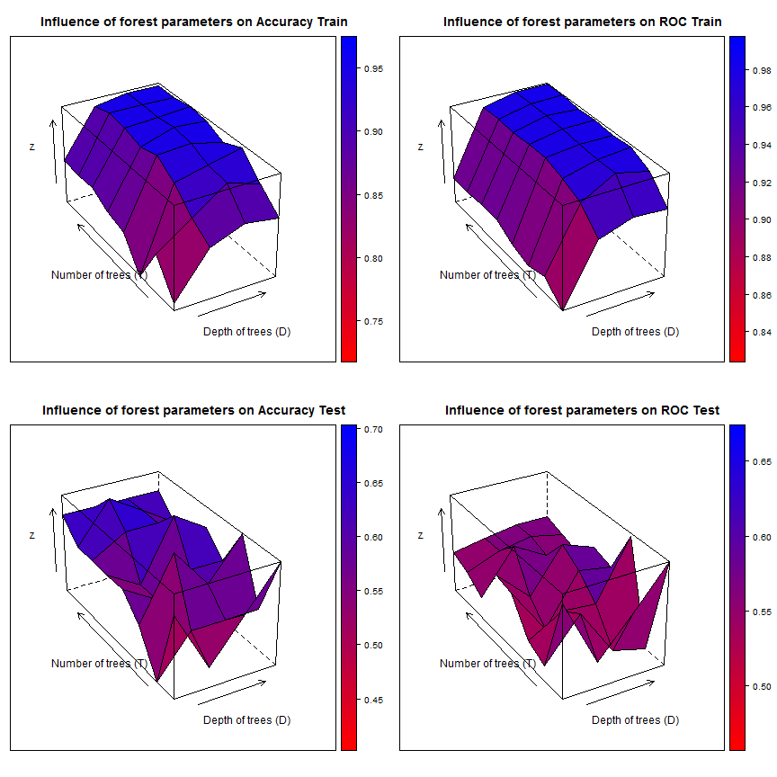 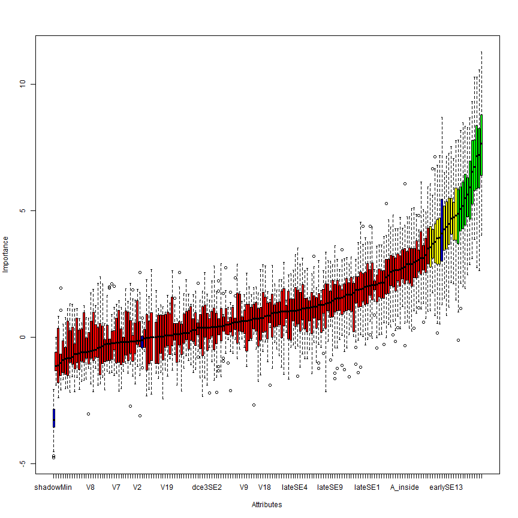 

```
## D:  2 T:  5 
## Area under the curve: 0.805
## Area under the curve: 0.786
## Area under the curve: 0.718
## Area under the curve: 0.501
## Area under the curve: 0.776
## Area under the curve: 0.818
## Area under the curve: 0.703
## Area under the curve: 0.505
## D:  5 T:  5 
## Area under the curve: 0.89
## Area under the curve: 0.901
## Area under the curve: 0.616
## Area under the curve: 0.631
## Area under the curve: 0.562
## Area under the curve: 0.5
## Area under the curve: 0.594
## Area under the curve: 0.74
## D:  10 T:  5 
## Area under the curve: 0.934
## Area under the curve: 0.952
## Area under the curve: 0.688
## Area under the curve: 0.569
## Area under the curve: 0.562
## Area under the curve: 0.615
## Area under the curve: 0.859
## Area under the curve: 0.458
## D:  20 T:  5 
## Area under the curve: 0.968
## Area under the curve: 0.958
## Area under the curve: 0.661
## Area under the curve: 0.475
## Area under the curve: 0.698
## Area under the curve: 0.656
## Area under the curve: 0.589
## Area under the curve: 0.5
## D:  2 T:  10 
## Area under the curve: 0.843
## Area under the curve: 0.818
## Area under the curve: 0.76
## Area under the curve: 0.657
## Area under the curve: 0.656
## Area under the curve: 0.688
## Area under the curve: 0.667
## Area under the curve: 0.552
## D:  5 T:  10 
## Area under the curve: 0.924
## Area under the curve: 0.903
## Area under the curve: 0.762
## Area under the curve: 0.588
## Area under the curve: 0.75
## Area under the curve: 0.635
## Area under the curve: 0.667
## Area under the curve: 0.521
## D:  10 T:  10 
## Area under the curve: 0.978
## Area under the curve: 0.977
## Area under the curve: 0.708
## Area under the curve: 0.603
## Area under the curve: 0.615
## Area under the curve: 0.708
## Area under the curve: 0.708
## Area under the curve: 0.604
## D:  20 T:  10 
## Area under the curve: 0.987
## Area under the curve: 0.988
## Area under the curve: 0.701
## Area under the curve: 0.627
## Area under the curve: 0.531
## Area under the curve: 0.625
## Area under the curve: 0.745
## Area under the curve: 0.74
## D:  2 T:  30 
## Area under the curve: 0.852
## Area under the curve: 0.821
## Area under the curve: 0.775
## Area under the curve: 0.597
## Area under the curve: 0.677
## Area under the curve: 0.646
## Area under the curve: 0.677
## Area under the curve: 0.573
## D:  5 T:  30 
## Area under the curve: 0.976
## Area under the curve: 0.947
## Area under the curve: 0.757
## Area under the curve: 0.58
## Area under the curve: 0.594
## Area under the curve: 0.667
## Area under the curve: 0.74
## Area under the curve: 0.646
## D:  10 T:  30 
## Area under the curve: 0.998
## Area under the curve: 0.988
## Area under the curve: 0.716
## Area under the curve: 0.585
## Area under the curve: 0.604
## Area under the curve: 0.677
## Area under the curve: 0.781
## Area under the curve: 0.583
## D:  20 T:  30 
## Area under the curve: 0.998
## Area under the curve: 0.986
## Area under the curve: 0.746
## Area under the curve: 0.475
## Area under the curve: 0.729
## Area under the curve: 0.75
## Area under the curve: 0.74
## Area under the curve: 0.469
## D:  2 T:  60 
## Area under the curve: 0.861
## Area under the curve: 0.844
## Area under the curve: 0.786
## Area under the curve: 0.617
## Area under the curve: 0.656
## Area under the curve: 0.656
## Area under the curve: 0.625
## Area under the curve: 0.417
## D:  5 T:  60 
## Area under the curve: 0.976
## Area under the curve: 0.948
## Area under the curve: 0.763
## Area under the curve: 0.635
## Area under the curve: 0.615
## Area under the curve: 0.656
## Area under the curve: 0.75
## Area under the curve: 0.438
## D:  10 T:  60 
## Area under the curve: 0.999
## Area under the curve: 0.99
## Area under the curve: 0.729
## Area under the curve: 0.542
## Area under the curve: 0.708
## Area under the curve: 0.708
## Area under the curve: 0.74
## Area under the curve: 0.49
## D:  20 T:  60 
## Area under the curve: 1
## Area under the curve: 0.997
## Area under the curve: 0.741
## Area under the curve: 0.617
## Area under the curve: 0.667
## Area under the curve: 0.667
## Area under the curve: 0.719
## Area under the curve: 0.542
## D:  2 T:  100 
## Area under the curve: 0.856
## Area under the curve: 0.825
## Area under the curve: 0.791
## Area under the curve: 0.614
## Area under the curve: 0.688
## Area under the curve: 0.667
## Area under the curve: 0.698
## Area under the curve: 0.448
## D:  5 T:  100 
## Area under the curve: 0.979
## Area under the curve: 0.949
## Area under the curve: 0.756
## Area under the curve: 0.599
## Area under the curve: 0.615
## Area under the curve: 0.688
## Area under the curve: 0.719
## Area under the curve: 0.458
## D:  10 T:  100 
## Area under the curve: 1
## Area under the curve: 0.991
## Area under the curve: 0.759
## Area under the curve: 0.569
## Area under the curve: 0.635
## Area under the curve: 0.688
## Area under the curve: 0.729
## Area under the curve: 0.552
## D:  20 T:  100 
## Area under the curve: 0.999
## Area under the curve: 0.989
## Area under the curve: 0.764
## Area under the curve: 0.557
## Area under the curve: 0.604
## Area under the curve: 0.646
## Area under the curve: 0.771
## Area under the curve: 0.562
## D:  2 T:  250 
## Area under the curve: 0.863
## Area under the curve: 0.832
## Area under the curve: 0.783
## Area under the curve: 0.624
## Area under the curve: 0.635
## Area under the curve: 0.646
## Area under the curve: 0.667
## Area under the curve: 0.604
## D:  5 T:  250 
## Area under the curve: 0.974
## Area under the curve: 0.943
## Area under the curve: 0.773
## Area under the curve: 0.603
## Area under the curve: 0.698
## Area under the curve: 0.708
## Area under the curve: 0.729
## Area under the curve: 0.438
## D:  10 T:  250 
## Area under the curve: 1
## Area under the curve: 0.992
## Area under the curve: 0.769
## Area under the curve: 0.569
## Area under the curve: 0.667
## Area under the curve: 0.656
## Area under the curve: 0.719
## Area under the curve: 0.458
## D:  20 T:  250 
## Area under the curve: 1
## Area under the curve: 0.993
## Area under the curve: 0.755
## Area under the curve: 0.549
## Area under the curve: 0.635
## Area under the curve: 0.656
## Area under the curve: 0.719
## Area under the curve: 0.49
## D:  2 T:  500 
## Area under the curve: 0.857
## Area under the curve: 0.828
## Area under the curve: 0.782
## Area under the curve: 0.607
## Area under the curve: 0.677
## Area under the curve: 0.656
## Area under the curve: 0.698
## Area under the curve: 0.573
## D:  5 T:  500 
## Area under the curve: 0.98
## Area under the curve: 0.947
## Area under the curve: 0.769
## Area under the curve: 0.603
## Area under the curve: 0.688
## Area under the curve: 0.698
## Area under the curve: 0.729
## Area under the curve: 0.542
## D:  10 T:  500 
## Area under the curve: 1
## Area under the curve: 0.993
## Area under the curve: 0.767
## Area under the curve: 0.567
## Area under the curve: 0.656
## Area under the curve: 0.677
## Area under the curve: 0.729
## Area under the curve: 0.479
## D:  20 T:  500 
## Area under the curve: 1
## Area under the curve: 0.99
## Area under the curve: 0.765
## Area under the curve: 0.592
## Area under the curve: 0.646
## Area under the curve: 0.688
## Area under the curve: 0.719
## Area under the curve: 0.479
## D:  2 T:  750 
## Area under the curve: 0.858
## Area under the curve: 0.829
## Area under the curve: 0.787
## Area under the curve: 0.615
## Area under the curve: 0.698
## Area under the curve: 0.656
## Area under the curve: 0.708
## Area under the curve: 0.594
## D:  5 T:  750 
## Area under the curve: 0.983
## Area under the curve: 0.953
## Area under the curve: 0.778
## Area under the curve: 0.607
## Area under the curve: 0.667
## Area under the curve: 0.698
## Area under the curve: 0.719
## Area under the curve: 0.448
## D:  10 T:  750 
## Area under the curve: 1
## Area under the curve: 0.992
## Area under the curve: 0.769
## Area under the curve: 0.577
## Area under the curve: 0.677
## Area under the curve: 0.677
## Area under the curve: 0.729
## Area under the curve: 0.448
## D:  20 T:  750 
## Area under the curve: 1
## Area under the curve: 0.995
## Area under the curve: 0.769
## Area under the curve: 0.577
## Area under the curve: 0.656
## Area under the curve: 0.677
## Area under the curve: 0.75
## Area under the curve: 0.448
##     x   y acuTrain rocTrain senTrain speTrain acuTest rocTest senTest
## 1   2   5   0.5369   0.7024   0.4928   0.8952  0.4643  0.7005   0.375
## 2   5   5   0.6680   0.7595   0.7681   0.8381  0.3929  0.5990   0.125
## 3  10   5   0.7664   0.7856   0.6667   0.9143  0.3571  0.6237   0.250
## 4  20   5   0.7951   0.7656   0.8696   0.9238  0.4643  0.6107   0.500
## 5   2  10   0.5451   0.7695   0.5652   0.8952  0.5000  0.6406   0.500
## 6   5  10   0.6926   0.7940   0.7391   0.9048  0.4643  0.6432   0.375
## 7  10  10   0.8402   0.8164   0.8696   0.9619  0.4286  0.6589   0.250
## 8  20  10   0.8689   0.8258   0.9710   0.9333  0.3571  0.6602   0.000
## 9   2  30   0.5410   0.7611   0.5797   0.8762  0.5000  0.6432   0.500
## 10  5  30   0.7500   0.8151   0.8406   0.9333  0.4286  0.6615   0.375
## 11 10  30   0.9139   0.8218   0.8841   0.9905  0.3929  0.6615   0.125
## 12 20  30   0.9139   0.8011   0.9130   0.9905  0.5000  0.6719   0.375
## 13  2  60   0.5492   0.7768   0.5942   0.8857  0.5000  0.5885   0.500
## 14  5  60   0.7869   0.8305   0.8696   0.9619  0.4643  0.6146   0.500
## 15 10  60   0.9303   0.8149   0.9275   1.0000  0.4286  0.6615   0.250
## 16 20  60   0.9344   0.8385   0.9275   1.0000  0.4643  0.6484   0.375
## 17  2 100   0.5369   0.7714   0.6087   0.8476  0.5000  0.6250   0.500
## 18  5 100   0.7910   0.8209   0.8551   0.9429  0.4643  0.6198   0.375
## 19 10 100   0.9385   0.8296   0.9420   1.0000  0.4643  0.6510   0.375
## 20 20 100   0.9262   0.8274   0.8986   1.0000  0.4286  0.6458   0.250
## 21  2 250   0.5533   0.7757   0.5797   0.9048  0.5000  0.6380   0.500
## 22  5 250   0.7828   0.8231   0.8116   0.9429  0.4643  0.6432   0.375
## 23 10 250   0.9344   0.8324   0.9130   1.0000  0.4643  0.6250   0.375
## 24 20 250   0.9467   0.8243   0.9275   1.0000  0.4286  0.6250   0.250
## 25  2 500   0.5451   0.7686   0.5652   0.8952  0.5000  0.6510   0.500
## 26  5 500   0.7992   0.8249   0.8551   0.9524  0.5000  0.6641   0.500
## 27 10 500   0.9385   0.8319   0.9275   1.0000  0.4643  0.6354   0.375
## 28 20 500   0.9426   0.8369   0.9275   1.0000  0.4643  0.6328   0.375
## 29  2 750   0.5492   0.7721   0.5797   0.8952  0.5000  0.6641   0.500
## 30  5 750   0.8033   0.8304   0.8406   0.9524  0.4643  0.6328   0.375
## 31 10 750   0.9385   0.8345   0.9275   1.0000  0.4643  0.6328   0.375
## 32 20 750   0.9426   0.8352   0.9275   1.0000  0.4286  0.6328   0.250
##    speTest
## 1   0.8333
## 2   0.8333
## 3   0.5833
## 4   0.7500
## 5   0.8333
## 6   0.8333
## 7   0.7500
## 8   0.8333
## 9   0.8333
## 10  0.7500
## 11  0.8333
## 12  0.9167
## 13  0.8333
## 14  0.7500
## 15  0.8333
## 16  0.8333
## 17  0.8333
## 18  0.8333
## 19  0.8333
## 20  0.8333
## 21  0.8333
## 22  0.8333
## 23  0.8333
## 24  0.8333
## 25  0.8333
## 26  0.8333
## 27  0.8333
## 28  0.8333
## 29  0.8333
## 30  0.8333
## 31  0.8333
## 32  0.8333
## Initial round 1: ..........
##  9  attributes rejected after this test:  peakVr_inside peakVr_countor Vr_decreasingRate_countor skew_F_r_i k_Max_Margin_Grad max_RGH_var_k texture_homogeneity_quarterRad texture_dissimilarity_quarterRad texture_correlation_halfRad 
## 
## Initial round 2: ..........
##  13  attributes rejected after this test:  Vr_increasingRate_inside Vr_post_1_inside beta_countor Kpeak_countor peakCr_countor maxVr_countor iiiMax_Margin_Gradient ivVariance max_RGH_mean_k texture_contrast_quarterRad texture_homogeneity_halfRad texture_homogeneity_threeQuaRad texture_dissimilarity_halfRad 
## 
## Initial round 3: ..........
##  5  attributes rejected after this test:  maxVr_inside Tpeak_countor Vr_post_1_countor texture_contrast_zero texture_correlation_quarterRad 
## 
## Final round: ..........
##  11  attributes confirmed after this test:  iAUC1_inside Slope_ini_inside SER_inside maxCr_inside peakCr_inside UptakeRate_inside washoutRate_inside Slope_ini_countor UptakeRate_countor iiMin_change_Variance_uptake texture_ASM_quarterRad 
## 
##  10  attributes rejected after this test:  Vr_decreasingRate_inside iAUC1_countor min_F_r_i var_F_r_i kurt_F_r_i edge_sharp_mean texture_homogeneity_zero texture_dissimilarity_zero texture_dissimilarity_threeQuaRad texture_correlation_threeQuaRad 
## ....
##  4  attributes confirmed after this test:  Tpeak_inside maxCr_countor circularity texture_ASM_zero 
## 
##  4  attributes rejected after this test:  beta_inside Kpeak_inside A_countor Vr_increasingRate_countor 
## ....
##  2  attributes confirmed after this test:  max_F_r_i irregularity 
## ...
##  2  attributes rejected after this test:  texture_contrast_halfRad texture_contrast_threeQuaRad 
## ...
##  1  attributes confirmed after this test:  texture_ASM_halfRad 
## .........
##  1  attributes rejected after this test:  iMax_Variance_uptake 
## .........................................
##  1  attributes confirmed after this test:  alpha_inside 
## .....
##  1  attributes rejected after this test:  texture_correlation_zero 
## ...................
##  1  attributes confirmed after this test:  mean_F_r_i 
## ..
## Boruta performed 130 randomForest runs in 4.856 mins.
##         20 attributes confirmed important: alpha_inside
## iAUC1_inside Slope_ini_inside Tpeak_inside SER_inside maxCr_inside
## peakCr_inside UptakeRate_inside washoutRate_inside
## Slope_ini_countor maxCr_countor UptakeRate_countor max_F_r_i
## mean_F_r_i iiMin_change_Variance_uptake circularity irregularity
## texture_ASM_zero texture_ASM_quarterRad texture_ASM_halfRad
##         45 attributes confirmed unimportant: beta_inside
## Kpeak_inside maxVr_inside peakVr_inside Vr_increasingRate_inside
## Vr_decreasingRate_inside Vr_post_1_inside A_countor beta_countor
## iAUC1_countor Tpeak_countor Kpeak_countor peakCr_countor
## maxVr_countor peakVr_countor Vr_increasingRate_countor
## Vr_decreasingRate_countor Vr_post_1_countor min_F_r_i var_F_r_i
## skew_F_r_i kurt_F_r_i iMax_Variance_uptake iiiMax_Margin_Gradient
## k_Max_Margin_Grad ivVariance edge_sharp_mean max_RGH_mean_k
## max_RGH_var_k texture_contrast_zero texture_contrast_quarterRad
## texture_contrast_halfRad texture_contrast_threeQuaRad
## texture_homogeneity_zero texture_homogeneity_quarterRad
## texture_homogeneity_halfRad texture_homogeneity_threeQuaRad
## texture_dissimilarity_zero texture_dissimilarity_quarterRad
## texture_dissimilarity_halfRad texture_dissimilarity_threeQuaRad
## texture_correlation_zero texture_correlation_quarterRad
## texture_correlation_halfRad texture_correlation_threeQuaRad
##         7 tentative attributes left: A_inside alpha_countor
## SER_countor washoutRate_countor edge_sharp_std max_RGH_mean
## max_RGH_var
```

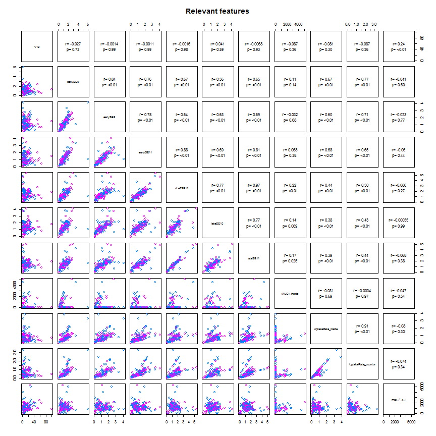 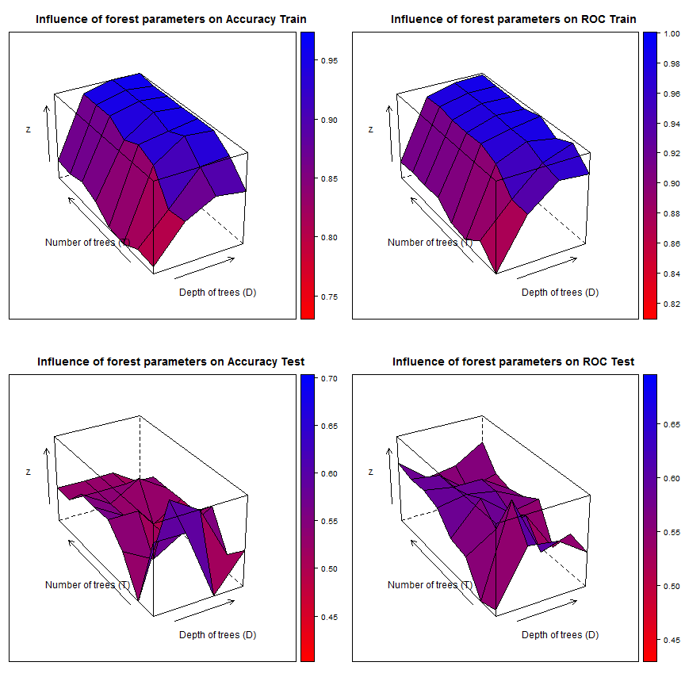 

```
## D:  2 T:  5 
## Area under the curve: 0.798
## Area under the curve: 0.806
## Area under the curve: 0.75
## Area under the curve: 0.578
## Area under the curve: 0.76
## Area under the curve: 0.708
## Area under the curve: 0.635
## Area under the curve: 0.688
## D:  5 T:  5 
## Area under the curve: 0.932
## Area under the curve: 0.918
## Area under the curve: 0.661
## Area under the curve: 0.485
## Area under the curve: 0.74
## Area under the curve: 0.865
## Area under the curve: 0.693
## Area under the curve: 0.74
## D:  10 T:  5 
## Area under the curve: 0.948
## Area under the curve: 0.923
## Area under the curve: 0.612
## Area under the curve: 0.546
## Area under the curve: 0.76
## Area under the curve: 0.802
## Area under the curve: 0.594
## Area under the curve: 0.635
## D:  20 T:  5 
## Area under the curve: 0.952
## Area under the curve: 0.942
## Area under the curve: 0.675
## Area under the curve: 0.529
## Area under the curve: 0.62
## Area under the curve: 0.688
## Area under the curve: 0.708
## Area under the curve: 0.542
## D:  2 T:  10 
## Area under the curve: 0.809
## Area under the curve: 0.788
## Area under the curve: 0.77
## Area under the curve: 0.662
## Area under the curve: 0.646
## Area under the curve: 0.708
## Area under the curve: 0.698
## Area under the curve: 0.646
## D:  5 T:  10 
## Area under the curve: 0.935
## Area under the curve: 0.905
## Area under the curve: 0.717
## Area under the curve: 0.567
## Area under the curve: 0.729
## Area under the curve: 0.719
## Area under the curve: 0.677
## Area under the curve: 0.521
## D:  10 T:  10 
## Area under the curve: 0.988
## Area under the curve: 0.975
## Area under the curve: 0.722
## Area under the curve: 0.519
## Area under the curve: 0.823
## Area under the curve: 0.781
## Area under the curve: 0.542
## Area under the curve: 0.552
## D:  20 T:  10 
## Area under the curve: 0.978
## Area under the curve: 0.972
## Area under the curve: 0.648
## Area under the curve: 0.599
## Area under the curve: 0.615
## Area under the curve: 0.562
## Area under the curve: 0.594
## Area under the curve: 0.615
## D:  2 T:  30 
## Area under the curve: 0.838
## Area under the curve: 0.819
## Area under the curve: 0.78
## Area under the curve: 0.659
## Area under the curve: 0.812
## Area under the curve: 0.781
## Area under the curve: 0.771
## Area under the curve: 0.698
## D:  5 T:  30 
## Area under the curve: 0.976
## Area under the curve: 0.944
## Area under the curve: 0.76
## Area under the curve: 0.589
## Area under the curve: 0.781
## Area under the curve: 0.792
## Area under the curve: 0.677
## Area under the curve: 0.719
## D:  10 T:  30 
## Area under the curve: 0.997
## Area under the curve: 0.988
## Area under the curve: 0.753
## Area under the curve: 0.613
## Area under the curve: 0.781
## Area under the curve: 0.76
## Area under the curve: 0.729
## Area under the curve: 0.646
## D:  20 T:  30 
## Area under the curve: 0.998
## Area under the curve: 0.986
## Area under the curve: 0.751
## Area under the curve: 0.594
## Area under the curve: 0.729
## Area under the curve: 0.729
## Area under the curve: 0.708
## Area under the curve: 0.781
## D:  2 T:  60 
## Area under the curve: 0.846
## Area under the curve: 0.822
## Area under the curve: 0.784
## Area under the curve: 0.662
## Area under the curve: 0.844
## Area under the curve: 0.74
## Area under the curve: 0.729
## Area under the curve: 0.708
## D:  5 T:  60 
## Area under the curve: 0.981
## Area under the curve: 0.942
## Area under the curve: 0.765
## Area under the curve: 0.654
## Area under the curve: 0.792
## Area under the curve: 0.719
## Area under the curve: 0.708
## Area under the curve: 0.583
## D:  10 T:  60 
## Area under the curve: 0.998
## Area under the curve: 0.991
## Area under the curve: 0.782
## Area under the curve: 0.454
## Area under the curve: 0.74
## Area under the curve: 0.698
## Area under the curve: 0.781
## Area under the curve: 0.542
## D:  20 T:  60 
## Area under the curve: 0.999
## Area under the curve: 0.989
## Area under the curve: 0.762
## Area under the curve: 0.594
## Area under the curve: 0.792
## Area under the curve: 0.771
## Area under the curve: 0.698
## Area under the curve: 0.427
## D:  2 T:  100 
## Area under the curve: 0.849
## Area under the curve: 0.825
## Area under the curve: 0.791
## Area under the curve: 0.684
## Area under the curve: 0.781
## Area under the curve: 0.781
## Area under the curve: 0.74
## Area under the curve: 0.75
## D:  5 T:  100 
## Area under the curve: 0.976
## Area under the curve: 0.938
## Area under the curve: 0.77
## Area under the curve: 0.616
## Area under the curve: 0.802
## Area under the curve: 0.74
## Area under the curve: 0.698
## Area under the curve: 0.562
## D:  10 T:  100 
## Area under the curve: 0.999
## Area under the curve: 0.987
## Area under the curve: 0.757
## Area under the curve: 0.636
## Area under the curve: 0.781
## Area under the curve: 0.76
## Area under the curve: 0.74
## Area under the curve: 0.594
## D:  20 T:  100 
## Area under the curve: 0.998
## Area under the curve: 0.99
## Area under the curve: 0.745
## Area under the curve: 0.633
## Area under the curve: 0.771
## Area under the curve: 0.771
## Area under the curve: 0.729
## Area under the curve: 0.406
## D:  2 T:  250 
## Area under the curve: 0.853
## Area under the curve: 0.822
## Area under the curve: 0.773
## Area under the curve: 0.691
## Area under the curve: 0.823
## Area under the curve: 0.75
## Area under the curve: 0.729
## Area under the curve: 0.667
## D:  5 T:  250 
## Area under the curve: 0.987
## Area under the curve: 0.945
## Area under the curve: 0.775
## Area under the curve: 0.616
## Area under the curve: 0.781
## Area under the curve: 0.75
## Area under the curve: 0.708
## Area under the curve: 0.677
## D:  10 T:  250 
## Area under the curve: 1
## Area under the curve: 0.994
## Area under the curve: 0.771
## Area under the curve: 0.594
## Area under the curve: 0.781
## Area under the curve: 0.771
## Area under the curve: 0.74
## Area under the curve: 0.729
## D:  20 T:  250 
## Area under the curve: 1
## Area under the curve: 0.993
## Area under the curve: 0.761
## Area under the curve: 0.601
## Area under the curve: 0.823
## Area under the curve: 0.781
## Area under the curve: 0.729
## Area under the curve: 0.625
## D:  2 T:  500 
## Area under the curve: 0.859
## Area under the curve: 0.827
## Area under the curve: 0.785
## Area under the curve: 0.682
## Area under the curve: 0.802
## Area under the curve: 0.781
## Area under the curve: 0.729
## Area under the curve: 0.688
## D:  5 T:  500 
## Area under the curve: 0.986
## Area under the curve: 0.945
## Area under the curve: 0.768
## Area under the curve: 0.619
## Area under the curve: 0.792
## Area under the curve: 0.75
## Area under the curve: 0.75
## Area under the curve: 0.646
## D:  10 T:  500 
## Area under the curve: 1
## Area under the curve: 0.992
## Area under the curve: 0.765
## Area under the curve: 0.61
## Area under the curve: 0.76
## Area under the curve: 0.771
## Area under the curve: 0.708
## Area under the curve: 0.448
## D:  20 T:  500 
## Area under the curve: 1
## Area under the curve: 0.993
## Area under the curve: 0.767
## Area under the curve: 0.612
## Area under the curve: 0.781
## Area under the curve: 0.771
## Area under the curve: 0.771
## Area under the curve: 0.646
## D:  2 T:  750 
## Area under the curve: 0.855
## Area under the curve: 0.821
## Area under the curve: 0.787
## Area under the curve: 0.665
## Area under the curve: 0.802
## Area under the curve: 0.771
## Area under the curve: 0.75
## Area under the curve: 0.719
## D:  5 T:  750 
## Area under the curve: 0.988
## Area under the curve: 0.947
## Area under the curve: 0.776
## Area under the curve: 0.635
## Area under the curve: 0.833
## Area under the curve: 0.76
## Area under the curve: 0.698
## Area under the curve: 0.646
## D:  10 T:  750 
## Area under the curve: 1
## Area under the curve: 0.992
## Area under the curve: 0.767
## Area under the curve: 0.586
## Area under the curve: 0.781
## Area under the curve: 0.771
## Area under the curve: 0.719
## Area under the curve: 0.625
## D:  20 T:  750 
## Area under the curve: 1
## Area under the curve: 0.995
## Area under the curve: 0.776
## Area under the curve: 0.617
## Area under the curve: 0.792
## Area under the curve: 0.76
## Area under the curve: 0.708
## Area under the curve: 0.625
##     x   y acuTrain rocTrain senTrain speTrain acuTest rocTest senTest
## 1   2   5   0.5265   0.7330   0.5362   0.8190  0.4815  0.6979   0.625
## 2   5   5   0.6653   0.7491   0.8261   0.8381  0.5556  0.7591   0.750
## 3  10   5   0.7755   0.7574   0.7971   0.8952  0.5926  0.6979   0.500
## 4  20   5   0.7714   0.7743   0.7971   0.9048  0.3333  0.6393   0.125
## 5   2  10   0.5265   0.7573   0.5507   0.8667  0.4074  0.6745   0.250
## 6   5  10   0.7265   0.7811   0.7536   0.8762  0.4815  0.6615   0.750
## 7  10  10   0.8327   0.8012   0.8696   0.9905  0.4815  0.6745   0.625
## 8  20  10   0.8327   0.7991   0.8696   0.9619  0.3333  0.5964   0.375
## 9   2  30   0.5224   0.7738   0.5217   0.8762  0.4815  0.7656   0.500
## 10  5  30   0.7633   0.8172   0.8696   0.9238  0.5556  0.7422   0.750
## 11 10  30   0.9102   0.8379   0.9130   1.0000  0.4815  0.7292   0.625
## 12 20  30   0.9061   0.8321   0.9130   0.9905  0.5185  0.7370   0.750
## 13  2  60   0.5347   0.7784   0.5507   0.8857  0.5185  0.7552   0.500
## 14  5  60   0.7592   0.8354   0.8406   0.9238  0.5556  0.7005   0.750
## 15 10  60   0.9306   0.8062   0.9275   0.9905  0.4815  0.6901   0.625
## 16 20  60   0.9347   0.8359   0.9275   1.0000  0.4815  0.6719   0.625
## 17  2 100   0.5265   0.7873   0.5217   0.8857  0.5185  0.7630   0.500
## 18  5 100   0.7796   0.8251   0.8116   0.9619  0.4815  0.7005   0.500
## 19 10 100   0.9347   0.8447   0.9130   1.0000  0.5185  0.7188   0.750
## 20 20 100   0.9061   0.8414   0.8841   0.9905  0.5185  0.6693   0.750
## 21  2 250   0.5347   0.7850   0.5507   0.8857  0.5185  0.7422   0.625
## 22  5 250   0.7429   0.8310   0.8261   0.9238  0.5185  0.7292   0.625
## 23 10 250   0.9347   0.8398   0.9420   1.0000  0.4815  0.7552   0.625
## 24 20 250   0.9510   0.8389   0.9275   1.0000  0.5185  0.7396   0.750
## 25  2 500   0.5306   0.7881   0.5507   0.8762  0.5185  0.7500   0.625
## 26  5 500   0.7551   0.8296   0.8261   0.9429  0.5185  0.7344   0.625
## 27 10 500   0.9388   0.8417   0.9275   1.0000  0.4815  0.6719   0.625
## 28 20 500   0.9347   0.8431   0.9275   1.0000  0.4815  0.7422   0.625
## 29  2 750   0.5306   0.7820   0.5507   0.8762  0.5185  0.7604   0.625
## 30  5 750   0.7592   0.8364   0.8261   0.9524  0.5185  0.7344   0.750
## 31 10 750   0.9265   0.8363   0.8986   1.0000  0.4815  0.7240   0.625
## 32 20 750   0.9265   0.8469   0.9130   1.0000  0.4815  0.7214   0.625
##    speTest
## 1   0.6667
## 2   0.7500
## 3   0.8333
## 4   0.6667
## 5   0.7500
## 6   0.5833
## 7   0.6667
## 8   0.5000
## 9   0.7500
## 10  0.7500
## 11  0.6667
## 12  0.6667
## 13  0.8333
## 14  0.7500
## 15  0.6667
## 16  0.6667
## 17  0.8333
## 18  0.7500
## 19  0.6667
## 20  0.6667
## 21  0.7500
## 22  0.7500
## 23  0.6667
## 24  0.6667
## 25  0.7500
## 26  0.7500
## 27  0.6667
## 28  0.6667
## 29  0.7500
## 30  0.6667
## 31  0.6667
## 32  0.6667
## Initial round 1: ..........
##  14  attributes rejected after this test:  maxVr_inside Vr_increasingRate_inside Vr_post_1_inside peakVr_countor k_Max_Margin_Grad ivVariance edge_sharp_mean max_RGH_var_k texture_homogeneity_quarterRad texture_dissimilarity_quarterRad texture_correlation_zero texture_correlation_quarterRad texture_correlation_halfRad texture_correlation_threeQuaRad 
## 
## Initial round 2: ..........
##  4  attributes rejected after this test:  beta_countor maxVr_countor Vr_post_1_countor max_RGH_mean_k 
## 
## Initial round 3: ..........
##  15  attributes rejected after this test:  Kpeak_inside peakVr_inside A_countor Kpeak_countor peakCr_countor Vr_increasingRate_countor min_F_r_i skew_F_r_i iiiMax_Margin_Gradient texture_contrast_quarterRad texture_contrast_threeQuaRad texture_homogeneity_halfRad texture_homogeneity_threeQuaRad texture_dissimilarity_zero texture_dissimilarity_halfRad 
## 
## Final round: ..........
##  3  attributes confirmed after this test:  Slope_ini_inside UptakeRate_inside UptakeRate_countor 
## 
##  4  attributes rejected after this test:  Tpeak_countor var_F_r_i texture_contrast_zero texture_dissimilarity_threeQuaRad 
## ....
##  3  attributes confirmed after this test:  iAUC1_inside maxCr_inside maxCr_countor 
## 
##  1  attributes rejected after this test:  Vr_decreasingRate_countor 
## ....
##  8  attributes confirmed after this test:  alpha_inside SER_inside washoutRate_inside Slope_ini_countor max_F_r_i iiMin_change_Variance_uptake texture_ASM_zero texture_ASM_quarterRad 
## 
##  3  attributes rejected after this test:  beta_inside Vr_decreasingRate_inside kurt_F_r_i 
## ...
##  2  attributes confirmed after this test:  SER_countor circularity 
## 
##  1  attributes rejected after this test:  iAUC1_countor 
## ...
##  3  attributes confirmed after this test:  Tpeak_inside peakCr_inside texture_ASM_halfRad 
## ......
##  1  attributes confirmed after this test:  A_inside 
## ...
##  2  attributes confirmed after this test:  washoutRate_countor mean_F_r_i 
## ..
##  1  attributes rejected after this test:  texture_contrast_halfRad 
## ...........
##  1  attributes confirmed after this test:  irregularity 
## ..........
##  1  attributes confirmed after this test:  alpha_countor 
## .........................
##  1  attributes rejected after this test:  iMax_Variance_uptake 
## ..
##  1  attributes rejected after this test:  texture_homogeneity_zero 
## .................
## Boruta performed 130 randomForest runs in 4.802 mins.
##         24 attributes confirmed important: A_inside alpha_inside
## iAUC1_inside Slope_ini_inside Tpeak_inside SER_inside maxCr_inside
## peakCr_inside UptakeRate_inside washoutRate_inside alpha_countor
## Slope_ini_countor SER_countor maxCr_countor UptakeRate_countor
## washoutRate_countor max_F_r_i mean_F_r_i
## iiMin_change_Variance_uptake circularity irregularity
## texture_ASM_zero texture_ASM_quarterRad texture_ASM_halfRad
##         45 attributes confirmed unimportant: beta_inside
## Kpeak_inside maxVr_inside peakVr_inside Vr_increasingRate_inside
## Vr_decreasingRate_inside Vr_post_1_inside A_countor beta_countor
## iAUC1_countor Tpeak_countor Kpeak_countor peakCr_countor
## maxVr_countor peakVr_countor Vr_increasingRate_countor
## Vr_decreasingRate_countor Vr_post_1_countor min_F_r_i var_F_r_i
## skew_F_r_i kurt_F_r_i iMax_Variance_uptake iiiMax_Margin_Gradient
## k_Max_Margin_Grad ivVariance edge_sharp_mean max_RGH_mean_k
## max_RGH_var_k texture_contrast_zero texture_contrast_quarterRad
## texture_contrast_halfRad texture_contrast_threeQuaRad
## texture_homogeneity_zero texture_homogeneity_quarterRad
## texture_homogeneity_halfRad texture_homogeneity_threeQuaRad
## texture_dissimilarity_zero texture_dissimilarity_quarterRad
## texture_dissimilarity_halfRad texture_dissimilarity_threeQuaRad
## texture_correlation_zero texture_correlation_quarterRad
## texture_correlation_halfRad texture_correlation_threeQuaRad
##         3 tentative attributes left: edge_sharp_std max_RGH_mean
## max_RGH_var
```

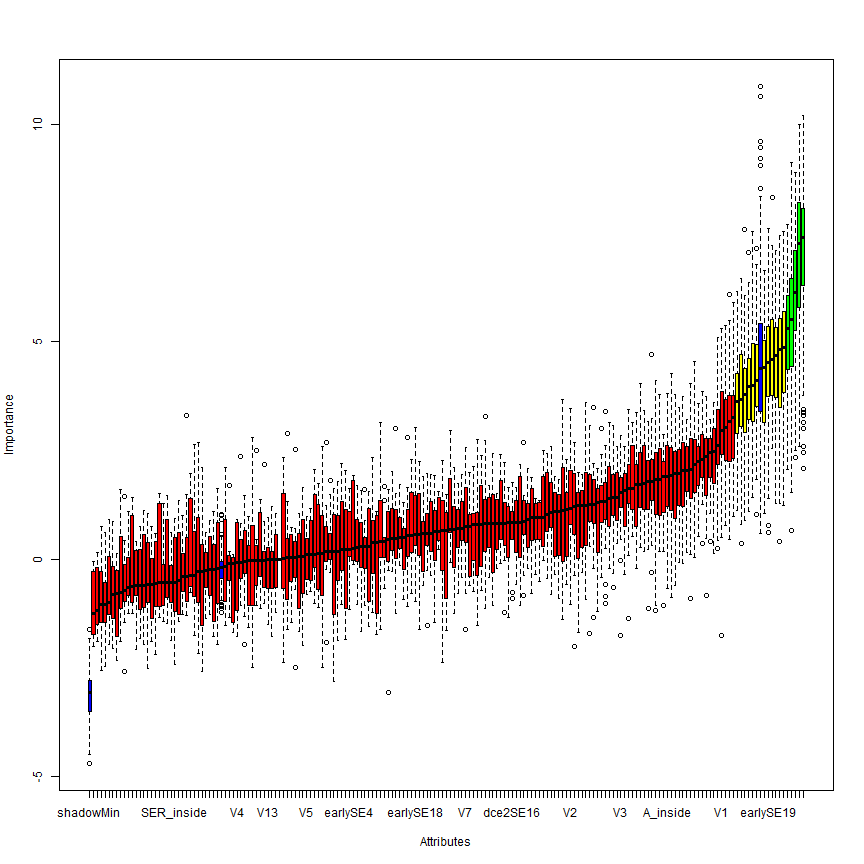 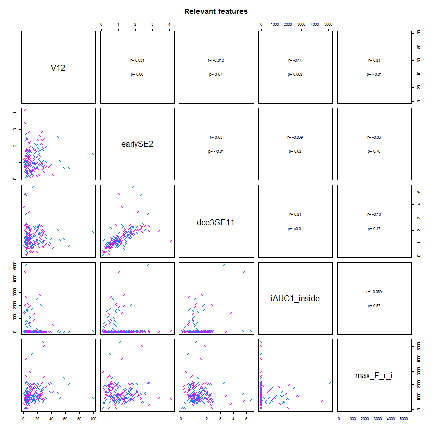 

```
## D:  2 T:  5 
## Area under the curve: 0.824
## Area under the curve: 0.816
## Area under the curve: 0.757
## Area under the curve: 0.6
## Area under the curve: 0.488
## Area under the curve: 0.524
## Area under the curve: 0.667
## Area under the curve: 0.607
## D:  5 T:  5 
## Area under the curve: 0.912
## Area under the curve: 0.903
## Area under the curve: 0.707
## Area under the curve: 0.667
## Area under the curve: 0.571
## Area under the curve: 0.5
## Area under the curve: 0.583
## Area under the curve: 0.69
## D:  10 T:  5 
## Area under the curve: 0.962
## Area under the curve: 0.944
## Area under the curve: 0.643
## Area under the curve: 0.551
## Area under the curve: 0.5
## Area under the curve: 0.595
## Area under the curve: 0.786
## Area under the curve: 0.47
## D:  20 T:  5 
## Area under the curve: 0.978
## Area under the curve: 0.982
## Area under the curve: 0.558
## Area under the curve: 0.556
## Area under the curve: 0.714
## Area under the curve: 0.607
## Area under the curve: 0.744
## Area under the curve: 0.655
## D:  2 T:  10 
## Area under the curve: 0.83
## Area under the curve: 0.815
## Area under the curve: 0.781
## Area under the curve: 0.476
## Area under the curve: 0.565
## Area under the curve: 0.565
## Area under the curve: 0.554
## Area under the curve: 0.637
## D:  5 T:  10 
## Area under the curve: 0.95
## Area under the curve: 0.924
## Area under the curve: 0.767
## Area under the curve: 0.545
## Area under the curve: 0.571
## Area under the curve: 0.524
## Area under the curve: 0.643
## Area under the curve: 0.56
## D:  10 T:  10 
## Area under the curve: 0.983
## Area under the curve: 0.972
## Area under the curve: 0.727
## Area under the curve: 0.551
## Area under the curve: 0.607
## Area under the curve: 0.619
## Area under the curve: 0.661
## Area under the curve: 0.607
## D:  20 T:  10 
## Area under the curve: 0.988
## Area under the curve: 0.978
## Area under the curve: 0.708
## Area under the curve: 0.585
## Area under the curve: 0.56
## Area under the curve: 0.643
## Area under the curve: 0.685
## Area under the curve: 0.5
## D:  2 T:  30 
## Area under the curve: 0.854
## Area under the curve: 0.836
## Area under the curve: 0.814
## Area under the curve: 0.593
## Area under the curve: 0.595
## Area under the curve: 0.571
## Area under the curve: 0.619
## Area under the curve: 0.595
## D:  5 T:  30 
## Area under the curve: 0.964
## Area under the curve: 0.931
## Area under the curve: 0.769
## Area under the curve: 0.601
## Area under the curve: 0.464
## Area under the curve: 0.548
## Area under the curve: 0.631
## Area under the curve: 0.583
## D:  10 T:  30 
## Area under the curve: 0.992
## Area under the curve: 0.981
## Area under the curve: 0.736
## Area under the curve: 0.586
## Area under the curve: 0.631
## Area under the curve: 0.548
## Area under the curve: 0.655
## Area under the curve: 0.595
## D:  20 T:  30 
## Area under the curve: 0.999
## Area under the curve: 0.992
## Area under the curve: 0.748
## Area under the curve: 0.559
## Area under the curve: 0.702
## Area under the curve: 0.69
## Area under the curve: 0.631
## Area under the curve: 0.5
## D:  2 T:  60 
## Area under the curve: 0.857
## Area under the curve: 0.835
## Area under the curve: 0.787
## Area under the curve: 0.636
## Area under the curve: 0.607
## Area under the curve: 0.524
## Area under the curve: 0.631
## Area under the curve: 0.631
## D:  5 T:  60 
## Area under the curve: 0.975
## Area under the curve: 0.955
## Area under the curve: 0.791
## Area under the curve: 0.62
## Area under the curve: 0.548
## Area under the curve: 0.536
## Area under the curve: 0.667
## Area under the curve: 0.571
## D:  10 T:  60 
## Area under the curve: 0.999
## Area under the curve: 0.991
## Area under the curve: 0.738
## Area under the curve: 0.593
## Area under the curve: 0.607
## Area under the curve: 0.548
## Area under the curve: 0.607
## Area under the curve: 0.548
## D:  20 T:  60 
## Area under the curve: 0.997
## Area under the curve: 0.994
## Area under the curve: 0.768
## Area under the curve: 0.561
## Area under the curve: 0.631
## Area under the curve: 0.595
## Area under the curve: 0.631
## Area under the curve: 0.571
## D:  2 T:  100 
## Area under the curve: 0.859
## Area under the curve: 0.83
## Area under the curve: 0.79
## Area under the curve: 0.549
## Area under the curve: 0.583
## Area under the curve: 0.583
## Area under the curve: 0.595
## Area under the curve: 0.619
## D:  5 T:  100 
## Area under the curve: 0.973
## Area under the curve: 0.949
## Area under the curve: 0.791
## Area under the curve: 0.626
## Area under the curve: 0.536
## Area under the curve: 0.524
## Area under the curve: 0.667
## Area under the curve: 0.56
## D:  10 T:  100 
## Area under the curve: 0.999
## Area under the curve: 0.99
## Area under the curve: 0.77
## Area under the curve: 0.579
## Area under the curve: 0.5
## Area under the curve: 0.464
## Area under the curve: 0.56
## Area under the curve: 0.595
## D:  20 T:  100 
## Area under the curve: 1
## Area under the curve: 0.996
## Area under the curve: 0.769
## Area under the curve: 0.59
## Area under the curve: 0.571
## Area under the curve: 0.536
## Area under the curve: 0.619
## Area under the curve: 0.595
## D:  2 T:  250 
## Area under the curve: 0.862
## Area under the curve: 0.835
## Area under the curve: 0.791
## Area under the curve: 0.596
## Area under the curve: 0.56
## Area under the curve: 0.512
## Area under the curve: 0.619
## Area under the curve: 0.643
## D:  5 T:  250 
## Area under the curve: 0.981
## Area under the curve: 0.951
## Area under the curve: 0.787
## Area under the curve: 0.604
## Area under the curve: 0.607
## Area under the curve: 0.548
## Area under the curve: 0.619
## Area under the curve: 0.56
## D:  10 T:  250 
## Area under the curve: 1
## Area under the curve: 0.994
## Area under the curve: 0.769
## Area under the curve: 0.571
## Area under the curve: 0.583
## Area under the curve: 0.488
## Area under the curve: 0.607
## Area under the curve: 0.583
## D:  20 T:  250 
## Area under the curve: 1
## Area under the curve: 0.996
## Area under the curve: 0.796
## Area under the curve: 0.461
## Area under the curve: 0.56
## Area under the curve: 0.512
## Area under the curve: 0.619
## Area under the curve: 0.595
## D:  2 T:  500 
## Area under the curve: 0.869
## Area under the curve: 0.844
## Area under the curve: 0.789
## Area under the curve: 0.637
## Area under the curve: 0.512
## Area under the curve: 0.512
## Area under the curve: 0.607
## Area under the curve: 0.548
## D:  5 T:  500 
## Area under the curve: 0.984
## Area under the curve: 0.953
## Area under the curve: 0.789
## Area under the curve: 0.601
## Area under the curve: 0.56
## Area under the curve: 0.524
## Area under the curve: 0.643
## Area under the curve: 0.631
## D:  10 T:  500 
## Area under the curve: 1
## Area under the curve: 0.995
## Area under the curve: 0.768
## Area under the curve: 0.574
## Area under the curve: 0.583
## Area under the curve: 0.512
## Area under the curve: 0.631
## Area under the curve: 0.583
## D:  20 T:  500 
## Area under the curve: 1
## Area under the curve: 0.994
## Area under the curve: 0.783
## Area under the curve: 0.577
## Area under the curve: 0.56
## Area under the curve: 0.524
## Area under the curve: 0.643
## Area under the curve: 0.536
## D:  2 T:  750 
## Area under the curve: 0.866
## Area under the curve: 0.843
## Area under the curve: 0.799
## Area under the curve: 0.61
## Area under the curve: 0.548
## Area under the curve: 0.536
## Area under the curve: 0.631
## Area under the curve: 0.607
## D:  5 T:  750 
## Area under the curve: 0.984
## Area under the curve: 0.957
## Area under the curve: 0.789
## Area under the curve: 0.607
## Area under the curve: 0.607
## Area under the curve: 0.524
## Area under the curve: 0.631
## Area under the curve: 0.571
## D:  10 T:  750 
## Area under the curve: 1
## Area under the curve: 0.995
## Area under the curve: 0.786
## Area under the curve: 0.569
## Area under the curve: 0.536
## Area under the curve: 0.524
## Area under the curve: 0.583
## Area under the curve: 0.548
## D:  20 T:  750 
## Area under the curve: 1
## Area under the curve: 0.994
## Area under the curve: 0.781
## Area under the curve: 0.571
## Area under the curve: 0.607
## Area under the curve: 0.512
## Area under the curve: 0.583
## Area under the curve: 0.571
##     x   y acuTrain rocTrain senTrain speTrain acuTest rocTest senTest
## 1   2   5   0.5469   0.7491   0.5571   0.8952  0.3704  0.5714  0.2857
## 2   5   5   0.7020   0.7972   0.7143   0.9429  0.3704  0.5863  0.2857
## 3  10   5   0.7918   0.7752   0.7286   0.9714  0.4444  0.5878  0.4286
## 4  20   5   0.8408   0.7686   0.9143   0.9429  0.4444  0.6801  0.4286
## 5   2  10   0.5184   0.7253   0.4714   0.8952  0.3333  0.5804  0.1429
## 6   5  10   0.7306   0.7967   0.7857   0.9048  0.4444  0.5744  0.4286
## 7  10  10   0.8694   0.8082   0.8571   0.9714  0.4074  0.6235  0.2857
## 8  20  10   0.8612   0.8148   0.9143   0.9714  0.5185  0.5967  0.2857
## 9   2  30   0.5469   0.7742   0.6286   0.8571  0.3704  0.5952  0.4286
## 10  5  30   0.7388   0.8163   0.7857   0.9238  0.3704  0.5565  0.4286
## 11 10  30   0.9020   0.8238   0.9143   0.9714  0.4074  0.6071  0.5714
## 12 20  30   0.9061   0.8247   0.9143   0.9905  0.4444  0.6310  0.4286
## 13  2  60   0.5551   0.7785   0.6143   0.8857  0.4074  0.5982  0.4286
## 14  5  60   0.7673   0.8354   0.8143   0.9619  0.4074  0.5804  0.4286
## 15 10  60   0.9184   0.8302   0.9286   1.0000  0.4444  0.5774  0.4286
## 16 20  60   0.9429   0.8301   0.9571   0.9905  0.3704  0.6071  0.4286
## 17  2 100   0.5469   0.7571   0.6000   0.8762  0.4074  0.5952  0.4286
## 18  5 100   0.7510   0.8347   0.8000   0.9619  0.3704  0.5714  0.4286
## 19 10 100   0.9265   0.8345   0.9000   1.0000  0.3704  0.5298  0.2857
## 20 20 100   0.9347   0.8386   0.9286   1.0000  0.4074  0.5804  0.5714
## 21  2 250   0.5592   0.7711   0.6143   0.8952  0.4074  0.5833  0.4286
## 22  5 250   0.7878   0.8307   0.8571   0.9524  0.3704  0.5833  0.4286
## 23 10 250   0.9388   0.8335   0.9286   1.0000  0.3704  0.5655  0.4286
## 24 20 250   0.9306   0.8131   0.9286   1.0000  0.3704  0.5714  0.4286
## 25  2 500   0.5510   0.7846   0.6000   0.8857  0.4074  0.5446  0.4286
## 26  5 500   0.7714   0.8319   0.8143   0.9524  0.3704  0.5893  0.4286
## 27 10 500   0.9429   0.8344   0.9143   1.0000  0.3333  0.5774  0.2857
## 28 20 500   0.9347   0.8386   0.9143   1.0000  0.3333  0.5655  0.2857
## 29  2 750   0.5469   0.7792   0.6000   0.8762  0.4074  0.5804  0.4286
## 30  5 750   0.7633   0.8341   0.8286   0.9619  0.3704  0.5833  0.4286
## 31 10 750   0.9510   0.8374   0.9429   1.0000  0.3704  0.5476  0.4286
## 32 20 750   0.9592   0.8362   0.9429   1.0000  0.3333  0.5685  0.2857
##    speTest
## 1   0.6667
## 2   0.6667
## 3   0.5833
## 4   0.6667
## 5   0.6667
## 6   0.6667
## 7   0.6667
## 8   0.7500
## 9   0.5833
## 10  0.5833
## 11  0.5833
## 12  0.6667
## 13  0.6667
## 14  0.5833
## 15  0.5833
## 16  0.5833
## 17  0.6667
## 18  0.5833
## 19  0.5833
## 20  0.5833
## 21  0.6667
## 22  0.5833
## 23  0.5833
## 24  0.5833
## 25  0.6667
## 26  0.5833
## 27  0.5833
## 28  0.5833
## 29  0.6667
## 30  0.5833
## 31  0.5833
## 32  0.5833
## Initial round 1: ..........
##  11  attributes rejected after this test:  maxVr_inside peakVr_inside beta_countor peakVr_countor Vr_decreasingRate_countor Vr_post_1_countor skew_F_r_i iiiMax_Margin_Gradient k_Max_Margin_Grad edge_sharp_mean max_RGH_var_k 
## 
## Initial round 2: ..........
##  10  attributes rejected after this test:  beta_inside Vr_increasingRate_inside Vr_post_1_inside Kpeak_countor min_F_r_i ivVariance texture_contrast_quarterRad texture_homogeneity_quarterRad texture_correlation_halfRad texture_correlation_threeQuaRad 
## 
## Initial round 3: ..........
##  6  attributes rejected after this test:  A_countor peakCr_countor var_F_r_i texture_dissimilarity_quarterRad texture_dissimilarity_halfRad texture_correlation_zero 
## 
## Final round: ..........
##  5  attributes confirmed after this test:  Slope_ini_inside Tpeak_inside UptakeRate_inside UptakeRate_countor texture_ASM_halfRad 
## 
##  3  attributes rejected after this test:  kurt_F_r_i iMax_Variance_uptake max_RGH_mean_k 
## ....
##  6  attributes confirmed after this test:  alpha_inside maxCr_inside Slope_ini_countor circularity texture_ASM_zero texture_ASM_quarterRad 
## 
##  3  attributes rejected after this test:  Vr_decreasingRate_inside iAUC1_countor maxVr_countor 
## ....
##  2  attributes confirmed after this test:  iAUC1_inside washoutRate_inside 
## 
##  4  attributes rejected after this test:  Kpeak_inside texture_dissimilarity_zero texture_dissimilarity_threeQuaRad texture_correlation_quarterRad 
## ...
##  3  attributes confirmed after this test:  SER_inside peakCr_inside iiMin_change_Variance_uptake 
## 
##  3  attributes rejected after this test:  Tpeak_countor washoutRate_countor texture_contrast_halfRad 
## ...
##  2  attributes confirmed after this test:  alpha_countor irregularity 
## 
##  4  attributes rejected after this test:  Vr_increasingRate_countor texture_contrast_threeQuaRad texture_homogeneity_halfRad texture_homogeneity_threeQuaRad 
## ...................
##  1  attributes confirmed after this test:  max_RGH_var 
## ......
##  1  attributes confirmed after this test:  max_F_r_i 
## 
##  1  attributes rejected after this test:  texture_contrast_zero 
## .......
##  1  attributes confirmed after this test:  max_RGH_mean 
## ........
##  1  attributes confirmed after this test:  maxCr_countor 
## ...............
##  1  attributes confirmed after this test:  mean_F_r_i 
## .....................
## Boruta performed 130 randomForest runs in 4.779 mins.
##         23 attributes confirmed important: alpha_inside
## iAUC1_inside Slope_ini_inside Tpeak_inside SER_inside maxCr_inside
## peakCr_inside UptakeRate_inside washoutRate_inside alpha_countor
## Slope_ini_countor maxCr_countor UptakeRate_countor max_F_r_i
## mean_F_r_i iiMin_change_Variance_uptake circularity irregularity
## max_RGH_mean max_RGH_var texture_ASM_zero texture_ASM_quarterRad
## texture_ASM_halfRad
##         45 attributes confirmed unimportant: beta_inside
## Kpeak_inside maxVr_inside peakVr_inside Vr_increasingRate_inside
## Vr_decreasingRate_inside Vr_post_1_inside A_countor beta_countor
## iAUC1_countor Tpeak_countor Kpeak_countor peakCr_countor
## washoutRate_countor maxVr_countor peakVr_countor
## Vr_increasingRate_countor Vr_decreasingRate_countor
## Vr_post_1_countor min_F_r_i var_F_r_i skew_F_r_i kurt_F_r_i
## iMax_Variance_uptake iiiMax_Margin_Gradient k_Max_Margin_Grad
## ivVariance edge_sharp_mean max_RGH_mean_k max_RGH_var_k
## texture_contrast_zero texture_contrast_quarterRad
## texture_contrast_halfRad texture_contrast_threeQuaRad
## texture_homogeneity_quarterRad texture_homogeneity_halfRad
## texture_homogeneity_threeQuaRad texture_dissimilarity_zero
## texture_dissimilarity_quarterRad texture_dissimilarity_halfRad
## texture_dissimilarity_threeQuaRad texture_correlation_zero
## texture_correlation_quarterRad texture_correlation_halfRad
## texture_correlation_threeQuaRad
##         4 tentative attributes left: A_inside SER_countor
## edge_sharp_std texture_homogeneity_zero
```

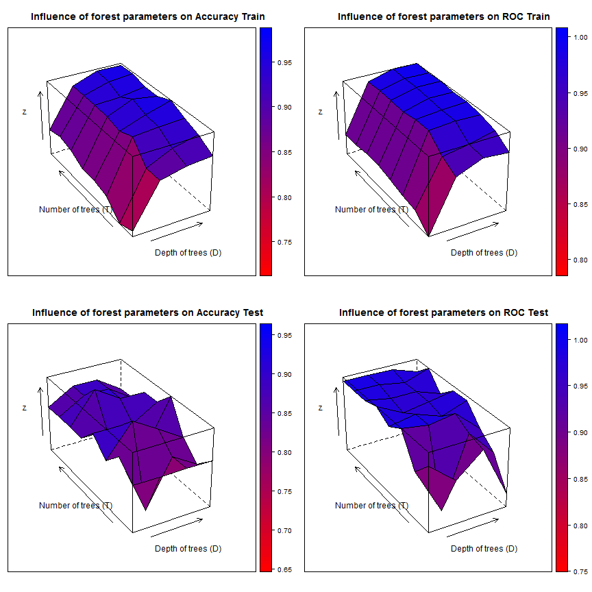 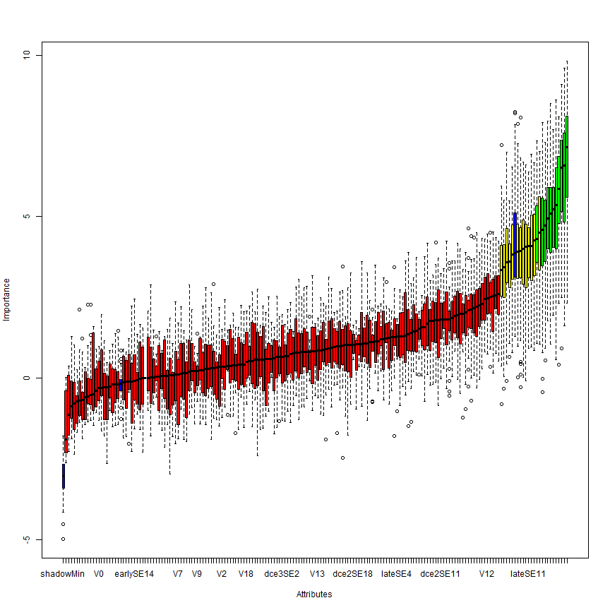 

```
## D:  2 T:  5 
## Area under the curve: 0.784
## Area under the curve: 0.774
## Area under the curve: 0.711
## Area under the curve: 0.51
## Area under the curve: 0.698
## Area under the curve: 0.719
## Area under the curve: 0.76
## Area under the curve: 0.615
## D:  5 T:  5 
## Area under the curve: 0.888
## Area under the curve: 0.886
## Area under the curve: 0.73
## Area under the curve: 0.646
## Area under the curve: 0.521
## Area under the curve: 0.75
## Area under the curve: 0.823
## Area under the curve: 0.719
## D:  10 T:  5 
## Area under the curve: 0.924
## Area under the curve: 0.933
## Area under the curve: 0.694
## Area under the curve: 0.551
## Area under the curve: 0.865
## Area under the curve: 0.75
## Area under the curve: 0.573
## Area under the curve: 0.542
## D:  20 T:  5 
## Area under the curve: 0.969
## Area under the curve: 0.965
## Area under the curve: 0.653
## Area under the curve: 0.59
## Area under the curve: 0.745
## Area under the curve: 0.667
## Area under the curve: 0.646
## Area under the curve: 0.63
## D:  2 T:  10 
## Area under the curve: 0.795
## Area under the curve: 0.752
## Area under the curve: 0.708
## Area under the curve: 0.645
## Area under the curve: 0.635
## Area under the curve: 0.677
## Area under the curve: 0.594
## Area under the curve: 0.646
## D:  5 T:  10 
## Area under the curve: 0.954
## Area under the curve: 0.929
## Area under the curve: 0.706
## Area under the curve: 0.573
## Area under the curve: 0.802
## Area under the curve: 0.74
## Area under the curve: 0.823
## Area under the curve: 0.552
## D:  10 T:  10 
## Area under the curve: 0.99
## Area under the curve: 0.979
## Area under the curve: 0.678
## Area under the curve: 0.544
## Area under the curve: 0.625
## Area under the curve: 0.667
## Area under the curve: 0.719
## Area under the curve: 0.49
## D:  20 T:  10 
## Area under the curve: 0.966
## Area under the curve: 0.962
## Area under the curve: 0.715
## Area under the curve: 0.595
## Area under the curve: 0.677
## Area under the curve: 0.646
## Area under the curve: 0.573
## Area under the curve: 0.625
## D:  2 T:  30 
## Area under the curve: 0.842
## Area under the curve: 0.819
## Area under the curve: 0.763
## Area under the curve: 0.577
## Area under the curve: 0.677
## Area under the curve: 0.698
## Area under the curve: 0.708
## Area under the curve: 0.667
## D:  5 T:  30 
## Area under the curve: 0.972
## Area under the curve: 0.938
## Area under the curve: 0.744
## Area under the curve: 0.591
## Area under the curve: 0.688
## Area under the curve: 0.708
## Area under the curve: 0.719
## Area under the curve: 0.677
## D:  10 T:  30 
## Area under the curve: 0.996
## Area under the curve: 0.998
## Area under the curve: 0.789
## Area under the curve: 0.621
## Area under the curve: 0.438
## Area under the curve: 0.646
## Area under the curve: 0.667
## Area under the curve: 0.719
## D:  20 T:  30 
## Area under the curve: 0.999
## Area under the curve: 0.992
## Area under the curve: 0.698
## Area under the curve: 0.588
## Area under the curve: 0.698
## Area under the curve: 0.729
## Area under the curve: 0.719
## Area under the curve: 0.719
## D:  2 T:  60 
## Area under the curve: 0.838
## Area under the curve: 0.819
## Area under the curve: 0.773
## Area under the curve: 0.626
## Area under the curve: 0.74
## Area under the curve: 0.708
## Area under the curve: 0.677
## Area under the curve: 0.604
## D:  5 T:  60 
## Area under the curve: 0.974
## Area under the curve: 0.946
## Area under the curve: 0.767
## Area under the curve: 0.611
## Area under the curve: 0.635
## Area under the curve: 0.688
## Area under the curve: 0.667
## Area under the curve: 0.625
## D:  10 T:  60 
## Area under the curve: 0.998
## Area under the curve: 0.99
## Area under the curve: 0.727
## Area under the curve: 0.587
## Area under the curve: 0.667
## Area under the curve: 0.708
## Area under the curve: 0.802
## Area under the curve: 0.583
## D:  20 T:  60 
## Area under the curve: 0.996
## Area under the curve: 0.983
## Area under the curve: 0.732
## Area under the curve: 0.563
## Area under the curve: 0.698
## Area under the curve: 0.729
## Area under the curve: 0.74
## Area under the curve: 0.667
## D:  2 T:  100 
## Area under the curve: 0.848
## Area under the curve: 0.828
## Area under the curve: 0.768
## Area under the curve: 0.597
## Area under the curve: 0.781
## Area under the curve: 0.75
## Area under the curve: 0.75
## Area under the curve: 0.615
## D:  5 T:  100 
## Area under the curve: 0.973
## Area under the curve: 0.943
## Area under the curve: 0.769
## Area under the curve: 0.548
## Area under the curve: 0.76
## Area under the curve: 0.75
## Area under the curve: 0.771
## Area under the curve: 0.594
## D:  10 T:  100 
## Area under the curve: 1
## Area under the curve: 0.993
## Area under the curve: 0.765
## Area under the curve: 0.61
## Area under the curve: 0.719
## Area under the curve: 0.75
## Area under the curve: 0.781
## Area under the curve: 0.688
## D:  20 T:  100 
## Area under the curve: 1
## Area under the curve: 0.997
## Area under the curve: 0.749
## Area under the curve: 0.595
## Area under the curve: 0.698
## Area under the curve: 0.75
## Area under the curve: 0.854
## Area under the curve: 0.698
## D:  2 T:  250 
## Area under the curve: 0.845
## Area under the curve: 0.823
## Area under the curve: 0.772
## Area under the curve: 0.61
## Area under the curve: 0.76
## Area under the curve: 0.74
## Area under the curve: 0.74
## Area under the curve: 0.635
## D:  5 T:  250 
## Area under the curve: 0.984
## Area under the curve: 0.954
## Area under the curve: 0.769
## Area under the curve: 0.609
## Area under the curve: 0.708
## Area under the curve: 0.708
## Area under the curve: 0.75
## Area under the curve: 0.688
## D:  10 T:  250 
## Area under the curve: 1
## Area under the curve: 0.997
## Area under the curve: 0.76
## Area under the curve: 0.6
## Area under the curve: 0.667
## Area under the curve: 0.76
## Area under the curve: 0.75
## Area under the curve: 0.719
## D:  20 T:  250 
## Area under the curve: 0.999
## Area under the curve: 0.994
## Area under the curve: 0.759
## Area under the curve: 0.587
## Area under the curve: 0.698
## Area under the curve: 0.781
## Area under the curve: 0.802
## Area under the curve: 0.708
## D:  2 T:  500 
## Area under the curve: 0.845
## Area under the curve: 0.822
## Area under the curve: 0.771
## Area under the curve: 0.618
## Area under the curve: 0.75
## Area under the curve: 0.75
## Area under the curve: 0.719
## Area under the curve: 0.583
## D:  5 T:  500 
## Area under the curve: 0.981
## Area under the curve: 0.948
## Area under the curve: 0.773
## Area under the curve: 0.607
## Area under the curve: 0.771
## Area under the curve: 0.76
## Area under the curve: 0.76
## Area under the curve: 0.625
## D:  10 T:  500 
## Area under the curve: 1
## Area under the curve: 0.997
## Area under the curve: 0.763
## Area under the curve: 0.584
## Area under the curve: 0.698
## Area under the curve: 0.771
## Area under the curve: 0.802
## Area under the curve: 0.708
## D:  20 T:  500 
## Area under the curve: 1
## Area under the curve: 0.997
## Area under the curve: 0.748
## Area under the curve: 0.578
## Area under the curve: 0.708
## Area under the curve: 0.74
## Area under the curve: 0.75
## Area under the curve: 0.688
## D:  2 T:  750 
## Area under the curve: 0.848
## Area under the curve: 0.824
## Area under the curve: 0.774
## Area under the curve: 0.651
## Area under the curve: 0.771
## Area under the curve: 0.719
## Area under the curve: 0.74
## Area under the curve: 0.604
## D:  5 T:  750 
## Area under the curve: 0.983
## Area under the curve: 0.954
## Area under the curve: 0.764
## Area under the curve: 0.604
## Area under the curve: 0.74
## Area under the curve: 0.729
## Area under the curve: 0.708
## Area under the curve: 0.688
## D:  10 T:  750 
## Area under the curve: 0.999
## Area under the curve: 0.997
## Area under the curve: 0.76
## Area under the curve: 0.62
## Area under the curve: 0.688
## Area under the curve: 0.729
## Area under the curve: 0.75
## Area under the curve: 0.74
## D:  20 T:  750 
## Area under the curve: 1
## Area under the curve: 0.997
## Area under the curve: 0.757
## Area under the curve: 0.585
## Area under the curve: 0.677
## Area under the curve: 0.75
## Area under the curve: 0.74
## Area under the curve: 0.729
##     x   y acuTrain rocTrain senTrain speTrain acuTest rocTest senTest
## 1   2   5   0.5226   0.6948   0.4928   0.8857  0.4828  0.6979   0.500
## 2   5   5   0.6708   0.7874   0.7101   0.8571  0.4483  0.7031   0.500
## 3  10   5   0.7490   0.7753   0.7391   0.9048  0.4828  0.6823   0.500
## 4  20   5   0.8107   0.7946   0.8406   0.9333  0.4828  0.6719   0.500
## 5   2  10   0.5391   0.7248   0.3913   0.8952  0.3793  0.6380   0.250
## 6   5  10   0.7078   0.7906   0.7971   0.8762  0.4828  0.7292   0.500
## 7  10  10   0.8642   0.7978   0.8406   0.9810  0.4483  0.6250   0.375
## 8  20  10   0.8436   0.8095   0.8551   0.9619  0.4138  0.6302   0.375
## 9   2  30   0.5432   0.7501   0.5942   0.8667  0.4138  0.6875   0.375
## 10  5  30   0.7407   0.8114   0.8406   0.9238  0.4483  0.6979   0.375
## 11 10  30   0.9259   0.8509   0.9420   0.9905  0.4483  0.6172   0.250
## 12 20  30   0.9383   0.8193   0.9420   0.9905  0.3793  0.7161   0.375
## 13  2  60   0.5267   0.7639   0.5507   0.8571  0.4828  0.6823   0.375
## 14  5  60   0.7737   0.8244   0.8116   0.9619  0.3793  0.6536   0.375
## 15 10  60   0.9300   0.8256   0.9275   1.0000  0.3793  0.6901   0.375
## 16 20  60   0.9218   0.8185   0.8986   1.0000  0.4483  0.7083   0.375
## 17  2 100   0.5267   0.7604   0.4928   0.8952  0.4828  0.7240   0.375
## 18  5 100   0.7490   0.8084   0.7971   0.9333  0.4483  0.7188   0.375
## 19 10 100   0.9177   0.8421   0.9275   1.0000  0.4483  0.7344   0.500
## 20 20 100   0.9547   0.8351   0.9565   1.0000  0.4483  0.7500   0.375
## 21  2 250   0.5350   0.7625   0.5507   0.8762  0.4828  0.7188   0.375
## 22  5 250   0.7860   0.8289   0.8406   0.9619  0.3793  0.7135   0.375
## 23 10 250   0.9383   0.8390   0.9420   1.0000  0.4138  0.7240   0.375
## 24 20 250   0.9300   0.8347   0.9130   1.0000  0.4138  0.7474   0.375
## 25  2 500   0.5350   0.7641   0.5797   0.8571  0.4828  0.7005   0.375
## 26  5 500   0.7942   0.8271   0.8551   0.9524  0.5172  0.7292   0.500
## 27 10 500   0.9506   0.8359   0.9565   1.0000  0.4138  0.7448   0.375
## 28 20 500   0.9424   0.8307   0.9565   1.0000  0.4138  0.7214   0.375
## 29  2 750   0.5309   0.7745   0.5652   0.8571  0.4828  0.7083   0.375
## 30  5 750   0.7819   0.8261   0.8551   0.9429  0.3793  0.7161   0.375
## 31 10 750   0.9424   0.8440   0.9565   1.0000  0.4138  0.7266   0.375
## 32 20 750   0.9465   0.8348   0.9565   1.0000  0.4138  0.7240   0.375
##    speTest
## 1   0.8333
## 2   0.6667
## 3   0.7500
## 4   0.7500
## 5   0.7500
## 6   0.7500
## 7   0.8333
## 8   0.7500
## 9   0.7500
## 10  0.8333
## 11  0.9167
## 12  0.6667
## 13  0.9167
## 14  0.6667
## 15  0.6667
## 16  0.8333
## 17  0.9167
## 18  0.8333
## 19  0.7500
## 20  0.8333
## 21  0.9167
## 22  0.6667
## 23  0.7500
## 24  0.7500
## 25  0.9167
## 26  0.9167
## 27  0.7500
## 28  0.7500
## 29  0.9167
## 30  0.6667
## 31  0.7500
## 32  0.7500
## Initial round 1: ..........
##  9  attributes rejected after this test:  peakVr_inside Tpeak_countor peakCr_countor peakVr_countor Vr_post_1_countor skew_F_r_i k_Max_Margin_Grad max_RGH_var_k texture_homogeneity_quarterRad 
## 
## Initial round 2: ..........
## Initial round 3: ..........
##  12  attributes rejected after this test:  beta_inside Vr_increasingRate_inside beta_countor iAUC1_countor Kpeak_countor maxVr_countor Vr_decreasingRate_countor var_F_r_i edge_sharp_mean max_RGH_mean_k texture_correlation_zero texture_correlation_halfRad 
## 
## Final round: ..........
##  3  attributes confirmed after this test:  Slope_ini_inside texture_ASM_zero texture_ASM_halfRad 
## 
##  4  attributes rejected after this test:  maxVr_inside Vr_post_1_inside texture_dissimilarity_threeQuaRad texture_correlation_threeQuaRad 
## ....
##  4  attributes confirmed after this test:  iAUC1_inside UptakeRate_inside iiMin_change_Variance_uptake texture_ASM_quarterRad 
## 
##  6  attributes rejected after this test:  Kpeak_inside kurt_F_r_i iiiMax_Margin_Gradient texture_dissimilarity_quarterRad texture_dissimilarity_halfRad texture_correlation_quarterRad 
## ....
##  2  attributes confirmed after this test:  maxCr_inside UptakeRate_countor 
## 
##  4  attributes rejected after this test:  Vr_decreasingRate_inside min_F_r_i ivVariance texture_homogeneity_halfRad 
## ...
##  1  attributes confirmed after this test:  Tpeak_inside 
## 
##  1  attributes rejected after this test:  texture_homogeneity_threeQuaRad 
## ...
##  2  attributes confirmed after this test:  alpha_inside maxCr_countor 
## ...
##  2  attributes rejected after this test:  A_countor Vr_increasingRate_countor 
## ...
##  1  attributes confirmed after this test:  circularity 
## .....
##  2  attributes confirmed after this test:  SER_inside max_RGH_var 
## ......
##  3  attributes rejected after this test:  washoutRate_countor texture_contrast_quarterRad texture_homogeneity_zero 
## ..
##  2  attributes confirmed after this test:  max_F_r_i max_RGH_mean 
## .............
##  1  attributes rejected after this test:  texture_contrast_threeQuaRad 
## .........................
##  1  attributes confirmed after this test:  Slope_ini_countor 
## ...................
## Boruta performed 130 randomForest runs in 7.019 mins.
##         18 attributes confirmed important: alpha_inside
## iAUC1_inside Slope_ini_inside Tpeak_inside SER_inside maxCr_inside
## UptakeRate_inside Slope_ini_countor maxCr_countor
## UptakeRate_countor max_F_r_i iiMin_change_Variance_uptake
## circularity max_RGH_mean max_RGH_var texture_ASM_zero
## texture_ASM_quarterRad texture_ASM_halfRad
##         42 attributes confirmed unimportant: beta_inside
## Kpeak_inside maxVr_inside peakVr_inside Vr_increasingRate_inside
## Vr_decreasingRate_inside Vr_post_1_inside A_countor beta_countor
## iAUC1_countor Tpeak_countor Kpeak_countor peakCr_countor
## washoutRate_countor maxVr_countor peakVr_countor
## Vr_increasingRate_countor Vr_decreasingRate_countor
## Vr_post_1_countor min_F_r_i var_F_r_i skew_F_r_i kurt_F_r_i
## iiiMax_Margin_Gradient k_Max_Margin_Grad ivVariance
## edge_sharp_mean max_RGH_mean_k max_RGH_var_k
## texture_contrast_quarterRad texture_contrast_threeQuaRad
## texture_homogeneity_zero texture_homogeneity_quarterRad
## texture_homogeneity_halfRad texture_homogeneity_threeQuaRad
## texture_dissimilarity_quarterRad texture_dissimilarity_halfRad
## texture_dissimilarity_threeQuaRad texture_correlation_zero
## texture_correlation_quarterRad texture_correlation_halfRad
## texture_correlation_threeQuaRad
##         12 tentative attributes left: A_inside peakCr_inside
## washoutRate_inside alpha_countor SER_countor mean_F_r_i
## iMax_Variance_uptake irregularity edge_sharp_std
## texture_contrast_zero texture_contrast_halfRad
## texture_dissimilarity_zero
```

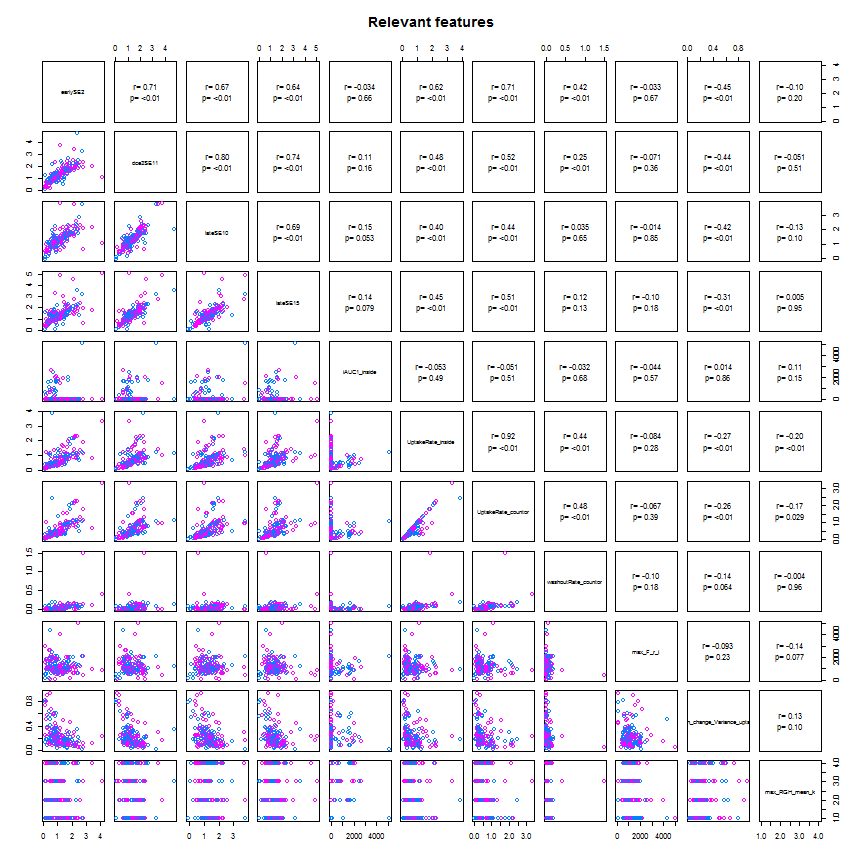 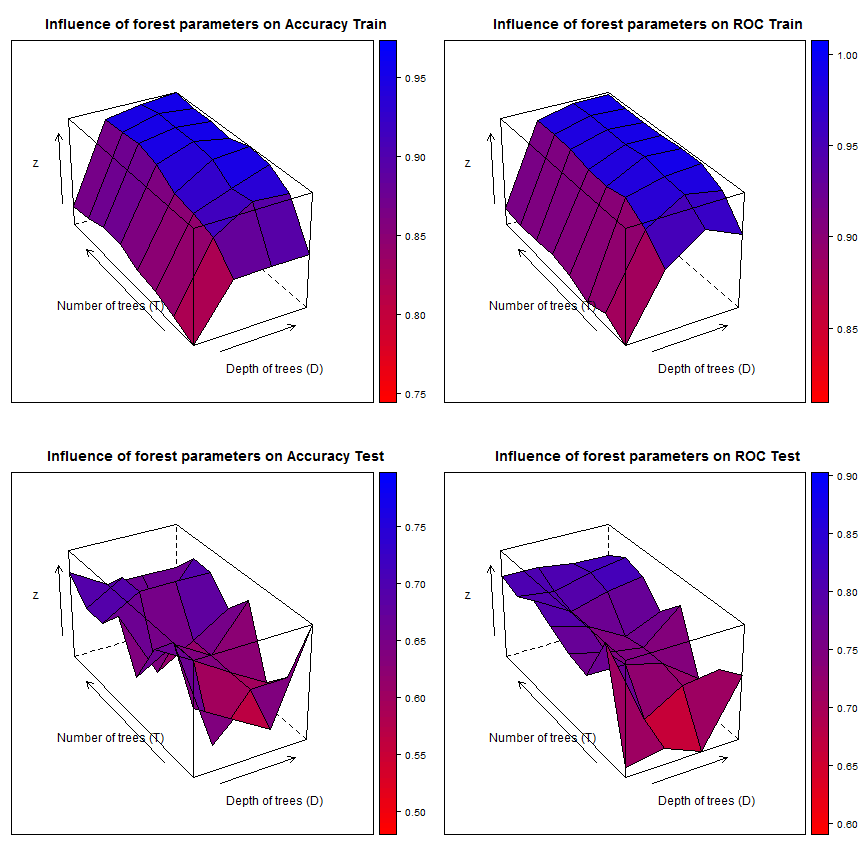 

```
## D:  2 T:  5 
## Area under the curve: 0.785
## Area under the curve: 0.792
## Area under the curve: 0.753
## Area under the curve: 0.524
## Area under the curve: 0.63
## Area under the curve: 0.63
## Area under the curve: 0.825
## Area under the curve: 0.669
## D:  5 T:  5 
## Area under the curve: 0.893
## Area under the curve: 0.877
## Area under the curve: 0.747
## Area under the curve: 0.557
## Area under the curve: 0.714
## Area under the curve: 0.74
## Area under the curve: 0.844
## Area under the curve: 0.669
## D:  10 T:  5 
## Area under the curve: 0.965
## Area under the curve: 0.966
## Area under the curve: 0.618
## Area under the curve: 0.56
## Area under the curve: 0.779
## Area under the curve: 0.766
## Area under the curve: 0.435
## Area under the curve: 0.481
## D:  20 T:  5 
## Area under the curve: 0.972
## Area under the curve: 0.951
## Area under the curve: 0.656
## Area under the curve: 0.462
## Area under the curve: 0.604
## Area under the curve: 0.5
## Area under the curve: 0.786
## Area under the curve: 0.604
## D:  2 T:  10 
## Area under the curve: 0.858
## Area under the curve: 0.834
## Area under the curve: 0.749
## Area under the curve: 0.651
## Area under the curve: 0.39
## Area under the curve: 0.61
## Area under the curve: 0.688
## Area under the curve: 0.597
## D:  5 T:  10 
## Area under the curve: 0.932
## Area under the curve: 0.905
## Area under the curve: 0.738
## Area under the curve: 0.567
## Area under the curve: 0.494
## Area under the curve: 0.494
## Area under the curve: 0.727
## Area under the curve: 0.701
## D:  10 T:  10 
## Area under the curve: 0.978
## Area under the curve: 0.962
## Area under the curve: 0.706
## Area under the curve: 0.577
## Area under the curve: 0.597
## Area under the curve: 0.649
## Area under the curve: 0.909
## Area under the curve: 0.571
## D:  20 T:  10 
## Area under the curve: 0.994
## Area under the curve: 0.978
## Area under the curve: 0.653
## Area under the curve: 0.542
## Area under the curve: 0.714
## Area under the curve: 0.662
## Area under the curve: 0.656
## Area under the curve: 0.636
## D:  2 T:  30 
## Area under the curve: 0.872
## Area under the curve: 0.829
## Area under the curve: 0.768
## Area under the curve: 0.562
## Area under the curve: 0.636
## Area under the curve: 0.662
## Area under the curve: 0.74
## Area under the curve: 0.597
## D:  5 T:  30 
## Area under the curve: 0.96
## Area under the curve: 0.928
## Area under the curve: 0.734
## Area under the curve: 0.577
## Area under the curve: 0.623
## Area under the curve: 0.662
## Area under the curve: 0.805
## Area under the curve: 0.558
## D:  10 T:  30 
## Area under the curve: 0.995
## Area under the curve: 0.991
## Area under the curve: 0.718
## Area under the curve: 0.539
## Area under the curve: 0.636
## Area under the curve: 0.636
## Area under the curve: 0.831
## Area under the curve: 0.558
## D:  20 T:  30 
## Area under the curve: 0.999
## Area under the curve: 0.994
## Area under the curve: 0.747
## Area under the curve: 0.563
## Area under the curve: 0.481
## Area under the curve: 0.571
## Area under the curve: 0.909
## Area under the curve: 0.558
## D:  2 T:  60 
## Area under the curve: 0.854
## Area under the curve: 0.828
## Area under the curve: 0.782
## Area under the curve: 0.58
## Area under the curve: 0.662
## Area under the curve: 0.675
## Area under the curve: 0.831
## Area under the curve: 0.506
## D:  5 T:  60 
## Area under the curve: 0.979
## Area under the curve: 0.961
## Area under the curve: 0.727
## Area under the curve: 0.605
## Area under the curve: 0.636
## Area under the curve: 0.597
## Area under the curve: 0.87
## Area under the curve: 0.571
## D:  10 T:  60 
## Area under the curve: 0.999
## Area under the curve: 0.992
## Area under the curve: 0.731
## Area under the curve: 0.589
## Area under the curve: 0.688
## Area under the curve: 0.636
## Area under the curve: 0.792
## Area under the curve: 0.662
## D:  20 T:  60 
## Area under the curve: 0.998
## Area under the curve: 0.992
## Area under the curve: 0.738
## Area under the curve: 0.556
## Area under the curve: 0.429
## Area under the curve: 0.442
## Area under the curve: 0.766
## Area under the curve: 0.649
## D:  2 T:  100 
## Area under the curve: 0.867
## Area under the curve: 0.835
## Area under the curve: 0.78
## Area under the curve: 0.541
## Area under the curve: 0.727
## Area under the curve: 0.753
## Area under the curve: 0.857
## Area under the curve: 0.558
## D:  5 T:  100 
## Area under the curve: 0.986
## Area under the curve: 0.952
## Area under the curve: 0.726
## Area under the curve: 0.546
## Area under the curve: 0.649
## Area under the curve: 0.636
## Area under the curve: 0.883
## Area under the curve: 0.532
## D:  10 T:  100 
## Area under the curve: 0.999
## Area under the curve: 0.997
## Area under the curve: 0.742
## Area under the curve: 0.563
## Area under the curve: 0.636
## Area under the curve: 0.649
## Area under the curve: 0.948
## Area under the curve: 0.545
## D:  20 T:  100 
## Area under the curve: 0.999
## Area under the curve: 0.997
## Area under the curve: 0.762
## Area under the curve: 0.521
## Area under the curve: 0.584
## Area under the curve: 0.662
## Area under the curve: 0.831
## Area under the curve: 0.506
## D:  2 T:  250 
## Area under the curve: 0.869
## Area under the curve: 0.839
## Area under the curve: 0.78
## Area under the curve: 0.566
## Area under the curve: 0.714
## Area under the curve: 0.74
## Area under the curve: 0.857
## Area under the curve: 0.571
## D:  5 T:  250 
## Area under the curve: 0.984
## Area under the curve: 0.95
## Area under the curve: 0.754
## Area under the curve: 0.558
## Area under the curve: 0.688
## Area under the curve: 0.636
## Area under the curve: 0.87
## Area under the curve: 0.519
## D:  10 T:  250 
## Area under the curve: 1
## Area under the curve: 0.999
## Area under the curve: 0.749
## Area under the curve: 0.56
## Area under the curve: 0.584
## Area under the curve: 0.662
## Area under the curve: 0.909
## Area under the curve: 0.532
## D:  20 T:  250 
## Area under the curve: 1
## Area under the curve: 0.996
## Area under the curve: 0.742
## Area under the curve: 0.55
## Area under the curve: 0.636
## Area under the curve: 0.636
## Area under the curve: 0.922
## Area under the curve: 0.636
## D:  2 T:  500 
## Area under the curve: 0.862
## Area under the curve: 0.834
## Area under the curve: 0.773
## Area under the curve: 0.586
## Area under the curve: 0.727
## Area under the curve: 0.74
## Area under the curve: 0.883
## Area under the curve: 0.571
## D:  5 T:  500 
## Area under the curve: 0.988
## Area under the curve: 0.954
## Area under the curve: 0.758
## Area under the curve: 0.558
## Area under the curve: 0.701
## Area under the curve: 0.623
## Area under the curve: 0.87
## Area under the curve: 0.558
## D:  10 T:  500 
## Area under the curve: 1
## Area under the curve: 0.998
## Area under the curve: 0.757
## Area under the curve: 0.555
## Area under the curve: 0.61
## Area under the curve: 0.623
## Area under the curve: 0.896
## Area under the curve: 0.597
## D:  20 T:  500 
## Area under the curve: 1
## Area under the curve: 0.996
## Area under the curve: 0.752
## Area under the curve: 0.551
## Area under the curve: 0.636
## Area under the curve: 0.623
## Area under the curve: 0.896
## Area under the curve: 0.532
## D:  2 T:  750 
## Area under the curve: 0.862
## Area under the curve: 0.833
## Area under the curve: 0.777
## Area under the curve: 0.573
## Area under the curve: 0.714
## Area under the curve: 0.74
## Area under the curve: 0.87
## Area under the curve: 0.571
## D:  5 T:  750 
## Area under the curve: 0.988
## Area under the curve: 0.957
## Area under the curve: 0.747
## Area under the curve: 0.554
## Area under the curve: 0.714
## Area under the curve: 0.649
## Area under the curve: 0.896
## Area under the curve: 0.532
## D:  10 T:  750 
## Area under the curve: 0.999
## Area under the curve: 0.996
## Area under the curve: 0.745
## Area under the curve: 0.543
## Area under the curve: 0.61
## Area under the curve: 0.649
## Area under the curve: 0.909
## Area under the curve: 0.558
## D:  20 T:  750 
## Area under the curve: 1
## Area under the curve: 0.997
## Area under the curve: 0.749
## Area under the curve: 0.544
## Area under the curve: 0.571
## Area under the curve: 0.636
## Area under the curve: 0.909
## Area under the curve: 0.532
##     x   y acuTrain rocTrain senTrain speTrain acuTest rocTest senTest
## 1   2   5   0.5142   0.7133   0.4429   0.8962    0.36  0.6883  0.0000
## 2   5   5   0.6640   0.7686   0.7571   0.8585    0.52  0.7419  0.8571
## 3  10   5   0.7976   0.7771   0.8000   0.9340    0.44  0.6153  0.5714
## 4  20   5   0.8097   0.7605   0.8429   0.9057    0.44  0.6234  0.2857
## 5   2  10   0.5587   0.7732   0.5571   0.9340    0.40  0.5714  0.2857
## 6   5  10   0.7530   0.7856   0.7143   0.9057    0.44  0.6039  0.0000
## 7  10  10   0.8462   0.8059   0.9000   0.9528    0.36  0.6818  0.4286
## 8  20  10   0.8866   0.7916   0.8857   0.9717    0.44  0.6672  0.2857
## 9   2  30   0.5344   0.7576   0.5000   0.9151    0.36  0.6591  0.2857
## 10  5  30   0.7935   0.7997   0.7429   0.9717    0.48  0.6623  0.4286
## 11 10  30   0.9028   0.8107   0.9429   0.9717    0.48  0.6656  0.5714
## 12 20  30   0.8907   0.8256   0.9429   0.9906    0.40  0.6299  0.5714
## 13  2  60   0.5223   0.7607   0.4714   0.9057    0.48  0.6688  0.4286
## 14  5  60   0.7814   0.8178   0.8143   0.9717    0.40  0.6688  0.2857
## 15 10  60   0.9393   0.8278   0.9143   0.9906    0.36  0.6948  0.1429
## 16 20  60   0.9514   0.8210   0.9286   1.0000    0.48  0.5714  0.2857
## 17  2 100   0.5506   0.7558   0.5143   0.9434    0.44  0.7240  0.2857
## 18  5 100   0.7611   0.8026   0.7857   0.9623    0.36  0.6753  0.2857
## 19 10 100   0.9150   0.8253   0.9429   1.0000    0.36  0.6948  0.1429
## 20 20 100   0.9312   0.8199   0.9571   1.0000    0.48  0.6461  0.1429
## 21  2 250   0.5304   0.7635   0.4857   0.9151    0.48  0.7208  0.2857
## 22  5 250   0.7692   0.8115   0.8286   0.9528    0.36  0.6786  0.1429
## 23 10 250   0.9555   0.8268   0.9429   1.0000    0.44  0.6721  0.4286
## 24 20 250   0.9636   0.8218   0.9714   1.0000    0.36  0.7078  0.1429
## 25  2 500   0.5344   0.7637   0.5143   0.9057    0.48  0.7305  0.2857
## 26  5 500   0.7895   0.8146   0.8143   0.9811    0.32  0.6883  0.1429
## 27 10 500   0.9555   0.8273   0.9571   1.0000    0.40  0.6818  0.2857
## 28 20 500   0.9474   0.8246   0.9429   1.0000    0.40  0.6721  0.4286
## 29  2 750   0.5385   0.7613   0.5143   0.9151    0.48  0.7240  0.2857
## 30  5 750   0.7935   0.8118   0.8143   0.9906    0.40  0.6981  0.2857
## 31 10 750   0.9595   0.8211   0.9429   1.0000    0.40  0.6818  0.2857
## 32 20 750   0.9555   0.8224   0.9429   1.0000    0.40  0.6623  0.2857
##    speTest
## 1   0.8182
## 2   0.5455
## 3   0.5455
## 4   0.7273
## 5   0.7273
## 6   0.8182
## 7   0.5455
## 8   0.8182
## 9   0.6364
## 10  0.6364
## 11  0.5455
## 12  0.5455
## 13  0.8182
## 14  0.7273
## 15  0.7273
## 16  0.7273
## 17  0.8182
## 18  0.6364
## 19  0.7273
## 20  0.7273
## 21  0.9091
## 22  0.7273
## 23  0.7273
## 24  0.6364
## 25  0.9091
## 26  0.6364
## 27  0.7273
## 28  0.6364
## 29  0.9091
## 30  0.7273
## 31  0.7273
## 32  0.7273
## Initial round 1: ..........
##  13  attributes rejected after this test:  peakVr_inside maxVr_countor peakVr_countor Vr_decreasingRate_countor skew_F_r_i iiiMax_Margin_Gradient k_Max_Margin_Grad ivVariance max_RGH_mean_k max_RGH_var_k texture_contrast_halfRad texture_dissimilarity_quarterRad texture_correlation_quarterRad 
## 
## Initial round 2: ..........
##  5  attributes rejected after this test:  maxVr_inside Vr_post_1_inside Vr_post_1_countor texture_dissimilarity_halfRad texture_correlation_halfRad 
## 
## Initial round 3: ..........
##  6  attributes rejected after this test:  Vr_increasingRate_inside Vr_increasingRate_countor iMax_Variance_uptake edge_sharp_mean texture_correlation_zero texture_correlation_threeQuaRad 
## 
## Final round: ..........
##  6  attributes confirmed after this test:  iAUC1_inside Slope_ini_inside maxCr_inside UptakeRate_inside washoutRate_inside UptakeRate_countor 
## 
##  9  attributes rejected after this test:  Vr_decreasingRate_inside Kpeak_countor peakCr_countor min_F_r_i var_F_r_i texture_contrast_quarterRad texture_homogeneity_threeQuaRad texture_dissimilarity_zero texture_dissimilarity_threeQuaRad 
## ....
##  4  attributes confirmed after this test:  alpha_inside Slope_ini_countor maxCr_countor washoutRate_countor 
## 
##  2  attributes rejected after this test:  SER_countor texture_contrast_threeQuaRad 
## ....
##  2  attributes confirmed after this test:  Tpeak_inside edge_sharp_std 
## ...
##  3  attributes confirmed after this test:  SER_inside peakCr_inside texture_ASM_quarterRad 
## ...
##  3  attributes rejected after this test:  A_countor Tpeak_countor texture_contrast_zero 
## ...
##  2  attributes confirmed after this test:  iiMin_change_Variance_uptake texture_ASM_halfRad 
## ...
##  1  attributes confirmed after this test:  max_F_r_i 
## 
##  1  attributes rejected after this test:  iAUC1_countor 
## ...
##  1  attributes confirmed after this test:  mean_F_r_i 
## 
##  1  attributes rejected after this test:  Kpeak_inside 
## ..
##  2  attributes confirmed after this test:  circularity texture_ASM_zero 
## ......
##  1  attributes rejected after this test:  texture_homogeneity_quarterRad 
## .....
##  1  attributes confirmed after this test:  A_inside 
## ...
##  2  attributes rejected after this test:  beta_countor kurt_F_r_i 
## ..........
##  1  attributes confirmed after this test:  texture_homogeneity_zero 
## ..
##  1  attributes confirmed after this test:  alpha_countor 
## ..................................
##  1  attributes confirmed after this test:  irregularity 
## .....
## Boruta performed 130 randomForest runs in 5.083 mins.
##         25 attributes confirmed important: A_inside alpha_inside
## iAUC1_inside Slope_ini_inside Tpeak_inside SER_inside maxCr_inside
## peakCr_inside UptakeRate_inside washoutRate_inside alpha_countor
## Slope_ini_countor maxCr_countor UptakeRate_countor
## washoutRate_countor max_F_r_i mean_F_r_i
## iiMin_change_Variance_uptake circularity irregularity
## edge_sharp_std texture_homogeneity_zero texture_ASM_zero
## texture_ASM_quarterRad texture_ASM_halfRad
##         43 attributes confirmed unimportant: Kpeak_inside
## maxVr_inside peakVr_inside Vr_increasingRate_inside
## Vr_decreasingRate_inside Vr_post_1_inside A_countor beta_countor
## iAUC1_countor Tpeak_countor Kpeak_countor SER_countor
## peakCr_countor maxVr_countor peakVr_countor
## Vr_increasingRate_countor Vr_decreasingRate_countor
## Vr_post_1_countor min_F_r_i var_F_r_i skew_F_r_i kurt_F_r_i
## iMax_Variance_uptake iiiMax_Margin_Gradient k_Max_Margin_Grad
## ivVariance edge_sharp_mean max_RGH_mean_k max_RGH_var_k
## texture_contrast_zero texture_contrast_quarterRad
## texture_contrast_halfRad texture_contrast_threeQuaRad
## texture_homogeneity_quarterRad texture_homogeneity_threeQuaRad
## texture_dissimilarity_zero texture_dissimilarity_quarterRad
## texture_dissimilarity_halfRad texture_dissimilarity_threeQuaRad
## texture_correlation_zero texture_correlation_quarterRad
## texture_correlation_halfRad texture_correlation_threeQuaRad
##         4 tentative attributes left: beta_inside max_RGH_mean
## max_RGH_var texture_homogeneity_halfRad
```

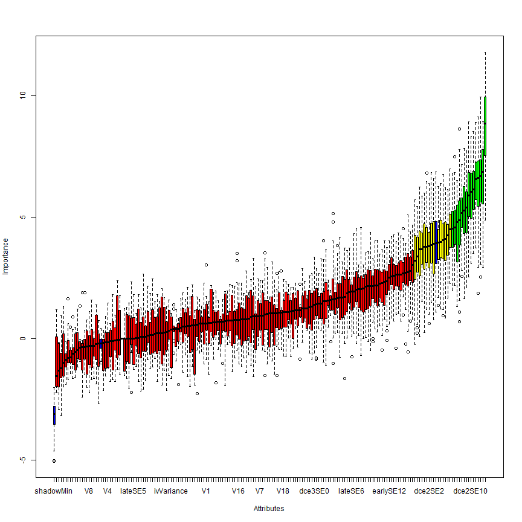 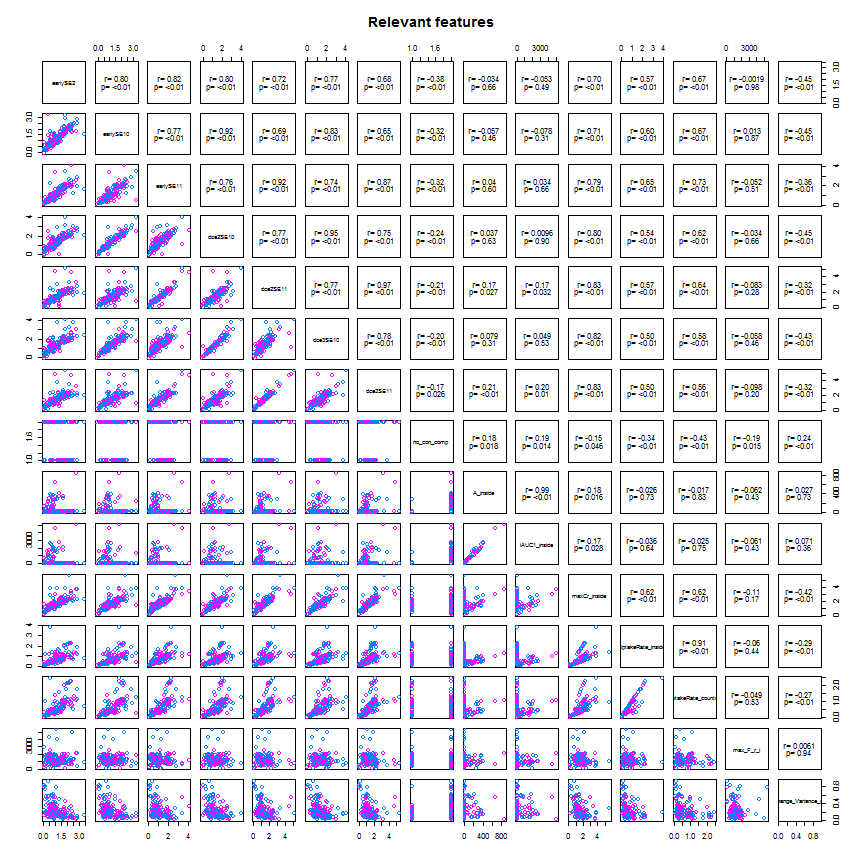 

```
## D:  2 T:  5 
## Area under the curve: 0.784
## Area under the curve: 0.735
## Area under the curve: 0.78
## Area under the curve: 0.566
## Area under the curve: 0.648
## Area under the curve: 0.477
## Area under the curve: 0.602
## Area under the curve: 0.705
## D:  5 T:  5 
## Area under the curve: 0.888
## Area under the curve: 0.887
## Area under the curve: 0.675
## Area under the curve: 0.579
## Area under the curve: 0.574
## Area under the curve: 0.597
## Area under the curve: 0.903
## Area under the curve: 0.54
## D:  10 T:  5 
## Area under the curve: 0.948
## Area under the curve: 0.932
## Area under the curve: 0.678
## Area under the curve: 0.615
## Area under the curve: 0.545
## Area under the curve: 0.489
## Area under the curve: 0.58
## Area under the curve: 0.477
## D:  20 T:  5 
## Area under the curve: 0.959
## Area under the curve: 0.941
## Area under the curve: 0.62
## Area under the curve: 0.536
## Area under the curve: 0.58
## Area under the curve: 0.625
## Area under the curve: 0.614
## Area under the curve: 0.483
## D:  2 T:  10 
## Area under the curve: 0.824
## Area under the curve: 0.819
## Area under the curve: 0.76
## Area under the curve: 0.751
## Area under the curve: 0.602
## Area under the curve: 0.591
## Area under the curve: 0.648
## Area under the curve: 0.602
## D:  5 T:  10 
## Area under the curve: 0.961
## Area under the curve: 0.926
## Area under the curve: 0.801
## Area under the curve: 0.577
## Area under the curve: 0.489
## Area under the curve: 0.489
## Area under the curve: 0.557
## Area under the curve: 0.466
## D:  10 T:  10 
## Area under the curve: 0.983
## Area under the curve: 0.975
## Area under the curve: 0.684
## Area under the curve: 0.594
## Area under the curve: 0.557
## Area under the curve: 0.534
## Area under the curve: 0.625
## Area under the curve: 0.511
## D:  20 T:  10 
## Area under the curve: 0.994
## Area under the curve: 0.971
## Area under the curve: 0.634
## Area under the curve: 0.6
## Area under the curve: 0.557
## Area under the curve: 0.466
## Area under the curve: 0.58
## Area under the curve: 0.602
## D:  2 T:  30 
## Area under the curve: 0.837
## Area under the curve: 0.818
## Area under the curve: 0.807
## Area under the curve: 0.62
## Area under the curve: 0.83
## Area under the curve: 0.682
## Area under the curve: 0.75
## Area under the curve: 0.693
## D:  5 T:  30 
## Area under the curve: 0.964
## Area under the curve: 0.926
## Area under the curve: 0.755
## Area under the curve: 0.609
## Area under the curve: 0.625
## Area under the curve: 0.568
## Area under the curve: 0.602
## Area under the curve: 0.67
## D:  10 T:  30 
## Area under the curve: 0.995
## Area under the curve: 0.985
## Area under the curve: 0.765
## Area under the curve: 0.601
## Area under the curve: 0.568
## Area under the curve: 0.659
## Area under the curve: 0.807
## Area under the curve: 0.636
## D:  20 T:  30 
## Area under the curve: 0.993
## Area under the curve: 0.986
## Area under the curve: 0.769
## Area under the curve: 0.557
## Area under the curve: 0.659
## Area under the curve: 0.568
## Area under the curve: 0.75
## Area under the curve: 0.545
## D:  2 T:  60 
## Area under the curve: 0.848
## Area under the curve: 0.825
## Area under the curve: 0.798
## Area under the curve: 0.597
## Area under the curve: 0.682
## Area under the curve: 0.67
## Area under the curve: 0.659
## Area under the curve: 0.67
## D:  5 T:  60 
## Area under the curve: 0.982
## Area under the curve: 0.944
## Area under the curve: 0.771
## Area under the curve: 0.632
## Area under the curve: 0.67
## Area under the curve: 0.693
## Area under the curve: 0.716
## Area under the curve: 0.523
## D:  10 T:  60 
## Area under the curve: 0.999
## Area under the curve: 0.985
## Area under the curve: 0.74
## Area under the curve: 0.608
## Area under the curve: 0.693
## Area under the curve: 0.693
## Area under the curve: 0.716
## Area under the curve: 0.557
## D:  20 T:  60 
## Area under the curve: 0.999
## Area under the curve: 0.986
## Area under the curve: 0.767
## Area under the curve: 0.604
## Area under the curve: 0.67
## Area under the curve: 0.67
## Area under the curve: 0.614
## Area under the curve: 0.523
## D:  2 T:  100 
## Area under the curve: 0.851
## Area under the curve: 0.834
## Area under the curve: 0.804
## Area under the curve: 0.701
## Area under the curve: 0.727
## Area under the curve: 0.682
## Area under the curve: 0.693
## Area under the curve: 0.602
## D:  5 T:  100 
## Area under the curve: 0.975
## Area under the curve: 0.941
## Area under the curve: 0.791
## Area under the curve: 0.638
## Area under the curve: 0.761
## Area under the curve: 0.682
## Area under the curve: 0.648
## Area under the curve: 0.614
## D:  10 T:  100 
## Area under the curve: 1
## Area under the curve: 0.988
## Area under the curve: 0.764
## Area under the curve: 0.593
## Area under the curve: 0.648
## Area under the curve: 0.659
## Area under the curve: 0.648
## Area under the curve: 0.545
## D:  20 T:  100 
## Area under the curve: 1
## Area under the curve: 0.993
## Area under the curve: 0.75
## Area under the curve: 0.579
## Area under the curve: 0.739
## Area under the curve: 0.716
## Area under the curve: 0.727
## Area under the curve: 0.659
## D:  2 T:  250 
## Area under the curve: 0.856
## Area under the curve: 0.83
## Area under the curve: 0.801
## Area under the curve: 0.643
## Area under the curve: 0.682
## Area under the curve: 0.636
## Area under the curve: 0.648
## Area under the curve: 0.591
## D:  5 T:  250 
## Area under the curve: 0.98
## Area under the curve: 0.946
## Area under the curve: 0.774
## Area under the curve: 0.629
## Area under the curve: 0.705
## Area under the curve: 0.648
## Area under the curve: 0.693
## Area under the curve: 0.591
## D:  10 T:  250 
## Area under the curve: 1
## Area under the curve: 0.99
## Area under the curve: 0.756
## Area under the curve: 0.6
## Area under the curve: 0.705
## Area under the curve: 0.67
## Area under the curve: 0.648
## Area under the curve: 0.58
## D:  20 T:  250 
## Area under the curve: 1
## Area under the curve: 0.992
## Area under the curve: 0.779
## Area under the curve: 0.626
## Area under the curve: 0.716
## Area under the curve: 0.705
## Area under the curve: 0.682
## Area under the curve: 0.568
## D:  2 T:  500 
## Area under the curve: 0.854
## Area under the curve: 0.83
## Area under the curve: 0.801
## Area under the curve: 0.696
## Area under the curve: 0.693
## Area under the curve: 0.636
## Area under the curve: 0.648
## Area under the curve: 0.602
## D:  5 T:  500 
## Area under the curve: 0.977
## Area under the curve: 0.94
## Area under the curve: 0.776
## Area under the curve: 0.637
## Area under the curve: 0.705
## Area under the curve: 0.67
## Area under the curve: 0.659
## Area under the curve: 0.625
## D:  10 T:  500 
## Area under the curve: 1
## Area under the curve: 0.99
## Area under the curve: 0.784
## Area under the curve: 0.609
## Area under the curve: 0.659
## Area under the curve: 0.693
## Area under the curve: 0.67
## Area under the curve: 0.489
## D:  20 T:  500 
## Area under the curve: 1
## Area under the curve: 0.992
## Area under the curve: 0.771
## Area under the curve: 0.599
## Area under the curve: 0.648
## Area under the curve: 0.682
## Area under the curve: 0.648
## Area under the curve: 0.455
## D:  2 T:  750 
## Area under the curve: 0.853
## Area under the curve: 0.827
## Area under the curve: 0.799
## Area under the curve: 0.702
## Area under the curve: 0.716
## Area under the curve: 0.648
## Area under the curve: 0.659
## Area under the curve: 0.614
## D:  5 T:  750 
## Area under the curve: 0.981
## Area under the curve: 0.948
## Area under the curve: 0.786
## Area under the curve: 0.646
## Area under the curve: 0.693
## Area under the curve: 0.659
## Area under the curve: 0.659
## Area under the curve: 0.693
## D:  10 T:  750 
## Area under the curve: 1
## Area under the curve: 0.99
## Area under the curve: 0.774
## Area under the curve: 0.609
## Area under the curve: 0.659
## Area under the curve: 0.682
## Area under the curve: 0.693
## Area under the curve: 0.477
## D:  20 T:  750 
## Area under the curve: 1
## Area under the curve: 0.991
## Area under the curve: 0.785
## Area under the curve: 0.626
## Area under the curve: 0.67
## Area under the curve: 0.67
## Area under the curve: 0.67
## Area under the curve: 0.568
##     x   y acuTrain rocTrain senTrain speTrain acuTest rocTest senTest
## 1   2   5   0.5102   0.7162   0.6522   0.7547  0.4444  0.6080   0.500
## 2   5   5   0.6449   0.7572   0.6522   0.8396  0.2222  0.6534   0.125
## 3  10   5   0.7673   0.7935   0.6957   0.8396  0.4074  0.5227   0.125
## 4  20   5   0.7878   0.7640   0.7826   0.9151  0.3333  0.5753   0.375
## 5   2  10   0.5469   0.7884   0.5652   0.8585  0.4074  0.6108   0.250
## 6   5  10   0.7184   0.8161   0.8261   0.8679  0.2963  0.5000   0.375
## 7  10  10   0.8245   0.8089   0.8986   0.9717  0.3704  0.5568   0.250
## 8  20  10   0.8571   0.7997   0.9130   0.9528  0.2593  0.5511   0.125
## 9   2  30   0.5061   0.7704   0.3623   0.9340  0.5185  0.7386   0.500
## 10  5  30   0.7796   0.8136   0.8551   0.9245  0.4074  0.6165   0.375
## 11 10  30   0.9143   0.8364   0.8986   1.0000  0.3704  0.6676   0.250
## 12 20  30   0.9102   0.8264   0.8986   1.0000  0.3704  0.6307   0.250
## 13  2  60   0.5469   0.7670   0.6232   0.8585  0.5185  0.6705   0.500
## 14  5  60   0.7429   0.8323   0.8261   0.9434  0.4444  0.6506   0.500
## 15 10  60   0.9184   0.8332   0.9130   1.0000  0.3704  0.6648   0.250
## 16 20  60   0.9224   0.8389   0.8986   1.0000  0.3704  0.6193   0.375
## 17  2 100   0.5510   0.7973   0.5797   0.8962  0.5185  0.6761   0.500
## 18  5 100   0.8000   0.8364   0.8116   0.9528  0.5185  0.6761   0.500
## 19 10 100   0.9265   0.8360   0.8841   1.0000  0.4444  0.6250   0.500
## 20 20 100   0.9429   0.8302   0.9275   1.0000  0.4074  0.7102   0.500
## 21  2 250   0.5429   0.7828   0.6232   0.8491  0.5185  0.6392   0.500
## 22  5 250   0.8000   0.8320   0.8406   0.9528  0.4074  0.6591   0.500
## 23 10 250   0.9469   0.8364   0.9130   1.0000  0.3704  0.6506   0.375
## 24 20 250   0.9469   0.8494   0.9130   1.0000  0.3704  0.6676   0.375
## 25  2 500   0.5429   0.7954   0.5942   0.8679  0.5185  0.6449   0.500
## 26  5 500   0.7878   0.8325   0.8551   0.9528  0.4074  0.6648   0.500
## 27 10 500   0.9347   0.8456   0.9130   1.0000  0.3333  0.6278   0.375
## 28 20 500   0.9469   0.8404   0.9275   1.0000  0.3333  0.6080   0.375
## 29  2 750   0.5510   0.7953   0.6087   0.8774  0.5185  0.6591   0.500
## 30  5 750   0.7837   0.8403   0.8406   0.9528  0.4074  0.6761   0.500
## 31 10 750   0.9224   0.8430   0.8841   1.0000  0.3704  0.6278   0.500
## 32 20 750   0.9429   0.8504   0.8986   1.0000  0.3704  0.6449   0.500
##    speTest
## 1   0.7273
## 2   0.4545
## 3   0.7273
## 4   0.5455
## 5   0.8182
## 6   0.4545
## 7   0.7273
## 8   0.5455
## 9   0.9091
## 10  0.7273
## 11  0.7273
## 12  0.7273
## 13  0.9091
## 14  0.7273
## 15  0.7273
## 16  0.6364
## 17  0.9091
## 18  0.9091
## 19  0.7273
## 20  0.6364
## 21  0.9091
## 22  0.6364
## 23  0.6364
## 24  0.6364
## 25  0.9091
## 26  0.6364
## 27  0.5455
## 28  0.5455
## 29  0.9091
## 30  0.6364
## 31  0.5455
## 32  0.5455
## Initial round 1: ..........
##  9  attributes rejected after this test:  peakVr_inside peakCr_countor Vr_post_1_countor iiiMax_Margin_Gradient max_RGH_mean_k max_RGH_var_k texture_contrast_zero texture_dissimilarity_halfRad texture_correlation_halfRad 
## 
## Initial round 2: ..........
##  15  attributes rejected after this test:  maxVr_inside Vr_increasingRate_inside maxVr_countor peakVr_countor Vr_increasingRate_countor Vr_decreasingRate_countor var_F_r_i skew_F_r_i k_Max_Margin_Grad ivVariance edge_sharp_mean texture_homogeneity_halfRad texture_dissimilarity_quarterRad texture_correlation_zero texture_correlation_threeQuaRad 
## 
## Initial round 3: ..........
##  6  attributes rejected after this test:  Vr_post_1_inside A_countor min_F_r_i texture_contrast_quarterRad texture_dissimilarity_threeQuaRad texture_correlation_quarterRad 
## 
## Final round: ..........
##  10  attributes confirmed after this test:  Slope_ini_inside maxCr_inside UptakeRate_inside washoutRate_inside UptakeRate_countor washoutRate_countor iiMin_change_Variance_uptake texture_ASM_zero texture_ASM_quarterRad texture_ASM_halfRad 
## 
##  4  attributes rejected after this test:  Vr_decreasingRate_inside Tpeak_countor iMax_Variance_uptake texture_homogeneity_threeQuaRad 
## ....
##  2  attributes confirmed after this test:  iAUC1_inside maxCr_countor 
## 
##  3  attributes rejected after this test:  iAUC1_countor texture_homogeneity_quarterRad texture_dissimilarity_zero 
## ....
##  1  attributes confirmed after this test:  peakCr_inside 
## 
##  3  attributes rejected after this test:  beta_inside beta_countor texture_homogeneity_zero 
## ...
##  2  attributes rejected after this test:  texture_contrast_halfRad texture_contrast_threeQuaRad 
## ...
##  2  attributes confirmed after this test:  circularity irregularity 
## ...
##  2  attributes rejected after this test:  Kpeak_inside SER_countor 
## ...
##  1  attributes rejected after this test:  Kpeak_countor 
## ...
##  1  attributes confirmed after this test:  alpha_inside 
## ..
##  1  attributes rejected after this test:  A_inside 
## ..............
##  1  attributes confirmed after this test:  max_F_r_i 
## .................
##  1  attributes confirmed after this test:  max_RGH_var 
## .............
##  1  attributes confirmed after this test:  max_RGH_mean 
## .....................
## Boruta performed 130 randomForest runs in 8.945 mins.
##         19 attributes confirmed important: alpha_inside
## iAUC1_inside Slope_ini_inside maxCr_inside peakCr_inside
## UptakeRate_inside washoutRate_inside maxCr_countor
## UptakeRate_countor washoutRate_countor max_F_r_i
## iiMin_change_Variance_uptake circularity irregularity max_RGH_mean
## max_RGH_var texture_ASM_zero texture_ASM_quarterRad
## texture_ASM_halfRad
##         46 attributes confirmed unimportant: A_inside beta_inside
## Kpeak_inside maxVr_inside peakVr_inside Vr_increasingRate_inside
## Vr_decreasingRate_inside Vr_post_1_inside A_countor beta_countor
## iAUC1_countor Tpeak_countor Kpeak_countor SER_countor
## peakCr_countor maxVr_countor peakVr_countor
## Vr_increasingRate_countor Vr_decreasingRate_countor
## Vr_post_1_countor min_F_r_i var_F_r_i skew_F_r_i
## iMax_Variance_uptake iiiMax_Margin_Gradient k_Max_Margin_Grad
## ivVariance edge_sharp_mean max_RGH_mean_k max_RGH_var_k
## texture_contrast_zero texture_contrast_quarterRad
## texture_contrast_halfRad texture_contrast_threeQuaRad
## texture_homogeneity_zero texture_homogeneity_quarterRad
## texture_homogeneity_halfRad texture_homogeneity_threeQuaRad
## texture_dissimilarity_zero texture_dissimilarity_quarterRad
## texture_dissimilarity_halfRad texture_dissimilarity_threeQuaRad
## texture_correlation_zero texture_correlation_quarterRad
## texture_correlation_halfRad texture_correlation_threeQuaRad
##         7 tentative attributes left: Tpeak_inside SER_inside
## alpha_countor Slope_ini_countor mean_F_r_i kurt_F_r_i
## edge_sharp_std
```

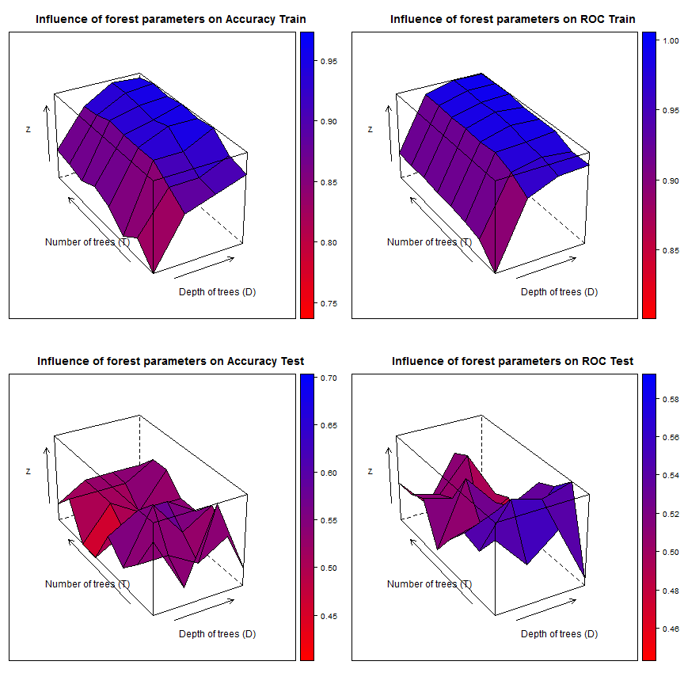 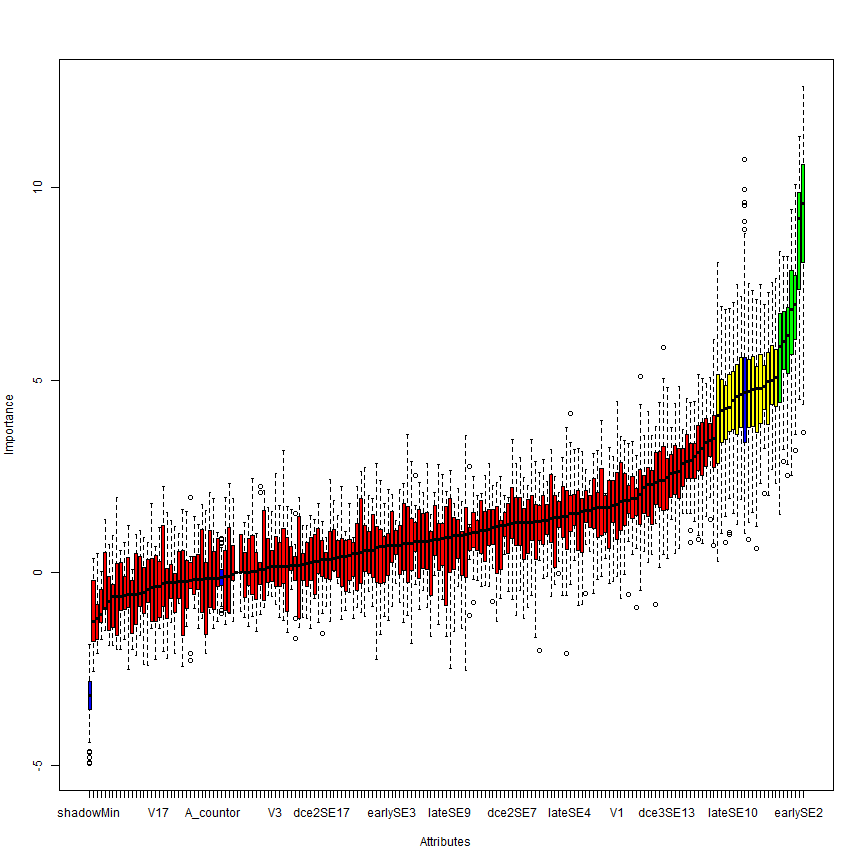 

```
## D:  2 T:  5 
## Area under the curve: 0.711
## Area under the curve: 0.727
## Area under the curve: 0.717
## Area under the curve: 0.594
## Area under the curve: 0.771
## Area under the curve: 0.781
## Area under the curve: 0.781
## Area under the curve: 0.604
## D:  5 T:  5 
## Area under the curve: 0.878
## Area under the curve: 0.869
## Area under the curve: 0.725
## Area under the curve: 0.55
## Area under the curve: 0.734
## Area under the curve: 0.807
## Area under the curve: 0.766
## Area under the curve: 0.693
## D:  10 T:  5 
## Area under the curve: 0.946
## Area under the curve: 0.946
## Area under the curve: 0.697
## Area under the curve: 0.545
## Area under the curve: 0.667
## Area under the curve: 0.781
## Area under the curve: 0.734
## Area under the curve: 0.573
## D:  20 T:  5 
## Area under the curve: 0.957
## Area under the curve: 0.957
## Area under the curve: 0.696
## Area under the curve: 0.572
## Area under the curve: 0.635
## Area under the curve: 0.792
## Area under the curve: 0.74
## Area under the curve: 0.635
## D:  2 T:  10 
## Area under the curve: 0.834
## Area under the curve: 0.813
## Area under the curve: 0.782
## Area under the curve: 0.627
## Area under the curve: 0.802
## Area under the curve: 0.844
## Area under the curve: 0.844
## Area under the curve: 0.615
## D:  5 T:  10 
## Area under the curve: 0.928
## Area under the curve: 0.894
## Area under the curve: 0.739
## Area under the curve: 0.534
## Area under the curve: 0.729
## Area under the curve: 0.781
## Area under the curve: 0.802
## Area under the curve: 0.781
## D:  10 T:  10 
## Area under the curve: 0.994
## Area under the curve: 0.982
## Area under the curve: 0.645
## Area under the curve: 0.563
## Area under the curve: 0.792
## Area under the curve: 0.823
## Area under the curve: 0.781
## Area under the curve: 0.51
## D:  20 T:  10 
## Area under the curve: 0.987
## Area under the curve: 0.965
## Area under the curve: 0.688
## Area under the curve: 0.516
## Area under the curve: 0.604
## Area under the curve: 0.792
## Area under the curve: 0.833
## Area under the curve: 0.531
## D:  2 T:  30 
## Area under the curve: 0.823
## Area under the curve: 0.805
## Area under the curve: 0.781
## Area under the curve: 0.582
## Area under the curve: 0.802
## Area under the curve: 0.823
## Area under the curve: 0.823
## Area under the curve: 0.49
## D:  5 T:  30 
## Area under the curve: 0.977
## Area under the curve: 0.952
## Area under the curve: 0.778
## Area under the curve: 0.583
## Area under the curve: 0.708
## Area under the curve: 0.76
## Area under the curve: 0.792
## Area under the curve: 0.573
## D:  10 T:  30 
## Area under the curve: 0.998
## Area under the curve: 0.987
## Area under the curve: 0.699
## Area under the curve: 0.551
## Area under the curve: 0.677
## Area under the curve: 0.708
## Area under the curve: 0.844
## Area under the curve: 0.594
## D:  20 T:  30 
## Area under the curve: 0.998
## Area under the curve: 0.988
## Area under the curve: 0.664
## Area under the curve: 0.56
## Area under the curve: 0.677
## Area under the curve: 0.802
## Area under the curve: 0.875
## Area under the curve: 0.615
## D:  2 T:  60 
## Area under the curve: 0.828
## Area under the curve: 0.801
## Area under the curve: 0.785
## Area under the curve: 0.614
## Area under the curve: 0.802
## Area under the curve: 0.833
## Area under the curve: 0.854
## Area under the curve: 0.792
## D:  5 T:  60 
## Area under the curve: 0.984
## Area under the curve: 0.956
## Area under the curve: 0.767
## Area under the curve: 0.594
## Area under the curve: 0.76
## Area under the curve: 0.823
## Area under the curve: 0.917
## Area under the curve: 0.656
## D:  10 T:  60 
## Area under the curve: 0.999
## Area under the curve: 0.995
## Area under the curve: 0.748
## Area under the curve: 0.62
## Area under the curve: 0.729
## Area under the curve: 0.875
## Area under the curve: 0.948
## Area under the curve: 0.49
## D:  20 T:  60 
## Area under the curve: 1
## Area under the curve: 0.991
## Area under the curve: 0.716
## Area under the curve: 0.535
## Area under the curve: 0.635
## Area under the curve: 0.802
## Area under the curve: 0.906
## Area under the curve: 0.49
## D:  2 T:  100 
## Area under the curve: 0.839
## Area under the curve: 0.817
## Area under the curve: 0.784
## Area under the curve: 0.639
## Area under the curve: 0.771
## Area under the curve: 0.844
## Area under the curve: 0.854
## Area under the curve: 0.823
## D:  5 T:  100 
## Area under the curve: 0.977
## Area under the curve: 0.938
## Area under the curve: 0.743
## Area under the curve: 0.633
## Area under the curve: 0.75
## Area under the curve: 0.844
## Area under the curve: 0.927
## Area under the curve: 0.573
## D:  10 T:  100 
## Area under the curve: 1
## Area under the curve: 0.996
## Area under the curve: 0.73
## Area under the curve: 0.573
## Area under the curve: 0.792
## Area under the curve: 0.833
## Area under the curve: 0.854
## Area under the curve: 0.698
## D:  20 T:  100 
## Area under the curve: 1
## Area under the curve: 0.996
## Area under the curve: 0.734
## Area under the curve: 0.582
## Area under the curve: 0.771
## Area under the curve: 0.854
## Area under the curve: 0.896
## Area under the curve: 0.531
## D:  2 T:  250 
## Area under the curve: 0.844
## Area under the curve: 0.819
## Area under the curve: 0.774
## Area under the curve: 0.627
## Area under the curve: 0.781
## Area under the curve: 0.844
## Area under the curve: 0.885
## Area under the curve: 0.75
## D:  5 T:  250 
## Area under the curve: 0.987
## Area under the curve: 0.952
## Area under the curve: 0.759
## Area under the curve: 0.616
## Area under the curve: 0.76
## Area under the curve: 0.844
## Area under the curve: 0.917
## Area under the curve: 0.635
## D:  10 T:  250 
## Area under the curve: 1
## Area under the curve: 0.994
## Area under the curve: 0.729
## Area under the curve: 0.583
## Area under the curve: 0.75
## Area under the curve: 0.833
## Area under the curve: 0.875
## Area under the curve: 0.615
## D:  20 T:  250 
## Area under the curve: 1
## Area under the curve: 0.994
## Area under the curve: 0.742
## Area under the curve: 0.611
## Area under the curve: 0.646
## Area under the curve: 0.812
## Area under the curve: 0.854
## Area under the curve: 0.729
## D:  2 T:  500 
## Area under the curve: 0.842
## Area under the curve: 0.816
## Area under the curve: 0.783
## Area under the curve: 0.679
## Area under the curve: 0.854
## Area under the curve: 0.865
## Area under the curve: 0.854
## Area under the curve: 0.646
## D:  5 T:  500 
## Area under the curve: 0.985
## Area under the curve: 0.95
## Area under the curve: 0.761
## Area under the curve: 0.605
## Area under the curve: 0.781
## Area under the curve: 0.844
## Area under the curve: 0.896
## Area under the curve: 0.573
## D:  10 T:  500 
## Area under the curve: 1
## Area under the curve: 0.995
## Area under the curve: 0.738
## Area under the curve: 0.577
## Area under the curve: 0.76
## Area under the curve: 0.823
## Area under the curve: 0.885
## Area under the curve: 0.615
## D:  20 T:  500 
## Area under the curve: 1
## Area under the curve: 0.997
## Area under the curve: 0.746
## Area under the curve: 0.601
## Area under the curve: 0.75
## Area under the curve: 0.844
## Area under the curve: 0.906
## Area under the curve: 0.552
## D:  2 T:  750 
## Area under the curve: 0.843
## Area under the curve: 0.816
## Area under the curve: 0.776
## Area under the curve: 0.656
## Area under the curve: 0.833
## Area under the curve: 0.854
## Area under the curve: 0.865
## Area under the curve: 0.74
## D:  5 T:  750 
## Area under the curve: 0.984
## Area under the curve: 0.95
## Area under the curve: 0.769
## Area under the curve: 0.619
## Area under the curve: 0.771
## Area under the curve: 0.854
## Area under the curve: 0.896
## Area under the curve: 0.615
## D:  10 T:  750 
## Area under the curve: 1
## Area under the curve: 0.996
## Area under the curve: 0.746
## Area under the curve: 0.588
## Area under the curve: 0.76
## Area under the curve: 0.833
## Area under the curve: 0.906
## Area under the curve: 0.625
## D:  20 T:  750 
## Area under the curve: 1
## Area under the curve: 0.997
## Area under the curve: 0.737
## Area under the curve: 0.594
## Area under the curve: 0.771
## Area under the curve: 0.844
## Area under the curve: 0.917
## Area under the curve: 0.594
##     x   y acuTrain rocTrain senTrain speTrain acuTest rocTest senTest
## 1   2   5   0.4735   0.6872   0.4203   0.8095  0.5556  0.7344   0.750
## 2   5   5   0.6449   0.7556   0.6957   0.8571  0.5556  0.7500   0.500
## 3  10   5   0.7796   0.7836   0.7826   0.8952  0.4444  0.6888   0.375
## 4  20   5   0.7633   0.7954   0.7971   0.9238  0.5556  0.7005   0.500
## 5   2  10   0.5429   0.7641   0.6087   0.8667  0.5185  0.7760   0.375
## 6   5  10   0.6776   0.7736   0.7536   0.8762  0.4815  0.7734   0.500
## 7  10  10   0.8408   0.7962   0.8551   0.9905  0.4444  0.7266   0.250
## 8  20  10   0.8327   0.7890   0.8261   0.9714  0.4815  0.6901   0.375
## 9   2  30   0.5388   0.7476   0.6087   0.8571  0.5185  0.7344   0.375
## 10  5  30   0.7429   0.8224   0.7971   0.9619  0.4444  0.7083   0.375
## 11 10  30   0.9224   0.8087   0.9710   0.9714  0.4444  0.7057   0.375
## 12 20  30   0.9143   0.8025   0.9275   1.0000  0.4815  0.7422   0.375
## 13  2  60   0.5306   0.7569   0.5797   0.8571  0.5185  0.8203   0.375
## 14  5  60   0.7714   0.8252   0.8696   0.9524  0.4815  0.7891   0.375
## 15 10  60   0.9306   0.8406   0.9275   0.9905  0.4815  0.7604   0.375
## 16 20  60   0.9388   0.8103   0.8986   1.0000  0.4444  0.7083   0.375
## 17  2 100   0.5429   0.7699   0.5797   0.8857  0.5185  0.8229   0.375
## 18  5 100   0.7347   0.8228   0.7826   0.9333  0.4815  0.7734   0.375
## 19 10 100   0.9429   0.8248   0.9275   1.0000  0.5185  0.7943   0.375
## 20 20 100   0.9388   0.8278   0.9130   1.0000  0.4815  0.7630   0.500
## 21  2 250   0.5469   0.7661   0.6087   0.8762  0.5185  0.8151   0.375
## 22  5 250   0.7551   0.8287   0.7826   0.9619  0.5185  0.7891   0.375
## 23 10 250   0.9429   0.8264   0.9565   1.0000  0.4815  0.7682   0.375
## 24 20 250   0.9388   0.8369   0.9275   1.0000  0.4444  0.7604   0.375
## 25  2 500   0.5510   0.7800   0.5942   0.8952  0.5185  0.8047   0.375
## 26  5 500   0.7469   0.8250   0.8116   0.9429  0.5185  0.7734   0.375
## 27 10 500   0.9388   0.8276   0.9275   1.0000  0.4815  0.7708   0.375
## 28 20 500   0.9429   0.8360   0.9420   1.0000  0.4815  0.7630   0.375
## 29  2 750   0.5469   0.7726   0.5942   0.8857  0.5185  0.8229   0.375
## 30  5 750   0.7714   0.8303   0.8261   0.9524  0.4815  0.7839   0.375
## 31 10 750   0.9510   0.8325   0.9420   1.0000  0.4444  0.7812   0.375
## 32 20 750   0.9551   0.8323   0.9420   1.0000  0.4444  0.7812   0.375
##    speTest
## 1   0.7500
## 2   0.9167
## 3   0.6667
## 4   0.8333
## 5   0.9167
## 6   0.7500
## 7   0.8333
## 8   0.8333
## 9   0.9167
## 10  0.7500
## 11  0.7500
## 12  0.8333
## 13  0.9167
## 14  0.8333
## 15  0.8333
## 16  0.7500
## 17  0.9167
## 18  0.8333
## 19  0.9167
## 20  0.7500
## 21  0.9167
## 22  0.9167
## 23  0.8333
## 24  0.7500
## 25  0.9167
## 26  0.9167
## 27  0.8333
## 28  0.8333
## 29  0.9167
## 30  0.8333
## 31  0.7500
## 32  0.7500
## Initial round 1: ..........
##  11  attributes rejected after this test:  peakVr_inside peakVr_countor Vr_decreasingRate_countor Vr_post_1_countor iiiMax_Margin_Gradient ivVariance texture_homogeneity_threeQuaRad texture_dissimilarity_quarterRad texture_dissimilarity_halfRad texture_correlation_halfRad texture_correlation_threeQuaRad 
## 
## Initial round 2: ..........
##  14  attributes rejected after this test:  maxVr_inside Vr_increasingRate_inside beta_countor peakCr_countor maxVr_countor skew_F_r_i k_Max_Margin_Grad edge_sharp_mean max_RGH_mean_k max_RGH_var_k texture_homogeneity_quarterRad texture_dissimilarity_zero texture_dissimilarity_threeQuaRad texture_correlation_quarterRad 
## 
## Initial round 3: ..........
##  7  attributes rejected after this test:  beta_inside Vr_decreasingRate_inside Vr_post_1_inside iAUC1_countor texture_contrast_zero texture_contrast_quarterRad texture_contrast_threeQuaRad 
## 
## Final round: ..........
##  8  attributes confirmed after this test:  Slope_ini_inside SER_inside washoutRate_inside circularity irregularity texture_ASM_zero texture_ASM_quarterRad texture_ASM_halfRad 
## 
##  4  attributes rejected after this test:  Kpeak_inside min_F_r_i texture_contrast_halfRad texture_correlation_zero 
## ....
##  5  attributes confirmed after this test:  iAUC1_inside maxCr_inside peakCr_inside UptakeRate_inside iiMin_change_Variance_uptake 
## 
##  2  attributes rejected after this test:  Kpeak_countor Vr_increasingRate_countor 
## ....
##  1  attributes confirmed after this test:  alpha_inside 
## 
##  1  attributes rejected after this test:  var_F_r_i 
## ...
##  1  attributes rejected after this test:  texture_homogeneity_halfRad 
## ......
##  1  attributes confirmed after this test:  UptakeRate_countor 
## 
##  1  attributes rejected after this test:  A_countor 
## ...
##  3  attributes confirmed after this test:  maxCr_countor washoutRate_countor max_RGH_var 
## ...
##  1  attributes confirmed after this test:  Tpeak_inside 
## ..................
##  1  attributes rejected after this test:  Tpeak_countor 
## ..........
##  2  attributes confirmed after this test:  mean_F_r_i max_RGH_mean 
## ...........................
##  1  attributes rejected after this test:  iMax_Variance_uptake 
## .....
##  1  attributes rejected after this test:  edge_sharp_std 
## .......
## Boruta performed 130 randomForest runs in 6.171 mins.
##         21 attributes confirmed important: alpha_inside
## iAUC1_inside Slope_ini_inside Tpeak_inside SER_inside maxCr_inside
## peakCr_inside UptakeRate_inside washoutRate_inside maxCr_countor
## UptakeRate_countor washoutRate_countor mean_F_r_i
## iiMin_change_Variance_uptake circularity irregularity max_RGH_mean
## max_RGH_var texture_ASM_zero texture_ASM_quarterRad
## texture_ASM_halfRad
##         44 attributes confirmed unimportant: beta_inside
## Kpeak_inside maxVr_inside peakVr_inside Vr_increasingRate_inside
## Vr_decreasingRate_inside Vr_post_1_inside A_countor beta_countor
## iAUC1_countor Tpeak_countor Kpeak_countor peakCr_countor
## maxVr_countor peakVr_countor Vr_increasingRate_countor
## Vr_decreasingRate_countor Vr_post_1_countor min_F_r_i var_F_r_i
## skew_F_r_i iMax_Variance_uptake iiiMax_Margin_Gradient
## k_Max_Margin_Grad ivVariance edge_sharp_mean edge_sharp_std
## max_RGH_mean_k max_RGH_var_k texture_contrast_zero
## texture_contrast_quarterRad texture_contrast_halfRad
## texture_contrast_threeQuaRad texture_homogeneity_quarterRad
## texture_homogeneity_halfRad texture_homogeneity_threeQuaRad
## texture_dissimilarity_zero texture_dissimilarity_quarterRad
## texture_dissimilarity_halfRad texture_dissimilarity_threeQuaRad
## texture_correlation_zero texture_correlation_quarterRad
## texture_correlation_halfRad texture_correlation_threeQuaRad
##         7 tentative attributes left: A_inside alpha_countor
## Slope_ini_countor SER_countor max_F_r_i kurt_F_r_i
## texture_homogeneity_zero
```

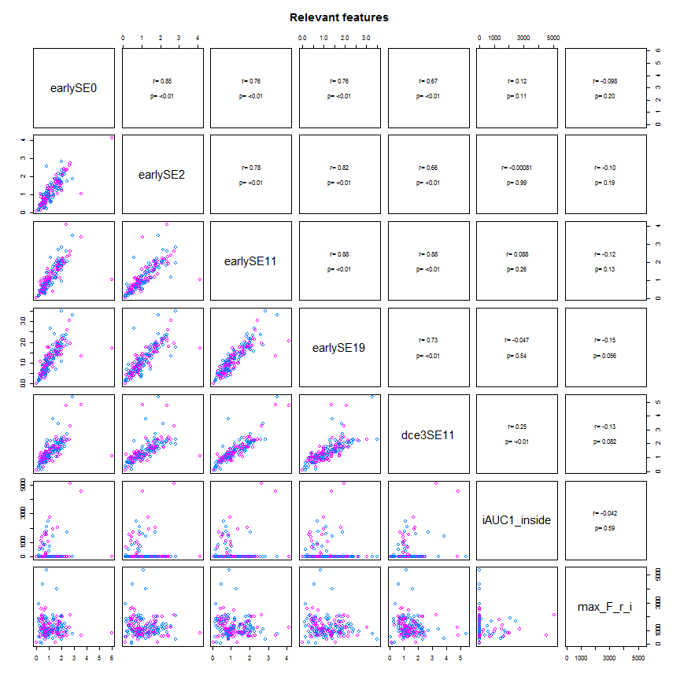 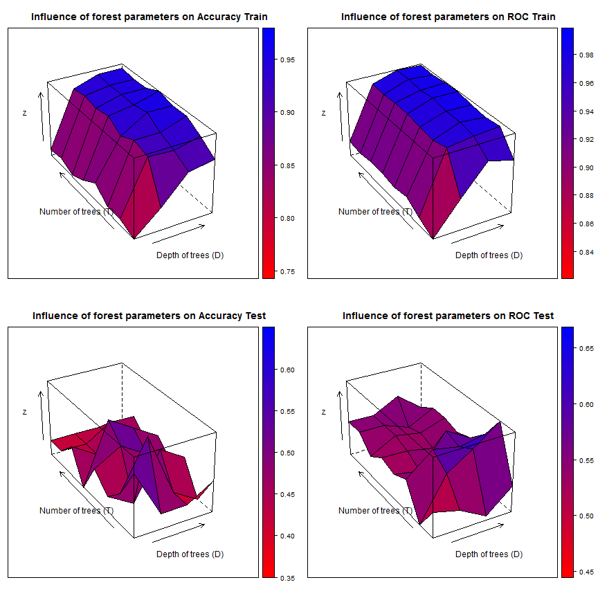 

```
## D:  2 T:  5 
## Area under the curve: 0.8
## Area under the curve: 0.783
## Area under the curve: 0.761
## Area under the curve: 0.677
## Area under the curve: 0.875
## Area under the curve: 0.833
## Area under the curve: 0.865
## Area under the curve: 0.833
## D:  5 T:  5 
## Area under the curve: 0.911
## Area under the curve: 0.918
## Area under the curve: 0.754
## Area under the curve: 0.606
## Area under the curve: 0.698
## Area under the curve: 0.771
## Area under the curve: 0.729
## Area under the curve: 0.625
## D:  10 T:  5 
## Area under the curve: 0.94
## Area under the curve: 0.939
## Area under the curve: 0.582
## Area under the curve: 0.465
## Area under the curve: 0.854
## Area under the curve: 0.812
## Area under the curve: 0.812
## Area under the curve: 0.833
## D:  20 T:  5 
## Area under the curve: 0.941
## Area under the curve: 0.948
## Area under the curve: 0.651
## Area under the curve: 0.566
## Area under the curve: 0.802
## Area under the curve: 0.823
## Area under the curve: 0.792
## Area under the curve: 0.531
## D:  2 T:  10 
## Area under the curve: 0.834
## Area under the curve: 0.813
## Area under the curve: 0.767
## Area under the curve: 0.648
## Area under the curve: 0.844
## Area under the curve: 0.865
## Area under the curve: 0.885
## Area under the curve: 0.635
## D:  5 T:  10 
## Area under the curve: 0.946
## Area under the curve: 0.934
## Area under the curve: 0.686
## Area under the curve: 0.6
## Area under the curve: 0.583
## Area under the curve: 0.792
## Area under the curve: 0.823
## Area under the curve: 0.781
## D:  10 T:  10 
## Area under the curve: 0.994
## Area under the curve: 0.993
## Area under the curve: 0.703
## Area under the curve: 0.627
## Area under the curve: 0.75
## Area under the curve: 0.812
## Area under the curve: 0.74
## Area under the curve: 0.479
## D:  20 T:  10 
## Area under the curve: 0.986
## Area under the curve: 0.967
## Area under the curve: 0.696
## Area under the curve: 0.517
## Area under the curve: 0.781
## Area under the curve: 0.823
## Area under the curve: 0.792
## Area under the curve: 0.625
## D:  2 T:  30 
## Area under the curve: 0.84
## Area under the curve: 0.816
## Area under the curve: 0.778
## Area under the curve: 0.528
## Area under the curve: 0.812
## Area under the curve: 0.844
## Area under the curve: 0.906
## Area under the curve: 0.615
## D:  5 T:  30 
## Area under the curve: 0.965
## Area under the curve: 0.94
## Area under the curve: 0.759
## Area under the curve: 0.539
## Area under the curve: 0.812
## Area under the curve: 0.812
## Area under the curve: 0.823
## Area under the curve: 0.573
## D:  10 T:  30 
## Area under the curve: 0.999
## Area under the curve: 0.989
## Area under the curve: 0.696
## Area under the curve: 0.571
## Area under the curve: 0.823
## Area under the curve: 0.812
## Area under the curve: 0.875
## Area under the curve: 0.562
## D:  20 T:  30 
## Area under the curve: 0.995
## Area under the curve: 0.987
## Area under the curve: 0.66
## Area under the curve: 0.545
## Area under the curve: 0.74
## Area under the curve: 0.854
## Area under the curve: 0.823
## Area under the curve: 0.625
## D:  2 T:  60 
## Area under the curve: 0.845
## Area under the curve: 0.831
## Area under the curve: 0.771
## Area under the curve: 0.546
## Area under the curve: 0.854
## Area under the curve: 0.875
## Area under the curve: 0.906
## Area under the curve: 0.583
## D:  5 T:  60 
## Area under the curve: 0.984
## Area under the curve: 0.958
## Area under the curve: 0.751
## Area under the curve: 0.506
## Area under the curve: 0.833
## Area under the curve: 0.875
## Area under the curve: 0.906
## Area under the curve: 0.594
## D:  10 T:  60 
## Area under the curve: 0.998
## Area under the curve: 0.992
## Area under the curve: 0.738
## Area under the curve: 0.522
## Area under the curve: 0.781
## Area under the curve: 0.823
## Area under the curve: 0.865
## Area under the curve: 0.625
## D:  20 T:  60 
## Area under the curve: 0.999
## Area under the curve: 0.995
## Area under the curve: 0.705
## Area under the curve: 0.513
## Area under the curve: 0.844
## Area under the curve: 0.802
## Area under the curve: 0.833
## Area under the curve: 0.542
## D:  2 T:  100 
## Area under the curve: 0.852
## Area under the curve: 0.827
## Area under the curve: 0.767
## Area under the curve: 0.538
## Area under the curve: 0.833
## Area under the curve: 0.896
## Area under the curve: 0.896
## Area under the curve: 0.531
## D:  5 T:  100 
## Area under the curve: 0.99
## Area under the curve: 0.954
## Area under the curve: 0.744
## Area under the curve: 0.599
## Area under the curve: 0.844
## Area under the curve: 0.854
## Area under the curve: 0.875
## Area under the curve: 0.583
## D:  10 T:  100 
## Area under the curve: 0.998
## Area under the curve: 0.994
## Area under the curve: 0.743
## Area under the curve: 0.577
## Area under the curve: 0.823
## Area under the curve: 0.854
## Area under the curve: 0.823
## Area under the curve: 0.635
## D:  20 T:  100 
## Area under the curve: 1
## Area under the curve: 0.995
## Area under the curve: 0.708
## Area under the curve: 0.564
## Area under the curve: 0.812
## Area under the curve: 0.823
## Area under the curve: 0.833
## Area under the curve: 0.625
## D:  2 T:  250 
## Area under the curve: 0.85
## Area under the curve: 0.831
## Area under the curve: 0.777
## Area under the curve: 0.538
## Area under the curve: 0.844
## Area under the curve: 0.875
## Area under the curve: 0.896
## Area under the curve: 0.562
## D:  5 T:  250 
## Area under the curve: 0.991
## Area under the curve: 0.952
## Area under the curve: 0.751
## Area under the curve: 0.587
## Area under the curve: 0.781
## Area under the curve: 0.833
## Area under the curve: 0.865
## Area under the curve: 0.635
## D:  10 T:  250 
## Area under the curve: 1
## Area under the curve: 0.997
## Area under the curve: 0.751
## Area under the curve: 0.556
## Area under the curve: 0.792
## Area under the curve: 0.823
## Area under the curve: 0.854
## Area under the curve: 0.594
## D:  20 T:  250 
## Area under the curve: 0.999
## Area under the curve: 0.997
## Area under the curve: 0.758
## Area under the curve: 0.566
## Area under the curve: 0.802
## Area under the curve: 0.812
## Area under the curve: 0.885
## Area under the curve: 0.615
## D:  2 T:  500 
## Area under the curve: 0.846
## Area under the curve: 0.831
## Area under the curve: 0.773
## Area under the curve: 0.551
## Area under the curve: 0.865
## Area under the curve: 0.865
## Area under the curve: 0.885
## Area under the curve: 0.521
## D:  5 T:  500 
## Area under the curve: 0.991
## Area under the curve: 0.961
## Area under the curve: 0.759
## Area under the curve: 0.59
## Area under the curve: 0.781
## Area under the curve: 0.844
## Area under the curve: 0.854
## Area under the curve: 0.604
## D:  10 T:  500 
## Area under the curve: 1
## Area under the curve: 0.998
## Area under the curve: 0.752
## Area under the curve: 0.547
## Area under the curve: 0.792
## Area under the curve: 0.833
## Area under the curve: 0.875
## Area under the curve: 0.635
## D:  20 T:  500 
## Area under the curve: 1
## Area under the curve: 0.999
## Area under the curve: 0.749
## Area under the curve: 0.596
## Area under the curve: 0.781
## Area under the curve: 0.823
## Area under the curve: 0.875
## Area under the curve: 0.583
## D:  2 T:  750 
## Area under the curve: 0.849
## Area under the curve: 0.827
## Area under the curve: 0.775
## Area under the curve: 0.553
## Area under the curve: 0.875
## Area under the curve: 0.885
## Area under the curve: 0.875
## Area under the curve: 0.573
## D:  5 T:  750 
## Area under the curve: 0.989
## Area under the curve: 0.955
## Area under the curve: 0.756
## Area under the curve: 0.583
## Area under the curve: 0.823
## Area under the curve: 0.812
## Area under the curve: 0.865
## Area under the curve: 0.604
## D:  10 T:  750 
## Area under the curve: 1
## Area under the curve: 0.999
## Area under the curve: 0.747
## Area under the curve: 0.563
## Area under the curve: 0.802
## Area under the curve: 0.854
## Area under the curve: 0.865
## Area under the curve: 0.635
## D:  20 T:  750 
## Area under the curve: 1
## Area under the curve: 0.999
## Area under the curve: 0.748
## Area under the curve: 0.576
## Area under the curve: 0.802
## Area under the curve: 0.833
## Area under the curve: 0.865
## Area under the curve: 0.625
##     x   y acuTrain rocTrain senTrain speTrain acuTest rocTest senTest
## 1   2   5   0.5123   0.7554   0.5797   0.8095  0.6071  0.8516   0.750
## 2   5   5   0.7049   0.7970   0.6957   0.9333  0.5000  0.7057   0.375
## 3  10   5   0.7746   0.7316   0.8116   0.9524  0.5357  0.8281   0.625
## 4  20   5   0.7951   0.7762   0.7536   0.9429  0.5000  0.7370   0.375
## 5   2  10   0.5287   0.7653   0.4348   0.9429  0.5714  0.8073   0.500
## 6   5  10   0.6885   0.7915   0.6667   0.9619  0.5000  0.7448   0.625
## 7  10  10   0.8361   0.8291   0.8841   0.9905  0.5357  0.6953   0.625
## 8  20  10   0.8525   0.7915   0.8551   0.9810  0.5357  0.7552   0.500
## 9   2  30   0.5205   0.7406   0.4348   0.9238  0.5357  0.7943   0.625
## 10  5  30   0.7582   0.8007   0.7971   0.9429  0.5357  0.7552   0.750
## 11 10  30   0.8893   0.8136   0.9130   1.0000  0.6071  0.7682   0.875
## 12 20  30   0.9057   0.7969   0.8551   1.0000  0.6786  0.7604   0.750
## 13  2  60   0.5328   0.7482   0.5362   0.8857  0.6429  0.8047   0.750
## 14  5  60   0.7418   0.7996   0.8116   0.9905  0.5714  0.8021   0.750
## 15 10  60   0.9262   0.8127   0.9420   1.0000  0.6071  0.7734   0.750
## 16 20  60   0.9344   0.8032   0.9275   1.0000  0.6429  0.7552   0.750
## 17  2 100   0.5082   0.7462   0.4638   0.8762  0.6071  0.7891   0.625
## 18  5 100   0.7582   0.8219   0.8406   0.9714  0.6071  0.7891   0.750
## 19 10 100   0.9590   0.8280   0.9565   1.0000  0.5714  0.7839   0.625
## 20 20 100   0.9344   0.8169   0.9275   1.0000  0.5714  0.7734   0.750
## 21  2 250   0.5164   0.7492   0.4348   0.9143  0.5714  0.7943   0.625
## 22  5 250   0.7746   0.8203   0.8551   0.9714  0.5357  0.7786   0.625
## 23 10 250   0.9426   0.8262   0.9420   1.0000  0.5714  0.7656   0.625
## 24 20 250   0.9426   0.8303   0.9275   1.0000  0.5714  0.7786   0.750
## 25  2 500   0.5205   0.7502   0.4493   0.9143  0.5714  0.7839   0.625
## 26  5 500   0.7623   0.8251   0.8261   0.9810  0.5357  0.7708   0.625
## 27 10 500   0.9426   0.8244   0.9420   1.0000  0.6071  0.7839   0.625
## 28 20 500   0.9508   0.8359   0.9565   1.0000  0.6071  0.7656   0.750
## 29  2 750   0.5123   0.7508   0.4493   0.8952  0.6071  0.8021   0.625
## 30  5 750   0.7746   0.8208   0.8406   0.9714  0.5357  0.7760   0.625
## 31 10 750   0.9549   0.8271   0.9710   1.0000  0.5357  0.7891   0.625
## 32 20 750   0.9467   0.8307   0.9420   1.0000  0.5714  0.7812   0.750
##    speTest
## 1   0.9167
## 2   0.8333
## 3   0.8333
## 4   0.7500
## 5   1.0000
## 6   0.6667
## 7   0.7500
## 8   0.9167
## 9   0.8333
## 10  0.7500
## 11  0.8333
## 12  0.9167
## 13  1.0000
## 14  0.8333
## 15  0.8333
## 16  0.9167
## 17  1.0000
## 18  0.9167
## 19  0.9167
## 20  0.8333
## 21  0.9167
## 22  0.8333
## 23  0.8333
## 24  0.8333
## 25  0.9167
## 26  0.8333
## 27  0.9167
## 28  0.8333
## 29  1.0000
## 30  0.8333
## 31  0.8333
## 32  0.8333
## Initial round 1: ..........
##  7  attributes rejected after this test:  min_F_r_i skew_F_r_i k_Max_Margin_Grad ivVariance max_RGH_var_k texture_dissimilarity_quarterRad texture_dissimilarity_halfRad 
## 
## Initial round 2: ..........
##  8  attributes rejected after this test:  maxVr_inside Vr_increasingRate_inside beta_countor peakVr_countor Vr_post_1_countor iiiMax_Margin_Gradient texture_dissimilarity_threeQuaRad texture_correlation_halfRad 
## 
## Initial round 3: ..........
##  9  attributes rejected after this test:  peakVr_inside Vr_post_1_inside iAUC1_countor Tpeak_countor Vr_increasingRate_countor var_F_r_i kurt_F_r_i texture_correlation_quarterRad texture_correlation_threeQuaRad 
## 
## Final round: ..........
##  5  attributes confirmed after this test:  iAUC1_inside Slope_ini_inside maxCr_inside UptakeRate_inside UptakeRate_countor 
## 
##  9  attributes rejected after this test:  Kpeak_inside peakCr_countor Vr_decreasingRate_countor iMax_Variance_uptake edge_sharp_mean max_RGH_mean_k texture_contrast_quarterRad texture_homogeneity_zero texture_homogeneity_quarterRad 
## ....
##  8  attributes rejected after this test:  beta_inside A_countor Kpeak_countor SER_countor maxVr_countor texture_homogeneity_halfRad texture_homogeneity_threeQuaRad texture_correlation_zero 
## ....
##  2  attributes confirmed after this test:  texture_ASM_quarterRad texture_ASM_halfRad 
## ...
##  2  attributes confirmed after this test:  SER_inside washoutRate_inside 
## 
##  1  attributes rejected after this test:  texture_contrast_threeQuaRad 
## ...
##  3  attributes confirmed after this test:  washoutRate_countor max_F_r_i circularity 
## ...
##  4  attributes confirmed after this test:  alpha_inside Tpeak_inside irregularity texture_ASM_zero 
## ...........
##  1  attributes rejected after this test:  max_RGH_mean 
## .....
##  1  attributes confirmed after this test:  maxCr_countor 
## 
##  1  attributes rejected after this test:  texture_dissimilarity_zero 
## ...
##  1  attributes confirmed after this test:  iiMin_change_Variance_uptake 
## 
##  1  attributes rejected after this test:  max_RGH_var 
## ...
##  2  attributes confirmed after this test:  peakCr_inside mean_F_r_i 
## .......
##  1  attributes rejected after this test:  texture_contrast_halfRad 
## ............................................
## Boruta performed 130 randomForest runs in 6.381 mins.
##         20 attributes confirmed important: alpha_inside
## iAUC1_inside Slope_ini_inside Tpeak_inside SER_inside maxCr_inside
## peakCr_inside UptakeRate_inside washoutRate_inside maxCr_countor
## UptakeRate_countor washoutRate_countor max_F_r_i mean_F_r_i
## iiMin_change_Variance_uptake circularity irregularity
## texture_ASM_zero texture_ASM_quarterRad texture_ASM_halfRad
##         46 attributes confirmed unimportant: beta_inside
## Kpeak_inside maxVr_inside peakVr_inside Vr_increasingRate_inside
## Vr_post_1_inside A_countor beta_countor iAUC1_countor
## Tpeak_countor Kpeak_countor SER_countor peakCr_countor
## maxVr_countor peakVr_countor Vr_increasingRate_countor
## Vr_decreasingRate_countor Vr_post_1_countor min_F_r_i var_F_r_i
## skew_F_r_i kurt_F_r_i iMax_Variance_uptake iiiMax_Margin_Gradient
## k_Max_Margin_Grad ivVariance edge_sharp_mean max_RGH_mean
## max_RGH_mean_k max_RGH_var max_RGH_var_k
## texture_contrast_quarterRad texture_contrast_halfRad
## texture_contrast_threeQuaRad texture_homogeneity_zero
## texture_homogeneity_quarterRad texture_homogeneity_halfRad
## texture_homogeneity_threeQuaRad texture_dissimilarity_zero
## texture_dissimilarity_quarterRad texture_dissimilarity_halfRad
## texture_dissimilarity_threeQuaRad texture_correlation_zero
## texture_correlation_quarterRad texture_correlation_halfRad
## texture_correlation_threeQuaRad
##         6 tentative attributes left: A_inside
## Vr_decreasingRate_inside alpha_countor Slope_ini_countor
## edge_sharp_std texture_contrast_zero
```

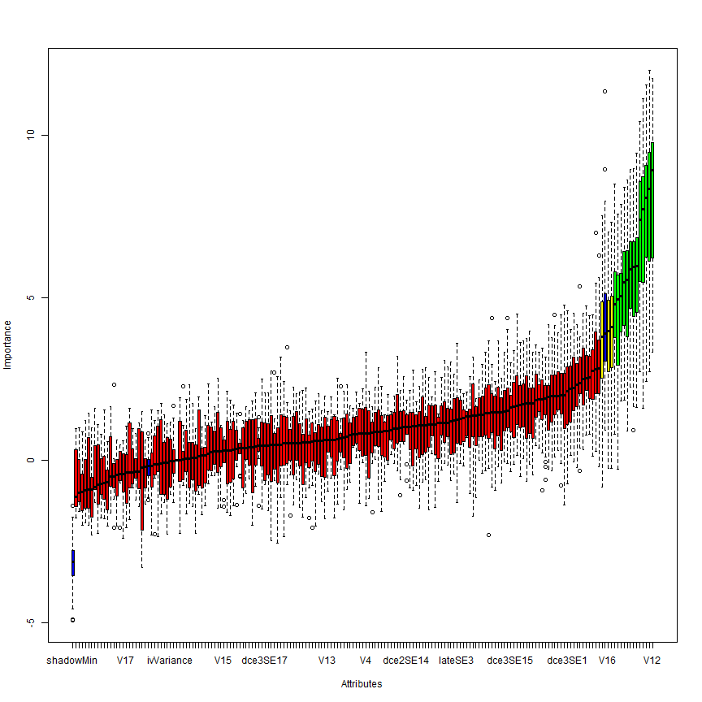 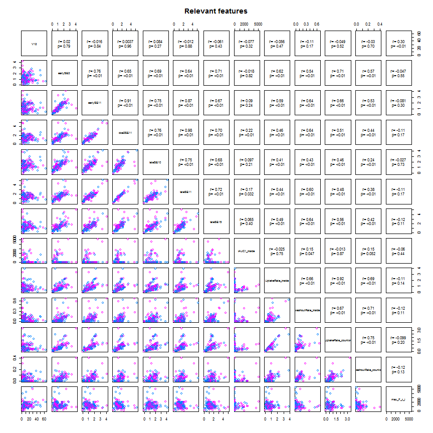 

```
## D:  2 T:  5 
## Area under the curve: 0.785
## Area under the curve: 0.769
## Area under the curve: 0.757
## Area under the curve: 0.622
## Area under the curve: 0.744
## Area under the curve: 0.72
## Area under the curve: 0.661
## Area under the curve: 0.565
## D:  5 T:  5 
## Area under the curve: 0.902
## Area under the curve: 0.876
## Area under the curve: 0.703
## Area under the curve: 0.55
## Area under the curve: 0.56
## Area under the curve: 0.571
## Area under the curve: 0.482
## Area under the curve: 0.476
## D:  10 T:  5 
## Area under the curve: 0.958
## Area under the curve: 0.956
## Area under the curve: 0.677
## Area under the curve: 0.493
## Area under the curve: 0.595
## Area under the curve: 0.714
## Area under the curve: 0.702
## Area under the curve: 0.464
## D:  20 T:  5 
## Area under the curve: 0.957
## Area under the curve: 0.956
## Area under the curve: 0.612
## Area under the curve: 0.535
## Area under the curve: 0.679
## Area under the curve: 0.655
## Area under the curve: 0.631
## Area under the curve: 0.655
## D:  2 T:  10 
## Area under the curve: 0.811
## Area under the curve: 0.796
## Area under the curve: 0.753
## Area under the curve: 0.685
## Area under the curve: 0.702
## Area under the curve: 0.702
## Area under the curve: 0.845
## Area under the curve: 0.536
## D:  5 T:  10 
## Area under the curve: 0.957
## Area under the curve: 0.909
## Area under the curve: 0.751
## Area under the curve: 0.51
## Area under the curve: 0.714
## Area under the curve: 0.607
## Area under the curve: 0.607
## Area under the curve: 0.536
## D:  10 T:  10 
## Area under the curve: 0.982
## Area under the curve: 0.964
## Area under the curve: 0.676
## Area under the curve: 0.594
## Area under the curve: 0.81
## Area under the curve: 0.702
## Area under the curve: 0.488
## Area under the curve: 0.595
## D:  20 T:  10 
## Area under the curve: 0.989
## Area under the curve: 0.984
## Area under the curve: 0.692
## Area under the curve: 0.495
## Area under the curve: 0.571
## Area under the curve: 0.619
## Area under the curve: 0.613
## Area under the curve: 0.631
## D:  2 T:  30 
## Area under the curve: 0.837
## Area under the curve: 0.808
## Area under the curve: 0.775
## Area under the curve: 0.675
## Area under the curve: 0.726
## Area under the curve: 0.655
## Area under the curve: 0.643
## Area under the curve: 0.524
## D:  5 T:  30 
## Area under the curve: 0.972
## Area under the curve: 0.946
## Area under the curve: 0.768
## Area under the curve: 0.599
## Area under the curve: 0.762
## Area under the curve: 0.774
## Area under the curve: 0.679
## Area under the curve: 0.536
## D:  10 T:  30 
## Area under the curve: 0.998
## Area under the curve: 0.99
## Area under the curve: 0.735
## Area under the curve: 0.558
## Area under the curve: 0.75
## Area under the curve: 0.714
## Area under the curve: 0.631
## Area under the curve: 0.548
## D:  20 T:  30 
## Area under the curve: 0.999
## Area under the curve: 0.994
## Area under the curve: 0.745
## Area under the curve: 0.539
## Area under the curve: 0.655
## Area under the curve: 0.81
## Area under the curve: 0.631
## Area under the curve: 0.762
## D:  2 T:  60 
## Area under the curve: 0.878
## Area under the curve: 0.836
## Area under the curve: 0.8
## Area under the curve: 0.608
## Area under the curve: 0.786
## Area under the curve: 0.714
## Area under the curve: 0.679
## Area under the curve: 0.536
## D:  5 T:  60 
## Area under the curve: 0.978
## Area under the curve: 0.939
## Area under the curve: 0.749
## Area under the curve: 0.607
## Area under the curve: 0.726
## Area under the curve: 0.774
## Area under the curve: 0.595
## Area under the curve: 0.69
## D:  10 T:  60 
## Area under the curve: 0.999
## Area under the curve: 0.99
## Area under the curve: 0.763
## Area under the curve: 0.601
## Area under the curve: 0.607
## Area under the curve: 0.667
## Area under the curve: 0.643
## Area under the curve: 0.595
## D:  20 T:  60 
## Area under the curve: 0.999
## Area under the curve: 0.985
## Area under the curve: 0.743
## Area under the curve: 0.6
## Area under the curve: 0.762
## Area under the curve: 0.714
## Area under the curve: 0.548
## Area under the curve: 0.524
## D:  2 T:  100 
## Area under the curve: 0.862
## Area under the curve: 0.831
## Area under the curve: 0.798
## Area under the curve: 0.675
## Area under the curve: 0.774
## Area under the curve: 0.679
## Area under the curve: 0.667
## Area under the curve: 0.488
## D:  5 T:  100 
## Area under the curve: 0.983
## Area under the curve: 0.947
## Area under the curve: 0.784
## Area under the curve: 0.611
## Area under the curve: 0.679
## Area under the curve: 0.679
## Area under the curve: 0.607
## Area under the curve: 0.571
## D:  10 T:  100 
## Area under the curve: 0.999
## Area under the curve: 0.987
## Area under the curve: 0.767
## Area under the curve: 0.481
## Area under the curve: 0.702
## Area under the curve: 0.702
## Area under the curve: 0.655
## Area under the curve: 0.548
## D:  20 T:  100 
## Area under the curve: 0.999
## Area under the curve: 0.988
## Area under the curve: 0.766
## Area under the curve: 0.592
## Area under the curve: 0.738
## Area under the curve: 0.69
## Area under the curve: 0.595
## Area under the curve: 0.667
## D:  2 T:  250 
## Area under the curve: 0.861
## Area under the curve: 0.829
## Area under the curve: 0.8
## Area under the curve: 0.657
## Area under the curve: 0.69
## Area under the curve: 0.655
## Area under the curve: 0.583
## Area under the curve: 0.583
## D:  5 T:  250 
## Area under the curve: 0.984
## Area under the curve: 0.952
## Area under the curve: 0.79
## Area under the curve: 0.587
## Area under the curve: 0.714
## Area under the curve: 0.69
## Area under the curve: 0.595
## Area under the curve: 0.524
## D:  10 T:  250 
## Area under the curve: 1
## Area under the curve: 0.992
## Area under the curve: 0.771
## Area under the curve: 0.6
## Area under the curve: 0.655
## Area under the curve: 0.679
## Area under the curve: 0.667
## Area under the curve: 0.571
## D:  20 T:  250 
## Area under the curve: 1
## Area under the curve: 0.993
## Area under the curve: 0.765
## Area under the curve: 0.566
## Area under the curve: 0.643
## Area under the curve: 0.702
## Area under the curve: 0.643
## Area under the curve: 0.595
## D:  2 T:  500 
## Area under the curve: 0.862
## Area under the curve: 0.828
## Area under the curve: 0.796
## Area under the curve: 0.637
## Area under the curve: 0.643
## Area under the curve: 0.643
## Area under the curve: 0.607
## Area under the curve: 0.405
## D:  5 T:  500 
## Area under the curve: 0.981
## Area under the curve: 0.947
## Area under the curve: 0.797
## Area under the curve: 0.627
## Area under the curve: 0.75
## Area under the curve: 0.762
## Area under the curve: 0.631
## Area under the curve: 0.44
## D:  10 T:  500 
## Area under the curve: 1
## Area under the curve: 0.989
## Area under the curve: 0.759
## Area under the curve: 0.578
## Area under the curve: 0.667
## Area under the curve: 0.702
## Area under the curve: 0.619
## Area under the curve: 0.464
## D:  20 T:  500 
## Area under the curve: 1
## Area under the curve: 0.992
## Area under the curve: 0.768
## Area under the curve: 0.558
## Area under the curve: 0.69
## Area under the curve: 0.714
## Area under the curve: 0.655
## Area under the curve: 0.488
## D:  2 T:  750 
## Area under the curve: 0.86
## Area under the curve: 0.828
## Area under the curve: 0.801
## Area under the curve: 0.647
## Area under the curve: 0.714
## Area under the curve: 0.655
## Area under the curve: 0.631
## Area under the curve: 0.595
## D:  5 T:  750 
## Area under the curve: 0.984
## Area under the curve: 0.949
## Area under the curve: 0.79
## Area under the curve: 0.598
## Area under the curve: 0.714
## Area under the curve: 0.69
## Area under the curve: 0.667
## Area under the curve: 0.476
## D:  10 T:  750 
## Area under the curve: 1
## Area under the curve: 0.992
## Area under the curve: 0.768
## Area under the curve: 0.558
## Area under the curve: 0.655
## Area under the curve: 0.655
## Area under the curve: 0.631
## Area under the curve: 0.571
## D:  20 T:  750 
## Area under the curve: 1
## Area under the curve: 0.993
## Area under the curve: 0.776
## Area under the curve: 0.573
## Area under the curve: 0.655
## Area under the curve: 0.667
## Area under the curve: 0.619
## Area under the curve: 0.476
##     x   y acuTrain rocTrain senTrain speTrain acuTest rocTest senTest
## 1   2   5   0.5265   0.7334   0.5714   0.8476  0.4444  0.6726  0.4286
## 2   5   5   0.6327   0.7577   0.7143   0.8190  0.2963  0.5223  0.2857
## 3  10   5   0.7061   0.7710   0.7000   0.9619  0.4074  0.6190  0.4286
## 4  20   5   0.7918   0.7648   0.7571   0.9143  0.4815  0.6548  0.5714
## 5   2  10   0.5102   0.7612   0.5714   0.8095  0.4815  0.6964  0.5714
## 6   5  10   0.7510   0.7815   0.8286   0.8857  0.5185  0.6161  0.7143
## 7  10  10   0.8653   0.8042   0.9143   0.9333  0.5926  0.6488  0.7143
## 8  20  10   0.8571   0.7899   0.8857   0.9619  0.4815  0.6086  0.7143
## 9   2  30   0.5429   0.7739   0.5857   0.8762  0.4815  0.6369  0.7143
## 10  5  30   0.7796   0.8213   0.8286   0.9714  0.4815  0.6875  0.2857
## 11 10  30   0.9143   0.8202   0.9000   0.9905  0.5185  0.6607  0.7143
## 12 20  30   0.9020   0.8192   0.9143   1.0000  0.5926  0.7143  0.5714
## 13  2  60   0.5510   0.7806   0.6143   0.8762  0.5185  0.6786  0.7143
## 14  5  60   0.7429   0.8184   0.8429   0.9143  0.4444  0.6964  0.7143
## 15 10  60   0.9265   0.8384   0.9571   1.0000  0.4074  0.6280  0.5714
## 16 20  60   0.9224   0.8320   0.9000   1.0000  0.4815  0.6369  0.5714
## 17  2 100   0.5429   0.7914   0.6143   0.8571  0.4444  0.6518  0.7143
## 18  5 100   0.7796   0.8311   0.8714   0.9524  0.5556  0.6339  0.7143
## 19 10 100   0.9061   0.8087   0.9143   1.0000  0.5185  0.6518  0.7143
## 20 20 100   0.9306   0.8364   0.9000   1.0000  0.5185  0.6726  0.7143
## 21  2 250   0.5469   0.7868   0.6000   0.8762  0.4444  0.6280  0.7143
## 22  5 250   0.7224   0.8281   0.8571   0.9143  0.4815  0.6310  0.7143
## 23 10 250   0.9224   0.8408   0.9000   1.0000  0.5185  0.6429  0.5714
## 24 20 250   0.9429   0.8309   0.9286   1.0000  0.5185  0.6458  0.7143
## 25  2 500   0.5388   0.7809   0.5857   0.8667  0.4444  0.5744  0.7143
## 26  5 500   0.7551   0.8381   0.8429   0.9238  0.4815  0.6458  0.7143
## 27 10 500   0.9347   0.8316   0.9143   1.0000  0.5185  0.6131  0.5714
## 28 20 500   0.9306   0.8297   0.9143   1.0000  0.5556  0.6369  0.7143
## 29  2 750   0.5429   0.7839   0.5857   0.8762  0.4815  0.6488  0.7143
## 30  5 750   0.7592   0.8300   0.8571   0.9333  0.4815  0.6369  0.7143
## 31 10 750   0.9306   0.8297   0.9000   1.0000  0.5185  0.6280  0.7143
## 32 20 750   0.9265   0.8354   0.9143   1.0000  0.4815  0.6042  0.5714
##    speTest
## 1   0.7500
## 2   0.4167
## 3   0.6667
## 4   0.7500
## 5   0.7500
## 6   0.5833
## 7   0.7500
## 8   0.5833
## 9   0.6667
## 10  0.9167
## 11  0.6667
## 12  0.9167
## 13  0.7500
## 14  0.5833
## 15  0.5833
## 16  0.7500
## 17  0.5833
## 18  0.8333
## 19  0.7500
## 20  0.7500
## 21  0.5833
## 22  0.6667
## 23  0.8333
## 24  0.6667
## 25  0.5833
## 26  0.6667
## 27  0.8333
## 28  0.8333
## 29  0.6667
## 30  0.6667
## 31  0.7500
## 32  0.7500
```

```r
accum_multigrdperf = res$ensemblegrdperf[1]$grdperf
for (k in 2:cvK) {
    accum_multigrdperf = accum_multigrdperf + res$ensemblegrdperf[k]$grdperf
}
cvKmultigrdperf = accum_multigrdperf/cvK
print(cvKmultigrdperf)
```

```
##     x   y acuTrain rocTrain senTrain speTrain acuTest rocTest senTest
## 1   2   5   0.5213   0.7269   0.5354   0.8471  0.4655  0.6953  0.4589
## 2   5   5   0.6659   0.7682   0.7215   0.8652  0.4232  0.6600  0.4054
## 3  10   5   0.7720   0.7730   0.7562   0.9212  0.4408  0.6475  0.3929
## 4  20   5   0.7990   0.7746   0.8181   0.9259  0.4331  0.6434  0.4036
## 5   2  10   0.5343   0.7582   0.5223   0.8851  0.4406  0.6530  0.3375
## 6   5  10   0.7148   0.7917   0.7662   0.8956  0.4517  0.6497  0.4643
## 7  10  10   0.8509   0.8070   0.8802   0.9725  0.4439  0.6510  0.3929
## 8  20  10   0.8545   0.8003   0.8860   0.9620  0.4228  0.6364  0.3286
## 9   2  30   0.5360   0.7623   0.5453   0.8869  0.4661  0.6869  0.4679
## 10  5  30   0.7634   0.8159   0.8198   0.9421  0.4596  0.6699  0.4643
## 11 10  30   0.9101   0.8260   0.9134   0.9886  0.4632  0.6767  0.4732
## 12 20  30   0.9073   0.8176   0.9119   0.9934  0.4847  0.6875  0.4946
## 13  2  60   0.5388   0.7664   0.5686   0.8784  0.5106  0.6909  0.5071
## 14  5  60   0.7647   0.8255   0.8327   0.9506  0.4667  0.6829  0.5179
## 15 10  60   0.9281   0.8251   0.9293   0.9972  0.4405  0.6717  0.4268
## 16 20  60   0.9338   0.8260   0.9192   0.9990  0.4628  0.6538  0.4661
## 17  2 100   0.5367   0.7707   0.5497   0.8860  0.4919  0.6993  0.4679
## 18  5 100   0.7700   0.8235   0.8211   0.9525  0.4769  0.6815  0.4804
## 19 10 100   0.9310   0.8311   0.9235   1.0000  0.4659  0.6794  0.4768
## 20 20 100   0.9347   0.8291   0.9235   0.9990  0.4669  0.6805  0.4929
## 21  2 250   0.5408   0.7709   0.5613   0.8880  0.4923  0.6873  0.4804
## 22  5 250   0.7704   0.8262   0.8311   0.9496  0.4517  0.6811  0.4661
## 23 10 250   0.9403   0.8335   0.9322   1.0000  0.4593  0.6774  0.4804
## 24 20 250   0.9436   0.8309   0.9263   1.0000  0.4403  0.6846  0.4536
## 25  2 500   0.5384   0.7744   0.5584   0.8841  0.4923  0.6818  0.4804
## 26  5 500   0.7729   0.8279   0.8327   0.9534  0.4614  0.6919  0.4911
## 27 10 500   0.9412   0.8332   0.9293   1.0000  0.4441  0.6726  0.4268
## 28 20 500   0.9404   0.8349   0.9308   1.0000  0.4478  0.6732  0.4679
## 29  2 750   0.5392   0.7732   0.5613   0.8841  0.5033  0.6987  0.4929
## 30  5 750   0.7753   0.8291   0.8355   0.9553  0.4483  0.6848  0.4929
## 31 10 750   0.9428   0.8340   0.9278   1.0000  0.4443  0.6747  0.4804
## 32 20 750   0.9444   0.8361   0.9293   1.0000  0.4332  0.6740  0.4393
##    speTest
## 1   0.7780
## 2   0.6720
## 3   0.6826
## 4   0.6803
## 5   0.8030
## 6   0.6833
## 7   0.7250
## 8   0.7258
## 9   0.7788
## 10  0.7424
## 11  0.7432
## 12  0.7583
## 13  0.8553
## 14  0.7364
## 15  0.7182
## 16  0.7424
## 17  0.8386
## 18  0.7947
## 19  0.7598
## 20  0.7341
## 21  0.8311
## 22  0.7432
## 23  0.7424
## 24  0.7083
## 25  0.8311
## 26  0.7500
## 27  0.7417
## 28  0.7242
## 29  0.8477
## 30  0.7174
## 31  0.7167
## 32  0.7167
```

```r

# plot
surface_forestperfm(cvKmultigrdperf)
```

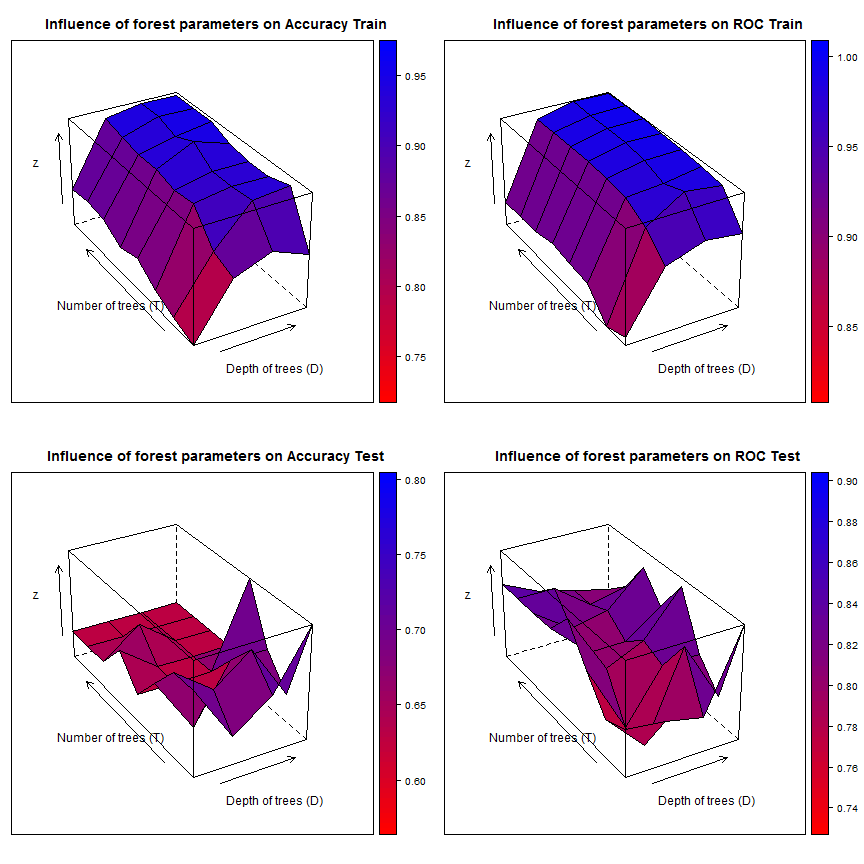 

```r

# plot ROC of resamples at max perf across cvFolds
resamROC_train = data.frame()
resamROC_test = data.frame()
for (k in 1:cvK) {
    resamROC_train = rbind(resamROC_train, res$maxM[k]$maxp$trainprob)
    resamROC_test = rbind(resamROC_test, res$maxM[k]$maxp$testprob)
}
# for resamROC
train_mb = plot.roc(resamROC_train$obs, resamROC_train$massB, col = "#000086", 
    lty = 1)
par(new = TRUE)
train_mm = plot.roc(resamROC_train$obs, resamROC_train$massM, col = "#000086", 
    lty = 1)
par(new = TRUE)
train_nb = plot.roc(resamROC_train$obs, resamROC_train$nonmassB, col = "#000086", 
    lty = 1)
par(new = TRUE)
train_nm = plot.roc(resamROC_train$obs, resamROC_train$nonmassM, col = "#000086", 
    lty = 1)
par(new = TRUE)
test_mb = plot.roc(resamROC_test$obs, resamROC_test$massB, col = "#860000", 
    lty = 2)
par(new = TRUE)
test_mm = plot.roc(resamROC_test$obs, resamROC_test$massM, col = "#860000", 
    lty = 2)
par(new = TRUE)
test_nb = plot.roc(resamROC_test$obs, resamROC_test$nonmassB, col = "#860000", 
    lty = 2)
par(new = TRUE)
test_nm = plot.roc(resamROC_test$obs, resamROC_test$nonmassM, col = "#860000", 
    lty = 2, main = "ROC for multiclass max cvFolds")

# calculate average
trainauc = (train_mb$auc + train_mm$auc + train_nb$auc + train_nm$auc)/4
testauc = (test_mb$auc + test_mm$auc + test_nb$auc + test_nm$auc)/4
print(trainauc)
```

```
## Area under the curve: 0.75
```

```r
print(testauc)
```

```
## Area under the curve: 0.699
```

```r
legend("bottomright", legend = c(paste0("train: AUC=", formatC(trainauc, digits = 2, 
    format = "f")), paste0("cv.test: AUC=", formatC(testauc, digits = 2, format = "f"))), 
    col = c("#000086", "#860000"), lwd = 2, lty = c(1, 2))
```

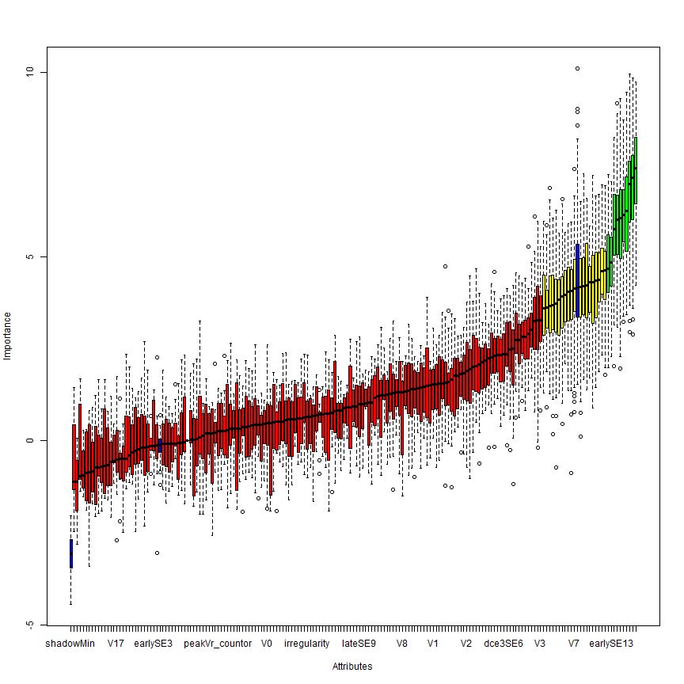 

```r

# save
save.image("Z:/Cristina/MassNonmass/Section1 - ExperimentsUpToDate/experimentsRadiologypaper-revision/Tree-based-RF/ensemble-Treebased-RF/results/cvKmultigrdperf.RData")
```


