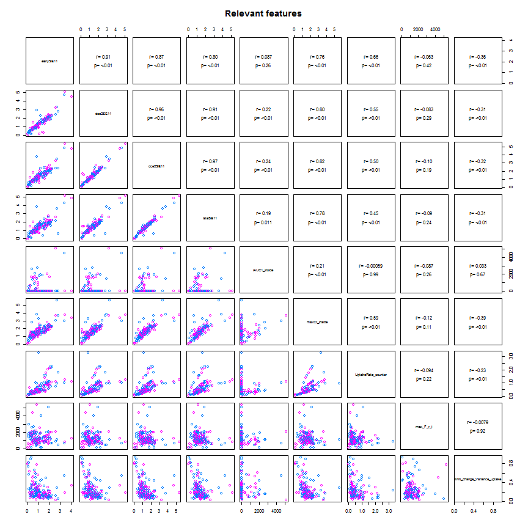
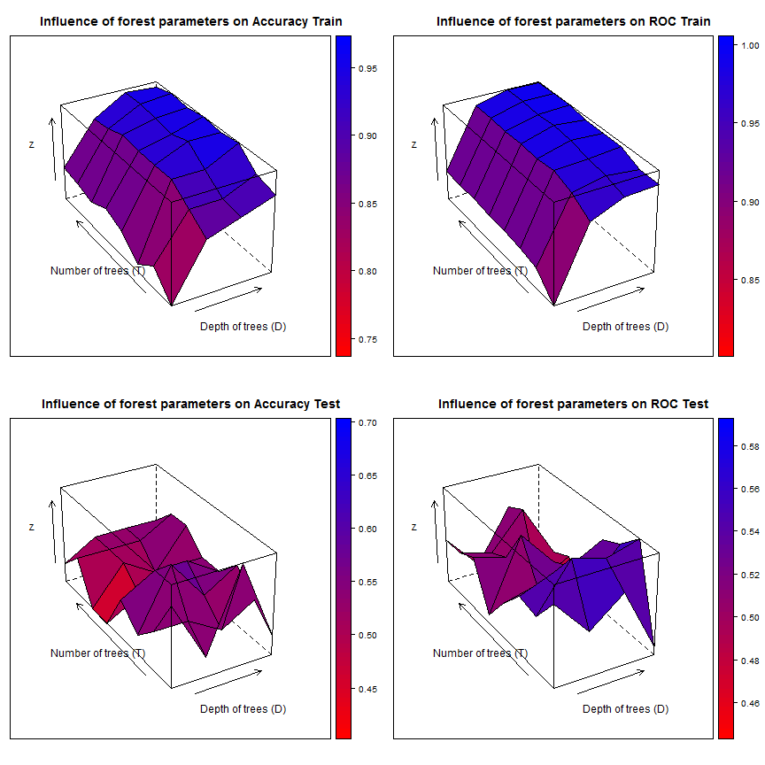
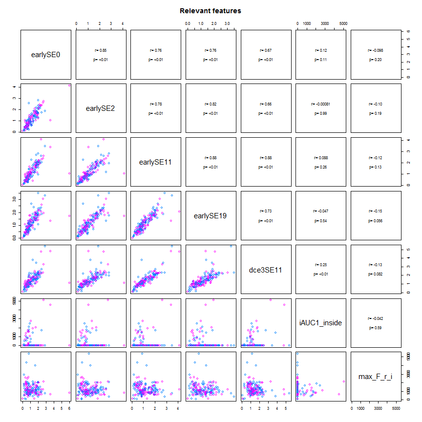
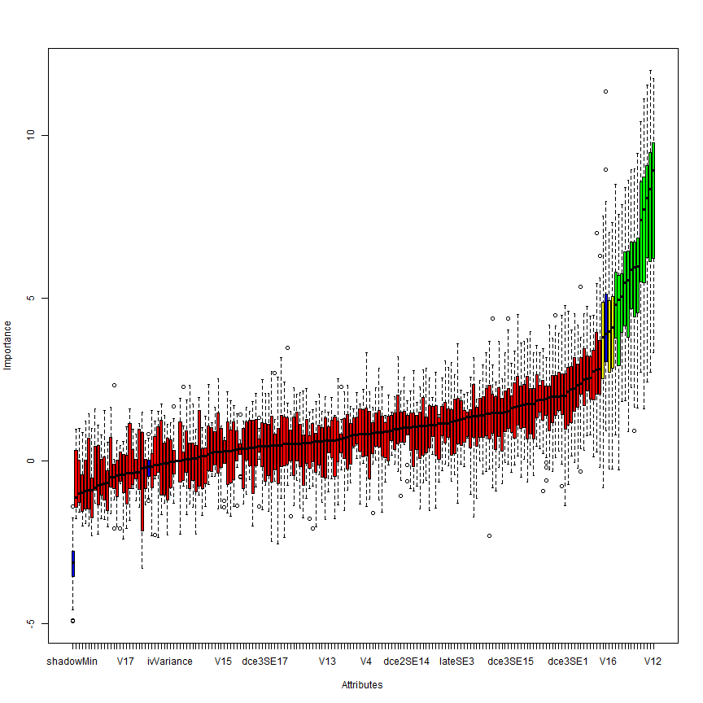

### code Read and partition data   

```r
setwd("Z:/Cristina/MassNonmass/Section1 - ExperimentsUpToDate/experimentsRadiologypaper-revision/Tree-based-RF/ensemble-Treebased-RF")
library("RSQLite")

rpart_inputdata <- function(subdata) {
    sqlite <- dbDriver("SQLite")
    conn <- dbConnect(sqlite, "stage1localData.db")
    
    # 2) all T1W features
    lesionsQuery <- dbGetQuery(conn, "SELECT *\n           FROM  stage1features\n           INNER JOIN lesion ON (stage1features.lesion_id = lesion.lesion_id)\n           INNER JOIN f_dynamic ON (stage1features.lesion_id = f_dynamic.lesion_id)\n           INNER JOIN f_morphology ON (stage1features.lesion_id = f_morphology.lesion_id)\n           INNER JOIN f_texture ON (stage1features.lesion_id = f_texture.lesion_id)")
    
    # prune entries and extract feature subsets corresponds to 5 entries
    # lesion info, 34 dynamic, 19 morpho, 34 texture fueatures
    lesionfields = names(lesionsQuery)
    lesioninfo = lesionsQuery[c(1, 2, 150, 151)]
    stage1features = lesionsQuery[c(3:103, 124:127)]
    dynfeatures = lesionsQuery[c(154:187)]
    morphofeatures = lesionsQuery[c(190:208)]
    texfeatures = lesionsQuery[c(211:234)]
    
    # combine all features
    allfeatures = cbind(lesioninfo[1:272, 2:3], stage1features[1:272, 1:ncol(stage1features)], 
        dynfeatures[1:272, 1:ncol(dynfeatures)], morphofeatures[1:272, 1:ncol(morphofeatures)], 
        texfeatures[1:272, 1:ncol(texfeatures)])
    # combine all features
    
    
    if (subdata == "mass") {
        # organized the data by subdata
        M <- subset(allfeatures, lesion_label == "massB" | lesion_label == "massM")
        M$lesion_label <- ifelse(M$lesion_label == "massB", "NC", "C")
        allfeatures = M
    }
    if (subdata == "nonmass") {
        # organized the data by subdata
        N <- subset(allfeatures, lesion_label == "nonmassB" | lesion_label == 
            "nonmassM")
        N$lesion_label <- ifelse(N$lesion_label == "nonmassB", "NC", "C")
        allfeatures = N
    }
    if (subdata == "stage1") {
        # organized the data by subdata
        M <- subset(allfeatures, lesion_label == "massB" | lesion_label == "massM")
        M$lesion_label <- ifelse(M$lesion_label == "massB", "mass", "mass")
        N <- subset(allfeatures, lesion_label == "nonmassB" | lesion_label == 
            "nonmassM")
        N$lesion_label <- ifelse(N$lesion_label == "nonmassB", "nonmass", "nonmass")
        allfeatures = data.frame(rbind(M, N))
    }
    if (subdata == "oneshot") {
        # organized the data by subdata
        M <- subset(allfeatures, lesion_label == "massB" | lesion_label == "massM")
        M$lesion_label <- ifelse(M$lesion_label == "massB", "NC", "C")
        N <- subset(allfeatures, lesion_label == "nonmassB" | lesion_label == 
            "nonmassM")
        N$lesion_label <- ifelse(N$lesion_label == "nonmassB", "NC", "C")
        allfeatures = data.frame(rbind(M, N))
    }
    # procees data
    allfeatures$lesion_label <- as.factor(allfeatures$lesion_label)
    allfeatures$peakCr_inside <- as.factor(allfeatures$peakCr_inside)
    allfeatures$peakVr_inside <- as.factor(allfeatures$peakVr_inside)
    allfeatures$peakCr_countor <- as.factor(allfeatures$peakCr_countor)
    allfeatures$peakVr_countor <- as.factor(allfeatures$peakVr_countor)
    allfeatures$k_Max_Margin_Grad <- as.factor(allfeatures$k_Max_Margin_Grad)
    allfeatures$max_RGH_mean_k <- as.factor(allfeatures$max_RGH_mean_k)
    allfeatures$max_RGH_var_k <- as.factor(allfeatures$max_RGH_var_k)
    
    output <- allfeatures
    return(output)
}
```


### code to create a cross-validation set up: 
### cvfoldk = number of cv folds typically 5 or 10
### out: particvfoldK = all cv-K ids

```r
library(MASS)
library(caret)
```

```
## Loading required package: cluster
## Loading required package: foreach
## Loading required package: lattice
## Loading required package: plyr
## Loading required package: reshape2
```

```r

cvfold_partition <- function(dat, cvfoldK){
  ndat = nrow(dat)
  outcomesetDi  <- dat$lesion_label
  #For multiple k-fold cross-validation, completely independent folds are created.
  #when y is a factor in an attempt to balance the class distributions within the splits.
  #The names of the list objects will denote the fold membership using the pattern 
  #"Foldi.Repj" meaning the ith section (of k) of the jth cross-validation set (of times).
  partitionsetDi <- createFolds(y = outcomesetDi, ## the outcome data are needed
                                k = cvfoldK, ## The percentage of data in the training set
                                list = TRUE) ## The format of the results. 
  return(partitionsetDi)
}
```


### code to sample kparti from a cross-validation set up: 
### kparti = k fold to exclude
### outs: cvTrainsetD, cvTestsetD

```r
kparti_sample <- function(dat, particvfoldK, cvfoldK, kparti) {
    allparti = 1:cvfoldK
    allbutkparti = allparti[-kparti]
    cvfoldadd = c()
    for (i in 1:length(allbutkparti)) {
        kadd = allbutkparti[i]
        cvfoldadd = c(cvfoldadd, particvfoldK[[kadd]])
    }
    # partition data
    cvTrainsetD <- dat[cvfoldadd, ]
    cvTestsetD <- dat[-cvfoldadd, ]
    
    output <- list(cvTrainsetD = cvTrainsetD, cvTestsetD = cvTestsetD)
    return(output)
}
```


### code Feature selection: 
### Boruta, cvfold, 

```r
library(Boruta)
```

```
## Loading required package: randomForest
## randomForest 4.6-7
## Type rfNews() to see new features/changes/bug fixes.
```

```r
require(data.table)
```

```
## Loading required package: data.table
```

```r
require(ggplot2)
```

```
## Loading required package: ggplot2
```

```r

# function to produce correlation coefficients on pair plots
panel.cor <- function(x, y, digits = 2, cex.cor, ...) {
    usr <- par("usr")
    on.exit(par(usr))
    par(usr = c(0, 1, 0, 1))
    # correlation coefficient
    r <- cor(x, y)
    txt <- format(c(r, 0.123456789), digits = digits)[1]
    txt <- paste("r= ", txt, sep = "")
    text(0.5, 0.6, txt)
    
    # p-value calculation
    p <- cor.test(x, y)$p.value
    txt2 <- format(c(p, 0.123456789), digits = digits)[1]
    txt2 <- paste("p= ", txt2, sep = "")
    if (p < 0.01) 
        txt2 <- paste("p= ", "<0.01", sep = "")
    text(0.5, 0.4, txt2)
}

subset_select <- function(setTrain) {
    featsel_boruta <- Boruta(lesion_label ~ ., data = setTrain[, 2:ncol(setTrain)], 
        doTrace = 2, ntree = 1000)
    print(featsel_boruta)
    plot(featsel_boruta)
    
    relevant <- featsel_boruta$finalDecision[featsel_boruta$finalDecision == 
        "Confirmed"]
    relevant_features = setTrain[c(names(relevant))]
    tentative <- featsel_boruta$finalDecision[featsel_boruta$finalDecision == 
        "Tentative"]
    tentative_features = setTrain[c(names(tentative))]
    sel_features = cbind(setTrain[c(1, 2)], relevant_features, tentative_features)
    
    super.sym <- trellis.par.get("superpose.symbol")
    ## pair plots for reatures
    setTrainrelevant = setTrain[c(names(relevant))]
    pairs(relevant_features, upper.panel = panel.cor, pch = super.sym$pch[1:2], 
        col = super.sym$col[1:2], text = list(levels(setTrainrelevant$lesion_label)), 
        main = "Relevant features")
    
    return(sel_features)
}
```


### code forest Train: 
### parameters, T= # of trees, D= tree depth, dat

```r
library(klaR)
library(rpart)
library(rpart.plot)

# bagged training was introduced as a way of reducing possible overfitting
# and improving the generalization capabilities of random forests.  The
# idea is to train each tree in a forest on a different training subset,
# sampled at random from the same labeled database.
rpart_looforestTrain <- function(T, D, dat) {
    # set control
    fitparm = rpart.control(maxdepth = D, minsplit = 5, minbucket = 4, cp = 1e-05, 
        xval = 5, maxcompete = 0, maxsurrogate = 0, usesurrogate = 0, surrogatestyle = 0)
    
    # init forest
    forest = list()
    for (t in 1:T) {
        # cat('Tree # ', t, '\n')
        
        # build bagged trees from a bootstrap sample of trainSetD
        setD = dat[sample(1:nrow(dat), nrow(dat), replace = TRUE), ]
        
        # find subsample of var when training the ith tree we only make available
        # a small random subset
        subvar = sample(2:ncol(setD), sqrt(ncol(setD) - 1), replace = FALSE)
        subfeat = colnames(setD)[subvar]
        
        # train tree
        treedata <- rpart(paste("lesion_label ~ ", paste(subfeat, collapse = "+")), 
            method = "class", data = setD, control = fitparm)
        
        # display the probability per class of observations in the node
        # (conditioned on the node, sum across a node is 1) plus the percentage of
        # observations in the node.
        if (T == 1) {
            print(treedata)
            prp(treedata, type = 2, digits = 3, extra = 102, under = TRUE, nn = TRUE, 
                col = "black", box.col = rainbow(2)[2], varlen = 0, faclen = 0, 
                branch.type = 0, gap = 0, cex = 0.7, fallen.leaves = TRUE)  # use fallen.leaves=TRUE, to plot at bottom  
        }
        
        # append
        forest <- append(forest, list(tree = treedata))
    }
    
    output <- list(forest = forest)
    return(output)
}
```


### code forest Test: 
### parameters, T= # of trees, forest, TrainsetD, TestsetD

```r
library(pROC)
```

```
## Type 'citation("pROC")' for a citation.
## 
## Attaching package: 'pROC'
## 
## The following object(s) are masked from 'package:stats':
## 
##     cov, smooth, var
```

```r
rpart_looforestTest <- function(T, TrainsetD, TestsetD, forest) {
    
    fclasspotrain = list()
    for (t in 1:T) {
        # Calcultate posterior Probabilities on grid points
        temp <- predict(forest[t]$tree, newdata = TrainsetD)  #
        fclasspotrain <- append(fclasspotrain, list(cpo = temp))
    }
    
    # run testing cases
    fclasspotest = list()
    for (t in 1:T) {
        # Calcultate posterior Probabilities on grid points
        temp <- predict(forest[t]$tree, newdata = TestsetD)  #
        fclasspotest <- append(fclasspotest, list(cpo = temp))
    }
    
    # performance on Train/Test set separately extract ensamble class
    # probabilities (when T > 1)
    trainpts = fclasspotrain[1]$cpo
    testpts = fclasspotest[1]$cpo
    # init ensample class posteriors
    enclasspotrain <- matrix(, nrow = nrow(as.data.frame(trainpts)), ncol = 2)
    enclasspotest <- matrix(, nrow = nrow(as.data.frame(testpts)), ncol = 2)
    enclasspotrain[, 1] = fclasspotrain[1]$cpo[, 1]
    enclasspotest[, 1] = fclasspotest[1]$cpo[, 1]
    enclasspotrain[, 2] = fclasspotrain[1]$cpo[, 2]
    enclasspotest[, 2] = fclasspotest[1]$cpo[, 2]
    if (T >= 2) {
        for (t in 2:T) {
            # train
            enclasspotrain[, 1] = enclasspotrain[, 1] + fclasspotrain[t]$cpo[, 
                1]
            enclasspotrain[, 2] = enclasspotrain[, 2] + fclasspotrain[t]$cpo[, 
                2]
            # test
            enclasspotest[, 1] = enclasspotest[, 1] + fclasspotest[t]$cpo[, 
                1]
            enclasspotest[, 2] = enclasspotest[, 2] + fclasspotest[t]$cpo[, 
                2]
        }
    }
    # majority voting averaging
    enclasspotrain = (1/T) * enclasspotrain
    enclasspotest = (1/T) * enclasspotest
    
    # on training
    classes = levels(TrainsetD$lesion_label)
    trainprob = data.frame(C1 = enclasspotrain[, 1], C2 = enclasspotrain[, 2], 
        pred = classes[apply(enclasspotrain, 1, which.max)], obs = TrainsetD$lesion_label)
    colnames(trainprob)[1:2] <- classes
    pred = as.factor(apply(enclasspotrain, 1, which.max))
    levels(pred) = levels(as.factor(unclass(TrainsetD$lesion_label)))
    perf_train = confusionMatrix(pred, as.factor(unclass(TrainsetD$lesion_label)))
    # print(perf_train)
    
    # on testing
    testprob = data.frame(C1 = enclasspotest[, 1], C2 = enclasspotest[, 2], 
        pred = classes[apply(enclasspotest, 1, which.max)], obs = TestsetD$lesion_label)
    colnames(testprob)[1:2] <- classes
    pred = as.factor(apply(enclasspotest, 1, which.max))
    levels(pred) = levels(as.factor(unclass(TestsetD$lesion_label)))
    pred[1] = as.factor(apply(enclasspotest, 1, which.max))
    
    groundT = as.factor(unclass(TestsetD$lesion_label))
    levels(groundT) = levels(as.factor(unclass(TestsetD$lesion_label)))
    groundT[1] = as.factor(unclass(TestsetD$lesion_label))
    
    perf_test = confusionMatrix(pred, groundT)
    # print(perf_test)
    
    output <- list(etrain = perf_train, etest = perf_test, trainprob = trainprob, 
        testprob = testprob)
    return(output)
}
```


### code for running and plotting perfm results: 
###statsAU

```r
create_ensemble <- function(dat, particvfoldK, cvK) {
    # inint
    ensemblegrdperf = list()
    maxM = list()
    for (r in 1:cvK) {
        ## pick one of cvfold for held-out test, train on the rest
        kparti_setdata = kparti_sample(dat, particvfoldK, cvK, r)
        
        # Boruta on $cvTrainsetD
        selfeatures_kfold = subset_select(kparti_setdata$cvTrainsetD)
        names(selfeatures_kfold)
        
        ################################################### create grid of
        ################################################### evaluation points
        gT = c(5, 10, 30, 60, 100, 250, 500, 750)
        gD = c(2, 5, 10, 20)
        grd <- expand.grid(x = gD, y = gT)
        
        ################################################### for oneshot
        grdperf = data.frame(grd)
        grdperf$acuTrain = 0
        grdperf$rocTrain = 0
        grdperf$senTrain = 0
        grdperf$speTrain = 0
        
        grdperf$acuTest = 0
        grdperf$rocTest = 0
        grdperf$senTest = 0
        grdperf$speTest = 0
        
        M = list()
        for (k in 1:nrow(grd)) {
            D = grd[k, 1]
            T = grd[k, 2]
            # Build in l
            cat("D: ", D, "T: ", T, "\n")
            TrainsetD <- kparti_setdata$cvTrainsetD[c(names(selfeatures_kfold))]
            TestsetD <- kparti_setdata$cvTestsetD[c(names(selfeatures_kfold))]
            fit <- rpart_looforestTrain(T, D, TrainsetD[c(2:ncol(TrainsetD))])
            # # predict
            perf <- rpart_looforestTest(T, TrainsetD[c(2:ncol(TrainsetD))], 
                TestsetD[c(2:ncol(TestsetD))], fit$forest)
            # for train
            ROCF_train <- roc(perf$trainprob$obs, perf$trainprob$mass, col = "#000086", 
                main = paste0("ROC T=", T, " D=", D, " cv=", r))
            print(ROCF_train$auc)
            # collect data
            grdperf$acuTrain[k] = grdperf$acuTrain[k] + as.numeric(perf$etrain$overall[1])
            grdperf$rocTrain[k] = grdperf$rocTrain[k] + as.numeric(ROCF_train$auc)
            grdperf$senTrain[k] = grdperf$senTrain[k] + as.numeric(perf$etrain$byClass[1])
            grdperf$speTrain[k] = grdperf$speTrain[k] + as.numeric(perf$etrain$byClass[2])
            # for test par(new=TRUE)
            ROCF_test <- roc(perf$testprob$obs, perf$testprob$mass, col = "#860000", 
                main = paste0("ROC T=", T, " D=", D, " cv=", r))
            # legend('bottomright', legend = c('train', 'test'), col = c('#000086',
            # '#860000'),lwd = 2)
            print(ROCF_test$auc)
            # collect data
            grdperf$acuTest[k] = grdperf$acuTest[k] + as.numeric(perf$etest$overall[1])
            grdperf$rocTest[k] = grdperf$rocTest[k] + as.numeric(ROCF_test$auc)
            grdperf$senTest[k] = grdperf$senTest[k] + as.numeric(perf$etest$byClass[1])
            grdperf$speTest[k] = grdperf$speTest[k] + as.numeric(perf$etest$byClass[2])
            
            # append perfm for ROC
            M = append(M, list(M = list(D = D, T = T, trainprob = perf$trainprob, 
                testprob = perf$testprob, forest = fit$forest)))
        }
        print(grdperf)
        index = which(grdperf$rocTest == max(grdperf$rocTest), arr.ind = TRUE)
        Dmax = grdperf$x[index]
        Tmax = grdperf$y[index]
        resamMax = M[index]$M$testprob
        # append
        maxM <- append(maxM, list(maxp = list(D = Dmax, T = Tmax, trainprob = M[index]$M$trainprob, 
            testprob = M[index]$M$testprob, forest = M[index]$M$forest)))
        ensemblegrdperf <- append(ensemblegrdperf, list(grdperf = grdperf))
    }
    
    output <- list(ensemblegrdperf = ensemblegrdperf, maxM = maxM)
    return(output)
}

surface_forestperfm <- function(grdperf) {
    library(gridExtra)
    library(base)
    library(lattice)
    
    
    graphlist <- list()
    count <- 1
    # design acuTrain
    z = grdperf$acuTrain
    gD = unique(grdperf$x)
    gT = unique(grdperf$y)
    dim(z) <- c(length(gD), length(gT))
    w1 <- wireframe(z, gD, gT, box = FALSE, xlab = "Depth of trees (D)", ylab = "Number of trees (T)", 
        main = "Influence of forest parameters on Accuracy Train", drape = TRUE, 
        colorkey = TRUE, light.source = c(10, 0, 10), col.regions = colorRampPalette(c("red", 
            "blue"))(100), screen = list(z = 30, x = -60))
    graphlist[[count]] <- w1
    count <- count + 1
    
    # design rocTrain
    z = grdperf$rocTrain
    dim(z) <- c(length(gD), length(gT))
    w2 <- wireframe(z, gD, gT, box = FALSE, xlab = "Depth of trees (D)", ylab = "Number of trees (T)", 
        main = "Influence of forest parameters on ROC Train", drape = TRUE, 
        colorkey = TRUE, light.source = c(10, 0, 10), col.regions = colorRampPalette(c("red", 
            "blue"))(100), screen = list(z = 30, x = -60))
    graphlist[[count]] <- w2
    count <- count + 1
    
    # design acuTest
    z = grdperf$acuTest
    dim(z) <- c(length(gD), length(gT))
    w3 <- wireframe(z, gD, gT, box = FALSE, xlab = "Depth of trees (D)", ylab = "Number of trees (T)", 
        main = "Influence of forest parameters on Accuracy Test", drape = TRUE, 
        colorkey = TRUE, light.source = c(10, 0, 10), col.regions = colorRampPalette(c("red", 
            "blue"))(100), screen = list(z = 30, x = -60))
    graphlist[[count]] <- w3
    count <- count + 1
    
    # design rocTest
    z = grdperf$rocTest
    dim(z) <- c(length(gD), length(gT))
    w4 <- wireframe(z, gD, gT, box = FALSE, xlab = "Depth of trees (D)", ylab = "Number of trees (T)", 
        main = "Influence of forest parameters on ROC Test", drape = TRUE, colorkey = TRUE, 
        light.source = c(10, 0, 10), col.regions = colorRampPalette(c("red", 
            "blue"))(100), screen = list(z = 30, x = -60))
    graphlist[[count]] <- w4
    count <- count + 1
    
    
    # finally plot in grid
    do.call("grid.arrange", c(graphlist, ncol = 2))
}
```


Run for stage1 lesions:
=====

```r
# read stage1 features
stage1dat = rpart_inputdata(subdata = "stage1")
## create CV
cvK = 10
# run for stage1
particvfoldK = cvfold_partition(stage1dat, cvK)
res = create_ensemble(stage1dat, particvfoldK, cvK)
```

```
## Initial round 1: ..........
##  89  attributes rejected after this test:  V1 earlySE2 earlySE6 earlySE10 earlySE11 earlySE12 earlySE14 earlySE16 earlySE17 earlySE19 dce2SE1 dce2SE2 dce2SE3 dce2SE4 dce2SE5 dce2SE6 dce2SE7 dce2SE9 dce2SE10 dce2SE11 dce2SE12 dce2SE14 dce2SE16 dce2SE17 dce2SE19 dce3SE0 dce3SE1 dce3SE2 dce3SE3 dce3SE4 dce3SE5 dce3SE6 dce3SE7 dce3SE9 dce3SE10 dce3SE11 dce3SE13 dce3SE15 dce3SE17 lateSE1 lateSE4 lateSE6 lateSE7 lateSE10 lateSE11 lateSE12 lateSE13 lateSE14 lateSE17 closenessC betweennessC no_triangles A_inside beta_inside maxCr_inside maxVr_inside peakVr_inside Vr_increasingRate_inside Vr_post_1_inside A_countor Kpeak_countor washoutRate_countor maxVr_countor Vr_increasingRate_countor Vr_post_1_countor min_F_r_i max_F_r_i mean_F_r_i iiiMax_Margin_Gradient k_Max_Margin_Grad irregularity max_RGH_mean max_RGH_var max_RGH_var_k texture_contrast_zero texture_contrast_quarterRad texture_contrast_halfRad texture_contrast_threeQuaRad texture_homogeneity_quarterRad texture_homogeneity_halfRad texture_homogeneity_threeQuaRad texture_dissimilarity_zero texture_dissimilarity_quarterRad texture_dissimilarity_halfRad texture_dissimilarity_threeQuaRad texture_correlation_zero texture_correlation_quarterRad texture_correlation_halfRad texture_correlation_threeQuaRad 
## 
## Initial round 2: ..........
##  19  attributes rejected after this test:  earlySE5 earlySE9 earlySE13 dce2SE0 dce2SE15 dce3SE18 dce3SE19 lateSE0 lateSE2 lateSE9 lateSE15 degreeC no_con_comp iAUC1_countor peakCr_countor peakVr_countor skew_F_r_i edge_sharp_mean texture_homogeneity_zero 
## 
## Initial round 3: ..........
##  19  attributes rejected after this test:  V6 V17 earlySE8 dce2SE8 dce2SE13 dce2SE18 dce3SE8 dce3SE12 dce3SE14 dce3SE16 lateSE3 lateSE5 lateSE18 lateSE19 iAUC1_inside Kpeak_inside Vr_decreasingRate_inside Tpeak_countor maxCr_countor 
## 
## Final round: ..........
##  1  attributes confirmed after this test:  alpha_inside 
## 
##  1  attributes rejected after this test:  V9 
## ....
##  6  attributes confirmed after this test:  V3 V8 V11 Slope_ini_inside Tpeak_inside SER_inside 
## 
##  5  attributes rejected after this test:  earlySE3 earlySE4 lateSE16 ivVariance max_RGH_mean_k 
## ....
##  3  attributes confirmed after this test:  V16 UptakeRate_inside iiMin_change_Variance_uptake 
## 
##  3  attributes rejected after this test:  lateSE8 peakCr_inside beta_countor 
## ...
##  1  attributes confirmed after this test:  V10 
## 
##  3  attributes rejected after this test:  earlySE7 earlySE15 iMax_Variance_uptake 
## ...
##  2  attributes rejected after this test:  V15 Slope_ini_countor 
## ...
##  1  attributes rejected after this test:  earlySE1 
## ...
##  1  attributes rejected after this test:  UptakeRate_countor 
## .....
##  2  attributes confirmed after this test:  V5 Vr_decreasingRate_countor 
## 
##  2  attributes rejected after this test:  V13 edge_sharp_std 
## ...
##  1  attributes confirmed after this test:  alpha_countor 
## 
##  1  attributes rejected after this test:  earlySE0 
## ...
##  1  attributes confirmed after this test:  V12 
## .....
##  1  attributes confirmed after this test:  V0 
## ...
##  1  attributes confirmed after this test:  texture_energy_halfRad 
## ..
##  3  attributes confirmed after this test:  V14 texture_ASM_zero texture_ASM_quarterRad 
## ...
##  1  attributes confirmed after this test:  texture_energy_quarterRad 
## ..
##  1  attributes rejected after this test:  circularity 
## ...
##  3  attributes confirmed after this test:  SER_countor texture_ASM_threeQuaRad texture_energy_threeQuaRad 
## ......................
##  1  attributes confirmed after this test:  V2 
## .......
##  1  attributes confirmed after this test:  texture_ASM_halfRad 
## ............
## Boruta performed 130 randomForest runs in 5.099 mins.
##         26 attributes confirmed important: V0 V2 V3 V5 V8 V10 V11
## V12 V14 V16 alpha_inside Slope_ini_inside Tpeak_inside SER_inside
## UptakeRate_inside alpha_countor SER_countor
## Vr_decreasingRate_countor iiMin_change_Variance_uptake
## texture_ASM_zero texture_ASM_quarterRad texture_ASM_halfRad
## texture_ASM_threeQuaRad texture_energy_quarterRad
## texture_energy_halfRad texture_energy_threeQuaRad
##         147 attributes confirmed unimportant: V1 V6 V9 V13 V15 V17
## earlySE0 earlySE1 earlySE2 earlySE3 earlySE4 earlySE5 earlySE6
## earlySE7 earlySE8 earlySE9 earlySE10 earlySE11 earlySE12 earlySE13
## earlySE14 earlySE15 earlySE16 earlySE17 earlySE19 dce2SE0 dce2SE1
## dce2SE2 dce2SE3 dce2SE4 dce2SE5 dce2SE6 dce2SE7 dce2SE8 dce2SE9
## dce2SE10 dce2SE11 dce2SE12 dce2SE13 dce2SE14 dce2SE15 dce2SE16
## dce2SE17 dce2SE18 dce2SE19 dce3SE0 dce3SE1 dce3SE2 dce3SE3 dce3SE4
## dce3SE5 dce3SE6 dce3SE7 dce3SE8 dce3SE9 dce3SE10 dce3SE11 dce3SE12
## dce3SE13 dce3SE14 dce3SE15 dce3SE16 dce3SE17 dce3SE18 dce3SE19
## lateSE0 lateSE1 lateSE2 lateSE3 lateSE4 lateSE5 lateSE6 lateSE7
## lateSE8 lateSE9 lateSE10 lateSE11 lateSE12 lateSE13 lateSE14
## lateSE15 lateSE16 lateSE17 lateSE18 lateSE19 degreeC closenessC
## betweennessC no_triangles no_con_comp A_inside beta_inside
## iAUC1_inside Kpeak_inside maxCr_inside peakCr_inside maxVr_inside
## peakVr_inside Vr_increasingRate_inside Vr_decreasingRate_inside
## Vr_post_1_inside A_countor beta_countor iAUC1_countor
## Slope_ini_countor Tpeak_countor Kpeak_countor maxCr_countor
## peakCr_countor UptakeRate_countor washoutRate_countor
## maxVr_countor peakVr_countor Vr_increasingRate_countor
## Vr_post_1_countor min_F_r_i max_F_r_i mean_F_r_i skew_F_r_i
## iMax_Variance_uptake iiiMax_Margin_Gradient k_Max_Margin_Grad
## ivVariance circularity irregularity edge_sharp_mean edge_sharp_std
## max_RGH_mean max_RGH_mean_k max_RGH_var max_RGH_var_k
## texture_contrast_zero texture_contrast_quarterRad
## texture_contrast_halfRad texture_contrast_threeQuaRad
## texture_homogeneity_zero texture_homogeneity_quarterRad
## texture_homogeneity_halfRad texture_homogeneity_threeQuaRad
## texture_dissimilarity_zero texture_dissimilarity_quarterRad
## texture_dissimilarity_halfRad texture_dissimilarity_threeQuaRad
## texture_correlation_zero texture_correlation_quarterRad
## texture_correlation_halfRad texture_correlation_threeQuaRad
##         9 tentative attributes left: V4 V7 V18 V19 earlySE18
## washoutRate_inside var_F_r_i kurt_F_r_i texture_energy_zero
```

  

```
## D:  2 T:  5 
## Area under the curve: 0.818
## Area under the curve: 0.53
## D:  5 T:  5 
## Area under the curve: 0.914
## Area under the curve: 0.546
## D:  10 T:  5 
## Area under the curve: 0.959
## Area under the curve: 0.645
## D:  20 T:  5 
## Area under the curve: 0.956
## Area under the curve: 0.579
## D:  2 T:  10 
## Area under the curve: 0.883
## Area under the curve: 0.579
## D:  5 T:  10 
## Area under the curve: 0.948
## Area under the curve: 0.579
## D:  10 T:  10 
## Area under the curve: 0.994
## Area under the curve: 0.566
## D:  20 T:  10 
## Area under the curve: 0.985
## Area under the curve: 0.5
## D:  2 T:  30 
## Area under the curve: 0.876
## Area under the curve: 0.579
## D:  5 T:  30 
## Area under the curve: 0.986
## Area under the curve: 0.513
## D:  10 T:  30 
## Area under the curve: 0.996
## Area under the curve: 0.559
## D:  20 T:  30 
## Area under the curve: 0.996
## Area under the curve: 0.493
## D:  2 T:  60 
## Area under the curve: 0.887
## Area under the curve: 0.493
## D:  5 T:  60 
## Area under the curve: 0.986
## Area under the curve: 0.539
## D:  10 T:  60 
## Area under the curve: 0.997
## Area under the curve: 0.559
## D:  20 T:  60 
## Area under the curve: 0.999
## Area under the curve: 0.513
## D:  2 T:  100 
## Area under the curve: 0.876
## Area under the curve: 0.5
## D:  5 T:  100 
## Area under the curve: 0.989
## Area under the curve: 0.566
## D:  10 T:  100 
## Area under the curve: 0.998
## Area under the curve: 0.5
## D:  20 T:  100 
## Area under the curve: 0.998
## Area under the curve: 0.566
## D:  2 T:  250 
## Area under the curve: 0.878
## Area under the curve: 0.526
## D:  5 T:  250 
## Area under the curve: 0.992
## Area under the curve: 0.539
## D:  10 T:  250 
## Area under the curve: 0.997
## Area under the curve: 0.572
## D:  20 T:  250 
## Area under the curve: 0.998
## Area under the curve: 0.559
## D:  2 T:  500 
## Area under the curve: 0.889
## Area under the curve: 0.467
## D:  5 T:  500 
## Area under the curve: 0.991
## Area under the curve: 0.507
## D:  10 T:  500 
## Area under the curve: 0.998
## Area under the curve: 0.605
## D:  20 T:  500 
## Area under the curve: 0.998
## Area under the curve: 0.566
## D:  2 T:  750 
## Area under the curve: 0.887
## Area under the curve: 0.513
## D:  5 T:  750 
## Area under the curve: 0.99
## Area under the curve: 0.526
## D:  10 T:  750 
## Area under the curve: 0.998
## Area under the curve: 0.48
## D:  20 T:  750 
## Area under the curve: 0.998
## Area under the curve: 0.632
##     x   y acuTrain rocTrain senTrain speTrain acuTest rocTest senTest
## 1   2   5   0.7510   0.8184   0.9763   0.2500  0.5556  0.5296  0.7895
## 2   5   5   0.8531   0.9139   0.9527   0.6316  0.5926  0.5461  0.7895
## 3  10   5   0.9061   0.9594   0.9822   0.7368  0.6296  0.6447  0.8947
## 4  20   5   0.8490   0.9556   0.9527   0.6184  0.6296  0.5789  0.8421
## 5   2  10   0.7837   0.8834   0.9882   0.3289  0.5926  0.5789  0.8421
## 6   5  10   0.8531   0.9482   0.9882   0.5526  0.7037  0.5789  0.9474
## 7  10  10   0.9306   0.9937   1.0000   0.7763  0.6667  0.5658  0.9474
## 8  20  10   0.9224   0.9851   0.9763   0.8026  0.5556  0.5000  0.7895
## 9   2  30   0.7388   0.8760   0.9882   0.1842  0.6667  0.5789  0.9474
## 10  5  30   0.8694   0.9855   0.9882   0.6053  0.6296  0.5132  0.8947
## 11 10  30   0.9633   0.9963   0.9941   0.8947  0.6296  0.5592  0.7895
## 12 20  30   0.9388   0.9958   0.9882   0.8289  0.6667  0.4934  0.9474
## 13  2  60   0.7184   0.8867   0.9882   0.1184  0.7037  0.4934  1.0000
## 14  5  60   0.8776   0.9858   0.9882   0.6316  0.6296  0.5395  0.8947
## 15 10  60   0.9510   0.9967   0.9882   0.8684  0.7037  0.5592  0.8947
## 16 20  60   0.9510   0.9990   1.0000   0.8421  0.6667  0.5132  0.9474
## 17  2 100   0.7347   0.8764   0.9882   0.1711  0.6296  0.5000  0.8947
## 18  5 100   0.8898   0.9889   0.9882   0.6711  0.6296  0.5658  0.8947
## 19 10 100   0.9592   0.9979   0.9882   0.8947  0.6296  0.5000  0.8947
## 20 20 100   0.9633   0.9979   0.9882   0.9079  0.6667  0.5658  0.8947
## 21  2 250   0.7306   0.8782   0.9822   0.1711  0.6667  0.5263  0.9474
## 22  5 250   0.8980   0.9922   0.9882   0.6974  0.6296  0.5395  0.8947
## 23 10 250   0.9510   0.9974   0.9882   0.8684  0.6667  0.5724  0.8947
## 24 20 250   0.9633   0.9979   0.9882   0.9079  0.7037  0.5592  0.8947
## 25  2 500   0.7347   0.8889   0.9882   0.1711  0.6667  0.4671  0.9474
## 26  5 500   0.8980   0.9910   0.9882   0.6974  0.6296  0.5066  0.8947
## 27 10 500   0.9551   0.9977   0.9941   0.8684  0.6667  0.6053  0.8947
## 28 20 500   0.9510   0.9978   0.9882   0.8684  0.6667  0.5658  0.8947
## 29  2 750   0.7347   0.8870   0.9882   0.1711  0.6667  0.5132  0.9474
## 30  5 750   0.8980   0.9896   0.9882   0.6974  0.6296  0.5263  0.8947
## 31 10 750   0.9551   0.9977   0.9882   0.8816  0.6667  0.4803  0.8947
## 32 20 750   0.9469   0.9977   0.9882   0.8553  0.6667  0.6316  0.8947
##    speTest
## 1    0.000
## 2    0.125
## 3    0.000
## 4    0.125
## 5    0.000
## 6    0.125
## 7    0.000
## 8    0.000
## 9    0.000
## 10   0.000
## 11   0.250
## 12   0.000
## 13   0.000
## 14   0.000
## 15   0.250
## 16   0.000
## 17   0.000
## 18   0.000
## 19   0.000
## 20   0.125
## 21   0.000
## 22   0.000
## 23   0.125
## 24   0.250
## 25   0.000
## 26   0.000
## 27   0.125
## 28   0.125
## 29   0.000
## 30   0.000
## 31   0.125
## 32   0.125
## Initial round 1: ..........
##  110  attributes rejected after this test:  V1 V4 V13 V17 earlySE2 earlySE5 earlySE6 earlySE7 earlySE10 earlySE11 earlySE14 earlySE17 earlySE19 dce2SE0 dce2SE1 dce2SE2 dce2SE3 dce2SE4 dce2SE5 dce2SE6 dce2SE7 dce2SE10 dce2SE11 dce2SE12 dce2SE13 dce2SE14 dce2SE15 dce2SE16 dce2SE17 dce2SE18 dce2SE19 dce3SE0 dce3SE1 dce3SE2 dce3SE3 dce3SE4 dce3SE5 dce3SE6 dce3SE7 dce3SE8 dce3SE9 dce3SE10 dce3SE11 dce3SE12 dce3SE13 dce3SE14 dce3SE15 dce3SE16 dce3SE17 dce3SE18 dce3SE19 lateSE0 lateSE1 lateSE2 lateSE3 lateSE5 lateSE7 lateSE10 lateSE11 lateSE12 lateSE13 lateSE15 lateSE17 lateSE18 lateSE19 degreeC closenessC betweennessC no_triangles no_con_comp A_inside beta_inside maxCr_inside peakCr_inside maxVr_inside peakVr_inside Vr_increasingRate_inside Vr_post_1_inside A_countor Slope_ini_countor Tpeak_countor Kpeak_countor maxCr_countor peakCr_countor UptakeRate_countor maxVr_countor peakVr_countor Vr_increasingRate_countor min_F_r_i max_F_r_i var_F_r_i skew_F_r_i k_Max_Margin_Grad irregularity edge_sharp_mean edge_sharp_std max_RGH_mean max_RGH_var texture_contrast_zero texture_contrast_quarterRad texture_contrast_halfRad texture_contrast_threeQuaRad texture_homogeneity_quarterRad texture_homogeneity_halfRad texture_homogeneity_threeQuaRad texture_dissimilarity_zero texture_dissimilarity_quarterRad texture_dissimilarity_halfRad texture_dissimilarity_threeQuaRad texture_correlation_quarterRad 
## 
## Initial round 2: ..........
##  17  attributes rejected after this test:  earlySE8 earlySE9 dce2SE9 lateSE4 lateSE6 lateSE9 lateSE14 washoutRate_inside Vr_decreasingRate_inside beta_countor washoutRate_countor mean_F_r_i kurt_F_r_i iMax_Variance_uptake iiiMax_Margin_Gradient max_RGH_var_k texture_correlation_halfRad 
## 
## Initial round 3: ..........
##  4  attributes rejected after this test:  earlySE12 lateSE8 lateSE16 Vr_post_1_countor 
## 
## Final round: ..........
##  2  attributes confirmed after this test:  V3 V8 
## 
##  2  attributes rejected after this test:  max_RGH_mean_k texture_correlation_threeQuaRad 
## ....
##  6  attributes confirmed after this test:  V11 Tpeak_inside SER_inside texture_ASM_zero texture_ASM_quarterRad texture_energy_halfRad 
## 
##  4  attributes rejected after this test:  earlySE16 dce2SE8 alpha_countor ivVariance 
## ....
##  2  attributes confirmed after this test:  texture_ASM_halfRad texture_ASM_threeQuaRad 
## 
##  2  attributes rejected after this test:  V15 texture_homogeneity_zero 
## ...
##  4  attributes confirmed after this test:  iAUC1_inside texture_energy_zero texture_energy_quarterRad texture_energy_threeQuaRad 
## 
##  1  attributes rejected after this test:  earlySE18 
## ...
##  1  attributes rejected after this test:  earlySE4 
## ...
##  3  attributes rejected after this test:  earlySE0 earlySE3 iAUC1_countor 
## ...
##  1  attributes rejected after this test:  texture_correlation_zero 
## ...
##  4  attributes rejected after this test:  V6 V9 V12 earlySE13 
## .....
##  1  attributes confirmed after this test:  V16 
## ...
##  3  attributes confirmed after this test:  V5 V10 V14 
## ..........
##  2  attributes rejected after this test:  earlySE15 Vr_decreasingRate_countor 
## ...
##  1  attributes confirmed after this test:  alpha_inside 
## ..........
##  1  attributes rejected after this test:  Kpeak_inside 
## .....
##  1  attributes rejected after this test:  SER_countor 
## ..........................
##  1  attributes confirmed after this test:  V0 
## .....
## Boruta performed 130 randomForest runs in 4.558 mins.
##         20 attributes confirmed important: V0 V3 V5 V8 V10 V11 V14
## V16 alpha_inside iAUC1_inside Tpeak_inside SER_inside
## texture_ASM_zero texture_ASM_quarterRad texture_ASM_halfRad
## texture_ASM_threeQuaRad texture_energy_zero
## texture_energy_quarterRad texture_energy_halfRad
## texture_energy_threeQuaRad
##         153 attributes confirmed unimportant: V1 V4 V6 V9 V12 V13
## V15 V17 earlySE0 earlySE2 earlySE3 earlySE4 earlySE5 earlySE6
## earlySE7 earlySE8 earlySE9 earlySE10 earlySE11 earlySE12 earlySE13
## earlySE14 earlySE15 earlySE16 earlySE17 earlySE18 earlySE19
## dce2SE0 dce2SE1 dce2SE2 dce2SE3 dce2SE4 dce2SE5 dce2SE6 dce2SE7
## dce2SE8 dce2SE9 dce2SE10 dce2SE11 dce2SE12 dce2SE13 dce2SE14
## dce2SE15 dce2SE16 dce2SE17 dce2SE18 dce2SE19 dce3SE0 dce3SE1
## dce3SE2 dce3SE3 dce3SE4 dce3SE5 dce3SE6 dce3SE7 dce3SE8 dce3SE9
## dce3SE10 dce3SE11 dce3SE12 dce3SE13 dce3SE14 dce3SE15 dce3SE16
## dce3SE17 dce3SE18 dce3SE19 lateSE0 lateSE1 lateSE2 lateSE3 lateSE4
## lateSE5 lateSE6 lateSE7 lateSE8 lateSE9 lateSE10 lateSE11 lateSE12
## lateSE13 lateSE14 lateSE15 lateSE16 lateSE17 lateSE18 lateSE19
## degreeC closenessC betweennessC no_triangles no_con_comp A_inside
## beta_inside Kpeak_inside maxCr_inside peakCr_inside
## washoutRate_inside maxVr_inside peakVr_inside
## Vr_increasingRate_inside Vr_decreasingRate_inside Vr_post_1_inside
## A_countor alpha_countor beta_countor iAUC1_countor
## Slope_ini_countor Tpeak_countor Kpeak_countor SER_countor
## maxCr_countor peakCr_countor UptakeRate_countor
## washoutRate_countor maxVr_countor peakVr_countor
## Vr_increasingRate_countor Vr_decreasingRate_countor
## Vr_post_1_countor min_F_r_i max_F_r_i mean_F_r_i var_F_r_i
## skew_F_r_i kurt_F_r_i iMax_Variance_uptake iiiMax_Margin_Gradient
## k_Max_Margin_Grad ivVariance irregularity edge_sharp_mean
## edge_sharp_std max_RGH_mean max_RGH_mean_k max_RGH_var
## max_RGH_var_k texture_contrast_zero texture_contrast_quarterRad
## texture_contrast_halfRad texture_contrast_threeQuaRad
## texture_homogeneity_zero texture_homogeneity_quarterRad
## texture_homogeneity_halfRad texture_homogeneity_threeQuaRad
## texture_dissimilarity_zero texture_dissimilarity_quarterRad
## texture_dissimilarity_halfRad texture_dissimilarity_threeQuaRad
## texture_correlation_zero texture_correlation_quarterRad
## texture_correlation_halfRad texture_correlation_threeQuaRad
##         9 tentative attributes left: V2 V7 V18 V19 earlySE1
## Slope_ini_inside UptakeRate_inside iiMin_change_Variance_uptake
## circularity
```

  

```
## D:  2 T:  5 
## Area under the curve: 0.8
## Area under the curve: 0.591
## D:  5 T:  5 
## Area under the curve: 0.924
## Area under the curve: 0.608
## D:  10 T:  5 
## Area under the curve: 0.971
## Area under the curve: 0.561
## D:  20 T:  5 
## Area under the curve: 0.974
## Area under the curve: 0.614
## D:  2 T:  10 
## Area under the curve: 0.838
## Area under the curve: 0.711
## D:  5 T:  10 
## Area under the curve: 0.966
## Area under the curve: 0.702
## D:  10 T:  10 
## Area under the curve: 0.982
## Area under the curve: 0.673
## D:  20 T:  10 
## Area under the curve: 0.976
## Area under the curve: 0.708
## D:  2 T:  30 
## Area under the curve: 0.882
## Area under the curve: 0.766
## D:  5 T:  30 
## Area under the curve: 0.982
## Area under the curve: 0.719
## D:  10 T:  30 
## Area under the curve: 0.999
## Area under the curve: 0.713
## D:  20 T:  30 
## Area under the curve: 0.997
## Area under the curve: 0.737
## D:  2 T:  60 
## Area under the curve: 0.881
## Area under the curve: 0.789
## D:  5 T:  60 
## Area under the curve: 0.99
## Area under the curve: 0.743
## D:  10 T:  60 
## Area under the curve: 0.997
## Area under the curve: 0.754
## D:  20 T:  60 
## Area under the curve: 0.998
## Area under the curve: 0.702
## D:  2 T:  100 
## Area under the curve: 0.895
## Area under the curve: 0.749
## D:  5 T:  100 
## Area under the curve: 0.99
## Area under the curve: 0.76
## D:  10 T:  100 
## Area under the curve: 0.997
## Area under the curve: 0.743
## D:  20 T:  100 
## Area under the curve: 0.998
## Area under the curve: 0.743
## D:  2 T:  250 
## Area under the curve: 0.896
## Area under the curve: 0.754
## D:  5 T:  250 
## Area under the curve: 0.988
## Area under the curve: 0.713
## D:  10 T:  250 
## Area under the curve: 0.999
## Area under the curve: 0.696
## D:  20 T:  250 
## Area under the curve: 0.998
## Area under the curve: 0.731
## D:  2 T:  500 
## Area under the curve: 0.894
## Area under the curve: 0.766
## D:  5 T:  500 
## Area under the curve: 0.988
## Area under the curve: 0.731
## D:  10 T:  500 
## Area under the curve: 0.999
## Area under the curve: 0.731
## D:  20 T:  500 
## Area under the curve: 0.999
## Area under the curve: 0.743
## D:  2 T:  750 
## Area under the curve: 0.898
## Area under the curve: 0.772
## D:  5 T:  750 
## Area under the curve: 0.988
## Area under the curve: 0.772
## D:  10 T:  750 
## Area under the curve: 0.999
## Area under the curve: 0.708
## D:  20 T:  750 
## Area under the curve: 0.999
## Area under the curve: 0.719
##     x   y acuTrain rocTrain senTrain speTrain acuTest rocTest senTest
## 1   2   5   0.7541   0.8000   0.9645  0.28000  0.6429  0.5906  0.9474
## 2   5   5   0.8525   0.9245   0.9527  0.62667  0.5714  0.6082  0.8421
## 3  10   5   0.9221   0.9714   0.9763  0.80000  0.5357  0.5614  0.7368
## 4  20   5   0.9180   0.9739   0.9704  0.80000  0.6429  0.6140  0.8421
## 5   2  10   0.7131   0.8385   0.9822  0.10667  0.7143  0.7105  1.0000
## 6   5  10   0.8607   0.9658   0.9645  0.62667  0.6786  0.7018  0.8421
## 7  10  10   0.9057   0.9820   0.9822  0.73333  0.6071  0.6725  0.8947
## 8  20  10   0.9098   0.9762   0.9822  0.74667  0.6786  0.7076  0.8947
## 9   2  30   0.7049   0.8817   0.9941  0.05333  0.6786  0.7661  1.0000
## 10  5  30   0.8689   0.9819   0.9763  0.62667  0.6429  0.7193  0.8947
## 11 10  30   0.9549   0.9991   1.0000  0.85333  0.7143  0.7135  0.8947
## 12 20  30   0.9549   0.9973   0.9941  0.86667  0.5714  0.7368  0.8421
## 13  2  60   0.7254   0.8806   0.9882  0.13333  0.6786  0.7895  1.0000
## 14  5  60   0.8566   0.9905   0.9941  0.54667  0.6429  0.7427  0.8947
## 15 10  60   0.9385   0.9969   0.9882  0.82667  0.6786  0.7544  0.8947
## 16 20  60   0.9508   0.9983   1.0000  0.84000  0.6429  0.7018  0.8947
## 17  2 100   0.7336   0.8945   0.9882  0.16000  0.6786  0.7485  1.0000
## 18  5 100   0.8852   0.9896   0.9941  0.64000  0.6071  0.7602  0.8947
## 19 10 100   0.9426   0.9970   0.9882  0.84000  0.6071  0.7427  0.8947
## 20 20 100   0.9631   0.9976   0.9941  0.89333  0.6071  0.7427  0.8947
## 21  2 250   0.7336   0.8962   0.9882  0.16000  0.6786  0.7544  1.0000
## 22  5 250   0.8689   0.9879   0.9882  0.60000  0.6071  0.7135  0.8947
## 23 10 250   0.9631   0.9993   1.0000  0.88000  0.6429  0.6959  0.8947
## 24 20 250   0.9508   0.9981   0.9941  0.85333  0.6071  0.7310  0.8947
## 25  2 500   0.7295   0.8942   0.9882  0.14667  0.6786  0.7661  1.0000
## 26  5 500   0.8770   0.9877   0.9882  0.62667  0.6071  0.7310  0.8947
## 27 10 500   0.9590   0.9987   1.0000  0.86667  0.6429  0.7310  0.8947
## 28 20 500   0.9631   0.9987   1.0000  0.88000  0.6429  0.7427  0.8947
## 29  2 750   0.7295   0.8983   0.9882  0.14667  0.6786  0.7719  1.0000
## 30  5 750   0.8689   0.9877   0.9882  0.60000  0.6429  0.7719  0.8947
## 31 10 750   0.9590   0.9985   1.0000  0.86667  0.6429  0.7076  0.8947
## 32 20 750   0.9631   0.9989   1.0000  0.88000  0.6429  0.7193  0.8947
##    speTest
## 1   0.0000
## 2   0.0000
## 3   0.1111
## 4   0.2222
## 5   0.1111
## 6   0.3333
## 7   0.0000
## 8   0.2222
## 9   0.0000
## 10  0.1111
## 11  0.3333
## 12  0.0000
## 13  0.0000
## 14  0.1111
## 15  0.2222
## 16  0.1111
## 17  0.0000
## 18  0.0000
## 19  0.0000
## 20  0.0000
## 21  0.0000
## 22  0.0000
## 23  0.1111
## 24  0.0000
## 25  0.0000
## 26  0.0000
## 27  0.1111
## 28  0.1111
## 29  0.0000
## 30  0.1111
## 31  0.1111
## 32  0.1111
## Initial round 1: ..........
##  101  attributes rejected after this test:  earlySE0 earlySE1 earlySE8 earlySE9 earlySE10 earlySE12 earlySE13 earlySE16 earlySE17 dce2SE1 dce2SE2 dce2SE3 dce2SE4 dce2SE6 dce2SE7 dce2SE8 dce2SE9 dce2SE10 dce2SE12 dce2SE13 dce2SE14 dce2SE17 dce2SE18 dce3SE0 dce3SE1 dce3SE2 dce3SE3 dce3SE5 dce3SE6 dce3SE7 dce3SE9 dce3SE10 dce3SE12 dce3SE13 dce3SE14 dce3SE16 lateSE0 lateSE2 lateSE3 lateSE4 lateSE5 lateSE7 lateSE10 lateSE12 lateSE14 lateSE17 lateSE19 degreeC closenessC betweennessC no_triangles no_con_comp A_inside iAUC1_inside Kpeak_inside maxCr_inside maxVr_inside peakVr_inside Vr_increasingRate_inside Vr_decreasingRate_inside Vr_post_1_inside A_countor iAUC1_countor Slope_ini_countor Tpeak_countor Kpeak_countor peakCr_countor washoutRate_countor maxVr_countor peakVr_countor Vr_increasingRate_countor Vr_post_1_countor min_F_r_i max_F_r_i mean_F_r_i var_F_r_i skew_F_r_i iMax_Variance_uptake iiiMax_Margin_Gradient irregularity edge_sharp_mean edge_sharp_std max_RGH_mean max_RGH_mean_k max_RGH_var max_RGH_var_k texture_contrast_zero texture_contrast_quarterRad texture_contrast_halfRad texture_contrast_threeQuaRad texture_homogeneity_zero texture_homogeneity_quarterRad texture_homogeneity_halfRad texture_homogeneity_threeQuaRad texture_dissimilarity_zero texture_dissimilarity_quarterRad texture_dissimilarity_halfRad texture_dissimilarity_threeQuaRad texture_correlation_zero texture_correlation_quarterRad texture_correlation_halfRad 
## 
## Initial round 2: ..........
##  13  attributes rejected after this test:  earlySE5 earlySE6 earlySE14 dce2SE19 dce3SE4 dce3SE17 lateSE1 lateSE6 lateSE11 beta_inside peakCr_inside k_Max_Margin_Grad texture_correlation_threeQuaRad 
## 
## Initial round 3: ..........
##  13  attributes rejected after this test:  V9 earlySE2 earlySE4 earlySE19 dce2SE0 dce2SE5 dce2SE15 dce2SE16 lateSE9 alpha_countor beta_countor UptakeRate_countor ivVariance 
## 
## Final round: ..........
##  7  attributes confirmed after this test:  V3 V8 V11 Slope_ini_inside Tpeak_inside iiMin_change_Variance_uptake texture_ASM_zero 
## 
##  8  attributes rejected after this test:  V2 V13 V17 dce3SE8 dce3SE19 lateSE15 maxCr_countor kurt_F_r_i 
## ....
##  6  attributes confirmed after this test:  V5 V10 SER_inside texture_ASM_halfRad texture_energy_halfRad texture_energy_threeQuaRad 
## 
##  6  attributes rejected after this test:  V1 earlySE3 earlySE11 dce2SE11 lateSE16 Vr_decreasingRate_countor 
## ....
##  2  attributes confirmed after this test:  texture_ASM_quarterRad texture_energy_quarterRad 
## 
##  3  attributes rejected after this test:  earlySE7 dce3SE18 lateSE18 
## ...
##  2  attributes confirmed after this test:  V0 texture_ASM_threeQuaRad 
## 
##  2  attributes rejected after this test:  V15 dce3SE11 
## ...
##  1  attributes confirmed after this test:  UptakeRate_inside 
## 
##  2  attributes rejected after this test:  V6 earlySE15 
## ...........
##  1  attributes confirmed after this test:  V16 
## 
##  1  attributes rejected after this test:  washoutRate_inside 
## ...
##  1  attributes confirmed after this test:  texture_energy_zero 
## 
##  1  attributes rejected after this test:  dce3SE15 
## ...
##  1  attributes confirmed after this test:  V14 
## ........
##  2  attributes confirmed after this test:  earlySE18 circularity 
## 
##  1  attributes rejected after this test:  lateSE8 
## ......................
##  1  attributes rejected after this test:  lateSE13 
## .....
##  1  attributes rejected after this test:  SER_countor 
## ........................
## Boruta performed 130 randomForest runs in 4.791 mins.
##         23 attributes confirmed important: V0 V3 V5 V8 V10 V11 V14
## V16 earlySE18 Slope_ini_inside Tpeak_inside SER_inside
## UptakeRate_inside iiMin_change_Variance_uptake circularity
## texture_ASM_zero texture_ASM_quarterRad texture_ASM_halfRad
## texture_ASM_threeQuaRad texture_energy_zero
## texture_energy_quarterRad texture_energy_halfRad
## texture_energy_threeQuaRad
##         153 attributes confirmed unimportant: V1 V2 V6 V9 V13 V15
## V17 earlySE0 earlySE1 earlySE2 earlySE3 earlySE4 earlySE5 earlySE6
## earlySE7 earlySE8 earlySE9 earlySE10 earlySE11 earlySE12 earlySE13
## earlySE14 earlySE15 earlySE16 earlySE17 earlySE19 dce2SE0 dce2SE1
## dce2SE2 dce2SE3 dce2SE4 dce2SE5 dce2SE6 dce2SE7 dce2SE8 dce2SE9
## dce2SE10 dce2SE11 dce2SE12 dce2SE13 dce2SE14 dce2SE15 dce2SE16
## dce2SE17 dce2SE18 dce2SE19 dce3SE0 dce3SE1 dce3SE2 dce3SE3 dce3SE4
## dce3SE5 dce3SE6 dce3SE7 dce3SE8 dce3SE9 dce3SE10 dce3SE11 dce3SE12
## dce3SE13 dce3SE14 dce3SE15 dce3SE16 dce3SE17 dce3SE18 dce3SE19
## lateSE0 lateSE1 lateSE2 lateSE3 lateSE4 lateSE5 lateSE6 lateSE7
## lateSE8 lateSE9 lateSE10 lateSE11 lateSE12 lateSE13 lateSE14
## lateSE15 lateSE16 lateSE17 lateSE18 lateSE19 degreeC closenessC
## betweennessC no_triangles no_con_comp A_inside beta_inside
## iAUC1_inside Kpeak_inside maxCr_inside peakCr_inside
## washoutRate_inside maxVr_inside peakVr_inside
## Vr_increasingRate_inside Vr_decreasingRate_inside Vr_post_1_inside
## A_countor alpha_countor beta_countor iAUC1_countor
## Slope_ini_countor Tpeak_countor Kpeak_countor SER_countor
## maxCr_countor peakCr_countor UptakeRate_countor
## washoutRate_countor maxVr_countor peakVr_countor
## Vr_increasingRate_countor Vr_decreasingRate_countor
## Vr_post_1_countor min_F_r_i max_F_r_i mean_F_r_i var_F_r_i
## skew_F_r_i kurt_F_r_i iMax_Variance_uptake iiiMax_Margin_Gradient
## k_Max_Margin_Grad ivVariance irregularity edge_sharp_mean
## edge_sharp_std max_RGH_mean max_RGH_mean_k max_RGH_var
## max_RGH_var_k texture_contrast_zero texture_contrast_quarterRad
## texture_contrast_halfRad texture_contrast_threeQuaRad
## texture_homogeneity_zero texture_homogeneity_quarterRad
## texture_homogeneity_halfRad texture_homogeneity_threeQuaRad
## texture_dissimilarity_zero texture_dissimilarity_quarterRad
## texture_dissimilarity_halfRad texture_dissimilarity_threeQuaRad
## texture_correlation_zero texture_correlation_quarterRad
## texture_correlation_halfRad texture_correlation_threeQuaRad
##         6 tentative attributes left: V4 V7 V12 V18 V19
## alpha_inside
```

  

```
## D:  2 T:  5 
## Area under the curve: 0.808
## Area under the curve: 0.743
## D:  5 T:  5 
## Area under the curve: 0.928
## Area under the curve: 0.664
## D:  10 T:  5 
## Area under the curve: 0.961
## Area under the curve: 0.516
## D:  20 T:  5 
## Area under the curve: 0.966
## Area under the curve: 0.789
## D:  2 T:  10 
## Area under the curve: 0.849
## Area under the curve: 0.832
## D:  5 T:  10 
## Area under the curve: 0.97
## Area under the curve: 0.691
## D:  10 T:  10 
## Area under the curve: 0.993
## Area under the curve: 0.763
## D:  20 T:  10 
## Area under the curve: 0.986
## Area under the curve: 0.711
## D:  2 T:  30 
## Area under the curve: 0.836
## Area under the curve: 0.816
## D:  5 T:  30 
## Area under the curve: 0.983
## Area under the curve: 0.678
## D:  10 T:  30 
## Area under the curve: 0.996
## Area under the curve: 0.428
## D:  20 T:  30 
## Area under the curve: 0.994
## Area under the curve: 0.75
## D:  2 T:  60 
## Area under the curve: 0.879
## Area under the curve: 0.809
## D:  5 T:  60 
## Area under the curve: 0.989
## Area under the curve: 0.704
## D:  10 T:  60 
## Area under the curve: 0.997
## Area under the curve: 0.717
## D:  20 T:  60 
## Area under the curve: 0.997
## Area under the curve: 0.743
## D:  2 T:  100 
## Area under the curve: 0.879
## Area under the curve: 0.803
## D:  5 T:  100 
## Area under the curve: 0.987
## Area under the curve: 0.816
## D:  10 T:  100 
## Area under the curve: 0.999
## Area under the curve: 0.77
## D:  20 T:  100 
## Area under the curve: 0.999
## Area under the curve: 0.73
## D:  2 T:  250 
## Area under the curve: 0.875
## Area under the curve: 0.888
## D:  5 T:  250 
## Area under the curve: 0.989
## Area under the curve: 0.77
## D:  10 T:  250 
## Area under the curve: 0.999
## Area under the curve: 0.73
## D:  20 T:  250 
## Area under the curve: 0.999
## Area under the curve: 0.678
## D:  2 T:  500 
## Area under the curve: 0.884
## Area under the curve: 0.822
## D:  5 T:  500 
## Area under the curve: 0.989
## Area under the curve: 0.757
## D:  10 T:  500 
## Area under the curve: 0.999
## Area under the curve: 0.678
## D:  20 T:  500 
## Area under the curve: 0.999
## Area under the curve: 0.724
## D:  2 T:  750 
## Area under the curve: 0.884
## Area under the curve: 0.842
## D:  5 T:  750 
## Area under the curve: 0.987
## Area under the curve: 0.796
## D:  10 T:  750 
## Area under the curve: 0.999
## Area under the curve: 0.704
## D:  20 T:  750 
## Area under the curve: 0.999
## Area under the curve: 0.724
##     x   y acuTrain rocTrain senTrain speTrain acuTest rocTest senTest
## 1   2   5   0.7224   0.8077   0.9882   0.1316  0.6667  0.7434  0.8947
## 2   5   5   0.8735   0.9279   0.9586   0.6842  0.7778  0.6645  1.0000
## 3  10   5   0.9224   0.9606   0.9467   0.8684  0.6296  0.5164  0.7895
## 4  20   5   0.8939   0.9662   0.9527   0.7632  0.8148  0.7895  1.0000
## 5   2  10   0.7347   0.8494   0.9763   0.1974  0.7037  0.8322  1.0000
## 6   5  10   0.8694   0.9698   0.9941   0.5921  0.7407  0.6908  1.0000
## 7  10  10   0.9347   0.9931   0.9882   0.8158  0.7778  0.7632  0.9474
## 8  20  10   0.9429   0.9857   0.9704   0.8816  0.7778  0.7105  0.8947
## 9   2  30   0.7673   0.8362   0.9822   0.2895  0.7407  0.8158  1.0000
## 10  5  30   0.8857   0.9832   0.9941   0.6447  0.7778  0.6776  1.0000
## 11 10  30   0.9347   0.9959   0.9882   0.8158  0.7778  0.4276  1.0000
## 12 20  30   0.9143   0.9943   0.9882   0.7500  0.7778  0.7500  1.0000
## 13  2  60   0.7347   0.8792   0.9763   0.1974  0.7407  0.8092  1.0000
## 14  5  60   0.8857   0.9887   0.9941   0.6447  0.8148  0.7039  1.0000
## 15 10  60   0.9347   0.9973   0.9941   0.8026  0.7778  0.7171  1.0000
## 16 20  60   0.9510   0.9967   0.9941   0.8553  0.7778  0.7434  1.0000
## 17  2 100   0.7388   0.8788   0.9822   0.1974  0.7407  0.8026  1.0000
## 18  5 100   0.8898   0.9868   0.9882   0.6711  0.7778  0.8158  1.0000
## 19 10 100   0.9592   0.9989   1.0000   0.8684  0.7778  0.7697  1.0000
## 20 20 100   0.9510   0.9993   1.0000   0.8421  0.7778  0.7303  1.0000
## 21  2 250   0.7306   0.8750   0.9763   0.1842  0.7407  0.8882  1.0000
## 22  5 250   0.8898   0.9895   0.9941   0.6579  0.7778  0.7697  1.0000
## 23 10 250   0.9592   0.9991   1.0000   0.8684  0.7778  0.7303  1.0000
## 24 20 250   0.9592   0.9991   1.0000   0.8684  0.7778  0.6776  1.0000
## 25  2 500   0.7306   0.8838   0.9763   0.1842  0.7407  0.8224  1.0000
## 26  5 500   0.9020   0.9890   0.9941   0.6974  0.7778  0.7566  1.0000
## 27 10 500   0.9510   0.9992   1.0000   0.8421  0.7778  0.6776  1.0000
## 28 20 500   0.9592   0.9991   1.0000   0.8684  0.7778  0.7237  1.0000
## 29  2 750   0.7265   0.8837   0.9763   0.1711  0.7407  0.8421  1.0000
## 30  5 750   0.8980   0.9875   0.9882   0.6974  0.7778  0.7961  1.0000
## 31 10 750   0.9510   0.9987   1.0000   0.8421  0.7778  0.7039  1.0000
## 32 20 750   0.9551   0.9991   1.0000   0.8553  0.7778  0.7237  1.0000
##    speTest
## 1    0.125
## 2    0.250
## 3    0.250
## 4    0.375
## 5    0.000
## 6    0.125
## 7    0.375
## 8    0.500
## 9    0.125
## 10   0.250
## 11   0.250
## 12   0.250
## 13   0.125
## 14   0.375
## 15   0.250
## 16   0.250
## 17   0.125
## 18   0.250
## 19   0.250
## 20   0.250
## 21   0.125
## 22   0.250
## 23   0.250
## 24   0.250
## 25   0.125
## 26   0.250
## 27   0.250
## 28   0.250
## 29   0.125
## 30   0.250
## 31   0.250
## 32   0.250
## Initial round 1: ..........
##  106  attributes rejected after this test:  V9 earlySE2 earlySE6 earlySE8 earlySE9 earlySE10 earlySE13 earlySE14 earlySE17 earlySE18 dce2SE0 dce2SE1 dce2SE2 dce2SE3 dce2SE4 dce2SE5 dce2SE6 dce2SE7 dce2SE9 dce2SE11 dce2SE13 dce2SE14 dce2SE15 dce2SE16 dce2SE17 dce3SE1 dce3SE2 dce3SE3 dce3SE4 dce3SE5 dce3SE6 dce3SE7 dce3SE9 dce3SE10 dce3SE12 dce3SE13 dce3SE14 dce3SE16 dce3SE17 dce3SE18 lateSE1 lateSE2 lateSE3 lateSE4 lateSE6 lateSE7 lateSE8 lateSE9 lateSE10 lateSE11 lateSE12 lateSE13 lateSE14 degreeC closenessC betweennessC no_triangles no_con_comp beta_inside Kpeak_inside peakCr_inside peakVr_inside Vr_increasingRate_inside Vr_decreasingRate_inside Vr_post_1_inside A_countor beta_countor iAUC1_countor Tpeak_countor Kpeak_countor maxCr_countor peakCr_countor UptakeRate_countor washoutRate_countor maxVr_countor peakVr_countor Vr_increasingRate_countor Vr_post_1_countor min_F_r_i max_F_r_i mean_F_r_i var_F_r_i skew_F_r_i iMax_Variance_uptake iiiMax_Margin_Gradient k_Max_Margin_Grad edge_sharp_mean edge_sharp_std max_RGH_mean max_RGH_mean_k max_RGH_var max_RGH_var_k texture_contrast_zero texture_contrast_quarterRad texture_contrast_halfRad texture_contrast_threeQuaRad texture_homogeneity_quarterRad texture_homogeneity_halfRad texture_homogeneity_threeQuaRad texture_dissimilarity_quarterRad texture_dissimilarity_halfRad texture_dissimilarity_threeQuaRad texture_correlation_zero texture_correlation_quarterRad texture_correlation_halfRad texture_correlation_threeQuaRad 
## 
## Initial round 2: ..........
##  11  attributes rejected after this test:  earlySE11 dce2SE10 dce2SE12 dce2SE18 dce3SE0 lateSE0 lateSE5 lateSE15 maxVr_inside ivVariance irregularity 
## 
## Initial round 3: ..........
##  6  attributes rejected after this test:  dce2SE19 dce3SE11 dce3SE15 dce3SE19 lateSE19 A_inside 
## 
## Final round: ..........
##  5  attributes rejected after this test:  V15 lateSE18 maxCr_inside Vr_decreasingRate_countor texture_dissimilarity_zero 
## ....
##  2  attributes confirmed after this test:  V3 V8 
## 
##  2  attributes rejected after this test:  V13 lateSE17 
## ....
##  6  attributes confirmed after this test:  V5 V10 V11 Slope_ini_inside Tpeak_inside SER_inside 
## 
##  5  attributes rejected after this test:  earlySE12 dce3SE8 lateSE16 iAUC1_inside texture_homogeneity_zero 
## ...
##  2  attributes confirmed after this test:  V0 iiMin_change_Variance_uptake 
## 
##  5  attributes rejected after this test:  V17 earlySE0 earlySE16 earlySE19 dce2SE8 
## ...
##  3  attributes confirmed after this test:  V16 V18 texture_energy_zero 
## 
##  1  attributes rejected after this test:  Slope_ini_countor 
## ...
##  1  attributes confirmed after this test:  alpha_inside 
## ...
##  1  attributes confirmed after this test:  texture_ASM_zero 
## 
##  1  attributes rejected after this test:  earlySE5 
## ...
##  3  attributes confirmed after this test:  V6 texture_energy_quarterRad texture_energy_halfRad 
## 
##  1  attributes rejected after this test:  earlySE4 
## ..
##  1  attributes confirmed after this test:  texture_ASM_threeQuaRad 
## 
##  1  attributes rejected after this test:  washoutRate_inside 
## ...
##  1  attributes confirmed after this test:  texture_ASM_quarterRad 
## ...
##  1  attributes confirmed after this test:  circularity 
## ..
##  1  attributes confirmed after this test:  texture_ASM_halfRad 
## .............
##  1  attributes confirmed after this test:  UptakeRate_inside 
## ..........
##  1  attributes rejected after this test:  earlySE15 
## .................
##  1  attributes confirmed after this test:  texture_energy_threeQuaRad 
## ........
##  1  attributes confirmed after this test:  V7 
## .........
## Boruta performed 130 randomForest runs in 4.983 mins.
##         25 attributes confirmed important: V0 V3 V5 V6 V7 V8 V10
## V11 V16 V18 alpha_inside Slope_ini_inside Tpeak_inside SER_inside
## UptakeRate_inside iiMin_change_Variance_uptake circularity
## texture_ASM_zero texture_ASM_quarterRad texture_ASM_halfRad
## texture_ASM_threeQuaRad texture_energy_zero
## texture_energy_quarterRad texture_energy_halfRad
## texture_energy_threeQuaRad
##         145 attributes confirmed unimportant: V9 V13 V15 V17
## earlySE0 earlySE2 earlySE4 earlySE5 earlySE6 earlySE8 earlySE9
## earlySE10 earlySE11 earlySE12 earlySE13 earlySE14 earlySE15
## earlySE16 earlySE17 earlySE18 earlySE19 dce2SE0 dce2SE1 dce2SE2
## dce2SE3 dce2SE4 dce2SE5 dce2SE6 dce2SE7 dce2SE8 dce2SE9 dce2SE10
## dce2SE11 dce2SE12 dce2SE13 dce2SE14 dce2SE15 dce2SE16 dce2SE17
## dce2SE18 dce2SE19 dce3SE0 dce3SE1 dce3SE2 dce3SE3 dce3SE4 dce3SE5
## dce3SE6 dce3SE7 dce3SE8 dce3SE9 dce3SE10 dce3SE11 dce3SE12
## dce3SE13 dce3SE14 dce3SE15 dce3SE16 dce3SE17 dce3SE18 dce3SE19
## lateSE0 lateSE1 lateSE2 lateSE3 lateSE4 lateSE5 lateSE6 lateSE7
## lateSE8 lateSE9 lateSE10 lateSE11 lateSE12 lateSE13 lateSE14
## lateSE15 lateSE16 lateSE17 lateSE18 lateSE19 degreeC closenessC
## betweennessC no_triangles no_con_comp A_inside beta_inside
## iAUC1_inside Kpeak_inside maxCr_inside peakCr_inside
## washoutRate_inside maxVr_inside peakVr_inside
## Vr_increasingRate_inside Vr_decreasingRate_inside Vr_post_1_inside
## A_countor beta_countor iAUC1_countor Slope_ini_countor
## Tpeak_countor Kpeak_countor maxCr_countor peakCr_countor
## UptakeRate_countor washoutRate_countor maxVr_countor
## peakVr_countor Vr_increasingRate_countor Vr_decreasingRate_countor
## Vr_post_1_countor min_F_r_i max_F_r_i mean_F_r_i var_F_r_i
## skew_F_r_i iMax_Variance_uptake iiiMax_Margin_Gradient
## k_Max_Margin_Grad ivVariance irregularity edge_sharp_mean
## edge_sharp_std max_RGH_mean max_RGH_mean_k max_RGH_var
## max_RGH_var_k texture_contrast_zero texture_contrast_quarterRad
## texture_contrast_halfRad texture_contrast_threeQuaRad
## texture_homogeneity_zero texture_homogeneity_quarterRad
## texture_homogeneity_halfRad texture_homogeneity_threeQuaRad
## texture_dissimilarity_zero texture_dissimilarity_quarterRad
## texture_dissimilarity_halfRad texture_dissimilarity_threeQuaRad
## texture_correlation_zero texture_correlation_quarterRad
## texture_correlation_halfRad texture_correlation_threeQuaRad
##         12 tentative attributes left: V1 V2 V4 V12 V14 V19
## earlySE1 earlySE3 earlySE7 alpha_countor SER_countor kurt_F_r_i
```

  

```
## D:  2 T:  5 
## Area under the curve: 0.837
## Area under the curve: 0.678
## D:  5 T:  5 
## Area under the curve: 0.923
## Area under the curve: 0.628
## D:  10 T:  5 
## Area under the curve: 0.96
## Area under the curve: 0.599
## D:  20 T:  5 
## Area under the curve: 0.96
## Area under the curve: 0.625
## D:  2 T:  10 
## Area under the curve: 0.795
## Area under the curve: 0.411
## D:  5 T:  10 
## Area under the curve: 0.978
## Area under the curve: 0.651
## D:  10 T:  10 
## Area under the curve: 0.99
## Area under the curve: 0.664
## D:  20 T:  10 
## Area under the curve: 0.98
## Area under the curve: 0.586
## D:  2 T:  30 
## Area under the curve: 0.9
## Area under the curve: 0.678
## D:  5 T:  30 
## Area under the curve: 0.983
## Area under the curve: 0.612
## D:  10 T:  30 
## Area under the curve: 0.994
## Area under the curve: 0.73
## D:  20 T:  30 
## Area under the curve: 0.997
## Area under the curve: 0.632
## D:  2 T:  60 
## Area under the curve: 0.864
## Area under the curve: 0.724
## D:  5 T:  60 
## Area under the curve: 0.985
## Area under the curve: 0.658
## D:  10 T:  60 
## Area under the curve: 0.999
## Area under the curve: 0.651
## D:  20 T:  60 
## Area under the curve: 0.999
## Area under the curve: 0.658
## D:  2 T:  100 
## Area under the curve: 0.884
## Area under the curve: 0.651
## D:  5 T:  100 
## Area under the curve: 0.992
## Area under the curve: 0.678
## D:  10 T:  100 
## Area under the curve: 1
## Area under the curve: 0.678
## D:  20 T:  100 
## Area under the curve: 0.999
## Area under the curve: 0.625
## D:  2 T:  250 
## Area under the curve: 0.881
## Area under the curve: 0.678
## D:  5 T:  250 
## Area under the curve: 0.993
## Area under the curve: 0.678
## D:  10 T:  250 
## Area under the curve: 0.999
## Area under the curve: 0.658
## D:  20 T:  250 
## Area under the curve: 0.999
## Area under the curve: 0.645
## D:  2 T:  500 
## Area under the curve: 0.879
## Area under the curve: 0.691
## D:  5 T:  500 
## Area under the curve: 0.991
## Area under the curve: 0.691
## D:  10 T:  500 
## Area under the curve: 0.999
## Area under the curve: 0.645
## D:  20 T:  500 
## Area under the curve: 0.999
## Area under the curve: 0.664
## D:  2 T:  750 
## Area under the curve: 0.881
## Area under the curve: 0.678
## D:  5 T:  750 
## Area under the curve: 0.992
## Area under the curve: 0.684
## D:  10 T:  750 
## Area under the curve: 0.999
## Area under the curve: 0.671
## D:  20 T:  750 
## Area under the curve: 0.999
## Area under the curve: 0.651
##     x   y acuTrain rocTrain senTrain speTrain acuTest rocTest senTest
## 1   2   5   0.7388   0.8368   0.9882   0.1842  0.7778  0.6776  1.0000
## 2   5   5   0.8531   0.9230   0.9408   0.6579  0.7037  0.6283  0.8421
## 3  10   5   0.8776   0.9599   0.9704   0.6711  0.5926  0.5987  0.7368
## 4  20   5   0.9184   0.9598   0.9763   0.7895  0.6296  0.6250  0.7368
## 5   2  10   0.7265   0.7954   0.9882   0.1447  0.7037  0.4112  1.0000
## 6   5  10   0.8898   0.9776   1.0000   0.6447  0.6667  0.6513  0.8947
## 7  10  10   0.9347   0.9898   0.9941   0.8026  0.7407  0.6645  0.9474
## 8  20  10   0.9184   0.9799   0.9822   0.7763  0.6296  0.5855  0.7895
## 9   2  30   0.7469   0.9001   0.9822   0.2237  0.7037  0.6776  0.9474
## 10  5  30   0.8898   0.9833   1.0000   0.6447  0.6667  0.6118  0.8947
## 11 10  30   0.9306   0.9945   1.0000   0.7763  0.7037  0.7303  0.8947
## 12 20  30   0.9469   0.9970   0.9882   0.8553  0.6296  0.6316  0.8421
## 13  2  60   0.7347   0.8639   0.9941   0.1579  0.7407  0.7237  1.0000
## 14  5  60   0.8776   0.9847   0.9882   0.6316  0.7407  0.6579  0.9474
## 15 10  60   0.9551   0.9987   1.0000   0.8553  0.7407  0.6513  0.9474
## 16 20  60   0.9592   0.9986   1.0000   0.8684  0.7037  0.6579  0.9474
## 17  2 100   0.7306   0.8839   0.9822   0.1711  0.7407  0.6513  1.0000
## 18  5 100   0.8857   0.9915   0.9941   0.6447  0.7407  0.6776  0.9474
## 19 10 100   0.9592   0.9999   1.0000   0.8684  0.7407  0.6776  0.9474
## 20 20 100   0.9673   0.9985   0.9941   0.9079  0.7407  0.6250  0.9474
## 21  2 250   0.7388   0.8808   0.9822   0.1974  0.7778  0.6776  1.0000
## 22  5 250   0.8980   0.9932   1.0000   0.6711  0.7407  0.6776  0.9474
## 23 10 250   0.9673   0.9991   1.0000   0.8947  0.7407  0.6579  0.9474
## 24 20 250   0.9714   0.9991   1.0000   0.9079  0.7037  0.6447  0.8947
## 25  2 500   0.7224   0.8785   0.9882   0.1316  0.7037  0.6908  1.0000
## 26  5 500   0.9061   0.9914   1.0000   0.6974  0.7407  0.6908  0.9474
## 27 10 500   0.9714   0.9993   1.0000   0.9079  0.7037  0.6447  0.8947
## 28 20 500   0.9673   0.9992   1.0000   0.8947  0.7407  0.6645  0.9474
## 29  2 750   0.7306   0.8808   0.9882   0.1579  0.7037  0.6776  1.0000
## 30  5 750   0.8939   0.9924   0.9941   0.6711  0.7407  0.6842  0.9474
## 31 10 750   0.9714   0.9995   1.0000   0.9079  0.6667  0.6711  0.8421
## 32 20 750   0.9633   0.9994   1.0000   0.8816  0.7407  0.6513  0.9474
##    speTest
## 1    0.250
## 2    0.375
## 3    0.250
## 4    0.375
## 5    0.000
## 6    0.125
## 7    0.250
## 8    0.250
## 9    0.125
## 10   0.125
## 11   0.250
## 12   0.125
## 13   0.125
## 14   0.250
## 15   0.250
## 16   0.125
## 17   0.125
## 18   0.250
## 19   0.250
## 20   0.250
## 21   0.250
## 22   0.250
## 23   0.250
## 24   0.250
## 25   0.000
## 26   0.250
## 27   0.250
## 28   0.250
## 29   0.000
## 30   0.250
## 31   0.250
## 32   0.250
## Initial round 1: ..........
##  120  attributes rejected after this test:  earlySE0 earlySE2 earlySE4 earlySE7 earlySE8 earlySE9 earlySE10 earlySE12 earlySE13 earlySE14 earlySE16 earlySE17 earlySE19 dce2SE0 dce2SE1 dce2SE2 dce2SE3 dce2SE4 dce2SE5 dce2SE6 dce2SE7 dce2SE9 dce2SE10 dce2SE11 dce2SE12 dce2SE13 dce2SE14 dce2SE16 dce2SE19 dce3SE1 dce3SE2 dce3SE3 dce3SE4 dce3SE5 dce3SE6 dce3SE7 dce3SE8 dce3SE9 dce3SE10 dce3SE11 dce3SE12 dce3SE14 dce3SE15 dce3SE16 dce3SE17 dce3SE18 dce3SE19 lateSE0 lateSE1 lateSE2 lateSE3 lateSE5 lateSE6 lateSE7 lateSE8 lateSE9 lateSE10 lateSE11 lateSE12 lateSE14 lateSE15 lateSE17 lateSE18 lateSE19 degreeC closenessC betweennessC no_triangles no_con_comp A_inside beta_inside iAUC1_inside maxCr_inside peakCr_inside maxVr_inside peakVr_inside Vr_increasingRate_inside Vr_decreasingRate_inside Vr_post_1_inside A_countor beta_countor Slope_ini_countor Kpeak_countor maxCr_countor peakCr_countor washoutRate_countor maxVr_countor peakVr_countor Vr_increasingRate_countor Vr_post_1_countor min_F_r_i max_F_r_i mean_F_r_i var_F_r_i skew_F_r_i iMax_Variance_uptake k_Max_Margin_Grad irregularity edge_sharp_mean edge_sharp_std max_RGH_mean max_RGH_mean_k max_RGH_var max_RGH_var_k texture_contrast_zero texture_contrast_quarterRad texture_contrast_halfRad texture_contrast_threeQuaRad texture_homogeneity_zero texture_homogeneity_quarterRad texture_homogeneity_halfRad texture_homogeneity_threeQuaRad texture_dissimilarity_zero texture_dissimilarity_quarterRad texture_dissimilarity_halfRad texture_dissimilarity_threeQuaRad texture_correlation_zero texture_correlation_quarterRad texture_correlation_halfRad texture_correlation_threeQuaRad 
## 
## Initial round 2: ..........
##  3  attributes rejected after this test:  dce2SE8 dce2SE17 lateSE4 
## 
## Initial round 3: ..........
##  4  attributes rejected after this test:  earlySE6 earlySE15 dce2SE18 dce3SE0 
## 
## Final round: ..........
##  2  attributes confirmed after this test:  V3 V11 
## 
##  23  attributes rejected after this test:  V2 V4 V9 V13 earlySE1 earlySE3 earlySE5 earlySE11 earlySE18 dce2SE15 dce3SE13 lateSE13 lateSE16 Kpeak_inside washoutRate_inside alpha_countor iAUC1_countor Tpeak_countor SER_countor UptakeRate_countor Vr_decreasingRate_countor kurt_F_r_i iiiMax_Margin_Gradient 
## ....
##  1  attributes confirmed after this test:  V8 
## ....
##  1  attributes confirmed after this test:  V5 
## ...............
##  1  attributes rejected after this test:  V6 
## ..
##  1  attributes confirmed after this test:  V10 
## ...
##  1  attributes confirmed after this test:  Tpeak_inside 
## ...
##  2  attributes confirmed after this test:  V14 SER_inside 
## ..
##  1  attributes confirmed after this test:  Slope_ini_inside 
## ...
##  1  attributes rejected after this test:  ivVariance 
## ........
##  1  attributes confirmed after this test:  iiMin_change_Variance_uptake 
## .....
##  1  attributes confirmed after this test:  V0 
## 
##  1  attributes rejected after this test:  V19 
## ..
##  1  attributes confirmed after this test:  V16 
## .....
##  1  attributes confirmed after this test:  texture_ASM_halfRad 
## .....
##  2  attributes confirmed after this test:  V7 texture_ASM_zero 
## .....
##  1  attributes confirmed after this test:  texture_energy_halfRad 
## ..........
##  1  attributes rejected after this test:  V17 
## ..............
## Boruta performed 130 randomForest runs in 5.686 mins.
##         16 attributes confirmed important: V0 V3 V5 V7 V8 V10 V11
## V14 V16 Slope_ini_inside Tpeak_inside SER_inside
## iiMin_change_Variance_uptake texture_ASM_zero texture_ASM_halfRad
## texture_energy_halfRad
##         154 attributes confirmed unimportant: V2 V4 V6 V9 V13 V17
## V19 earlySE0 earlySE1 earlySE2 earlySE3 earlySE4 earlySE5 earlySE6
## earlySE7 earlySE8 earlySE9 earlySE10 earlySE11 earlySE12 earlySE13
## earlySE14 earlySE15 earlySE16 earlySE17 earlySE18 earlySE19
## dce2SE0 dce2SE1 dce2SE2 dce2SE3 dce2SE4 dce2SE5 dce2SE6 dce2SE7
## dce2SE8 dce2SE9 dce2SE10 dce2SE11 dce2SE12 dce2SE13 dce2SE14
## dce2SE15 dce2SE16 dce2SE17 dce2SE18 dce2SE19 dce3SE0 dce3SE1
## dce3SE2 dce3SE3 dce3SE4 dce3SE5 dce3SE6 dce3SE7 dce3SE8 dce3SE9
## dce3SE10 dce3SE11 dce3SE12 dce3SE13 dce3SE14 dce3SE15 dce3SE16
## dce3SE17 dce3SE18 dce3SE19 lateSE0 lateSE1 lateSE2 lateSE3 lateSE4
## lateSE5 lateSE6 lateSE7 lateSE8 lateSE9 lateSE10 lateSE11 lateSE12
## lateSE13 lateSE14 lateSE15 lateSE16 lateSE17 lateSE18 lateSE19
## degreeC closenessC betweennessC no_triangles no_con_comp A_inside
## beta_inside iAUC1_inside Kpeak_inside maxCr_inside peakCr_inside
## washoutRate_inside maxVr_inside peakVr_inside
## Vr_increasingRate_inside Vr_decreasingRate_inside Vr_post_1_inside
## A_countor alpha_countor beta_countor iAUC1_countor
## Slope_ini_countor Tpeak_countor Kpeak_countor SER_countor
## maxCr_countor peakCr_countor UptakeRate_countor
## washoutRate_countor maxVr_countor peakVr_countor
## Vr_increasingRate_countor Vr_decreasingRate_countor
## Vr_post_1_countor min_F_r_i max_F_r_i mean_F_r_i var_F_r_i
## skew_F_r_i kurt_F_r_i iMax_Variance_uptake iiiMax_Margin_Gradient
## k_Max_Margin_Grad ivVariance irregularity edge_sharp_mean
## edge_sharp_std max_RGH_mean max_RGH_mean_k max_RGH_var
## max_RGH_var_k texture_contrast_zero texture_contrast_quarterRad
## texture_contrast_halfRad texture_contrast_threeQuaRad
## texture_homogeneity_zero texture_homogeneity_quarterRad
## texture_homogeneity_halfRad texture_homogeneity_threeQuaRad
## texture_dissimilarity_zero texture_dissimilarity_quarterRad
## texture_dissimilarity_halfRad texture_dissimilarity_threeQuaRad
## texture_correlation_zero texture_correlation_quarterRad
## texture_correlation_halfRad texture_correlation_threeQuaRad
##         12 tentative attributes left: V1 V12 V15 V18 alpha_inside
## UptakeRate_inside circularity texture_ASM_quarterRad
## texture_ASM_threeQuaRad texture_energy_zero
## texture_energy_quarterRad texture_energy_threeQuaRad
```

  

```
## D:  2 T:  5 
## Area under the curve: 0.776
## Area under the curve: 0.635
## D:  5 T:  5 
## Area under the curve: 0.917
## Area under the curve: 0.795
## D:  10 T:  5 
## Area under the curve: 0.947
## Area under the curve: 0.719
## D:  20 T:  5 
## Area under the curve: 0.946
## Area under the curve: 0.877
## D:  2 T:  10 
## Area under the curve: 0.813
## Area under the curve: 0.684
## D:  5 T:  10 
## Area under the curve: 0.939
## Area under the curve: 0.789
## D:  10 T:  10 
## Area under the curve: 0.987
## Area under the curve: 0.678
## D:  20 T:  10 
## Area under the curve: 0.985
## Area under the curve: 0.719
## D:  2 T:  30 
## Area under the curve: 0.83
## Area under the curve: 0.684
## D:  5 T:  30 
## Area under the curve: 0.975
## Area under the curve: 0.86
## D:  10 T:  30 
## Area under the curve: 0.998
## Area under the curve: 0.778
## D:  20 T:  30 
## Area under the curve: 0.997
## Area under the curve: 0.836
## D:  2 T:  60 
## Area under the curve: 0.845
## Area under the curve: 0.696
## D:  5 T:  60 
## Area under the curve: 0.984
## Area under the curve: 0.813
## D:  10 T:  60 
## Area under the curve: 0.998
## Area under the curve: 0.854
## D:  20 T:  60 
## Area under the curve: 0.999
## Area under the curve: 0.895
## D:  2 T:  100 
## Area under the curve: 0.852
## Area under the curve: 0.737
## D:  5 T:  100 
## Area under the curve: 0.979
## Area under the curve: 0.848
## D:  10 T:  100 
## Area under the curve: 0.998
## Area under the curve: 0.865
## D:  20 T:  100 
## Area under the curve: 0.999
## Area under the curve: 0.924
## D:  2 T:  250 
## Area under the curve: 0.859
## Area under the curve: 0.789
## D:  5 T:  250 
## Area under the curve: 0.984
## Area under the curve: 0.854
## D:  10 T:  250 
## Area under the curve: 0.998
## Area under the curve: 0.883
## D:  20 T:  250 
## Area under the curve: 0.999
## Area under the curve: 0.883
## D:  2 T:  500 
## Area under the curve: 0.861
## Area under the curve: 0.789
## D:  5 T:  500 
## Area under the curve: 0.986
## Area under the curve: 0.883
## D:  10 T:  500 
## Area under the curve: 0.999
## Area under the curve: 0.854
## D:  20 T:  500 
## Area under the curve: 0.999
## Area under the curve: 0.924
## D:  2 T:  750 
## Area under the curve: 0.851
## Area under the curve: 0.754
## D:  5 T:  750 
## Area under the curve: 0.986
## Area under the curve: 0.924
## D:  10 T:  750 
## Area under the curve: 0.999
## Area under the curve: 0.865
## D:  20 T:  750 
## Area under the curve: 0.999
## Area under the curve: 0.877
##     x   y acuTrain rocTrain senTrain speTrain acuTest rocTest senTest
## 1   2   5   0.7336   0.7757   0.9822   0.1733  0.6786  0.6345  1.0000
## 2   5   5   0.8402   0.9165   0.9349   0.6267  0.7143  0.7953  0.9474
## 3  10   5   0.8811   0.9471   0.9763   0.6667  0.7143  0.7193  0.8421
## 4  20   5   0.8975   0.9464   0.9527   0.7733  0.7500  0.8772  0.8947
## 5   2  10   0.7541   0.8126   0.9822   0.2400  0.7143  0.6842  1.0000
## 6   5  10   0.8566   0.9391   0.9763   0.5867  0.7500  0.7895  1.0000
## 7  10  10   0.8934   0.9868   0.9941   0.6667  0.6786  0.6784  1.0000
## 8  20  10   0.9098   0.9846   0.9882   0.7333  0.7500  0.7193  0.9474
## 9   2  30   0.7459   0.8303   0.9763   0.2267  0.7143  0.6842  1.0000
## 10  5  30   0.8730   0.9748   0.9822   0.6267  0.7143  0.8596  1.0000
## 11 10  30   0.9385   0.9979   1.0000   0.8000  0.7857  0.7778  1.0000
## 12 20  30   0.9262   0.9973   1.0000   0.7600  0.7857  0.8363  1.0000
## 13  2  60   0.7377   0.8454   0.9763   0.2000  0.7143  0.6959  1.0000
## 14  5  60   0.8770   0.9843   0.9941   0.6133  0.7857  0.8129  1.0000
## 15 10  60   0.9344   0.9979   1.0000   0.7867  0.8214  0.8538  1.0000
## 16 20  60   0.9590   0.9987   1.0000   0.8667  0.7857  0.8947  1.0000
## 17  2 100   0.7254   0.8516   0.9882   0.1333  0.6786  0.7368  1.0000
## 18  5 100   0.8770   0.9788   0.9882   0.6267  0.7857  0.8480  1.0000
## 19 10 100   0.9508   0.9980   1.0000   0.8400  0.7857  0.8655  1.0000
## 20 20 100   0.9385   0.9989   1.0000   0.8000  0.7500  0.9240  1.0000
## 21  2 250   0.7254   0.8587   0.9822   0.1467  0.7143  0.7895  1.0000
## 22  5 250   0.8607   0.9835   0.9882   0.5733  0.7857  0.8538  1.0000
## 23 10 250   0.9549   0.9983   1.0000   0.8533  0.8214  0.8830  1.0000
## 24 20 250   0.9590   0.9986   1.0000   0.8667  0.7857  0.8830  1.0000
## 25  2 500   0.7377   0.8610   0.9882   0.1733  0.7143  0.7895  1.0000
## 26  5 500   0.8689   0.9857   0.9882   0.6000  0.7857  0.8830  1.0000
## 27 10 500   0.9549   0.9985   0.9941   0.8667  0.7857  0.8538  1.0000
## 28 20 500   0.9549   0.9989   1.0000   0.8533  0.7857  0.9240  1.0000
## 29  2 750   0.7295   0.8509   0.9822   0.1600  0.7143  0.7544  1.0000
## 30  5 750   0.8525   0.9864   0.9882   0.5467  0.7857  0.9240  1.0000
## 31 10 750   0.9590   0.9985   1.0000   0.8667  0.7857  0.8655  1.0000
## 32 20 750   0.9590   0.9989   1.0000   0.8667  0.7857  0.8772  1.0000
##    speTest
## 1   0.0000
## 2   0.2222
## 3   0.4444
## 4   0.4444
## 5   0.1111
## 6   0.2222
## 7   0.0000
## 8   0.3333
## 9   0.1111
## 10  0.1111
## 11  0.3333
## 12  0.3333
## 13  0.1111
## 14  0.3333
## 15  0.4444
## 16  0.3333
## 17  0.0000
## 18  0.3333
## 19  0.3333
## 20  0.2222
## 21  0.1111
## 22  0.3333
## 23  0.4444
## 24  0.3333
## 25  0.1111
## 26  0.3333
## 27  0.3333
## 28  0.3333
## 29  0.1111
## 30  0.3333
## 31  0.3333
## 32  0.3333
## Initial round 1: ..........
##  106  attributes rejected after this test:  V15 earlySE2 earlySE6 earlySE8 earlySE9 earlySE14 earlySE17 dce2SE0 dce2SE1 dce2SE2 dce2SE3 dce2SE4 dce2SE5 dce2SE6 dce2SE7 dce2SE9 dce2SE12 dce2SE13 dce2SE14 dce2SE15 dce2SE16 dce2SE17 dce2SE19 dce3SE1 dce3SE2 dce3SE3 dce3SE4 dce3SE5 dce3SE6 dce3SE7 dce3SE9 dce3SE10 dce3SE11 dce3SE12 dce3SE14 dce3SE15 dce3SE16 dce3SE17 dce3SE18 dce3SE19 lateSE1 lateSE2 lateSE3 lateSE4 lateSE5 lateSE6 lateSE7 lateSE8 lateSE9 lateSE10 lateSE11 lateSE12 lateSE13 lateSE14 lateSE15 lateSE17 lateSE18 lateSE19 degreeC closenessC betweennessC no_con_comp A_inside beta_inside maxCr_inside peakCr_inside washoutRate_inside maxVr_inside peakVr_inside Vr_increasingRate_inside Vr_post_1_inside A_countor beta_countor Tpeak_countor peakCr_countor washoutRate_countor maxVr_countor peakVr_countor Vr_increasingRate_countor Vr_post_1_countor min_F_r_i max_F_r_i mean_F_r_i var_F_r_i skew_F_r_i k_Max_Margin_Grad edge_sharp_mean edge_sharp_std max_RGH_mean_k max_RGH_var max_RGH_var_k texture_contrast_zero texture_contrast_quarterRad texture_contrast_halfRad texture_contrast_threeQuaRad texture_homogeneity_zero texture_homogeneity_quarterRad texture_homogeneity_halfRad texture_homogeneity_threeQuaRad texture_dissimilarity_quarterRad texture_dissimilarity_halfRad texture_dissimilarity_threeQuaRad texture_correlation_zero texture_correlation_quarterRad texture_correlation_halfRad texture_correlation_threeQuaRad 
## 
## Initial round 2: ..........
##  6  attributes rejected after this test:  lateSE0 no_triangles Vr_decreasingRate_inside maxCr_countor irregularity texture_dissimilarity_zero 
## 
## Initial round 3: ..........
##  7  attributes rejected after this test:  earlySE16 dce2SE18 dce3SE0 dce3SE13 lateSE16 Kpeak_countor max_RGH_mean 
## 
## Final round: ..........
##  3  attributes confirmed after this test:  V3 V6 V11 
## 
##  5  attributes rejected after this test:  earlySE12 dce2SE10 Slope_ini_countor kurt_F_r_i iMax_Variance_uptake 
## ....
##  1  attributes confirmed after this test:  V5 
## 
##  4  attributes rejected after this test:  earlySE5 earlySE13 dce2SE8 dce2SE11 
## ....
##  4  attributes confirmed after this test:  V8 V10 V16 Tpeak_inside 
## 
##  3  attributes rejected after this test:  earlySE15 dce3SE8 iAUC1_countor 
## ...
##  4  attributes rejected after this test:  V1 V13 UptakeRate_countor ivVariance 
## ...
##  3  attributes confirmed after this test:  Slope_ini_inside SER_inside texture_energy_threeQuaRad 
## 
##  2  attributes rejected after this test:  V9 Vr_decreasingRate_countor 
## ...
##  1  attributes confirmed after this test:  texture_energy_zero 
## 
##  5  attributes rejected after this test:  earlySE1 earlySE4 earlySE10 earlySE19 alpha_countor 
## ...
##  3  attributes confirmed after this test:  V14 texture_ASM_halfRad texture_ASM_threeQuaRad 
## 
##  2  attributes rejected after this test:  V4 Kpeak_inside 
## ...
##  4  attributes confirmed after this test:  V18 UptakeRate_inside iiMin_change_Variance_uptake texture_energy_quarterRad 
## ..
##  1  attributes confirmed after this test:  texture_energy_halfRad 
## 
##  1  attributes rejected after this test:  iiiMax_Margin_Gradient 
## ...
##  1  attributes confirmed after this test:  texture_ASM_zero 
## ...
##  1  attributes confirmed after this test:  alpha_inside 
## ..
##  1  attributes confirmed after this test:  texture_ASM_quarterRad 
## 
##  2  attributes rejected after this test:  earlySE7 earlySE11 
## ......
##  1  attributes confirmed after this test:  V12 
## .....
##  1  attributes confirmed after this test:  V2 
## .................
##  2  attributes confirmed after this test:  V0 circularity 
## ............
##  1  attributes confirmed after this test:  V7 
## .................
## Boruta performed 130 randomForest runs in 5.633 mins.
##         28 attributes confirmed important: V0 V2 V3 V5 V6 V7 V8
## V10 V11 V12 V14 V16 V18 alpha_inside Slope_ini_inside Tpeak_inside
## SER_inside UptakeRate_inside iiMin_change_Variance_uptake
## circularity texture_ASM_zero texture_ASM_quarterRad
## texture_ASM_halfRad texture_ASM_threeQuaRad texture_energy_zero
## texture_energy_quarterRad texture_energy_halfRad
## texture_energy_threeQuaRad
##         147 attributes confirmed unimportant: V1 V4 V9 V13 V15
## earlySE1 earlySE2 earlySE4 earlySE5 earlySE6 earlySE7 earlySE8
## earlySE9 earlySE10 earlySE11 earlySE12 earlySE13 earlySE14
## earlySE15 earlySE16 earlySE17 earlySE19 dce2SE0 dce2SE1 dce2SE2
## dce2SE3 dce2SE4 dce2SE5 dce2SE6 dce2SE7 dce2SE8 dce2SE9 dce2SE10
## dce2SE11 dce2SE12 dce2SE13 dce2SE14 dce2SE15 dce2SE16 dce2SE17
## dce2SE18 dce2SE19 dce3SE0 dce3SE1 dce3SE2 dce3SE3 dce3SE4 dce3SE5
## dce3SE6 dce3SE7 dce3SE8 dce3SE9 dce3SE10 dce3SE11 dce3SE12
## dce3SE13 dce3SE14 dce3SE15 dce3SE16 dce3SE17 dce3SE18 dce3SE19
## lateSE0 lateSE1 lateSE2 lateSE3 lateSE4 lateSE5 lateSE6 lateSE7
## lateSE8 lateSE9 lateSE10 lateSE11 lateSE12 lateSE13 lateSE14
## lateSE15 lateSE16 lateSE17 lateSE18 lateSE19 degreeC closenessC
## betweennessC no_triangles no_con_comp A_inside beta_inside
## Kpeak_inside maxCr_inside peakCr_inside washoutRate_inside
## maxVr_inside peakVr_inside Vr_increasingRate_inside
## Vr_decreasingRate_inside Vr_post_1_inside A_countor alpha_countor
## beta_countor iAUC1_countor Slope_ini_countor Tpeak_countor
## Kpeak_countor maxCr_countor peakCr_countor UptakeRate_countor
## washoutRate_countor maxVr_countor peakVr_countor
## Vr_increasingRate_countor Vr_decreasingRate_countor
## Vr_post_1_countor min_F_r_i max_F_r_i mean_F_r_i var_F_r_i
## skew_F_r_i kurt_F_r_i iMax_Variance_uptake iiiMax_Margin_Gradient
## k_Max_Margin_Grad ivVariance irregularity edge_sharp_mean
## edge_sharp_std max_RGH_mean max_RGH_mean_k max_RGH_var
## max_RGH_var_k texture_contrast_zero texture_contrast_quarterRad
## texture_contrast_halfRad texture_contrast_threeQuaRad
## texture_homogeneity_zero texture_homogeneity_quarterRad
## texture_homogeneity_halfRad texture_homogeneity_threeQuaRad
## texture_dissimilarity_zero texture_dissimilarity_quarterRad
## texture_dissimilarity_halfRad texture_dissimilarity_threeQuaRad
## texture_correlation_zero texture_correlation_quarterRad
## texture_correlation_halfRad texture_correlation_threeQuaRad
##         7 tentative attributes left: V17 V19 earlySE0 earlySE3
## earlySE18 iAUC1_inside SER_countor
```

  

```
## D:  2 T:  5 
## Area under the curve: 0.774
## Area under the curve: 0.611
## D:  5 T:  5 
## Area under the curve: 0.913
## Area under the curve: 0.403
## D:  10 T:  5 
## Area under the curve: 0.961
## Area under the curve: 0.691
## D:  20 T:  5 
## Area under the curve: 0.954
## Area under the curve: 0.545
## D:  2 T:  10 
## Area under the curve: 0.86
## Area under the curve: 0.486
## D:  5 T:  10 
## Area under the curve: 0.951
## Area under the curve: 0.535
## D:  10 T:  10 
## Area under the curve: 0.987
## Area under the curve: 0.549
## D:  20 T:  10 
## Area under the curve: 0.979
## Area under the curve: 0.618
## D:  2 T:  30 
## Area under the curve: 0.872
## Area under the curve: 0.59
## D:  5 T:  30 
## Area under the curve: 0.984
## Area under the curve: 0.465
## D:  10 T:  30 
## Area under the curve: 0.996
## Area under the curve: 0.632
## D:  20 T:  30 
## Area under the curve: 0.996
## Area under the curve: 0.604
## D:  2 T:  60 
## Area under the curve: 0.881
## Area under the curve: 0.542
## D:  5 T:  60 
## Area under the curve: 0.989
## Area under the curve: 0.528
## D:  10 T:  60 
## Area under the curve: 0.999
## Area under the curve: 0.549
## D:  20 T:  60 
## Area under the curve: 0.998
## Area under the curve: 0.444
## D:  2 T:  100 
## Area under the curve: 0.882
## Area under the curve: 0.514
## D:  5 T:  100 
## Area under the curve: 0.985
## Area under the curve: 0.535
## D:  10 T:  100 
## Area under the curve: 0.999
## Area under the curve: 0.535
## D:  20 T:  100 
## Area under the curve: 0.998
## Area under the curve: 0.667
## D:  2 T:  250 
## Area under the curve: 0.876
## Area under the curve: 0.493
## D:  5 T:  250 
## Area under the curve: 0.989
## Area under the curve: 0.535
## D:  10 T:  250 
## Area under the curve: 0.999
## Area under the curve: 0.535
## D:  20 T:  250 
## Area under the curve: 0.999
## Area under the curve: 0.569
## D:  2 T:  500 
## Area under the curve: 0.887
## Area under the curve: 0.535
## D:  5 T:  500 
## Area under the curve: 0.989
## Area under the curve: 0.59
## D:  10 T:  500 
## Area under the curve: 0.999
## Area under the curve: 0.611
## D:  20 T:  500 
## Area under the curve: 0.999
## Area under the curve: 0.472
## D:  2 T:  750 
## Area under the curve: 0.884
## Area under the curve: 0.535
## D:  5 T:  750 
## Area under the curve: 0.99
## Area under the curve: 0.493
## D:  10 T:  750 
## Area under the curve: 0.999
## Area under the curve: 0.59
## D:  20 T:  750 
## Area under the curve: 0.999
## Area under the curve: 0.597
##     x   y acuTrain rocTrain senTrain speTrain acuTest rocTest senTest
## 1   2   5   0.7683   0.7741   0.9471   0.3684  0.5769  0.6111  0.8333
## 2   5   5   0.8293   0.9128   0.9353   0.5921  0.4615  0.4028  0.6667
## 3  10   5   0.8984   0.9612   0.9647   0.7500  0.5769  0.6910  0.8333
## 4  20   5   0.9024   0.9536   0.9588   0.7763  0.6538  0.5451  0.9444
## 5   2  10   0.7764   0.8604   0.9824   0.3158  0.6538  0.4861  0.9444
## 6   5  10   0.8618   0.9509   0.9824   0.5921  0.5385  0.5347  0.7778
## 7  10  10   0.9187   0.9872   0.9824   0.7763  0.6538  0.5486  0.8889
## 8  20  10   0.8902   0.9787   0.9824   0.6842  0.6154  0.6181  0.8333
## 9   2  30   0.7683   0.8724   0.9824   0.2895  0.6538  0.5903  0.9444
## 10  5  30   0.9024   0.9837   0.9882   0.7105  0.6154  0.4653  0.8889
## 11 10  30   0.9512   0.9958   0.9941   0.8553  0.6154  0.6319  0.8889
## 12 20  30   0.9553   0.9961   1.0000   0.8553  0.6154  0.6042  0.8889
## 13  2  60   0.7520   0.8810   0.9824   0.2368  0.6538  0.5417  0.9444
## 14  5  60   0.9065   0.9889   0.9882   0.7237  0.6538  0.5278  0.9444
## 15 10  60   0.9675   0.9990   0.9941   0.9079  0.5769  0.5486  0.8333
## 16 20  60   0.9593   0.9978   0.9941   0.8816  0.6154  0.4444  0.8889
## 17  2 100   0.7317   0.8817   0.9941   0.1447  0.6538  0.5139  0.9444
## 18  5 100   0.8943   0.9854   0.9824   0.6974  0.6154  0.5347  0.8889
## 19 10 100   0.9634   0.9994   1.0000   0.8816  0.6538  0.5347  0.9444
## 20 20 100   0.9593   0.9978   0.9941   0.8816  0.5769  0.6667  0.8333
## 21  2 250   0.7480   0.8755   0.9824   0.2237  0.6538  0.4931  0.9444
## 22  5 250   0.8943   0.9889   0.9941   0.6711  0.6538  0.5347  0.9444
## 23 10 250   0.9634   0.9988   0.9941   0.8947  0.6538  0.5347  0.9444
## 24 20 250   0.9553   0.9991   0.9941   0.8684  0.6538  0.5694  0.9444
## 25  2 500   0.7358   0.8870   0.9824   0.1842  0.6538  0.5347  0.9444
## 26  5 500   0.9024   0.9893   0.9941   0.6974  0.6538  0.5903  0.9444
## 27 10 500   0.9553   0.9986   0.9941   0.8684  0.6154  0.6111  0.8889
## 28 20 500   0.9634   0.9987   1.0000   0.8816  0.6538  0.4722  0.9444
## 29  2 750   0.7317   0.8838   0.9824   0.1711  0.6538  0.5347  0.9444
## 30  5 750   0.8943   0.9903   0.9941   0.6711  0.6538  0.4931  0.9444
## 31 10 750   0.9634   0.9991   0.9941   0.8947  0.6538  0.5903  0.9444
## 32 20 750   0.9634   0.9989   0.9941   0.8947  0.6538  0.5972  0.9444
##    speTest
## 1    0.000
## 2    0.000
## 3    0.000
## 4    0.000
## 5    0.000
## 6    0.000
## 7    0.125
## 8    0.125
## 9    0.000
## 10   0.000
## 11   0.000
## 12   0.000
## 13   0.000
## 14   0.000
## 15   0.000
## 16   0.000
## 17   0.000
## 18   0.000
## 19   0.000
## 20   0.000
## 21   0.000
## 22   0.000
## 23   0.000
## 24   0.000
## 25   0.000
## 26   0.000
## 27   0.000
## 28   0.000
## 29   0.000
## 30   0.000
## 31   0.000
## 32   0.000
## Initial round 1: ..........
##  106  attributes rejected after this test:  V1 V6 V7 V13 earlySE2 earlySE5 earlySE6 earlySE8 earlySE9 earlySE10 earlySE12 earlySE13 earlySE14 earlySE19 dce2SE1 dce2SE2 dce2SE4 dce2SE5 dce2SE6 dce2SE7 dce2SE8 dce2SE9 dce2SE10 dce2SE11 dce2SE12 dce2SE13 dce2SE14 dce2SE15 dce2SE16 dce2SE17 dce2SE18 dce2SE19 dce3SE0 dce3SE1 dce3SE2 dce3SE3 dce3SE4 dce3SE5 dce3SE6 dce3SE7 dce3SE8 dce3SE9 dce3SE12 dce3SE13 dce3SE14 dce3SE15 dce3SE16 dce3SE17 dce3SE18 dce3SE19 lateSE0 lateSE3 lateSE4 lateSE5 lateSE6 lateSE7 lateSE9 lateSE10 lateSE11 lateSE12 lateSE14 lateSE15 lateSE16 lateSE17 lateSE18 lateSE19 degreeC closenessC betweennessC no_triangles no_con_comp A_inside Kpeak_inside maxCr_inside maxVr_inside peakVr_inside Vr_decreasingRate_inside Vr_post_1_inside A_countor Kpeak_countor maxCr_countor peakCr_countor peakVr_countor Vr_increasingRate_countor Vr_post_1_countor max_F_r_i mean_F_r_i k_Max_Margin_Grad irregularity edge_sharp_mean max_RGH_mean max_RGH_mean_k max_RGH_var max_RGH_var_k texture_contrast_halfRad texture_contrast_threeQuaRad texture_homogeneity_zero texture_homogeneity_quarterRad texture_homogeneity_halfRad texture_homogeneity_threeQuaRad texture_dissimilarity_quarterRad texture_dissimilarity_halfRad texture_dissimilarity_threeQuaRad texture_correlation_zero texture_correlation_quarterRad texture_correlation_threeQuaRad 
## 
## Initial round 2: ..........
##  15  attributes rejected after this test:  V2 earlySE17 dce3SE11 lateSE1 lateSE2 lateSE13 beta_inside Vr_increasingRate_inside beta_countor maxVr_countor min_F_r_i skew_F_r_i texture_contrast_zero texture_contrast_quarterRad texture_dissimilarity_zero 
## 
## Initial round 3: ..........
##  6  attributes rejected after this test:  earlySE7 dce2SE0 dce2SE3 dce3SE10 washoutRate_countor texture_correlation_halfRad 
## 
## Final round: ..........
##  8  attributes confirmed after this test:  V3 V8 V10 V11 alpha_inside Slope_ini_inside Tpeak_inside SER_inside 
## 
##  4  attributes rejected after this test:  earlySE0 iAUC1_countor Tpeak_countor UptakeRate_countor 
## ....
##  4  attributes rejected after this test:  earlySE15 Slope_ini_countor iMax_Variance_uptake edge_sharp_std 
## ....
##  1  attributes confirmed after this test:  iiMin_change_Variance_uptake 
## 
##  4  attributes rejected after this test:  earlySE3 peakCr_inside kurt_F_r_i iiiMax_Margin_Gradient 
## ...
##  2  attributes rejected after this test:  V15 Vr_decreasingRate_countor 
## ......
##  1  attributes rejected after this test:  earlySE11 
## ...
##  1  attributes confirmed after this test:  V5 
## 
##  2  attributes rejected after this test:  earlySE16 ivVariance 
## ...
##  2  attributes rejected after this test:  iAUC1_inside alpha_countor 
## ..
##  2  attributes rejected after this test:  V9 earlySE4 
## ......
##  1  attributes rejected after this test:  V17 
## ..
##  1  attributes rejected after this test:  var_F_r_i 
## ........
##  1  attributes confirmed after this test:  UptakeRate_inside 
## ...............
##  1  attributes confirmed after this test:  texture_ASM_halfRad 
## ...........................
##  1  attributes rejected after this test:  V4 
## .......
## Boruta performed 130 randomForest runs in 4.719 mins.
##         12 attributes confirmed important: V3 V5 V8 V10 V11
## alpha_inside Slope_ini_inside Tpeak_inside SER_inside
## UptakeRate_inside iiMin_change_Variance_uptake texture_ASM_halfRad
##         151 attributes confirmed unimportant: V1 V2 V4 V6 V7 V9
## V13 V15 V17 earlySE0 earlySE2 earlySE3 earlySE4 earlySE5 earlySE6
## earlySE7 earlySE8 earlySE9 earlySE10 earlySE11 earlySE12 earlySE13
## earlySE14 earlySE15 earlySE16 earlySE17 earlySE19 dce2SE0 dce2SE1
## dce2SE2 dce2SE3 dce2SE4 dce2SE5 dce2SE6 dce2SE7 dce2SE8 dce2SE9
## dce2SE10 dce2SE11 dce2SE12 dce2SE13 dce2SE14 dce2SE15 dce2SE16
## dce2SE17 dce2SE18 dce2SE19 dce3SE0 dce3SE1 dce3SE2 dce3SE3 dce3SE4
## dce3SE5 dce3SE6 dce3SE7 dce3SE8 dce3SE9 dce3SE10 dce3SE11 dce3SE12
## dce3SE13 dce3SE14 dce3SE15 dce3SE16 dce3SE17 dce3SE18 dce3SE19
## lateSE0 lateSE1 lateSE2 lateSE3 lateSE4 lateSE5 lateSE6 lateSE7
## lateSE9 lateSE10 lateSE11 lateSE12 lateSE13 lateSE14 lateSE15
## lateSE16 lateSE17 lateSE18 lateSE19 degreeC closenessC
## betweennessC no_triangles no_con_comp A_inside beta_inside
## iAUC1_inside Kpeak_inside maxCr_inside peakCr_inside maxVr_inside
## peakVr_inside Vr_increasingRate_inside Vr_decreasingRate_inside
## Vr_post_1_inside A_countor alpha_countor beta_countor
## iAUC1_countor Slope_ini_countor Tpeak_countor Kpeak_countor
## maxCr_countor peakCr_countor UptakeRate_countor
## washoutRate_countor maxVr_countor peakVr_countor
## Vr_increasingRate_countor Vr_decreasingRate_countor
## Vr_post_1_countor min_F_r_i max_F_r_i mean_F_r_i var_F_r_i
## skew_F_r_i kurt_F_r_i iMax_Variance_uptake iiiMax_Margin_Gradient
## k_Max_Margin_Grad ivVariance irregularity edge_sharp_mean
## edge_sharp_std max_RGH_mean max_RGH_mean_k max_RGH_var
## max_RGH_var_k texture_contrast_zero texture_contrast_quarterRad
## texture_contrast_halfRad texture_contrast_threeQuaRad
## texture_homogeneity_zero texture_homogeneity_quarterRad
## texture_homogeneity_halfRad texture_homogeneity_threeQuaRad
## texture_dissimilarity_zero texture_dissimilarity_quarterRad
## texture_dissimilarity_halfRad texture_dissimilarity_threeQuaRad
## texture_correlation_zero texture_correlation_quarterRad
## texture_correlation_halfRad texture_correlation_threeQuaRad
##         19 tentative attributes left: V0 V12 V14 V16 V18 V19
## earlySE1 earlySE18 lateSE8 washoutRate_inside SER_countor
## circularity texture_ASM_zero texture_ASM_quarterRad
## texture_ASM_threeQuaRad texture_energy_zero
## texture_energy_quarterRad texture_energy_halfRad
## texture_energy_threeQuaRad
```

  

```
## D:  2 T:  5 
## Area under the curve: 0.768
## Area under the curve: 0.78
## D:  5 T:  5 
## Area under the curve: 0.911
## Area under the curve: 0.674
## D:  10 T:  5 
## Area under the curve: 0.971
## Area under the curve: 0.671
## D:  20 T:  5 
## Area under the curve: 0.963
## Area under the curve: 0.842
## D:  2 T:  10 
## Area under the curve: 0.84
## Area under the curve: 0.684
## D:  5 T:  10 
## Area under the curve: 0.959
## Area under the curve: 0.618
## D:  10 T:  10 
## Area under the curve: 0.979
## Area under the curve: 0.579
## D:  20 T:  10 
## Area under the curve: 0.979
## Area under the curve: 0.467
## D:  2 T:  30 
## Area under the curve: 0.876
## Area under the curve: 0.73
## D:  5 T:  30 
## Area under the curve: 0.98
## Area under the curve: 0.691
## D:  10 T:  30 
## Area under the curve: 0.999
## Area under the curve: 0.704
## D:  20 T:  30 
## Area under the curve: 0.999
## Area under the curve: 0.678
## D:  2 T:  60 
## Area under the curve: 0.874
## Area under the curve: 0.737
## D:  5 T:  60 
## Area under the curve: 0.994
## Area under the curve: 0.757
## D:  10 T:  60 
## Area under the curve: 1
## Area under the curve: 0.836
## D:  20 T:  60 
## Area under the curve: 1
## Area under the curve: 0.743
## D:  2 T:  100 
## Area under the curve: 0.862
## Area under the curve: 0.724
## D:  5 T:  100 
## Area under the curve: 0.989
## Area under the curve: 0.757
## D:  10 T:  100 
## Area under the curve: 0.999
## Area under the curve: 0.704
## D:  20 T:  100 
## Area under the curve: 0.996
## Area under the curve: 0.743
## D:  2 T:  250 
## Area under the curve: 0.881
## Area under the curve: 0.776
## D:  5 T:  250 
## Area under the curve: 0.992
## Area under the curve: 0.796
## D:  10 T:  250 
## Area under the curve: 1
## Area under the curve: 0.783
## D:  20 T:  250 
## Area under the curve: 1
## Area under the curve: 0.757
## D:  2 T:  500 
## Area under the curve: 0.879
## Area under the curve: 0.776
## D:  5 T:  500 
## Area under the curve: 0.991
## Area under the curve: 0.763
## D:  10 T:  500 
## Area under the curve: 1
## Area under the curve: 0.743
## D:  20 T:  500 
## Area under the curve: 1
## Area under the curve: 0.743
## D:  2 T:  750 
## Area under the curve: 0.88
## Area under the curve: 0.757
## D:  5 T:  750 
## Area under the curve: 0.992
## Area under the curve: 0.77
## D:  10 T:  750 
## Area under the curve: 1
## Area under the curve: 0.743
## D:  20 T:  750 
## Area under the curve: 1
## Area under the curve: 0.763
##     x   y acuTrain rocTrain senTrain speTrain acuTest rocTest senTest
## 1   2   5   0.7388   0.7685   0.9704  0.22368  0.7407  0.7796  0.9474
## 2   5   5   0.8245   0.9114   0.9112  0.63158  0.7407  0.6743  0.9474
## 3  10   5   0.9265   0.9711   0.9704  0.82895  0.6667  0.6711  0.7895
## 4  20   5   0.9102   0.9627   0.9822  0.75000  0.8519  0.8421  1.0000
## 5   2  10   0.7224   0.8404   0.9822  0.14474  0.7037  0.6842  0.9474
## 6   5  10   0.8939   0.9588   0.9704  0.72368  0.7037  0.6184  0.8947
## 7  10  10   0.9184   0.9785   0.9882  0.76316  0.6667  0.5789  0.8947
## 8  20  10   0.9102   0.9786   0.9882  0.73684  0.7407  0.4671  0.9474
## 9   2  30   0.7265   0.8763   0.9941  0.13158  0.7037  0.7303  1.0000
## 10  5  30   0.8776   0.9799   0.9941  0.61842  0.7407  0.6908  0.9474
## 11 10  30   0.9469   0.9990   1.0000  0.82895  0.7778  0.7039  1.0000
## 12 20  30   0.9510   0.9988   1.0000  0.84211  0.7778  0.6776  0.9474
## 13  2  60   0.7265   0.8738   0.9941  0.13158  0.7037  0.7368  1.0000
## 14  5  60   0.8735   0.9935   1.0000  0.59211  0.7407  0.7566  0.9474
## 15 10  60   0.9551   0.9997   1.0000  0.85526  0.8148  0.8355  1.0000
## 16 20  60   0.9673   0.9998   1.0000  0.89474  0.8148  0.7434  1.0000
## 17  2 100   0.7143   0.8620   0.9941  0.09211  0.7037  0.7237  1.0000
## 18  5 100   0.8735   0.9891   0.9941  0.60526  0.7778  0.7566  0.9474
## 19 10 100   0.9633   0.9992   1.0000  0.88158  0.7407  0.7039  0.9474
## 20 20 100   0.9469   0.9965   0.9882  0.85526  0.7778  0.7434  0.9474
## 21  2 250   0.7020   0.8806   0.9941  0.05263  0.7037  0.7763  1.0000
## 22  5 250   0.8898   0.9919   1.0000  0.64474  0.7407  0.7961  0.9474
## 23 10 250   0.9714   0.9995   1.0000  0.90789  0.7778  0.7829  0.9474
## 24 20 250   0.9673   0.9997   1.0000  0.89474  0.7778  0.7566  0.9474
## 25  2 500   0.7102   0.8793   0.9941  0.07895  0.7037  0.7763  1.0000
## 26  5 500   0.8857   0.9914   1.0000  0.63158  0.7778  0.7632  1.0000
## 27 10 500   0.9673   0.9996   1.0000  0.89474  0.7778  0.7434  0.9474
## 28 20 500   0.9755   0.9995   1.0000  0.92105  0.7778  0.7434  0.9474
## 29  2 750   0.7102   0.8797   0.9941  0.07895  0.7037  0.7566  1.0000
## 30  5 750   0.8898   0.9923   1.0000  0.64474  0.7407  0.7697  0.9474
## 31 10 750   0.9714   0.9998   1.0000  0.90789  0.7778  0.7434  0.9474
## 32 20 750   0.9673   0.9995   1.0000  0.89474  0.7778  0.7632  0.9474
##    speTest
## 1    0.250
## 2    0.250
## 3    0.375
## 4    0.500
## 5    0.125
## 6    0.250
## 7    0.125
## 8    0.250
## 9    0.000
## 10   0.250
## 11   0.250
## 12   0.375
## 13   0.000
## 14   0.250
## 15   0.375
## 16   0.375
## 17   0.000
## 18   0.375
## 19   0.250
## 20   0.375
## 21   0.000
## 22   0.250
## 23   0.375
## 24   0.375
## 25   0.000
## 26   0.250
## 27   0.375
## 28   0.375
## 29   0.000
## 30   0.250
## 31   0.375
## 32   0.375
## Initial round 1: ..........
##  123  attributes rejected after this test:  V1 V2 earlySE0 earlySE1 earlySE2 earlySE4 earlySE6 earlySE7 earlySE8 earlySE9 earlySE10 earlySE11 earlySE14 earlySE16 earlySE17 earlySE19 dce2SE0 dce2SE1 dce2SE2 dce2SE3 dce2SE4 dce2SE5 dce2SE7 dce2SE8 dce2SE9 dce2SE10 dce2SE11 dce2SE12 dce2SE13 dce2SE14 dce2SE15 dce2SE16 dce2SE17 dce2SE18 dce2SE19 dce3SE0 dce3SE1 dce3SE2 dce3SE3 dce3SE4 dce3SE5 dce3SE6 dce3SE7 dce3SE8 dce3SE9 dce3SE10 dce3SE11 dce3SE12 dce3SE13 dce3SE14 dce3SE15 dce3SE16 dce3SE17 dce3SE19 lateSE0 lateSE1 lateSE2 lateSE3 lateSE4 lateSE5 lateSE6 lateSE7 lateSE8 lateSE9 lateSE11 lateSE12 lateSE13 lateSE14 lateSE15 lateSE16 lateSE17 lateSE18 lateSE19 degreeC closenessC betweennessC no_triangles no_con_comp A_inside beta_inside iAUC1_inside maxVr_inside peakVr_inside Vr_increasingRate_inside Vr_post_1_inside A_countor beta_countor Kpeak_countor maxCr_countor peakCr_countor UptakeRate_countor washoutRate_countor maxVr_countor peakVr_countor Vr_post_1_countor min_F_r_i max_F_r_i mean_F_r_i var_F_r_i skew_F_r_i iMax_Variance_uptake k_Max_Margin_Grad irregularity edge_sharp_mean edge_sharp_std max_RGH_mean max_RGH_mean_k max_RGH_var max_RGH_var_k texture_contrast_zero texture_contrast_quarterRad texture_contrast_halfRad texture_contrast_threeQuaRad texture_homogeneity_quarterRad texture_homogeneity_halfRad texture_homogeneity_threeQuaRad texture_dissimilarity_zero texture_dissimilarity_quarterRad texture_dissimilarity_halfRad texture_dissimilarity_threeQuaRad texture_correlation_quarterRad texture_correlation_halfRad texture_correlation_threeQuaRad 
## 
## Initial round 2: ..........
##  4  attributes rejected after this test:  earlySE12 dce2SE6 peakCr_inside iAUC1_countor 
## 
## Initial round 3: ..........
##  9  attributes rejected after this test:  V9 earlySE13 earlySE15 earlySE18 lateSE10 maxCr_inside Vr_increasingRate_countor kurt_F_r_i texture_homogeneity_zero 
## 
## Final round: ..........
##  8  attributes confirmed after this test:  V3 V8 V10 V11 alpha_inside Slope_ini_inside Tpeak_inside SER_inside 
## 
##  1  attributes rejected after this test:  texture_correlation_zero 
## ....
##  2  attributes confirmed after this test:  V5 V16 
## 
##  3  attributes rejected after this test:  V13 earlySE3 dce3SE18 
## ....
##  2  attributes rejected after this test:  earlySE5 Vr_decreasingRate_countor 
## ...
##  1  attributes confirmed after this test:  texture_energy_halfRad 
## 
##  3  attributes rejected after this test:  V15 washoutRate_inside Vr_decreasingRate_inside 
## ...
##  1  attributes confirmed after this test:  V14 
## ...
##  1  attributes rejected after this test:  iiiMax_Margin_Gradient 
## ................
##  1  attributes confirmed after this test:  texture_energy_quarterRad 
## 
##  1  attributes rejected after this test:  Slope_ini_countor 
## ........
##  1  attributes rejected after this test:  Tpeak_countor 
## ..................
##  1  attributes confirmed after this test:  alpha_countor 
## .......
##  1  attributes confirmed after this test:  texture_ASM_zero 
## .......
##  1  attributes rejected after this test:  V17 
## ........
##  2  attributes confirmed after this test:  texture_energy_zero texture_energy_threeQuaRad 
## .......
##  1  attributes rejected after this test:  V4 
## ..
## Boruta performed 130 randomForest runs in 4.599 mins.
##         17 attributes confirmed important: V3 V5 V8 V10 V11 V14
## V16 alpha_inside Slope_ini_inside Tpeak_inside SER_inside
## alpha_countor texture_ASM_zero texture_energy_zero
## texture_energy_quarterRad texture_energy_halfRad
## texture_energy_threeQuaRad
##         150 attributes confirmed unimportant: V1 V2 V4 V9 V13 V15
## V17 earlySE0 earlySE1 earlySE2 earlySE3 earlySE4 earlySE5 earlySE6
## earlySE7 earlySE8 earlySE9 earlySE10 earlySE11 earlySE12 earlySE13
## earlySE14 earlySE15 earlySE16 earlySE17 earlySE18 earlySE19
## dce2SE0 dce2SE1 dce2SE2 dce2SE3 dce2SE4 dce2SE5 dce2SE6 dce2SE7
## dce2SE8 dce2SE9 dce2SE10 dce2SE11 dce2SE12 dce2SE13 dce2SE14
## dce2SE15 dce2SE16 dce2SE17 dce2SE18 dce2SE19 dce3SE0 dce3SE1
## dce3SE2 dce3SE3 dce3SE4 dce3SE5 dce3SE6 dce3SE7 dce3SE8 dce3SE9
## dce3SE10 dce3SE11 dce3SE12 dce3SE13 dce3SE14 dce3SE15 dce3SE16
## dce3SE17 dce3SE18 dce3SE19 lateSE0 lateSE1 lateSE2 lateSE3 lateSE4
## lateSE5 lateSE6 lateSE7 lateSE8 lateSE9 lateSE10 lateSE11 lateSE12
## lateSE13 lateSE14 lateSE15 lateSE16 lateSE17 lateSE18 lateSE19
## degreeC closenessC betweennessC no_triangles no_con_comp A_inside
## beta_inside iAUC1_inside maxCr_inside peakCr_inside
## washoutRate_inside maxVr_inside peakVr_inside
## Vr_increasingRate_inside Vr_decreasingRate_inside Vr_post_1_inside
## A_countor beta_countor iAUC1_countor Slope_ini_countor
## Tpeak_countor Kpeak_countor maxCr_countor peakCr_countor
## UptakeRate_countor washoutRate_countor maxVr_countor
## peakVr_countor Vr_increasingRate_countor Vr_decreasingRate_countor
## Vr_post_1_countor min_F_r_i max_F_r_i mean_F_r_i var_F_r_i
## skew_F_r_i kurt_F_r_i iMax_Variance_uptake iiiMax_Margin_Gradient
## k_Max_Margin_Grad irregularity edge_sharp_mean edge_sharp_std
## max_RGH_mean max_RGH_mean_k max_RGH_var max_RGH_var_k
## texture_contrast_zero texture_contrast_quarterRad
## texture_contrast_halfRad texture_contrast_threeQuaRad
## texture_homogeneity_zero texture_homogeneity_quarterRad
## texture_homogeneity_halfRad texture_homogeneity_threeQuaRad
## texture_dissimilarity_zero texture_dissimilarity_quarterRad
## texture_dissimilarity_halfRad texture_dissimilarity_threeQuaRad
## texture_correlation_zero texture_correlation_quarterRad
## texture_correlation_halfRad texture_correlation_threeQuaRad
##         15 tentative attributes left: V0 V6 V7 V12 V18 V19
## Kpeak_inside UptakeRate_inside SER_countor
## iiMin_change_Variance_uptake ivVariance circularity
## texture_ASM_quarterRad texture_ASM_halfRad texture_ASM_threeQuaRad
```

  

```
## D:  2 T:  5 
## Area under the curve: 0.827
## Area under the curve: 0.713
## D:  5 T:  5 
## Area under the curve: 0.929
## Area under the curve: 0.538
## D:  10 T:  5 
## Area under the curve: 0.939
## Area under the curve: 0.722
## D:  20 T:  5 
## Area under the curve: 0.964
## Area under the curve: 0.673
## D:  2 T:  10 
## Area under the curve: 0.82
## Area under the curve: 0.605
## D:  5 T:  10 
## Area under the curve: 0.954
## Area under the curve: 0.661
## D:  10 T:  10 
## Area under the curve: 0.978
## Area under the curve: 0.62
## D:  20 T:  10 
## Area under the curve: 0.986
## Area under the curve: 0.713
## D:  2 T:  30 
## Area under the curve: 0.853
## Area under the curve: 0.591
## D:  5 T:  30 
## Area under the curve: 0.982
## Area under the curve: 0.673
## D:  10 T:  30 
## Area under the curve: 0.995
## Area under the curve: 0.684
## D:  20 T:  30 
## Area under the curve: 0.996
## Area under the curve: 0.749
## D:  2 T:  60 
## Area under the curve: 0.861
## Area under the curve: 0.673
## D:  5 T:  60 
## Area under the curve: 0.985
## Area under the curve: 0.643
## D:  10 T:  60 
## Area under the curve: 0.998
## Area under the curve: 0.696
## D:  20 T:  60 
## Area under the curve: 0.996
## Area under the curve: 0.737
## D:  2 T:  100 
## Area under the curve: 0.875
## Area under the curve: 0.696
## D:  5 T:  100 
## Area under the curve: 0.989
## Area under the curve: 0.725
## D:  10 T:  100 
## Area under the curve: 0.999
## Area under the curve: 0.69
## D:  20 T:  100 
## Area under the curve: 0.998
## Area under the curve: 0.719
## D:  2 T:  250 
## Area under the curve: 0.874
## Area under the curve: 0.632
## D:  5 T:  250 
## Area under the curve: 0.99
## Area under the curve: 0.684
## D:  10 T:  250 
## Area under the curve: 0.998
## Area under the curve: 0.702
## D:  20 T:  250 
## Area under the curve: 0.999
## Area under the curve: 0.696
## D:  2 T:  500 
## Area under the curve: 0.875
## Area under the curve: 0.632
## D:  5 T:  500 
## Area under the curve: 0.989
## Area under the curve: 0.719
## D:  10 T:  500 
## Area under the curve: 0.999
## Area under the curve: 0.719
## D:  20 T:  500 
## Area under the curve: 0.999
## Area under the curve: 0.684
## D:  2 T:  750 
## Area under the curve: 0.876
## Area under the curve: 0.632
## D:  5 T:  750 
## Area under the curve: 0.99
## Area under the curve: 0.696
## D:  10 T:  750 
## Area under the curve: 0.999
## Area under the curve: 0.684
## D:  20 T:  750 
## Area under the curve: 0.999
## Area under the curve: 0.713
##     x   y acuTrain rocTrain senTrain speTrain acuTest rocTest senTest
## 1   2   5   0.7705   0.8269   0.9704  0.32000  0.7143  0.7135  0.8947
## 2   5   5   0.8525   0.9288   0.9645  0.60000  0.7143  0.5380  0.8947
## 3  10   5   0.8566   0.9388   0.9290  0.69333  0.7500  0.7222  0.8421
## 4  20   5   0.8689   0.9637   0.9704  0.64000  0.7500  0.6725  0.8947
## 5   2  10   0.7254   0.8205   0.9586  0.20000  0.6429  0.6053  0.9474
## 6   5  10   0.8689   0.9543   0.9763  0.62667  0.7857  0.6608  0.9474
## 7  10  10   0.9221   0.9785   0.9882  0.77333  0.7500  0.6199  0.8947
## 8  20  10   0.9221   0.9858   0.9822  0.78667  0.7857  0.7135  0.8947
## 9   2  30   0.7131   0.8529   1.0000  0.06667  0.6429  0.5906  0.9474
## 10  5  30   0.8689   0.9815   0.9941  0.58667  0.7143  0.6725  0.8947
## 11 10  30   0.9508   0.9946   1.0000  0.84000  0.7143  0.6842  0.8947
## 12 20  30   0.9549   0.9960   0.9941  0.86667  0.7857  0.7485  0.9474
## 13  2  60   0.7295   0.8612   0.9822  0.16000  0.6429  0.6725  0.9474
## 14  5  60   0.8811   0.9855   0.9941  0.62667  0.7500  0.6433  0.9474
## 15 10  60   0.9426   0.9976   0.9941  0.82667  0.7143  0.6959  0.8947
## 16 20  60   0.9467   0.9957   0.9941  0.84000  0.6786  0.7368  0.8947
## 17  2 100   0.7295   0.8748   0.9882  0.14667  0.6429  0.6959  0.9474
## 18  5 100   0.8975   0.9890   0.9941  0.68000  0.7500  0.7251  0.9474
## 19 10 100   0.9631   0.9991   1.0000  0.88000  0.7500  0.6901  0.8947
## 20 20 100   0.9631   0.9978   1.0000  0.88000  0.7857  0.7193  0.9474
## 21  2 250   0.7336   0.8741   0.9882  0.16000  0.6429  0.6316  0.9474
## 22  5 250   0.8730   0.9904   0.9941  0.60000  0.7500  0.6842  0.9474
## 23 10 250   0.9508   0.9983   0.9941  0.85333  0.7500  0.7018  0.8947
## 24 20 250   0.9713   0.9990   1.0000  0.90667  0.7500  0.6959  0.8947
## 25  2 500   0.7377   0.8752   0.9882  0.17333  0.6786  0.6316  0.9474
## 26  5 500   0.8811   0.9892   0.9941  0.62667  0.7500  0.7193  0.9474
## 27 10 500   0.9631   0.9991   1.0000  0.88000  0.7143  0.7193  0.8947
## 28 20 500   0.9631   0.9990   0.9941  0.89333  0.7143  0.6842  0.8947
## 29  2 750   0.7377   0.8760   0.9882  0.17333  0.6429  0.6316  0.9474
## 30  5 750   0.8852   0.9901   0.9941  0.64000  0.7500  0.6959  0.9474
## 31 10 750   0.9631   0.9987   0.9941  0.89333  0.7143  0.6842  0.8947
## 32 20 750   0.9590   0.9987   0.9941  0.88000  0.7143  0.7135  0.8947
##    speTest
## 1   0.3333
## 2   0.3333
## 3   0.5556
## 4   0.4444
## 5   0.0000
## 6   0.4444
## 7   0.4444
## 8   0.5556
## 9   0.0000
## 10  0.3333
## 11  0.3333
## 12  0.4444
## 13  0.0000
## 14  0.3333
## 15  0.3333
## 16  0.2222
## 17  0.0000
## 18  0.3333
## 19  0.4444
## 20  0.4444
## 21  0.0000
## 22  0.3333
## 23  0.4444
## 24  0.4444
## 25  0.1111
## 26  0.3333
## 27  0.3333
## 28  0.3333
## 29  0.0000
## 30  0.3333
## 31  0.3333
## 32  0.3333
## Initial round 1: ..........
##  104  attributes rejected after this test:  V1 V13 earlySE2 earlySE6 earlySE8 earlySE12 earlySE14 earlySE16 earlySE17 dce2SE1 dce2SE2 dce2SE3 dce2SE4 dce2SE5 dce2SE6 dce2SE7 dce2SE9 dce2SE12 dce2SE13 dce2SE14 dce2SE15 dce2SE16 dce2SE17 dce2SE18 dce2SE19 dce3SE0 dce3SE1 dce3SE2 dce3SE3 dce3SE5 dce3SE6 dce3SE7 dce3SE8 dce3SE9 dce3SE10 dce3SE12 dce3SE13 dce3SE15 dce3SE16 dce3SE17 lateSE1 lateSE3 lateSE4 lateSE5 lateSE6 lateSE7 lateSE9 lateSE10 lateSE11 lateSE12 lateSE14 lateSE15 lateSE17 lateSE18 lateSE19 degreeC closenessC betweennessC no_triangles no_con_comp A_inside maxCr_inside maxVr_inside peakVr_inside Vr_increasingRate_inside Vr_decreasingRate_inside Vr_post_1_inside A_countor beta_countor iAUC1_countor Kpeak_countor maxCr_countor peakCr_countor maxVr_countor peakVr_countor Vr_increasingRate_countor Vr_post_1_countor min_F_r_i mean_F_r_i var_F_r_i skew_F_r_i iMax_Variance_uptake iiiMax_Margin_Gradient k_Max_Margin_Grad ivVariance irregularity edge_sharp_mean max_RGH_mean max_RGH_var max_RGH_var_k texture_contrast_zero texture_contrast_quarterRad texture_contrast_halfRad texture_contrast_threeQuaRad texture_homogeneity_zero texture_homogeneity_quarterRad texture_homogeneity_halfRad texture_homogeneity_threeQuaRad texture_dissimilarity_quarterRad texture_dissimilarity_halfRad texture_dissimilarity_threeQuaRad texture_correlation_quarterRad texture_correlation_halfRad texture_correlation_threeQuaRad 
## 
## Initial round 2: ..........
##  9  attributes rejected after this test:  V9 dce2SE10 dce3SE4 lateSE2 alpha_countor Slope_ini_countor Tpeak_countor max_F_r_i max_RGH_mean_k 
## 
## Initial round 3: ..........
##  12  attributes rejected after this test:  earlySE9 dce3SE14 dce3SE19 lateSE0 lateSE8 lateSE16 washoutRate_countor kurt_F_r_i circularity edge_sharp_std texture_dissimilarity_zero texture_correlation_zero 
## 
## Final round: ..........
##  3  attributes rejected after this test:  V2 V19 dce2SE11 
## ....
##  5  attributes confirmed after this test:  V8 V14 Slope_ini_inside Tpeak_inside SER_inside 
## 
##  10  attributes rejected after this test:  V0 V6 earlySE7 earlySE10 earlySE19 dce2SE0 dce3SE11 dce3SE18 beta_inside Vr_decreasingRate_countor 
## ....
##  2  attributes confirmed after this test:  V11 UptakeRate_inside 
## 
##  3  attributes rejected after this test:  earlySE13 dce2SE8 peakCr_inside 
## ...
##  3  attributes rejected after this test:  V12 V15 earlySE15 
## ...
##  1  attributes confirmed after this test:  V5 
## 
##  3  attributes rejected after this test:  V17 earlySE0 UptakeRate_countor 
## ...
##  1  attributes rejected after this test:  lateSE13 
## ...
##  2  attributes rejected after this test:  earlySE5 earlySE11 
## ...
##  2  attributes rejected after this test:  V7 earlySE3 
## .............
##  1  attributes confirmed after this test:  V3 
## ..............................
##  1  attributes rejected after this test:  earlySE1 
## ...............
##  1  attributes rejected after this test:  earlySE4 
## .........
## Boruta performed 130 randomForest runs in 4.624 mins.
##         9 attributes confirmed important: V3 V5 V8 V11 V14
## Slope_ini_inside Tpeak_inside SER_inside UptakeRate_inside
##         154 attributes confirmed unimportant: V0 V1 V2 V6 V7 V9
## V12 V13 V15 V17 V19 earlySE0 earlySE1 earlySE2 earlySE3 earlySE4
## earlySE5 earlySE6 earlySE7 earlySE8 earlySE9 earlySE10 earlySE11
## earlySE12 earlySE13 earlySE14 earlySE15 earlySE16 earlySE17
## earlySE19 dce2SE0 dce2SE1 dce2SE2 dce2SE3 dce2SE4 dce2SE5 dce2SE6
## dce2SE7 dce2SE8 dce2SE9 dce2SE10 dce2SE11 dce2SE12 dce2SE13
## dce2SE14 dce2SE15 dce2SE16 dce2SE17 dce2SE18 dce2SE19 dce3SE0
## dce3SE1 dce3SE2 dce3SE3 dce3SE4 dce3SE5 dce3SE6 dce3SE7 dce3SE8
## dce3SE9 dce3SE10 dce3SE11 dce3SE12 dce3SE13 dce3SE14 dce3SE15
## dce3SE16 dce3SE17 dce3SE18 dce3SE19 lateSE0 lateSE1 lateSE2
## lateSE3 lateSE4 lateSE5 lateSE6 lateSE7 lateSE8 lateSE9 lateSE10
## lateSE11 lateSE12 lateSE13 lateSE14 lateSE15 lateSE16 lateSE17
## lateSE18 lateSE19 degreeC closenessC betweennessC no_triangles
## no_con_comp A_inside beta_inside maxCr_inside peakCr_inside
## maxVr_inside peakVr_inside Vr_increasingRate_inside
## Vr_decreasingRate_inside Vr_post_1_inside A_countor alpha_countor
## beta_countor iAUC1_countor Slope_ini_countor Tpeak_countor
## Kpeak_countor maxCr_countor peakCr_countor UptakeRate_countor
## washoutRate_countor maxVr_countor peakVr_countor
## Vr_increasingRate_countor Vr_decreasingRate_countor
## Vr_post_1_countor min_F_r_i max_F_r_i mean_F_r_i var_F_r_i
## skew_F_r_i kurt_F_r_i iMax_Variance_uptake iiiMax_Margin_Gradient
## k_Max_Margin_Grad ivVariance circularity irregularity
## edge_sharp_mean edge_sharp_std max_RGH_mean max_RGH_mean_k
## max_RGH_var max_RGH_var_k texture_contrast_zero
## texture_contrast_quarterRad texture_contrast_halfRad
## texture_contrast_threeQuaRad texture_homogeneity_zero
## texture_homogeneity_quarterRad texture_homogeneity_halfRad
## texture_homogeneity_threeQuaRad texture_dissimilarity_zero
## texture_dissimilarity_quarterRad texture_dissimilarity_halfRad
## texture_dissimilarity_threeQuaRad texture_correlation_zero
## texture_correlation_quarterRad texture_correlation_halfRad
## texture_correlation_threeQuaRad
##         19 tentative attributes left: V4 V10 V16 V18 earlySE18
## alpha_inside iAUC1_inside Kpeak_inside washoutRate_inside
## SER_countor iiMin_change_Variance_uptake texture_ASM_zero
## texture_ASM_quarterRad texture_ASM_halfRad texture_ASM_threeQuaRad
## texture_energy_zero texture_energy_quarterRad
## texture_energy_halfRad texture_energy_threeQuaRad
```

  

```
## D:  2 T:  5 
## Area under the curve: 0.754
## Area under the curve: 0.608
## D:  5 T:  5 
## Area under the curve: 0.931
## Area under the curve: 0.861
## D:  10 T:  5 
## Area under the curve: 0.958
## Area under the curve: 0.667
## D:  20 T:  5 
## Area under the curve: 0.957
## Area under the curve: 0.639
## D:  2 T:  10 
## Area under the curve: 0.84
## Area under the curve: 0.688
## D:  5 T:  10 
## Area under the curve: 0.958
## Area under the curve: 0.812
## D:  10 T:  10 
## Area under the curve: 0.984
## Area under the curve: 0.743
## D:  20 T:  10 
## Area under the curve: 0.987
## Area under the curve: 0.729
## D:  2 T:  30 
## Area under the curve: 0.856
## Area under the curve: 0.826
## D:  5 T:  30 
## Area under the curve: 0.978
## Area under the curve: 0.84
## D:  10 T:  30 
## Area under the curve: 0.998
## Area under the curve: 0.729
## D:  20 T:  30 
## Area under the curve: 0.995
## Area under the curve: 0.847
## D:  2 T:  60 
## Area under the curve: 0.871
## Area under the curve: 0.806
## D:  5 T:  60 
## Area under the curve: 0.977
## Area under the curve: 0.826
## D:  10 T:  60 
## Area under the curve: 0.998
## Area under the curve: 0.833
## D:  20 T:  60 
## Area under the curve: 0.999
## Area under the curve: 0.778
## D:  2 T:  100 
## Area under the curve: 0.866
## Area under the curve: 0.806
## D:  5 T:  100 
## Area under the curve: 0.985
## Area under the curve: 0.799
## D:  10 T:  100 
## Area under the curve: 0.998
## Area under the curve: 0.806
## D:  20 T:  100 
## Area under the curve: 0.999
## Area under the curve: 0.896
## D:  2 T:  250 
## Area under the curve: 0.875
## Area under the curve: 0.819
## D:  5 T:  250 
## Area under the curve: 0.989
## Area under the curve: 0.868
## D:  10 T:  250 
## Area under the curve: 0.999
## Area under the curve: 0.84
## D:  20 T:  250 
## Area under the curve: 0.999
## Area under the curve: 0.785
## D:  2 T:  500 
## Area under the curve: 0.871
## Area under the curve: 0.806
## D:  5 T:  500 
## Area under the curve: 0.991
## Area under the curve: 0.847
## D:  10 T:  500 
## Area under the curve: 0.999
## Area under the curve: 0.826
## D:  20 T:  500 
## Area under the curve: 1
## Area under the curve: 0.826
## D:  2 T:  750 
## Area under the curve: 0.873
## Area under the curve: 0.806
## D:  5 T:  750 
## Area under the curve: 0.992
## Area under the curve: 0.84
## D:  10 T:  750 
## Area under the curve: 1
## Area under the curve: 0.826
## D:  20 T:  750 
## Area under the curve: 0.999
## Area under the curve: 0.84
##     x   y acuTrain rocTrain senTrain speTrain acuTest rocTest senTest
## 1   2   5   0.7439   0.7543   0.9706  0.23684  0.6923  0.6076  1.0000
## 2   5   5   0.8496   0.9309   0.9412  0.64474  0.8462  0.8611  1.0000
## 3  10   5   0.8821   0.9579   0.9824  0.65789  0.6538  0.6667  0.8889
## 4  20   5   0.8537   0.9571   0.9647  0.60526  0.6923  0.6389  0.8889
## 5   2  10   0.7154   0.8398   0.9941  0.09211  0.6923  0.6875  1.0000
## 6   5  10   0.8374   0.9580   0.9824  0.51316  0.8462  0.8125  0.9444
## 7  10  10   0.9106   0.9839   0.9765  0.76316  0.7692  0.7431  0.9444
## 8  20  10   0.9309   0.9866   0.9706  0.84211  0.8077  0.7292  0.9444
## 9   2  30   0.7317   0.8560   0.9941  0.14474  0.6923  0.8264  1.0000
## 10  5  30   0.8862   0.9780   0.9882  0.65789  0.7692  0.8403  1.0000
## 11 10  30   0.9390   0.9980   1.0000  0.80263  0.7308  0.7292  0.8889
## 12 20  30   0.9309   0.9950   0.9882  0.80263  0.8077  0.8472  1.0000
## 13  2  60   0.7358   0.8709   0.9882  0.17105  0.6923  0.8056  1.0000
## 14  5  60   0.8740   0.9774   0.9882  0.61842  0.7308  0.8264  0.9444
## 15 10  60   0.9431   0.9976   0.9941  0.82895  0.7692  0.8333  0.9444
## 16 20  60   0.9512   0.9988   1.0000  0.84211  0.6923  0.7778  0.9444
## 17  2 100   0.7358   0.8659   0.9941  0.15789  0.7308  0.8056  1.0000
## 18  5 100   0.8780   0.9845   0.9941  0.61842  0.8077  0.7986  1.0000
## 19 10 100   0.9553   0.9983   1.0000  0.85526  0.6923  0.8056  0.9444
## 20 20 100   0.9512   0.9991   1.0000  0.84211  0.8077  0.8958  1.0000
## 21  2 250   0.7195   0.8754   0.9882  0.11842  0.6923  0.8194  1.0000
## 22  5 250   0.8821   0.9889   0.9941  0.63158  0.8077  0.8681  1.0000
## 23 10 250   0.9553   0.9990   1.0000  0.85526  0.8077  0.8403  1.0000
## 24 20 250   0.9675   0.9992   1.0000  0.89474  0.7692  0.7847  0.9444
## 25  2 500   0.7195   0.8710   0.9941  0.10526  0.6923  0.8056  1.0000
## 26  5 500   0.8740   0.9913   0.9882  0.61842  0.8077  0.8472  1.0000
## 27 10 500   0.9634   0.9995   1.0000  0.88158  0.8077  0.8264  1.0000
## 28 20 500   0.9634   0.9998   1.0000  0.88158  0.8077  0.8264  1.0000
## 29  2 750   0.7236   0.8728   0.9882  0.13158  0.7308  0.8056  1.0000
## 30  5 750   0.8902   0.9923   1.0000  0.64474  0.8077  0.8403  1.0000
## 31 10 750   0.9756   0.9995   1.0000  0.92105  0.8077  0.8264  1.0000
## 32 20 750   0.9512   0.9995   1.0000  0.84211  0.8077  0.8403  1.0000
##    speTest
## 1    0.000
## 2    0.500
## 3    0.125
## 4    0.250
## 5    0.000
## 6    0.625
## 7    0.375
## 8    0.500
## 9    0.000
## 10   0.250
## 11   0.375
## 12   0.375
## 13   0.000
## 14   0.250
## 15   0.375
## 16   0.125
## 17   0.125
## 18   0.375
## 19   0.125
## 20   0.375
## 21   0.000
## 22   0.375
## 23   0.375
## 24   0.375
## 25   0.000
## 26   0.375
## 27   0.375
## 28   0.375
## 29   0.125
## 30   0.375
## 31   0.375
## 32   0.375
## Initial round 1: ..........
##  92  attributes rejected after this test:  V1 V9 earlySE6 earlySE16 earlySE17 dce2SE1 dce2SE2 dce2SE3 dce2SE5 dce2SE6 dce2SE7 dce2SE10 dce2SE14 dce2SE15 dce2SE16 dce2SE17 dce2SE19 dce3SE0 dce3SE1 dce3SE2 dce3SE3 dce3SE4 dce3SE6 dce3SE7 dce3SE9 dce3SE10 dce3SE11 dce3SE12 dce3SE13 dce3SE14 dce3SE15 dce3SE19 lateSE0 lateSE1 lateSE2 lateSE3 lateSE5 lateSE6 lateSE7 lateSE9 lateSE10 lateSE11 lateSE15 lateSE16 lateSE17 lateSE18 degreeC betweennessC no_triangles no_con_comp A_inside Kpeak_inside peakCr_inside maxVr_inside peakVr_inside Vr_increasingRate_inside Vr_post_1_inside A_countor beta_countor Slope_ini_countor maxCr_countor peakCr_countor UptakeRate_countor maxVr_countor peakVr_countor Vr_increasingRate_countor Vr_post_1_countor min_F_r_i mean_F_r_i var_F_r_i skew_F_r_i iMax_Variance_uptake iiiMax_Margin_Gradient k_Max_Margin_Grad edge_sharp_mean edge_sharp_std max_RGH_mean max_RGH_mean_k max_RGH_var max_RGH_var_k texture_contrast_zero texture_contrast_quarterRad texture_contrast_halfRad texture_contrast_threeQuaRad texture_homogeneity_quarterRad texture_homogeneity_halfRad texture_homogeneity_threeQuaRad texture_dissimilarity_zero texture_dissimilarity_quarterRad texture_dissimilarity_halfRad texture_correlation_quarterRad texture_correlation_threeQuaRad 
## 
## Initial round 2: ..........
##  31  attributes rejected after this test:  V17 earlySE2 earlySE5 earlySE8 earlySE12 earlySE13 earlySE14 dce2SE12 dce2SE13 dce2SE18 dce3SE5 dce3SE16 dce3SE17 lateSE4 lateSE12 lateSE13 lateSE14 closenessC beta_inside iAUC1_inside Vr_decreasingRate_inside iAUC1_countor Tpeak_countor Kpeak_countor washoutRate_countor max_F_r_i ivVariance irregularity texture_homogeneity_zero texture_dissimilarity_threeQuaRad texture_ASM_zero 
## 
## Initial round 3: ..........
##  4  attributes rejected after this test:  lateSE19 maxCr_inside Vr_decreasingRate_countor texture_correlation_halfRad 
## 
## Final round: ..........
##  4  attributes confirmed after this test:  V3 V8 V11 UptakeRate_inside 
## 
##  4  attributes rejected after this test:  earlySE18 dce2SE4 dce3SE18 alpha_countor 
## ....
##  1  attributes confirmed after this test:  earlySE4 
## 
##  3  attributes rejected after this test:  V2 earlySE10 kurt_F_r_i 
## ....
##  3  attributes rejected after this test:  dce2SE0 dce2SE9 texture_correlation_zero 
## .........
##  3  attributes rejected after this test:  V7 earlySE9 dce2SE11 
## ...
##  1  attributes confirmed after this test:  V5 
## ...
##  1  attributes confirmed after this test:  V14 
## 
##  1  attributes rejected after this test:  V6 
## .....
##  2  attributes rejected after this test:  V13 dce3SE8 
## ...
##  1  attributes rejected after this test:  V19 
## ..
##  2  attributes rejected after this test:  earlySE11 dce2SE8 
## .............
##  1  attributes confirmed after this test:  Slope_ini_inside 
## 
##  1  attributes rejected after this test:  SER_countor 
## ...
##  1  attributes confirmed after this test:  SER_inside 
## .......
##  1  attributes confirmed after this test:  V12 
## ........
##  1  attributes rejected after this test:  earlySE19 
## ............
##  1  attributes rejected after this test:  lateSE8 
## ..............
## Boruta performed 130 randomForest runs in 4.906 mins.
##         10 attributes confirmed important: V3 V5 V8 V11 V12 V14
## earlySE4 Slope_ini_inside SER_inside UptakeRate_inside
##         149 attributes confirmed unimportant: V1 V2 V6 V7 V9 V13
## V17 V19 earlySE2 earlySE5 earlySE6 earlySE8 earlySE9 earlySE10
## earlySE11 earlySE12 earlySE13 earlySE14 earlySE16 earlySE17
## earlySE18 earlySE19 dce2SE0 dce2SE1 dce2SE2 dce2SE3 dce2SE4
## dce2SE5 dce2SE6 dce2SE7 dce2SE8 dce2SE9 dce2SE10 dce2SE11 dce2SE12
## dce2SE13 dce2SE14 dce2SE15 dce2SE16 dce2SE17 dce2SE18 dce2SE19
## dce3SE0 dce3SE1 dce3SE2 dce3SE3 dce3SE4 dce3SE5 dce3SE6 dce3SE7
## dce3SE8 dce3SE9 dce3SE10 dce3SE11 dce3SE12 dce3SE13 dce3SE14
## dce3SE15 dce3SE16 dce3SE17 dce3SE18 dce3SE19 lateSE0 lateSE1
## lateSE2 lateSE3 lateSE4 lateSE5 lateSE6 lateSE7 lateSE8 lateSE9
## lateSE10 lateSE11 lateSE12 lateSE13 lateSE14 lateSE15 lateSE16
## lateSE17 lateSE18 lateSE19 degreeC closenessC betweennessC
## no_triangles no_con_comp A_inside beta_inside iAUC1_inside
## Kpeak_inside maxCr_inside peakCr_inside maxVr_inside peakVr_inside
## Vr_increasingRate_inside Vr_decreasingRate_inside Vr_post_1_inside
## A_countor alpha_countor beta_countor iAUC1_countor
## Slope_ini_countor Tpeak_countor Kpeak_countor SER_countor
## maxCr_countor peakCr_countor UptakeRate_countor
## washoutRate_countor maxVr_countor peakVr_countor
## Vr_increasingRate_countor Vr_decreasingRate_countor
## Vr_post_1_countor min_F_r_i max_F_r_i mean_F_r_i var_F_r_i
## skew_F_r_i kurt_F_r_i iMax_Variance_uptake iiiMax_Margin_Gradient
## k_Max_Margin_Grad ivVariance irregularity edge_sharp_mean
## edge_sharp_std max_RGH_mean max_RGH_mean_k max_RGH_var
## max_RGH_var_k texture_contrast_zero texture_contrast_quarterRad
## texture_contrast_halfRad texture_contrast_threeQuaRad
## texture_homogeneity_zero texture_homogeneity_quarterRad
## texture_homogeneity_halfRad texture_homogeneity_threeQuaRad
## texture_dissimilarity_zero texture_dissimilarity_quarterRad
## texture_dissimilarity_halfRad texture_dissimilarity_threeQuaRad
## texture_correlation_zero texture_correlation_quarterRad
## texture_correlation_halfRad texture_correlation_threeQuaRad
## texture_ASM_zero
##         23 tentative attributes left: V0 V4 V10 V15 V16 V18
## earlySE0 earlySE1 earlySE3 earlySE7 earlySE15 alpha_inside
## Tpeak_inside washoutRate_inside iiMin_change_Variance_uptake
## circularity texture_ASM_quarterRad texture_ASM_halfRad
## texture_ASM_threeQuaRad texture_energy_zero
## texture_energy_quarterRad texture_energy_halfRad
## texture_energy_threeQuaRad
```

  

```
## D:  2 T:  5 
## Area under the curve: 0.803
## Area under the curve: 0.599
## D:  5 T:  5 
## Area under the curve: 0.914
## Area under the curve: 0.836
## D:  10 T:  5 
## Area under the curve: 0.958
## Area under the curve: 0.901
## D:  20 T:  5 
## Area under the curve: 0.956
## Area under the curve: 0.854
## D:  2 T:  10 
## Area under the curve: 0.805
## Area under the curve: 0.675
## D:  5 T:  10 
## Area under the curve: 0.967
## Area under the curve: 0.86
## D:  10 T:  10 
## Area under the curve: 0.982
## Area under the curve: 0.731
## D:  20 T:  10 
## Area under the curve: 0.979
## Area under the curve: 0.795
## D:  2 T:  30 
## Area under the curve: 0.848
## Area under the curve: 0.737
## D:  5 T:  30 
## Area under the curve: 0.988
## Area under the curve: 0.912
## D:  10 T:  30 
## Area under the curve: 0.997
## Area under the curve: 0.883
## D:  20 T:  30 
## Area under the curve: 0.999
## Area under the curve: 0.754
## D:  2 T:  60 
## Area under the curve: 0.869
## Area under the curve: 0.842
## D:  5 T:  60 
## Area under the curve: 0.992
## Area under the curve: 0.743
## D:  10 T:  60 
## Area under the curve: 0.999
## Area under the curve: 0.86
## D:  20 T:  60 
## Area under the curve: 1
## Area under the curve: 0.865
## D:  2 T:  100 
## Area under the curve: 0.872
## Area under the curve: 0.784
## D:  5 T:  100 
## Area under the curve: 0.995
## Area under the curve: 0.801
## D:  10 T:  100 
## Area under the curve: 0.999
## Area under the curve: 0.813
## D:  20 T:  100 
## Area under the curve: 1
## Area under the curve: 0.83
## D:  2 T:  250 
## Area under the curve: 0.869
## Area under the curve: 0.766
## D:  5 T:  250 
## Area under the curve: 0.991
## Area under the curve: 0.854
## D:  10 T:  250 
## Area under the curve: 1
## Area under the curve: 0.865
## D:  20 T:  250 
## Area under the curve: 1
## Area under the curve: 0.836
## D:  2 T:  500 
## Area under the curve: 0.872
## Area under the curve: 0.789
## D:  5 T:  500 
## Area under the curve: 0.995
## Area under the curve: 0.807
## D:  10 T:  500 
## Area under the curve: 1
## Area under the curve: 0.871
## D:  20 T:  500 
## Area under the curve: 1
## Area under the curve: 0.836
## D:  2 T:  750 
## Area under the curve: 0.872
## Area under the curve: 0.784
## D:  5 T:  750 
## Area under the curve: 0.995
## Area under the curve: 0.813
## D:  10 T:  750 
## Area under the curve: 1
## Area under the curve: 0.871
## D:  20 T:  750 
## Area under the curve: 1
## Area under the curve: 0.836
##     x   y acuTrain rocTrain senTrain speTrain acuTest rocTest senTest
## 1   2   5   0.7500   0.8030   0.9822   0.2267  0.6786  0.5994  0.8947
## 2   5   5   0.8156   0.9142   0.9467   0.5200  0.7500  0.8363  0.9474
## 3  10   5   0.8934   0.9579   0.9882   0.6800  0.7857  0.9006  0.9474
## 4  20   5   0.8893   0.9559   0.9527   0.7467  0.7857  0.8538  1.0000
## 5   2  10   0.7582   0.8049   0.9882   0.2400  0.7500  0.6754  1.0000
## 6   5  10   0.8811   0.9673   0.9882   0.6400  0.7500  0.8596  1.0000
## 7  10  10   0.9139   0.9822   0.9704   0.7867  0.7500  0.7310  0.9474
## 8  20  10   0.9016   0.9789   0.9704   0.7467  0.6786  0.7953  0.9474
## 9   2  30   0.7295   0.8479   0.9941   0.1333  0.7143  0.7368  1.0000
## 10  5  30   0.8648   0.9882   1.0000   0.5600  0.7500  0.9123  0.9474
## 11 10  30   0.9385   0.9972   1.0000   0.8000  0.7857  0.8830  0.9474
## 12 20  30   0.9385   0.9985   1.0000   0.8000  0.7143  0.7544  0.9474
## 13  2  60   0.7254   0.8689   0.9941   0.1200  0.7143  0.8421  1.0000
## 14  5  60   0.8770   0.9922   1.0000   0.6000  0.7500  0.7427  0.9474
## 15 10  60   0.9672   0.9991   1.0000   0.8933  0.8214  0.8596  0.9474
## 16 20  60   0.9754   0.9997   1.0000   0.9200  0.7857  0.8655  1.0000
## 17  2 100   0.7295   0.8723   0.9882   0.1467  0.7143  0.7836  1.0000
## 18  5 100   0.8770   0.9950   1.0000   0.6000  0.7500  0.8012  1.0000
## 19 10 100   0.9549   0.9993   1.0000   0.8533  0.7143  0.8129  0.9474
## 20 20 100   0.9590   1.0000   1.0000   0.8667  0.7500  0.8304  0.9474
## 21  2 250   0.7254   0.8686   0.9882   0.1333  0.7143  0.7661  1.0000
## 22  5 250   0.8811   0.9908   0.9941   0.6267  0.7143  0.8538  0.9474
## 23 10 250   0.9590   0.9997   1.0000   0.8667  0.7500  0.8655  0.9474
## 24 20 250   0.9754   0.9998   1.0000   0.9200  0.7143  0.8363  0.9474
## 25  2 500   0.7213   0.8721   0.9882   0.1200  0.7143  0.7895  1.0000
## 26  5 500   0.8811   0.9950   1.0000   0.6133  0.7143  0.8070  0.9474
## 27 10 500   0.9754   0.9998   1.0000   0.9200  0.7500  0.8713  0.9474
## 28 20 500   0.9672   0.9998   1.0000   0.8933  0.7143  0.8363  0.9474
## 29  2 750   0.7172   0.8724   0.9882   0.1067  0.7143  0.7836  1.0000
## 30  5 750   0.8811   0.9950   1.0000   0.6133  0.7143  0.8129  0.9474
## 31 10 750   0.9590   0.9997   1.0000   0.8667  0.7500  0.8713  0.9474
## 32 20 750   0.9754   1.0000   1.0000   0.9200  0.7143  0.8363  0.9474
##    speTest
## 1   0.2222
## 2   0.3333
## 3   0.4444
## 4   0.3333
## 5   0.2222
## 6   0.2222
## 7   0.3333
## 8   0.1111
## 9   0.1111
## 10  0.3333
## 11  0.4444
## 12  0.2222
## 13  0.1111
## 14  0.3333
## 15  0.5556
## 16  0.3333
## 17  0.1111
## 18  0.2222
## 19  0.2222
## 20  0.3333
## 21  0.1111
## 22  0.2222
## 23  0.3333
## 24  0.2222
## 25  0.1111
## 26  0.2222
## 27  0.3333
## 28  0.2222
## 29  0.1111
## 30  0.2222
## 31  0.3333
## 32  0.2222
```

```r
accum_stage1grdperf = res$ensemblegrdperf[1]$grdperf
for (k in 2:cvK) {
    accum_stage1grdperf = accum_stage1grdperf + res$ensemblegrdperf[k]$grdperf
}
cvKstage1grdperf = accum_stage1grdperf/cvK
print(cvKstage1grdperf)
```

```
##     x   y acuTrain rocTrain senTrain speTrain acuTest rocTest senTest
## 1   2   5   0.7471   0.7965   0.9740   0.2395  0.6724  0.6487  0.9202
## 2   5   5   0.8444   0.9204   0.9439   0.6215  0.6873  0.6555  0.8877
## 3  10   5   0.8966   0.9585   0.9687   0.7353  0.6535  0.6692  0.8301
## 4  20   5   0.8901   0.9595   0.9634   0.7263  0.7201  0.7037  0.9044
## 5   2  10   0.7410   0.8345   0.9823   0.2010  0.6871  0.6356  0.9681
## 6   5  10   0.8673   0.9590   0.9823   0.6098  0.7164  0.6898  0.9249
## 7  10  10   0.9183   0.9856   0.9864   0.7657  0.7061  0.6566  0.9307
## 8  20  10   0.9158   0.9820   0.9793   0.7737  0.7020  0.6546  0.8883
## 9   2  30   0.7373   0.8630   0.9888   0.1743  0.6911  0.6997  0.9787
## 10  5  30   0.8786   0.9820   0.9905   0.6282  0.7021  0.6963  0.9363
## 11 10  30   0.9449   0.9968   0.9976   0.8267  0.7235  0.6841  0.9199
## 12 20  30   0.9412   0.9966   0.9941   0.8228  0.7132  0.7080  0.9363
## 13  2  60   0.7320   0.8712   0.9864   0.1626  0.6985  0.7110  0.9892
## 14  5  60   0.8787   0.9871   0.9929   0.6229  0.7239  0.6954  0.9468
## 15 10  60   0.9489   0.9980   0.9953   0.8452  0.7419  0.7309  0.9357
## 16 20  60   0.9571   0.9983   0.9982   0.8651  0.7164  0.7079  0.9518
## 17  2 100   0.7304   0.8742   0.9888   0.1521  0.6914  0.6962  0.9787
## 18  5 100   0.8848   0.9879   0.9917   0.6455  0.7242  0.7284  0.9520
## 19 10 100   0.9571   0.9987   0.9976   0.8663  0.7092  0.7103  0.9415
## 20 20 100   0.9563   0.9983   0.9959   0.8677  0.7240  0.7443  0.9412
## 21  2 250   0.7288   0.8763   0.9852   0.1547  0.6985  0.7122  0.9839
## 22  5 250   0.8836   0.9897   0.9935   0.6374  0.7208  0.7291  0.9523
## 23 10 250   0.9596   0.9989   0.9976   0.8743  0.7389  0.7265  0.9471
## 24 20 250   0.9641   0.9990   0.9976   0.8889  0.7243  0.7139  0.9363
## 25  2 500   0.7279   0.8791   0.9876   0.1469  0.6947  0.7073  0.9839
## 26  5 500   0.8876   0.9901   0.9935   0.6506  0.7245  0.7295  0.9576
## 27 10 500   0.9616   0.9990   0.9982   0.8796  0.7242  0.7284  0.9363
## 28 20 500   0.9628   0.9991   0.9982   0.8836  0.7282  0.7183  0.9471
## 29  2 750   0.7271   0.8785   0.9864   0.1468  0.6949  0.7071  0.9839
## 30  5 750   0.8852   0.9903   0.9935   0.6426  0.7243  0.7314  0.9523
## 31 10 750   0.9628   0.9990   0.9976   0.8849  0.7243  0.7144  0.9365
## 32 20 750   0.9604   0.9991   0.9976   0.8770  0.7282  0.7353  0.9471
##    speTest
## 1  0.11806
## 2  0.23889
## 3  0.25556
## 4  0.30694
## 5  0.05694
## 6  0.24722
## 7  0.20278
## 8  0.28472
## 9  0.04722
## 10 0.17639
## 11 0.28194
## 12 0.21250
## 13 0.04722
## 14 0.22361
## 15 0.30556
## 16 0.18750
## 17 0.04861
## 18 0.21389
## 19 0.18750
## 20 0.23750
## 21 0.05972
## 22 0.20139
## 23 0.27083
## 24 0.25000
## 25 0.04583
## 26 0.20139
## 27 0.24861
## 28 0.23750
## 29 0.04722
## 30 0.21250
## 31 0.24861
## 32 0.23750
```

```r

# plot
surface_forestperfm(cvKstage1grdperf)
```

 

```r

# plot ROC of resamples at max perf across cvFolds
resamROC_train = data.frame()
resamROC_test = data.frame()
for (k in 1:cvK) {
    resamROC_train = rbind(resamROC_train, res$maxM[k]$maxp$trainprob)
    resamROC_test = rbind(resamROC_test, res$maxM[k]$maxp$testprob)
}
# for resamROC
plot.new()
ROCF_train <- plot.roc(resamROC_train$obs, resamROC_train$mass, col = "#000086", 
    lty = 1)
par(new = TRUE)
ROCF_test <- plot.roc(resamROC_test$obs, resamROC_test$mass, col = "#860000", 
    lty = 2, main = "ROC for stage1 max cvFolds")
print(ROCF_train$auc)
```

```
## Area under the curve: 0.968
```

```r
print(ROCF_test$auc)
```

```
## Area under the curve: 0.716
```

```r
legend("bottomright", legend = c(paste0("train: AUC=", formatC(ROCF_train$auc, 
    digits = 2, format = "f")), paste0("cv.test: AUC=", formatC(ROCF_test$auc, 
    digits = 2, format = "f"))), col = c("#000086", "#860000"), lwd = 2, lty = c(1, 
    2))
```

 

```r

# save
save.image("Z:/Cristina/MassNonmass/Section1 - ExperimentsUpToDate/experimentsRadiologypaper-revision/Tree-based-RF/ensemble-Treebased-RF/results/cvKstage1grdperf.RData")
```

