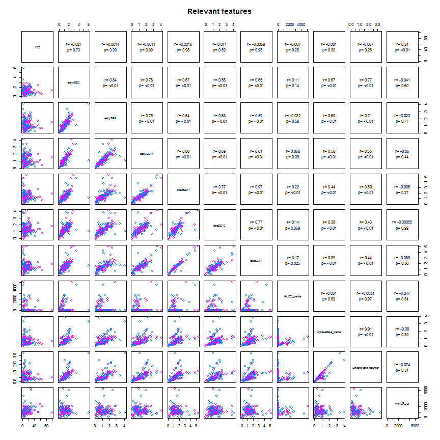

### code Read and partition data   

```r
setwd("Z:/Cristina/MassNonmass/Section1 - ExperimentsUpToDate/experimentsRadiologypaper-revision/Tree-based-RF/ensemble-Treebased-RF")
library("RSQLite")

rpart_inputdata <- function(subdata) {
    sqlite <- dbDriver("SQLite")
    conn <- dbConnect(sqlite, "localData.db")
    
    # 2) all T1W features
    lesionsQuery <- dbGetQuery(conn, "SELECT *\n                             FROM  lesion\n                             INNER JOIN f_dynamic ON (lesion.lesion_id = f_dynamic.lesion_id)\n                             INNER JOIN f_morphology ON (lesion.lesion_id = f_morphology.lesion_id)\n                             INNER JOIN f_texture ON (lesion.lesion_id = f_texture.lesion_id)")
    
    # prune entries and extract feature subsets corresponds to 5 entries
    # lesion info, 34 dynamic, 19 morpho, 34 texture fueatures
    lesionsfields = names(lesionsQuery[c(1, 23, 24, 3, 5, 27:60, 63:81, 84:107)])
    lesioninfo = lesionsQuery[c(1, 23, 24, 3, 5)]
    dynfeatures = lesionsQuery[c(1, 23, 27:60)]
    morphofeatures = lesionsQuery[c(1, 23, 63:81)]
    texfeatures = lesionsQuery[c(1, 23, 84:107)]
    
    # combine all features
    allfeatures = cbind(dynfeatures[1:272, ], morphofeatures[1:272, 3:ncol(morphofeatures)], 
        texfeatures[1:272, 3:ncol(morphofeatures)])
    
    if (subdata == "mass") {
        # organized the data by subdata
        M <- subset(allfeatures, lesion_label == "massB" | lesion_label == "massM")
        M$lesion_label <- ifelse(M$lesion_label == "massB", "NC", "C")
        allfeatures = M
    }
    if (subdata == "nonmass") {
        # organized the data by subdata
        N <- subset(allfeatures, lesion_label == "nonmassB" | lesion_label == 
            "nonmassM")
        N$lesion_label <- ifelse(N$lesion_label == "nonmassB", "NC", "C")
        allfeatures = N
    }
    if (subdata == "stage1") {
        # organized the data by subdata
        M <- subset(allfeatures, lesion_label == "massB" | lesion_label == "massM")
        M$lesion_label <- ifelse(M$lesion_label == "massB", "mass", "mass")
        N <- subset(allfeatures, lesion_label == "nonmassB" | lesion_label == 
            "nonmassM")
        N$lesion_label <- ifelse(N$lesion_label == "nonmassB", "nonmass", "nonmass")
        allfeatures = data.frame(rbind(M, N))
    }
    if (subdata == "oneshot") {
        # organized the data by subdata
        M <- subset(allfeatures, lesion_label == "massB" | lesion_label == "massM")
        M$lesion_label <- ifelse(M$lesion_label == "massB", "NC", "C")
        N <- subset(allfeatures, lesion_label == "nonmassB" | lesion_label == 
            "nonmassM")
        N$lesion_label <- ifelse(N$lesion_label == "nonmassB", "NC", "C")
        allfeatures = data.frame(rbind(M, N))
    }
    # procees data
    allfeatures$lesion_label <- as.factor(allfeatures$lesion_label)
    allfeatures$peakCr_inside <- as.factor(allfeatures$peakCr_inside)
    allfeatures$peakVr_inside <- as.factor(allfeatures$peakVr_inside)
    allfeatures$peakCr_countor <- as.factor(allfeatures$peakCr_countor)
    allfeatures$peakVr_countor <- as.factor(allfeatures$peakVr_countor)
    allfeatures$k_Max_Margin_Grad <- as.factor(allfeatures$k_Max_Margin_Grad)
    allfeatures$max_RGH_mean_k <- as.factor(allfeatures$max_RGH_mean_k)
    allfeatures$max_RGH_var_k <- as.factor(allfeatures$max_RGH_var_k)
    
    output <- allfeatures
    return(output)
}
```


### code to create a cross-validation set up: 
### cvfoldk = number of cv folds typically 5 or 10
### out: particvfoldK = all cv-K ids

```r
library(MASS)
library(caret)
```

```
## Loading required package: cluster
## Loading required package: foreach
## Loading required package: lattice
## Loading required package: plyr
## Loading required package: reshape2
```

```r

cvfold_partition <- function(dat, cvfoldK){
  ndat = nrow(dat)
  outcomesetDi  <- dat$lesion_label
  #For multiple k-fold cross-validation, completely independent folds are created.
  #when y is a factor in an attempt to balance the class distributions within the splits.
  #The names of the list objects will denote the fold membership using the pattern 
  #"Foldi.Repj" meaning the ith section (of k) of the jth cross-validation set (of times).
  partitionsetDi <- createFolds(y = outcomesetDi, ## the outcome data are needed
                                k = cvfoldK, ## The percentage of data in the training set
                                list = TRUE) ## The format of the results. 
  return(partitionsetDi)
}
```


### code to sample kparti from a cross-validation set up: 
### kparti = k fold to exclude
### outs: cvTrainsetD, cvTestsetD

```r
kparti_sample <- function(dat, particvfoldK, cvfoldK, kparti) {
    allparti = 1:cvfoldK
    allbutkparti = allparti[-kparti]
    cvfoldadd = c()
    for (i in 1:length(allbutkparti)) {
        kadd = allbutkparti[i]
        cvfoldadd = c(cvfoldadd, particvfoldK[[kadd]])
    }
    # partition data
    cvTrainsetD <- dat[cvfoldadd, ]
    cvTestsetD <- dat[-cvfoldadd, ]
    
    output <- list(cvTrainsetD = cvTrainsetD, cvTestsetD = cvTestsetD)
    return(output)
}
```


### code Feature selection: 
### Boruta, cvfold, 

```r
library(Boruta)
```

```
## Loading required package: randomForest
## randomForest 4.6-7
## Type rfNews() to see new features/changes/bug fixes.
```

```r
require(data.table)
```

```
## Loading required package: data.table
```

```r
require(ggplot2)
```

```
## Loading required package: ggplot2
```

```r

# function to produce correlation coefficients on pair plots
panel.cor <- function(x, y, digits = 2, cex.cor, ...) {
    usr <- par("usr")
    on.exit(par(usr))
    par(usr = c(0, 1, 0, 1))
    # correlation coefficient
    r <- cor(x, y)
    txt <- format(c(r, 0.123456789), digits = digits)[1]
    txt <- paste("r= ", txt, sep = "")
    text(0.5, 0.6, txt)
    
    # p-value calculation
    p <- cor.test(x, y)$p.value
    txt2 <- format(c(p, 0.123456789), digits = digits)[1]
    txt2 <- paste("p= ", txt2, sep = "")
    if (p < 0.01) 
        txt2 <- paste("p= ", "<0.01", sep = "")
    text(0.5, 0.4, txt2)
}

subset_select <- function(setTrain) {
    featsel_boruta <- Boruta(lesion_label ~ ., data = setTrain[, 2:ncol(setTrain)], 
        doTrace = 2, ntree = 1000)
    print(featsel_boruta)
    plot(featsel_boruta)
    
    relevant <- featsel_boruta$finalDecision[featsel_boruta$finalDecision == 
        "Confirmed"]
    relevant_features = setTrain[c(names(relevant))]
    tentative <- featsel_boruta$finalDecision[featsel_boruta$finalDecision == 
        "Tentative"]
    tentative_features = setTrain[c(names(tentative))]
    sel_features = cbind(setTrain[c(1, 2)], relevant_features, tentative_features)
    
    super.sym <- trellis.par.get("superpose.symbol")
    ## pair plots for reatures
    setTrainrelevant = setTrain[c(names(relevant))]
    pairs(relevant_features, upper.panel = panel.cor, pch = super.sym$pch[1:2], 
        col = super.sym$col[1:2], text = list(levels(setTrainrelevant$lesion_label)), 
        main = "Relevant features")
    
    return(sel_features)
}
```


### code forest Train: 
### parameters, T= # of trees, D= tree depth, dat

```r
library(klaR)
library(rpart)
library(rpart.plot)

# bagged training was introduced as a way of reducing possible overfitting
# and improving the generalization capabilities of random forests.  The
# idea is to train each tree in a forest on a different training subset,
# sampled at random from the same labeled database.
rpart_looforestTrain <- function(T, D, dat) {
    # set control
    fitparm = rpart.control(maxdepth = D, minsplit = 5, minbucket = 4, cp = 1e-05, 
        xval = 5, maxcompete = 0, maxsurrogate = 0, usesurrogate = 0, surrogatestyle = 0)
    
    # init forest
    forest = list()
    for (t in 1:T) {
        # cat('Tree # ', t, '\n')
        
        # build bagged trees from a bootstrap sample of trainSetD
        setD = dat[sample(1:nrow(dat), nrow(dat), replace = TRUE), ]
        
        # find subsample of var when training the ith tree we only make available
        # a small random subset
        subvar = sample(2:ncol(setD), sqrt(ncol(setD) - 1), replace = FALSE)
        subfeat = colnames(setD)[subvar]
        
        # train tree
        treedata <- rpart(paste("lesion_label ~ ", paste(subfeat, collapse = "+")), 
            method = "class", data = setD, control = fitparm)
        
        # display the probability per class of observations in the node
        # (conditioned on the node, sum across a node is 1) plus the percentage of
        # observations in the node.
        if (T == 1) {
            print(treedata)
            prp(treedata, type = 2, digits = 3, extra = 102, under = TRUE, nn = TRUE, 
                col = "black", box.col = rainbow(2)[2], varlen = 0, faclen = 0, 
                branch.type = 0, gap = 0, cex = 0.7, fallen.leaves = TRUE)  # use fallen.leaves=TRUE, to plot at bottom  
        }
        
        # append
        forest <- append(forest, list(tree = treedata))
    }
    
    output <- list(forest = forest)
    return(output)
}
```


### code forest Test: 
### parameters, T= # of trees, forest, TrainsetD, TestsetD

```r

library(pROC)
```

```
## Type 'citation("pROC")' for a citation.
## 
## Attaching package: 'pROC'
## 
## The following object(s) are masked from 'package:stats':
## 
##     cov, smooth, var
```

```r
rpart_looforestTest <- function(T, TrainsetD, TestsetD, forest) {
    
    fclasspotrain = list()
    for (t in 1:T) {
        # Calcultate posterior Probabilities on grid points
        temp <- predict(forest[t]$tree, newdata = TrainsetD)  #
        fclasspotrain <- append(fclasspotrain, list(cpo = temp))
    }
    
    # run testing cases
    fclasspotest = list()
    for (t in 1:T) {
        # Calcultate posterior Probabilities on grid points
        temp <- predict(forest[t]$tree, newdata = TestsetD)  #
        fclasspotest <- append(fclasspotest, list(cpo = temp))
    }
    
    # performance on Train/Test set separately extract ensamble class
    # probabilities (when T > 1)
    trainpts = fclasspotrain[1]$cpo
    testpts = fclasspotest[1]$cpo
    # init ensample class posteriors
    enclasspotrain <- matrix(, nrow = nrow(as.data.frame(trainpts)), ncol = 2)
    enclasspotest <- matrix(, nrow = nrow(as.data.frame(testpts)), ncol = 2)
    enclasspotrain[, 1] = fclasspotrain[1]$cpo[, 1]
    enclasspotest[, 1] = fclasspotest[1]$cpo[, 1]
    enclasspotrain[, 2] = fclasspotrain[1]$cpo[, 2]
    enclasspotest[, 2] = fclasspotest[1]$cpo[, 2]
    if (T >= 2) {
        for (t in 2:T) {
            # train
            enclasspotrain[, 1] = enclasspotrain[, 1] + fclasspotrain[t]$cpo[, 
                1]
            enclasspotrain[, 2] = enclasspotrain[, 2] + fclasspotrain[t]$cpo[, 
                2]
            # test
            enclasspotest[, 1] = enclasspotest[, 1] + fclasspotest[t]$cpo[, 
                1]
            enclasspotest[, 2] = enclasspotest[, 2] + fclasspotest[t]$cpo[, 
                2]
        }
    }
    # majority voting averaging
    enclasspotrain = (1/T) * enclasspotrain
    enclasspotest = (1/T) * enclasspotest
    
    # on training
    classes = levels(TrainsetD$lesion_label)
    trainprob = data.frame(C1 = enclasspotrain[, 1], C2 = enclasspotrain[, 2], 
        pred = classes[apply(enclasspotrain, 1, which.max)], obs = TrainsetD$lesion_label)
    colnames(trainprob)[1:2] <- classes
    pred = as.factor(apply(enclasspotrain, 1, which.max))
    levels(pred) = levels(as.factor(unclass(TrainsetD$lesion_label)))
    perf_train = confusionMatrix(pred, as.factor(unclass(TrainsetD$lesion_label)))
    # print(perf_train)
    
    # on testing
    testprob = data.frame(C1 = enclasspotest[, 1], C2 = enclasspotest[, 2], 
        pred = classes[apply(enclasspotest, 1, which.max)], obs = TestsetD$lesion_label)
    colnames(testprob)[1:2] <- classes
    pred = as.factor(apply(enclasspotest, 1, which.max))
    levels(pred) = levels(as.factor(unclass(TrainsetD$lesion_label)))
    pred[1] = as.factor(apply(enclasspotest, 1, which.max))
    
    groundT = as.factor(unclass(TestsetD$lesion_label))
    levels(groundT) = levels(as.factor(unclass(TrainsetD$lesion_label)))
    groundT[1] = as.factor(unclass(TestsetD$lesion_label))
    
    perf_test = confusionMatrix(pred, groundT)
    # print(perf_test)
    
    output <- list(etrain = perf_train, etest = perf_test, trainprob = trainprob, 
        testprob = testprob)
    return(output)
}
```


### code for running and plotting perfm results: 
###statsAU

```r
create_ensemble <- function(dat, particvfoldK, cvK) {
    # inint
    ensemblegrdperf = list()
    maxM = list()
    for (r in 1:cvK) {
        ## pick one of cvfold for held-out test, train on the rest
        kparti_setdata = kparti_sample(dat, particvfoldK, cvK, r)
        
        # Boruta on $cvTrainsetD
        selfeatures_kfold = subset_select(kparti_setdata$cvTrainsetD)
        names(selfeatures_kfold)
        
        ################################################### create grid of
        ################################################### evaluation points
        gT = c(5, 10, 30, 60, 100, 250, 500, 750)
        gD = c(2, 5, 10, 20)
        grd <- expand.grid(x = gD, y = gT)
        
        ################################################### for oneshot
        grdperf = data.frame(grd)
        grdperf$acuTrain = 0
        grdperf$rocTrain = 0
        grdperf$senTrain = 0
        grdperf$speTrain = 0
        
        grdperf$acuTest = 0
        grdperf$rocTest = 0
        grdperf$senTest = 0
        grdperf$speTest = 0
        
        M = list()
        for (k in 1:nrow(grd)) {
            D = grd[k, 1]
            T = grd[k, 2]
            # Build in l
            cat("D: ", D, "T: ", T, "\n")
            TrainsetD <- kparti_setdata$cvTrainsetD[c(names(selfeatures_kfold))]
            TestsetD <- kparti_setdata$cvTestsetD[c(names(selfeatures_kfold))]
            fit <- rpart_looforestTrain(T, D, TrainsetD[c(2:ncol(TrainsetD))])
            # # predict
            perf <- rpart_looforestTest(T, TrainsetD[c(2:ncol(TrainsetD))], 
                TestsetD[c(2:ncol(TestsetD))], fit$forest)
            # for train
            ROCF_train <- roc(perf$trainprob$obs, perf$trainprob$C, col = "#000086", 
                main = paste0("ROC T=", T, " D=", D, " cv=", r))
            print(ROCF_train$auc)
            # collect data
            grdperf$acuTrain[k] = grdperf$acuTrain[k] + as.numeric(perf$etrain$overall[1])
            grdperf$rocTrain[k] = grdperf$rocTrain[k] + as.numeric(ROCF_train$auc)
            grdperf$senTrain[k] = grdperf$senTrain[k] + as.numeric(perf$etrain$byClass[1])
            grdperf$speTrain[k] = grdperf$speTrain[k] + as.numeric(perf$etrain$byClass[2])
            # for test par(new=TRUE)
            ROCF_test <- roc(perf$testprob$obs, perf$testprob$C, col = "#860000", 
                main = paste0("ROC T=", T, " D=", D, " cv=", r))
            # legend('bottomright', legend = c('train', 'test'), col = c('#000086',
            # '#860000'),lwd = 2)
            print(ROCF_test$auc)
            # collect data
            grdperf$acuTest[k] = grdperf$acuTest[k] + as.numeric(perf$etest$overall[1])
            grdperf$rocTest[k] = grdperf$rocTest[k] + as.numeric(ROCF_test$auc)
            grdperf$senTest[k] = grdperf$senTest[k] + as.numeric(perf$etest$byClass[1])
            grdperf$speTest[k] = grdperf$speTest[k] + as.numeric(perf$etest$byClass[2])
            
            # append perfm for ROC
            M = append(M, list(M = list(D = D, T = T, trainprob = perf$trainprob, 
                testprob = perf$testprob, forest = fit$forest)))
        }
        print(grdperf)
        index = which(grdperf$rocTest == max(grdperf$rocTest), arr.ind = TRUE)
        Dmax = grdperf$x[index]
        Tmax = grdperf$y[index]
        resamMax = M[index]$M$testprob
        # append
        maxM <- append(maxM, list(maxp = list(D = Dmax, T = Tmax, trainprob = M[index]$M$trainprob, 
            testprob = M[index]$M$testprob, forest = M[index]$M$forest)))
        ensemblegrdperf <- append(ensemblegrdperf, list(grdperf = grdperf))
    }
    output <- list(ensemblegrdperf = ensemblegrdperf, maxM = maxM)
    return(output)
}

surface_forestperfm <- function(grdperf) {
    library(gridExtra)
    library(base)
    library(lattice)
    
    
    graphlist <- list()
    count <- 1
    # design acuTrain
    z = grdperf$acuTrain
    gD = unique(grdperf$x)
    gT = unique(grdperf$y)
    dim(z) <- c(length(gD), length(gT))
    w1 <- wireframe(z, gD, gT, box = FALSE, xlab = "Depth of trees (D)", ylab = "Number of trees (T)", 
        main = "Influence of forest parameters on Accuracy Train", drape = TRUE, 
        colorkey = TRUE, light.source = c(10, 0, 10), col.regions = colorRampPalette(c("red", 
            "blue"))(100), screen = list(z = 30, x = -60))
    graphlist[[count]] <- w1
    count <- count + 1
    
    # design rocTrain
    z = grdperf$rocTrain
    dim(z) <- c(length(gD), length(gT))
    w2 <- wireframe(z, gD, gT, box = FALSE, xlab = "Depth of trees (D)", ylab = "Number of trees (T)", 
        main = "Influence of forest parameters on ROC Train", drape = TRUE, 
        colorkey = TRUE, light.source = c(10, 0, 10), col.regions = colorRampPalette(c("red", 
            "blue"))(100), screen = list(z = 30, x = -60))
    graphlist[[count]] <- w2
    count <- count + 1
    
    # design acuTest
    z = grdperf$acuTest
    dim(z) <- c(length(gD), length(gT))
    w3 <- wireframe(z, gD, gT, box = FALSE, xlab = "Depth of trees (D)", ylab = "Number of trees (T)", 
        main = "Influence of forest parameters on Accuracy Test", drape = TRUE, 
        colorkey = TRUE, light.source = c(10, 0, 10), col.regions = colorRampPalette(c("red", 
            "blue"))(100), screen = list(z = 30, x = -60))
    graphlist[[count]] <- w3
    count <- count + 1
    
    # design rocTest
    z = grdperf$rocTest
    dim(z) <- c(length(gD), length(gT))
    w4 <- wireframe(z, gD, gT, box = FALSE, xlab = "Depth of trees (D)", ylab = "Number of trees (T)", 
        main = "Influence of forest parameters on ROC Test", drape = TRUE, colorkey = TRUE, 
        light.source = c(10, 0, 10), col.regions = colorRampPalette(c("red", 
            "blue"))(100), screen = list(z = 30, x = -60))
    graphlist[[count]] <- w4
    count <- count + 1
    
    
    # finally plot in grid
    do.call("grid.arrange", c(graphlist, ncol = 2))
}
```


Run for oneshot lesions:
=====

```r
# read mass features
oneshotdat = rpart_inputdata(subdata = "oneshot")
## create CV
cvK = 10
# run for mass
particvfoldK = cvfold_partition(oneshotdat, cvK)
res = create_ensemble(oneshotdat, particvfoldK, cvK)
```

```
## Initial round 1: ..........
##  6  attributes rejected after this test:  Vr_decreasingRate_countor skew_F_r_i iiiMax_Margin_Gradient max_RGH_mean_k max_RGH_var_k texture_homogeneity_zero 
## 
## Initial round 2: ..........
##  5  attributes rejected after this test:  peakVr_inside peakVr_countor k_Max_Margin_Grad ivVariance texture_correlation_quarterRad 
## 
## Initial round 3: ..........
##  13  attributes rejected after this test:  beta_inside beta_countor iAUC1_countor SER_countor maxVr_countor Vr_post_1_countor kurt_F_r_i iMax_Variance_uptake texture_homogeneity_quarterRad texture_homogeneity_halfRad texture_dissimilarity_quarterRad texture_correlation_zero texture_correlation_threeQuaRad 
## 
## Final round: ..........
##  8  attributes confirmed after this test:  iAUC1_inside Slope_ini_inside maxCr_inside UptakeRate_inside maxCr_countor washoutRate_countor max_F_r_i mean_F_r_i 
## 
##  7  attributes rejected after this test:  Tpeak_inside SER_inside Vr_decreasingRate_inside A_countor edge_sharp_mean texture_dissimilarity_zero texture_dissimilarity_threeQuaRad 
## ....
##  5  attributes rejected after this test:  alpha_inside peakCr_inside maxVr_inside texture_contrast_quarterRad texture_dissimilarity_halfRad 
## ....
##  1  attributes confirmed after this test:  UptakeRate_countor 
## ...
##  2  attributes rejected after this test:  texture_correlation_halfRad texture_ASM_quarterRad 
## ...
##  2  attributes rejected after this test:  max_RGH_mean texture_ASM_halfRad 
## ...
##  1  attributes confirmed after this test:  alpha_countor 
## ...
##  2  attributes rejected after this test:  texture_homogeneity_threeQuaRad texture_ASM_zero 
## ...
##  2  attributes confirmed after this test:  var_F_r_i irregularity 
## 
##  2  attributes rejected after this test:  texture_contrast_halfRad texture_contrast_threeQuaRad 
## .....
##  1  attributes rejected after this test:  max_RGH_var 
## ...
##  2  attributes rejected after this test:  Vr_post_1_inside Vr_increasingRate_countor 
## ..
##  1  attributes rejected after this test:  peakCr_countor 
## ........
##  1  attributes confirmed after this test:  Slope_ini_countor 
## .............
##  1  attributes rejected after this test:  texture_contrast_zero 
## ............
##  1  attributes rejected after this test:  Vr_increasingRate_inside 
## ........................
## Boruta performed 130 randomForest runs in 6.737 mins.
##         13 attributes confirmed important: iAUC1_inside
## Slope_ini_inside maxCr_inside UptakeRate_inside alpha_countor
## Slope_ini_countor maxCr_countor UptakeRate_countor
## washoutRate_countor max_F_r_i mean_F_r_i var_F_r_i irregularity
##         50 attributes confirmed unimportant: alpha_inside
## beta_inside Tpeak_inside SER_inside peakCr_inside maxVr_inside
## peakVr_inside Vr_increasingRate_inside Vr_decreasingRate_inside
## Vr_post_1_inside A_countor beta_countor iAUC1_countor SER_countor
## peakCr_countor maxVr_countor peakVr_countor
## Vr_increasingRate_countor Vr_decreasingRate_countor
## Vr_post_1_countor skew_F_r_i kurt_F_r_i iMax_Variance_uptake
## iiiMax_Margin_Gradient k_Max_Margin_Grad ivVariance
## edge_sharp_mean max_RGH_mean max_RGH_mean_k max_RGH_var
## max_RGH_var_k texture_contrast_zero texture_contrast_quarterRad
## texture_contrast_halfRad texture_contrast_threeQuaRad
## texture_homogeneity_zero texture_homogeneity_quarterRad
## texture_homogeneity_halfRad texture_homogeneity_threeQuaRad
## texture_dissimilarity_zero texture_dissimilarity_quarterRad
## texture_dissimilarity_halfRad texture_dissimilarity_threeQuaRad
## texture_correlation_zero texture_correlation_quarterRad
## texture_correlation_halfRad texture_correlation_threeQuaRad
## texture_ASM_zero texture_ASM_quarterRad texture_ASM_halfRad
##         9 tentative attributes left: A_inside Kpeak_inside
## washoutRate_inside Tpeak_countor Kpeak_countor min_F_r_i
## iiMin_change_Variance_uptake circularity edge_sharp_std
```

  

```
## D:  2 T:  5 
## Area under the curve: 0.777
## Area under the curve: 0.77
## D:  5 T:  5 
## Area under the curve: 0.886
## Area under the curve: 0.77
## D:  10 T:  5 
## Area under the curve: 0.965
## Area under the curve: 0.81
## D:  20 T:  5 
## Area under the curve: 0.956
## Area under the curve: 0.835
## D:  2 T:  10 
## Area under the curve: 0.83
## Area under the curve: 0.764
## D:  5 T:  10 
## Area under the curve: 0.965
## Area under the curve: 0.659
## D:  10 T:  10 
## Area under the curve: 0.979
## Area under the curve: 0.705
## D:  20 T:  10 
## Area under the curve: 0.974
## Area under the curve: 0.807
## D:  2 T:  30 
## Area under the curve: 0.837
## Area under the curve: 0.801
## D:  5 T:  30 
## Area under the curve: 0.958
## Area under the curve: 0.756
## D:  10 T:  30 
## Area under the curve: 0.996
## Area under the curve: 0.778
## D:  20 T:  30 
## Area under the curve: 0.996
## Area under the curve: 0.835
## D:  2 T:  60 
## Area under the curve: 0.832
## Area under the curve: 0.75
## D:  5 T:  60 
## Area under the curve: 0.968
## Area under the curve: 0.75
## D:  10 T:  60 
## Area under the curve: 0.991
## Area under the curve: 0.756
## D:  20 T:  60 
## Area under the curve: 0.995
## Area under the curve: 0.756
## D:  2 T:  100 
## Area under the curve: 0.849
## Area under the curve: 0.795
## D:  5 T:  100 
## Area under the curve: 0.979
## Area under the curve: 0.773
## D:  10 T:  100 
## Area under the curve: 0.993
## Area under the curve: 0.79
## D:  20 T:  100 
## Area under the curve: 0.997
## Area under the curve: 0.767
## D:  2 T:  250 
## Area under the curve: 0.845
## Area under the curve: 0.79
## D:  5 T:  250 
## Area under the curve: 0.972
## Area under the curve: 0.795
## D:  10 T:  250 
## Area under the curve: 0.997
## Area under the curve: 0.767
## D:  20 T:  250 
## Area under the curve: 0.997
## Area under the curve: 0.79
## D:  2 T:  500 
## Area under the curve: 0.844
## Area under the curve: 0.795
## D:  5 T:  500 
## Area under the curve: 0.97
## Area under the curve: 0.778
## D:  10 T:  500 
## Area under the curve: 0.998
## Area under the curve: 0.773
## D:  20 T:  500 
## Area under the curve: 0.997
## Area under the curve: 0.744
## D:  2 T:  750 
## Area under the curve: 0.844
## Area under the curve: 0.79
## D:  5 T:  750 
## Area under the curve: 0.973
## Area under the curve: 0.778
## D:  10 T:  750 
## Area under the curve: 0.997
## Area under the curve: 0.75
## D:  20 T:  750 
## Area under the curve: 0.997
## Area under the curve: 0.75
##     x   y acuTrain rocTrain senTrain speTrain acuTest rocTest senTest
## 1   2   5   0.7306   0.7767   0.8446   0.5567  0.7778  0.7699  0.8125
## 2   5   5   0.8204   0.8863   0.9054   0.6907  0.7037  0.7699  0.7500
## 3  10   5   0.8980   0.9650   0.9324   0.8454  0.7778  0.8097  0.8750
## 4  20   5   0.8816   0.9563   0.9527   0.7732  0.8519  0.8352  0.8125
## 5   2  10   0.7347   0.8303   0.8986   0.4845  0.7778  0.7642  0.8750
## 6   5  10   0.8939   0.9652   0.9595   0.7938  0.6296  0.6591  0.7500
## 7  10  10   0.9306   0.9785   0.9730   0.8660  0.6296  0.7045  0.7500
## 8  20  10   0.9143   0.9742   0.9730   0.8247  0.8148  0.8068  0.8750
## 9   2  30   0.7469   0.8369   0.9122   0.4948  0.6667  0.8011  0.8125
## 10  5  30   0.8776   0.9575   0.9459   0.7732  0.7407  0.7557  0.8125
## 11 10  30   0.9510   0.9958   0.9932   0.8866  0.7778  0.7784  0.8125
## 12 20  30   0.9469   0.9958   0.9865   0.8866  0.7407  0.8352  0.8125
## 13  2  60   0.7633   0.8323   0.9324   0.5052  0.7407  0.7500  0.8750
## 14  5  60   0.9102   0.9684   0.9662   0.8247  0.7407  0.7500  0.8125
## 15 10  60   0.9469   0.9914   0.9865   0.8866  0.7778  0.7557  0.8125
## 16 20  60   0.9673   0.9946   0.9932   0.9278  0.7037  0.7557  0.8125
## 17  2 100   0.7755   0.8488   0.9122   0.5670  0.7407  0.7955  0.8125
## 18  5 100   0.9184   0.9794   0.9797   0.8247  0.7407  0.7727  0.8125
## 19 10 100   0.9510   0.9926   1.0000   0.8763  0.7407  0.7898  0.8125
## 20 20 100   0.9633   0.9971   0.9932   0.9175  0.7778  0.7670  0.8125
## 21  2 250   0.7714   0.8453   0.9257   0.5361  0.7037  0.7898  0.8125
## 22  5 250   0.9143   0.9719   0.9730   0.8247  0.7778  0.7955  0.8125
## 23 10 250   0.9673   0.9968   0.9932   0.9278  0.7037  0.7670  0.8125
## 24 20 250   0.9714   0.9975   1.0000   0.9278  0.7778  0.7898  0.8125
## 25  2 500   0.7714   0.8438   0.9189   0.5464  0.7407  0.7955  0.8125
## 26  5 500   0.9102   0.9702   0.9595   0.8351  0.7407  0.7784  0.8125
## 27 10 500   0.9714   0.9980   1.0000   0.9278  0.7778  0.7727  0.8125
## 28 20 500   0.9714   0.9971   1.0000   0.9278  0.7778  0.7443  0.8125
## 29  2 750   0.7796   0.8443   0.9257   0.5567  0.7778  0.7898  0.8750
## 30  5 750   0.9102   0.9733   0.9730   0.8144  0.7407  0.7784  0.8125
## 31 10 750   0.9592   0.9965   0.9865   0.9175  0.7407  0.7500  0.8125
## 32 20 750   0.9633   0.9972   0.9932   0.9175  0.7778  0.7500  0.8125
##    speTest
## 1   0.7273
## 2   0.6364
## 3   0.6364
## 4   0.9091
## 5   0.6364
## 6   0.4545
## 7   0.4545
## 8   0.7273
## 9   0.4545
## 10  0.6364
## 11  0.7273
## 12  0.6364
## 13  0.5455
## 14  0.6364
## 15  0.7273
## 16  0.5455
## 17  0.6364
## 18  0.6364
## 19  0.6364
## 20  0.7273
## 21  0.5455
## 22  0.7273
## 23  0.5455
## 24  0.7273
## 25  0.6364
## 26  0.6364
## 27  0.7273
## 28  0.7273
## 29  0.6364
## 30  0.6364
## 31  0.6364
## 32  0.7273
## Initial round 1: ..........
##  11  attributes rejected after this test:  peakVr_inside peakVr_countor Vr_decreasingRate_countor skew_F_r_i kurt_F_r_i iiiMax_Margin_Gradient k_Max_Margin_Grad max_RGH_var_k texture_homogeneity_zero texture_dissimilarity_quarterRad texture_correlation_halfRad 
## 
## Initial round 2: ..........
##  13  attributes rejected after this test:  beta_inside maxVr_inside Vr_increasingRate_inside Vr_decreasingRate_inside beta_countor iAUC1_countor Vr_post_1_countor max_RGH_mean_k texture_contrast_quarterRad texture_homogeneity_quarterRad texture_dissimilarity_halfRad texture_correlation_zero texture_correlation_quarterRad 
## 
## Initial round 3: ..........
##  4  attributes rejected after this test:  ivVariance texture_contrast_zero texture_dissimilarity_zero texture_correlation_threeQuaRad 
## 
## Final round: ..........
##  9  attributes confirmed after this test:  iAUC1_inside Slope_ini_inside maxCr_inside peakCr_inside UptakeRate_inside washoutRate_inside maxCr_countor UptakeRate_countor max_F_r_i 
## 
##  3  attributes rejected after this test:  peakCr_countor maxVr_countor edge_sharp_mean 
## ....
##  1  attributes confirmed after this test:  Slope_ini_countor 
## 
##  4  attributes rejected after this test:  alpha_inside A_countor Vr_increasingRate_countor texture_ASM_zero 
## ....
##  3  attributes confirmed after this test:  alpha_countor mean_F_r_i edge_sharp_std 
## 
##  3  attributes rejected after this test:  Vr_post_1_inside Kpeak_countor texture_dissimilarity_threeQuaRad 
## ...
##  3  attributes rejected after this test:  Tpeak_countor texture_homogeneity_halfRad texture_ASM_halfRad 
## ...
##  2  attributes rejected after this test:  Tpeak_inside SER_countor 
## .........
##  1  attributes rejected after this test:  texture_ASM_quarterRad 
## ..
##  2  attributes rejected after this test:  texture_contrast_halfRad texture_contrast_threeQuaRad 
## ...........
##  1  attributes rejected after this test:  SER_inside 
## .....
##  1  attributes rejected after this test:  iMax_Variance_uptake 
## ....................
##  1  attributes confirmed after this test:  min_F_r_i 
## .................
##  1  attributes confirmed after this test:  A_inside 
## ............
## Boruta performed 130 randomForest runs in 7.878 mins.
##         15 attributes confirmed important: A_inside iAUC1_inside
## Slope_ini_inside maxCr_inside peakCr_inside UptakeRate_inside
## washoutRate_inside alpha_countor Slope_ini_countor maxCr_countor
## UptakeRate_countor min_F_r_i max_F_r_i mean_F_r_i edge_sharp_std
##         48 attributes confirmed unimportant: alpha_inside
## beta_inside Tpeak_inside SER_inside maxVr_inside peakVr_inside
## Vr_increasingRate_inside Vr_decreasingRate_inside Vr_post_1_inside
## A_countor beta_countor iAUC1_countor Tpeak_countor Kpeak_countor
## SER_countor peakCr_countor maxVr_countor peakVr_countor
## Vr_increasingRate_countor Vr_decreasingRate_countor
## Vr_post_1_countor skew_F_r_i kurt_F_r_i iMax_Variance_uptake
## iiiMax_Margin_Gradient k_Max_Margin_Grad ivVariance
## edge_sharp_mean max_RGH_mean_k max_RGH_var_k texture_contrast_zero
## texture_contrast_quarterRad texture_contrast_halfRad
## texture_contrast_threeQuaRad texture_homogeneity_zero
## texture_homogeneity_quarterRad texture_homogeneity_halfRad
## texture_dissimilarity_zero texture_dissimilarity_quarterRad
## texture_dissimilarity_halfRad texture_dissimilarity_threeQuaRad
## texture_correlation_zero texture_correlation_quarterRad
## texture_correlation_halfRad texture_correlation_threeQuaRad
## texture_ASM_zero texture_ASM_quarterRad texture_ASM_halfRad
##         9 tentative attributes left: Kpeak_inside
## washoutRate_countor var_F_r_i iiMin_change_Variance_uptake
## circularity irregularity max_RGH_mean max_RGH_var
## texture_homogeneity_threeQuaRad
```

  

```
## D:  2 T:  5 
## Area under the curve: 0.805
## Area under the curve: 0.594
## D:  5 T:  5 
## Area under the curve: 0.925
## Area under the curve: 0.529
## D:  10 T:  5 
## Area under the curve: 0.957
## Area under the curve: 0.684
## D:  20 T:  5 
## Area under the curve: 0.973
## Area under the curve: 0.674
## D:  2 T:  10 
## Area under the curve: 0.841
## Area under the curve: 0.556
## D:  5 T:  10 
## Area under the curve: 0.949
## Area under the curve: 0.583
## D:  10 T:  10 
## Area under the curve: 0.981
## Area under the curve: 0.642
## D:  20 T:  10 
## Area under the curve: 0.969
## Area under the curve: 0.535
## D:  2 T:  30 
## Area under the curve: 0.845
## Area under the curve: 0.602
## D:  5 T:  30 
## Area under the curve: 0.959
## Area under the curve: 0.572
## D:  10 T:  30 
## Area under the curve: 0.993
## Area under the curve: 0.535
## D:  20 T:  30 
## Area under the curve: 0.99
## Area under the curve: 0.642
## D:  2 T:  60 
## Area under the curve: 0.855
## Area under the curve: 0.583
## D:  5 T:  60 
## Area under the curve: 0.97
## Area under the curve: 0.594
## D:  10 T:  60 
## Area under the curve: 0.992
## Area under the curve: 0.647
## D:  20 T:  60 
## Area under the curve: 0.997
## Area under the curve: 0.604
## D:  2 T:  100 
## Area under the curve: 0.858
## Area under the curve: 0.615
## D:  5 T:  100 
## Area under the curve: 0.966
## Area under the curve: 0.626
## D:  10 T:  100 
## Area under the curve: 0.996
## Area under the curve: 0.652
## D:  20 T:  100 
## Area under the curve: 0.997
## Area under the curve: 0.647
## D:  2 T:  250 
## Area under the curve: 0.857
## Area under the curve: 0.588
## D:  5 T:  250 
## Area under the curve: 0.965
## Area under the curve: 0.626
## D:  10 T:  250 
## Area under the curve: 0.996
## Area under the curve: 0.642
## D:  20 T:  250 
## Area under the curve: 0.996
## Area under the curve: 0.636
## D:  2 T:  500 
## Area under the curve: 0.854
## Area under the curve: 0.588
## D:  5 T:  500 
## Area under the curve: 0.97
## Area under the curve: 0.594
## D:  10 T:  500 
## Area under the curve: 0.996
## Area under the curve: 0.62
## D:  20 T:  500 
## Area under the curve: 0.996
## Area under the curve: 0.61
## D:  2 T:  750 
## Area under the curve: 0.853
## Area under the curve: 0.561
## D:  5 T:  750 
## Area under the curve: 0.97
## Area under the curve: 0.604
## D:  10 T:  750 
## Area under the curve: 0.996
## Area under the curve: 0.62
## D:  20 T:  750 
## Area under the curve: 0.996
## Area under the curve: 0.406
##     x   y acuTrain rocTrain senTrain speTrain acuTest rocTest senTest
## 1   2   5   0.7418   0.8053   0.8503   0.5773  0.5357  0.5936  0.7647
## 2   5   5   0.8320   0.9250   0.8844   0.7526  0.4643  0.5294  0.6471
## 3  10   5   0.9057   0.9567   0.9048   0.9072  0.6786  0.6845  0.8235
## 4  20   5   0.9344   0.9732   0.9592   0.8969  0.6429  0.6738  0.7647
## 5   2  10   0.7377   0.8406   0.8980   0.4948  0.6429  0.5561  0.8235
## 6   5  10   0.8607   0.9488   0.8776   0.8351  0.5714  0.5829  0.7059
## 7  10  10   0.9262   0.9806   0.9660   0.8660  0.6071  0.6417  0.7059
## 8  20  10   0.9098   0.9691   0.9456   0.8557  0.5000  0.5348  0.6471
## 9   2  30   0.7664   0.8451   0.8503   0.6392  0.6429  0.6016  0.8824
## 10  5  30   0.8975   0.9586   0.9388   0.8351  0.6429  0.5722  0.7647
## 11 10  30   0.9508   0.9935   0.9796   0.9072  0.6429  0.5348  0.7647
## 12 20  30   0.9467   0.9896   0.9932   0.8763  0.6429  0.6417  0.8235
## 13  2  60   0.7869   0.8549   0.8912   0.6289  0.6786  0.5829  0.8824
## 14  5  60   0.8893   0.9696   0.9456   0.8041  0.7143  0.5936  0.8824
## 15 10  60   0.9467   0.9924   0.9728   0.9072  0.6429  0.6471  0.7647
## 16 20  60   0.9713   0.9968   0.9932   0.9381  0.6429  0.6043  0.8235
## 17  2 100   0.7869   0.8584   0.8980   0.6186  0.6786  0.6150  0.8824
## 18  5 100   0.9016   0.9664   0.9320   0.8557  0.6429  0.6257  0.8235
## 19 10 100   0.9631   0.9964   1.0000   0.9072  0.6429  0.6524  0.8235
## 20 20 100   0.9549   0.9968   1.0000   0.8866  0.6429  0.6471  0.7647
## 21  2 250   0.7869   0.8568   0.8912   0.6289  0.6786  0.5882  0.8824
## 22  5 250   0.9016   0.9653   0.9456   0.8351  0.7143  0.6257  0.8824
## 23 10 250   0.9713   0.9961   0.9932   0.9381  0.6786  0.6417  0.8235
## 24 20 250   0.9631   0.9962   0.9932   0.9175  0.6786  0.6364  0.8235
## 25  2 500   0.7910   0.8540   0.8844   0.6495  0.6786  0.5882  0.8824
## 26  5 500   0.9016   0.9698   0.9592   0.8144  0.6786  0.5936  0.8824
## 27 10 500   0.9672   0.9965   0.9932   0.9278  0.7143  0.6203  0.8824
## 28 20 500   0.9672   0.9959   0.9932   0.9278  0.6429  0.6096  0.8235
## 29  2 750   0.7869   0.8527   0.8844   0.6392  0.6786  0.5615  0.8824
## 30  5 750   0.9057   0.9701   0.9592   0.8247  0.6786  0.6043  0.8824
## 31 10 750   0.9672   0.9959   0.9932   0.9278  0.6786  0.6203  0.8235
## 32 20 750   0.9672   0.9959   0.9932   0.9278  0.6786  0.4064  0.8235
##    speTest
## 1   0.1818
## 2   0.1818
## 3   0.4545
## 4   0.4545
## 5   0.3636
## 6   0.3636
## 7   0.4545
## 8   0.2727
## 9   0.2727
## 10  0.4545
## 11  0.4545
## 12  0.3636
## 13  0.3636
## 14  0.4545
## 15  0.4545
## 16  0.3636
## 17  0.3636
## 18  0.3636
## 19  0.3636
## 20  0.4545
## 21  0.3636
## 22  0.4545
## 23  0.4545
## 24  0.4545
## 25  0.3636
## 26  0.3636
## 27  0.4545
## 28  0.3636
## 29  0.3636
## 30  0.3636
## 31  0.4545
## 32  0.4545
## Initial round 1: ..........
##  10  attributes rejected after this test:  peakVr_inside beta_countor iAUC1_countor skew_F_r_i iiiMax_Margin_Gradient ivVariance max_RGH_var_k texture_homogeneity_zero texture_dissimilarity_zero texture_correlation_halfRad 
## 
## Initial round 2: ..........
##  6  attributes rejected after this test:  peakVr_countor Vr_decreasingRate_countor kurt_F_r_i k_Max_Margin_Grad texture_homogeneity_halfRad texture_correlation_threeQuaRad 
## 
## Initial round 3: ..........
##  5  attributes rejected after this test:  beta_inside edge_sharp_mean texture_homogeneity_quarterRad texture_dissimilarity_quarterRad texture_dissimilarity_threeQuaRad 
## 
## Final round: ..........
##  9  attributes confirmed after this test:  Slope_ini_inside maxCr_inside UptakeRate_inside maxCr_countor UptakeRate_countor washoutRate_countor max_F_r_i mean_F_r_i irregularity 
## 
##  5  attributes rejected after this test:  Tpeak_inside A_countor iMax_Variance_uptake texture_correlation_zero texture_correlation_quarterRad 
## ....
##  2  attributes confirmed after this test:  peakCr_inside washoutRate_inside 
## 
##  3  attributes rejected after this test:  Vr_decreasingRate_inside SER_countor texture_ASM_quarterRad 
## ....
##  1  attributes confirmed after this test:  iAUC1_inside 
## 
##  5  attributes rejected after this test:  Vr_increasingRate_inside Tpeak_countor max_RGH_mean_k texture_homogeneity_threeQuaRad texture_ASM_zero 
## ...
##  2  attributes rejected after this test:  maxVr_inside texture_contrast_quarterRad 
## ...
##  1  attributes confirmed after this test:  max_RGH_mean 
## 
##  2  attributes rejected after this test:  texture_contrast_zero texture_dissimilarity_halfRad 
## ...
##  1  attributes confirmed after this test:  var_F_r_i 
## ...
##  2  attributes rejected after this test:  alpha_inside Kpeak_countor 
## .....
##  1  attributes confirmed after this test:  Slope_ini_countor 
## ...
##  1  attributes confirmed after this test:  max_RGH_var 
## ...
##  1  attributes rejected after this test:  maxVr_countor 
## ..
##  1  attributes rejected after this test:  SER_inside 
## ...
##  3  attributes rejected after this test:  Vr_post_1_countor iiMin_change_Variance_uptake texture_ASM_halfRad 
## ..........
##  1  attributes rejected after this test:  A_inside 
## ....................
##  1  attributes confirmed after this test:  alpha_countor 
## ...
##  1  attributes confirmed after this test:  edge_sharp_std 
## ............
##  1  attributes rejected after this test:  peakCr_countor 
## .........
## Boruta performed 130 randomForest runs in 8.525 mins.
##         18 attributes confirmed important: iAUC1_inside
## Slope_ini_inside maxCr_inside peakCr_inside UptakeRate_inside
## washoutRate_inside alpha_countor Slope_ini_countor maxCr_countor
## UptakeRate_countor washoutRate_countor max_F_r_i mean_F_r_i
## var_F_r_i irregularity edge_sharp_std max_RGH_mean max_RGH_var
##         47 attributes confirmed unimportant: A_inside alpha_inside
## beta_inside Tpeak_inside SER_inside maxVr_inside peakVr_inside
## Vr_increasingRate_inside Vr_decreasingRate_inside A_countor
## beta_countor iAUC1_countor Tpeak_countor Kpeak_countor SER_countor
## peakCr_countor maxVr_countor peakVr_countor
## Vr_decreasingRate_countor Vr_post_1_countor skew_F_r_i kurt_F_r_i
## iMax_Variance_uptake iiMin_change_Variance_uptake
## iiiMax_Margin_Gradient k_Max_Margin_Grad ivVariance
## edge_sharp_mean max_RGH_mean_k max_RGH_var_k texture_contrast_zero
## texture_contrast_quarterRad texture_homogeneity_zero
## texture_homogeneity_quarterRad texture_homogeneity_halfRad
## texture_homogeneity_threeQuaRad texture_dissimilarity_zero
## texture_dissimilarity_quarterRad texture_dissimilarity_halfRad
## texture_dissimilarity_threeQuaRad texture_correlation_zero
## texture_correlation_quarterRad texture_correlation_halfRad
## texture_correlation_threeQuaRad texture_ASM_zero
## texture_ASM_quarterRad texture_ASM_halfRad
##         7 tentative attributes left: Kpeak_inside Vr_post_1_inside
## Vr_increasingRate_countor min_F_r_i circularity
## texture_contrast_halfRad texture_contrast_threeQuaRad
```

  

```
## D:  2 T:  5 
## Area under the curve: 0.797
## Area under the curve: 0.7
## D:  5 T:  5 
## Area under the curve: 0.937
## Area under the curve: 0.719
## D:  10 T:  5 
## Area under the curve: 0.965
## Area under the curve: 0.431
## D:  20 T:  5 
## Area under the curve: 0.97
## Area under the curve: 0.731
## D:  2 T:  10 
## Area under the curve: 0.825
## Area under the curve: 0.656
## D:  5 T:  10 
## Area under the curve: 0.933
## Area under the curve: 0.831
## D:  10 T:  10 
## Area under the curve: 0.972
## Area under the curve: 0.681
## D:  20 T:  10 
## Area under the curve: 0.971
## Area under the curve: 0.625
## D:  2 T:  30 
## Area under the curve: 0.841
## Area under the curve: 0.694
## D:  5 T:  30 
## Area under the curve: 0.968
## Area under the curve: 0.669
## D:  10 T:  30 
## Area under the curve: 0.993
## Area under the curve: 0.712
## D:  20 T:  30 
## Area under the curve: 0.996
## Area under the curve: 0.781
## D:  2 T:  60 
## Area under the curve: 0.848
## Area under the curve: 0.762
## D:  5 T:  60 
## Area under the curve: 0.971
## Area under the curve: 0.738
## D:  10 T:  60 
## Area under the curve: 0.994
## Area under the curve: 0.756
## D:  20 T:  60 
## Area under the curve: 0.997
## Area under the curve: 0.831
## D:  2 T:  100 
## Area under the curve: 0.846
## Area under the curve: 0.694
## D:  5 T:  100 
## Area under the curve: 0.973
## Area under the curve: 0.775
## D:  10 T:  100 
## Area under the curve: 0.995
## Area under the curve: 0.75
## D:  20 T:  100 
## Area under the curve: 0.994
## Area under the curve: 0.769
## D:  2 T:  250 
## Area under the curve: 0.846
## Area under the curve: 0.719
## D:  5 T:  250 
## Area under the curve: 0.972
## Area under the curve: 0.756
## D:  10 T:  250 
## Area under the curve: 0.996
## Area under the curve: 0.806
## D:  20 T:  250 
## Area under the curve: 0.997
## Area under the curve: 0.775
## D:  2 T:  500 
## Area under the curve: 0.847
## Area under the curve: 0.719
## D:  5 T:  500 
## Area under the curve: 0.973
## Area under the curve: 0.738
## D:  10 T:  500 
## Area under the curve: 0.997
## Area under the curve: 0.769
## D:  20 T:  500 
## Area under the curve: 0.997
## Area under the curve: 0.794
## D:  2 T:  750 
## Area under the curve: 0.847
## Area under the curve: 0.725
## D:  5 T:  750 
## Area under the curve: 0.974
## Area under the curve: 0.756
## D:  10 T:  750 
## Area under the curve: 0.997
## Area under the curve: 0.794
## D:  20 T:  750 
## Area under the curve: 0.998
## Area under the curve: 0.806
##     x   y acuTrain rocTrain senTrain speTrain acuTest rocTest senTest
## 1   2   5   0.7276   0.7968   0.7973   0.6224  0.6538  0.7000  0.8125
## 2   5   5   0.8496   0.9375   0.9054   0.7653  0.7692  0.7188  0.8125
## 3  10   5   0.9309   0.9646   0.9527   0.8980  0.5000  0.4313  0.7500
## 4  20   5   0.9228   0.9697   0.9459   0.8878  0.6538  0.7312  0.6875
## 5   2  10   0.7561   0.8252   0.8784   0.5714  0.5769  0.6562  0.8125
## 6   5  10   0.8821   0.9329   0.9122   0.8367  0.7308  0.8313  0.8125
## 7  10  10   0.9228   0.9717   0.9797   0.8367  0.6154  0.6813  0.8125
## 8  20  10   0.9024   0.9710   0.9324   0.8571  0.5000  0.6250  0.7500
## 9   2  30   0.7805   0.8414   0.8716   0.6429  0.6154  0.6937  0.8125
## 10  5  30   0.8984   0.9683   0.9527   0.8163  0.5385  0.6687  0.7500
## 11 10  30   0.9431   0.9933   0.9797   0.8878  0.6538  0.7125  0.8750
## 12 20  30   0.9593   0.9963   1.0000   0.8980  0.6538  0.7812  0.8750
## 13  2  60   0.7764   0.8479   0.8784   0.6224  0.6154  0.7625  0.8125
## 14  5  60   0.9065   0.9709   0.9527   0.8367  0.6538  0.7375  0.8125
## 15 10  60   0.9715   0.9944   0.9932   0.9388  0.6538  0.7562  0.7500
## 16 20  60   0.9675   0.9966   1.0000   0.9184  0.6923  0.8313  0.8750
## 17  2 100   0.7724   0.8462   0.8784   0.6122  0.6154  0.6937  0.8125
## 18  5 100   0.8943   0.9732   0.9392   0.8265  0.5769  0.7750  0.8125
## 19 10 100   0.9593   0.9946   0.9865   0.9184  0.6154  0.7500  0.8750
## 20 20 100   0.9634   0.9937   1.0000   0.9082  0.6154  0.7688  0.8125
## 21  2 250   0.7846   0.8465   0.8919   0.6224  0.5769  0.7188  0.8125
## 22  5 250   0.8902   0.9724   0.9324   0.8265  0.5769  0.7562  0.8125
## 23 10 250   0.9593   0.9963   1.0000   0.8980  0.6538  0.8063  0.8750
## 24 20 250   0.9593   0.9966   1.0000   0.8980  0.6154  0.7750  0.8750
## 25  2 500   0.7846   0.8473   0.8986   0.6122  0.5769  0.7188  0.8125
## 26  5 500   0.8902   0.9728   0.9324   0.8265  0.5769  0.7375  0.8125
## 27 10 500   0.9593   0.9972   1.0000   0.8980  0.6538  0.7688  0.8750
## 28 20 500   0.9593   0.9972   1.0000   0.8980  0.6154  0.7937  0.8750
## 29  2 750   0.7764   0.8466   0.8784   0.6224  0.6154  0.7250  0.8125
## 30  5 750   0.8902   0.9738   0.9257   0.8367  0.5769  0.7562  0.8125
## 31 10 750   0.9593   0.9972   1.0000   0.8980  0.6154  0.7937  0.8750
## 32 20 750   0.9634   0.9976   1.0000   0.9082  0.6154  0.8063  0.8750
##    speTest
## 1      0.4
## 2      0.7
## 3      0.1
## 4      0.6
## 5      0.2
## 6      0.6
## 7      0.3
## 8      0.1
## 9      0.3
## 10     0.2
## 11     0.3
## 12     0.3
## 13     0.3
## 14     0.4
## 15     0.5
## 16     0.4
## 17     0.3
## 18     0.2
## 19     0.2
## 20     0.3
## 21     0.2
## 22     0.2
## 23     0.3
## 24     0.2
## 25     0.2
## 26     0.2
## 27     0.3
## 28     0.2
## 29     0.3
## 30     0.2
## 31     0.2
## 32     0.2
## Initial round 1: ..........
##  10  attributes rejected after this test:  Vr_decreasingRate_inside peakVr_countor skew_F_r_i kurt_F_r_i ivVariance max_RGH_mean_k max_RGH_var_k texture_homogeneity_zero texture_homogeneity_halfRad texture_correlation_threeQuaRad 
## 
## Initial round 2: ..........
##  18  attributes rejected after this test:  beta_inside maxVr_inside peakVr_inside A_countor beta_countor iAUC1_countor SER_countor maxVr_countor Vr_decreasingRate_countor Vr_post_1_countor iiiMax_Margin_Gradient k_Max_Margin_Grad texture_homogeneity_quarterRad texture_dissimilarity_zero texture_dissimilarity_quarterRad texture_dissimilarity_threeQuaRad texture_correlation_quarterRad texture_correlation_halfRad 
## 
## Initial round 3: ..........
##  1  attributes rejected after this test:  peakCr_countor 
## 
## Final round: ..........
##  6  attributes confirmed after this test:  iAUC1_inside Slope_ini_inside maxCr_inside UptakeRate_inside maxCr_countor max_F_r_i 
## 
##  5  attributes rejected after this test:  Vr_increasingRate_inside texture_contrast_quarterRad texture_dissimilarity_halfRad texture_correlation_zero texture_ASM_halfRad 
## ....
##  2  attributes confirmed after this test:  UptakeRate_countor mean_F_r_i 
## 
##  1  attributes rejected after this test:  Tpeak_countor 
## ....
##  5  attributes rejected after this test:  Tpeak_inside SER_inside Vr_increasingRate_countor iMax_Variance_uptake texture_ASM_zero 
## ...
##  2  attributes rejected after this test:  Vr_post_1_inside texture_ASM_quarterRad 
## ...
##  1  attributes confirmed after this test:  iiMin_change_Variance_uptake 
## ...........
##  1  attributes rejected after this test:  texture_homogeneity_threeQuaRad 
## ...
##  1  attributes rejected after this test:  Kpeak_countor 
## .....
##  1  attributes confirmed after this test:  Slope_ini_countor 
## ...
##  1  attributes rejected after this test:  edge_sharp_mean 
## .........................
##  1  attributes rejected after this test:  edge_sharp_std 
## ..........
##  1  attributes rejected after this test:  texture_contrast_halfRad 
## ..
##  2  attributes confirmed after this test:  A_inside var_F_r_i 
## .................
##  1  attributes rejected after this test:  alpha_inside 
## 
## Boruta performed 130 randomForest runs in 5.503 mins.
##         12 attributes confirmed important: A_inside iAUC1_inside
## Slope_ini_inside maxCr_inside UptakeRate_inside Slope_ini_countor
## maxCr_countor UptakeRate_countor max_F_r_i mean_F_r_i var_F_r_i
## iiMin_change_Variance_uptake
##         48 attributes confirmed unimportant: alpha_inside
## beta_inside Tpeak_inside SER_inside maxVr_inside peakVr_inside
## Vr_increasingRate_inside Vr_decreasingRate_inside Vr_post_1_inside
## A_countor beta_countor iAUC1_countor Tpeak_countor Kpeak_countor
## SER_countor peakCr_countor maxVr_countor peakVr_countor
## Vr_increasingRate_countor Vr_decreasingRate_countor
## Vr_post_1_countor skew_F_r_i kurt_F_r_i iMax_Variance_uptake
## iiiMax_Margin_Gradient k_Max_Margin_Grad ivVariance
## edge_sharp_mean edge_sharp_std max_RGH_mean_k max_RGH_var_k
## texture_contrast_quarterRad texture_contrast_halfRad
## texture_homogeneity_zero texture_homogeneity_quarterRad
## texture_homogeneity_halfRad texture_homogeneity_threeQuaRad
## texture_dissimilarity_zero texture_dissimilarity_quarterRad
## texture_dissimilarity_halfRad texture_dissimilarity_threeQuaRad
## texture_correlation_zero texture_correlation_quarterRad
## texture_correlation_halfRad texture_correlation_threeQuaRad
## texture_ASM_zero texture_ASM_quarterRad texture_ASM_halfRad
##         12 tentative attributes left: Kpeak_inside peakCr_inside
## washoutRate_inside alpha_countor washoutRate_countor min_F_r_i
## circularity irregularity max_RGH_mean max_RGH_var
## texture_contrast_zero texture_contrast_threeQuaRad
```

  

```
## D:  2 T:  5 
## Area under the curve: 0.808
## Area under the curve: 0.786
## D:  5 T:  5 
## Area under the curve: 0.922
## Area under the curve: 0.775
## D:  10 T:  5 
## Area under the curve: 0.937
## Area under the curve: 0.714
## D:  20 T:  5 
## Area under the curve: 0.956
## Area under the curve: 0.786
## D:  2 T:  10 
## Area under the curve: 0.839
## Area under the curve: 0.749
## D:  5 T:  10 
## Area under the curve: 0.936
## Area under the curve: 0.706
## D:  10 T:  10 
## Area under the curve: 0.984
## Area under the curve: 0.813
## D:  20 T:  10 
## Area under the curve: 0.986
## Area under the curve: 0.743
## D:  2 T:  30 
## Area under the curve: 0.837
## Area under the curve: 0.84
## D:  5 T:  30 
## Area under the curve: 0.957
## Area under the curve: 0.759
## D:  10 T:  30 
## Area under the curve: 0.991
## Area under the curve: 0.786
## D:  20 T:  30 
## Area under the curve: 0.986
## Area under the curve: 0.802
## D:  2 T:  60 
## Area under the curve: 0.837
## Area under the curve: 0.765
## D:  5 T:  60 
## Area under the curve: 0.965
## Area under the curve: 0.786
## D:  10 T:  60 
## Area under the curve: 0.993
## Area under the curve: 0.786
## D:  20 T:  60 
## Area under the curve: 0.99
## Area under the curve: 0.84
## D:  2 T:  100 
## Area under the curve: 0.854
## Area under the curve: 0.743
## D:  5 T:  100 
## Area under the curve: 0.967
## Area under the curve: 0.781
## D:  10 T:  100 
## Area under the curve: 0.993
## Area under the curve: 0.791
## D:  20 T:  100 
## Area under the curve: 0.997
## Area under the curve: 0.797
## D:  2 T:  250 
## Area under the curve: 0.853
## Area under the curve: 0.786
## D:  5 T:  250 
## Area under the curve: 0.973
## Area under the curve: 0.786
## D:  10 T:  250 
## Area under the curve: 0.995
## Area under the curve: 0.775
## D:  20 T:  250 
## Area under the curve: 0.997
## Area under the curve: 0.807
## D:  2 T:  500 
## Area under the curve: 0.845
## Area under the curve: 0.791
## D:  5 T:  500 
## Area under the curve: 0.973
## Area under the curve: 0.802
## D:  10 T:  500 
## Area under the curve: 0.996
## Area under the curve: 0.802
## D:  20 T:  500 
## Area under the curve: 0.996
## Area under the curve: 0.791
## D:  2 T:  750 
## Area under the curve: 0.852
## Area under the curve: 0.775
## D:  5 T:  750 
## Area under the curve: 0.974
## Area under the curve: 0.802
## D:  10 T:  750 
## Area under the curve: 0.998
## Area under the curve: 0.802
## D:  20 T:  750 
## Area under the curve: 0.998
## Area under the curve: 0.813
##     x   y acuTrain rocTrain senTrain speTrain acuTest rocTest senTest
## 1   2   5   0.7828   0.8078   0.8571   0.6701  0.7143  0.7861  0.7647
## 2   5   5   0.8648   0.9222   0.8844   0.8351  0.5714  0.7754  0.5294
## 3  10   5   0.8689   0.9373   0.8844   0.8454  0.7143  0.7139  0.7059
## 4  20   5   0.8689   0.9560   0.9184   0.7938  0.6786  0.7861  0.7647
## 5   2  10   0.7910   0.8392   0.8776   0.6598  0.6429  0.7487  0.7059
## 6   5  10   0.8361   0.9365   0.9116   0.7216  0.6429  0.7059  0.7647
## 7  10  10   0.9180   0.9837   0.9728   0.8351  0.7143  0.8128  0.7647
## 8  20  10   0.9303   0.9860   0.9728   0.8660  0.6429  0.7433  0.7059
## 9   2  30   0.7336   0.8371   0.9048   0.4742  0.7500  0.8396  0.8824
## 10  5  30   0.8770   0.9565   0.9320   0.7938  0.7143  0.7594  0.8235
## 11 10  30   0.9385   0.9908   0.9728   0.8866  0.7500  0.7861  0.8235
## 12 20  30   0.9344   0.9863   0.9796   0.8660  0.7857  0.8021  0.8235
## 13  2  60   0.7582   0.8375   0.8844   0.5670  0.6786  0.7647  0.7647
## 14  5  60   0.8730   0.9649   0.9388   0.7732  0.6786  0.7861  0.7647
## 15 10  60   0.9508   0.9928   0.9796   0.9072  0.7143  0.7861  0.7647
## 16 20  60   0.9467   0.9896   0.9796   0.8969  0.8571  0.8396  0.8235
## 17  2 100   0.7705   0.8538   0.9048   0.5670  0.6429  0.7433  0.8235
## 18  5 100   0.8934   0.9668   0.9456   0.8144  0.6786  0.7807  0.7647
## 19 10 100   0.9385   0.9933   0.9660   0.8969  0.7143  0.7914  0.7647
## 20 20 100   0.9672   0.9966   0.9932   0.9278  0.6786  0.7968  0.8235
## 21  2 250   0.7582   0.8527   0.9048   0.5361  0.7143  0.7861  0.8235
## 22  5 250   0.9139   0.9730   0.9456   0.8660  0.7143  0.7861  0.7647
## 23 10 250   0.9631   0.9951   1.0000   0.9072  0.7143  0.7754  0.8235
## 24 20 250   0.9631   0.9970   1.0000   0.9072  0.7143  0.8075  0.8235
## 25  2 500   0.7500   0.8454   0.8980   0.5258  0.7143  0.7914  0.8235
## 26  5 500   0.8934   0.9727   0.9388   0.8247  0.7143  0.8021  0.7647
## 27 10 500   0.9590   0.9962   0.9864   0.9175  0.7143  0.8021  0.8235
## 28 20 500   0.9631   0.9959   1.0000   0.9072  0.7143  0.7914  0.7647
## 29  2 750   0.7541   0.8523   0.9048   0.5258  0.7143  0.7754  0.8235
## 30  5 750   0.8975   0.9736   0.9456   0.8247  0.7143  0.8021  0.7647
## 31 10 750   0.9631   0.9978   1.0000   0.9072  0.7143  0.8021  0.8235
## 32 20 750   0.9713   0.9976   1.0000   0.9278  0.7500  0.8128  0.8235
##    speTest
## 1   0.6364
## 2   0.6364
## 3   0.7273
## 4   0.5455
## 5   0.5455
## 6   0.4545
## 7   0.6364
## 8   0.5455
## 9   0.5455
## 10  0.5455
## 11  0.6364
## 12  0.7273
## 13  0.5455
## 14  0.5455
## 15  0.6364
## 16  0.9091
## 17  0.3636
## 18  0.5455
## 19  0.6364
## 20  0.4545
## 21  0.5455
## 22  0.6364
## 23  0.5455
## 24  0.5455
## 25  0.5455
## 26  0.6364
## 27  0.5455
## 28  0.6364
## 29  0.5455
## 30  0.6364
## 31  0.5455
## 32  0.6364
## Initial round 1: ..........
##  10  attributes rejected after this test:  beta_inside peakVr_inside Vr_decreasingRate_inside peakVr_countor Vr_decreasingRate_countor kurt_F_r_i k_Max_Margin_Grad max_RGH_var_k texture_correlation_quarterRad texture_correlation_threeQuaRad 
## 
## Initial round 2: ..........
##  3  attributes rejected after this test:  beta_countor max_RGH_mean_k texture_homogeneity_zero 
## 
## Initial round 3: ..........
##  9  attributes rejected after this test:  maxVr_inside A_countor iAUC1_countor Tpeak_countor SER_countor skew_F_r_i iiiMax_Margin_Gradient texture_dissimilarity_zero texture_dissimilarity_threeQuaRad 
## 
## Final round: ..........
##  1  attributes confirmed after this test:  UptakeRate_inside 
## 
##  14  attributes rejected after this test:  Tpeak_inside Kpeak_inside Vr_increasingRate_inside maxVr_countor Vr_increasingRate_countor Vr_post_1_countor ivVariance edge_sharp_mean texture_homogeneity_quarterRad texture_homogeneity_halfRad texture_dissimilarity_quarterRad texture_correlation_zero texture_correlation_halfRad texture_ASM_quarterRad 
## ....
##  2  attributes confirmed after this test:  Slope_ini_inside max_F_r_i 
## 
##  2  attributes rejected after this test:  iMax_Variance_uptake texture_dissimilarity_halfRad 
## ....
##  4  attributes confirmed after this test:  maxCr_inside maxCr_countor UptakeRate_countor mean_F_r_i 
## ...
##  3  attributes confirmed after this test:  iAUC1_inside peakCr_inside washoutRate_inside 
## ......
##  2  attributes rejected after this test:  peakCr_countor edge_sharp_std 
## ......
##  1  attributes rejected after this test:  Vr_post_1_inside 
## ..
##  3  attributes rejected after this test:  alpha_inside SER_inside Kpeak_countor 
## ......
##  1  attributes rejected after this test:  circularity 
## ..
##  1  attributes rejected after this test:  texture_contrast_quarterRad 
## ......
##  1  attributes confirmed after this test:  washoutRate_countor 
## ..
##  3  attributes confirmed after this test:  min_F_r_i iiMin_change_Variance_uptake irregularity 
## ..........................................
##  1  attributes confirmed after this test:  var_F_r_i 
## .......
## Boruta performed 130 randomForest runs in 6.456 mins.
##         15 attributes confirmed important: iAUC1_inside
## Slope_ini_inside maxCr_inside peakCr_inside UptakeRate_inside
## washoutRate_inside maxCr_countor UptakeRate_countor
## washoutRate_countor min_F_r_i max_F_r_i mean_F_r_i var_F_r_i
## iiMin_change_Variance_uptake irregularity
##         46 attributes confirmed unimportant: alpha_inside
## beta_inside Tpeak_inside Kpeak_inside SER_inside maxVr_inside
## peakVr_inside Vr_increasingRate_inside Vr_decreasingRate_inside
## Vr_post_1_inside A_countor beta_countor iAUC1_countor
## Tpeak_countor Kpeak_countor SER_countor peakCr_countor
## maxVr_countor peakVr_countor Vr_increasingRate_countor
## Vr_decreasingRate_countor Vr_post_1_countor skew_F_r_i kurt_F_r_i
## iMax_Variance_uptake iiiMax_Margin_Gradient k_Max_Margin_Grad
## ivVariance circularity edge_sharp_mean edge_sharp_std
## max_RGH_mean_k max_RGH_var_k texture_contrast_quarterRad
## texture_homogeneity_zero texture_homogeneity_quarterRad
## texture_homogeneity_halfRad texture_dissimilarity_zero
## texture_dissimilarity_quarterRad texture_dissimilarity_halfRad
## texture_dissimilarity_threeQuaRad texture_correlation_zero
## texture_correlation_quarterRad texture_correlation_halfRad
## texture_correlation_threeQuaRad texture_ASM_quarterRad
##         11 tentative attributes left: A_inside alpha_countor
## Slope_ini_countor max_RGH_mean max_RGH_var texture_contrast_zero
## texture_contrast_halfRad texture_contrast_threeQuaRad
## texture_homogeneity_threeQuaRad texture_ASM_zero
## texture_ASM_halfRad
```

  

```
## D:  2 T:  5 
## Area under the curve: 0.807
## Area under the curve: 0.685
## D:  5 T:  5 
## Area under the curve: 0.901
## Area under the curve: 0.693
## D:  10 T:  5 
## Area under the curve: 0.957
## Area under the curve: 0.705
## D:  20 T:  5 
## Area under the curve: 0.962
## Area under the curve: 0.679
## D:  2 T:  10 
## Area under the curve: 0.815
## Area under the curve: 0.716
## D:  5 T:  10 
## Area under the curve: 0.948
## Area under the curve: 0.727
## D:  10 T:  10 
## Area under the curve: 0.98
## Area under the curve: 0.688
## D:  20 T:  10 
## Area under the curve: 0.984
## Area under the curve: 0.733
## D:  2 T:  30 
## Area under the curve: 0.835
## Area under the curve: 0.812
## D:  5 T:  30 
## Area under the curve: 0.968
## Area under the curve: 0.693
## D:  10 T:  30 
## Area under the curve: 0.991
## Area under the curve: 0.795
## D:  20 T:  30 
## Area under the curve: 0.992
## Area under the curve: 0.767
## D:  2 T:  60 
## Area under the curve: 0.841
## Area under the curve: 0.75
## D:  5 T:  60 
## Area under the curve: 0.971
## Area under the curve: 0.761
## D:  10 T:  60 
## Area under the curve: 0.997
## Area under the curve: 0.801
## D:  20 T:  60 
## Area under the curve: 0.996
## Area under the curve: 0.71
## D:  2 T:  100 
## Area under the curve: 0.853
## Area under the curve: 0.761
## D:  5 T:  100 
## Area under the curve: 0.977
## Area under the curve: 0.778
## D:  10 T:  100 
## Area under the curve: 0.995
## Area under the curve: 0.761
## D:  20 T:  100 
## Area under the curve: 0.996
## Area under the curve: 0.75
## D:  2 T:  250 
## Area under the curve: 0.849
## Area under the curve: 0.761
## D:  5 T:  250 
## Area under the curve: 0.973
## Area under the curve: 0.75
## D:  10 T:  250 
## Area under the curve: 0.998
## Area under the curve: 0.756
## D:  20 T:  250 
## Area under the curve: 0.997
## Area under the curve: 0.744
## D:  2 T:  500 
## Area under the curve: 0.852
## Area under the curve: 0.767
## D:  5 T:  500 
## Area under the curve: 0.976
## Area under the curve: 0.761
## D:  10 T:  500 
## Area under the curve: 0.997
## Area under the curve: 0.744
## D:  20 T:  500 
## Area under the curve: 0.997
## Area under the curve: 0.75
## D:  2 T:  750 
## Area under the curve: 0.853
## Area under the curve: 0.79
## D:  5 T:  750 
## Area under the curve: 0.975
## Area under the curve: 0.778
## D:  10 T:  750 
## Area under the curve: 0.997
## Area under the curve: 0.733
## D:  20 T:  750 
## Area under the curve: 0.997
## Area under the curve: 0.761
##     x   y acuTrain rocTrain senTrain speTrain acuTest rocTest senTest
## 1   2   5   0.7510   0.8065   0.8851   0.5464  0.6296  0.6847  0.7500
## 2   5   5   0.8122   0.9007   0.9189   0.6495  0.7037  0.6932  0.7500
## 3  10   5   0.8816   0.9575   0.9324   0.8041  0.6296  0.7045  0.7500
## 4  20   5   0.9061   0.9622   0.9324   0.8660  0.6667  0.6790  0.8125
## 5   2  10   0.7510   0.8150   0.8649   0.5773  0.7407  0.7159  0.8125
## 6   5  10   0.8367   0.9483   0.9189   0.7113  0.6296  0.7273  0.7500
## 7  10  10   0.9347   0.9798   0.9662   0.8866  0.6667  0.6875  0.8125
## 8  20  10   0.9347   0.9843   0.9595   0.8969  0.5926  0.7330  0.7500
## 9   2  30   0.7673   0.8354   0.8986   0.5670  0.6667  0.8125  0.8750
## 10  5  30   0.8857   0.9676   0.9459   0.7938  0.6667  0.6932  0.8750
## 11 10  30   0.9347   0.9906   0.9662   0.8866  0.7407  0.7955  0.8125
## 12 20  30   0.9347   0.9922   0.9797   0.8660  0.7407  0.7670  0.8750
## 13  2  60   0.7837   0.8410   0.8919   0.6186  0.6667  0.7500  0.8750
## 14  5  60   0.9020   0.9711   0.9527   0.8247  0.7037  0.7614  0.8750
## 15 10  60   0.9633   0.9966   0.9797   0.9381  0.7037  0.8011  0.8750
## 16 20  60   0.9592   0.9957   0.9865   0.9175  0.7407  0.7102  0.8750
## 17  2 100   0.7755   0.8529   0.9122   0.5670  0.6296  0.7614  0.8750
## 18  5 100   0.9184   0.9767   0.9527   0.8660  0.7407  0.7784  0.8750
## 19 10 100   0.9673   0.9951   0.9932   0.9278  0.7037  0.7614  0.8750
## 20 20 100   0.9510   0.9957   0.9797   0.9072  0.7037  0.7500  0.8750
## 21  2 250   0.7755   0.8488   0.9054   0.5773  0.6296  0.7614  0.8750
## 22  5 250   0.8980   0.9730   0.9324   0.8454  0.7037  0.7500  0.8750
## 23 10 250   0.9673   0.9976   1.0000   0.9175  0.7407  0.7557  0.8750
## 24 20 250   0.9592   0.9967   0.9932   0.9072  0.7407  0.7443  0.8750
## 25  2 500   0.7592   0.8517   0.8986   0.5464  0.6296  0.7670  0.8750
## 26  5 500   0.8980   0.9763   0.9392   0.8351  0.7407  0.7614  0.8750
## 27 10 500   0.9633   0.9969   0.9932   0.9175  0.7407  0.7443  0.8750
## 28 20 500   0.9592   0.9968   0.9932   0.9072  0.7037  0.7500  0.8750
## 29  2 750   0.7714   0.8527   0.8919   0.5876  0.6667  0.7898  0.8750
## 30  5 750   0.8898   0.9749   0.9324   0.8247  0.7037  0.7784  0.8750
## 31 10 750   0.9551   0.9969   0.9932   0.8969  0.7407  0.7330  0.8750
## 32 20 750   0.9633   0.9971   1.0000   0.9072  0.7037  0.7614  0.8750
##    speTest
## 1   0.4545
## 2   0.6364
## 3   0.4545
## 4   0.4545
## 5   0.6364
## 6   0.4545
## 7   0.4545
## 8   0.3636
## 9   0.3636
## 10  0.3636
## 11  0.6364
## 12  0.5455
## 13  0.3636
## 14  0.4545
## 15  0.4545
## 16  0.5455
## 17  0.2727
## 18  0.5455
## 19  0.4545
## 20  0.4545
## 21  0.2727
## 22  0.4545
## 23  0.5455
## 24  0.5455
## 25  0.2727
## 26  0.5455
## 27  0.5455
## 28  0.4545
## 29  0.3636
## 30  0.4545
## 31  0.5455
## 32  0.4545
## Initial round 1: ..........
##  7  attributes rejected after this test:  maxVr_countor peakVr_countor k_Max_Margin_Grad ivVariance max_RGH_mean_k texture_correlation_quarterRad texture_correlation_threeQuaRad 
## 
## Initial round 2: ..........
##  16  attributes rejected after this test:  beta_inside Tpeak_inside maxVr_inside peakVr_inside Vr_increasingRate_inside SER_countor skew_F_r_i kurt_F_r_i iiiMax_Margin_Gradient edge_sharp_mean max_RGH_var_k texture_contrast_quarterRad texture_homogeneity_zero texture_dissimilarity_zero texture_dissimilarity_quarterRad texture_correlation_zero 
## 
## Initial round 3: ..........
##  4  attributes rejected after this test:  SER_inside texture_homogeneity_quarterRad texture_dissimilarity_threeQuaRad texture_correlation_halfRad 
## 
## Final round: ..........
##  2  attributes confirmed after this test:  maxCr_inside UptakeRate_inside 
## 
##  4  attributes rejected after this test:  beta_countor Vr_decreasingRate_countor texture_contrast_threeQuaRad texture_dissimilarity_halfRad 
## ....
##  2  attributes confirmed after this test:  maxCr_countor max_F_r_i 
## 
##  10  attributes rejected after this test:  Vr_decreasingRate_inside A_countor iAUC1_countor peakCr_countor iMax_Variance_uptake max_RGH_mean texture_contrast_zero texture_contrast_halfRad texture_homogeneity_threeQuaRad texture_ASM_quarterRad 
## ....
##  3  attributes confirmed after this test:  iAUC1_inside Slope_ini_inside UptakeRate_countor 
## 
##  1  attributes rejected after this test:  iiMin_change_Variance_uptake 
## ...
##  1  attributes rejected after this test:  Vr_post_1_countor 
## ...
##  1  attributes confirmed after this test:  mean_F_r_i 
## 
##  2  attributes rejected after this test:  alpha_inside Vr_post_1_inside 
## ...
##  2  attributes confirmed after this test:  Slope_ini_countor washoutRate_countor 
## 
##  1  attributes rejected after this test:  Tpeak_countor 
## ...
##  2  attributes rejected after this test:  peakCr_inside texture_homogeneity_halfRad 
## ...
##  1  attributes confirmed after this test:  A_inside 
## 
##  1  attributes rejected after this test:  Vr_increasingRate_countor 
## ........
##  1  attributes confirmed after this test:  irregularity 
## .....
##  1  attributes confirmed after this test:  washoutRate_inside 
## .............
##  1  attributes confirmed after this test:  alpha_countor 
## ......................
##  1  attributes confirmed after this test:  var_F_r_i 
## ...................
## Boruta performed 130 randomForest runs in 4.499 mins.
##         15 attributes confirmed important: A_inside iAUC1_inside
## Slope_ini_inside maxCr_inside UptakeRate_inside washoutRate_inside
## alpha_countor Slope_ini_countor maxCr_countor UptakeRate_countor
## washoutRate_countor max_F_r_i mean_F_r_i var_F_r_i irregularity
##         49 attributes confirmed unimportant: alpha_inside
## beta_inside Tpeak_inside SER_inside peakCr_inside maxVr_inside
## peakVr_inside Vr_increasingRate_inside Vr_decreasingRate_inside
## Vr_post_1_inside A_countor beta_countor iAUC1_countor
## Tpeak_countor SER_countor peakCr_countor maxVr_countor
## peakVr_countor Vr_increasingRate_countor Vr_decreasingRate_countor
## Vr_post_1_countor skew_F_r_i kurt_F_r_i iMax_Variance_uptake
## iiMin_change_Variance_uptake iiiMax_Margin_Gradient
## k_Max_Margin_Grad ivVariance edge_sharp_mean max_RGH_mean
## max_RGH_mean_k max_RGH_var_k texture_contrast_zero
## texture_contrast_quarterRad texture_contrast_halfRad
## texture_contrast_threeQuaRad texture_homogeneity_zero
## texture_homogeneity_quarterRad texture_homogeneity_halfRad
## texture_homogeneity_threeQuaRad texture_dissimilarity_zero
## texture_dissimilarity_quarterRad texture_dissimilarity_halfRad
## texture_dissimilarity_threeQuaRad texture_correlation_zero
## texture_correlation_quarterRad texture_correlation_halfRad
## texture_correlation_threeQuaRad texture_ASM_quarterRad
##         8 tentative attributes left: Kpeak_inside Kpeak_countor
## min_F_r_i circularity edge_sharp_std max_RGH_var texture_ASM_zero
## texture_ASM_halfRad
```

  

```
## D:  2 T:  5 
## Area under the curve: 0.798
## Area under the curve: 0.827
## D:  5 T:  5 
## Area under the curve: 0.879
## Area under the curve: 0.767
## D:  10 T:  5 
## Area under the curve: 0.945
## Area under the curve: 0.744
## D:  20 T:  5 
## Area under the curve: 0.966
## Area under the curve: 0.753
## D:  2 T:  10 
## Area under the curve: 0.796
## Area under the curve: 0.778
## D:  5 T:  10 
## Area under the curve: 0.931
## Area under the curve: 0.807
## D:  10 T:  10 
## Area under the curve: 0.989
## Area under the curve: 0.79
## D:  20 T:  10 
## Area under the curve: 0.974
## Area under the curve: 0.778
## D:  2 T:  30 
## Area under the curve: 0.833
## Area under the curve: 0.795
## D:  5 T:  30 
## Area under the curve: 0.955
## Area under the curve: 0.812
## D:  10 T:  30 
## Area under the curve: 0.991
## Area under the curve: 0.835
## D:  20 T:  30 
## Area under the curve: 0.994
## Area under the curve: 0.784
## D:  2 T:  60 
## Area under the curve: 0.824
## Area under the curve: 0.801
## D:  5 T:  60 
## Area under the curve: 0.966
## Area under the curve: 0.858
## D:  10 T:  60 
## Area under the curve: 0.998
## Area under the curve: 0.773
## D:  20 T:  60 
## Area under the curve: 0.995
## Area under the curve: 0.847
## D:  2 T:  100 
## Area under the curve: 0.827
## Area under the curve: 0.852
## D:  5 T:  100 
## Area under the curve: 0.969
## Area under the curve: 0.824
## D:  10 T:  100 
## Area under the curve: 0.998
## Area under the curve: 0.778
## D:  20 T:  100 
## Area under the curve: 0.999
## Area under the curve: 0.761
## D:  2 T:  250 
## Area under the curve: 0.837
## Area under the curve: 0.807
## D:  5 T:  250 
## Area under the curve: 0.969
## Area under the curve: 0.795
## D:  10 T:  250 
## Area under the curve: 0.995
## Area under the curve: 0.812
## D:  20 T:  250 
## Area under the curve: 0.997
## Area under the curve: 0.824
## D:  2 T:  500 
## Area under the curve: 0.837
## Area under the curve: 0.807
## D:  5 T:  500 
## Area under the curve: 0.967
## Area under the curve: 0.812
## D:  10 T:  500 
## Area under the curve: 0.998
## Area under the curve: 0.812
## D:  20 T:  500 
## Area under the curve: 0.998
## Area under the curve: 0.818
## D:  2 T:  750 
## Area under the curve: 0.836
## Area under the curve: 0.818
## D:  5 T:  750 
## Area under the curve: 0.969
## Area under the curve: 0.83
## D:  10 T:  750 
## Area under the curve: 0.998
## Area under the curve: 0.801
## D:  20 T:  750 
## Area under the curve: 0.998
## Area under the curve: 0.812
##     x   y acuTrain rocTrain senTrain speTrain acuTest rocTest senTest
## 1   2   5   0.7306   0.7985   0.8311   0.5773  0.6667  0.8267  0.6875
## 2   5   5   0.8041   0.8795   0.8851   0.6804  0.7037  0.7670  0.7500
## 3  10   5   0.8490   0.9450   0.8649   0.8247  0.6296  0.7443  0.7500
## 4  20   5   0.8898   0.9657   0.9324   0.8247  0.7778  0.7528  0.8750
## 5   2  10   0.7224   0.7965   0.8243   0.5670  0.6667  0.7784  0.7500
## 6   5  10   0.8449   0.9307   0.9257   0.7216  0.6296  0.8068  0.7500
## 7  10  10   0.9102   0.9888   0.9595   0.8351  0.7407  0.7898  0.8750
## 8  20  10   0.9184   0.9735   0.9527   0.8660  0.6667  0.7784  0.8125
## 9   2  30   0.7510   0.8332   0.8986   0.5258  0.7407  0.7955  0.9375
## 10  5  30   0.8898   0.9550   0.9459   0.8041  0.7037  0.8125  0.8125
## 11 10  30   0.9592   0.9914   1.0000   0.8969  0.7037  0.8352  0.8125
## 12 20  30   0.9592   0.9945   0.9932   0.9072  0.7407  0.7841  0.8750
## 13  2  60   0.7429   0.8243   0.8986   0.5052  0.7778  0.8011  0.9375
## 14  5  60   0.8898   0.9665   0.9324   0.8247  0.7407  0.8580  0.8750
## 15 10  60   0.9633   0.9976   1.0000   0.9072  0.7037  0.7727  0.8750
## 16 20  60   0.9551   0.9948   1.0000   0.8866  0.8148  0.8466  0.9375
## 17  2 100   0.7633   0.8266   0.8919   0.5670  0.7778  0.8523  0.9375
## 18  5 100   0.9102   0.9691   0.9797   0.8041  0.7037  0.8239  0.7500
## 19 10 100   0.9673   0.9980   1.0000   0.9175  0.7407  0.7784  0.9375
## 20 20 100   0.9592   0.9987   1.0000   0.8969  0.7037  0.7614  0.8125
## 21  2 250   0.7714   0.8369   0.8919   0.5876  0.7778  0.8068  0.9375
## 22  5 250   0.8939   0.9691   0.9527   0.8041  0.7407  0.7955  0.8750
## 23 10 250   0.9592   0.9951   1.0000   0.8969  0.7407  0.8125  0.8750
## 24 20 250   0.9633   0.9970   1.0000   0.9072  0.7037  0.8239  0.8750
## 25  2 500   0.7714   0.8374   0.9122   0.5567  0.7778  0.8068  0.9375
## 26  5 500   0.9020   0.9671   0.9595   0.8144  0.7778  0.8125  0.9375
## 27 10 500   0.9673   0.9976   1.0000   0.9175  0.7037  0.8125  0.8125
## 28 20 500   0.9673   0.9978   1.0000   0.9175  0.7407  0.8182  0.8750
## 29  2 750   0.7673   0.8359   0.9122   0.5464  0.7778  0.8182  0.9375
## 30  5 750   0.9061   0.9691   0.9662   0.8144  0.7778  0.8295  0.9375
## 31 10 750   0.9633   0.9976   1.0000   0.9072  0.7778  0.8011  0.9375
## 32 20 750   0.9673   0.9980   1.0000   0.9175  0.7778  0.8125  0.9375
##    speTest
## 1   0.6364
## 2   0.6364
## 3   0.4545
## 4   0.6364
## 5   0.5455
## 6   0.4545
## 7   0.5455
## 8   0.4545
## 9   0.4545
## 10  0.5455
## 11  0.5455
## 12  0.5455
## 13  0.5455
## 14  0.5455
## 15  0.4545
## 16  0.6364
## 17  0.5455
## 18  0.6364
## 19  0.4545
## 20  0.5455
## 21  0.5455
## 22  0.5455
## 23  0.5455
## 24  0.4545
## 25  0.5455
## 26  0.5455
## 27  0.5455
## 28  0.5455
## 29  0.5455
## 30  0.5455
## 31  0.5455
## 32  0.5455
## Initial round 1: ..........
##  11  attributes rejected after this test:  beta_inside maxVr_inside peakVr_inside beta_countor Vr_decreasingRate_countor Vr_post_1_countor skew_F_r_i kurt_F_r_i ivVariance edge_sharp_mean max_RGH_mean_k 
## 
## Initial round 2: ..........
##  6  attributes rejected after this test:  A_countor peakVr_countor Vr_increasingRate_countor k_Max_Margin_Grad max_RGH_var_k texture_correlation_threeQuaRad 
## 
## Initial round 3: ..........
##  2  attributes rejected after this test:  maxVr_countor iiiMax_Margin_Gradient 
## 
## Final round: ..........
##  2  attributes confirmed after this test:  maxCr_inside UptakeRate_inside 
## 
##  10  attributes rejected after this test:  Vr_increasingRate_inside Vr_post_1_inside iAUC1_countor SER_countor peakCr_countor texture_homogeneity_quarterRad texture_dissimilarity_zero texture_correlation_zero texture_correlation_quarterRad texture_correlation_halfRad 
## ....
##  1  attributes confirmed after this test:  Slope_ini_inside 
## 
##  7  attributes rejected after this test:  Tpeak_inside Vr_decreasingRate_inside texture_contrast_quarterRad texture_homogeneity_zero texture_dissimilarity_halfRad texture_dissimilarity_threeQuaRad texture_ASM_halfRad 
## ....
##  2  attributes confirmed after this test:  UptakeRate_countor max_F_r_i 
## 
##  3  attributes rejected after this test:  texture_contrast_zero texture_homogeneity_halfRad texture_dissimilarity_quarterRad 
## ...
##  2  attributes confirmed after this test:  alpha_countor mean_F_r_i 
## 
##  1  attributes rejected after this test:  Kpeak_countor 
## ...
##  2  attributes confirmed after this test:  Slope_ini_countor maxCr_countor 
## ...
##  1  attributes confirmed after this test:  iAUC1_inside 
## ...
##  2  attributes rejected after this test:  Tpeak_countor texture_ASM_zero 
## ...
##  5  attributes rejected after this test:  Kpeak_inside SER_inside peakCr_inside edge_sharp_std texture_ASM_quarterRad 
## ..
##  1  attributes confirmed after this test:  iiMin_change_Variance_uptake 
## 
##  1  attributes rejected after this test:  A_inside 
## ...........
##  1  attributes rejected after this test:  texture_contrast_halfRad 
## .............
##  1  attributes rejected after this test:  texture_homogeneity_threeQuaRad 
## ............
##  1  attributes confirmed after this test:  max_RGH_var 
## ...
##  1  attributes confirmed after this test:  max_RGH_mean 
## ..........................
##  1  attributes confirmed after this test:  irregularity 
## 
## Boruta performed 130 randomForest runs in 5.188 mins.
##         14 attributes confirmed important: iAUC1_inside
## Slope_ini_inside maxCr_inside UptakeRate_inside alpha_countor
## Slope_ini_countor maxCr_countor UptakeRate_countor max_F_r_i
## mean_F_r_i iiMin_change_Variance_uptake irregularity max_RGH_mean
## max_RGH_var
##         50 attributes confirmed unimportant: A_inside beta_inside
## Tpeak_inside Kpeak_inside SER_inside peakCr_inside maxVr_inside
## peakVr_inside Vr_increasingRate_inside Vr_decreasingRate_inside
## Vr_post_1_inside A_countor beta_countor iAUC1_countor
## Tpeak_countor Kpeak_countor SER_countor peakCr_countor
## maxVr_countor peakVr_countor Vr_increasingRate_countor
## Vr_decreasingRate_countor Vr_post_1_countor skew_F_r_i kurt_F_r_i
## iiiMax_Margin_Gradient k_Max_Margin_Grad ivVariance
## edge_sharp_mean edge_sharp_std max_RGH_mean_k max_RGH_var_k
## texture_contrast_zero texture_contrast_quarterRad
## texture_contrast_halfRad texture_homogeneity_zero
## texture_homogeneity_quarterRad texture_homogeneity_halfRad
## texture_homogeneity_threeQuaRad texture_dissimilarity_zero
## texture_dissimilarity_quarterRad texture_dissimilarity_halfRad
## texture_dissimilarity_threeQuaRad texture_correlation_zero
## texture_correlation_quarterRad texture_correlation_halfRad
## texture_correlation_threeQuaRad texture_ASM_zero
## texture_ASM_quarterRad texture_ASM_halfRad
##         8 tentative attributes left: alpha_inside
## washoutRate_inside washoutRate_countor min_F_r_i var_F_r_i
## iMax_Variance_uptake circularity texture_contrast_threeQuaRad
```

  

```
## D:  2 T:  5 
## Area under the curve: 0.784
## Area under the curve: 0.773
## D:  5 T:  5 
## Area under the curve: 0.918
## Area under the curve: 0.797
## D:  10 T:  5 
## Area under the curve: 0.966
## Area under the curve: 0.813
## D:  20 T:  5 
## Area under the curve: 0.961
## Area under the curve: 0.701
## D:  2 T:  10 
## Area under the curve: 0.797
## Area under the curve: 0.807
## D:  5 T:  10 
## Area under the curve: 0.941
## Area under the curve: 0.872
## D:  10 T:  10 
## Area under the curve: 0.966
## Area under the curve: 0.813
## D:  20 T:  10 
## Area under the curve: 0.98
## Area under the curve: 0.85
## D:  2 T:  30 
## Area under the curve: 0.838
## Area under the curve: 0.834
## D:  5 T:  30 
## Area under the curve: 0.953
## Area under the curve: 0.877
## D:  10 T:  30 
## Area under the curve: 0.996
## Area under the curve: 0.845
## D:  20 T:  30 
## Area under the curve: 0.99
## Area under the curve: 0.856
## D:  2 T:  60 
## Area under the curve: 0.831
## Area under the curve: 0.872
## D:  5 T:  60 
## Area under the curve: 0.975
## Area under the curve: 0.893
## D:  10 T:  60 
## Area under the curve: 0.993
## Area under the curve: 0.872
## D:  20 T:  60 
## Area under the curve: 0.996
## Area under the curve: 0.829
## D:  2 T:  100 
## Area under the curve: 0.829
## Area under the curve: 0.818
## D:  5 T:  100 
## Area under the curve: 0.968
## Area under the curve: 0.909
## D:  10 T:  100 
## Area under the curve: 0.998
## Area under the curve: 0.882
## D:  20 T:  100 
## Area under the curve: 0.996
## Area under the curve: 0.925
## D:  2 T:  250 
## Area under the curve: 0.837
## Area under the curve: 0.861
## D:  5 T:  250 
## Area under the curve: 0.969
## Area under the curve: 0.898
## D:  10 T:  250 
## Area under the curve: 0.995
## Area under the curve: 0.909
## D:  20 T:  250 
## Area under the curve: 0.996
## Area under the curve: 0.914
## D:  2 T:  500 
## Area under the curve: 0.839
## Area under the curve: 0.882
## D:  5 T:  500 
## Area under the curve: 0.971
## Area under the curve: 0.888
## D:  10 T:  500 
## Area under the curve: 0.997
## Area under the curve: 0.909
## D:  20 T:  500 
## Area under the curve: 0.997
## Area under the curve: 0.909
## D:  2 T:  750 
## Area under the curve: 0.841
## Area under the curve: 0.872
## D:  5 T:  750 
## Area under the curve: 0.97
## Area under the curve: 0.904
## D:  10 T:  750 
## Area under the curve: 0.996
## Area under the curve: 0.904
## D:  20 T:  750 
## Area under the curve: 0.996
## Area under the curve: 0.904
##     x   y acuTrain rocTrain senTrain speTrain acuTest rocTest senTest
## 1   2   5   0.7131   0.7843   0.8776   0.4639  0.6786  0.7727  0.8235
## 2   5   5   0.8279   0.9177   0.9252   0.6804  0.7143  0.7968  0.8824
## 3  10   5   0.8852   0.9661   0.9524   0.7835  0.7143  0.8128  0.8824
## 4  20   5   0.9098   0.9611   0.9456   0.8557  0.5357  0.7005  0.6471
## 5   2  10   0.7500   0.7967   0.8776   0.5567  0.6786  0.8075  0.9412
## 6   5  10   0.8648   0.9405   0.9320   0.7629  0.7500  0.8717  0.9412
## 7  10  10   0.8975   0.9658   0.9660   0.7938  0.7500  0.8128  0.9412
## 8  20  10   0.9057   0.9797   0.9660   0.8144  0.7500  0.8503  0.9412
## 9   2  30   0.7746   0.8382   0.8980   0.5876  0.7143  0.8342  0.9412
## 10  5  30   0.8852   0.9533   0.9728   0.7526  0.6786  0.8770  0.9412
## 11 10  30   0.9590   0.9956   0.9864   0.9175  0.6429  0.8449  0.8824
## 12 20  30   0.9303   0.9898   0.9864   0.8454  0.7143  0.8556  0.9412
## 13  2  60   0.7582   0.8311   0.9116   0.5258  0.7143  0.8717  0.9412
## 14  5  60   0.9016   0.9755   0.9728   0.7938  0.7500  0.8930  0.9412
## 15 10  60   0.9508   0.9926   0.9932   0.8866  0.7143  0.8717  0.9412
## 16 20  60   0.9467   0.9964   0.9932   0.8763  0.7500  0.8289  0.9412
## 17  2 100   0.7746   0.8290   0.8980   0.5876  0.7143  0.8182  0.9412
## 18  5 100   0.8893   0.9683   0.9592   0.7835  0.7500  0.9091  0.9412
## 19 10 100   0.9672   0.9978   0.9932   0.9278  0.6786  0.8824  0.9412
## 20 20 100   0.9508   0.9957   0.9864   0.8969  0.7143  0.9251  0.9412
## 21  2 250   0.7623   0.8373   0.9184   0.5258  0.6786  0.8610  0.9412
## 22  5 250   0.9057   0.9689   0.9592   0.8247  0.7143  0.8984  0.9412
## 23 10 250   0.9508   0.9947   0.9932   0.8866  0.7143  0.9091  0.9412
## 24 20 250   0.9590   0.9963   0.9932   0.9072  0.6786  0.9144  0.9412
## 25  2 500   0.7623   0.8394   0.8912   0.5670  0.6786  0.8824  0.9412
## 26  5 500   0.8975   0.9705   0.9524   0.8144  0.7143  0.8877  0.9412
## 27 10 500   0.9549   0.9973   0.9932   0.8969  0.6786  0.9091  0.9412
## 28 20 500   0.9672   0.9970   1.0000   0.9175  0.7143  0.9091  0.9412
## 29  2 750   0.7705   0.8412   0.9116   0.5567  0.6786  0.8717  0.9412
## 30  5 750   0.8893   0.9701   0.9524   0.7938  0.6786  0.9037  0.9412
## 31 10 750   0.9508   0.9963   0.9932   0.8866  0.7143  0.9037  0.9412
## 32 20 750   0.9508   0.9961   0.9932   0.8866  0.7143  0.9037  0.9412
##    speTest
## 1   0.4545
## 2   0.4545
## 3   0.4545
## 4   0.3636
## 5   0.2727
## 6   0.4545
## 7   0.4545
## 8   0.4545
## 9   0.3636
## 10  0.2727
## 11  0.2727
## 12  0.3636
## 13  0.3636
## 14  0.4545
## 15  0.3636
## 16  0.4545
## 17  0.3636
## 18  0.4545
## 19  0.2727
## 20  0.3636
## 21  0.2727
## 22  0.3636
## 23  0.3636
## 24  0.2727
## 25  0.2727
## 26  0.3636
## 27  0.2727
## 28  0.3636
## 29  0.2727
## 30  0.2727
## 31  0.3636
## 32  0.3636
## Initial round 1: ..........
##  14  attributes rejected after this test:  peakVr_inside peakVr_countor Vr_decreasingRate_countor Vr_post_1_countor skew_F_r_i kurt_F_r_i iiiMax_Margin_Gradient k_Max_Margin_Grad ivVariance max_RGH_var_k texture_correlation_zero texture_correlation_quarterRad texture_correlation_halfRad texture_correlation_threeQuaRad 
## 
## Initial round 2: ..........
##  2  attributes rejected after this test:  beta_inside texture_homogeneity_halfRad 
## 
## Initial round 3: ..........
##  4  attributes rejected after this test:  SER_countor max_RGH_mean_k texture_dissimilarity_zero texture_dissimilarity_threeQuaRad 
## 
## Final round: ..........
##  2  attributes confirmed after this test:  Slope_ini_inside maxCr_inside 
## 
##  11  attributes rejected after this test:  maxVr_inside Vr_decreasingRate_inside beta_countor peakCr_countor maxVr_countor edge_sharp_mean texture_contrast_zero texture_homogeneity_quarterRad texture_dissimilarity_quarterRad texture_dissimilarity_halfRad texture_ASM_quarterRad 
## ....
##  8  attributes confirmed after this test:  UptakeRate_inside alpha_countor Slope_ini_countor maxCr_countor UptakeRate_countor max_F_r_i mean_F_r_i max_RGH_var 
## 
##  3  attributes rejected after this test:  Vr_increasingRate_countor texture_contrast_threeQuaRad texture_homogeneity_zero 
## ....
##  2  attributes confirmed after this test:  iAUC1_inside washoutRate_countor 
## 
##  2  attributes rejected after this test:  SER_inside texture_contrast_halfRad 
## ...
##  3  attributes confirmed after this test:  washoutRate_inside irregularity max_RGH_mean 
## ...
##  1  attributes confirmed after this test:  edge_sharp_std 
## ...
##  2  attributes confirmed after this test:  A_inside peakCr_inside 
## ...........
##  1  attributes rejected after this test:  texture_contrast_quarterRad 
## .....
##  1  attributes rejected after this test:  iMax_Variance_uptake 
## ...
##  1  attributes confirmed after this test:  var_F_r_i 
## 
##  1  attributes rejected after this test:  Tpeak_countor 
## ..........
##  2  attributes rejected after this test:  Tpeak_inside Vr_increasingRate_inside 
## ........
##  1  attributes confirmed after this test:  iiMin_change_Variance_uptake 
## .....
##  2  attributes rejected after this test:  Kpeak_inside texture_homogeneity_threeQuaRad 
## .......
##  1  attributes rejected after this test:  circularity 
## ............
##  1  attributes confirmed after this test:  min_F_r_i 
## ............
## Boruta performed 130 randomForest runs in 4.964 mins.
##         21 attributes confirmed important: A_inside iAUC1_inside
## Slope_ini_inside maxCr_inside peakCr_inside UptakeRate_inside
## washoutRate_inside alpha_countor Slope_ini_countor maxCr_countor
## UptakeRate_countor washoutRate_countor min_F_r_i max_F_r_i
## mean_F_r_i var_F_r_i iiMin_change_Variance_uptake irregularity
## edge_sharp_std max_RGH_mean max_RGH_var
##         44 attributes confirmed unimportant: beta_inside
## Tpeak_inside Kpeak_inside SER_inside maxVr_inside peakVr_inside
## Vr_increasingRate_inside Vr_decreasingRate_inside beta_countor
## Tpeak_countor SER_countor peakCr_countor maxVr_countor
## peakVr_countor Vr_increasingRate_countor Vr_decreasingRate_countor
## Vr_post_1_countor skew_F_r_i kurt_F_r_i iMax_Variance_uptake
## iiiMax_Margin_Gradient k_Max_Margin_Grad ivVariance circularity
## edge_sharp_mean max_RGH_mean_k max_RGH_var_k texture_contrast_zero
## texture_contrast_quarterRad texture_contrast_halfRad
## texture_contrast_threeQuaRad texture_homogeneity_zero
## texture_homogeneity_quarterRad texture_homogeneity_halfRad
## texture_homogeneity_threeQuaRad texture_dissimilarity_zero
## texture_dissimilarity_quarterRad texture_dissimilarity_halfRad
## texture_dissimilarity_threeQuaRad texture_correlation_zero
## texture_correlation_quarterRad texture_correlation_halfRad
## texture_correlation_threeQuaRad texture_ASM_quarterRad
##         7 tentative attributes left: alpha_inside Vr_post_1_inside
## A_countor iAUC1_countor Kpeak_countor texture_ASM_zero
## texture_ASM_halfRad
```

  

```
## D:  2 T:  5 
## Area under the curve: 0.834
## Area under the curve: 0.625
## D:  5 T:  5 
## Area under the curve: 0.929
## Area under the curve: 0.557
## D:  10 T:  5 
## Area under the curve: 0.972
## Area under the curve: 0.611
## D:  20 T:  5 
## Area under the curve: 0.948
## Area under the curve: 0.648
## D:  2 T:  10 
## Area under the curve: 0.859
## Area under the curve: 0.614
## D:  5 T:  10 
## Area under the curve: 0.951
## Area under the curve: 0.449
## D:  10 T:  10 
## Area under the curve: 0.979
## Area under the curve: 0.585
## D:  20 T:  10 
## Area under the curve: 0.984
## Area under the curve: 0.585
## D:  2 T:  30 
## Area under the curve: 0.854
## Area under the curve: 0.631
## D:  5 T:  30 
## Area under the curve: 0.97
## Area under the curve: 0.551
## D:  10 T:  30 
## Area under the curve: 0.992
## Area under the curve: 0.562
## D:  20 T:  30 
## Area under the curve: 0.991
## Area under the curve: 0.472
## D:  2 T:  60 
## Area under the curve: 0.858
## Area under the curve: 0.636
## D:  5 T:  60 
## Area under the curve: 0.976
## Area under the curve: 0.602
## D:  10 T:  60 
## Area under the curve: 0.997
## Area under the curve: 0.585
## D:  20 T:  60 
## Area under the curve: 0.994
## Area under the curve: 0.58
## D:  2 T:  100 
## Area under the curve: 0.865
## Area under the curve: 0.625
## D:  5 T:  100 
## Area under the curve: 0.975
## Area under the curve: 0.625
## D:  10 T:  100 
## Area under the curve: 0.997
## Area under the curve: 0.58
## D:  20 T:  100 
## Area under the curve: 0.997
## Area under the curve: 0.523
## D:  2 T:  250 
## Area under the curve: 0.857
## Area under the curve: 0.631
## D:  5 T:  250 
## Area under the curve: 0.978
## Area under the curve: 0.568
## D:  10 T:  250 
## Area under the curve: 0.997
## Area under the curve: 0.557
## D:  20 T:  250 
## Area under the curve: 0.996
## Area under the curve: 0.54
## D:  2 T:  500 
## Area under the curve: 0.859
## Area under the curve: 0.631
## D:  5 T:  500 
## Area under the curve: 0.971
## Area under the curve: 0.574
## D:  10 T:  500 
## Area under the curve: 0.997
## Area under the curve: 0.58
## D:  20 T:  500 
## Area under the curve: 0.996
## Area under the curve: 0.568
## D:  2 T:  750 
## Area under the curve: 0.862
## Area under the curve: 0.648
## D:  5 T:  750 
## Area under the curve: 0.975
## Area under the curve: 0.585
## D:  10 T:  750 
## Area under the curve: 0.997
## Area under the curve: 0.557
## D:  20 T:  750 
## Area under the curve: 0.997
## Area under the curve: 0.562
##     x   y acuTrain rocTrain senTrain speTrain acuTest rocTest senTest
## 1   2   5   0.7714   0.8338   0.8108   0.7113  0.6296  0.6250  0.6875
## 2   5   5   0.8490   0.9290   0.8784   0.8041  0.4444  0.5568  0.6250
## 3  10   5   0.9265   0.9725   0.9459   0.8969  0.5556  0.6108  0.6250
## 4  20   5   0.8980   0.9485   0.9459   0.8247  0.5185  0.6477  0.6875
## 5   2  10   0.7755   0.8588   0.8851   0.6082  0.6296  0.6136  0.7500
## 6   5  10   0.8735   0.9507   0.9324   0.7835  0.4815  0.4489  0.6250
## 7  10  10   0.9306   0.9788   0.9595   0.8866  0.5185  0.5852  0.6250
## 8  20  10   0.9224   0.9845   0.9662   0.8557  0.4815  0.5852  0.5625
## 9   2  30   0.7673   0.8536   0.9122   0.5464  0.6296  0.6307  0.8125
## 10  5  30   0.9061   0.9704   0.9595   0.8247  0.5185  0.5511  0.6875
## 11 10  30   0.9510   0.9922   0.9865   0.8969  0.5185  0.5625  0.6875
## 12 20  30   0.9429   0.9914   0.9932   0.8660  0.5185  0.4716  0.6250
## 13  2  60   0.7714   0.8585   0.8784   0.6082  0.6296  0.6364  0.7500
## 14  5  60   0.9184   0.9762   0.9527   0.8660  0.5926  0.6023  0.6875
## 15 10  60   0.9673   0.9965   0.9932   0.9278  0.5556  0.5852  0.6875
## 16 20  60   0.9429   0.9940   0.9797   0.8866  0.5556  0.5795  0.6250
## 17  2 100   0.7837   0.8649   0.8986   0.6082  0.6296  0.6250  0.7500
## 18  5 100   0.9184   0.9746   0.9527   0.8660  0.5926  0.6250  0.7500
## 19 10 100   0.9592   0.9965   0.9932   0.9072  0.5185  0.5795  0.6250
## 20 20 100   0.9714   0.9965   0.9932   0.9381  0.4815  0.5227  0.6250
## 21  2 250   0.7796   0.8568   0.8986   0.5979  0.6296  0.6307  0.7500
## 22  5 250   0.9184   0.9778   0.9730   0.8351  0.5926  0.5682  0.6875
## 23 10 250   0.9592   0.9966   0.9932   0.9072  0.5185  0.5568  0.6875
## 24 20 250   0.9551   0.9958   0.9932   0.8969  0.4444  0.5398  0.5625
## 25  2 500   0.7837   0.8589   0.9054   0.5979  0.6296  0.6307  0.7500
## 26  5 500   0.9143   0.9714   0.9527   0.8557  0.5926  0.5739  0.7500
## 27 10 500   0.9633   0.9965   1.0000   0.9072  0.4815  0.5795  0.6250
## 28 20 500   0.9673   0.9960   0.9932   0.9278  0.5185  0.5682  0.6875
## 29  2 750   0.7837   0.8623   0.9054   0.5979  0.6296  0.6477  0.7500
## 30  5 750   0.9061   0.9748   0.9527   0.8351  0.5926  0.5852  0.7500
## 31 10 750   0.9673   0.9969   0.9932   0.9278  0.4815  0.5568  0.6250
## 32 20 750   0.9633   0.9968   0.9932   0.9175  0.5556  0.5625  0.7500
##    speTest
## 1   0.5455
## 2   0.1818
## 3   0.4545
## 4   0.2727
## 5   0.4545
## 6   0.2727
## 7   0.3636
## 8   0.3636
## 9   0.3636
## 10  0.2727
## 11  0.2727
## 12  0.3636
## 13  0.4545
## 14  0.4545
## 15  0.3636
## 16  0.4545
## 17  0.4545
## 18  0.3636
## 19  0.3636
## 20  0.2727
## 21  0.4545
## 22  0.4545
## 23  0.2727
## 24  0.2727
## 25  0.4545
## 26  0.3636
## 27  0.2727
## 28  0.2727
## 29  0.4545
## 30  0.3636
## 31  0.2727
## 32  0.2727
## Initial round 1: ..........
##  13  attributes rejected after this test:  peakVr_inside beta_countor iAUC1_countor SER_countor Vr_decreasingRate_countor skew_F_r_i kurt_F_r_i k_Max_Margin_Grad ivVariance max_RGH_mean_k max_RGH_var_k texture_correlation_zero texture_correlation_threeQuaRad 
## 
## Initial round 2: ..........
##  7  attributes rejected after this test:  A_countor maxVr_countor peakVr_countor Vr_post_1_countor iiiMax_Margin_Gradient texture_homogeneity_zero texture_correlation_quarterRad 
## 
## Initial round 3: ..........
##  5  attributes rejected after this test:  SER_inside maxVr_inside Vr_decreasingRate_inside Vr_post_1_inside texture_dissimilarity_zero 
## 
## Final round: ..........
##  1  attributes confirmed after this test:  UptakeRate_inside 
## 
##  2  attributes rejected after this test:  Vr_increasingRate_inside texture_dissimilarity_threeQuaRad 
## ....
##  1  attributes confirmed after this test:  Slope_ini_countor 
## 
##  4  attributes rejected after this test:  alpha_inside beta_inside Vr_increasingRate_countor texture_homogeneity_quarterRad 
## ....
##  3  attributes confirmed after this test:  Slope_ini_inside maxCr_inside washoutRate_inside 
## 
##  4  attributes rejected after this test:  Kpeak_inside Kpeak_countor edge_sharp_mean texture_correlation_halfRad 
## ...
##  1  attributes confirmed after this test:  peakCr_inside 
## 
##  1  attributes rejected after this test:  peakCr_countor 
## ...
##  3  attributes confirmed after this test:  iAUC1_inside max_F_r_i mean_F_r_i 
## ...
##  3  attributes confirmed after this test:  maxCr_countor UptakeRate_countor washoutRate_countor 
## 
##  3  attributes rejected after this test:  Tpeak_countor iMax_Variance_uptake texture_ASM_quarterRad 
## ...
##  1  attributes confirmed after this test:  irregularity 
## 
##  1  attributes rejected after this test:  Tpeak_inside 
## ...
##  2  attributes rejected after this test:  texture_homogeneity_halfRad texture_homogeneity_threeQuaRad 
## ..
##  1  attributes rejected after this test:  texture_dissimilarity_quarterRad 
## ...
##  1  attributes rejected after this test:  texture_dissimilarity_halfRad 
## ................
##  1  attributes rejected after this test:  max_RGH_var 
## .......
##  1  attributes confirmed after this test:  alpha_countor 
## 
##  1  attributes rejected after this test:  texture_ASM_zero 
## ...............
##  1  attributes rejected after this test:  texture_ASM_halfRad 
## ..........
##  1  attributes rejected after this test:  circularity 
## .....
##  1  attributes confirmed after this test:  edge_sharp_std 
## .........
## Boruta performed 130 randomForest runs in 4.935 mins.
##         15 attributes confirmed important: iAUC1_inside
## Slope_ini_inside maxCr_inside peakCr_inside UptakeRate_inside
## washoutRate_inside alpha_countor Slope_ini_countor maxCr_countor
## UptakeRate_countor washoutRate_countor max_F_r_i mean_F_r_i
## irregularity edge_sharp_std
##         48 attributes confirmed unimportant: alpha_inside
## beta_inside Tpeak_inside Kpeak_inside SER_inside maxVr_inside
## peakVr_inside Vr_increasingRate_inside Vr_decreasingRate_inside
## Vr_post_1_inside A_countor beta_countor iAUC1_countor
## Tpeak_countor Kpeak_countor SER_countor peakCr_countor
## maxVr_countor peakVr_countor Vr_increasingRate_countor
## Vr_decreasingRate_countor Vr_post_1_countor skew_F_r_i kurt_F_r_i
## iMax_Variance_uptake iiiMax_Margin_Gradient k_Max_Margin_Grad
## ivVariance circularity edge_sharp_mean max_RGH_mean_k max_RGH_var
## max_RGH_var_k texture_homogeneity_zero
## texture_homogeneity_quarterRad texture_homogeneity_halfRad
## texture_homogeneity_threeQuaRad texture_dissimilarity_zero
## texture_dissimilarity_quarterRad texture_dissimilarity_halfRad
## texture_dissimilarity_threeQuaRad texture_correlation_zero
## texture_correlation_quarterRad texture_correlation_halfRad
## texture_correlation_threeQuaRad texture_ASM_zero
## texture_ASM_quarterRad texture_ASM_halfRad
##         9 tentative attributes left: A_inside min_F_r_i var_F_r_i
## iiMin_change_Variance_uptake max_RGH_mean texture_contrast_zero
## texture_contrast_quarterRad texture_contrast_halfRad
## texture_contrast_threeQuaRad
```

  

```
## D:  2 T:  5 
## Area under the curve: 0.785
## Area under the curve: 0.685
## D:  5 T:  5 
## Area under the curve: 0.938
## Area under the curve: 0.718
## D:  10 T:  5 
## Area under the curve: 0.962
## Area under the curve: 0.835
## D:  20 T:  5 
## Area under the curve: 0.943
## Area under the curve: 0.771
## D:  2 T:  10 
## Area under the curve: 0.808
## Area under the curve: 0.879
## D:  5 T:  10 
## Area under the curve: 0.939
## Area under the curve: 0.812
## D:  10 T:  10 
## Area under the curve: 0.977
## Area under the curve: 0.741
## D:  20 T:  10 
## Area under the curve: 0.974
## Area under the curve: 0.847
## D:  2 T:  30 
## Area under the curve: 0.834
## Area under the curve: 0.847
## D:  5 T:  30 
## Area under the curve: 0.959
## Area under the curve: 0.771
## D:  10 T:  30 
## Area under the curve: 0.99
## Area under the curve: 0.865
## D:  20 T:  30 
## Area under the curve: 0.994
## Area under the curve: 0.882
## D:  2 T:  60 
## Area under the curve: 0.833
## Area under the curve: 0.871
## D:  5 T:  60 
## Area under the curve: 0.964
## Area under the curve: 0.888
## D:  10 T:  60 
## Area under the curve: 0.996
## Area under the curve: 0.865
## D:  20 T:  60 
## Area under the curve: 0.996
## Area under the curve: 0.853
## D:  2 T:  100 
## Area under the curve: 0.84
## Area under the curve: 0.853
## D:  5 T:  100 
## Area under the curve: 0.964
## Area under the curve: 0.847
## D:  10 T:  100 
## Area under the curve: 0.994
## Area under the curve: 0.853
## D:  20 T:  100 
## Area under the curve: 0.995
## Area under the curve: 0.871
## D:  2 T:  250 
## Area under the curve: 0.844
## Area under the curve: 0.853
## D:  5 T:  250 
## Area under the curve: 0.972
## Area under the curve: 0.841
## D:  10 T:  250 
## Area under the curve: 0.997
## Area under the curve: 0.847
## D:  20 T:  250 
## Area under the curve: 0.996
## Area under the curve: 0.835
## D:  2 T:  500 
## Area under the curve: 0.841
## Area under the curve: 0.882
## D:  5 T:  500 
## Area under the curve: 0.967
## Area under the curve: 0.853
## D:  10 T:  500 
## Area under the curve: 0.995
## Area under the curve: 0.835
## D:  20 T:  500 
## Area under the curve: 0.997
## Area under the curve: 0.871
## D:  2 T:  750 
## Area under the curve: 0.843
## Area under the curve: 0.847
## D:  5 T:  750 
## Area under the curve: 0.968
## Area under the curve: 0.859
## D:  10 T:  750 
## Area under the curve: 0.995
## Area under the curve: 0.871
## D:  20 T:  750 
## Area under the curve: 0.997
## Area under the curve: 0.853
##     x   y acuTrain rocTrain senTrain speTrain acuTest rocTest senTest
## 1   2   5   0.7469   0.7847   0.8095   0.6531  0.6667  0.6853  0.7059
## 2   5   5   0.8327   0.9378   0.8912   0.7449  0.6667  0.7176  0.7647
## 3  10   5   0.8816   0.9624   0.9320   0.8061  0.7778  0.8353  0.7059
## 4  20   5   0.8694   0.9431   0.9184   0.7959  0.7037  0.7706  0.7059
## 5   2  10   0.7347   0.8076   0.8707   0.5306  0.7778  0.8794  0.8235
## 6   5  10   0.8816   0.9394   0.9252   0.8163  0.7037  0.8118  0.6471
## 7  10  10   0.9020   0.9767   0.9524   0.8265  0.7037  0.7412  0.7647
## 8  20  10   0.9224   0.9740   0.9796   0.8367  0.7037  0.8471  0.6471
## 9   2  30   0.7673   0.8337   0.8776   0.6020  0.7037  0.8471  0.8235
## 10  5  30   0.8898   0.9591   0.9388   0.8163  0.7778  0.7706  0.8235
## 11 10  30   0.9429   0.9904   0.9932   0.8673  0.7778  0.8647  0.7059
## 12 20  30   0.9551   0.9941   0.9864   0.9082  0.8889  0.8824  0.8824
## 13  2  60   0.7633   0.8333   0.8844   0.5816  0.7778  0.8706  0.7647
## 14  5  60   0.8735   0.9639   0.9320   0.7857  0.8148  0.8882  0.8824
## 15 10  60   0.9551   0.9959   0.9864   0.9082  0.7037  0.8647  0.7059
## 16 20  60   0.9510   0.9961   0.9728   0.9184  0.7778  0.8529  0.8235
## 17  2 100   0.7714   0.8399   0.8912   0.5918  0.8148  0.8529  0.8824
## 18  5 100   0.9020   0.9640   0.9524   0.8265  0.7778  0.8471  0.7647
## 19 10 100   0.9347   0.9941   0.9796   0.8673  0.8148  0.8529  0.8235
## 20 20 100   0.9469   0.9953   0.9932   0.8776  0.8148  0.8706  0.8235
## 21  2 250   0.7755   0.8439   0.8912   0.6020  0.8148  0.8529  0.8824
## 22  5 250   0.8939   0.9716   0.9456   0.8163  0.7778  0.8412  0.8235
## 23 10 250   0.9592   0.9969   0.9932   0.9082  0.7407  0.8471  0.7059
## 24 20 250   0.9551   0.9963   1.0000   0.8878  0.7407  0.8353  0.7647
## 25  2 500   0.7673   0.8411   0.8844   0.5918  0.7778  0.8824  0.8824
## 26  5 500   0.8816   0.9668   0.9388   0.7959  0.8148  0.8529  0.8235
## 27 10 500   0.9347   0.9947   0.9660   0.8878  0.7778  0.8353  0.8235
## 28 20 500   0.9592   0.9969   1.0000   0.8980  0.7778  0.8706  0.8235
## 29  2 750   0.7755   0.8435   0.8980   0.5918  0.7778  0.8471  0.8824
## 30  5 750   0.8857   0.9679   0.9456   0.7959  0.8148  0.8588  0.7647
## 31 10 750   0.9510   0.9953   0.9864   0.8980  0.8148  0.8706  0.8235
## 32 20 750   0.9673   0.9970   1.0000   0.9184  0.7407  0.8529  0.7647
##    speTest
## 1      0.6
## 2      0.5
## 3      0.9
## 4      0.7
## 5      0.7
## 6      0.8
## 7      0.6
## 8      0.8
## 9      0.5
## 10     0.7
## 11     0.9
## 12     0.9
## 13     0.8
## 14     0.7
## 15     0.7
## 16     0.7
## 17     0.7
## 18     0.8
## 19     0.8
## 20     0.8
## 21     0.7
## 22     0.7
## 23     0.8
## 24     0.7
## 25     0.6
## 26     0.8
## 27     0.7
## 28     0.7
## 29     0.6
## 30     0.9
## 31     0.8
## 32     0.7
## Initial round 1: ..........
##  12  attributes rejected after this test:  beta_inside peakVr_inside beta_countor peakVr_countor skew_F_r_i iiiMax_Margin_Gradient max_RGH_mean_k texture_contrast_quarterRad texture_homogeneity_zero texture_correlation_zero texture_correlation_halfRad texture_correlation_threeQuaRad 
## 
## Initial round 2: ..........
##  8  attributes rejected after this test:  iAUC1_countor Vr_decreasingRate_countor k_Max_Margin_Grad ivVariance max_RGH_var_k texture_contrast_zero texture_correlation_quarterRad texture_ASM_quarterRad 
## 
## Initial round 3: ..........
##  3  attributes rejected after this test:  Vr_decreasingRate_inside kurt_F_r_i texture_ASM_halfRad 
## 
## Final round: ..........
##  10  attributes confirmed after this test:  iAUC1_inside Slope_ini_inside maxCr_inside UptakeRate_inside Slope_ini_countor maxCr_countor UptakeRate_countor washoutRate_countor max_F_r_i mean_F_r_i 
## 
##  6  attributes rejected after this test:  maxVr_countor edge_sharp_mean texture_homogeneity_halfRad texture_dissimilarity_zero texture_dissimilarity_halfRad texture_dissimilarity_threeQuaRad 
## ....
##  3  attributes confirmed after this test:  peakCr_inside washoutRate_inside iiMin_change_Variance_uptake 
## ....
##  4  attributes rejected after this test:  SER_inside maxVr_inside Vr_increasingRate_inside texture_homogeneity_quarterRad 
## ...
##  1  attributes confirmed after this test:  min_F_r_i 
## 
##  1  attributes rejected after this test:  max_RGH_mean 
## ...
##  4  attributes rejected after this test:  SER_countor circularity texture_dissimilarity_quarterRad texture_ASM_zero 
## ...
##  1  attributes confirmed after this test:  alpha_countor 
## ..............
##  1  attributes rejected after this test:  A_countor 
## ..
##  1  attributes rejected after this test:  alpha_inside 
## ...
##  1  attributes rejected after this test:  Vr_post_1_countor 
## ...
##  1  attributes confirmed after this test:  A_inside 
## ..........
##  1  attributes rejected after this test:  edge_sharp_std 
## ........................
##  1  attributes rejected after this test:  Vr_post_1_inside 
## .................
## Boruta performed 130 randomForest runs in 3.834 mins.
##         16 attributes confirmed important: A_inside iAUC1_inside
## Slope_ini_inside maxCr_inside peakCr_inside UptakeRate_inside
## washoutRate_inside alpha_countor Slope_ini_countor maxCr_countor
## UptakeRate_countor washoutRate_countor min_F_r_i max_F_r_i
## mean_F_r_i iiMin_change_Variance_uptake
##         43 attributes confirmed unimportant: alpha_inside
## beta_inside SER_inside maxVr_inside peakVr_inside
## Vr_increasingRate_inside Vr_decreasingRate_inside Vr_post_1_inside
## A_countor beta_countor iAUC1_countor SER_countor maxVr_countor
## peakVr_countor Vr_decreasingRate_countor Vr_post_1_countor
## skew_F_r_i kurt_F_r_i iiiMax_Margin_Gradient k_Max_Margin_Grad
## ivVariance circularity edge_sharp_mean edge_sharp_std max_RGH_mean
## max_RGH_mean_k max_RGH_var_k texture_contrast_zero
## texture_contrast_quarterRad texture_homogeneity_zero
## texture_homogeneity_quarterRad texture_homogeneity_halfRad
## texture_dissimilarity_zero texture_dissimilarity_quarterRad
## texture_dissimilarity_halfRad texture_dissimilarity_threeQuaRad
## texture_correlation_zero texture_correlation_quarterRad
## texture_correlation_halfRad texture_correlation_threeQuaRad
## texture_ASM_zero texture_ASM_quarterRad texture_ASM_halfRad
##         13 tentative attributes left: Tpeak_inside Kpeak_inside
## Tpeak_countor Kpeak_countor peakCr_countor
## Vr_increasingRate_countor var_F_r_i iMax_Variance_uptake
## irregularity max_RGH_var texture_contrast_halfRad
## texture_contrast_threeQuaRad texture_homogeneity_threeQuaRad
```

  

```
## D:  2 T:  5 
## Area under the curve: 0.811
## Area under the curve: 0.651
## D:  5 T:  5 
## Area under the curve: 0.927
## Area under the curve: 0.676
## D:  10 T:  5 
## Area under the curve: 0.952
## Area under the curve: 0.682
## D:  20 T:  5 
## Area under the curve: 0.965
## Area under the curve: 0.392
## D:  2 T:  10 
## Area under the curve: 0.827
## Area under the curve: 0.648
## D:  5 T:  10 
## Area under the curve: 0.944
## Area under the curve: 0.688
## D:  10 T:  10 
## Area under the curve: 0.984
## Area under the curve: 0.648
## D:  20 T:  10 
## Area under the curve: 0.981
## Area under the curve: 0.705
## D:  2 T:  30 
## Area under the curve: 0.859
## Area under the curve: 0.648
## D:  5 T:  30 
## Area under the curve: 0.943
## Area under the curve: 0.659
## D:  10 T:  30 
## Area under the curve: 0.992
## Area under the curve: 0.659
## D:  20 T:  30 
## Area under the curve: 0.985
## Area under the curve: 0.659
## D:  2 T:  60 
## Area under the curve: 0.843
## Area under the curve: 0.67
## D:  5 T:  60 
## Area under the curve: 0.972
## Area under the curve: 0.636
## D:  10 T:  60 
## Area under the curve: 0.988
## Area under the curve: 0.653
## D:  20 T:  60 
## Area under the curve: 0.994
## Area under the curve: 0.665
## D:  2 T:  100 
## Area under the curve: 0.85
## Area under the curve: 0.682
## D:  5 T:  100 
## Area under the curve: 0.967
## Area under the curve: 0.659
## D:  10 T:  100 
## Area under the curve: 0.993
## Area under the curve: 0.653
## D:  20 T:  100 
## Area under the curve: 0.992
## Area under the curve: 0.648
## D:  2 T:  250 
## Area under the curve: 0.846
## Area under the curve: 0.659
## D:  5 T:  250 
## Area under the curve: 0.972
## Area under the curve: 0.682
## D:  10 T:  250 
## Area under the curve: 0.993
## Area under the curve: 0.676
## D:  20 T:  250 
## Area under the curve: 0.995
## Area under the curve: 0.648
## D:  2 T:  500 
## Area under the curve: 0.848
## Area under the curve: 0.682
## D:  5 T:  500 
## Area under the curve: 0.971
## Area under the curve: 0.659
## D:  10 T:  500 
## Area under the curve: 0.994
## Area under the curve: 0.653
## D:  20 T:  500 
## Area under the curve: 0.996
## Area under the curve: 0.682
## D:  2 T:  750 
## Area under the curve: 0.851
## Area under the curve: 0.682
## D:  5 T:  750 
## Area under the curve: 0.971
## Area under the curve: 0.653
## D:  10 T:  750 
## Area under the curve: 0.996
## Area under the curve: 0.659
## D:  20 T:  750 
## Area under the curve: 0.995
## Area under the curve: 0.648
##     x   y acuTrain rocTrain senTrain speTrain acuTest rocTest senTest
## 1   2   5   0.7429   0.8114   0.7635   0.7113  0.6667  0.6506  0.7500
## 2   5   5   0.8367   0.9268   0.9257   0.7010  0.6667  0.6761  0.8125
## 3  10   5   0.8857   0.9520   0.8919   0.8763  0.7407  0.6818  0.8125
## 4  20   5   0.9102   0.9648   0.9459   0.8557  0.5926  0.3920  0.7500
## 5   2  10   0.7592   0.8267   0.8581   0.6082  0.7037  0.6477  0.8750
## 6   5  10   0.8857   0.9437   0.9189   0.8351  0.7778  0.6875  0.8750
## 7  10  10   0.9347   0.9845   0.9662   0.8866  0.7407  0.6477  0.8750
## 8  20  10   0.9020   0.9809   0.9595   0.8144  0.7037  0.7045  0.9375
## 9   2  30   0.7755   0.8586   0.8851   0.6082  0.6667  0.6477  0.8750
## 10  5  30   0.8776   0.9427   0.9189   0.8144  0.7037  0.6591  0.8125
## 11 10  30   0.9551   0.9918   0.9865   0.9072  0.6667  0.6591  0.7500
## 12 20  30   0.9347   0.9852   0.9730   0.8763  0.7407  0.6591  0.9375
## 13  2  60   0.7918   0.8435   0.8851   0.6495  0.7037  0.6705  0.9375
## 14  5  60   0.9184   0.9719   0.9527   0.8660  0.6667  0.6364  0.8125
## 15 10  60   0.9429   0.9880   0.9797   0.8866  0.6667  0.6534  0.8125
## 16 20  60   0.9714   0.9944   1.0000   0.9278  0.6667  0.6648  0.7500
## 17  2 100   0.7837   0.8500   0.8716   0.6495  0.7407  0.6818  0.9375
## 18  5 100   0.8939   0.9675   0.9324   0.8351  0.6667  0.6591  0.8125
## 19 10 100   0.9592   0.9931   0.9865   0.9175  0.6296  0.6534  0.7500
## 20 20 100   0.9510   0.9922   0.9865   0.8969  0.6667  0.6477  0.8125
## 21  2 250   0.7878   0.8456   0.8649   0.6701  0.7407  0.6591  0.8750
## 22  5 250   0.9102   0.9716   0.9324   0.8763  0.7778  0.6818  0.9375
## 23 10 250   0.9633   0.9928   0.9932   0.9175  0.7778  0.6761  0.8750
## 24 20 250   0.9673   0.9946   1.0000   0.9175  0.7037  0.6477  0.8125
## 25  2 500   0.7918   0.8477   0.8716   0.6701  0.7037  0.6818  0.8750
## 26  5 500   0.8980   0.9707   0.9392   0.8351  0.7037  0.6591  0.8750
## 27 10 500   0.9592   0.9938   0.9865   0.9175  0.6296  0.6534  0.7500
## 28 20 500   0.9673   0.9964   1.0000   0.9175  0.7037  0.6818  0.8750
## 29  2 750   0.7837   0.8514   0.8716   0.6495  0.7407  0.6818  0.9375
## 30  5 750   0.9061   0.9710   0.9392   0.8557  0.7037  0.6534  0.8750
## 31 10 750   0.9633   0.9959   0.9932   0.9175  0.6667  0.6591  0.8125
## 32 20 750   0.9673   0.9948   1.0000   0.9175  0.6667  0.6477  0.8125
##    speTest
## 1   0.5455
## 2   0.4545
## 3   0.6364
## 4   0.3636
## 5   0.4545
## 6   0.6364
## 7   0.5455
## 8   0.3636
## 9   0.3636
## 10  0.5455
## 11  0.5455
## 12  0.4545
## 13  0.3636
## 14  0.4545
## 15  0.4545
## 16  0.5455
## 17  0.4545
## 18  0.4545
## 19  0.4545
## 20  0.4545
## 21  0.5455
## 22  0.5455
## 23  0.6364
## 24  0.5455
## 25  0.4545
## 26  0.4545
## 27  0.4545
## 28  0.4545
## 29  0.4545
## 30  0.4545
## 31  0.4545
## 32  0.4545
```

```r
accum_oneshotgrdperf = res$ensemblegrdperf[1]$grdperf
for (k in 2:cvK) {
    accum_oneshotgrdperf = accum_oneshotgrdperf + res$ensemblegrdperf[k]$grdperf
}
cvKoneshotgrdperf = accum_oneshotgrdperf/cvK
print(cvKoneshotgrdperf)
```

```
##     x   y acuTrain rocTrain senTrain speTrain acuTest rocTest senTest
## 1   2   5   0.7439   0.8006   0.8327   0.6090  0.6619  0.7095  0.7559
## 2   5   5   0.8329   0.9162   0.9004   0.7304  0.6408  0.7001  0.7324
## 3  10   5   0.8913   0.9579   0.9194   0.8488  0.6718  0.7029  0.7680
## 4  20   5   0.8991   0.9601   0.9397   0.8374  0.6622  0.6969  0.7507
## 5   2  10   0.7512   0.8237   0.8733   0.5659  0.6838  0.7168  0.8169
## 6   5  10   0.8660   0.9437   0.9214   0.7818  0.6547  0.7133  0.7621
## 7  10  10   0.9207   0.9789   0.9661   0.8519  0.6687  0.7105  0.7926
## 8  20  10   0.9163   0.9777   0.9607   0.8488  0.6356  0.7208  0.7629
## 9   2  30   0.7631   0.8413   0.8909   0.5688  0.6797  0.7504  0.8654
## 10  5  30   0.8885   0.9589   0.9451   0.8024  0.6685  0.7119  0.8103
## 11 10  30   0.9485   0.9925   0.9844   0.8941  0.6875  0.7374  0.7926
## 12 20  30   0.9444   0.9915   0.9871   0.8796  0.7167  0.7480  0.8471
## 13  2  60   0.7696   0.8404   0.8936   0.5812  0.6983  0.7460  0.8540
## 14  5  60   0.8983   0.9699   0.9499   0.8200  0.7056  0.7506  0.8346
## 15 10  60   0.9559   0.9938   0.9864   0.9094  0.6836  0.7494  0.7989
## 16 20  60   0.9579   0.9949   0.9898   0.9094  0.7202  0.7514  0.8287
## 17  2 100   0.7757   0.8471   0.8957   0.5936  0.6984  0.7439  0.8654
## 18  5 100   0.9040   0.9706   0.9526   0.8303  0.6871  0.7597  0.8107
## 19 10 100   0.9567   0.9951   0.9898   0.9064  0.6799  0.7492  0.8228
## 20 20 100   0.9579   0.9958   0.9925   0.9054  0.6799  0.7457  0.8103
## 21  2 250   0.7753   0.8471   0.8984   0.5884  0.6945  0.7455  0.8592
## 22  5 250   0.9040   0.9715   0.9492   0.8354  0.7090  0.7498  0.8412
## 23 10 250   0.9620   0.9958   0.9959   0.9105  0.6983  0.7548  0.8294
## 24 20 250   0.9616   0.9964   0.9973   0.9074  0.6798  0.7514  0.8165
## 25  2 500   0.7733   0.8467   0.8963   0.5864  0.6908  0.7545  0.8592
## 26  5 500   0.8987   0.9708   0.9472   0.8251  0.7054  0.7459  0.8474
## 27 10 500   0.9600   0.9965   0.9919   0.9116  0.6872  0.7498  0.8221
## 28 20 500   0.9649   0.9967   0.9980   0.9146  0.6909  0.7537  0.8353
## 29  2 750   0.7749   0.8483   0.8984   0.5874  0.7057  0.7508  0.8717
## 30  5 750   0.8987   0.9719   0.9492   0.8220  0.6982  0.7550  0.8415
## 31 10 750   0.9600   0.9966   0.9939   0.9085  0.6945  0.7491  0.8349
## 32 20 750   0.9645   0.9968   0.9973   0.9146  0.6980  0.7316  0.8415
##    speTest
## 1   0.5182
## 2   0.5018
## 3   0.5273
## 4   0.5300
## 5   0.4809
## 6   0.4945
## 7   0.4809
## 8   0.4445
## 9   0.3982
## 10  0.4536
## 11  0.5291
## 12  0.5200
## 13  0.4645
## 14  0.5100
## 15  0.5109
## 16  0.5555
## 17  0.4455
## 18  0.5000
## 19  0.4636
## 20  0.4827
## 21  0.4445
## 22  0.5082
## 23  0.5009
## 24  0.4718
## 25  0.4345
## 26  0.4909
## 27  0.4818
## 28  0.4718
## 29  0.4536
## 30  0.4827
## 31  0.4818
## 32  0.4809
```

```r

# plot
surface_forestperfm(cvKoneshotgrdperf)
```

 

```r

# plot ROC of resamples at max perf across cvFolds
resamROC_train = data.frame()
resamROC_test = data.frame()
for (k in 1:cvK) {
    resamROC_train = rbind(resamROC_train, res$maxM[k]$maxp$trainprob)
    resamROC_test = rbind(resamROC_test, res$maxM[k]$maxp$testprob)
}
# for resamROC
ROCF_train <- plot.roc(resamROC_train$obs, resamROC_train$C, col = "#000086", 
    lty = 1)
par(new = TRUE)
ROCF_test <- plot.roc(resamROC_test$obs, resamROC_test$C, col = "#860000", lty = 2, 
    main = "ROC for one-shot max cvFolds")
print(ROCF_train$auc)
```

```
## Area under the curve: 0.944
```

```r
print(ROCF_test$auc)
```

```
## Area under the curve: 0.788
```

```r
legend("bottomright", legend = c(paste0("train: AUC=", formatC(ROCF_train$auc, 
    digits = 2, format = "f")), paste0("cv.test: AUC=", formatC(ROCF_test$auc, 
    digits = 2, format = "f"))), col = c("#000086", "#860000"), lwd = 2, lty = c(1, 
    2))
```

 

```r

# save
save.image("Z:/Cristina/MassNonmass/Section1 - ExperimentsUpToDate/experimentsRadiologypaper-revision/Tree-based-RF/ensemble-Treebased-RF/results/cvKoneshotgrdperf.RData")
```


