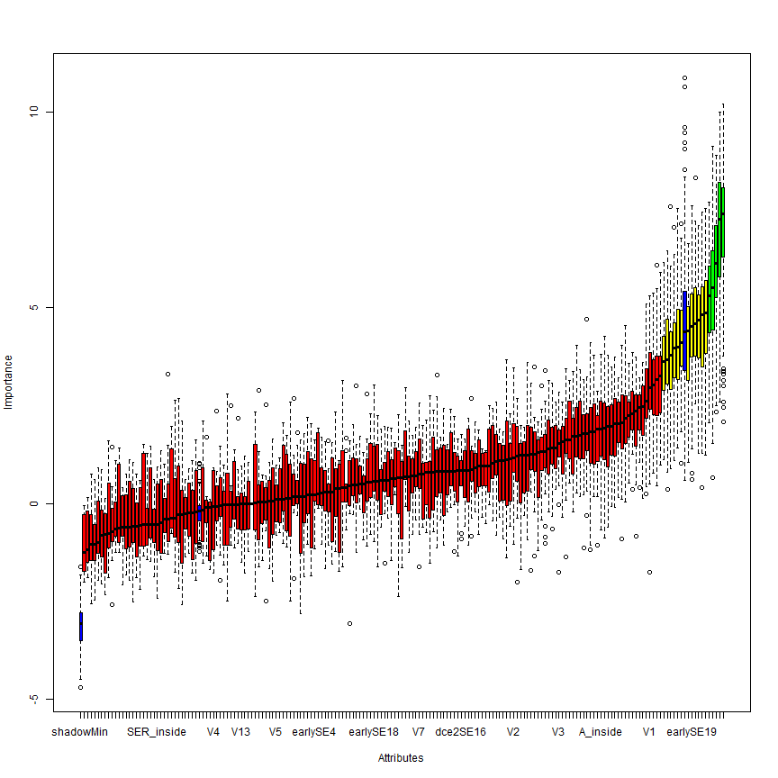
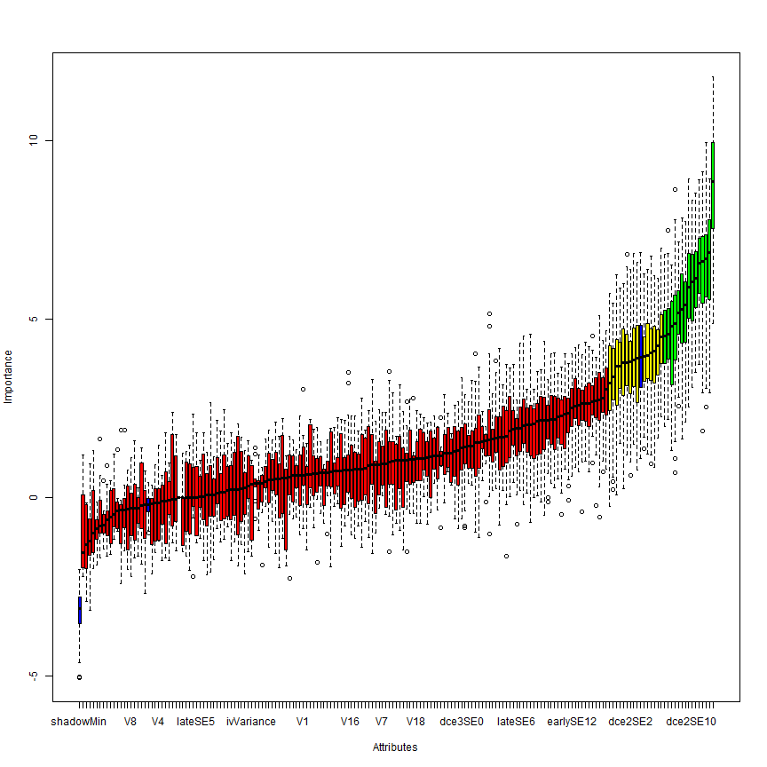
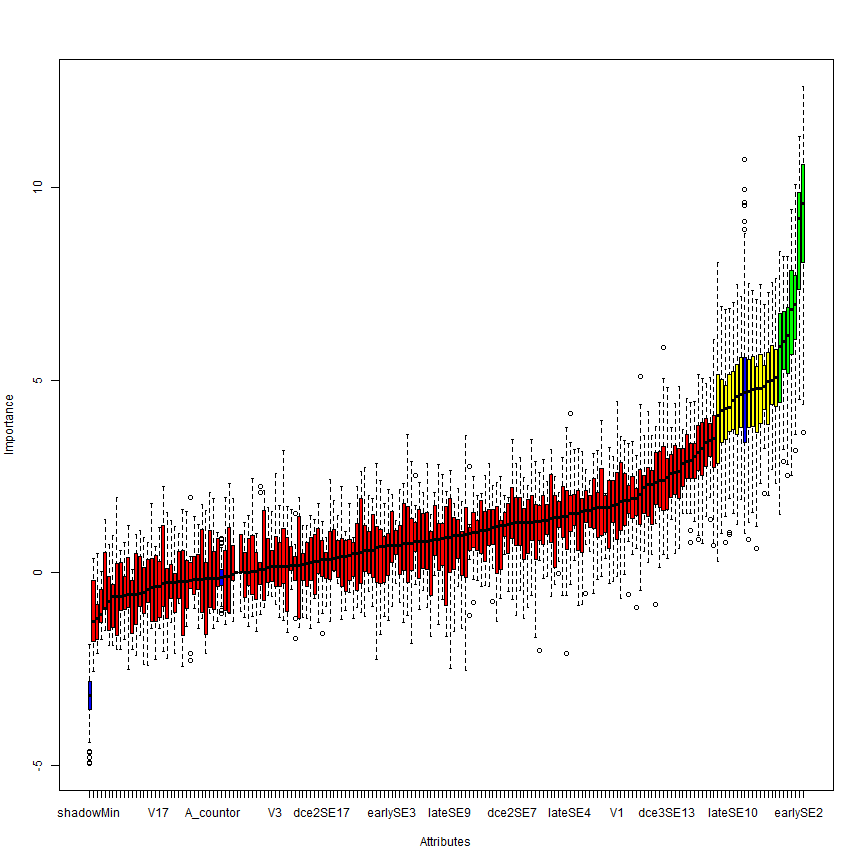
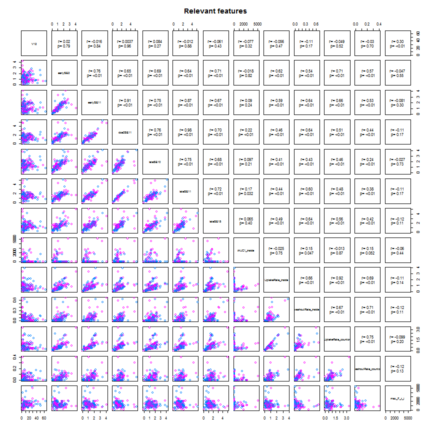

### code Read and partition data   

```r
setwd("Z:/Cristina/MassNonmass/Section1 - ExperimentsUpToDate/experimentsRadiologypaper-revision/Tree-based-RF/ensemble-Treebased-RF")
library("RSQLite")

rpart_inputdata <- function(subdata) {
    sqlite <- dbDriver("SQLite")
    conn <- dbConnect(sqlite, "stage1localData.db")
    
    # 2) all T1W features
    lesionsQuery <- dbGetQuery(conn, "SELECT *\n           FROM  stage1features\n           INNER JOIN lesion ON (stage1features.lesion_id = lesion.lesion_id)\n           INNER JOIN f_dynamic ON (stage1features.lesion_id = f_dynamic.lesion_id)\n           INNER JOIN f_morphology ON (stage1features.lesion_id = f_morphology.lesion_id)\n           INNER JOIN f_texture ON (stage1features.lesion_id = f_texture.lesion_id)")
    
    # prune entries and extract feature subsets corresponds to 5 entries
    # lesion info, 34 dynamic, 19 morpho, 34 texture fueatures
    lesionfields = names(lesionsQuery)
    lesioninfo = lesionsQuery[c(1, 2, 150, 151)]
    stage1features = lesionsQuery[c(3:103, 124:127)]
    dynfeatures = lesionsQuery[c(154:187)]
    morphofeatures = lesionsQuery[c(190:208)]
    texfeatures = lesionsQuery[c(211:234)]
    
    # combine all features
    allfeatures = cbind(lesioninfo[c(2, 3)], stage1features, dynfeatures, morphofeatures, 
        texfeatures)
    
    if (subdata == "mass") {
        # organized the data by subdata
        M <- subset(allfeatures, lesion_label == "massB" | lesion_label == "massM")
        M$lesion_label <- ifelse(M$lesion_label == "massB", "NC", "C")
        allfeatures = M
    }
    if (subdata == "nonmass") {
        # organized the data by subdata
        N <- subset(allfeatures, lesion_label == "nonmassB" | lesion_label == 
            "nonmassM")
        N$lesion_label <- ifelse(N$lesion_label == "nonmassB", "NC", "C")
        allfeatures = N
    }
    if (subdata == "stage1") {
        # organized the data by subdata
        M <- subset(allfeatures, lesion_label == "massB" | lesion_label == "massM")
        M$lesion_label <- ifelse(M$lesion_label == "massB", "mass", "mass")
        N <- subset(allfeatures, lesion_label == "nonmassB" | lesion_label == 
            "nonmassM")
        N$lesion_label <- ifelse(N$lesion_label == "nonmassB", "nonmass", "nonmass")
        allfeatures = data.frame(rbind(M, N))
    }
    if (subdata == "oneshot") {
        # organized the data by subdata
        M <- subset(allfeatures, lesion_label == "massB" | lesion_label == "massM")
        M$lesion_label <- ifelse(M$lesion_label == "massB", "NC", "C")
        N <- subset(allfeatures, lesion_label == "nonmassB" | lesion_label == 
            "nonmassM")
        N$lesion_label <- ifelse(N$lesion_label == "nonmassB", "NC", "C")
        allfeatures = data.frame(rbind(M, N))
    }
    # procees data
    allfeatures$lesion_label <- as.factor(allfeatures$lesion_label)
    allfeatures$peakCr_inside <- as.factor(allfeatures$peakCr_inside)
    allfeatures$peakVr_inside <- as.factor(allfeatures$peakVr_inside)
    allfeatures$peakCr_countor <- as.factor(allfeatures$peakCr_countor)
    allfeatures$peakVr_countor <- as.factor(allfeatures$peakVr_countor)
    allfeatures$k_Max_Margin_Grad <- as.factor(allfeatures$k_Max_Margin_Grad)
    allfeatures$max_RGH_mean_k <- as.factor(allfeatures$max_RGH_mean_k)
    allfeatures$max_RGH_var_k <- as.factor(allfeatures$max_RGH_var_k)
    
    output <- allfeatures
    return(output)
}
```


### code to create a cross-validation set up: 
### cvfoldk = number of cv folds typically 5 or 10
### out: particvfoldK = all cv-K ids

```r
library(MASS)
library(caret)
```

```
## Loading required package: cluster
## Loading required package: foreach
## Loading required package: lattice
## Loading required package: plyr
## Loading required package: reshape2
```

```r

cvfold_partition <- function(dat, cvfoldK){
  ndat = nrow(dat)
  outcomesetDi  <- dat$lesion_label
  #For multiple k-fold cross-validation, completely independent folds are created.
  #when y is a factor in an attempt to balance the class distributions within the splits.
  #The names of the list objects will denote the fold membership using the pattern 
  #"Foldi.Repj" meaning the ith section (of k) of the jth cross-validation set (of times).
  partitionsetDi <- createFolds(y = outcomesetDi, ## the outcome data are needed
                                k = cvfoldK, ## The percentage of data in the training set
                                list = TRUE) ## The format of the results. 
  return(partitionsetDi)
}
```


### code to sample kparti from a cross-validation set up: 
### kparti = k fold to exclude
### outs: cvTrainsetD, cvTestsetD

```r
kparti_sample <- function(dat, particvfoldK, cvfoldK, kparti) {
    allparti = 1:cvfoldK
    allbutkparti = allparti[-kparti]
    cvfoldadd = c()
    for (i in 1:length(allbutkparti)) {
        kadd = allbutkparti[i]
        cvfoldadd = c(cvfoldadd, particvfoldK[[kadd]])
    }
    # partition data
    cvTrainsetD <- dat[cvfoldadd, ]
    cvTestsetD <- dat[-cvfoldadd, ]
    
    output <- list(cvTrainsetD = cvTrainsetD, cvTestsetD = cvTestsetD)
    return(output)
}
```


### code Feature selection: 
### Boruta, cvfold, 

```r
library(Boruta)
```

```
## Loading required package: randomForest
## randomForest 4.6-7
## Type rfNews() to see new features/changes/bug fixes.
```

```r
require(data.table)
```

```
## Loading required package: data.table
```

```r
require(ggplot2)
```

```
## Loading required package: ggplot2
```

```r

# function to produce correlation coefficients on pair plots
panel.cor <- function(x, y, digits = 2, cex.cor, ...) {
    usr <- par("usr")
    on.exit(par(usr))
    par(usr = c(0, 1, 0, 1))
    # correlation coefficient
    r <- cor(x, y)
    txt <- format(c(r, 0.123456789), digits = digits)[1]
    txt <- paste("r= ", txt, sep = "")
    text(0.5, 0.6, txt)
    
    # p-value calculation
    p <- cor.test(x, y)$p.value
    txt2 <- format(c(p, 0.123456789), digits = digits)[1]
    txt2 <- paste("p= ", txt2, sep = "")
    if (p < 0.01) 
        txt2 <- paste("p= ", "<0.01", sep = "")
    text(0.5, 0.4, txt2)
}

subset_select <- function(setTrain) {
    featsel_boruta <- Boruta(lesion_label ~ ., data = setTrain[, 2:ncol(setTrain)], 
        doTrace = 2, ntree = 1000)
    print(featsel_boruta)
    plot(featsel_boruta)
    
    relevant <- featsel_boruta$finalDecision[featsel_boruta$finalDecision == 
        "Confirmed"]
    relevant_features = setTrain[c(names(relevant))]
    tentative <- featsel_boruta$finalDecision[featsel_boruta$finalDecision == 
        "Tentative"]
    tentative_features = setTrain[c(names(tentative))]
    sel_features = cbind(setTrain[c(1, 2)], relevant_features, tentative_features)
    
    super.sym <- trellis.par.get("superpose.symbol")
    ## pair plots for reatures
    setTrainrelevant = setTrain[c(names(relevant))]
    pairs(relevant_features, upper.panel = panel.cor, pch = super.sym$pch[1:2], 
        col = super.sym$col[1:2], text = list(levels(setTrainrelevant$lesion_label)), 
        main = "Relevant features")
    
    return(sel_features)
}
```


### code forest Train: 
### parameters, T= # of trees, D= tree depth, dat

```r
library(klaR)
library(rpart)
library(rpart.plot)
library(ada)

# bagged training was introduced as a way of reducing possible overfitting
# and improving the generalization capabilities of random forests.  The
# idea is to train each tree in a forest on a different training subset,
# sampled at random from the same labeled database.
rpart_adaforestTrain <- function(T, lrate, dat) {
    # set control
    adacontrol <- rpart.control(cp = -1, minsplit = 0, xval = 0, maxdepth = 1)
    
    # init forest
    forest = list()
    for (t in 1:T) {
        # cat('Tree # ', t, '\n')
        
        # build bagged trees from a bootstrap sample of trainSetD
        setD = dat[sample(1:nrow(dat), nrow(dat), replace = TRUE), ]
        
        # find subsample of var when training the ith tree we only make available
        # a small random subset
        subvar = sample(2:ncol(setD), sqrt(ncol(setD) - 1), replace = FALSE)
        subfeat = colnames(setD)[subvar]
        
        adaFit <- ada(lesion_label ~ ., data = setD[c("lesion_label", subfeat)], 
            iter = T, nu = lrate, type = "discrete", control = adacontrol)
        # print(adaFit) append
        forest <- append(forest, list(tree = adaFit))
    }
    
    output <- list(forest = forest)
    return(output)
}
```


### code forest Test: 
### parameters, T= # of trees, forest, TrainsetD, TestsetD

```r

library(pROC)
```

```
## Type 'citation("pROC")' for a citation.
## 
## Attaching package: 'pROC'
## 
## The following object(s) are masked from 'package:stats':
## 
##     cov, smooth, var
```

```r
library(ada)
rpart_adaforestTest <- function(T, TrainsetD, TestsetD, forest) {
    
    fclasspotrain = list()
    for (t in 1:T) {
        # Calcultate posterior Probabilities on grid points
        temp <- predict(forest[t]$tree, newdata = TrainsetD, type = "prob")  #
        fclasspotrain <- append(fclasspotrain, list(cpo = temp))
    }
    
    # run testing cases
    fclasspotest = list()
    for (t in 1:T) {
        # Calcultate posterior Probabilities on grid points
        temp <- predict(forest[t]$tree, newdata = TestsetD, type = "prob")  #
        fclasspotest <- append(fclasspotest, list(cpo = temp))
    }
    
    # performance on Train/Test set separately extract ensamble class
    # probabilities (when T > 1)
    trainpts = fclasspotrain[1]$cpo
    testpts = fclasspotest[1]$cpo
    # init ensample class posteriors
    enclasspotrain <- matrix(, nrow = nrow(as.data.frame(trainpts)), ncol = 2)
    enclasspotest <- matrix(, nrow = nrow(as.data.frame(testpts)), ncol = 2)
    enclasspotrain[, 1] = fclasspotrain[1]$cpo[, 1]
    enclasspotest[, 1] = fclasspotest[1]$cpo[, 1]
    enclasspotrain[, 2] = fclasspotrain[1]$cpo[, 2]
    enclasspotest[, 2] = fclasspotest[1]$cpo[, 2]
    if (T >= 2) {
        for (t in 2:T) {
            # train
            enclasspotrain[, 1] = enclasspotrain[, 1] + fclasspotrain[t]$cpo[, 
                1]
            enclasspotrain[, 2] = enclasspotrain[, 2] + fclasspotrain[t]$cpo[, 
                2]
            # test
            enclasspotest[, 1] = enclasspotest[, 1] + fclasspotest[t]$cpo[, 
                1]
            enclasspotest[, 2] = enclasspotest[, 2] + fclasspotest[t]$cpo[, 
                2]
        }
    }
    # majority voting averaging
    enclasspotrain = (1/T) * enclasspotrain
    enclasspotest = (1/T) * enclasspotest
    
    # on training
    classes = levels(TrainsetD$lesion_label)
    trainprob = data.frame(C1 = enclasspotrain[, 1], C2 = enclasspotrain[, 2], 
        pred = classes[apply(enclasspotrain, 1, which.max)], obs = TrainsetD$lesion_label)
    colnames(trainprob)[1:2] <- classes
    pred = as.factor(apply(enclasspotrain, 1, which.max))
    levels(pred) = levels(as.factor(unclass(TrainsetD$lesion_label)))
    perf_train = confusionMatrix(pred, as.factor(unclass(TrainsetD$lesion_label)))
    # print(perf_train)
    
    # on testing
    testprob = data.frame(C1 = enclasspotest[, 1], C2 = enclasspotest[, 2], 
        pred = classes[apply(enclasspotest, 1, which.max)], obs = TestsetD$lesion_label)
    colnames(testprob)[1:2] <- classes
    pred = as.factor(apply(enclasspotest, 1, which.max))
    levels(pred) = levels(as.factor(unclass(TestsetD$lesion_label)))
    pred = as.factor(apply(enclasspotest, 1, which.max))
    
    groundT = as.factor(unclass(TestsetD$lesion_label))
    levels(groundT) = levels(as.factor(unclass(TestsetD$lesion_label)))
    groundT = as.factor(unclass(TestsetD$lesion_label))
    
    perf_test = confusionMatrix(pred, groundT)
    # print(perf_test)
    
    output <- list(etrain = perf_train, etest = perf_test, trainprob = trainprob, 
        testprob = testprob)
    return(output)
}
```


### code for running and plotting perfm results: 
###statsAU

```r
# create_ensemble
create_ensemble <- function(dat, particvfoldK, cvK) {
    # inint
    ensemblegrdperf = list()
    maxM = list()
    for (r in 1:cvK) {
        ## pick one of cvfold for held-out test, train on the rest
        kparti_setdata = kparti_sample(dat, particvfoldK, cvK, r)
        
        # Boruta on $cvTrainsetD
        selfeatures_kfold = subset_select(kparti_setdata$cvTrainsetD)
        names(selfeatures_kfold)
        
        ################################################### create grid of
        ################################################### evaluation points
        gT = c(5, 10, 30, 60, 100, 250)
        glrate = c(1)
        grd <- expand.grid(x = glrate, y = gT)
        
        ################################################### for oneshot
        grdperf = data.frame(grd)
        grdperf$acuTrain = 0
        grdperf$rocTrain = 0
        grdperf$senTrain = 0
        grdperf$speTrain = 0
        
        grdperf$acuTest = 0
        grdperf$rocTest = 0
        grdperf$senTest = 0
        grdperf$speTest = 0
        
        M = list()
        for (k in 1:nrow(grd)) {
            lrate = grd[k, 1]
            T = grd[k, 2]
            # Build in l
            cat("lrate: ", lrate, "T: ", T, "\n")
            TrainsetD <- kparti_setdata$cvTrainsetD[c(names(selfeatures_kfold))]
            TestsetD <- kparti_setdata$cvTestsetD[c(names(selfeatures_kfold))]
            fit <- rpart_adaforestTrain(T, lrate, TrainsetD[c(2:ncol(TrainsetD))])
            # # predict
            perf <- rpart_adaforestTest(T, TrainsetD[c(2:ncol(TrainsetD))], 
                TestsetD[c(2:ncol(TestsetD))], fit$forest)
            # for train
            ROCF_train <- roc(perf$trainprob$obs, perf$trainprob$C, col = "#000086", 
                main = paste0("mass ROC T=", T, " lrate=", lrate, " cv=", r))
            print(ROCF_train$auc)
            # collect data
            grdperf$acuTrain[k] = grdperf$acuTrain[k] + as.numeric(perf$etrain$overall[1])
            grdperf$rocTrain[k] = grdperf$rocTrain[k] + as.numeric(ROCF_train$auc)
            grdperf$senTrain[k] = grdperf$senTrain[k] + as.numeric(perf$etrain$byClass[1])
            grdperf$speTrain[k] = grdperf$speTrain[k] + as.numeric(perf$etrain$byClass[2])
            # for test par(new=TRUE)
            ROCF_test <- roc(perf$testprob$obs, perf$testprob$C, col = "#860000", 
                main = paste0("ROC T=", T, " lrate=", lrate, " cv=", r))
            # legend('bottomright', legend = c('train', 'test'), col = c('#000086',
            # '#860000'),lwd = c(2,1))
            print(ROCF_test$auc)
            # collect data
            grdperf$acuTest[k] = grdperf$acuTest[k] + as.numeric(perf$etest$overall[1])
            grdperf$rocTest[k] = grdperf$rocTest[k] + as.numeric(ROCF_test$auc)
            grdperf$senTest[k] = grdperf$senTest[k] + as.numeric(perf$etest$byClass[1])
            grdperf$speTest[k] = grdperf$speTest[k] + as.numeric(perf$etest$byClass[2])
            
            # append perfm for ROC
            M = append(M, list(M = list(D = D, T = T, trainprob = perf$trainprob, 
                testprob = perf$testprob, forest = fit$forest)))
        }
        print(grdperf)
        index = which(grdperf$rocTest == max(grdperf$rocTest), arr.ind = TRUE)
        Dmax = grdperf$x[index]
        Tmax = grdperf$y[index]
        resamMax = M[index]$M$testprob
        # append
        maxM <- append(maxM, list(maxp = list(D = Dmax, T = Tmax, trainprob = M[index]$M$trainprob, 
            testprob = M[index]$M$testprob, forest = M[index]$M$forest)))
        ensemblegrdperf <- append(ensemblegrdperf, list(grdperf = grdperf))
    }
    
    output <- list(ensemblegrdperf = ensemblegrdperf, maxM = maxM)
    return(output)
}

surface_forestperfm <- function(grdperf) {
    library(gridExtra)
    library(base)
    library(lattice)
    
    
    graphlist <- list()
    count <- 1
    # design acuTrain
    z = grdperf$acuTrain
    gD = unique(grdperf$x)
    gT = unique(grdperf$y)
    dim(z) <- c(length(gD), length(gT))
    w1 <- wireframe(z, gD, gT, box = FALSE, xlab = "Depth of trees (D)", ylab = "Number of trees (T)", 
        main = "Influence of forest parameters on Accuracy Train", drape = TRUE, 
        colorkey = TRUE, light.source = c(10, 0, 10), col.regions = colorRampPalette(c("red", 
            "blue"))(100), screen = list(z = 30, x = -60))
    graphlist[[count]] <- w1
    count <- count + 1
    
    # design rocTrain
    z = grdperf$rocTrain
    dim(z) <- c(length(gD), length(gT))
    w2 <- wireframe(z, gD, gT, box = FALSE, xlab = "Depth of trees (D)", ylab = "Number of trees (T)", 
        main = "Influence of forest parameters on ROC Train", drape = TRUE, 
        colorkey = TRUE, light.source = c(10, 0, 10), col.regions = colorRampPalette(c("red", 
            "blue"))(100), screen = list(z = 30, x = -60))
    graphlist[[count]] <- w2
    count <- count + 1
    
    # design acuTest
    z = grdperf$acuTest
    dim(z) <- c(length(gD), length(gT))
    w3 <- wireframe(z, gD, gT, box = FALSE, xlab = "Depth of trees (D)", ylab = "Number of trees (T)", 
        main = "Influence of forest parameters on Accuracy Test", drape = TRUE, 
        colorkey = TRUE, light.source = c(10, 0, 10), col.regions = colorRampPalette(c("red", 
            "blue"))(100), screen = list(z = 30, x = -60))
    graphlist[[count]] <- w3
    count <- count + 1
    
    # design rocTest
    z = grdperf$rocTest
    dim(z) <- c(length(gD), length(gT))
    w4 <- wireframe(z, gD, gT, box = FALSE, xlab = "Depth of trees (D)", ylab = "Number of trees (T)", 
        main = "Influence of forest parameters on ROC Test", drape = TRUE, colorkey = TRUE, 
        light.source = c(10, 0, 10), col.regions = colorRampPalette(c("red", 
            "blue"))(100), screen = list(z = 30, x = -60))
    graphlist[[count]] <- w4
    count <- count + 1
    
    
    # finally plot in grid
    do.call("grid.arrange", c(graphlist, ncol = 2))
}
```


Run for mass lesions:
=====

```r
# read mass features
massdat = rpart_inputdata(subdata = "mass")
## create CV
cvK = 10
# run for mass
particvfoldK = cvfold_partition(massdat, cvK)
res = create_ensemble(massdat, particvfoldK, cvK)
```

```
## Initial round 1: ..........
##  84  attributes rejected after this test:  V1 V3 V6 V10 V11 V14 V15 V19 earlySE3 earlySE4 earlySE5 earlySE7 earlySE8 earlySE12 earlySE14 earlySE17 dce2SE0 dce2SE3 dce2SE5 dce2SE12 dce2SE16 dce2SE17 dce3SE9 dce3SE12 dce3SE16 dce3SE17 dce3SE18 dce3SE19 lateSE0 lateSE2 lateSE3 lateSE5 lateSE6 lateSE9 lateSE16 lateSE17 lateSE18 degreeC betweennessC alpha_inside Tpeak_inside SER_inside maxVr_inside peakVr_inside Vr_increasingRate_inside Vr_decreasingRate_inside A_countor beta_countor Tpeak_countor peakCr_countor maxVr_countor peakVr_countor Vr_increasingRate_countor Vr_decreasingRate_countor Vr_post_1_countor skew_F_r_i kurt_F_r_i iiiMax_Margin_Gradient k_Max_Margin_Grad ivVariance circularity edge_sharp_mean edge_sharp_std max_RGH_mean_k max_RGH_var_k texture_contrast_halfRad texture_contrast_threeQuaRad texture_homogeneity_zero texture_homogeneity_quarterRad texture_homogeneity_halfRad texture_homogeneity_threeQuaRad texture_dissimilarity_zero texture_dissimilarity_quarterRad texture_dissimilarity_halfRad texture_correlation_zero texture_correlation_quarterRad texture_correlation_halfRad texture_correlation_threeQuaRad texture_ASM_zero texture_ASM_threeQuaRad texture_energy_zero texture_energy_quarterRad texture_energy_halfRad texture_energy_threeQuaRad 
## 
## Initial round 2: ..........
##  22  attributes rejected after this test:  V0 V16 V17 V18 earlySE15 dce2SE14 dce2SE18 dce3SE5 lateSE7 lateSE8 lateSE12 closenessC beta_inside Slope_ini_inside Vr_post_1_inside SER_countor min_F_r_i iMax_Variance_uptake irregularity texture_dissimilarity_threeQuaRad texture_ASM_quarterRad texture_ASM_halfRad 
## 
## Initial round 3: ..........
##  23  attributes rejected after this test:  V2 V4 V8 earlySE18 dce2SE1 dce2SE2 dce2SE4 dce2SE6 dce2SE7 dce2SE9 dce2SE11 dce2SE15 dce3SE0 dce3SE2 dce3SE3 lateSE1 lateSE14 alpha_countor iAUC1_countor Slope_ini_countor Kpeak_countor max_RGH_var texture_contrast_zero 
## 
## Final round: ..........
##  4  attributes confirmed after this test:  earlySE0 iAUC1_inside UptakeRate_countor max_F_r_i 
## 
##  13  attributes rejected after this test:  V9 V13 earlySE6 earlySE9 earlySE10 earlySE16 dce3SE10 lateSE13 lateSE19 no_triangles no_con_comp A_inside max_RGH_mean 
## ....
##  3  attributes confirmed after this test:  V12 earlySE2 UptakeRate_inside 
## 
##  4  attributes rejected after this test:  V7 dce3SE8 lateSE10 var_F_r_i 
## ....
##  1  attributes confirmed after this test:  lateSE15 
## ...
##  1  attributes rejected after this test:  dce3SE14 
## ...
##  1  attributes rejected after this test:  lateSE4 
## ...
##  2  attributes confirmed after this test:  dce3SE11 lateSE11 
## 
##  1  attributes rejected after this test:  peakCr_inside 
## ...
##  2  attributes rejected after this test:  dce2SE8 dce2SE13 
## ........
##  1  attributes rejected after this test:  dce3SE6 
## ...
##  1  attributes rejected after this test:  Kpeak_inside 
## ..
##  1  attributes rejected after this test:  dce2SE10 
## ......
##  1  attributes rejected after this test:  maxCr_countor 
## .................
##  1  attributes confirmed after this test:  washoutRate_countor 
## ...............
##  1  attributes confirmed after this test:  earlySE11 
## ...................
##  1  attributes confirmed after this test:  dce3SE7 
## 
## Boruta performed 130 randomForest runs in 6.918 mins.
##         13 attributes confirmed important: V12 earlySE0 earlySE2
## earlySE11 dce3SE7 dce3SE11 lateSE11 lateSE15 iAUC1_inside
## UptakeRate_inside UptakeRate_countor washoutRate_countor max_F_r_i
##         155 attributes confirmed unimportant: V0 V1 V2 V3 V4 V6 V7
## V8 V9 V10 V11 V13 V14 V15 V16 V17 V18 V19 earlySE3 earlySE4
## earlySE5 earlySE6 earlySE7 earlySE8 earlySE9 earlySE10 earlySE12
## earlySE14 earlySE15 earlySE16 earlySE17 earlySE18 dce2SE0 dce2SE1
## dce2SE2 dce2SE3 dce2SE4 dce2SE5 dce2SE6 dce2SE7 dce2SE8 dce2SE9
## dce2SE10 dce2SE11 dce2SE12 dce2SE13 dce2SE14 dce2SE15 dce2SE16
## dce2SE17 dce2SE18 dce3SE0 dce3SE2 dce3SE3 dce3SE5 dce3SE6 dce3SE8
## dce3SE9 dce3SE10 dce3SE12 dce3SE14 dce3SE16 dce3SE17 dce3SE18
## dce3SE19 lateSE0 lateSE1 lateSE2 lateSE3 lateSE4 lateSE5 lateSE6
## lateSE7 lateSE8 lateSE9 lateSE10 lateSE12 lateSE13 lateSE14
## lateSE16 lateSE17 lateSE18 lateSE19 degreeC closenessC
## betweennessC no_triangles no_con_comp A_inside alpha_inside
## beta_inside Slope_ini_inside Tpeak_inside Kpeak_inside SER_inside
## peakCr_inside maxVr_inside peakVr_inside Vr_increasingRate_inside
## Vr_decreasingRate_inside Vr_post_1_inside A_countor alpha_countor
## beta_countor iAUC1_countor Slope_ini_countor Tpeak_countor
## Kpeak_countor SER_countor maxCr_countor peakCr_countor
## maxVr_countor peakVr_countor Vr_increasingRate_countor
## Vr_decreasingRate_countor Vr_post_1_countor min_F_r_i var_F_r_i
## skew_F_r_i kurt_F_r_i iMax_Variance_uptake iiiMax_Margin_Gradient
## k_Max_Margin_Grad ivVariance circularity irregularity
## edge_sharp_mean edge_sharp_std max_RGH_mean max_RGH_mean_k
## max_RGH_var max_RGH_var_k texture_contrast_zero
## texture_contrast_halfRad texture_contrast_threeQuaRad
## texture_homogeneity_zero texture_homogeneity_quarterRad
## texture_homogeneity_halfRad texture_homogeneity_threeQuaRad
## texture_dissimilarity_zero texture_dissimilarity_quarterRad
## texture_dissimilarity_halfRad texture_dissimilarity_threeQuaRad
## texture_correlation_zero texture_correlation_quarterRad
## texture_correlation_halfRad texture_correlation_threeQuaRad
## texture_ASM_zero texture_ASM_quarterRad texture_ASM_halfRad
## texture_ASM_threeQuaRad texture_energy_zero
## texture_energy_quarterRad texture_energy_halfRad
## texture_energy_threeQuaRad
##         14 tentative attributes left: V5 earlySE1 earlySE13
## earlySE19 dce2SE19 dce3SE1 dce3SE4 dce3SE13 dce3SE15 maxCr_inside
## washoutRate_inside mean_F_r_i iiMin_change_Variance_uptake
## texture_contrast_quarterRad
```

  

```
## lrate:  1 T:  5 
## Area under the curve: 0.807
## Area under the curve: 0.775
## lrate:  1 T:  10 
## Area under the curve: 0.849
## Area under the curve: 0.758
## lrate:  1 T:  30 
## Area under the curve: 0.897
## Area under the curve: 0.758
## lrate:  1 T:  60 
## Area under the curve: 0.941
## Area under the curve: 0.758
## lrate:  1 T:  100 
## Area under the curve: 0.962
## Area under the curve: 0.725
## lrate:  1 T:  250 
## Area under the curve: 0.997
## Area under the curve: 0.725
##   x   y acuTrain rocTrain senTrain speTrain acuTest rocTest senTest
## 1 1   5   0.7543   0.8073   0.8304   0.6190    0.70  0.7747  0.9231
## 2 1  10   0.7943   0.8492   0.8661   0.6667    0.65  0.7582  0.9231
## 3 1  30   0.8343   0.8970   0.9464   0.6349    0.65  0.7582  0.8462
## 4 1  60   0.8514   0.9415   0.9464   0.6825    0.70  0.7582  0.8462
## 5 1 100   0.9086   0.9617   0.9643   0.8095    0.65  0.7253  0.8462
## 6 1 250   0.9543   0.9970   1.0000   0.8730    0.65  0.7253  0.8462
##   speTest
## 1  0.2857
## 2  0.1429
## 3  0.2857
## 4  0.4286
## 5  0.2857
## 6  0.2857
## Initial round 1: ..........
##  104  attributes rejected after this test:  V0 V1 V4 V5 V7 V9 V10 V11 V13 V14 V15 V16 V17 V18 V19 earlySE3 earlySE5 earlySE14 earlySE15 earlySE17 dce2SE0 dce2SE1 dce2SE3 dce2SE4 dce2SE5 dce2SE8 dce2SE9 dce2SE12 dce2SE16 dce2SE17 dce2SE19 dce3SE2 dce3SE5 dce3SE8 dce3SE12 dce3SE16 dce3SE17 dce3SE19 lateSE0 lateSE1 lateSE2 lateSE3 lateSE5 lateSE6 lateSE7 lateSE8 lateSE12 lateSE16 lateSE17 lateSE18 lateSE19 betweennessC no_con_comp alpha_inside beta_inside SER_inside maxCr_inside peakCr_inside maxVr_inside peakVr_inside Vr_increasingRate_inside Vr_post_1_inside A_countor beta_countor iAUC1_countor peakCr_countor maxVr_countor peakVr_countor Vr_increasingRate_countor Vr_decreasingRate_countor Vr_post_1_countor min_F_r_i mean_F_r_i skew_F_r_i kurt_F_r_i iiiMax_Margin_Gradient k_Max_Margin_Grad ivVariance circularity irregularity edge_sharp_mean edge_sharp_std max_RGH_mean max_RGH_mean_k max_RGH_var_k texture_contrast_zero texture_contrast_halfRad texture_contrast_threeQuaRad texture_homogeneity_zero texture_homogeneity_quarterRad texture_homogeneity_halfRad texture_homogeneity_threeQuaRad texture_dissimilarity_zero texture_dissimilarity_quarterRad texture_dissimilarity_halfRad texture_correlation_zero texture_correlation_halfRad texture_correlation_threeQuaRad texture_ASM_quarterRad texture_ASM_halfRad texture_energy_zero texture_energy_quarterRad texture_energy_halfRad texture_energy_threeQuaRad 
## 
## Initial round 2: ..........
##  16  attributes rejected after this test:  earlySE4 earlySE16 dce2SE6 dce2SE13 dce2SE14 dce2SE15 dce3SE3 lateSE9 Vr_decreasingRate_inside var_F_r_i iMax_Variance_uptake max_RGH_var texture_dissimilarity_threeQuaRad texture_correlation_quarterRad texture_ASM_zero texture_ASM_threeQuaRad 
## 
## Initial round 3: ..........
##  8  attributes rejected after this test:  V8 dce3SE0 dce3SE9 dce3SE15 lateSE13 lateSE14 Tpeak_inside alpha_countor 
## 
## Final round: ..........
##  14  attributes rejected after this test:  V3 V6 earlySE6 earlySE7 earlySE10 earlySE18 dce2SE7 dce3SE7 dce3SE18 lateSE4 washoutRate_inside Tpeak_countor washoutRate_countor texture_contrast_quarterRad 
## ....
##  6  attributes rejected after this test:  V2 earlySE1 earlySE12 dce2SE18 dce3SE6 A_inside 
## ....
##  2  attributes rejected after this test:  closenessC maxCr_countor 
## ...
##  1  attributes confirmed after this test:  earlySE11 
## 
##  1  attributes rejected after this test:  dce3SE14 
## ...
##  3  attributes confirmed after this test:  earlySE2 dce3SE11 iAUC1_inside 
## ...
##  1  attributes confirmed after this test:  max_F_r_i 
## 
##  1  attributes rejected after this test:  dce2SE2 
## ........
##  1  attributes rejected after this test:  degreeC 
## ......
##  2  attributes rejected after this test:  no_triangles Kpeak_countor 
## ..
##  2  attributes confirmed after this test:  lateSE11 iiMin_change_Variance_uptake 
## ......
##  1  attributes confirmed after this test:  Slope_ini_countor 
## .....
##  1  attributes rejected after this test:  dce2SE10 
## .....
##  2  attributes rejected after this test:  dce3SE13 SER_countor 
## .....
##  1  attributes confirmed after this test:  earlySE9 
## ..
##  1  attributes confirmed after this test:  Slope_ini_inside 
## .............
##  1  attributes rejected after this test:  earlySE8 
## .....................
## Boruta performed 130 randomForest runs in 8.765 mins.
##         10 attributes confirmed important: earlySE2 earlySE9
## earlySE11 dce3SE11 lateSE11 iAUC1_inside Slope_ini_inside
## Slope_ini_countor max_F_r_i iiMin_change_Variance_uptake
##         159 attributes confirmed unimportant: V0 V1 V2 V3 V4 V5 V6
## V7 V8 V9 V10 V11 V13 V14 V15 V16 V17 V18 V19 earlySE1 earlySE3
## earlySE4 earlySE5 earlySE6 earlySE7 earlySE8 earlySE10 earlySE12
## earlySE14 earlySE15 earlySE16 earlySE17 earlySE18 dce2SE0 dce2SE1
## dce2SE2 dce2SE3 dce2SE4 dce2SE5 dce2SE6 dce2SE7 dce2SE8 dce2SE9
## dce2SE10 dce2SE12 dce2SE13 dce2SE14 dce2SE15 dce2SE16 dce2SE17
## dce2SE18 dce2SE19 dce3SE0 dce3SE2 dce3SE3 dce3SE5 dce3SE6 dce3SE7
## dce3SE8 dce3SE9 dce3SE12 dce3SE13 dce3SE14 dce3SE15 dce3SE16
## dce3SE17 dce3SE18 dce3SE19 lateSE0 lateSE1 lateSE2 lateSE3 lateSE4
## lateSE5 lateSE6 lateSE7 lateSE8 lateSE9 lateSE12 lateSE13 lateSE14
## lateSE16 lateSE17 lateSE18 lateSE19 degreeC closenessC
## betweennessC no_triangles no_con_comp A_inside alpha_inside
## beta_inside Tpeak_inside SER_inside maxCr_inside peakCr_inside
## washoutRate_inside maxVr_inside peakVr_inside
## Vr_increasingRate_inside Vr_decreasingRate_inside Vr_post_1_inside
## A_countor alpha_countor beta_countor iAUC1_countor Tpeak_countor
## Kpeak_countor SER_countor maxCr_countor peakCr_countor
## washoutRate_countor maxVr_countor peakVr_countor
## Vr_increasingRate_countor Vr_decreasingRate_countor
## Vr_post_1_countor min_F_r_i mean_F_r_i var_F_r_i skew_F_r_i
## kurt_F_r_i iMax_Variance_uptake iiiMax_Margin_Gradient
## k_Max_Margin_Grad ivVariance circularity irregularity
## edge_sharp_mean edge_sharp_std max_RGH_mean max_RGH_mean_k
## max_RGH_var max_RGH_var_k texture_contrast_zero
## texture_contrast_quarterRad texture_contrast_halfRad
## texture_contrast_threeQuaRad texture_homogeneity_zero
## texture_homogeneity_quarterRad texture_homogeneity_halfRad
## texture_homogeneity_threeQuaRad texture_dissimilarity_zero
## texture_dissimilarity_quarterRad texture_dissimilarity_halfRad
## texture_dissimilarity_threeQuaRad texture_correlation_zero
## texture_correlation_quarterRad texture_correlation_halfRad
## texture_correlation_threeQuaRad texture_ASM_zero
## texture_ASM_quarterRad texture_ASM_halfRad texture_ASM_threeQuaRad
## texture_energy_zero texture_energy_quarterRad
## texture_energy_halfRad texture_energy_threeQuaRad
##         13 tentative attributes left: V12 earlySE0 earlySE13
## earlySE19 dce2SE11 dce3SE1 dce3SE4 dce3SE10 lateSE10 lateSE15
## Kpeak_inside UptakeRate_inside UptakeRate_countor
```

  

```
## lrate:  1 T:  5 
## Area under the curve: 0.815
## Area under the curve: 0.655
## lrate:  1 T:  10 
## Area under the curve: 0.839
## Area under the curve: 0.643
## lrate:  1 T:  30 
## Area under the curve: 0.891
## Area under the curve: 0.679
## lrate:  1 T:  60 
## Area under the curve: 0.923
## Area under the curve: 0.643
## lrate:  1 T:  100 
## Area under the curve: 0.947
## Area under the curve: 0.643
## lrate:  1 T:  250 
## Area under the curve: 0.991
## Area under the curve: 0.631
##   x   y acuTrain rocTrain senTrain speTrain acuTest rocTest senTest
## 1 1   5   0.7330   0.8150   0.8584   0.5079  0.6842  0.6548    0.75
## 2 1  10   0.7443   0.8393   0.8319   0.5873  0.6842  0.6429    0.75
## 3 1  30   0.8182   0.8914   0.9381   0.6032  0.7368  0.6786    0.75
## 4 1  60   0.8636   0.9232   0.9558   0.6984  0.6842  0.6429    0.75
## 5 1 100   0.9148   0.9469   1.0000   0.7619  0.7368  0.6429    0.75
## 6 1 250   0.9489   0.9909   1.0000   0.8571  0.6842  0.6310    0.75
##   speTest
## 1  0.5714
## 2  0.5714
## 3  0.7143
## 4  0.5714
## 5  0.7143
## 6  0.5714
## Initial round 1: ..........
##  102  attributes rejected after this test:  V0 V2 V3 V4 V5 V6 V7 V8 V9 V10 V11 V14 V15 V16 V17 V18 V19 earlySE3 earlySE4 earlySE5 earlySE8 earlySE14 earlySE17 dce2SE3 dce2SE5 dce2SE7 dce2SE15 dce2SE16 dce2SE17 dce3SE0 dce3SE2 dce3SE5 dce3SE9 dce3SE17 lateSE0 lateSE1 lateSE2 lateSE5 lateSE9 lateSE12 lateSE14 lateSE16 degreeC betweennessC no_triangles no_con_comp alpha_inside beta_inside Tpeak_inside Kpeak_inside SER_inside peakCr_inside washoutRate_inside maxVr_inside peakVr_inside Vr_increasingRate_inside Vr_decreasingRate_inside Vr_post_1_inside A_countor alpha_countor beta_countor iAUC1_countor Slope_ini_countor Tpeak_countor Kpeak_countor SER_countor peakCr_countor maxVr_countor peakVr_countor Vr_increasingRate_countor Vr_decreasingRate_countor Vr_post_1_countor skew_F_r_i kurt_F_r_i iMax_Variance_uptake iiiMax_Margin_Gradient k_Max_Margin_Grad ivVariance circularity irregularity edge_sharp_mean max_RGH_mean_k max_RGH_var_k texture_contrast_zero texture_contrast_quarterRad texture_contrast_halfRad texture_homogeneity_zero texture_homogeneity_quarterRad texture_homogeneity_halfRad texture_homogeneity_threeQuaRad texture_dissimilarity_zero texture_dissimilarity_quarterRad texture_dissimilarity_halfRad texture_correlation_zero texture_correlation_quarterRad texture_correlation_halfRad texture_correlation_threeQuaRad texture_ASM_zero texture_ASM_halfRad texture_ASM_threeQuaRad texture_energy_zero texture_energy_threeQuaRad 
## 
## Initial round 2: ..........
##  14  attributes rejected after this test:  V13 earlySE15 dce2SE0 dce2SE4 dce3SE3 lateSE3 lateSE8 lateSE17 lateSE19 closenessC iiMin_change_Variance_uptake edge_sharp_std texture_contrast_threeQuaRad texture_energy_quarterRad 
## 
## Initial round 3: ..........
##  12  attributes rejected after this test:  earlySE7 earlySE9 earlySE10 dce2SE14 dce3SE16 lateSE7 lateSE13 lateSE18 Slope_ini_inside min_F_r_i texture_dissimilarity_threeQuaRad texture_ASM_quarterRad 
## 
## Final round: ..........
##  2  attributes confirmed after this test:  dce3SE11 max_F_r_i 
## 
##  14  attributes rejected after this test:  V1 earlySE16 dce2SE8 dce2SE9 dce2SE10 dce2SE12 dce2SE13 dce3SE12 dce3SE13 dce3SE14 lateSE4 lateSE6 UptakeRate_inside texture_energy_halfRad 
## ....
##  1  attributes confirmed after this test:  lateSE11 
## 
##  5  attributes rejected after this test:  earlySE12 earlySE18 dce2SE1 A_inside maxCr_inside 
## ....
##  2  attributes confirmed after this test:  earlySE2 dce3SE6 
## ............
##  1  attributes confirmed after this test:  iAUC1_inside 
## ...
##  2  attributes rejected after this test:  dce2SE6 dce3SE15 
## .....
##  1  attributes rejected after this test:  dce2SE2 
## ...
##  2  attributes rejected after this test:  maxCr_countor max_RGH_var 
## .....
##  1  attributes rejected after this test:  mean_F_r_i 
## ..................
##  2  attributes rejected after this test:  V12 lateSE10 
## ..
##  1  attributes confirmed after this test:  earlySE1 
## ...
##  1  attributes rejected after this test:  var_F_r_i 
## .......
##  1  attributes rejected after this test:  earlySE0 
## .......
##  1  attributes rejected after this test:  dce3SE8 
## ............
##  1  attributes rejected after this test:  dce2SE19 
## ...
##  1  attributes rejected after this test:  earlySE13 
## ..
## Boruta performed 130 randomForest runs in 6.372 mins.
##         7 attributes confirmed important: earlySE1 earlySE2
## dce3SE6 dce3SE11 lateSE11 iAUC1_inside max_F_r_i
##         160 attributes confirmed unimportant: V0 V1 V2 V3 V4 V5 V6
## V7 V8 V9 V10 V11 V12 V13 V14 V15 V16 V17 V18 V19 earlySE0 earlySE3
## earlySE4 earlySE5 earlySE7 earlySE8 earlySE9 earlySE10 earlySE12
## earlySE13 earlySE14 earlySE15 earlySE16 earlySE17 earlySE18
## dce2SE0 dce2SE1 dce2SE2 dce2SE3 dce2SE4 dce2SE5 dce2SE6 dce2SE7
## dce2SE8 dce2SE9 dce2SE10 dce2SE12 dce2SE13 dce2SE14 dce2SE15
## dce2SE16 dce2SE17 dce2SE19 dce3SE0 dce3SE2 dce3SE3 dce3SE5 dce3SE8
## dce3SE9 dce3SE12 dce3SE13 dce3SE14 dce3SE15 dce3SE16 dce3SE17
## lateSE0 lateSE1 lateSE2 lateSE3 lateSE4 lateSE5 lateSE6 lateSE7
## lateSE8 lateSE9 lateSE10 lateSE12 lateSE13 lateSE14 lateSE16
## lateSE17 lateSE18 lateSE19 degreeC closenessC betweennessC
## no_triangles no_con_comp A_inside alpha_inside beta_inside
## Slope_ini_inside Tpeak_inside Kpeak_inside SER_inside maxCr_inside
## peakCr_inside UptakeRate_inside washoutRate_inside maxVr_inside
## peakVr_inside Vr_increasingRate_inside Vr_decreasingRate_inside
## Vr_post_1_inside A_countor alpha_countor beta_countor
## iAUC1_countor Slope_ini_countor Tpeak_countor Kpeak_countor
## SER_countor maxCr_countor peakCr_countor maxVr_countor
## peakVr_countor Vr_increasingRate_countor Vr_decreasingRate_countor
## Vr_post_1_countor min_F_r_i mean_F_r_i var_F_r_i skew_F_r_i
## kurt_F_r_i iMax_Variance_uptake iiMin_change_Variance_uptake
## iiiMax_Margin_Gradient k_Max_Margin_Grad ivVariance circularity
## irregularity edge_sharp_mean edge_sharp_std max_RGH_mean_k
## max_RGH_var max_RGH_var_k texture_contrast_zero
## texture_contrast_quarterRad texture_contrast_halfRad
## texture_contrast_threeQuaRad texture_homogeneity_zero
## texture_homogeneity_quarterRad texture_homogeneity_halfRad
## texture_homogeneity_threeQuaRad texture_dissimilarity_zero
## texture_dissimilarity_quarterRad texture_dissimilarity_halfRad
## texture_dissimilarity_threeQuaRad texture_correlation_zero
## texture_correlation_quarterRad texture_correlation_halfRad
## texture_correlation_threeQuaRad texture_ASM_zero
## texture_ASM_quarterRad texture_ASM_halfRad texture_ASM_threeQuaRad
## texture_energy_zero texture_energy_quarterRad
## texture_energy_halfRad texture_energy_threeQuaRad
##         15 tentative attributes left: earlySE6 earlySE11 earlySE19
## dce2SE11 dce2SE18 dce3SE1 dce3SE4 dce3SE7 dce3SE10 dce3SE18
## dce3SE19 lateSE15 UptakeRate_countor washoutRate_countor
## max_RGH_mean
```

  

```
## lrate:  1 T:  5 
## Area under the curve: 0.784
## Area under the curve: 0.5
## lrate:  1 T:  10 
## Area under the curve: 0.821
## Area under the curve: 0.604
## lrate:  1 T:  30 
## Area under the curve: 0.888
## Area under the curve: 0.648
## lrate:  1 T:  60 
## Area under the curve: 0.916
## Area under the curve: 0.538
## lrate:  1 T:  100 
## Area under the curve: 0.955
## Area under the curve: 0.626
## lrate:  1 T:  250 
## Area under the curve: 0.988
## Area under the curve: 0.626
##   x   y acuTrain rocTrain senTrain speTrain acuTest rocTest senTest
## 1 1   5   0.7029   0.7844   0.7232   0.6667    0.45  0.5000  0.3077
## 2 1  10   0.7771   0.8207   0.8929   0.5714    0.55  0.6044  0.5385
## 3 1  30   0.8057   0.8878   0.9018   0.6349    0.60  0.6484  0.6154
## 4 1  60   0.8514   0.9164   0.9107   0.7460    0.50  0.5385  0.3846
## 5 1 100   0.9143   0.9555   0.9821   0.7937    0.65  0.6264  0.6923
## 6 1 250   0.9543   0.9880   0.9911   0.8889    0.65  0.6264  0.6154
##   speTest
## 1  0.7143
## 2  0.5714
## 3  0.5714
## 4  0.7143
## 5  0.5714
## 6  0.7143
## Initial round 1: ..........
##  97  attributes rejected after this test:  V0 V2 V4 V8 V9 V10 V11 V14 V15 V17 V19 earlySE3 earlySE4 earlySE7 earlySE14 earlySE15 earlySE17 dce2SE0 dce2SE1 dce2SE2 dce2SE3 dce2SE5 dce2SE6 dce2SE7 dce2SE8 dce2SE14 dce2SE15 dce2SE16 dce2SE17 dce2SE18 dce3SE0 dce3SE2 dce3SE3 dce3SE7 dce3SE8 dce3SE9 dce3SE12 dce3SE14 dce3SE16 dce3SE18 lateSE0 lateSE2 lateSE4 lateSE6 lateSE7 lateSE9 lateSE12 lateSE14 lateSE16 lateSE17 lateSE19 betweennessC alpha_inside beta_inside Slope_ini_inside Kpeak_inside SER_inside maxVr_inside peakVr_inside Vr_increasingRate_inside Vr_decreasingRate_inside Vr_post_1_inside A_countor alpha_countor beta_countor iAUC1_countor Slope_ini_countor Tpeak_countor maxVr_countor peakVr_countor Vr_increasingRate_countor Vr_decreasingRate_countor Vr_post_1_countor skew_F_r_i kurt_F_r_i iMax_Variance_uptake iiiMax_Margin_Gradient k_Max_Margin_Grad ivVariance edge_sharp_mean max_RGH_mean_k max_RGH_var_k texture_contrast_zero texture_contrast_halfRad texture_homogeneity_zero texture_homogeneity_halfRad texture_homogeneity_threeQuaRad texture_dissimilarity_zero texture_dissimilarity_halfRad texture_dissimilarity_threeQuaRad texture_correlation_zero texture_correlation_quarterRad texture_correlation_halfRad texture_correlation_threeQuaRad texture_ASM_zero texture_ASM_quarterRad texture_ASM_threeQuaRad 
## 
## Initial round 2: ..........
##  26  attributes rejected after this test:  V1 V3 V13 V18 earlySE1 earlySE5 earlySE8 earlySE18 dce2SE12 dce2SE19 dce3SE5 dce3SE17 lateSE5 lateSE8 lateSE18 no_triangles A_inside Tpeak_inside Kpeak_countor peakCr_countor min_F_r_i var_F_r_i max_RGH_mean texture_contrast_threeQuaRad texture_ASM_halfRad texture_energy_halfRad 
## 
## Initial round 3: ..........
##  6  attributes rejected after this test:  earlySE19 dce2SE13 dce3SE19 irregularity edge_sharp_std texture_dissimilarity_quarterRad 
## 
## Final round: ..........
##  2  attributes confirmed after this test:  earlySE2 max_F_r_i 
## 
##  13  attributes rejected after this test:  V7 dce2SE4 dce2SE9 dce2SE10 dce2SE11 dce3SE13 lateSE3 lateSE13 circularity texture_contrast_quarterRad texture_homogeneity_quarterRad texture_energy_zero texture_energy_quarterRad 
## ....
##  1  attributes confirmed after this test:  washoutRate_countor 
## 
##  17  attributes rejected after this test:  V5 V16 earlySE0 earlySE6 earlySE10 earlySE12 earlySE16 dce3SE1 dce3SE6 dce3SE10 dce3SE15 lateSE1 lateSE10 maxCr_inside SER_countor maxCr_countor texture_energy_threeQuaRad 
## ....
##  1  attributes confirmed after this test:  dce3SE11 
## .........
##  1  attributes confirmed after this test:  UptakeRate_countor 
## ...
##  1  attributes confirmed after this test:  earlySE11 
## .....
##  2  attributes confirmed after this test:  iAUC1_inside washoutRate_inside 
## 
##  1  attributes rejected after this test:  max_RGH_var 
## ........
##  2  attributes confirmed after this test:  earlySE13 mean_F_r_i 
## ...
##  1  attributes confirmed after this test:  lateSE15 
## ..................
##  1  attributes confirmed after this test:  V12 
## ..........
##  1  attributes confirmed after this test:  no_con_comp 
## ..
##  1  attributes confirmed after this test:  lateSE11 
## ........................
##  1  attributes rejected after this test:  peakCr_inside 
## 
## Boruta performed 130 randomForest runs in 6.026 mins.
##         14 attributes confirmed important: V12 earlySE2 earlySE11
## earlySE13 dce3SE11 lateSE11 lateSE15 no_con_comp iAUC1_inside
## washoutRate_inside UptakeRate_countor washoutRate_countor
## max_F_r_i mean_F_r_i
##         161 attributes confirmed unimportant: V0 V1 V2 V3 V4 V5 V7
## V8 V9 V10 V11 V13 V14 V15 V16 V17 V18 V19 earlySE0 earlySE1
## earlySE3 earlySE4 earlySE5 earlySE6 earlySE7 earlySE8 earlySE10
## earlySE12 earlySE14 earlySE15 earlySE16 earlySE17 earlySE18
## earlySE19 dce2SE0 dce2SE1 dce2SE2 dce2SE3 dce2SE4 dce2SE5 dce2SE6
## dce2SE7 dce2SE8 dce2SE9 dce2SE10 dce2SE11 dce2SE12 dce2SE13
## dce2SE14 dce2SE15 dce2SE16 dce2SE17 dce2SE18 dce2SE19 dce3SE0
## dce3SE1 dce3SE2 dce3SE3 dce3SE5 dce3SE6 dce3SE7 dce3SE8 dce3SE9
## dce3SE10 dce3SE12 dce3SE13 dce3SE14 dce3SE15 dce3SE16 dce3SE17
## dce3SE18 dce3SE19 lateSE0 lateSE1 lateSE2 lateSE3 lateSE4 lateSE5
## lateSE6 lateSE7 lateSE8 lateSE9 lateSE10 lateSE12 lateSE13
## lateSE14 lateSE16 lateSE17 lateSE18 lateSE19 betweennessC
## no_triangles A_inside alpha_inside beta_inside Slope_ini_inside
## Tpeak_inside Kpeak_inside SER_inside maxCr_inside peakCr_inside
## maxVr_inside peakVr_inside Vr_increasingRate_inside
## Vr_decreasingRate_inside Vr_post_1_inside A_countor alpha_countor
## beta_countor iAUC1_countor Slope_ini_countor Tpeak_countor
## Kpeak_countor SER_countor maxCr_countor peakCr_countor
## maxVr_countor peakVr_countor Vr_increasingRate_countor
## Vr_decreasingRate_countor Vr_post_1_countor min_F_r_i var_F_r_i
## skew_F_r_i kurt_F_r_i iMax_Variance_uptake iiiMax_Margin_Gradient
## k_Max_Margin_Grad ivVariance circularity irregularity
## edge_sharp_mean edge_sharp_std max_RGH_mean max_RGH_mean_k
## max_RGH_var max_RGH_var_k texture_contrast_zero
## texture_contrast_quarterRad texture_contrast_halfRad
## texture_contrast_threeQuaRad texture_homogeneity_zero
## texture_homogeneity_quarterRad texture_homogeneity_halfRad
## texture_homogeneity_threeQuaRad texture_dissimilarity_zero
## texture_dissimilarity_quarterRad texture_dissimilarity_halfRad
## texture_dissimilarity_threeQuaRad texture_correlation_zero
## texture_correlation_quarterRad texture_correlation_halfRad
## texture_correlation_threeQuaRad texture_ASM_zero
## texture_ASM_quarterRad texture_ASM_halfRad texture_ASM_threeQuaRad
## texture_energy_zero texture_energy_quarterRad
## texture_energy_halfRad texture_energy_threeQuaRad
##         7 tentative attributes left: V6 earlySE9 dce3SE4 degreeC
## closenessC UptakeRate_inside iiMin_change_Variance_uptake
```

  

```
## lrate:  1 T:  5 
## Area under the curve: 0.799
## Area under the curve: 0.917
## lrate:  1 T:  10 
## Area under the curve: 0.84
## Area under the curve: 0.929
## lrate:  1 T:  30 
## Area under the curve: 0.903
## Area under the curve: 0.857
## lrate:  1 T:  60 
## Area under the curve: 0.937
## Area under the curve: 0.786
## lrate:  1 T:  100 
## Area under the curve: 0.963
## Area under the curve: 0.714
## lrate:  1 T:  250 
## Area under the curve: 0.992
## Area under the curve: 0.726
##   x   y acuTrain rocTrain senTrain speTrain acuTest rocTest senTest
## 1 1   5   0.7670   0.7993   0.8230   0.6667  0.8421  0.9167  1.0000
## 2 1  10   0.7841   0.8404   0.8673   0.6349  0.8421  0.9286  1.0000
## 3 1  30   0.8239   0.9029   0.9204   0.6508  0.7895  0.8571  0.9167
## 4 1  60   0.8693   0.9369   0.9735   0.6825  0.7895  0.7857  1.0000
## 5 1 100   0.9148   0.9626   0.9735   0.8095  0.7368  0.7143  1.0000
## 6 1 250   0.9545   0.9920   1.0000   0.8730  0.7368  0.7262  1.0000
##   speTest
## 1  0.5714
## 2  0.5714
## 3  0.5714
## 4  0.4286
## 5  0.2857
## 6  0.2857
## Initial round 1: ..........
##  93  attributes rejected after this test:  V0 V5 V8 V10 V11 V13 V14 V16 V17 V18 earlySE3 earlySE5 earlySE7 earlySE14 earlySE17 earlySE18 dce2SE0 dce2SE3 dce2SE4 dce2SE5 dce2SE7 dce2SE12 dce2SE13 dce2SE14 dce2SE15 dce2SE17 dce3SE3 dce3SE4 dce3SE5 dce3SE9 dce3SE16 dce3SE17 dce3SE19 lateSE2 lateSE3 lateSE4 lateSE5 lateSE7 lateSE9 lateSE12 lateSE13 lateSE16 lateSE17 lateSE19 degreeC closenessC betweennessC no_triangles no_con_comp alpha_inside beta_inside Tpeak_inside SER_inside peakCr_inside washoutRate_inside maxVr_inside peakVr_inside Vr_increasingRate_inside Vr_decreasingRate_inside Vr_post_1_inside A_countor alpha_countor beta_countor peakCr_countor maxVr_countor peakVr_countor Vr_increasingRate_countor Vr_decreasingRate_countor Vr_post_1_countor min_F_r_i skew_F_r_i kurt_F_r_i iMax_Variance_uptake iiiMax_Margin_Gradient k_Max_Margin_Grad ivVariance irregularity edge_sharp_mean edge_sharp_std max_RGH_mean_k max_RGH_var_k texture_contrast_zero texture_contrast_threeQuaRad texture_homogeneity_zero texture_homogeneity_halfRad texture_homogeneity_threeQuaRad texture_dissimilarity_zero texture_dissimilarity_threeQuaRad texture_correlation_zero texture_correlation_quarterRad texture_correlation_halfRad texture_correlation_threeQuaRad texture_energy_quarterRad 
## 
## Initial round 2: ..........
##  7  attributes rejected after this test:  V15 V19 earlySE4 lateSE8 texture_contrast_halfRad texture_homogeneity_quarterRad texture_dissimilarity_quarterRad 
## 
## Initial round 3: ..........
##  23  attributes rejected after this test:  V3 V4 earlySE8 earlySE11 earlySE15 dce2SE6 dce2SE9 dce2SE11 dce2SE16 dce2SE19 dce3SE2 dce3SE12 lateSE0 lateSE1 lateSE6 lateSE14 iAUC1_countor texture_dissimilarity_halfRad texture_ASM_zero texture_ASM_halfRad texture_ASM_threeQuaRad texture_energy_zero texture_energy_halfRad 
## 
## Final round: ..........
##  2  attributes confirmed after this test:  V12 earlySE2 
## 
##  8  attributes rejected after this test:  dce2SE2 dce3SE0 dce3SE14 lateSE18 Slope_ini_inside SER_countor var_F_r_i iiMin_change_Variance_uptake 
## ....
##  1  attributes confirmed after this test:  max_F_r_i 
## 
##  13  attributes rejected after this test:  V9 earlySE6 earlySE9 earlySE16 dce2SE1 dce3SE13 dce3SE15 dce3SE18 Kpeak_inside maxCr_inside Tpeak_countor circularity texture_ASM_quarterRad 
## ....
##  3  attributes rejected after this test:  earlySE19 dce2SE18 texture_energy_threeQuaRad 
## ............
##  1  attributes confirmed after this test:  V7 
## 
##  1  attributes rejected after this test:  texture_contrast_quarterRad 
## ...
##  1  attributes confirmed after this test:  iAUC1_inside 
## ..
##  1  attributes confirmed after this test:  UptakeRate_countor 
## ...
##  1  attributes confirmed after this test:  dce3SE10 
## ...
##  1  attributes confirmed after this test:  earlySE12 
## 
##  2  attributes rejected after this test:  dce2SE8 A_inside 
## ..
##  1  attributes confirmed after this test:  dce3SE11 
## 
##  1  attributes rejected after this test:  max_RGH_var 
## ........
##  2  attributes confirmed after this test:  dce2SE10 lateSE11 
## ...
##  1  attributes rejected after this test:  dce3SE7 
## .....
##  2  attributes confirmed after this test:  dce3SE1 dce3SE6 
## .....
##  1  attributes confirmed after this test:  earlySE1 
## .....
##  1  attributes rejected after this test:  max_RGH_mean 
## ..
##  1  attributes rejected after this test:  dce3SE8 
## ...
##  1  attributes rejected after this test:  V1 
## ..............
##  1  attributes confirmed after this test:  UptakeRate_inside 
## ............
##  1  attributes confirmed after this test:  washoutRate_countor 
## 
## Boruta performed 130 randomForest runs in 5.264 mins.
##         16 attributes confirmed important: V7 V12 earlySE1
## earlySE2 earlySE12 dce2SE10 dce3SE1 dce3SE6 dce3SE10 dce3SE11
## lateSE11 iAUC1_inside UptakeRate_inside UptakeRate_countor
## washoutRate_countor max_F_r_i
##         155 attributes confirmed unimportant: V0 V1 V3 V4 V5 V8 V9
## V10 V11 V13 V14 V15 V16 V17 V18 V19 earlySE3 earlySE4 earlySE5
## earlySE6 earlySE7 earlySE8 earlySE9 earlySE11 earlySE14 earlySE15
## earlySE16 earlySE17 earlySE18 earlySE19 dce2SE0 dce2SE1 dce2SE2
## dce2SE3 dce2SE4 dce2SE5 dce2SE6 dce2SE7 dce2SE8 dce2SE9 dce2SE11
## dce2SE12 dce2SE13 dce2SE14 dce2SE15 dce2SE16 dce2SE17 dce2SE18
## dce2SE19 dce3SE0 dce3SE2 dce3SE3 dce3SE4 dce3SE5 dce3SE7 dce3SE8
## dce3SE9 dce3SE12 dce3SE13 dce3SE14 dce3SE15 dce3SE16 dce3SE17
## dce3SE18 dce3SE19 lateSE0 lateSE1 lateSE2 lateSE3 lateSE4 lateSE5
## lateSE6 lateSE7 lateSE8 lateSE9 lateSE12 lateSE13 lateSE14
## lateSE16 lateSE17 lateSE18 lateSE19 degreeC closenessC
## betweennessC no_triangles no_con_comp A_inside alpha_inside
## beta_inside Slope_ini_inside Tpeak_inside Kpeak_inside SER_inside
## maxCr_inside peakCr_inside washoutRate_inside maxVr_inside
## peakVr_inside Vr_increasingRate_inside Vr_decreasingRate_inside
## Vr_post_1_inside A_countor alpha_countor beta_countor
## iAUC1_countor Tpeak_countor SER_countor peakCr_countor
## maxVr_countor peakVr_countor Vr_increasingRate_countor
## Vr_decreasingRate_countor Vr_post_1_countor min_F_r_i var_F_r_i
## skew_F_r_i kurt_F_r_i iMax_Variance_uptake
## iiMin_change_Variance_uptake iiiMax_Margin_Gradient
## k_Max_Margin_Grad ivVariance circularity irregularity
## edge_sharp_mean edge_sharp_std max_RGH_mean max_RGH_mean_k
## max_RGH_var max_RGH_var_k texture_contrast_zero
## texture_contrast_quarterRad texture_contrast_halfRad
## texture_contrast_threeQuaRad texture_homogeneity_zero
## texture_homogeneity_quarterRad texture_homogeneity_halfRad
## texture_homogeneity_threeQuaRad texture_dissimilarity_zero
## texture_dissimilarity_quarterRad texture_dissimilarity_halfRad
## texture_dissimilarity_threeQuaRad texture_correlation_zero
## texture_correlation_quarterRad texture_correlation_halfRad
## texture_correlation_threeQuaRad texture_ASM_zero
## texture_ASM_quarterRad texture_ASM_halfRad texture_ASM_threeQuaRad
## texture_energy_zero texture_energy_quarterRad
## texture_energy_halfRad texture_energy_threeQuaRad
##         11 tentative attributes left: V2 V6 earlySE0 earlySE10
## earlySE13 lateSE10 lateSE15 Slope_ini_countor Kpeak_countor
## maxCr_countor mean_F_r_i
```

  

```
## lrate:  1 T:  5 
## Area under the curve: 0.845
## Area under the curve: 0.571
## lrate:  1 T:  10 
## Area under the curve: 0.847
## Area under the curve: 0.595
## lrate:  1 T:  30 
## Area under the curve: 0.912
## Area under the curve: 0.56
## lrate:  1 T:  60 
## Area under the curve: 0.948
## Area under the curve: 0.583
## lrate:  1 T:  100 
## Area under the curve: 0.959
## Area under the curve: 0.536
## lrate:  1 T:  250 
## Area under the curve: 0.997
## Area under the curve: 0.548
##   x   y acuTrain rocTrain senTrain speTrain acuTest rocTest senTest
## 1 1   5   0.7841   0.8446   0.9115   0.5556  0.6316  0.5714  0.8333
## 2 1  10   0.7670   0.8472   0.9115   0.5079  0.5789  0.5952  0.8333
## 3 1  30   0.8409   0.9119   0.9381   0.6667  0.5263  0.5595  0.7500
## 4 1  60   0.8977   0.9480   0.9558   0.7937  0.5789  0.5833  0.7500
## 5 1 100   0.9148   0.9587   0.9823   0.7937  0.5789  0.5357  0.7500
## 6 1 250   0.9659   0.9969   1.0000   0.9048  0.5263  0.5476  0.7500
##   speTest
## 1  0.2857
## 2  0.1429
## 3  0.1429
## 4  0.2857
## 5  0.2857
## 6  0.1429
## Initial round 1: ..........
##  92  attributes rejected after this test:  V0 V1 V2 V4 V9 V10 V11 V13 V14 V15 V16 V17 V18 V19 earlySE4 earlySE5 earlySE14 earlySE15 earlySE17 earlySE19 dce2SE0 dce2SE1 dce2SE3 dce2SE4 dce2SE5 dce2SE15 dce2SE17 dce3SE0 dce3SE2 dce3SE3 dce3SE5 dce3SE8 dce3SE9 dce3SE12 dce3SE15 dce3SE16 lateSE2 lateSE3 lateSE5 lateSE7 lateSE9 lateSE12 lateSE13 lateSE16 lateSE17 lateSE19 degreeC closenessC betweennessC no_triangles beta_inside Tpeak_inside SER_inside washoutRate_inside maxVr_inside peakVr_inside Vr_increasingRate_inside A_countor alpha_countor beta_countor iAUC1_countor SER_countor peakCr_countor washoutRate_countor peakVr_countor Vr_increasingRate_countor Vr_decreasingRate_countor Vr_post_1_countor min_F_r_i skew_F_r_i kurt_F_r_i iiiMax_Margin_Gradient k_Max_Margin_Grad ivVariance irregularity edge_sharp_mean max_RGH_mean_k max_RGH_var_k texture_contrast_halfRad texture_contrast_threeQuaRad texture_homogeneity_zero texture_homogeneity_quarterRad texture_homogeneity_halfRad texture_homogeneity_threeQuaRad texture_dissimilarity_zero texture_dissimilarity_quarterRad texture_dissimilarity_threeQuaRad texture_correlation_zero texture_correlation_quarterRad texture_correlation_threeQuaRad texture_ASM_zero texture_ASM_quarterRad 
## 
## Initial round 2: ..........
##  37  attributes rejected after this test:  V5 V6 V7 V8 earlySE3 earlySE7 earlySE8 earlySE10 earlySE16 earlySE18 dce2SE6 dce2SE12 dce2SE13 dce2SE14 dce2SE16 dce3SE14 dce3SE17 lateSE0 lateSE6 lateSE8 lateSE14 lateSE18 alpha_inside Slope_ini_inside Kpeak_inside peakCr_inside Vr_decreasingRate_inside Vr_post_1_inside maxVr_countor iMax_Variance_uptake circularity texture_dissimilarity_halfRad texture_correlation_halfRad texture_ASM_halfRad texture_energy_quarterRad texture_energy_halfRad texture_energy_threeQuaRad 
## 
## Initial round 3: ..........
##  5  attributes rejected after this test:  V3 earlySE12 Slope_ini_countor iiMin_change_Variance_uptake texture_energy_zero 
## 
## Final round: ..........
##  1  attributes confirmed after this test:  max_F_r_i 
## 
##  10  attributes rejected after this test:  earlySE13 dce2SE8 dce2SE18 lateSE1 lateSE4 Tpeak_countor maxCr_countor edge_sharp_std texture_contrast_zero texture_ASM_threeQuaRad 
## ....
##  5  attributes rejected after this test:  earlySE0 earlySE1 dce2SE2 dce3SE13 no_con_comp 
## ....
##  4  attributes rejected after this test:  earlySE9 dce3SE18 dce3SE19 lateSE15 
## ...
##  1  attributes confirmed after this test:  UptakeRate_inside 
## ...
##  2  attributes confirmed after this test:  earlySE2 UptakeRate_countor 
## ...
##  1  attributes confirmed after this test:  iAUC1_inside 
## ...
##  2  attributes confirmed after this test:  dce3SE11 lateSE11 
## ...
##  1  attributes confirmed after this test:  earlySE11 
## .....
##  1  attributes confirmed after this test:  dce3SE10 
## ...
##  1  attributes confirmed after this test:  var_F_r_i 
## ....................
##  2  attributes confirmed after this test:  dce2SE11 dce3SE6 
## ......................
##  1  attributes rejected after this test:  dce2SE7 
## ........
##  2  attributes confirmed after this test:  max_RGH_mean max_RGH_var 
## .........
##  1  attributes rejected after this test:  A_inside 
## 
## Boruta performed 130 randomForest runs in 2.2 mins.
##         14 attributes confirmed important: earlySE2 earlySE11
## dce2SE11 dce3SE6 dce3SE10 dce3SE11 lateSE11 iAUC1_inside
## UptakeRate_inside UptakeRate_countor max_F_r_i var_F_r_i
## max_RGH_mean max_RGH_var
##         155 attributes confirmed unimportant: V0 V1 V2 V3 V4 V5 V6
## V7 V8 V9 V10 V11 V13 V14 V15 V16 V17 V18 V19 earlySE0 earlySE1
## earlySE3 earlySE4 earlySE5 earlySE7 earlySE8 earlySE9 earlySE10
## earlySE12 earlySE13 earlySE14 earlySE15 earlySE16 earlySE17
## earlySE18 earlySE19 dce2SE0 dce2SE1 dce2SE2 dce2SE3 dce2SE4
## dce2SE5 dce2SE6 dce2SE7 dce2SE8 dce2SE12 dce2SE13 dce2SE14
## dce2SE15 dce2SE16 dce2SE17 dce2SE18 dce3SE0 dce3SE2 dce3SE3
## dce3SE5 dce3SE8 dce3SE9 dce3SE12 dce3SE13 dce3SE14 dce3SE15
## dce3SE16 dce3SE17 dce3SE18 dce3SE19 lateSE0 lateSE1 lateSE2
## lateSE3 lateSE4 lateSE5 lateSE6 lateSE7 lateSE8 lateSE9 lateSE12
## lateSE13 lateSE14 lateSE15 lateSE16 lateSE17 lateSE18 lateSE19
## degreeC closenessC betweennessC no_triangles no_con_comp A_inside
## alpha_inside beta_inside Slope_ini_inside Tpeak_inside
## Kpeak_inside SER_inside peakCr_inside washoutRate_inside
## maxVr_inside peakVr_inside Vr_increasingRate_inside
## Vr_decreasingRate_inside Vr_post_1_inside A_countor alpha_countor
## beta_countor iAUC1_countor Slope_ini_countor Tpeak_countor
## SER_countor maxCr_countor peakCr_countor washoutRate_countor
## maxVr_countor peakVr_countor Vr_increasingRate_countor
## Vr_decreasingRate_countor Vr_post_1_countor min_F_r_i skew_F_r_i
## kurt_F_r_i iMax_Variance_uptake iiMin_change_Variance_uptake
## iiiMax_Margin_Gradient k_Max_Margin_Grad ivVariance circularity
## irregularity edge_sharp_mean edge_sharp_std max_RGH_mean_k
## max_RGH_var_k texture_contrast_zero texture_contrast_halfRad
## texture_contrast_threeQuaRad texture_homogeneity_zero
## texture_homogeneity_quarterRad texture_homogeneity_halfRad
## texture_homogeneity_threeQuaRad texture_dissimilarity_zero
## texture_dissimilarity_quarterRad texture_dissimilarity_halfRad
## texture_dissimilarity_threeQuaRad texture_correlation_zero
## texture_correlation_quarterRad texture_correlation_halfRad
## texture_correlation_threeQuaRad texture_ASM_zero
## texture_ASM_quarterRad texture_ASM_halfRad texture_ASM_threeQuaRad
## texture_energy_zero texture_energy_quarterRad
## texture_energy_halfRad texture_energy_threeQuaRad
##         13 tentative attributes left: V12 earlySE6 dce2SE9
## dce2SE10 dce2SE19 dce3SE1 dce3SE4 dce3SE7 lateSE10 maxCr_inside
## Kpeak_countor mean_F_r_i texture_contrast_quarterRad
```

  

```
## lrate:  1 T:  5 
## Area under the curve: 0.804
## Area under the curve: 0.667
## lrate:  1 T:  10 
## Area under the curve: 0.847
## Area under the curve: 0.798
## lrate:  1 T:  30 
## Area under the curve: 0.899
## Area under the curve: 0.714
## lrate:  1 T:  60 
## Area under the curve: 0.936
## Area under the curve: 0.714
## lrate:  1 T:  100 
## Area under the curve: 0.963
## Area under the curve: 0.714
## lrate:  1 T:  250 
## Area under the curve: 0.996
## Area under the curve: 0.69
##   x   y acuTrain rocTrain senTrain speTrain acuTest rocTest senTest
## 1 1   5   0.7614   0.8040   0.8496   0.6032  0.5789  0.6667  0.6667
## 2 1  10   0.7841   0.8469   0.9115   0.5556  0.6842  0.7976  0.8333
## 3 1  30   0.8295   0.8987   0.9381   0.6349  0.5789  0.7143  0.6667
## 4 1  60   0.8636   0.9357   0.9646   0.6825  0.5263  0.7143  0.6667
## 5 1 100   0.8920   0.9629   0.9646   0.7619  0.6316  0.7143  0.7500
## 6 1 250   0.9545   0.9963   0.9912   0.8889  0.6316  0.6905  0.7500
##   speTest
## 1  0.4286
## 2  0.4286
## 3  0.4286
## 4  0.2857
## 5  0.4286
## 6  0.4286
## Initial round 1: ..........
##  74  attributes rejected after this test:  V0 V4 V9 V10 V11 V13 V14 V15 V17 earlySE3 earlySE4 earlySE5 earlySE14 earlySE17 dce2SE5 dce2SE15 dce2SE16 dce2SE17 dce3SE0 dce3SE2 dce3SE4 dce3SE5 lateSE1 lateSE2 lateSE3 lateSE5 lateSE7 lateSE8 lateSE9 lateSE13 lateSE16 lateSE17 degreeC betweennessC no_con_comp alpha_inside Tpeak_inside Kpeak_inside SER_inside peakCr_inside maxVr_inside peakVr_inside Vr_increasingRate_inside Vr_decreasingRate_inside alpha_countor beta_countor Tpeak_countor peakCr_countor peakVr_countor Vr_decreasingRate_countor Vr_post_1_countor skew_F_r_i kurt_F_r_i iiMin_change_Variance_uptake k_Max_Margin_Grad ivVariance edge_sharp_mean edge_sharp_std max_RGH_mean_k max_RGH_var_k texture_homogeneity_zero texture_homogeneity_quarterRad texture_homogeneity_halfRad texture_homogeneity_threeQuaRad texture_dissimilarity_zero texture_dissimilarity_halfRad texture_dissimilarity_threeQuaRad texture_correlation_zero texture_correlation_quarterRad texture_correlation_halfRad texture_correlation_threeQuaRad texture_ASM_threeQuaRad texture_energy_zero texture_energy_halfRad 
## 
## Initial round 2: ..........
##  16  attributes rejected after this test:  V3 dce2SE3 dce3SE3 dce3SE14 lateSE0 lateSE6 lateSE12 lateSE14 closenessC beta_inside Vr_post_1_inside A_countor maxVr_countor iMax_Variance_uptake iiiMax_Margin_Gradient irregularity 
## 
## Initial round 3: ..........
##  18  attributes rejected after this test:  V5 V7 V8 earlySE8 earlySE10 dce2SE0 dce2SE13 dce2SE14 dce3SE16 dce3SE17 lateSE4 lateSE19 no_triangles Vr_increasingRate_countor min_F_r_i max_RGH_mean max_RGH_var texture_energy_quarterRad 
## 
## Final round: ..........
##  1  attributes confirmed after this test:  earlySE2 
## 
##  12  attributes rejected after this test:  V1 V16 V18 dce2SE1 dce2SE6 dce2SE7 dce2SE11 dce2SE12 A_inside SER_countor texture_ASM_zero texture_ASM_halfRad 
## ....
##  10  attributes rejected after this test:  V2 earlySE7 earlySE15 earlySE16 dce3SE13 dce3SE15 lateSE10 lateSE18 mean_F_r_i var_F_r_i 
## ....
##  1  attributes confirmed after this test:  max_F_r_i 
## 
##  10  attributes rejected after this test:  V19 dce3SE7 dce3SE8 dce3SE9 dce3SE12 dce3SE18 Slope_ini_inside iAUC1_countor texture_dissimilarity_quarterRad texture_ASM_quarterRad 
## ...
##  13  attributes rejected after this test:  earlySE18 dce2SE2 dce2SE4 dce2SE8 dce2SE9 dce2SE10 dce3SE19 maxCr_inside washoutRate_inside Kpeak_countor washoutRate_countor texture_contrast_halfRad texture_energy_threeQuaRad 
## ...
##  1  attributes confirmed after this test:  V12 
## 
##  1  attributes rejected after this test:  earlySE12 
## .........
##  1  attributes confirmed after this test:  earlySE6 
## ..
##  2  attributes confirmed after this test:  dce3SE11 lateSE11 
## ......
##  1  attributes confirmed after this test:  UptakeRate_countor 
## .....
##  1  attributes confirmed after this test:  iAUC1_inside 
## ...
##  1  attributes rejected after this test:  texture_contrast_threeQuaRad 
## ...............
##  1  attributes rejected after this test:  texture_contrast_zero 
## ..
##  1  attributes confirmed after this test:  maxCr_countor 
## .............
##  1  attributes confirmed after this test:  texture_contrast_quarterRad 
## ..
##  1  attributes confirmed after this test:  earlySE13 
## .......
##  2  attributes confirmed after this test:  earlySE0 UptakeRate_inside 
## .......
##  2  attributes confirmed after this test:  earlySE11 Slope_ini_countor 
## ...
##  1  attributes confirmed after this test:  dce3SE6 
## ..
##  1  attributes confirmed after this test:  dce3SE10 
## 
## Boruta performed 130 randomForest runs in 2.485 mins.
##         17 attributes confirmed important: V12 earlySE0 earlySE2
## earlySE6 earlySE11 earlySE13 dce3SE6 dce3SE10 dce3SE11 lateSE11
## iAUC1_inside UptakeRate_inside Slope_ini_countor maxCr_countor
## UptakeRate_countor max_F_r_i texture_contrast_quarterRad
##         156 attributes confirmed unimportant: V0 V1 V2 V3 V4 V5 V7
## V8 V9 V10 V11 V13 V14 V15 V16 V17 V18 V19 earlySE3 earlySE4
## earlySE5 earlySE7 earlySE8 earlySE10 earlySE12 earlySE14 earlySE15
## earlySE16 earlySE17 earlySE18 dce2SE0 dce2SE1 dce2SE2 dce2SE3
## dce2SE4 dce2SE5 dce2SE6 dce2SE7 dce2SE8 dce2SE9 dce2SE10 dce2SE11
## dce2SE12 dce2SE13 dce2SE14 dce2SE15 dce2SE16 dce2SE17 dce3SE0
## dce3SE2 dce3SE3 dce3SE4 dce3SE5 dce3SE7 dce3SE8 dce3SE9 dce3SE12
## dce3SE13 dce3SE14 dce3SE15 dce3SE16 dce3SE17 dce3SE18 dce3SE19
## lateSE0 lateSE1 lateSE2 lateSE3 lateSE4 lateSE5 lateSE6 lateSE7
## lateSE8 lateSE9 lateSE10 lateSE12 lateSE13 lateSE14 lateSE16
## lateSE17 lateSE18 lateSE19 degreeC closenessC betweennessC
## no_triangles no_con_comp A_inside alpha_inside beta_inside
## Slope_ini_inside Tpeak_inside Kpeak_inside SER_inside maxCr_inside
## peakCr_inside washoutRate_inside maxVr_inside peakVr_inside
## Vr_increasingRate_inside Vr_decreasingRate_inside Vr_post_1_inside
## A_countor alpha_countor beta_countor iAUC1_countor Tpeak_countor
## Kpeak_countor SER_countor peakCr_countor washoutRate_countor
## maxVr_countor peakVr_countor Vr_increasingRate_countor
## Vr_decreasingRate_countor Vr_post_1_countor min_F_r_i mean_F_r_i
## var_F_r_i skew_F_r_i kurt_F_r_i iMax_Variance_uptake
## iiMin_change_Variance_uptake iiiMax_Margin_Gradient
## k_Max_Margin_Grad ivVariance irregularity edge_sharp_mean
## edge_sharp_std max_RGH_mean max_RGH_mean_k max_RGH_var
## max_RGH_var_k texture_contrast_zero texture_contrast_halfRad
## texture_contrast_threeQuaRad texture_homogeneity_zero
## texture_homogeneity_quarterRad texture_homogeneity_halfRad
## texture_homogeneity_threeQuaRad texture_dissimilarity_zero
## texture_dissimilarity_quarterRad texture_dissimilarity_halfRad
## texture_dissimilarity_threeQuaRad texture_correlation_zero
## texture_correlation_quarterRad texture_correlation_halfRad
## texture_correlation_threeQuaRad texture_ASM_zero
## texture_ASM_quarterRad texture_ASM_halfRad texture_ASM_threeQuaRad
## texture_energy_zero texture_energy_quarterRad
## texture_energy_halfRad texture_energy_threeQuaRad
##         9 tentative attributes left: V6 earlySE1 earlySE9
## earlySE19 dce2SE18 dce2SE19 dce3SE1 lateSE15 circularity
```

  

```
## lrate:  1 T:  5 
## Area under the curve: 0.786
## Area under the curve: 0.593
## lrate:  1 T:  10 
## Area under the curve: 0.844
## Area under the curve: 0.626
## lrate:  1 T:  30 
## Area under the curve: 0.912
## Area under the curve: 0.615
## lrate:  1 T:  60 
## Area under the curve: 0.943
## Area under the curve: 0.626
## lrate:  1 T:  100 
## Area under the curve: 0.966
## Area under the curve: 0.604
## lrate:  1 T:  250 
## Area under the curve: 0.998
## Area under the curve: 0.604
##   x   y acuTrain rocTrain senTrain speTrain acuTest rocTest senTest
## 1 1   5   0.7314   0.7864   0.7946   0.6190    0.55  0.5934  0.6923
## 2 1  10   0.7771   0.8444   0.8304   0.6825    0.60  0.6264  0.6923
## 3 1  30   0.8571   0.9116   0.9375   0.7143    0.70  0.6154  0.8462
## 4 1  60   0.8971   0.9427   0.9821   0.7460    0.70  0.6264  0.8462
## 5 1 100   0.9086   0.9664   0.9821   0.7778    0.70  0.6044  0.8462
## 6 1 250   0.9657   0.9980   0.9911   0.9206    0.70  0.6044  0.8462
##   speTest
## 1  0.2857
## 2  0.4286
## 3  0.4286
## 4  0.4286
## 5  0.4286
## 6  0.4286
## Initial round 1: ..........
##  103  attributes rejected after this test:  V0 V2 V3 V4 V6 V9 V10 V11 V13 V14 V15 V17 V18 V19 earlySE3 earlySE4 earlySE5 earlySE14 earlySE16 earlySE17 dce2SE1 dce2SE2 dce2SE3 dce2SE5 dce2SE15 dce2SE16 dce2SE17 dce3SE2 dce3SE3 dce3SE5 dce3SE8 dce3SE9 dce3SE16 dce3SE17 dce3SE18 lateSE1 lateSE2 lateSE3 lateSE4 lateSE5 lateSE6 lateSE7 lateSE8 lateSE9 lateSE12 lateSE16 lateSE17 lateSE18 degreeC closenessC betweennessC no_triangles no_con_comp alpha_inside beta_inside washoutRate_inside maxVr_inside peakVr_inside Vr_increasingRate_inside Vr_decreasingRate_inside Vr_post_1_inside A_countor alpha_countor beta_countor peakCr_countor maxVr_countor peakVr_countor Vr_increasingRate_countor Vr_decreasingRate_countor Vr_post_1_countor min_F_r_i var_F_r_i skew_F_r_i kurt_F_r_i iMax_Variance_uptake iiMin_change_Variance_uptake iiiMax_Margin_Gradient k_Max_Margin_Grad ivVariance irregularity edge_sharp_mean edge_sharp_std max_RGH_var_k texture_contrast_zero texture_contrast_halfRad texture_contrast_threeQuaRad texture_homogeneity_zero texture_homogeneity_quarterRad texture_homogeneity_halfRad texture_homogeneity_threeQuaRad texture_dissimilarity_zero texture_dissimilarity_quarterRad texture_dissimilarity_halfRad texture_dissimilarity_threeQuaRad texture_correlation_zero texture_correlation_quarterRad texture_correlation_halfRad texture_correlation_threeQuaRad texture_ASM_zero texture_ASM_quarterRad texture_ASM_halfRad texture_ASM_threeQuaRad texture_energy_zero 
## 
## Initial round 2: ..........
##  12  attributes rejected after this test:  V5 earlySE8 dce2SE0 dce2SE12 dce2SE14 dce3SE0 lateSE0 Tpeak_inside peakCr_inside circularity max_RGH_mean_k texture_energy_quarterRad 
## 
## Initial round 3: ..........
##  6  attributes rejected after this test:  dce2SE4 dce2SE8 lateSE19 Tpeak_countor SER_countor texture_energy_threeQuaRad 
## 
## Final round: ..........
##  11  attributes rejected after this test:  V8 earlySE12 earlySE15 dce2SE10 lateSE10 lateSE14 lateSE15 washoutRate_countor max_RGH_mean texture_contrast_quarterRad texture_energy_halfRad 
## ....
##  5  attributes rejected after this test:  V16 earlySE7 dce3SE4 dce3SE15 dce3SE19 
## ....
##  4  attributes rejected after this test:  V7 earlySE18 dce2SE6 dce2SE13 
## ...
##  1  attributes confirmed after this test:  max_F_r_i 
## 
##  3  attributes rejected after this test:  dce2SE7 dce3SE12 lateSE13 
## ...
##  3  attributes rejected after this test:  V1 dce2SE18 Kpeak_countor 
## ...
##  1  attributes confirmed after this test:  iAUC1_inside 
## 
##  1  attributes rejected after this test:  earlySE6 
## ...
##  6  attributes rejected after this test:  earlySE10 earlySE13 dce3SE7 dce3SE14 SER_inside maxCr_inside 
## ...
##  1  attributes rejected after this test:  iAUC1_countor 
## .....
##  3  attributes confirmed after this test:  earlySE2 dce3SE11 UptakeRate_countor 
## ...........
##  1  attributes confirmed after this test:  UptakeRate_inside 
## ............
##  1  attributes confirmed after this test:  Slope_ini_inside 
## .............
##  2  attributes confirmed after this test:  dce2SE11 lateSE11 
## ..
##  1  attributes rejected after this test:  earlySE1 
## .....
##  1  attributes confirmed after this test:  earlySE19 
## ..
##  2  attributes confirmed after this test:  earlySE0 earlySE11 
## .................
## Boruta performed 130 randomForest runs in 3.11 mins.
##         12 attributes confirmed important: earlySE0 earlySE2
## earlySE11 earlySE19 dce2SE11 dce3SE11 lateSE11 iAUC1_inside
## Slope_ini_inside UptakeRate_inside UptakeRate_countor max_F_r_i
##         156 attributes confirmed unimportant: V0 V1 V2 V3 V4 V5 V6
## V7 V8 V9 V10 V11 V13 V14 V15 V16 V17 V18 V19 earlySE1 earlySE3
## earlySE4 earlySE5 earlySE6 earlySE7 earlySE8 earlySE10 earlySE12
## earlySE13 earlySE14 earlySE15 earlySE16 earlySE17 earlySE18
## dce2SE0 dce2SE1 dce2SE2 dce2SE3 dce2SE4 dce2SE5 dce2SE6 dce2SE7
## dce2SE8 dce2SE10 dce2SE12 dce2SE13 dce2SE14 dce2SE15 dce2SE16
## dce2SE17 dce2SE18 dce3SE0 dce3SE2 dce3SE3 dce3SE4 dce3SE5 dce3SE7
## dce3SE8 dce3SE9 dce3SE12 dce3SE14 dce3SE15 dce3SE16 dce3SE17
## dce3SE18 dce3SE19 lateSE0 lateSE1 lateSE2 lateSE3 lateSE4 lateSE5
## lateSE6 lateSE7 lateSE8 lateSE9 lateSE10 lateSE12 lateSE13
## lateSE14 lateSE15 lateSE16 lateSE17 lateSE18 lateSE19 degreeC
## closenessC betweennessC no_triangles no_con_comp alpha_inside
## beta_inside Tpeak_inside SER_inside maxCr_inside peakCr_inside
## washoutRate_inside maxVr_inside peakVr_inside
## Vr_increasingRate_inside Vr_decreasingRate_inside Vr_post_1_inside
## A_countor alpha_countor beta_countor iAUC1_countor Tpeak_countor
## Kpeak_countor SER_countor peakCr_countor washoutRate_countor
## maxVr_countor peakVr_countor Vr_increasingRate_countor
## Vr_decreasingRate_countor Vr_post_1_countor min_F_r_i var_F_r_i
## skew_F_r_i kurt_F_r_i iMax_Variance_uptake
## iiMin_change_Variance_uptake iiiMax_Margin_Gradient
## k_Max_Margin_Grad ivVariance circularity irregularity
## edge_sharp_mean edge_sharp_std max_RGH_mean max_RGH_mean_k
## max_RGH_var_k texture_contrast_zero texture_contrast_quarterRad
## texture_contrast_halfRad texture_contrast_threeQuaRad
## texture_homogeneity_zero texture_homogeneity_quarterRad
## texture_homogeneity_halfRad texture_homogeneity_threeQuaRad
## texture_dissimilarity_zero texture_dissimilarity_quarterRad
## texture_dissimilarity_halfRad texture_dissimilarity_threeQuaRad
## texture_correlation_zero texture_correlation_quarterRad
## texture_correlation_halfRad texture_correlation_threeQuaRad
## texture_ASM_zero texture_ASM_quarterRad texture_ASM_halfRad
## texture_ASM_threeQuaRad texture_energy_zero
## texture_energy_quarterRad texture_energy_halfRad
## texture_energy_threeQuaRad
##         14 tentative attributes left: V12 earlySE9 dce2SE9
## dce2SE19 dce3SE1 dce3SE6 dce3SE10 dce3SE13 A_inside Kpeak_inside
## Slope_ini_countor maxCr_countor mean_F_r_i max_RGH_var
```

  

```
## lrate:  1 T:  5 
## Area under the curve: 0.81
## Area under the curve: 0.536
## lrate:  1 T:  10 
## Area under the curve: 0.861
## Area under the curve: 0.452
## lrate:  1 T:  30 
## Area under the curve: 0.9
## Area under the curve: 0.536
## lrate:  1 T:  60 
## Area under the curve: 0.939
## Area under the curve: 0.524
## lrate:  1 T:  100 
## Area under the curve: 0.967
## Area under the curve: 0.524
## lrate:  1 T:  250 
## Area under the curve: 0.997
## Area under the curve: 0.512
##   x   y acuTrain rocTrain senTrain speTrain acuTest rocTest senTest
## 1 1   5   0.7273   0.8102   0.7434   0.6984  0.3684  0.5357  0.4167
## 2 1  10   0.7898   0.8609   0.8584   0.6667  0.4737  0.4524  0.5833
## 3 1  30   0.8352   0.9003   0.9115   0.6984  0.5263  0.5357  0.6667
## 4 1  60   0.8750   0.9395   0.9558   0.7302  0.5263  0.5238  0.6667
## 5 1 100   0.8977   0.9673   0.9558   0.7937  0.5263  0.5238  0.7500
## 6 1 250   0.9602   0.9973   0.9912   0.9048  0.4737  0.5119  0.6667
##   speTest
## 1  0.2857
## 2  0.2857
## 3  0.2857
## 4  0.2857
## 5  0.1429
## 6  0.1429
## Initial round 1: ..........
##  76  attributes rejected after this test:  V0 V3 V7 V10 V11 V13 V14 V16 V17 earlySE3 earlySE4 earlySE5 earlySE14 earlySE17 dce2SE0 dce2SE1 dce2SE2 dce2SE3 dce2SE4 dce2SE5 dce2SE16 dce2SE17 dce3SE2 dce3SE7 dce3SE16 dce3SE17 lateSE0 lateSE1 lateSE2 lateSE3 lateSE4 lateSE5 lateSE7 lateSE8 lateSE13 lateSE16 lateSE17 degreeC betweennessC no_triangles no_con_comp alpha_inside beta_inside peakCr_inside washoutRate_inside maxVr_inside peakVr_inside Vr_increasingRate_inside Vr_decreasingRate_inside Vr_post_1_inside beta_countor Tpeak_countor SER_countor peakCr_countor maxVr_countor peakVr_countor Vr_increasingRate_countor Vr_decreasingRate_countor Vr_post_1_countor skew_F_r_i kurt_F_r_i iMax_Variance_uptake iiiMax_Margin_Gradient k_Max_Margin_Grad ivVariance edge_sharp_mean max_RGH_var_k texture_homogeneity_zero texture_homogeneity_quarterRad texture_homogeneity_threeQuaRad texture_dissimilarity_zero texture_correlation_zero texture_correlation_quarterRad texture_correlation_halfRad texture_correlation_threeQuaRad texture_energy_halfRad 
## 
## Initial round 2: ..........
##  11  attributes rejected after this test:  V9 V18 V19 earlySE7 dce3SE3 dce3SE5 lateSE9 lateSE12 Tpeak_inside max_RGH_mean_k texture_homogeneity_halfRad 
## 
## Initial round 3: ..........
##  24  attributes rejected after this test:  V1 V4 V8 V15 earlySE15 earlySE16 dce2SE7 dce2SE15 dce3SE15 dce3SE19 lateSE6 lateSE18 lateSE19 closenessC SER_inside A_countor iAUC1_countor min_F_r_i texture_contrast_halfRad texture_contrast_threeQuaRad texture_dissimilarity_quarterRad texture_dissimilarity_threeQuaRad texture_ASM_quarterRad texture_ASM_threeQuaRad 
## 
## Final round: ..........
##  26  attributes rejected after this test:  V5 V6 earlySE8 earlySE10 earlySE13 earlySE18 dce2SE8 dce2SE11 dce2SE12 dce2SE13 dce3SE0 dce3SE1 dce3SE6 dce3SE12 dce3SE13 Kpeak_inside Kpeak_countor iiMin_change_Variance_uptake edge_sharp_std max_RGH_var texture_contrast_zero texture_dissimilarity_halfRad texture_ASM_zero texture_energy_zero texture_energy_quarterRad texture_energy_threeQuaRad 
## ....
##  1  attributes rejected after this test:  alpha_countor 
## ....
##  1  attributes confirmed after this test:  max_F_r_i 
## ...
##  1  attributes confirmed after this test:  V12 
## ...
##  4  attributes rejected after this test:  V2 earlySE1 dce3SE8 texture_ASM_halfRad 
## ...
##  1  attributes confirmed after this test:  UptakeRate_countor 
## 
##  3  attributes rejected after this test:  dce2SE6 dce3SE9 irregularity 
## ...
##  6  attributes rejected after this test:  earlySE6 dce2SE9 dce3SE11 lateSE11 lateSE14 Slope_ini_countor 
## ...
##  1  attributes rejected after this test:  earlySE11 
## ..
##  1  attributes rejected after this test:  var_F_r_i 
## ..............
##  1  attributes confirmed after this test:  iAUC1_inside 
## ..
##  1  attributes confirmed after this test:  dce3SE14 
## ...............
##  1  attributes confirmed after this test:  earlySE12 
## 
##  1  attributes rejected after this test:  earlySE2 
## ...............
##  1  attributes confirmed after this test:  dce2SE19 
## .....
##  1  attributes rejected after this test:  dce3SE18 
## ..............
## Boruta performed 130 randomForest runs in 2.701 mins.
##         7 attributes confirmed important: V12 earlySE12 dce2SE19
## dce3SE14 iAUC1_inside UptakeRate_countor max_F_r_i
##         155 attributes confirmed unimportant: V0 V1 V2 V3 V4 V5 V6
## V7 V8 V9 V10 V11 V13 V14 V15 V16 V17 V18 V19 earlySE1 earlySE2
## earlySE3 earlySE4 earlySE5 earlySE6 earlySE7 earlySE8 earlySE10
## earlySE11 earlySE13 earlySE14 earlySE15 earlySE16 earlySE17
## earlySE18 dce2SE0 dce2SE1 dce2SE2 dce2SE3 dce2SE4 dce2SE5 dce2SE6
## dce2SE7 dce2SE8 dce2SE9 dce2SE11 dce2SE12 dce2SE13 dce2SE15
## dce2SE16 dce2SE17 dce3SE0 dce3SE1 dce3SE2 dce3SE3 dce3SE5 dce3SE6
## dce3SE7 dce3SE8 dce3SE9 dce3SE11 dce3SE12 dce3SE13 dce3SE15
## dce3SE16 dce3SE17 dce3SE18 dce3SE19 lateSE0 lateSE1 lateSE2
## lateSE3 lateSE4 lateSE5 lateSE6 lateSE7 lateSE8 lateSE9 lateSE11
## lateSE12 lateSE13 lateSE14 lateSE16 lateSE17 lateSE18 lateSE19
## degreeC closenessC betweennessC no_triangles no_con_comp
## alpha_inside beta_inside Tpeak_inside Kpeak_inside SER_inside
## peakCr_inside washoutRate_inside maxVr_inside peakVr_inside
## Vr_increasingRate_inside Vr_decreasingRate_inside Vr_post_1_inside
## A_countor alpha_countor beta_countor iAUC1_countor
## Slope_ini_countor Tpeak_countor Kpeak_countor SER_countor
## peakCr_countor maxVr_countor peakVr_countor
## Vr_increasingRate_countor Vr_decreasingRate_countor
## Vr_post_1_countor min_F_r_i var_F_r_i skew_F_r_i kurt_F_r_i
## iMax_Variance_uptake iiMin_change_Variance_uptake
## iiiMax_Margin_Gradient k_Max_Margin_Grad ivVariance irregularity
## edge_sharp_mean edge_sharp_std max_RGH_mean_k max_RGH_var
## max_RGH_var_k texture_contrast_zero texture_contrast_halfRad
## texture_contrast_threeQuaRad texture_homogeneity_zero
## texture_homogeneity_quarterRad texture_homogeneity_halfRad
## texture_homogeneity_threeQuaRad texture_dissimilarity_zero
## texture_dissimilarity_quarterRad texture_dissimilarity_halfRad
## texture_dissimilarity_threeQuaRad texture_correlation_zero
## texture_correlation_quarterRad texture_correlation_halfRad
## texture_correlation_threeQuaRad texture_ASM_zero
## texture_ASM_quarterRad texture_ASM_halfRad texture_ASM_threeQuaRad
## texture_energy_zero texture_energy_quarterRad
## texture_energy_halfRad texture_energy_threeQuaRad
##         20 tentative attributes left: earlySE0 earlySE9 earlySE19
## dce2SE10 dce2SE14 dce2SE18 dce3SE4 dce3SE10 lateSE10 lateSE15
## A_inside Slope_ini_inside maxCr_inside UptakeRate_inside
## maxCr_countor washoutRate_countor mean_F_r_i circularity
## max_RGH_mean texture_contrast_quarterRad
```

  

```
## lrate:  1 T:  5 
## Area under the curve: 0.819
## Area under the curve: 0.549
## lrate:  1 T:  10 
## Area under the curve: 0.85
## Area under the curve: 0.473
## lrate:  1 T:  30 
## Area under the curve: 0.906
## Area under the curve: 0.418
## lrate:  1 T:  60 
## Area under the curve: 0.934
## Area under the curve: 0.418
## lrate:  1 T:  100 
## Area under the curve: 0.962
## Area under the curve: 0.374
## lrate:  1 T:  250 
## Area under the curve: 0.994
## Area under the curve: 0.363
##   x   y acuTrain rocTrain senTrain speTrain acuTest rocTest senTest
## 1 1   5   0.7086   0.8185   0.9196   0.3333    0.55  0.5495  0.7692
## 2 1  10   0.7771   0.8496   0.8482   0.6508    0.50  0.4725  0.6154
## 3 1  30   0.8514   0.9056   0.9107   0.7460    0.50  0.4176  0.5385
## 4 1  60   0.8800   0.9341   0.9375   0.7778    0.60  0.4176  0.7692
## 5 1 100   0.9086   0.9622   0.9643   0.8095    0.65  0.3736  0.7692
## 6 1 250   0.9486   0.9945   0.9911   0.8730    0.60  0.3626  0.6923
##   speTest
## 1  0.1429
## 2  0.2857
## 3  0.4286
## 4  0.2857
## 5  0.4286
## 6  0.4286
## Initial round 1: ..........
##  91  attributes rejected after this test:  V0 V1 V2 V4 V5 V8 V10 V11 V13 V14 V15 V16 V17 V18 V19 earlySE3 earlySE5 earlySE10 earlySE14 earlySE17 dce2SE0 dce2SE5 dce2SE8 dce2SE9 dce2SE12 dce2SE14 dce2SE15 dce2SE16 dce2SE17 dce3SE0 dce3SE2 dce3SE3 dce3SE4 dce3SE12 dce3SE14 dce3SE15 dce3SE16 dce3SE17 lateSE0 lateSE2 lateSE4 lateSE5 lateSE7 lateSE12 lateSE14 lateSE19 closenessC betweennessC alpha_inside beta_inside Kpeak_inside maxVr_inside peakVr_inside Vr_increasingRate_inside A_countor alpha_countor beta_countor Tpeak_countor peakCr_countor maxVr_countor peakVr_countor Vr_decreasingRate_countor Vr_post_1_countor min_F_r_i mean_F_r_i skew_F_r_i kurt_F_r_i iMax_Variance_uptake iiiMax_Margin_Gradient k_Max_Margin_Grad irregularity edge_sharp_mean max_RGH_mean_k max_RGH_var_k texture_contrast_zero texture_homogeneity_zero texture_homogeneity_halfRad texture_homogeneity_threeQuaRad texture_dissimilarity_zero texture_dissimilarity_quarterRad texture_dissimilarity_halfRad texture_dissimilarity_threeQuaRad texture_correlation_zero texture_correlation_quarterRad texture_correlation_halfRad texture_correlation_threeQuaRad texture_ASM_quarterRad texture_ASM_halfRad texture_ASM_threeQuaRad texture_energy_zero texture_energy_threeQuaRad 
## 
## Initial round 2: ..........
##  20  attributes rejected after this test:  V7 V9 earlySE7 earlySE8 earlySE15 dce2SE3 dce3SE5 dce3SE9 lateSE3 lateSE8 lateSE9 lateSE16 lateSE17 no_con_comp Tpeak_inside SER_inside Vr_decreasingRate_inside Vr_post_1_inside SER_countor texture_homogeneity_quarterRad 
## 
## Initial round 3: ..........
##  17  attributes rejected after this test:  V3 earlySE4 earlySE12 earlySE18 dce2SE1 dce2SE7 dce2SE10 dce3SE19 lateSE1 lateSE6 lateSE18 maxCr_inside iAUC1_countor iiMin_change_Variance_uptake ivVariance edge_sharp_std texture_energy_halfRad 
## 
## Final round: ..........
##  12  attributes rejected after this test:  V6 earlySE9 earlySE16 dce2SE13 dce2SE19 lateSE13 degreeC A_inside peakCr_inside Vr_increasingRate_countor texture_contrast_threeQuaRad texture_energy_quarterRad 
## ....
##  10  attributes rejected after this test:  earlySE1 earlySE13 dce2SE2 dce2SE18 lateSE10 no_triangles Slope_ini_inside Slope_ini_countor circularity texture_ASM_zero 
## .......
##  1  attributes confirmed after this test:  max_F_r_i 
## 
##  2  attributes rejected after this test:  washoutRate_inside texture_contrast_halfRad 
## ......
##  4  attributes confirmed after this test:  earlySE2 dce3SE11 iAUC1_inside UptakeRate_countor 
## 
##  1  attributes rejected after this test:  dce2SE4 
## ...
##  1  attributes confirmed after this test:  earlySE11 
## 
##  1  attributes rejected after this test:  dce3SE8 
## .....................
##  1  attributes confirmed after this test:  dce3SE6 
## 
##  1  attributes rejected after this test:  var_F_r_i 
## ...
##  1  attributes confirmed after this test:  washoutRate_countor 
## ..
##  1  attributes confirmed after this test:  earlySE6 
## ........
##  1  attributes rejected after this test:  dce3SE10 
## ..
##  1  attributes confirmed after this test:  lateSE11 
## .............................
##  1  attributes confirmed after this test:  dce3SE13 
## .....
## Boruta performed 130 randomForest runs in 2.34 mins.
##         11 attributes confirmed important: earlySE2 earlySE6
## earlySE11 dce3SE6 dce3SE11 dce3SE13 lateSE11 iAUC1_inside
## UptakeRate_countor washoutRate_countor max_F_r_i
##         156 attributes confirmed unimportant: V0 V1 V2 V3 V4 V5 V6
## V7 V8 V9 V10 V11 V13 V14 V15 V16 V17 V18 V19 earlySE1 earlySE3
## earlySE4 earlySE5 earlySE7 earlySE8 earlySE9 earlySE10 earlySE12
## earlySE13 earlySE14 earlySE15 earlySE16 earlySE17 earlySE18
## dce2SE0 dce2SE1 dce2SE2 dce2SE3 dce2SE4 dce2SE5 dce2SE7 dce2SE8
## dce2SE9 dce2SE10 dce2SE12 dce2SE13 dce2SE14 dce2SE15 dce2SE16
## dce2SE17 dce2SE18 dce2SE19 dce3SE0 dce3SE2 dce3SE3 dce3SE4 dce3SE5
## dce3SE8 dce3SE9 dce3SE10 dce3SE12 dce3SE14 dce3SE15 dce3SE16
## dce3SE17 dce3SE19 lateSE0 lateSE1 lateSE2 lateSE3 lateSE4 lateSE5
## lateSE6 lateSE7 lateSE8 lateSE9 lateSE10 lateSE12 lateSE13
## lateSE14 lateSE16 lateSE17 lateSE18 lateSE19 degreeC closenessC
## betweennessC no_triangles no_con_comp A_inside alpha_inside
## beta_inside Slope_ini_inside Tpeak_inside Kpeak_inside SER_inside
## maxCr_inside peakCr_inside washoutRate_inside maxVr_inside
## peakVr_inside Vr_increasingRate_inside Vr_decreasingRate_inside
## Vr_post_1_inside A_countor alpha_countor beta_countor
## iAUC1_countor Slope_ini_countor Tpeak_countor SER_countor
## peakCr_countor maxVr_countor peakVr_countor
## Vr_increasingRate_countor Vr_decreasingRate_countor
## Vr_post_1_countor min_F_r_i mean_F_r_i var_F_r_i skew_F_r_i
## kurt_F_r_i iMax_Variance_uptake iiMin_change_Variance_uptake
## iiiMax_Margin_Gradient k_Max_Margin_Grad ivVariance circularity
## irregularity edge_sharp_mean edge_sharp_std max_RGH_mean_k
## max_RGH_var_k texture_contrast_zero texture_contrast_halfRad
## texture_contrast_threeQuaRad texture_homogeneity_zero
## texture_homogeneity_quarterRad texture_homogeneity_halfRad
## texture_homogeneity_threeQuaRad texture_dissimilarity_zero
## texture_dissimilarity_quarterRad texture_dissimilarity_halfRad
## texture_dissimilarity_threeQuaRad texture_correlation_zero
## texture_correlation_quarterRad texture_correlation_halfRad
## texture_correlation_threeQuaRad texture_ASM_zero
## texture_ASM_quarterRad texture_ASM_halfRad texture_ASM_threeQuaRad
## texture_energy_zero texture_energy_quarterRad
## texture_energy_halfRad texture_energy_threeQuaRad
##         15 tentative attributes left: V12 earlySE0 earlySE19
## dce2SE6 dce2SE11 dce3SE1 dce3SE7 dce3SE18 lateSE15
## UptakeRate_inside Kpeak_countor maxCr_countor max_RGH_mean
## max_RGH_var texture_contrast_quarterRad
```

  

```
## lrate:  1 T:  5 
## Area under the curve: 0.786
## Area under the curve: 0.857
## lrate:  1 T:  10 
## Area under the curve: 0.859
## Area under the curve: 0.89
## lrate:  1 T:  30 
## Area under the curve: 0.899
## Area under the curve: 0.802
## lrate:  1 T:  60 
## Area under the curve: 0.933
## Area under the curve: 0.857
## lrate:  1 T:  100 
## Area under the curve: 0.968
## Area under the curve: 0.835
## lrate:  1 T:  250 
## Area under the curve: 0.997
## Area under the curve: 0.824
##   x   y acuTrain rocTrain senTrain speTrain acuTest rocTest senTest
## 1 1   5   0.7486   0.7859   0.8482   0.5714    0.80  0.8571  0.9231
## 2 1  10   0.8000   0.8587   0.9286   0.5714    0.80  0.8901  0.9231
## 3 1  30   0.8457   0.8985   0.9821   0.6032    0.75  0.8022  0.8462
## 4 1  60   0.8857   0.9332   0.9821   0.7143    0.75  0.8571  0.8462
## 5 1 100   0.9143   0.9684   0.9911   0.7778    0.75  0.8352  0.8462
## 6 1 250   0.9486   0.9972   0.9911   0.8730    0.75  0.8242  0.8462
##   speTest
## 1  0.5714
## 2  0.5714
## 3  0.5714
## 4  0.5714
## 5  0.5714
## 6  0.5714
```

```r
accum_massgrdperf = res$ensemblegrdperf[1]$grdperf
for (k in 2:cvK) {
    accum_massgrdperf = accum_massgrdperf + res$ensemblegrdperf[k]$grdperf
}
cvKmassgrdperf = accum_massgrdperf/cvK
print(cvKmassgrdperf)
```

```
##   x   y acuTrain rocTrain senTrain speTrain acuTest rocTest senTest
## 1 1   5   0.7418   0.8056   0.8302   0.5841  0.6155  0.6620  0.7282
## 2 1  10   0.7795   0.8457   0.8747   0.6095  0.6363  0.6768  0.7692
## 3 1  30   0.8342   0.9006   0.9325   0.6587  0.6358  0.6587  0.7442
## 4 1  60   0.8735   0.9351   0.9564   0.7254  0.6355  0.6448  0.7526
## 5 1 100   0.9088   0.9613   0.9760   0.7889  0.6611  0.6296  0.8000
## 6 1 250   0.9556   0.9948   0.9947   0.8857  0.6403  0.6250  0.7763
##   speTest
## 1  0.4143
## 2  0.4000
## 3  0.4429
## 4  0.4286
## 5  0.4143
## 6  0.4000
```

```r

# plot
surface_forestperfm(cvKmassgrdperf)
```

 

```r

# plot ROC of resamples at max perf across cvFolds
resamROC_train = data.frame()
resamROC_test = data.frame()
for (k in 1:cvK) {
    resamROC_train = rbind(resamROC_train, res$maxM[k]$maxp$trainprob)
    resamROC_test = rbind(resamROC_test, res$maxM[k]$maxp$testprob)
}
# for resamROC
ROCF_train <- plot.roc(resamROC_train$obs, resamROC_train$C, col = "#000086", 
    lty = 1)
par(new = TRUE)
ROCF_test <- plot.roc(resamROC_test$obs, resamROC_test$C, col = "#860000", lty = 2, 
    main = "boosting ROC for mass max cvFolds")
print(ROCF_train$auc)
```

```
## Area under the curve: 0.839
```

```r
print(ROCF_test$auc)
```

```
## Area under the curve: 0.676
```

```r
legend("bottomright", legend = c(paste0("train: AUC=", formatC(ROCF_train$auc, 
    digits = 2, format = "f")), paste0("cv.test: AUC=", formatC(ROCF_test$auc, 
    digits = 2, format = "f"))), col = c("#000086", "#860000"), lwd = 2, lty = c(1, 
    2))
```

 

```r

# save
save.image("Z:/Cristina/MassNonmass/Section1 - ExperimentsUpToDate/experimentsRadiologypaper-revision/Tree-based-RF/ensemble-Treebased-RF/results/cvKmassgrdperfboosting.RData")
```


