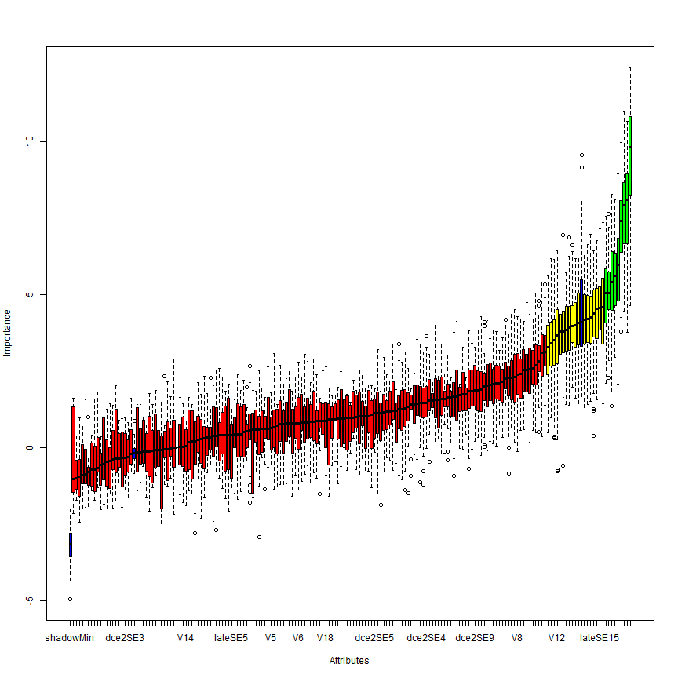
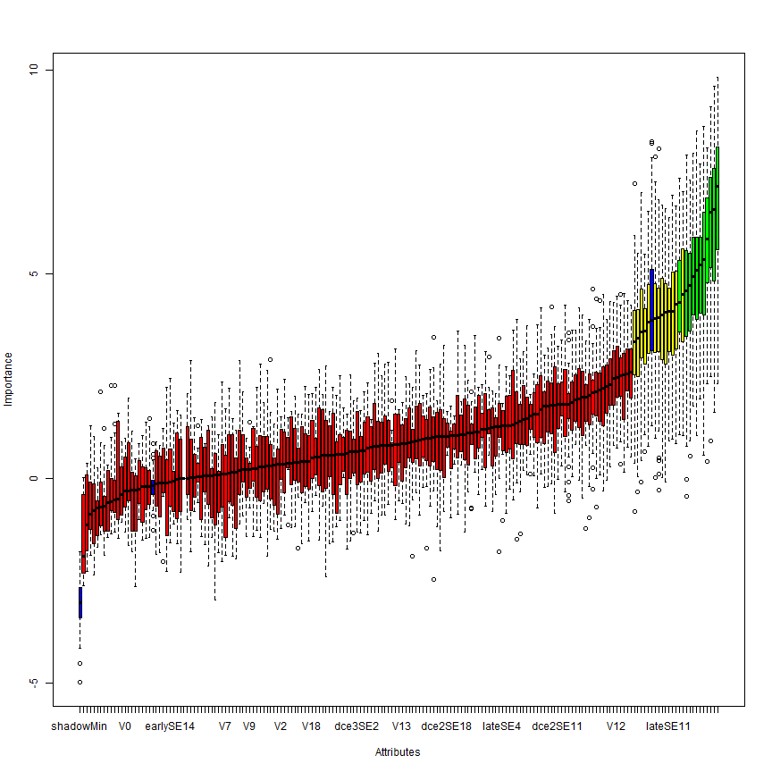

### code Read and partition data   

```r
setwd("Z:/Cristina/MassNonmass/Section1 - ExperimentsUpToDate/experimentsRadiologypaper-revision/Tree-based-RF/ensemble-Treebased-RF")
library("RSQLite")

rpart_inputdata <- function(subdata) {
    sqlite <- dbDriver("SQLite")
    conn <- dbConnect(sqlite, "stage1localData.db")
    
    # 2) all T1W features
    lesionsQuery <- dbGetQuery(conn, "SELECT *\n           FROM  stage1features\n           INNER JOIN lesion ON (stage1features.lesion_id = lesion.lesion_id)\n           INNER JOIN f_dynamic ON (stage1features.lesion_id = f_dynamic.lesion_id)\n           INNER JOIN f_morphology ON (stage1features.lesion_id = f_morphology.lesion_id)\n           INNER JOIN f_texture ON (stage1features.lesion_id = f_texture.lesion_id)")
    
    # prune entries and extract feature subsets corresponds to 5 entries
    # lesion info, 34 dynamic, 19 morpho, 34 texture fueatures
    lesionfields = names(lesionsQuery)
    lesioninfo = lesionsQuery[c(1, 2, 150, 151)]
    stage1features = lesionsQuery[c(3:103, 124:127)]
    dynfeatures = lesionsQuery[c(154:187)]
    morphofeatures = lesionsQuery[c(190:208)]
    texfeatures = lesionsQuery[c(211:234)]
    
    # combine all features
    allfeatures = cbind(lesioninfo[c(2, 3)], stage1features, dynfeatures, morphofeatures, 
        texfeatures)
    
    if (subdata == "mass") {
        # organized the data by subdata
        M <- subset(allfeatures, lesion_label == "massB" | lesion_label == "massM")
        M$lesion_label <- ifelse(M$lesion_label == "massB", "NC", "C")
        allfeatures = M
    }
    if (subdata == "nonmass") {
        # organized the data by subdata
        N <- subset(allfeatures, lesion_label == "nonmassB" | lesion_label == 
            "nonmassM")
        N$lesion_label <- ifelse(N$lesion_label == "nonmassB", "NC", "C")
        allfeatures = N
    }
    if (subdata == "stage1") {
        # organized the data by subdata
        M <- subset(allfeatures, lesion_label == "massB" | lesion_label == "massM")
        M$lesion_label <- ifelse(M$lesion_label == "massB", "mass", "mass")
        N <- subset(allfeatures, lesion_label == "nonmassB" | lesion_label == 
            "nonmassM")
        N$lesion_label <- ifelse(N$lesion_label == "nonmassB", "nonmass", "nonmass")
        allfeatures = data.frame(rbind(M, N))
    }
    if (subdata == "oneshot") {
        # organized the data by subdata
        M <- subset(allfeatures, lesion_label == "massB" | lesion_label == "massM")
        M$lesion_label <- ifelse(M$lesion_label == "massB", "NC", "C")
        N <- subset(allfeatures, lesion_label == "nonmassB" | lesion_label == 
            "nonmassM")
        N$lesion_label <- ifelse(N$lesion_label == "nonmassB", "NC", "C")
        allfeatures = data.frame(rbind(M, N))
    }
    # procees data
    allfeatures$lesion_label <- as.factor(allfeatures$lesion_label)
    allfeatures$peakCr_inside <- as.factor(allfeatures$peakCr_inside)
    allfeatures$peakVr_inside <- as.factor(allfeatures$peakVr_inside)
    allfeatures$peakCr_countor <- as.factor(allfeatures$peakCr_countor)
    allfeatures$peakVr_countor <- as.factor(allfeatures$peakVr_countor)
    allfeatures$k_Max_Margin_Grad <- as.factor(allfeatures$k_Max_Margin_Grad)
    allfeatures$max_RGH_mean_k <- as.factor(allfeatures$max_RGH_mean_k)
    allfeatures$max_RGH_var_k <- as.factor(allfeatures$max_RGH_var_k)
    
    output <- allfeatures
    return(output)
}
```


### code to create a cross-validation set up: 
### cvfoldk = number of cv folds typically 5 or 10
### out: particvfoldK = all cv-K ids

```r
library(MASS)
library(caret)
```

```
## Loading required package: cluster
## Loading required package: foreach
## Loading required package: lattice
## Loading required package: plyr
## Loading required package: reshape2
```

```r

cvfold_partition <- function(dat, cvfoldK){
  ndat = nrow(dat)
  outcomesetDi  <- dat$lesion_label
  #For multiple k-fold cross-validation, completely independent folds are created.
  #when y is a factor in an attempt to balance the class distributions within the splits.
  #The names of the list objects will denote the fold membership using the pattern 
  #"Foldi.Repj" meaning the ith section (of k) of the jth cross-validation set (of times).
  partitionsetDi <- createFolds(y = outcomesetDi, ## the outcome data are needed
                                k = cvfoldK, ## The percentage of data in the training set
                                list = TRUE) ## The format of the results. 
  return(partitionsetDi)
}
```


### code to sample kparti from a cross-validation set up: 
### kparti = k fold to exclude
### outs: cvTrainsetD, cvTestsetD

```r
kparti_sample <- function(dat, particvfoldK, cvfoldK, kparti) {
    allparti = 1:cvfoldK
    allbutkparti = allparti[-kparti]
    cvfoldadd = c()
    for (i in 1:length(allbutkparti)) {
        kadd = allbutkparti[i]
        cvfoldadd = c(cvfoldadd, particvfoldK[[kadd]])
    }
    # partition data
    cvTrainsetD <- dat[cvfoldadd, ]
    cvTestsetD <- dat[-cvfoldadd, ]
    
    output <- list(cvTrainsetD = cvTrainsetD, cvTestsetD = cvTestsetD)
    return(output)
}
```


### code Feature selection: 
### Boruta, cvfold, 

```r
library(Boruta)
```

```
## Loading required package: randomForest
## randomForest 4.6-7
## Type rfNews() to see new features/changes/bug fixes.
```

```r
require(data.table)
```

```
## Loading required package: data.table
```

```r
require(ggplot2)
```

```
## Loading required package: ggplot2
```

```r

# function to produce correlation coefficients on pair plots
panel.cor <- function(x, y, digits = 2, cex.cor, ...) {
    usr <- par("usr")
    on.exit(par(usr))
    par(usr = c(0, 1, 0, 1))
    # correlation coefficient
    r <- cor(x, y)
    txt <- format(c(r, 0.123456789), digits = digits)[1]
    txt <- paste("r= ", txt, sep = "")
    text(0.5, 0.6, txt)
    
    # p-value calculation
    p <- cor.test(x, y)$p.value
    txt2 <- format(c(p, 0.123456789), digits = digits)[1]
    txt2 <- paste("p= ", txt2, sep = "")
    if (p < 0.01) 
        txt2 <- paste("p= ", "<0.01", sep = "")
    text(0.5, 0.4, txt2)
}

subset_select <- function(setTrain) {
    featsel_boruta <- Boruta(lesion_label ~ ., data = setTrain[, 2:ncol(setTrain)], 
        doTrace = 2, ntree = 1000)
    print(featsel_boruta)
    plot(featsel_boruta)
    
    relevant <- featsel_boruta$finalDecision[featsel_boruta$finalDecision == 
        "Confirmed"]
    relevant_features = setTrain[c(names(relevant))]
    tentative <- featsel_boruta$finalDecision[featsel_boruta$finalDecision == 
        "Tentative"]
    tentative_features = setTrain[c(names(tentative))]
    sel_features = cbind(setTrain[c(1, 2)], relevant_features, tentative_features)
    
    super.sym <- trellis.par.get("superpose.symbol")
    ## pair plots for reatures
    setTrainrelevant = setTrain[c(names(relevant))]
    pairs(relevant_features, upper.panel = panel.cor, pch = super.sym$pch[1:2], 
        col = super.sym$col[1:2], text = list(levels(setTrainrelevant$lesion_label)), 
        main = "Relevant features")
    
    return(sel_features)
}
```


### code forest Train: 
### parameters, T= # of trees, D= tree depth, dat

```r
library(klaR)
library(rpart)
library(rpart.plot)
library(ada)

# bagged training was introduced as a way of reducing possible overfitting
# and improving the generalization capabilities of random forests.  The
# idea is to train each tree in a forest on a different training subset,
# sampled at random from the same labeled database.
rpart_adaforestTrain <- function(T, lrate, dat) {
    # set control
    adacontrol <- rpart.control(cp = -1, minsplit = 0, xval = 0, maxdepth = 1)
    
    # init forest
    forest = list()
    for (t in 1:T) {
        # cat('Tree # ', t, '\n')
        
        # build bagged trees from a bootstrap sample of trainSetD
        setD = dat[sample(1:nrow(dat), nrow(dat), replace = TRUE), ]
        
        # find subsample of var when training the ith tree we only make available
        # a small random subset
        subvar = sample(2:ncol(setD), sqrt(ncol(setD) - 1), replace = FALSE)
        subfeat = colnames(setD)[subvar]
        
        adaFit <- ada(lesion_label ~ ., data = setD[c("lesion_label", subfeat)], 
            iter = T, nu = lrate, type = "discrete", control = adacontrol)
        # print(adaFit) append
        forest <- append(forest, list(tree = adaFit))
    }
    
    output <- list(forest = forest)
    return(output)
}
```


### code forest Test: 
### parameters, T= # of trees, forest, TrainsetD, TestsetD

```r

library(pROC)
```

```
## Type 'citation("pROC")' for a citation.
## 
## Attaching package: 'pROC'
## 
## The following object(s) are masked from 'package:stats':
## 
##     cov, smooth, var
```

```r
library(ada)
rpart_adaforestTest <- function(T, TrainsetD, TestsetD, forest) {
    
    fclasspotrain = list()
    for (t in 1:T) {
        # Calcultate posterior Probabilities on grid points
        temp <- predict(forest[t]$tree, newdata = TrainsetD, type = "prob")  #
        fclasspotrain <- append(fclasspotrain, list(cpo = temp))
    }
    
    # run testing cases
    fclasspotest = list()
    for (t in 1:T) {
        # Calcultate posterior Probabilities on grid points
        temp <- predict(forest[t]$tree, newdata = TestsetD, type = "prob")  #
        fclasspotest <- append(fclasspotest, list(cpo = temp))
    }
    
    # performance on Train/Test set separately extract ensamble class
    # probabilities (when T > 1)
    trainpts = fclasspotrain[1]$cpo
    testpts = fclasspotest[1]$cpo
    # init ensample class posteriors
    enclasspotrain <- matrix(, nrow = nrow(as.data.frame(trainpts)), ncol = 2)
    enclasspotest <- matrix(, nrow = nrow(as.data.frame(testpts)), ncol = 2)
    enclasspotrain[, 1] = fclasspotrain[1]$cpo[, 1]
    enclasspotest[, 1] = fclasspotest[1]$cpo[, 1]
    enclasspotrain[, 2] = fclasspotrain[1]$cpo[, 2]
    enclasspotest[, 2] = fclasspotest[1]$cpo[, 2]
    if (T >= 2) {
        for (t in 2:T) {
            # train
            enclasspotrain[, 1] = enclasspotrain[, 1] + fclasspotrain[t]$cpo[, 
                1]
            enclasspotrain[, 2] = enclasspotrain[, 2] + fclasspotrain[t]$cpo[, 
                2]
            # test
            enclasspotest[, 1] = enclasspotest[, 1] + fclasspotest[t]$cpo[, 
                1]
            enclasspotest[, 2] = enclasspotest[, 2] + fclasspotest[t]$cpo[, 
                2]
        }
    }
    # majority voting averaging
    enclasspotrain = (1/T) * enclasspotrain
    enclasspotest = (1/T) * enclasspotest
    
    # on training
    classes = levels(TrainsetD$lesion_label)
    trainprob = data.frame(C1 = enclasspotrain[, 1], C2 = enclasspotrain[, 2], 
        pred = classes[apply(enclasspotrain, 1, which.max)], obs = TrainsetD$lesion_label)
    colnames(trainprob)[1:2] <- classes
    pred = as.factor(apply(enclasspotrain, 1, which.max))
    levels(pred) = levels(as.factor(unclass(TrainsetD$lesion_label)))
    perf_train = confusionMatrix(pred, as.factor(unclass(TrainsetD$lesion_label)))
    # print(perf_train)
    
    # on testing
    testprob = data.frame(C1 = enclasspotest[, 1], C2 = enclasspotest[, 2], 
        pred = classes[apply(enclasspotest, 1, which.max)], obs = TestsetD$lesion_label)
    colnames(testprob)[1:2] <- classes
    pred = as.factor(apply(enclasspotest, 1, which.max))
    levels(pred) = levels(as.factor(unclass(TestsetD$lesion_label)))
    pred = as.factor(apply(enclasspotest, 1, which.max))
    
    groundT = as.factor(unclass(TestsetD$lesion_label))
    levels(groundT) = levels(as.factor(unclass(TestsetD$lesion_label)))
    groundT = as.factor(unclass(TestsetD$lesion_label))
    
    perf_test = confusionMatrix(pred, groundT)
    # print(perf_test)
    
    output <- list(etrain = perf_train, etest = perf_test, trainprob = trainprob, 
        testprob = testprob)
    return(output)
}
```


### code for running and plotting perfm results: 
###statsAU

```r
# create_ensemble
create_ensemble <- function(dat, particvfoldK, cvK) {
    # inint
    ensemblegrdperf = list()
    maxM = list()
    for (r in 1:cvK) {
        ## pick one of cvfold for held-out test, train on the rest
        kparti_setdata = kparti_sample(dat, particvfoldK, cvK, r)
        
        # Boruta on $cvTrainsetD
        selfeatures_kfold = subset_select(kparti_setdata$cvTrainsetD)
        names(selfeatures_kfold)
        
        ################################################### create grid of
        ################################################### evaluation points
        gT = c(5, 10, 30, 60, 100, 250)
        glrate = c(1)
        grd <- expand.grid(x = glrate, y = gT)
        
        ################################################### for oneshot
        grdperf = data.frame(grd)
        grdperf$acuTrain = 0
        grdperf$rocTrain = 0
        grdperf$senTrain = 0
        grdperf$speTrain = 0
        
        grdperf$acuTest = 0
        grdperf$rocTest = 0
        grdperf$senTest = 0
        grdperf$speTest = 0
        
        M = list()
        for (k in 1:nrow(grd)) {
            lrate = grd[k, 1]
            T = grd[k, 2]
            # Build in l
            cat("lrate: ", lrate, "T: ", T, "\n")
            TrainsetD <- kparti_setdata$cvTrainsetD[c(names(selfeatures_kfold))]
            TestsetD <- kparti_setdata$cvTestsetD[c(names(selfeatures_kfold))]
            fit <- rpart_adaforestTrain(T, lrate, TrainsetD[c(2:ncol(TrainsetD))])
            # # predict
            perf <- rpart_adaforestTest(T, TrainsetD[c(2:ncol(TrainsetD))], 
                TestsetD[c(2:ncol(TestsetD))], fit$forest)
            # for train
            ROCF_train <- roc(perf$trainprob$obs, perf$trainprob$C, col = "#000086", 
                main = paste0("mass ROC T=", T, " lrate=", lrate, " cv=", r))
            print(ROCF_train$auc)
            # collect data
            grdperf$acuTrain[k] = grdperf$acuTrain[k] + as.numeric(perf$etrain$overall[1])
            grdperf$rocTrain[k] = grdperf$rocTrain[k] + as.numeric(ROCF_train$auc)
            grdperf$senTrain[k] = grdperf$senTrain[k] + as.numeric(perf$etrain$byClass[1])
            grdperf$speTrain[k] = grdperf$speTrain[k] + as.numeric(perf$etrain$byClass[2])
            # for test par(new=TRUE)
            ROCF_test <- roc(perf$testprob$obs, perf$testprob$C, col = "#860000", 
                main = paste0("ROC T=", T, " lrate=", lrate, " cv=", r))
            # legend('bottomright', legend = c('train', 'test'), col = c('#000086',
            # '#860000'),lwd = c(2,1))
            print(ROCF_test$auc)
            # collect data
            grdperf$acuTest[k] = grdperf$acuTest[k] + as.numeric(perf$etest$overall[1])
            grdperf$rocTest[k] = grdperf$rocTest[k] + as.numeric(ROCF_test$auc)
            grdperf$senTest[k] = grdperf$senTest[k] + as.numeric(perf$etest$byClass[1])
            grdperf$speTest[k] = grdperf$speTest[k] + as.numeric(perf$etest$byClass[2])
            
            # append perfm for ROC
            M = append(M, list(M = list(D = D, T = T, trainprob = perf$trainprob, 
                testprob = perf$testprob, forest = fit$forest)))
        }
        print(grdperf)
        index = which(grdperf$rocTest == max(grdperf$rocTest), arr.ind = TRUE)
        Dmax = grdperf$x[index]
        Tmax = grdperf$y[index]
        resamMax = M[index]$M$testprob
        # append
        maxM <- append(maxM, list(maxp = list(D = Dmax, T = Tmax, trainprob = M[index]$M$trainprob, 
            testprob = M[index]$M$testprob, forest = M[index]$M$forest)))
        ensemblegrdperf <- append(ensemblegrdperf, list(grdperf = grdperf))
    }
    
    output <- list(ensemblegrdperf = ensemblegrdperf, maxM = maxM)
    return(output)
}

surface_forestperfm <- function(grdperf) {
    library(gridExtra)
    library(base)
    library(lattice)
    
    
    graphlist <- list()
    count <- 1
    # design acuTrain
    z = grdperf$acuTrain
    gD = unique(grdperf$x)
    gT = unique(grdperf$y)
    dim(z) <- c(length(gD), length(gT))
    w1 <- wireframe(z, gD, gT, box = FALSE, xlab = "Depth of trees (D)", ylab = "Number of trees (T)", 
        main = "Influence of forest parameters on Accuracy Train", drape = TRUE, 
        colorkey = TRUE, light.source = c(10, 0, 10), col.regions = colorRampPalette(c("red", 
            "blue"))(100), screen = list(z = 30, x = -60))
    graphlist[[count]] <- w1
    count <- count + 1
    
    # design rocTrain
    z = grdperf$rocTrain
    dim(z) <- c(length(gD), length(gT))
    w2 <- wireframe(z, gD, gT, box = FALSE, xlab = "Depth of trees (D)", ylab = "Number of trees (T)", 
        main = "Influence of forest parameters on ROC Train", drape = TRUE, 
        colorkey = TRUE, light.source = c(10, 0, 10), col.regions = colorRampPalette(c("red", 
            "blue"))(100), screen = list(z = 30, x = -60))
    graphlist[[count]] <- w2
    count <- count + 1
    
    # design acuTest
    z = grdperf$acuTest
    dim(z) <- c(length(gD), length(gT))
    w3 <- wireframe(z, gD, gT, box = FALSE, xlab = "Depth of trees (D)", ylab = "Number of trees (T)", 
        main = "Influence of forest parameters on Accuracy Test", drape = TRUE, 
        colorkey = TRUE, light.source = c(10, 0, 10), col.regions = colorRampPalette(c("red", 
            "blue"))(100), screen = list(z = 30, x = -60))
    graphlist[[count]] <- w3
    count <- count + 1
    
    # design rocTest
    z = grdperf$rocTest
    dim(z) <- c(length(gD), length(gT))
    w4 <- wireframe(z, gD, gT, box = FALSE, xlab = "Depth of trees (D)", ylab = "Number of trees (T)", 
        main = "Influence of forest parameters on ROC Test", drape = TRUE, colorkey = TRUE, 
        light.source = c(10, 0, 10), col.regions = colorRampPalette(c("red", 
            "blue"))(100), screen = list(z = 30, x = -60))
    graphlist[[count]] <- w4
    count <- count + 1
    
    
    # finally plot in grid
    do.call("grid.arrange", c(graphlist, ncol = 2))
}
```


Run for mass lesions:
=====

```r
# read mass features
nonmassdat = rpart_inputdata(subdata = "nonmass")
## create CV
cvK = 10
# run for mass
particvfoldK = cvfold_partition(nonmassdat, cvK)
res = create_ensemble(nonmassdat, particvfoldK, cvK)
```

```
## Initial round 1: ..........
##  104  attributes rejected after this test:  V0 V1 V2 V3 V4 V5 V7 V8 V9 V10 V11 V12 V13 V14 V15 V16 V17 V18 V19 earlySE0 earlySE6 earlySE10 earlySE11 earlySE14 dce2SE0 dce2SE3 dce2SE7 dce2SE8 dce2SE10 dce2SE11 dce2SE18 dce3SE5 dce3SE7 dce3SE9 dce3SE10 dce3SE11 dce3SE14 dce3SE18 lateSE0 lateSE3 lateSE5 lateSE7 lateSE9 lateSE10 lateSE11 lateSE12 lateSE15 lateSE16 lateSE17 degreeC closenessC betweennessC no_triangles no_con_comp A_inside alpha_inside beta_inside iAUC1_inside Tpeak_inside Kpeak_inside SER_inside peakCr_inside washoutRate_inside maxVr_inside peakVr_inside Vr_decreasingRate_inside Vr_post_1_inside A_countor iAUC1_countor Tpeak_countor peakCr_countor UptakeRate_countor washoutRate_countor maxVr_countor peakVr_countor Vr_increasingRate_countor Vr_post_1_countor min_F_r_i var_F_r_i skew_F_r_i iiMin_change_Variance_uptake iiiMax_Margin_Gradient k_Max_Margin_Grad edge_sharp_mean max_RGH_mean max_RGH_mean_k max_RGH_var max_RGH_var_k texture_contrast_zero texture_contrast_quarterRad texture_contrast_halfRad texture_contrast_threeQuaRad texture_homogeneity_zero texture_homogeneity_quarterRad texture_homogeneity_halfRad texture_homogeneity_threeQuaRad texture_dissimilarity_zero texture_dissimilarity_quarterRad texture_dissimilarity_threeQuaRad texture_correlation_zero texture_correlation_quarterRad texture_energy_zero texture_energy_halfRad texture_energy_threeQuaRad 
## 
## Initial round 2: ..........
##  22  attributes rejected after this test:  V6 earlySE4 dce2SE1 dce2SE9 dce2SE14 dce3SE3 dce3SE15 dce3SE19 lateSE4 lateSE13 Vr_increasingRate_inside Kpeak_countor Vr_decreasingRate_countor kurt_F_r_i iMax_Variance_uptake irregularity texture_dissimilarity_halfRad texture_ASM_zero texture_ASM_quarterRad texture_ASM_halfRad texture_ASM_threeQuaRad texture_energy_quarterRad 
## 
## Initial round 3: ..........
##  11  attributes rejected after this test:  earlySE12 dce2SE2 dce2SE5 dce2SE17 dce3SE8 dce3SE12 lateSE1 lateSE19 UptakeRate_inside maxCr_countor texture_correlation_threeQuaRad 
## 
## Final round: ..........
##  3  attributes rejected after this test:  earlySE3 dce3SE2 lateSE14 
## ....
##  1  attributes confirmed after this test:  edge_sharp_std 
## 
##  4  attributes rejected after this test:  earlySE18 dce2SE15 lateSE18 circularity 
## ....
##  2  attributes rejected after this test:  lateSE8 beta_countor 
## ...
##  1  attributes confirmed after this test:  Slope_ini_countor 
## 
##  3  attributes rejected after this test:  earlySE7 dce2SE6 dce2SE13 
## ...
##  1  attributes rejected after this test:  ivVariance 
## ...
##  1  attributes confirmed after this test:  earlySE17 
## 
##  4  attributes rejected after this test:  earlySE9 earlySE13 dce2SE4 dce2SE12 
## ......
##  1  attributes confirmed after this test:  dce3SE13 
## ..
##  4  attributes confirmed after this test:  earlySE15 dce2SE16 SER_countor max_F_r_i 
## ..............
##  2  attributes confirmed after this test:  earlySE16 dce3SE4 
## ..
##  1  attributes rejected after this test:  lateSE6 
## .....
##  1  attributes confirmed after this test:  alpha_countor 
## ...............
##  1  attributes confirmed after this test:  Slope_ini_inside 
## .....
##  1  attributes rejected after this test:  dce3SE17 
## ........................
##  1  attributes confirmed after this test:  earlySE1 
## 
## Boruta performed 130 randomForest runs in 57.07 secs.
##         13 attributes confirmed important: earlySE1 earlySE15
## earlySE16 earlySE17 dce2SE16 dce3SE4 dce3SE13 Slope_ini_inside
## alpha_countor Slope_ini_countor SER_countor max_F_r_i
## edge_sharp_std
##         156 attributes confirmed unimportant: V0 V1 V2 V3 V4 V5 V6
## V7 V8 V9 V10 V11 V12 V13 V14 V15 V16 V17 V18 V19 earlySE0 earlySE3
## earlySE4 earlySE6 earlySE7 earlySE9 earlySE10 earlySE11 earlySE12
## earlySE13 earlySE14 earlySE18 dce2SE0 dce2SE1 dce2SE2 dce2SE3
## dce2SE4 dce2SE5 dce2SE6 dce2SE7 dce2SE8 dce2SE9 dce2SE10 dce2SE11
## dce2SE12 dce2SE13 dce2SE14 dce2SE15 dce2SE17 dce2SE18 dce3SE2
## dce3SE3 dce3SE5 dce3SE7 dce3SE8 dce3SE9 dce3SE10 dce3SE11 dce3SE12
## dce3SE14 dce3SE15 dce3SE17 dce3SE18 dce3SE19 lateSE0 lateSE1
## lateSE3 lateSE4 lateSE5 lateSE6 lateSE7 lateSE8 lateSE9 lateSE10
## lateSE11 lateSE12 lateSE13 lateSE14 lateSE15 lateSE16 lateSE17
## lateSE18 lateSE19 degreeC closenessC betweennessC no_triangles
## no_con_comp A_inside alpha_inside beta_inside iAUC1_inside
## Tpeak_inside Kpeak_inside SER_inside peakCr_inside
## UptakeRate_inside washoutRate_inside maxVr_inside peakVr_inside
## Vr_increasingRate_inside Vr_decreasingRate_inside Vr_post_1_inside
## A_countor beta_countor iAUC1_countor Tpeak_countor Kpeak_countor
## maxCr_countor peakCr_countor UptakeRate_countor
## washoutRate_countor maxVr_countor peakVr_countor
## Vr_increasingRate_countor Vr_decreasingRate_countor
## Vr_post_1_countor min_F_r_i var_F_r_i skew_F_r_i kurt_F_r_i
## iMax_Variance_uptake iiMin_change_Variance_uptake
## iiiMax_Margin_Gradient k_Max_Margin_Grad ivVariance circularity
## irregularity edge_sharp_mean max_RGH_mean max_RGH_mean_k
## max_RGH_var max_RGH_var_k texture_contrast_zero
## texture_contrast_quarterRad texture_contrast_halfRad
## texture_contrast_threeQuaRad texture_homogeneity_zero
## texture_homogeneity_quarterRad texture_homogeneity_halfRad
## texture_homogeneity_threeQuaRad texture_dissimilarity_zero
## texture_dissimilarity_quarterRad texture_dissimilarity_halfRad
## texture_dissimilarity_threeQuaRad texture_correlation_zero
## texture_correlation_quarterRad texture_correlation_threeQuaRad
## texture_ASM_zero texture_ASM_quarterRad texture_ASM_halfRad
## texture_ASM_threeQuaRad texture_energy_zero
## texture_energy_quarterRad texture_energy_halfRad
## texture_energy_threeQuaRad
##         13 tentative attributes left: earlySE2 earlySE5 earlySE8
## earlySE19 dce2SE19 dce3SE0 dce3SE1 dce3SE6 dce3SE16 lateSE2
## maxCr_inside mean_F_r_i texture_correlation_halfRad
```

  

```
## lrate:  1 T:  5 
## Area under the curve: 0.873
## Area under the curve: 0.444
## lrate:  1 T:  10 
## Area under the curve: 0.941
## Area under the curve: 0.5
## lrate:  1 T:  30 
## Area under the curve: 0.977
## Area under the curve: 0.444
## lrate:  1 T:  60 
## Area under the curve: 1
## Area under the curve: 0.389
## lrate:  1 T:  100 
## Area under the curve: 1
## Area under the curve: 0.444
## lrate:  1 T:  250 
## Area under the curve: 1
## Area under the curve: 0.444
##   x   y acuTrain rocTrain senTrain speTrain acuTest rocTest senTest
## 1 1   5   0.7949   0.8729     0.84   0.7143  0.6667  0.4444  0.8333
## 2 1  10   0.8718   0.9407     0.92   0.7857  0.5556  0.5000  0.6667
## 3 1  30   0.9231   0.9771     0.96   0.8571  0.7778  0.4444  1.0000
## 4 1  60   1.0000   1.0000     1.00   1.0000  0.7778  0.3889  1.0000
## 5 1 100   1.0000   1.0000     1.00   1.0000  0.7778  0.4444  1.0000
## 6 1 250   1.0000   1.0000     1.00   1.0000  0.7778  0.4444  1.0000
##   speTest
## 1  0.3333
## 2  0.3333
## 3  0.3333
## 4  0.3333
## 5  0.3333
## 6  0.3333
## Initial round 1: ..........
##  112  attributes rejected after this test:  V0 V2 V3 V4 V5 V6 V8 V9 V10 V11 V12 V13 V14 V16 V17 V18 V19 earlySE2 earlySE3 earlySE4 earlySE8 earlySE10 earlySE13 earlySE14 dce2SE2 dce2SE3 dce2SE5 dce2SE7 dce2SE8 dce2SE9 dce2SE10 dce2SE11 dce2SE14 dce2SE18 dce3SE3 dce3SE7 dce3SE9 dce3SE10 dce3SE11 dce3SE15 dce3SE18 lateSE4 lateSE5 lateSE7 lateSE10 lateSE11 lateSE15 lateSE18 degreeC closenessC betweennessC no_triangles no_con_comp A_inside iAUC1_inside Tpeak_inside Kpeak_inside SER_inside peakCr_inside washoutRate_inside maxVr_inside peakVr_inside Vr_increasingRate_inside Vr_decreasingRate_inside Vr_post_1_inside A_countor iAUC1_countor Tpeak_countor Kpeak_countor SER_countor peakCr_countor washoutRate_countor maxVr_countor peakVr_countor Vr_increasingRate_countor Vr_post_1_countor min_F_r_i var_F_r_i iMax_Variance_uptake iiMin_change_Variance_uptake iiiMax_Margin_Gradient k_Max_Margin_Grad ivVariance circularity irregularity edge_sharp_mean max_RGH_mean max_RGH_mean_k max_RGH_var texture_contrast_zero texture_contrast_quarterRad texture_contrast_halfRad texture_contrast_threeQuaRad texture_homogeneity_zero texture_homogeneity_quarterRad texture_homogeneity_halfRad texture_homogeneity_threeQuaRad texture_dissimilarity_zero texture_dissimilarity_quarterRad texture_dissimilarity_halfRad texture_dissimilarity_threeQuaRad texture_correlation_zero texture_correlation_halfRad texture_correlation_threeQuaRad texture_ASM_zero texture_ASM_quarterRad texture_ASM_halfRad texture_ASM_threeQuaRad texture_energy_zero texture_energy_quarterRad texture_energy_halfRad texture_energy_threeQuaRad 
## 
## Initial round 2: ..........
##  14  attributes rejected after this test:  V1 V7 V15 earlySE6 earlySE9 earlySE12 earlySE18 dce3SE5 lateSE3 alpha_inside UptakeRate_countor kurt_F_r_i max_RGH_var_k texture_correlation_quarterRad 
## 
## Initial round 3: ..........
##  5  attributes rejected after this test:  earlySE11 dce2SE4 dce2SE15 lateSE16 skew_F_r_i 
## 
## Final round: ..........
##  1  attributes confirmed after this test:  earlySE17 
## 
##  4  attributes rejected after this test:  dce2SE6 lateSE13 lateSE19 maxCr_countor 
## ....
##  6  attributes rejected after this test:  dce3SE14 lateSE0 lateSE14 Slope_ini_inside beta_countor Vr_decreasingRate_countor 
## ....
##  6  attributes rejected after this test:  earlySE0 dce2SE1 dce2SE17 dce2SE19 dce3SE19 lateSE17 
## ...
##  1  attributes confirmed after this test:  dce3SE13 
## ...
##  1  attributes confirmed after this test:  dce2SE16 
## ...
##  2  attributes rejected after this test:  lateSE2 lateSE6 
## ......
##  1  attributes rejected after this test:  mean_F_r_i 
## ..
##  4  attributes rejected after this test:  earlySE7 lateSE1 lateSE9 alpha_countor 
## ...
##  1  attributes confirmed after this test:  max_F_r_i 
## .....
##  1  attributes rejected after this test:  lateSE12 
## ........
##  1  attributes rejected after this test:  earlySE16 
## ...
##  1  attributes confirmed after this test:  dce3SE4 
## ..........
##  1  attributes confirmed after this test:  dce3SE6 
## ...................
##  1  attributes rejected after this test:  earlySE15 
## .................
##  1  attributes rejected after this test:  dce3SE2 
## 
## Boruta performed 130 randomForest runs in 53.38 secs.
##         6 attributes confirmed important: earlySE17 dce2SE16
## dce3SE4 dce3SE6 dce3SE13 max_F_r_i
##         158 attributes confirmed unimportant: V0 V1 V2 V3 V4 V5 V6
## V7 V8 V9 V10 V11 V12 V13 V14 V15 V16 V17 V18 V19 earlySE0 earlySE2
## earlySE3 earlySE4 earlySE6 earlySE7 earlySE8 earlySE9 earlySE10
## earlySE11 earlySE12 earlySE13 earlySE14 earlySE15 earlySE16
## earlySE18 dce2SE1 dce2SE2 dce2SE3 dce2SE4 dce2SE5 dce2SE6 dce2SE7
## dce2SE8 dce2SE9 dce2SE10 dce2SE11 dce2SE14 dce2SE15 dce2SE17
## dce2SE18 dce2SE19 dce3SE2 dce3SE3 dce3SE5 dce3SE7 dce3SE9 dce3SE10
## dce3SE11 dce3SE14 dce3SE15 dce3SE18 dce3SE19 lateSE0 lateSE1
## lateSE2 lateSE3 lateSE4 lateSE5 lateSE6 lateSE7 lateSE9 lateSE10
## lateSE11 lateSE12 lateSE13 lateSE14 lateSE15 lateSE16 lateSE17
## lateSE18 lateSE19 degreeC closenessC betweennessC no_triangles
## no_con_comp A_inside alpha_inside iAUC1_inside Slope_ini_inside
## Tpeak_inside Kpeak_inside SER_inside peakCr_inside
## washoutRate_inside maxVr_inside peakVr_inside
## Vr_increasingRate_inside Vr_decreasingRate_inside Vr_post_1_inside
## A_countor alpha_countor beta_countor iAUC1_countor Tpeak_countor
## Kpeak_countor SER_countor maxCr_countor peakCr_countor
## UptakeRate_countor washoutRate_countor maxVr_countor
## peakVr_countor Vr_increasingRate_countor Vr_decreasingRate_countor
## Vr_post_1_countor min_F_r_i mean_F_r_i var_F_r_i skew_F_r_i
## kurt_F_r_i iMax_Variance_uptake iiMin_change_Variance_uptake
## iiiMax_Margin_Gradient k_Max_Margin_Grad ivVariance circularity
## irregularity edge_sharp_mean max_RGH_mean max_RGH_mean_k
## max_RGH_var max_RGH_var_k texture_contrast_zero
## texture_contrast_quarterRad texture_contrast_halfRad
## texture_contrast_threeQuaRad texture_homogeneity_zero
## texture_homogeneity_quarterRad texture_homogeneity_halfRad
## texture_homogeneity_threeQuaRad texture_dissimilarity_zero
## texture_dissimilarity_quarterRad texture_dissimilarity_halfRad
## texture_dissimilarity_threeQuaRad texture_correlation_zero
## texture_correlation_quarterRad texture_correlation_halfRad
## texture_correlation_threeQuaRad texture_ASM_zero
## texture_ASM_quarterRad texture_ASM_halfRad texture_ASM_threeQuaRad
## texture_energy_zero texture_energy_quarterRad
## texture_energy_halfRad texture_energy_threeQuaRad
##         18 tentative attributes left: earlySE1 earlySE5 earlySE19
## dce2SE0 dce2SE12 dce2SE13 dce3SE0 dce3SE1 dce3SE8 dce3SE12
## dce3SE16 dce3SE17 lateSE8 beta_inside maxCr_inside
## UptakeRate_inside Slope_ini_countor edge_sharp_std
```

  

```
## lrate:  1 T:  5 
## Area under the curve: 0.916
## Area under the curve: 0.5
## lrate:  1 T:  10 
## Area under the curve: 0.906
## Area under the curve: 0.556
## lrate:  1 T:  30 
## Area under the curve: 0.97
## Area under the curve: 0.333
## lrate:  1 T:  60 
## Area under the curve: 0.994
## Area under the curve: 0.5
## lrate:  1 T:  100 
## Area under the curve: 0.999
## Area under the curve: 0.5
## lrate:  1 T:  250 
## Area under the curve: 1
## Area under the curve: 0.5
##   x   y acuTrain rocTrain senTrain speTrain acuTest rocTest senTest
## 1 1   5   0.7949   0.9164     0.88   0.6429  0.5556  0.5000  0.6667
## 2 1  10   0.8205   0.9064     0.90   0.6786  0.4444  0.5556  0.5000
## 3 1  30   0.9231   0.9700     0.98   0.8214  0.4444  0.3333  0.5000
## 4 1  60   0.9231   0.9943     0.98   0.8214  0.4444  0.5000  0.5000
## 5 1 100   0.9872   0.9993     1.00   0.9643  0.4444  0.5000  0.5000
## 6 1 250   1.0000   1.0000     1.00   1.0000  0.4444  0.5000  0.5000
##   speTest
## 1  0.3333
## 2  0.3333
## 3  0.3333
## 4  0.3333
## 5  0.3333
## 6  0.3333
## Initial round 1: ..........
##  100  attributes rejected after this test:  V0 V1 V2 V3 V4 V5 V6 V7 V8 V9 V10 V11 V12 V13 V14 V15 V16 V17 V18 V19 earlySE2 earlySE4 dce2SE2 dce2SE4 dce2SE11 dce2SE14 dce2SE17 dce2SE18 dce3SE2 dce3SE5 dce3SE9 dce3SE11 dce3SE18 lateSE0 lateSE1 lateSE2 lateSE5 lateSE7 lateSE10 lateSE11 lateSE13 lateSE14 lateSE15 lateSE18 lateSE19 degreeC closenessC betweennessC no_triangles no_con_comp alpha_inside Tpeak_inside Kpeak_inside peakCr_inside washoutRate_inside maxVr_inside peakVr_inside Vr_increasingRate_inside Vr_decreasingRate_inside Vr_post_1_inside A_countor beta_countor iAUC1_countor Kpeak_countor maxCr_countor peakCr_countor washoutRate_countor maxVr_countor peakVr_countor Vr_increasingRate_countor Vr_decreasingRate_countor min_F_r_i var_F_r_i iMax_Variance_uptake iiMin_change_Variance_uptake iiiMax_Margin_Gradient k_Max_Margin_Grad ivVariance circularity irregularity edge_sharp_mean max_RGH_mean max_RGH_mean_k max_RGH_var_k texture_contrast_zero texture_contrast_quarterRad texture_contrast_halfRad texture_contrast_threeQuaRad texture_homogeneity_zero texture_homogeneity_quarterRad texture_homogeneity_halfRad texture_dissimilarity_zero texture_dissimilarity_quarterRad texture_dissimilarity_halfRad texture_dissimilarity_threeQuaRad texture_correlation_zero texture_correlation_quarterRad texture_correlation_halfRad texture_correlation_threeQuaRad texture_ASM_quarterRad 
## 
## Initial round 2: ..........
##  28  attributes rejected after this test:  earlySE7 earlySE10 earlySE11 earlySE12 earlySE14 dce2SE0 dce2SE3 dce2SE5 dce2SE8 dce2SE10 dce2SE13 dce2SE15 dce3SE3 dce3SE7 dce3SE10 dce3SE12 dce3SE14 dce3SE15 lateSE4 lateSE16 beta_inside iAUC1_inside SER_inside UptakeRate_countor Vr_post_1_countor skew_F_r_i kurt_F_r_i texture_homogeneity_threeQuaRad 
## 
## Initial round 3: ..........
##  11  attributes rejected after this test:  earlySE3 earlySE18 dce2SE1 dce2SE7 dce2SE9 dce3SE1 lateSE3 lateSE17 A_inside Tpeak_countor mean_F_r_i 
## 
## Final round: ..........
##  12  attributes rejected after this test:  earlySE13 dce2SE12 dce3SE0 dce3SE8 dce3SE16 dce3SE17 dce3SE19 lateSE8 lateSE9 SER_countor max_RGH_var texture_energy_zero 
## ....
##  1  attributes confirmed after this test:  Slope_ini_countor 
## 
##  10  attributes rejected after this test:  earlySE0 earlySE6 earlySE9 dce2SE6 dce3SE13 lateSE12 alpha_countor texture_ASM_zero texture_ASM_halfRad texture_energy_threeQuaRad 
## ..........
##  1  attributes confirmed after this test:  edge_sharp_std 
## ......
##  1  attributes rejected after this test:  Slope_ini_inside 
## ...
##  1  attributes rejected after this test:  texture_energy_halfRad 
## ..........
##  1  attributes confirmed after this test:  earlySE17 
## ......
##  2  attributes confirmed after this test:  earlySE19 maxCr_inside 
## ..........
##  1  attributes confirmed after this test:  earlySE5 
## ............
##  1  attributes confirmed after this test:  max_F_r_i 
## ........
##  1  attributes confirmed after this test:  dce3SE4 
## ..
##  1  attributes confirmed after this test:  earlySE8 
## .....
##  1  attributes confirmed after this test:  dce2SE16 
## ..............
## Boruta performed 130 randomForest runs in 52.51 secs.
##         10 attributes confirmed important: earlySE5 earlySE8
## earlySE17 earlySE19 dce2SE16 dce3SE4 maxCr_inside
## Slope_ini_countor max_F_r_i edge_sharp_std
##         163 attributes confirmed unimportant: V0 V1 V2 V3 V4 V5 V6
## V7 V8 V9 V10 V11 V12 V13 V14 V15 V16 V17 V18 V19 earlySE0 earlySE2
## earlySE3 earlySE4 earlySE6 earlySE7 earlySE9 earlySE10 earlySE11
## earlySE12 earlySE13 earlySE14 earlySE18 dce2SE0 dce2SE1 dce2SE2
## dce2SE3 dce2SE4 dce2SE5 dce2SE6 dce2SE7 dce2SE8 dce2SE9 dce2SE10
## dce2SE11 dce2SE12 dce2SE13 dce2SE14 dce2SE15 dce2SE17 dce2SE18
## dce3SE0 dce3SE1 dce3SE2 dce3SE3 dce3SE5 dce3SE7 dce3SE8 dce3SE9
## dce3SE10 dce3SE11 dce3SE12 dce3SE13 dce3SE14 dce3SE15 dce3SE16
## dce3SE17 dce3SE18 dce3SE19 lateSE0 lateSE1 lateSE2 lateSE3 lateSE4
## lateSE5 lateSE7 lateSE8 lateSE9 lateSE10 lateSE11 lateSE12
## lateSE13 lateSE14 lateSE15 lateSE16 lateSE17 lateSE18 lateSE19
## degreeC closenessC betweennessC no_triangles no_con_comp A_inside
## alpha_inside beta_inside iAUC1_inside Slope_ini_inside
## Tpeak_inside Kpeak_inside SER_inside peakCr_inside
## washoutRate_inside maxVr_inside peakVr_inside
## Vr_increasingRate_inside Vr_decreasingRate_inside Vr_post_1_inside
## A_countor alpha_countor beta_countor iAUC1_countor Tpeak_countor
## Kpeak_countor SER_countor maxCr_countor peakCr_countor
## UptakeRate_countor washoutRate_countor maxVr_countor
## peakVr_countor Vr_increasingRate_countor Vr_decreasingRate_countor
## Vr_post_1_countor min_F_r_i mean_F_r_i var_F_r_i skew_F_r_i
## kurt_F_r_i iMax_Variance_uptake iiMin_change_Variance_uptake
## iiiMax_Margin_Gradient k_Max_Margin_Grad ivVariance circularity
## irregularity edge_sharp_mean max_RGH_mean max_RGH_mean_k
## max_RGH_var max_RGH_var_k texture_contrast_zero
## texture_contrast_quarterRad texture_contrast_halfRad
## texture_contrast_threeQuaRad texture_homogeneity_zero
## texture_homogeneity_quarterRad texture_homogeneity_halfRad
## texture_homogeneity_threeQuaRad texture_dissimilarity_zero
## texture_dissimilarity_quarterRad texture_dissimilarity_halfRad
## texture_dissimilarity_threeQuaRad texture_correlation_zero
## texture_correlation_quarterRad texture_correlation_halfRad
## texture_correlation_threeQuaRad texture_ASM_zero
## texture_ASM_quarterRad texture_ASM_halfRad texture_energy_zero
## texture_energy_halfRad texture_energy_threeQuaRad
##         9 tentative attributes left: earlySE1 earlySE15 earlySE16
## dce2SE19 dce3SE6 lateSE6 UptakeRate_inside texture_ASM_threeQuaRad
## texture_energy_quarterRad
```

  

```
## lrate:  1 T:  5 
## Area under the curve: 0.871
## Area under the curve: 0.75
## lrate:  1 T:  10 
## Area under the curve: 0.909
## Area under the curve: 0.667
## lrate:  1 T:  30 
## Area under the curve: 0.97
## Area under the curve: 0.708
## lrate:  1 T:  60 
## Area under the curve: 0.998
## Area under the curve: 0.833
## lrate:  1 T:  100 
## Area under the curve: 1
## Area under the curve: 0.708
## lrate:  1 T:  250 
## Area under the curve: 1
## Area under the curve: 0.75
##   x   y acuTrain rocTrain senTrain speTrain acuTest rocTest senTest
## 1 1   5   0.7792   0.8711     0.90   0.5556     0.6  0.7500  0.8333
## 2 1  10   0.8052   0.9089     0.88   0.6667     0.6  0.6667  0.8333
## 3 1  30   0.9221   0.9696     0.98   0.8148     0.6  0.7083  0.8333
## 4 1  60   0.9870   0.9978     1.00   0.9630     0.6  0.8333  0.8333
## 5 1 100   0.9870   1.0000     1.00   0.9630     0.6  0.7083  0.8333
## 6 1 250   1.0000   1.0000     1.00   1.0000     0.6  0.7500  0.8333
##   speTest
## 1    0.25
## 2    0.25
## 3    0.25
## 4    0.25
## 5    0.25
## 6    0.25
## Initial round 1: ..........
##  140  attributes rejected after this test:  V0 V1 V2 V3 V4 V5 V6 V7 V8 V9 V10 V11 V12 V13 V14 V15 V16 V17 V18 V19 earlySE0 earlySE3 earlySE6 earlySE9 earlySE10 earlySE11 earlySE12 earlySE13 earlySE18 dce2SE0 dce2SE1 dce2SE2 dce2SE3 dce2SE5 dce2SE6 dce2SE7 dce2SE8 dce2SE9 dce2SE10 dce2SE11 dce2SE12 dce2SE13 dce2SE14 dce2SE18 dce3SE1 dce3SE2 dce3SE3 dce3SE5 dce3SE7 dce3SE9 dce3SE10 dce3SE11 dce3SE12 dce3SE15 dce3SE18 dce3SE19 lateSE0 lateSE1 lateSE2 lateSE3 lateSE4 lateSE5 lateSE7 lateSE10 lateSE11 lateSE12 lateSE13 lateSE14 lateSE15 lateSE19 degreeC closenessC betweennessC no_triangles no_con_comp A_inside alpha_inside beta_inside iAUC1_inside Tpeak_inside Kpeak_inside peakCr_inside UptakeRate_inside washoutRate_inside maxVr_inside peakVr_inside Vr_increasingRate_inside Vr_decreasingRate_inside Vr_post_1_inside A_countor beta_countor iAUC1_countor Tpeak_countor Kpeak_countor SER_countor peakCr_countor UptakeRate_countor washoutRate_countor maxVr_countor peakVr_countor Vr_increasingRate_countor Vr_post_1_countor min_F_r_i kurt_F_r_i iMax_Variance_uptake iiMin_change_Variance_uptake iiiMax_Margin_Gradient k_Max_Margin_Grad ivVariance circularity irregularity edge_sharp_mean max_RGH_mean max_RGH_mean_k max_RGH_var max_RGH_var_k texture_contrast_zero texture_contrast_quarterRad texture_contrast_halfRad texture_contrast_threeQuaRad texture_homogeneity_zero texture_homogeneity_quarterRad texture_homogeneity_halfRad texture_homogeneity_threeQuaRad texture_dissimilarity_zero texture_dissimilarity_quarterRad texture_dissimilarity_halfRad texture_dissimilarity_threeQuaRad texture_correlation_zero texture_correlation_quarterRad texture_correlation_halfRad texture_correlation_threeQuaRad texture_ASM_zero texture_ASM_quarterRad texture_ASM_halfRad texture_ASM_threeQuaRad texture_energy_zero texture_energy_quarterRad texture_energy_halfRad texture_energy_threeQuaRad 
## 
## Initial round 2: ..........
##  3  attributes rejected after this test:  earlySE14 maxCr_countor skew_F_r_i 
## 
## Initial round 3: ..........
##  5  attributes rejected after this test:  earlySE4 earlySE7 dce2SE17 dce3SE8 Vr_decreasingRate_countor 
## 
## Final round: ..........
##  2  attributes confirmed after this test:  Slope_ini_countor edge_sharp_std 
## 
##  4  attributes rejected after this test:  lateSE8 lateSE9 lateSE18 SER_inside 
## ....
##  7  attributes rejected after this test:  earlySE2 dce2SE4 dce2SE15 dce2SE19 dce3SE17 lateSE6 lateSE16 
## ....
##  1  attributes confirmed after this test:  Slope_ini_inside 
## .........
##  1  attributes confirmed after this test:  earlySE17 
## ......
##  1  attributes confirmed after this test:  dce2SE16 
## ..
##  1  attributes confirmed after this test:  max_F_r_i 
## ......
##  2  attributes rejected after this test:  earlySE1 maxCr_inside 
## ..
##  1  attributes confirmed after this test:  earlySE15 
## ................
##  1  attributes rejected after this test:  lateSE17 
## .......
##  1  attributes confirmed after this test:  earlySE16 
## ........
##  1  attributes confirmed after this test:  mean_F_r_i 
## ............
##  2  attributes confirmed after this test:  dce3SE13 alpha_countor 
## .......
##  1  attributes confirmed after this test:  dce3SE16 
## .......
## Boruta performed 130 randomForest runs in 1.699 mins.
##         12 attributes confirmed important: earlySE15 earlySE16
## earlySE17 dce2SE16 dce3SE13 dce3SE16 Slope_ini_inside
## alpha_countor Slope_ini_countor max_F_r_i mean_F_r_i
## edge_sharp_std
##         162 attributes confirmed unimportant: V0 V1 V2 V3 V4 V5 V6
## V7 V8 V9 V10 V11 V12 V13 V14 V15 V16 V17 V18 V19 earlySE0 earlySE1
## earlySE2 earlySE3 earlySE4 earlySE6 earlySE7 earlySE9 earlySE10
## earlySE11 earlySE12 earlySE13 earlySE14 earlySE18 dce2SE0 dce2SE1
## dce2SE2 dce2SE3 dce2SE4 dce2SE5 dce2SE6 dce2SE7 dce2SE8 dce2SE9
## dce2SE10 dce2SE11 dce2SE12 dce2SE13 dce2SE14 dce2SE15 dce2SE17
## dce2SE18 dce2SE19 dce3SE1 dce3SE2 dce3SE3 dce3SE5 dce3SE7 dce3SE8
## dce3SE9 dce3SE10 dce3SE11 dce3SE12 dce3SE15 dce3SE17 dce3SE18
## dce3SE19 lateSE0 lateSE1 lateSE2 lateSE3 lateSE4 lateSE5 lateSE6
## lateSE7 lateSE8 lateSE9 lateSE10 lateSE11 lateSE12 lateSE13
## lateSE14 lateSE15 lateSE16 lateSE17 lateSE18 lateSE19 degreeC
## closenessC betweennessC no_triangles no_con_comp A_inside
## alpha_inside beta_inside iAUC1_inside Tpeak_inside Kpeak_inside
## SER_inside maxCr_inside peakCr_inside UptakeRate_inside
## washoutRate_inside maxVr_inside peakVr_inside
## Vr_increasingRate_inside Vr_decreasingRate_inside Vr_post_1_inside
## A_countor beta_countor iAUC1_countor Tpeak_countor Kpeak_countor
## SER_countor maxCr_countor peakCr_countor UptakeRate_countor
## washoutRate_countor maxVr_countor peakVr_countor
## Vr_increasingRate_countor Vr_decreasingRate_countor
## Vr_post_1_countor min_F_r_i skew_F_r_i kurt_F_r_i
## iMax_Variance_uptake iiMin_change_Variance_uptake
## iiiMax_Margin_Gradient k_Max_Margin_Grad ivVariance circularity
## irregularity edge_sharp_mean max_RGH_mean max_RGH_mean_k
## max_RGH_var max_RGH_var_k texture_contrast_zero
## texture_contrast_quarterRad texture_contrast_halfRad
## texture_contrast_threeQuaRad texture_homogeneity_zero
## texture_homogeneity_quarterRad texture_homogeneity_halfRad
## texture_homogeneity_threeQuaRad texture_dissimilarity_zero
## texture_dissimilarity_quarterRad texture_dissimilarity_halfRad
## texture_dissimilarity_threeQuaRad texture_correlation_zero
## texture_correlation_quarterRad texture_correlation_halfRad
## texture_correlation_threeQuaRad texture_ASM_zero
## texture_ASM_quarterRad texture_ASM_halfRad texture_ASM_threeQuaRad
## texture_energy_zero texture_energy_quarterRad
## texture_energy_halfRad texture_energy_threeQuaRad
##         8 tentative attributes left: earlySE5 earlySE8 earlySE19
## dce3SE0 dce3SE4 dce3SE6 dce3SE14 var_F_r_i
```

  

```
## lrate:  1 T:  5 
## Area under the curve: 0.854
## Area under the curve: 0.944
## lrate:  1 T:  10 
## Area under the curve: 0.911
## Area under the curve: 0.833
## lrate:  1 T:  30 
## Area under the curve: 0.977
## Area under the curve: 0.944
## lrate:  1 T:  60 
## Area under the curve: 1
## Area under the curve: 0.889
## lrate:  1 T:  100 
## Area under the curve: 1
## Area under the curve: 0.889
## lrate:  1 T:  250 
## Area under the curve: 1
## Area under the curve: 0.944
##   x   y acuTrain rocTrain senTrain speTrain acuTest rocTest senTest
## 1 1   5   0.7821   0.8543     0.86   0.6429  0.8889  0.9444  0.8333
## 2 1  10   0.8077   0.9114     0.94   0.5714  0.7778  0.8333  0.8333
## 3 1  30   0.9103   0.9771     0.98   0.7857  0.7778  0.9444  0.6667
## 4 1  60   0.9744   1.0000     1.00   0.9286  0.7778  0.8889  0.8333
## 5 1 100   1.0000   1.0000     1.00   1.0000  0.7778  0.8889  0.6667
## 6 1 250   1.0000   1.0000     1.00   1.0000  0.8889  0.9444  0.8333
##   speTest
## 1  1.0000
## 2  0.6667
## 3  1.0000
## 4  0.6667
## 5  1.0000
## 6  1.0000
## Initial round 1: ..........
##  116  attributes rejected after this test:  V0 V2 V3 V4 V5 V6 V8 V9 V10 V12 V13 V14 V15 V16 V17 V18 V19 earlySE3 earlySE4 earlySE5 earlySE6 earlySE11 earlySE12 earlySE13 earlySE14 earlySE19 dce2SE0 dce2SE3 dce2SE8 dce2SE9 dce2SE10 dce2SE11 dce2SE14 dce2SE18 dce3SE1 dce3SE3 dce3SE7 dce3SE8 dce3SE10 dce3SE11 dce3SE12 dce3SE14 dce3SE15 lateSE0 lateSE1 lateSE3 lateSE4 lateSE5 lateSE7 lateSE10 lateSE11 lateSE12 lateSE14 lateSE15 lateSE16 lateSE17 lateSE18 degreeC closenessC betweennessC no_triangles no_con_comp A_inside alpha_inside beta_inside iAUC1_inside Tpeak_inside Kpeak_inside SER_inside peakCr_inside washoutRate_inside peakVr_inside Vr_increasingRate_inside Vr_decreasingRate_inside Vr_post_1_inside beta_countor Tpeak_countor SER_countor peakCr_countor washoutRate_countor maxVr_countor peakVr_countor Vr_increasingRate_countor Vr_decreasingRate_countor Vr_post_1_countor min_F_r_i kurt_F_r_i iMax_Variance_uptake iiMin_change_Variance_uptake iiiMax_Margin_Gradient k_Max_Margin_Grad irregularity edge_sharp_mean max_RGH_mean_k max_RGH_var_k texture_contrast_zero texture_contrast_quarterRad texture_contrast_halfRad texture_homogeneity_zero texture_homogeneity_quarterRad texture_homogeneity_halfRad texture_homogeneity_threeQuaRad texture_dissimilarity_zero texture_dissimilarity_quarterRad texture_dissimilarity_threeQuaRad texture_correlation_zero texture_correlation_quarterRad texture_correlation_threeQuaRad texture_ASM_zero texture_ASM_quarterRad texture_ASM_halfRad texture_ASM_threeQuaRad texture_energy_zero texture_energy_quarterRad texture_energy_halfRad texture_energy_threeQuaRad 
## 
## Initial round 2: ..........
##  24  attributes rejected after this test:  earlySE0 earlySE8 earlySE10 dce2SE1 dce2SE6 dce2SE7 dce2SE15 dce2SE17 dce2SE19 dce3SE2 dce3SE5 dce3SE9 dce3SE18 dce3SE19 lateSE8 lateSE13 lateSE19 maxVr_inside maxCr_countor UptakeRate_countor ivVariance texture_contrast_threeQuaRad texture_dissimilarity_halfRad texture_correlation_halfRad 
## 
## Initial round 3: ..........
##  3  attributes rejected after this test:  dce2SE2 dce2SE12 dce3SE17 
## 
## Final round: ..........
##  3  attributes confirmed after this test:  dce3SE13 Slope_ini_countor edge_sharp_std 
## 
##  4  attributes rejected after this test:  V1 V7 iAUC1_countor circularity 
## ....
##  2  attributes confirmed after this test:  earlySE17 dce3SE6 
## 
##  2  attributes rejected after this test:  dce2SE4 lateSE9 
## ....
##  3  attributes rejected after this test:  earlySE7 earlySE15 earlySE18 
## ......
##  2  attributes rejected after this test:  lateSE2 skew_F_r_i 
## .........
##  1  attributes rejected after this test:  dce3SE16 
## ..
##  1  attributes confirmed after this test:  UptakeRate_inside 
## ...
##  1  attributes confirmed after this test:  Slope_ini_inside 
## ...
##  2  attributes rejected after this test:  max_RGH_mean max_RGH_var 
## ..
##  1  attributes confirmed after this test:  max_F_r_i 
## 
##  1  attributes rejected after this test:  dce3SE0 
## ...
##  1  attributes rejected after this test:  earlySE9 
## ...
##  1  attributes confirmed after this test:  alpha_countor 
## ..
##  2  attributes confirmed after this test:  dce2SE16 dce3SE4 
## ...
##  1  attributes confirmed after this test:  V11 
## ..........
##  1  attributes rejected after this test:  Kpeak_countor 
## .................
##  1  attributes rejected after this test:  dce2SE5 
## ..........
##  1  attributes rejected after this test:  earlySE2 
## ....
##  1  attributes confirmed after this test:  maxCr_inside 
## .....
## Boruta performed 130 randomForest runs in 35.78 secs.
##         13 attributes confirmed important: V11 earlySE17 dce2SE16
## dce3SE4 dce3SE6 dce3SE13 Slope_ini_inside maxCr_inside
## UptakeRate_inside alpha_countor Slope_ini_countor max_F_r_i
## edge_sharp_std
##         162 attributes confirmed unimportant: V0 V1 V2 V3 V4 V5 V6
## V7 V8 V9 V10 V12 V13 V14 V15 V16 V17 V18 V19 earlySE0 earlySE2
## earlySE3 earlySE4 earlySE5 earlySE6 earlySE7 earlySE8 earlySE9
## earlySE10 earlySE11 earlySE12 earlySE13 earlySE14 earlySE15
## earlySE18 earlySE19 dce2SE0 dce2SE1 dce2SE2 dce2SE3 dce2SE4
## dce2SE5 dce2SE6 dce2SE7 dce2SE8 dce2SE9 dce2SE10 dce2SE11 dce2SE12
## dce2SE14 dce2SE15 dce2SE17 dce2SE18 dce2SE19 dce3SE0 dce3SE1
## dce3SE2 dce3SE3 dce3SE5 dce3SE7 dce3SE8 dce3SE9 dce3SE10 dce3SE11
## dce3SE12 dce3SE14 dce3SE15 dce3SE16 dce3SE17 dce3SE18 dce3SE19
## lateSE0 lateSE1 lateSE2 lateSE3 lateSE4 lateSE5 lateSE7 lateSE8
## lateSE9 lateSE10 lateSE11 lateSE12 lateSE13 lateSE14 lateSE15
## lateSE16 lateSE17 lateSE18 lateSE19 degreeC closenessC
## betweennessC no_triangles no_con_comp A_inside alpha_inside
## beta_inside iAUC1_inside Tpeak_inside Kpeak_inside SER_inside
## peakCr_inside washoutRate_inside maxVr_inside peakVr_inside
## Vr_increasingRate_inside Vr_decreasingRate_inside Vr_post_1_inside
## beta_countor iAUC1_countor Tpeak_countor Kpeak_countor SER_countor
## maxCr_countor peakCr_countor UptakeRate_countor
## washoutRate_countor maxVr_countor peakVr_countor
## Vr_increasingRate_countor Vr_decreasingRate_countor
## Vr_post_1_countor min_F_r_i skew_F_r_i kurt_F_r_i
## iMax_Variance_uptake iiMin_change_Variance_uptake
## iiiMax_Margin_Gradient k_Max_Margin_Grad ivVariance circularity
## irregularity edge_sharp_mean max_RGH_mean max_RGH_mean_k
## max_RGH_var max_RGH_var_k texture_contrast_zero
## texture_contrast_quarterRad texture_contrast_halfRad
## texture_contrast_threeQuaRad texture_homogeneity_zero
## texture_homogeneity_quarterRad texture_homogeneity_halfRad
## texture_homogeneity_threeQuaRad texture_dissimilarity_zero
## texture_dissimilarity_quarterRad texture_dissimilarity_halfRad
## texture_dissimilarity_threeQuaRad texture_correlation_zero
## texture_correlation_quarterRad texture_correlation_halfRad
## texture_correlation_threeQuaRad texture_ASM_zero
## texture_ASM_quarterRad texture_ASM_halfRad texture_ASM_threeQuaRad
## texture_energy_zero texture_energy_quarterRad
## texture_energy_halfRad texture_energy_threeQuaRad
##         7 tentative attributes left: earlySE1 earlySE16 dce2SE13
## lateSE6 A_countor mean_F_r_i var_F_r_i
```

  

```
## lrate:  1 T:  5 
## Area under the curve: 0.922
## Area under the curve: 0.867
## lrate:  1 T:  10 
## Area under the curve: 0.927
## Area under the curve: 0.867
## lrate:  1 T:  30 
## Area under the curve: 0.985
## Area under the curve: 0.933
## lrate:  1 T:  60 
## Area under the curve: 1
## Area under the curve: 0.733
## lrate:  1 T:  100 
## Area under the curve: 1
## Area under the curve: 0.733
## lrate:  1 T:  250 
## Area under the curve: 1
## Area under the curve: 0.867
##   x   y acuTrain rocTrain senTrain speTrain acuTest rocTest senTest
## 1 1   5   0.8101   0.9216   0.9608   0.5357   0.875  0.8667     1.0
## 2 1  10   0.9114   0.9272   1.0000   0.7500   0.750  0.8667     0.8
## 3 1  30   0.9494   0.9853   1.0000   0.8571   0.750  0.9333     0.8
## 4 1  60   0.9494   1.0000   1.0000   0.8571   0.750  0.7333     0.8
## 5 1 100   0.9873   1.0000   1.0000   0.9643   0.750  0.7333     0.8
## 6 1 250   1.0000   1.0000   1.0000   1.0000   0.750  0.8667     0.8
##   speTest
## 1  0.6667
## 2  0.6667
## 3  0.6667
## 4  0.6667
## 5  0.6667
## 6  0.6667
## Initial round 1: ..........
##  121  attributes rejected after this test:  V0 V1 V2 V3 V4 V5 V6 V7 V8 V9 V10 V11 V12 V13 V14 V15 V16 V17 V18 V19 earlySE0 earlySE2 earlySE4 earlySE10 earlySE11 earlySE13 earlySE14 dce2SE1 dce2SE2 dce2SE3 dce2SE5 dce2SE7 dce2SE8 dce2SE9 dce2SE10 dce2SE11 dce2SE14 dce2SE17 dce2SE18 dce3SE2 dce3SE3 dce3SE7 dce3SE10 dce3SE11 dce3SE15 dce3SE19 lateSE0 lateSE4 lateSE5 lateSE7 lateSE9 lateSE10 lateSE11 lateSE14 lateSE15 lateSE17 lateSE19 degreeC closenessC betweennessC no_triangles no_con_comp A_inside beta_inside iAUC1_inside Tpeak_inside Kpeak_inside peakCr_inside washoutRate_inside maxVr_inside peakVr_inside Vr_increasingRate_inside Vr_decreasingRate_inside iAUC1_countor Tpeak_countor Kpeak_countor peakCr_countor UptakeRate_countor washoutRate_countor maxVr_countor peakVr_countor Vr_increasingRate_countor Vr_decreasingRate_countor Vr_post_1_countor min_F_r_i skew_F_r_i kurt_F_r_i iMax_Variance_uptake iiMin_change_Variance_uptake iiiMax_Margin_Gradient k_Max_Margin_Grad ivVariance circularity irregularity edge_sharp_mean max_RGH_mean max_RGH_mean_k max_RGH_var max_RGH_var_k texture_contrast_zero texture_contrast_quarterRad texture_contrast_halfRad texture_homogeneity_zero texture_homogeneity_quarterRad texture_homogeneity_halfRad texture_homogeneity_threeQuaRad texture_dissimilarity_zero texture_dissimilarity_quarterRad texture_dissimilarity_threeQuaRad texture_correlation_zero texture_correlation_quarterRad texture_correlation_halfRad texture_correlation_threeQuaRad texture_ASM_zero texture_ASM_quarterRad texture_ASM_halfRad texture_ASM_threeQuaRad texture_energy_zero texture_energy_quarterRad texture_energy_halfRad texture_energy_threeQuaRad 
## 
## Initial round 2: ..........
##  14  attributes rejected after this test:  earlySE12 dce3SE5 dce3SE18 lateSE3 lateSE13 lateSE16 lateSE18 alpha_inside SER_inside Vr_post_1_inside beta_countor var_F_r_i texture_contrast_threeQuaRad texture_dissimilarity_halfRad 
## 
## Initial round 3: ..........
##  3  attributes rejected after this test:  dce2SE12 dce3SE17 maxCr_countor 
## 
## Final round: ..........
##  23  attributes rejected after this test:  earlySE3 earlySE6 earlySE15 earlySE16 earlySE18 dce2SE0 dce2SE4 dce2SE6 dce2SE13 dce2SE15 dce3SE0 dce3SE1 dce3SE8 dce3SE9 dce3SE14 dce3SE16 lateSE1 lateSE2 lateSE8 lateSE12 maxCr_inside UptakeRate_inside A_countor 
## ........
##  1  attributes confirmed after this test:  Slope_ini_countor 
## ............
##  1  attributes rejected after this test:  dce3SE12 
## .....
##  1  attributes confirmed after this test:  edge_sharp_std 
## ................
##  1  attributes confirmed after this test:  max_F_r_i 
## .............
##  1  attributes confirmed after this test:  dce3SE4 
## .......
##  1  attributes rejected after this test:  dce2SE19 
## ....................
##  1  attributes confirmed after this test:  alpha_countor 
## .........
##  1  attributes confirmed after this test:  earlySE17 
## 
## Boruta performed 130 randomForest runs in 46.97 secs.
##         6 attributes confirmed important: earlySE17 dce3SE4
## alpha_countor Slope_ini_countor max_F_r_i edge_sharp_std
##         163 attributes confirmed unimportant: V0 V1 V2 V3 V4 V5 V6
## V7 V8 V9 V10 V11 V12 V13 V14 V15 V16 V17 V18 V19 earlySE0 earlySE2
## earlySE3 earlySE4 earlySE6 earlySE10 earlySE11 earlySE12 earlySE13
## earlySE14 earlySE15 earlySE16 earlySE18 dce2SE0 dce2SE1 dce2SE2
## dce2SE3 dce2SE4 dce2SE5 dce2SE6 dce2SE7 dce2SE8 dce2SE9 dce2SE10
## dce2SE11 dce2SE12 dce2SE13 dce2SE14 dce2SE15 dce2SE17 dce2SE18
## dce2SE19 dce3SE0 dce3SE1 dce3SE2 dce3SE3 dce3SE5 dce3SE7 dce3SE8
## dce3SE9 dce3SE10 dce3SE11 dce3SE12 dce3SE14 dce3SE15 dce3SE16
## dce3SE17 dce3SE18 dce3SE19 lateSE0 lateSE1 lateSE2 lateSE3 lateSE4
## lateSE5 lateSE7 lateSE8 lateSE9 lateSE10 lateSE11 lateSE12
## lateSE13 lateSE14 lateSE15 lateSE16 lateSE17 lateSE18 lateSE19
## degreeC closenessC betweennessC no_triangles no_con_comp A_inside
## alpha_inside beta_inside iAUC1_inside Tpeak_inside Kpeak_inside
## SER_inside maxCr_inside peakCr_inside UptakeRate_inside
## washoutRate_inside maxVr_inside peakVr_inside
## Vr_increasingRate_inside Vr_decreasingRate_inside Vr_post_1_inside
## A_countor beta_countor iAUC1_countor Tpeak_countor Kpeak_countor
## maxCr_countor peakCr_countor UptakeRate_countor
## washoutRate_countor maxVr_countor peakVr_countor
## Vr_increasingRate_countor Vr_decreasingRate_countor
## Vr_post_1_countor min_F_r_i var_F_r_i skew_F_r_i kurt_F_r_i
## iMax_Variance_uptake iiMin_change_Variance_uptake
## iiiMax_Margin_Gradient k_Max_Margin_Grad ivVariance circularity
## irregularity edge_sharp_mean max_RGH_mean max_RGH_mean_k
## max_RGH_var max_RGH_var_k texture_contrast_zero
## texture_contrast_quarterRad texture_contrast_halfRad
## texture_contrast_threeQuaRad texture_homogeneity_zero
## texture_homogeneity_quarterRad texture_homogeneity_halfRad
## texture_homogeneity_threeQuaRad texture_dissimilarity_zero
## texture_dissimilarity_quarterRad texture_dissimilarity_halfRad
## texture_dissimilarity_threeQuaRad texture_correlation_zero
## texture_correlation_quarterRad texture_correlation_halfRad
## texture_correlation_threeQuaRad texture_ASM_zero
## texture_ASM_quarterRad texture_ASM_halfRad texture_ASM_threeQuaRad
## texture_energy_zero texture_energy_quarterRad
## texture_energy_halfRad texture_energy_threeQuaRad
##         13 tentative attributes left: earlySE1 earlySE5 earlySE7
## earlySE8 earlySE9 earlySE19 dce2SE16 dce3SE6 dce3SE13 lateSE6
## Slope_ini_inside SER_countor mean_F_r_i
```

 

```
## lrate:  1 T:  5
```

```
## Error: the data and reference factors must have the same number of levels
```

 

```r
accum_nonmassgrdperf = res$ensemblegrdperf[1]$grdperf
```

```
## Error: object 'res' not found
```

```r
for (k in 2:cvK) {
    accum_nonmassgrdperf = accum_nonmassgrdperf + res$ensemblegrdperf[k]$grdperf
}
```

```
## Error: object 'accum_nonmassgrdperf' not found
```

```r
cvKnonmassgrdperf = accum_nonmassgrdperf/cvK
```

```
## Error: object 'accum_nonmassgrdperf' not found
```

```r
print(cvKnonmassgrdperf)
```

```
## Error: object 'cvKnonmassgrdperf' not found
```

```r

# plot
surface_forestperfm(cvKmassgrdperf)
```

```
## Error: object 'cvKmassgrdperf' not found
```

```r

# plot ROC of resamples at max perf across cvFolds
resamROC_train = data.frame()
resamROC_test = data.frame()
for (k in 1:cvK) {
    resamROC_train = rbind(resamROC_train, res$maxM[k]$maxp$trainprob)
    resamROC_test = rbind(resamROC_test, res$maxM[k]$maxp$testprob)
}
```

```
## Error: object 'res' not found
```

```r
# for resamROC
ROCF_train <- plot.roc(resamROC_train$obs, resamROC_train$C, col = "#000086", 
    lty = 1)
```

```
## Error: No valid data provided.
```

```r
par(new = TRUE)
ROCF_test <- plot.roc(resamROC_test$obs, resamROC_test$C, col = "#860000", lty = 2, 
    main = "boosting ROC for nonmass max cvFolds")
```

```
## Error: No valid data provided.
```

```r
print(ROCF_train$auc)
```

```
## Error: object 'ROCF_train' not found
```

```r
print(ROCF_test$auc)
```

```
## Error: object 'ROCF_test' not found
```

```r
legend("bottomright", legend = c(paste0("train: AUC=", formatC(ROCF_train$auc, 
    digits = 2, format = "f")), paste0("cv.test: AUC=", formatC(ROCF_test$auc, 
    digits = 2, format = "f"))), col = c("#000086", "#860000"), lwd = 2, lty = c(1, 
    2))
```

```
## Error: object 'ROCF_train' not found
```

```r

# save
save.image("Z:/Cristina/MassNonmass/Section1 - ExperimentsUpToDate/experimentsRadiologypaper-revision/Tree-based-RF/ensemble-Treebased-RF/results/cvKnonmassgrdperfboosting.RData")
```


