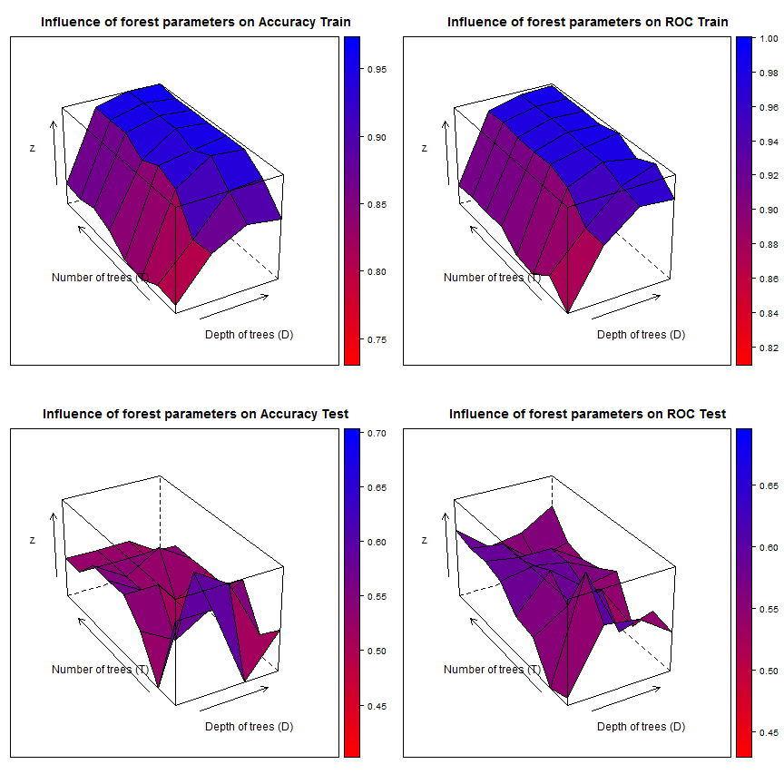

### code Read and partition data   

```r
setwd("Z:/Cristina/MassNonmass/Section1 - ExperimentsUpToDate/experimentsRadiologypaper-revision/Tree-based-RF/ensemble-Treebased-RF")
library("RSQLite")

rpart_inputdata <- function(subdata) {
    sqlite <- dbDriver("SQLite")
    conn <- dbConnect(sqlite, "stage1localData.db")
    
    # 2) all T1W features
    lesionsQuery <- dbGetQuery(conn, "SELECT *\n           FROM  stage1features\n           INNER JOIN lesion ON (stage1features.lesion_id = lesion.lesion_id)\n           INNER JOIN f_dynamic ON (stage1features.lesion_id = f_dynamic.lesion_id)\n           INNER JOIN f_morphology ON (stage1features.lesion_id = f_morphology.lesion_id)\n           INNER JOIN f_texture ON (stage1features.lesion_id = f_texture.lesion_id)")
    
    # prune entries and extract feature subsets corresponds to 5 entries
    # lesion info, 34 dynamic, 19 morpho, 34 texture fueatures
    lesionfields = names(lesionsQuery)
    lesioninfo = lesionsQuery[c(1, 2, 150, 151)]
    stage1features = lesionsQuery[c(3:103, 124:127)]
    dynfeatures = lesionsQuery[c(154:187)]
    morphofeatures = lesionsQuery[c(190:208)]
    texfeatures = lesionsQuery[c(211:234)]
    
    # combine all features
    allfeatures = cbind(lesioninfo[c(2, 3)], stage1features, dynfeatures, morphofeatures, 
        texfeatures)
    
    if (subdata == "mass") {
        # organized the data by subdata
        M <- subset(allfeatures, lesion_label == "massB" | lesion_label == "massM")
        M$lesion_label <- ifelse(M$lesion_label == "massB", "NC", "C")
        allfeatures = M
    }
    if (subdata == "nonmass") {
        # organized the data by subdata
        N <- subset(allfeatures, lesion_label == "nonmassB" | lesion_label == 
            "nonmassM")
        N$lesion_label <- ifelse(N$lesion_label == "nonmassB", "NC", "C")
        allfeatures = N
    }
    if (subdata == "stage1") {
        # organized the data by subdata
        M <- subset(allfeatures, lesion_label == "massB" | lesion_label == "massM")
        M$lesion_label <- ifelse(M$lesion_label == "massB", "mass", "mass")
        N <- subset(allfeatures, lesion_label == "nonmassB" | lesion_label == 
            "nonmassM")
        N$lesion_label <- ifelse(N$lesion_label == "nonmassB", "nonmass", "nonmass")
        allfeatures = data.frame(rbind(M, N))
    }
    if (subdata == "oneshot") {
        # organized the data by subdata
        M <- subset(allfeatures, lesion_label == "massB" | lesion_label == "massM")
        M$lesion_label <- ifelse(M$lesion_label == "massB", "NC", "C")
        N <- subset(allfeatures, lesion_label == "nonmassB" | lesion_label == 
            "nonmassM")
        N$lesion_label <- ifelse(N$lesion_label == "nonmassB", "NC", "C")
        allfeatures = data.frame(rbind(M, N))
    }
    # procees data
    allfeatures$lesion_label <- as.factor(allfeatures$lesion_label)
    allfeatures$peakCr_inside <- as.factor(allfeatures$peakCr_inside)
    allfeatures$peakVr_inside <- as.factor(allfeatures$peakVr_inside)
    allfeatures$peakCr_countor <- as.factor(allfeatures$peakCr_countor)
    allfeatures$peakVr_countor <- as.factor(allfeatures$peakVr_countor)
    allfeatures$k_Max_Margin_Grad <- as.factor(allfeatures$k_Max_Margin_Grad)
    allfeatures$max_RGH_mean_k <- as.factor(allfeatures$max_RGH_mean_k)
    allfeatures$max_RGH_var_k <- as.factor(allfeatures$max_RGH_var_k)
    
    output <- allfeatures
    return(output)
}
```


### code to create a cross-validation set up: 
### cvfoldk = number of cv folds typically 5 or 10
### out: particvfoldK = all cv-K ids

```r
library(MASS)
library(caret)
```

```
## Loading required package: cluster
## Loading required package: foreach
## Loading required package: lattice
## Loading required package: plyr
## Loading required package: reshape2
```

```r

cvfold_partition <- function(dat, cvfoldK){
  ndat = nrow(dat)
  outcomesetDi  <- dat$lesion_label
  #For multiple k-fold cross-validation, completely independent folds are created.
  #when y is a factor in an attempt to balance the class distributions within the splits.
  #The names of the list objects will denote the fold membership using the pattern 
  #"Foldi.Repj" meaning the ith section (of k) of the jth cross-validation set (of times).
  partitionsetDi <- createFolds(y = outcomesetDi, ## the outcome data are needed
                                k = cvfoldK, ## The percentage of data in the training set
                                list = TRUE) ## The format of the results. 
  return(partitionsetDi)
}
```


### code to sample kparti from a cross-validation set up: 
### kparti = k fold to exclude
### outs: cvTrainsetD, cvTestsetD

```r
kparti_sample <- function(dat, particvfoldK, cvfoldK, kparti) {
    allparti = 1:cvfoldK
    allbutkparti = allparti[-kparti]
    cvfoldadd = c()
    for (i in 1:length(allbutkparti)) {
        kadd = allbutkparti[i]
        cvfoldadd = c(cvfoldadd, particvfoldK[[kadd]])
    }
    # partition data
    cvTrainsetD <- dat[cvfoldadd, ]
    cvTestsetD <- dat[-cvfoldadd, ]
    
    output <- list(cvTrainsetD = cvTrainsetD, cvTestsetD = cvTestsetD)
    return(output)
}
```


### code Feature selection: 
### Boruta, cvfold, 

```r
library(Boruta)
```

```
## Loading required package: randomForest
## randomForest 4.6-7
## Type rfNews() to see new features/changes/bug fixes.
```

```r
require(data.table)
```

```
## Loading required package: data.table
```

```r
require(ggplot2)
```

```
## Loading required package: ggplot2
```

```r

# function to produce correlation coefficients on pair plots
panel.cor <- function(x, y, digits = 2, cex.cor, ...) {
    usr <- par("usr")
    on.exit(par(usr))
    par(usr = c(0, 1, 0, 1))
    # correlation coefficient
    r <- cor(x, y)
    txt <- format(c(r, 0.123456789), digits = digits)[1]
    txt <- paste("r= ", txt, sep = "")
    text(0.5, 0.6, txt)
    
    # p-value calculation
    p <- cor.test(x, y)$p.value
    txt2 <- format(c(p, 0.123456789), digits = digits)[1]
    txt2 <- paste("p= ", txt2, sep = "")
    if (p < 0.01) 
        txt2 <- paste("p= ", "<0.01", sep = "")
    text(0.5, 0.4, txt2)
}

subset_select <- function(setTrain) {
    featsel_boruta <- Boruta(lesion_label ~ ., data = setTrain[, 2:ncol(setTrain)], 
        doTrace = 2, ntree = 1000)
    print(featsel_boruta)
    plot(featsel_boruta)
    
    relevant <- featsel_boruta$finalDecision[featsel_boruta$finalDecision == 
        "Confirmed"]
    relevant_features = setTrain[c(names(relevant))]
    tentative <- featsel_boruta$finalDecision[featsel_boruta$finalDecision == 
        "Tentative"]
    tentative_features = setTrain[c(names(tentative))]
    sel_features = cbind(setTrain[c(1, 2)], relevant_features, tentative_features)
    
    super.sym <- trellis.par.get("superpose.symbol")
    ## pair plots for reatures
    setTrainrelevant = setTrain[c(names(relevant))]
    pairs(relevant_features, upper.panel = panel.cor, pch = super.sym$pch[1:2], 
        col = super.sym$col[1:2], text = list(levels(setTrainrelevant$lesion_label)), 
        main = "Relevant features")
    
    return(sel_features)
}
```


### code forest Train: 
### parameters, T= # of trees, D= tree depth, dat

```r
library(klaR)
library(rpart)
library(rpart.plot)
library(ada)

# bagged training was introduced as a way of reducing possible overfitting
# and improving the generalization capabilities of random forests.  The
# idea is to train each tree in a forest on a different training subset,
# sampled at random from the same labeled database.
rpart_adaforestTrain <- function(T, lrate, dat) {
    # set control
    adacontrol <- rpart.control(cp = -1, minsplit = 0, xval = 0, maxdepth = 1)
    
    # init forest
    forest = list()
    for (t in 1:T) {
        # cat('Tree # ', t, '\n')
        
        # build bagged trees from a bootstrap sample of trainSetD
        setD = dat[sample(1:nrow(dat), nrow(dat), replace = TRUE), ]
        
        # find subsample of var when training the ith tree we only make available
        # a small random subset
        subvar = sample(2:ncol(setD), sqrt(ncol(setD) - 1), replace = FALSE)
        subfeat = colnames(setD)[subvar]
        
        adaFit <- ada(lesion_label ~ ., data = setD[c("lesion_label", subfeat)], 
            iter = T, nu = lrate, type = "discrete", control = adacontrol)
        # print(adaFit) append
        forest <- append(forest, list(tree = adaFit))
    }
    
    output <- list(forest = forest)
    return(output)
}
```


### code forest Test: 
### parameters, T= # of trees, forest, TrainsetD, TestsetD

```r

library(pROC)
```

```
## Type 'citation("pROC")' for a citation.
## 
## Attaching package: 'pROC'
## 
## The following object(s) are masked from 'package:stats':
## 
##     cov, smooth, var
```

```r
library(ada)
rpart_adaforestTest <- function(T, TrainsetD, TestsetD, forest) {
    
    fclasspotrain = list()
    for (t in 1:T) {
        # Calcultate posterior Probabilities on grid points
        temp <- predict(forest[t]$tree, newdata = TrainsetD, type = "prob")  #
        fclasspotrain <- append(fclasspotrain, list(cpo = temp))
    }
    
    # run testing cases
    fclasspotest = list()
    for (t in 1:T) {
        # Calcultate posterior Probabilities on grid points
        temp <- predict(forest[t]$tree, newdata = TestsetD, type = "prob")  #
        fclasspotest <- append(fclasspotest, list(cpo = temp))
    }
    
    # performance on Train/Test set separately extract ensamble class
    # probabilities (when T > 1)
    trainpts = fclasspotrain[1]$cpo
    testpts = fclasspotest[1]$cpo
    # init ensample class posteriors
    enclasspotrain <- matrix(, nrow = nrow(as.data.frame(trainpts)), ncol = 2)
    enclasspotest <- matrix(, nrow = nrow(as.data.frame(testpts)), ncol = 2)
    enclasspotrain[, 1] = fclasspotrain[1]$cpo[, 1]
    enclasspotest[, 1] = fclasspotest[1]$cpo[, 1]
    enclasspotrain[, 2] = fclasspotrain[1]$cpo[, 2]
    enclasspotest[, 2] = fclasspotest[1]$cpo[, 2]
    if (T >= 2) {
        for (t in 2:T) {
            # train
            enclasspotrain[, 1] = enclasspotrain[, 1] + fclasspotrain[t]$cpo[, 
                1]
            enclasspotrain[, 2] = enclasspotrain[, 2] + fclasspotrain[t]$cpo[, 
                2]
            # test
            enclasspotest[, 1] = enclasspotest[, 1] + fclasspotest[t]$cpo[, 
                1]
            enclasspotest[, 2] = enclasspotest[, 2] + fclasspotest[t]$cpo[, 
                2]
        }
    }
    # majority voting averaging
    enclasspotrain = (1/T) * enclasspotrain
    enclasspotest = (1/T) * enclasspotest
    
    # on training
    classes = levels(TrainsetD$lesion_label)
    trainprob = data.frame(C1 = enclasspotrain[, 1], C2 = enclasspotrain[, 2], 
        pred = classes[apply(enclasspotrain, 1, which.max)], obs = TrainsetD$lesion_label)
    colnames(trainprob)[1:2] <- classes
    pred = as.factor(apply(enclasspotrain, 1, which.max))
    levels(pred) = levels(as.factor(unclass(TrainsetD$lesion_label)))
    perf_train = confusionMatrix(pred, as.factor(unclass(TrainsetD$lesion_label)))
    # print(perf_train)
    
    # on testing
    testprob = data.frame(C1 = enclasspotest[, 1], C2 = enclasspotest[, 2], 
        pred = classes[apply(enclasspotest, 1, which.max)], obs = TestsetD$lesion_label)
    colnames(testprob)[1:2] <- classes
    pred = as.factor(apply(enclasspotest, 1, which.max))
    levels(pred) = levels(as.factor(unclass(TestsetD$lesion_label)))
    pred = as.factor(apply(enclasspotest, 1, which.max))
    
    groundT = as.factor(unclass(TestsetD$lesion_label))
    levels(groundT) = levels(as.factor(unclass(TestsetD$lesion_label)))
    groundT = as.factor(unclass(TestsetD$lesion_label))
    
    perf_test = confusionMatrix(pred, groundT)
    # print(perf_test)
    
    output <- list(etrain = perf_train, etest = perf_test, trainprob = trainprob, 
        testprob = testprob)
    return(output)
}
```


### code for running and plotting perfm results: 
###statsAU

```r
# create_ensemble
create_ensemble <- function(dat, particvfoldK, cvK) {
    # inint
    ensemblegrdperf = list()
    maxM = list()
    for (r in 1:cvK) {
        ## pick one of cvfold for held-out test, train on the rest
        kparti_setdata = kparti_sample(dat, particvfoldK, cvK, r)
        
        # Boruta on $cvTrainsetD
        selfeatures_kfold = subset_select(kparti_setdata$cvTrainsetD)
        names(selfeatures_kfold)
        
        ################################################### create grid of
        ################################################### evaluation points
        gT = c(5, 10, 30, 60, 100, 250)
        glrate = c(1)
        grd <- expand.grid(x = glrate, y = gT)
        
        ################################################### for oneshot
        grdperf = data.frame(grd)
        grdperf$acuTrain = 0
        grdperf$rocTrain = 0
        grdperf$senTrain = 0
        grdperf$speTrain = 0
        
        grdperf$acuTest = 0
        grdperf$rocTest = 0
        grdperf$senTest = 0
        grdperf$speTest = 0
        
        M = list()
        for (k in 1:nrow(grd)) {
            lrate = grd[k, 1]
            T = grd[k, 2]
            # Build in l
            cat("lrate: ", lrate, "T: ", T, "\n")
            TrainsetD <- kparti_setdata$cvTrainsetD[c(names(selfeatures_kfold))]
            TestsetD <- kparti_setdata$cvTestsetD[c(names(selfeatures_kfold))]
            fit <- rpart_adaforestTrain(T, lrate, TrainsetD[c(2:ncol(TrainsetD))])
            # # predict
            perf <- rpart_adaforestTest(T, TrainsetD[c(2:ncol(TrainsetD))], 
                TestsetD[c(2:ncol(TestsetD))], fit$forest)
            # for train
            ROCF_train <- roc(perf$trainprob$obs, perf$trainprob$mass, col = "#000086", 
                main = paste0("mass ROC T=", T, " lrate=", lrate, " cv=", r))
            print(ROCF_train$auc)
            # collect data
            grdperf$acuTrain[k] = grdperf$acuTrain[k] + as.numeric(perf$etrain$overall[1])
            grdperf$rocTrain[k] = grdperf$rocTrain[k] + as.numeric(ROCF_train$auc)
            grdperf$senTrain[k] = grdperf$senTrain[k] + as.numeric(perf$etrain$byClass[1])
            grdperf$speTrain[k] = grdperf$speTrain[k] + as.numeric(perf$etrain$byClass[2])
            # for test par(new=TRUE)
            ROCF_test <- roc(perf$testprob$obs, perf$testprob$mass, col = "#860000", 
                main = paste0("ROC T=", T, " lrate=", lrate, " cv=", r))
            # legend('bottomright', legend = c('train', 'test'), col = c('#000086',
            # '#860000'),lwd = c(2,1))
            print(ROCF_test$auc)
            # collect data
            grdperf$acuTest[k] = grdperf$acuTest[k] + as.numeric(perf$etest$overall[1])
            grdperf$rocTest[k] = grdperf$rocTest[k] + as.numeric(ROCF_test$auc)
            grdperf$senTest[k] = grdperf$senTest[k] + as.numeric(perf$etest$byClass[1])
            grdperf$speTest[k] = grdperf$speTest[k] + as.numeric(perf$etest$byClass[2])
            
            # append perfm for ROC
            M = append(M, list(M = list(D = D, T = T, trainprob = perf$trainprob, 
                testprob = perf$testprob, forest = fit$forest)))
        }
        print(grdperf)
        index = which(grdperf$rocTest == max(grdperf$rocTest), arr.ind = TRUE)
        Dmax = grdperf$x[index]
        Tmax = grdperf$y[index]
        resamMax = M[index]$M$testprob
        # append
        maxM <- append(maxM, list(maxp = list(D = Dmax, T = Tmax, trainprob = M[index]$M$trainprob, 
            testprob = M[index]$M$testprob, forest = M[index]$M$forest)))
        ensemblegrdperf <- append(ensemblegrdperf, list(grdperf = grdperf))
    }
    
    output <- list(ensemblegrdperf = ensemblegrdperf, maxM = maxM)
    return(output)
}

surface_forestperfm <- function(grdperf) {
    library(gridExtra)
    library(base)
    library(lattice)
    
    
    graphlist <- list()
    count <- 1
    # design acuTrain
    z = grdperf$acuTrain
    gD = unique(grdperf$x)
    gT = unique(grdperf$y)
    dim(z) <- c(length(gD), length(gT))
    w1 <- wireframe(z, gD, gT, box = FALSE, xlab = "Depth of trees (D)", ylab = "Number of trees (T)", 
        main = "Influence of forest parameters on Accuracy Train", drape = TRUE, 
        colorkey = TRUE, light.source = c(10, 0, 10), col.regions = colorRampPalette(c("red", 
            "blue"))(100), screen = list(z = 30, x = -60))
    graphlist[[count]] <- w1
    count <- count + 1
    
    # design rocTrain
    z = grdperf$rocTrain
    dim(z) <- c(length(gD), length(gT))
    w2 <- wireframe(z, gD, gT, box = FALSE, xlab = "Depth of trees (D)", ylab = "Number of trees (T)", 
        main = "Influence of forest parameters on ROC Train", drape = TRUE, 
        colorkey = TRUE, light.source = c(10, 0, 10), col.regions = colorRampPalette(c("red", 
            "blue"))(100), screen = list(z = 30, x = -60))
    graphlist[[count]] <- w2
    count <- count + 1
    
    # design acuTest
    z = grdperf$acuTest
    dim(z) <- c(length(gD), length(gT))
    w3 <- wireframe(z, gD, gT, box = FALSE, xlab = "Depth of trees (D)", ylab = "Number of trees (T)", 
        main = "Influence of forest parameters on Accuracy Test", drape = TRUE, 
        colorkey = TRUE, light.source = c(10, 0, 10), col.regions = colorRampPalette(c("red", 
            "blue"))(100), screen = list(z = 30, x = -60))
    graphlist[[count]] <- w3
    count <- count + 1
    
    # design rocTest
    z = grdperf$rocTest
    dim(z) <- c(length(gD), length(gT))
    w4 <- wireframe(z, gD, gT, box = FALSE, xlab = "Depth of trees (D)", ylab = "Number of trees (T)", 
        main = "Influence of forest parameters on ROC Test", drape = TRUE, colorkey = TRUE, 
        light.source = c(10, 0, 10), col.regions = colorRampPalette(c("red", 
            "blue"))(100), screen = list(z = 30, x = -60))
    graphlist[[count]] <- w4
    count <- count + 1
    
    
    # finally plot in grid
    do.call("grid.arrange", c(graphlist, ncol = 2))
}
```


Run for mass lesions:
=====

```r
# read mass features
stage1dat = rpart_inputdata(subdata = "stage1")
## create CV
cvK = 10
# run for mass
particvfoldK = cvfold_partition(stage1dat, cvK)
res = create_ensemble(stage1dat, particvfoldK, cvK)
```

```
## Initial round 1: ..........
##  120  attributes rejected after this test:  earlySE2 earlySE4 earlySE5 earlySE6 earlySE7 earlySE8 earlySE10 earlySE11 earlySE12 earlySE13 earlySE14 earlySE15 earlySE17 earlySE19 dce2SE0 dce2SE1 dce2SE3 dce2SE4 dce2SE5 dce2SE6 dce2SE7 dce2SE9 dce2SE10 dce2SE11 dce2SE12 dce2SE13 dce2SE14 dce2SE15 dce2SE16 dce2SE17 dce2SE19 dce3SE1 dce3SE2 dce3SE3 dce3SE4 dce3SE5 dce3SE6 dce3SE7 dce3SE9 dce3SE10 dce3SE11 dce3SE12 dce3SE13 dce3SE14 dce3SE15 dce3SE16 dce3SE17 dce3SE18 dce3SE19 lateSE0 lateSE2 lateSE3 lateSE4 lateSE5 lateSE6 lateSE7 lateSE8 lateSE9 lateSE10 lateSE11 lateSE12 lateSE13 lateSE14 lateSE15 lateSE16 lateSE17 lateSE18 lateSE19 degreeC closenessC betweennessC no_triangles no_con_comp A_inside beta_inside iAUC1_inside maxCr_inside maxVr_inside peakVr_inside Vr_increasingRate_inside Vr_decreasingRate_inside Vr_post_1_inside A_countor iAUC1_countor maxCr_countor peakCr_countor washoutRate_countor maxVr_countor peakVr_countor Vr_increasingRate_countor Vr_post_1_countor min_F_r_i mean_F_r_i var_F_r_i skew_F_r_i kurt_F_r_i k_Max_Margin_Grad ivVariance irregularity edge_sharp_mean edge_sharp_std max_RGH_mean max_RGH_mean_k max_RGH_var max_RGH_var_k texture_contrast_zero texture_contrast_quarterRad texture_contrast_halfRad texture_contrast_threeQuaRad texture_homogeneity_quarterRad texture_homogeneity_halfRad texture_homogeneity_threeQuaRad texture_dissimilarity_zero texture_dissimilarity_quarterRad texture_dissimilarity_halfRad texture_dissimilarity_threeQuaRad texture_correlation_zero texture_correlation_quarterRad texture_correlation_halfRad texture_correlation_threeQuaRad 
## 
## Initial round 2: ..........
##  7  attributes rejected after this test:  earlySE1 earlySE16 lateSE1 Tpeak_countor Kpeak_countor UptakeRate_countor iiiMax_Margin_Gradient 
## 
## Initial round 3: ..........
##  11  attributes rejected after this test:  earlySE0 earlySE9 dce2SE2 dce2SE8 dce3SE0 peakCr_inside washoutRate_inside beta_countor Slope_ini_countor max_F_r_i texture_homogeneity_zero 
## 
## Final round: ..........
##  6  attributes confirmed after this test:  V8 V10 V11 Tpeak_inside SER_inside iiMin_change_Variance_uptake 
## ....
##  8  attributes confirmed after this test:  V3 V14 V18 alpha_inside Slope_ini_inside texture_ASM_halfRad texture_energy_quarterRad texture_energy_threeQuaRad 
## ....
##  6  attributes confirmed after this test:  V5 texture_ASM_zero texture_ASM_quarterRad texture_ASM_threeQuaRad texture_energy_zero texture_energy_halfRad 
## 
##  2  attributes rejected after this test:  dce3SE8 SER_countor 
## ...
##  1  attributes rejected after this test:  dce2SE18 
## ......
##  1  attributes rejected after this test:  earlySE18 
## ...
##  1  attributes rejected after this test:  earlySE3 
## ...
##  1  attributes confirmed after this test:  V16 
## ..
##  1  attributes rejected after this test:  V13 
## ..............
##  1  attributes rejected after this test:  iMax_Variance_uptake 
## .....
##  1  attributes confirmed after this test:  V0 
## 
##  1  attributes rejected after this test:  UptakeRate_inside 
## ................................
##  1  attributes rejected after this test:  Vr_decreasingRate_countor 
## ............
##  1  attributes rejected after this test:  V15 
## ..
## Boruta performed 130 randomForest runs in 10.67 mins.
##         22 attributes confirmed important: V0 V3 V5 V8 V10 V11 V14
## V16 V18 alpha_inside Slope_ini_inside Tpeak_inside SER_inside
## iiMin_change_Variance_uptake texture_ASM_zero
## texture_ASM_quarterRad texture_ASM_halfRad texture_ASM_threeQuaRad
## texture_energy_zero texture_energy_quarterRad
## texture_energy_halfRad texture_energy_threeQuaRad
##         148 attributes confirmed unimportant: V13 V15 earlySE0
## earlySE1 earlySE2 earlySE3 earlySE4 earlySE5 earlySE6 earlySE7
## earlySE8 earlySE9 earlySE10 earlySE11 earlySE12 earlySE13
## earlySE14 earlySE15 earlySE16 earlySE17 earlySE18 earlySE19
## dce2SE0 dce2SE1 dce2SE2 dce2SE3 dce2SE4 dce2SE5 dce2SE6 dce2SE7
## dce2SE8 dce2SE9 dce2SE10 dce2SE11 dce2SE12 dce2SE13 dce2SE14
## dce2SE15 dce2SE16 dce2SE17 dce2SE18 dce2SE19 dce3SE0 dce3SE1
## dce3SE2 dce3SE3 dce3SE4 dce3SE5 dce3SE6 dce3SE7 dce3SE8 dce3SE9
## dce3SE10 dce3SE11 dce3SE12 dce3SE13 dce3SE14 dce3SE15 dce3SE16
## dce3SE17 dce3SE18 dce3SE19 lateSE0 lateSE1 lateSE2 lateSE3 lateSE4
## lateSE5 lateSE6 lateSE7 lateSE8 lateSE9 lateSE10 lateSE11 lateSE12
## lateSE13 lateSE14 lateSE15 lateSE16 lateSE17 lateSE18 lateSE19
## degreeC closenessC betweennessC no_triangles no_con_comp A_inside
## beta_inside iAUC1_inside maxCr_inside peakCr_inside
## UptakeRate_inside washoutRate_inside maxVr_inside peakVr_inside
## Vr_increasingRate_inside Vr_decreasingRate_inside Vr_post_1_inside
## A_countor beta_countor iAUC1_countor Slope_ini_countor
## Tpeak_countor Kpeak_countor SER_countor maxCr_countor
## peakCr_countor UptakeRate_countor washoutRate_countor
## maxVr_countor peakVr_countor Vr_increasingRate_countor
## Vr_decreasingRate_countor Vr_post_1_countor min_F_r_i max_F_r_i
## mean_F_r_i var_F_r_i skew_F_r_i kurt_F_r_i iMax_Variance_uptake
## iiiMax_Margin_Gradient k_Max_Margin_Grad ivVariance irregularity
## edge_sharp_mean edge_sharp_std max_RGH_mean max_RGH_mean_k
## max_RGH_var max_RGH_var_k texture_contrast_zero
## texture_contrast_quarterRad texture_contrast_halfRad
## texture_contrast_threeQuaRad texture_homogeneity_zero
## texture_homogeneity_quarterRad texture_homogeneity_halfRad
## texture_homogeneity_threeQuaRad texture_dissimilarity_zero
## texture_dissimilarity_quarterRad texture_dissimilarity_halfRad
## texture_dissimilarity_threeQuaRad texture_correlation_zero
## texture_correlation_quarterRad texture_correlation_halfRad
## texture_correlation_threeQuaRad
##         12 tentative attributes left: V1 V2 V4 V6 V7 V9 V12 V17
## V19 Kpeak_inside alpha_countor circularity
```

  

```
## lrate:  1 T:  5 
## Area under the curve: 0.84
## Area under the curve: 0.705
## lrate:  1 T:  10 
## Area under the curve: 0.859
## Area under the curve: 0.643
## lrate:  1 T:  30 
## Area under the curve: 0.915
## Area under the curve: 0.62
## lrate:  1 T:  60 
## Area under the curve: 0.942
## Area under the curve: 0.643
## lrate:  1 T:  100 
## Area under the curve: 0.964
## Area under the curve: 0.661
## lrate:  1 T:  250 
## Area under the curve: 0.987
## Area under the curve: 0.673
##   x   y acuTrain rocTrain senTrain speTrain acuTest rocTest senTest
## 1 1   5   0.7402   0.8399   0.9659   0.2308  0.6786  0.7047  0.8947
## 2 1  10   0.7598   0.8591   0.9602   0.3077  0.7143  0.6433  1.0000
## 3 1  30   0.7874   0.9153   0.9773   0.3590  0.7500  0.6199  1.0000
## 4 1  60   0.7874   0.9425   0.9716   0.3718  0.7143  0.6433  1.0000
## 5 1 100   0.8346   0.9637   0.9773   0.5128  0.7143  0.6608  1.0000
## 6 1 250   0.9055   0.9872   0.9886   0.7179  0.7143  0.6725  1.0000
##   speTest
## 1  0.2222
## 2  0.1111
## 3  0.2222
## 4  0.1111
## 5  0.1111
## 6  0.1111
## Initial round 1: ..........
##  105  attributes rejected after this test:  earlySE2 earlySE4 earlySE7 earlySE8 earlySE11 earlySE14 earlySE15 earlySE17 dce2SE0 dce2SE1 dce2SE2 dce2SE3 dce2SE4 dce2SE5 dce2SE6 dce2SE9 dce2SE10 dce2SE11 dce2SE12 dce2SE13 dce2SE14 dce2SE16 dce2SE17 dce2SE18 dce3SE0 dce3SE2 dce3SE3 dce3SE4 dce3SE5 dce3SE7 dce3SE8 dce3SE9 dce3SE10 dce3SE11 dce3SE12 dce3SE13 dce3SE14 dce3SE15 dce3SE17 dce3SE18 dce3SE19 lateSE0 lateSE1 lateSE2 lateSE3 lateSE4 lateSE5 lateSE6 lateSE8 lateSE9 lateSE12 lateSE14 lateSE15 lateSE16 lateSE18 lateSE19 degreeC betweennessC no_triangles no_con_comp A_inside beta_inside peakCr_inside maxVr_inside peakVr_inside Vr_increasingRate_inside Vr_post_1_inside A_countor beta_countor Tpeak_countor maxCr_countor UptakeRate_countor washoutRate_countor maxVr_countor peakVr_countor Vr_increasingRate_countor Vr_post_1_countor min_F_r_i max_F_r_i mean_F_r_i var_F_r_i skew_F_r_i kurt_F_r_i iiiMax_Margin_Gradient k_Max_Margin_Grad ivVariance irregularity edge_sharp_mean max_RGH_mean_k max_RGH_var max_RGH_var_k texture_contrast_zero texture_contrast_quarterRad texture_contrast_halfRad texture_contrast_threeQuaRad texture_homogeneity_quarterRad texture_homogeneity_halfRad texture_homogeneity_threeQuaRad texture_dissimilarity_zero texture_dissimilarity_quarterRad texture_dissimilarity_halfRad texture_dissimilarity_threeQuaRad texture_correlation_zero texture_correlation_quarterRad texture_correlation_threeQuaRad 
## 
## Initial round 2: ..........
##  24  attributes rejected after this test:  earlySE5 earlySE9 earlySE10 earlySE12 earlySE13 dce2SE7 dce2SE8 dce2SE19 dce3SE1 dce3SE6 dce3SE16 lateSE7 lateSE10 lateSE11 lateSE17 closenessC maxCr_inside Vr_decreasingRate_inside iAUC1_countor Kpeak_countor peakCr_countor max_RGH_mean texture_homogeneity_zero texture_correlation_halfRad 
## 
## Initial round 3: ..........
##  1  attributes rejected after this test:  washoutRate_inside 
## 
## Final round: ..........
##  1  attributes confirmed after this test:  alpha_inside 
## 
##  6  attributes rejected after this test:  earlySE0 earlySE1 earlySE6 earlySE16 earlySE19 Slope_ini_countor 
## ....
##  1  attributes confirmed after this test:  V8 
## 
##  6  attributes rejected after this test:  V1 V9 dce2SE15 lateSE13 Kpeak_inside iMax_Variance_uptake 
## ....
##  3  attributes rejected after this test:  V6 V15 edge_sharp_std 
## ...
##  6  attributes confirmed after this test:  V10 V11 Slope_ini_inside Tpeak_inside SER_inside iiMin_change_Variance_uptake 
## 
##  1  attributes rejected after this test:  V17 
## .................
##  1  attributes rejected after this test:  earlySE3 
## .....
##  1  attributes rejected after this test:  iAUC1_inside 
## ......
##  1  attributes confirmed after this test:  V16 
## .......
##  1  attributes confirmed after this test:  V3 
## ..................
##  2  attributes confirmed after this test:  V4 texture_ASM_halfRad 
## ..
##  1  attributes confirmed after this test:  V5 
## .......
##  2  attributes confirmed after this test:  texture_ASM_quarterRad texture_energy_threeQuaRad 
## ...
##  2  attributes confirmed after this test:  V7 V18 
## .....
##  2  attributes confirmed after this test:  texture_energy_zero texture_energy_halfRad 
## 
##  1  attributes rejected after this test:  circularity 
## ....
##  1  attributes confirmed after this test:  texture_energy_quarterRad 
## .....
## Boruta performed 130 randomForest runs in 4.997 mins.
##         20 attributes confirmed important: V3 V4 V5 V7 V8 V10 V11
## V16 V18 alpha_inside Slope_ini_inside Tpeak_inside SER_inside
## iiMin_change_Variance_uptake texture_ASM_quarterRad
## texture_ASM_halfRad texture_energy_zero texture_energy_quarterRad
## texture_energy_halfRad texture_energy_threeQuaRad
##         149 attributes confirmed unimportant: V1 V6 V9 V15 V17
## earlySE0 earlySE1 earlySE2 earlySE3 earlySE4 earlySE5 earlySE6
## earlySE7 earlySE8 earlySE9 earlySE10 earlySE11 earlySE12 earlySE13
## earlySE14 earlySE15 earlySE16 earlySE17 earlySE19 dce2SE0 dce2SE1
## dce2SE2 dce2SE3 dce2SE4 dce2SE5 dce2SE6 dce2SE7 dce2SE8 dce2SE9
## dce2SE10 dce2SE11 dce2SE12 dce2SE13 dce2SE14 dce2SE15 dce2SE16
## dce2SE17 dce2SE18 dce2SE19 dce3SE0 dce3SE1 dce3SE2 dce3SE3 dce3SE4
## dce3SE5 dce3SE6 dce3SE7 dce3SE8 dce3SE9 dce3SE10 dce3SE11 dce3SE12
## dce3SE13 dce3SE14 dce3SE15 dce3SE16 dce3SE17 dce3SE18 dce3SE19
## lateSE0 lateSE1 lateSE2 lateSE3 lateSE4 lateSE5 lateSE6 lateSE7
## lateSE8 lateSE9 lateSE10 lateSE11 lateSE12 lateSE13 lateSE14
## lateSE15 lateSE16 lateSE17 lateSE18 lateSE19 degreeC closenessC
## betweennessC no_triangles no_con_comp A_inside beta_inside
## iAUC1_inside Kpeak_inside maxCr_inside peakCr_inside
## washoutRate_inside maxVr_inside peakVr_inside
## Vr_increasingRate_inside Vr_decreasingRate_inside Vr_post_1_inside
## A_countor beta_countor iAUC1_countor Slope_ini_countor
## Tpeak_countor Kpeak_countor maxCr_countor peakCr_countor
## UptakeRate_countor washoutRate_countor maxVr_countor
## peakVr_countor Vr_increasingRate_countor Vr_post_1_countor
## min_F_r_i max_F_r_i mean_F_r_i var_F_r_i skew_F_r_i kurt_F_r_i
## iMax_Variance_uptake iiiMax_Margin_Gradient k_Max_Margin_Grad
## ivVariance circularity irregularity edge_sharp_mean edge_sharp_std
## max_RGH_mean max_RGH_mean_k max_RGH_var max_RGH_var_k
## texture_contrast_zero texture_contrast_quarterRad
## texture_contrast_halfRad texture_contrast_threeQuaRad
## texture_homogeneity_zero texture_homogeneity_quarterRad
## texture_homogeneity_halfRad texture_homogeneity_threeQuaRad
## texture_dissimilarity_zero texture_dissimilarity_quarterRad
## texture_dissimilarity_halfRad texture_dissimilarity_threeQuaRad
## texture_correlation_zero texture_correlation_quarterRad
## texture_correlation_halfRad texture_correlation_threeQuaRad
##         13 tentative attributes left: V0 V2 V12 V13 V14 V19
## earlySE18 UptakeRate_inside alpha_countor SER_countor
## Vr_decreasingRate_countor texture_ASM_zero texture_ASM_threeQuaRad
```

  

```
## lrate:  1 T:  5 
## Area under the curve: 0.799
## Area under the curve: 0.643
## lrate:  1 T:  10 
## Area under the curve: 0.843
## Area under the curve: 0.754
## lrate:  1 T:  30 
## Area under the curve: 0.911
## Area under the curve: 0.754
## lrate:  1 T:  60 
## Area under the curve: 0.946
## Area under the curve: 0.749
## lrate:  1 T:  100 
## Area under the curve: 0.965
## Area under the curve: 0.749
## lrate:  1 T:  250 
## Area under the curve: 0.99
## Area under the curve: 0.725
##   x   y acuTrain rocTrain senTrain speTrain acuTest rocTest senTest
## 1 1   5   0.7559   0.7992   0.9830   0.2436  0.7143  0.6433  0.9474
## 2 1  10   0.7441   0.8432   0.9716   0.2308  0.7143  0.7544  1.0000
## 3 1  30   0.7953   0.9107   0.9659   0.4103  0.7143  0.7544  0.9474
## 4 1  60   0.8228   0.9462   0.9830   0.4615  0.7500  0.7485  1.0000
## 5 1 100   0.8543   0.9654   0.9830   0.5641  0.7500  0.7485  1.0000
## 6 1 250   0.9016   0.9898   0.9886   0.7051  0.7857  0.7251  1.0000
##   speTest
## 1  0.2222
## 2  0.1111
## 3  0.2222
## 4  0.2222
## 5  0.2222
## 6  0.3333
## Initial round 1: ..........
##  109  attributes rejected after this test:  V13 earlySE2 earlySE9 earlySE10 earlySE12 earlySE16 earlySE17 earlySE19 dce2SE0 dce2SE1 dce2SE2 dce2SE3 dce2SE4 dce2SE5 dce2SE7 dce2SE9 dce2SE10 dce2SE11 dce2SE12 dce2SE13 dce2SE14 dce2SE15 dce2SE17 dce2SE19 dce3SE0 dce3SE1 dce3SE2 dce3SE3 dce3SE4 dce3SE5 dce3SE6 dce3SE7 dce3SE8 dce3SE9 dce3SE10 dce3SE11 dce3SE12 dce3SE13 dce3SE14 dce3SE15 dce3SE17 dce3SE18 dce3SE19 lateSE0 lateSE1 lateSE2 lateSE3 lateSE4 lateSE5 lateSE6 lateSE7 lateSE9 lateSE10 lateSE11 lateSE12 lateSE13 lateSE14 lateSE15 lateSE17 lateSE18 lateSE19 degreeC closenessC betweennessC no_triangles no_con_comp A_inside maxCr_inside peakCr_inside maxVr_inside peakVr_inside Vr_increasingRate_inside Vr_decreasingRate_inside A_countor beta_countor Tpeak_countor Kpeak_countor peakCr_countor UptakeRate_countor washoutRate_countor maxVr_countor peakVr_countor Vr_increasingRate_countor Vr_post_1_countor min_F_r_i max_F_r_i mean_F_r_i var_F_r_i iiiMax_Margin_Gradient k_Max_Margin_Grad irregularity edge_sharp_mean edge_sharp_std max_RGH_mean max_RGH_mean_k max_RGH_var max_RGH_var_k texture_contrast_zero texture_contrast_quarterRad texture_contrast_halfRad texture_contrast_threeQuaRad texture_homogeneity_quarterRad texture_homogeneity_halfRad texture_homogeneity_threeQuaRad texture_dissimilarity_zero texture_dissimilarity_halfRad texture_dissimilarity_threeQuaRad texture_correlation_halfRad texture_correlation_threeQuaRad 
## 
## Initial round 2: ..........
##  15  attributes rejected after this test:  earlySE6 earlySE13 earlySE14 dce2SE6 dce2SE16 dce3SE16 lateSE8 lateSE16 Vr_post_1_inside iAUC1_countor Slope_ini_countor maxCr_countor skew_F_r_i ivVariance texture_dissimilarity_quarterRad 
## 
## Initial round 3: ..........
##  3  attributes rejected after this test:  dce2SE8 dce2SE18 texture_correlation_zero 
## 
## Final round: ..........
##  4  attributes confirmed after this test:  V11 Tpeak_inside SER_inside iiMin_change_Variance_uptake 
## 
##  6  attributes rejected after this test:  earlySE1 earlySE4 earlySE8 iAUC1_inside washoutRate_inside texture_homogeneity_zero 
## ....
##  3  attributes rejected after this test:  earlySE11 beta_inside Kpeak_inside 
## ....
##  1  attributes confirmed after this test:  V8 
## 
##  7  attributes rejected after this test:  V9 earlySE5 earlySE7 earlySE18 Vr_decreasingRate_countor iMax_Variance_uptake texture_correlation_quarterRad 
## ...
##  2  attributes rejected after this test:  earlySE0 alpha_countor 
## ...
##  1  attributes confirmed after this test:  Slope_ini_inside 
## 
##  2  attributes rejected after this test:  V15 earlySE15 
## ...
##  1  attributes confirmed after this test:  V10 
## ........
##  3  attributes confirmed after this test:  V3 V16 V18 
## ...
##  1  attributes confirmed after this test:  V14 
## .....
##  3  attributes rejected after this test:  V1 V12 SER_countor 
## ...
##  1  attributes confirmed after this test:  V19 
## 
##  1  attributes rejected after this test:  earlySE3 
## .....
##  1  attributes rejected after this test:  circularity 
## .....
##  1  attributes confirmed after this test:  V6 
## .............
##  1  attributes confirmed after this test:  texture_energy_halfRad 
## .......
##  1  attributes confirmed after this test:  texture_energy_quarterRad 
## ...
##  1  attributes confirmed after this test:  alpha_inside 
## ....
##  2  attributes confirmed after this test:  texture_ASM_quarterRad texture_ASM_halfRad 
## .....
##  2  attributes confirmed after this test:  V4 texture_energy_threeQuaRad 
## .......
##  1  attributes confirmed after this test:  texture_ASM_threeQuaRad 
## .....
## Boruta performed 130 randomForest runs in 4.203 mins.
##         21 attributes confirmed important: V3 V4 V6 V8 V10 V11 V14
## V16 V18 V19 alpha_inside Slope_ini_inside Tpeak_inside SER_inside
## iiMin_change_Variance_uptake texture_ASM_quarterRad
## texture_ASM_halfRad texture_ASM_threeQuaRad
## texture_energy_quarterRad texture_energy_halfRad
## texture_energy_threeQuaRad
##         152 attributes confirmed unimportant: V1 V9 V12 V13 V15
## earlySE0 earlySE1 earlySE2 earlySE3 earlySE4 earlySE5 earlySE6
## earlySE7 earlySE8 earlySE9 earlySE10 earlySE11 earlySE12 earlySE13
## earlySE14 earlySE15 earlySE16 earlySE17 earlySE18 earlySE19
## dce2SE0 dce2SE1 dce2SE2 dce2SE3 dce2SE4 dce2SE5 dce2SE6 dce2SE7
## dce2SE8 dce2SE9 dce2SE10 dce2SE11 dce2SE12 dce2SE13 dce2SE14
## dce2SE15 dce2SE16 dce2SE17 dce2SE18 dce2SE19 dce3SE0 dce3SE1
## dce3SE2 dce3SE3 dce3SE4 dce3SE5 dce3SE6 dce3SE7 dce3SE8 dce3SE9
## dce3SE10 dce3SE11 dce3SE12 dce3SE13 dce3SE14 dce3SE15 dce3SE16
## dce3SE17 dce3SE18 dce3SE19 lateSE0 lateSE1 lateSE2 lateSE3 lateSE4
## lateSE5 lateSE6 lateSE7 lateSE8 lateSE9 lateSE10 lateSE11 lateSE12
## lateSE13 lateSE14 lateSE15 lateSE16 lateSE17 lateSE18 lateSE19
## degreeC closenessC betweennessC no_triangles no_con_comp A_inside
## beta_inside iAUC1_inside Kpeak_inside maxCr_inside peakCr_inside
## washoutRate_inside maxVr_inside peakVr_inside
## Vr_increasingRate_inside Vr_decreasingRate_inside Vr_post_1_inside
## A_countor alpha_countor beta_countor iAUC1_countor
## Slope_ini_countor Tpeak_countor Kpeak_countor SER_countor
## maxCr_countor peakCr_countor UptakeRate_countor
## washoutRate_countor maxVr_countor peakVr_countor
## Vr_increasingRate_countor Vr_decreasingRate_countor
## Vr_post_1_countor min_F_r_i max_F_r_i mean_F_r_i var_F_r_i
## skew_F_r_i iMax_Variance_uptake iiiMax_Margin_Gradient
## k_Max_Margin_Grad ivVariance circularity irregularity
## edge_sharp_mean edge_sharp_std max_RGH_mean max_RGH_mean_k
## max_RGH_var max_RGH_var_k texture_contrast_zero
## texture_contrast_quarterRad texture_contrast_halfRad
## texture_contrast_threeQuaRad texture_homogeneity_zero
## texture_homogeneity_quarterRad texture_homogeneity_halfRad
## texture_homogeneity_threeQuaRad texture_dissimilarity_zero
## texture_dissimilarity_quarterRad texture_dissimilarity_halfRad
## texture_dissimilarity_threeQuaRad texture_correlation_zero
## texture_correlation_quarterRad texture_correlation_halfRad
## texture_correlation_threeQuaRad
##         9 tentative attributes left: V0 V2 V5 V7 V17
## UptakeRate_inside kurt_F_r_i texture_ASM_zero texture_energy_zero
```

  

```
## lrate:  1 T:  5 
## Area under the curve: 0.799
## Area under the curve: 0.569
## lrate:  1 T:  10 
## Area under the curve: 0.844
## Area under the curve: 0.694
## lrate:  1 T:  30 
## Area under the curve: 0.899
## Area under the curve: 0.711
## lrate:  1 T:  60 
## Area under the curve: 0.95
## Area under the curve: 0.761
## lrate:  1 T:  100 
## Area under the curve: 0.965
## Area under the curve: 0.783
## lrate:  1 T:  250 
## Area under the curve: 0.989
## Area under the curve: 0.767
##   x   y acuTrain rocTrain senTrain speTrain acuTest rocTest senTest
## 1 1   5   0.7431   0.7992   0.9771   0.2179  0.6897  0.5694    0.90
## 2 1  10   0.7628   0.8442   0.9600   0.3205  0.7931  0.6944    1.00
## 3 1  30   0.7945   0.8993   0.9714   0.3974  0.6897  0.7111    0.85
## 4 1  60   0.7984   0.9497   0.9771   0.3974  0.7586  0.7611    0.90
## 5 1 100   0.8300   0.9646   0.9771   0.5000  0.7586  0.7833    0.90
## 6 1 250   0.9012   0.9888   0.9886   0.7051  0.7931  0.7667    0.95
##   speTest
## 1  0.2222
## 2  0.3333
## 3  0.3333
## 4  0.4444
## 5  0.4444
## 6  0.4444
## Initial round 1: ..........
##  115  attributes rejected after this test:  earlySE2 earlySE4 earlySE5 earlySE6 earlySE7 earlySE8 earlySE9 earlySE10 earlySE11 earlySE13 earlySE14 earlySE16 earlySE17 earlySE19 dce2SE0 dce2SE1 dce2SE3 dce2SE4 dce2SE5 dce2SE7 dce2SE9 dce2SE10 dce2SE11 dce2SE12 dce2SE14 dce2SE15 dce2SE16 dce2SE17 dce2SE19 dce3SE0 dce3SE1 dce3SE2 dce3SE3 dce3SE4 dce3SE5 dce3SE7 dce3SE9 dce3SE10 dce3SE13 dce3SE14 dce3SE15 dce3SE16 dce3SE17 dce3SE18 dce3SE19 lateSE0 lateSE1 lateSE2 lateSE3 lateSE4 lateSE5 lateSE9 lateSE10 lateSE11 lateSE12 lateSE13 lateSE15 lateSE17 lateSE18 lateSE19 degreeC closenessC betweennessC no_triangles no_con_comp A_inside beta_inside iAUC1_inside Kpeak_inside maxCr_inside peakCr_inside washoutRate_inside maxVr_inside peakVr_inside Vr_increasingRate_inside Vr_post_1_inside A_countor iAUC1_countor Slope_ini_countor Tpeak_countor Kpeak_countor maxCr_countor peakCr_countor washoutRate_countor maxVr_countor peakVr_countor Vr_increasingRate_countor Vr_post_1_countor min_F_r_i max_F_r_i mean_F_r_i var_F_r_i skew_F_r_i k_Max_Margin_Grad irregularity edge_sharp_mean max_RGH_mean max_RGH_mean_k max_RGH_var max_RGH_var_k texture_contrast_zero texture_contrast_quarterRad texture_contrast_halfRad texture_contrast_threeQuaRad texture_homogeneity_zero texture_homogeneity_quarterRad texture_homogeneity_halfRad texture_homogeneity_threeQuaRad texture_dissimilarity_zero texture_dissimilarity_quarterRad texture_dissimilarity_halfRad texture_dissimilarity_threeQuaRad texture_correlation_quarterRad texture_correlation_halfRad texture_correlation_threeQuaRad 
## 
## Initial round 2: ..........
##  6  attributes rejected after this test:  dce2SE2 dce2SE6 dce2SE8 dce3SE6 dce3SE8 lateSE7 
## 
## Initial round 3: ..........
##  9  attributes rejected after this test:  dce2SE13 dce2SE18 dce3SE11 dce3SE12 lateSE6 lateSE14 lateSE16 Vr_decreasingRate_inside iMax_Variance_uptake 
## 
## Final round: ..........
##  3  attributes confirmed after this test:  V8 V11 SER_inside 
## 
##  6  attributes rejected after this test:  earlySE12 earlySE18 kurt_F_r_i iiiMax_Margin_Gradient ivVariance edge_sharp_std 
## ....
##  4  attributes confirmed after this test:  V3 Tpeak_inside iiMin_change_Variance_uptake texture_energy_zero 
## 
##  2  attributes rejected after this test:  beta_countor UptakeRate_countor 
## ....
##  1  attributes confirmed after this test:  texture_energy_threeQuaRad 
## 
##  2  attributes rejected after this test:  earlySE3 earlySE15 
## ...
##  4  attributes confirmed after this test:  texture_ASM_quarterRad texture_ASM_halfRad texture_ASM_threeQuaRad texture_energy_halfRad 
## 
##  1  attributes rejected after this test:  earlySE1 
## ...
##  6  attributes confirmed after this test:  V7 V18 alpha_inside Slope_ini_inside texture_ASM_zero texture_energy_quarterRad 
## .........
##  1  attributes confirmed after this test:  circularity 
## ..
##  1  attributes confirmed after this test:  V5 
## ...
##  1  attributes confirmed after this test:  V16 
## 
##  3  attributes rejected after this test:  V9 V13 lateSE8 
## ...
##  1  attributes rejected after this test:  Vr_decreasingRate_countor 
## ..........
##  1  attributes confirmed after this test:  V0 
## ...
##  1  attributes confirmed after this test:  V14 
## ..
##  1  attributes confirmed after this test:  V12 
## ...
##  1  attributes confirmed after this test:  V10 
## .......
##  1  attributes rejected after this test:  texture_correlation_zero 
## ...........................
##  1  attributes rejected after this test:  UptakeRate_inside 
## .....
##  1  attributes rejected after this test:  earlySE0 
## ..
##  1  attributes rejected after this test:  V17 
## 
## Boruta performed 130 randomForest runs in 17.43 mins.
##         25 attributes confirmed important: V0 V3 V5 V7 V8 V10 V11
## V12 V14 V16 V18 alpha_inside Slope_ini_inside Tpeak_inside
## SER_inside iiMin_change_Variance_uptake circularity
## texture_ASM_zero texture_ASM_quarterRad texture_ASM_halfRad
## texture_ASM_threeQuaRad texture_energy_zero
## texture_energy_quarterRad texture_energy_halfRad
## texture_energy_threeQuaRad
##         149 attributes confirmed unimportant: V9 V13 V17 earlySE0
## earlySE1 earlySE2 earlySE3 earlySE4 earlySE5 earlySE6 earlySE7
## earlySE8 earlySE9 earlySE10 earlySE11 earlySE12 earlySE13
## earlySE14 earlySE15 earlySE16 earlySE17 earlySE18 earlySE19
## dce2SE0 dce2SE1 dce2SE2 dce2SE3 dce2SE4 dce2SE5 dce2SE6 dce2SE7
## dce2SE8 dce2SE9 dce2SE10 dce2SE11 dce2SE12 dce2SE13 dce2SE14
## dce2SE15 dce2SE16 dce2SE17 dce2SE18 dce2SE19 dce3SE0 dce3SE1
## dce3SE2 dce3SE3 dce3SE4 dce3SE5 dce3SE6 dce3SE7 dce3SE8 dce3SE9
## dce3SE10 dce3SE11 dce3SE12 dce3SE13 dce3SE14 dce3SE15 dce3SE16
## dce3SE17 dce3SE18 dce3SE19 lateSE0 lateSE1 lateSE2 lateSE3 lateSE4
## lateSE5 lateSE6 lateSE7 lateSE8 lateSE9 lateSE10 lateSE11 lateSE12
## lateSE13 lateSE14 lateSE15 lateSE16 lateSE17 lateSE18 lateSE19
## degreeC closenessC betweennessC no_triangles no_con_comp A_inside
## beta_inside iAUC1_inside Kpeak_inside maxCr_inside peakCr_inside
## UptakeRate_inside washoutRate_inside maxVr_inside peakVr_inside
## Vr_increasingRate_inside Vr_decreasingRate_inside Vr_post_1_inside
## A_countor beta_countor iAUC1_countor Slope_ini_countor
## Tpeak_countor Kpeak_countor maxCr_countor peakCr_countor
## UptakeRate_countor washoutRate_countor maxVr_countor
## peakVr_countor Vr_increasingRate_countor Vr_decreasingRate_countor
## Vr_post_1_countor min_F_r_i max_F_r_i mean_F_r_i var_F_r_i
## skew_F_r_i kurt_F_r_i iMax_Variance_uptake iiiMax_Margin_Gradient
## k_Max_Margin_Grad ivVariance irregularity edge_sharp_mean
## edge_sharp_std max_RGH_mean max_RGH_mean_k max_RGH_var
## max_RGH_var_k texture_contrast_zero texture_contrast_quarterRad
## texture_contrast_halfRad texture_contrast_threeQuaRad
## texture_homogeneity_zero texture_homogeneity_quarterRad
## texture_homogeneity_halfRad texture_homogeneity_threeQuaRad
## texture_dissimilarity_zero texture_dissimilarity_quarterRad
## texture_dissimilarity_halfRad texture_dissimilarity_threeQuaRad
## texture_correlation_zero texture_correlation_quarterRad
## texture_correlation_halfRad texture_correlation_threeQuaRad
##         8 tentative attributes left: V1 V2 V4 V6 V15 V19
## alpha_countor SER_countor
```

  

```
## lrate:  1 T:  5 
## Area under the curve: 0.829
## Area under the curve: 0.6
## lrate:  1 T:  10 
## Area under the curve: 0.881
## Area under the curve: 0.656
## lrate:  1 T:  30 
## Area under the curve: 0.934
## Area under the curve: 0.6
## lrate:  1 T:  60 
## Area under the curve: 0.961
## Area under the curve: 0.556
## lrate:  1 T:  100 
## Area under the curve: 0.975
## Area under the curve: 0.606
## lrate:  1 T:  250 
## Area under the curve: 0.993
## Area under the curve: 0.6
##   x   y acuTrain rocTrain senTrain speTrain acuTest rocTest senTest
## 1 1   5   0.7756   0.8288   0.9714   0.3418  0.6071  0.6000    0.80
## 2 1  10   0.7874   0.8813   0.9771   0.3671  0.6786  0.6562    0.85
## 3 1  30   0.8150   0.9344   0.9886   0.4304  0.5714  0.6000    0.75
## 4 1  60   0.8504   0.9612   0.9829   0.5570  0.5714  0.5563    0.75
## 5 1 100   0.8661   0.9755   0.9886   0.5949  0.6071  0.6062    0.75
## 6 1 250   0.9213   0.9931   0.9943   0.7595  0.5714  0.6000    0.75
##   speTest
## 1   0.125
## 2   0.250
## 3   0.125
## 4   0.125
## 5   0.250
## 6   0.125
## Initial round 1: ..........
##  87  attributes rejected after this test:  earlySE2 earlySE6 earlySE9 earlySE10 earlySE12 earlySE14 earlySE17 dce2SE0 dce2SE1 dce2SE3 dce2SE4 dce2SE5 dce2SE8 dce2SE10 dce2SE14 dce2SE15 dce2SE16 dce2SE17 dce3SE1 dce3SE2 dce3SE4 dce3SE6 dce3SE7 dce3SE10 dce3SE11 dce3SE12 dce3SE13 dce3SE14 dce3SE15 dce3SE17 dce3SE19 lateSE0 lateSE1 lateSE2 lateSE3 lateSE4 lateSE6 lateSE8 lateSE9 lateSE10 lateSE11 lateSE12 lateSE15 lateSE17 degreeC closenessC betweennessC no_triangles no_con_comp peakCr_inside maxVr_inside peakVr_inside Vr_increasingRate_inside Vr_decreasingRate_inside Vr_post_1_inside A_countor beta_countor Slope_ini_countor Kpeak_countor maxCr_countor peakCr_countor washoutRate_countor maxVr_countor peakVr_countor Vr_increasingRate_countor Vr_post_1_countor min_F_r_i mean_F_r_i skew_F_r_i k_Max_Margin_Grad edge_sharp_mean edge_sharp_std max_RGH_mean max_RGH_var max_RGH_var_k texture_contrast_zero texture_contrast_quarterRad texture_contrast_halfRad texture_contrast_threeQuaRad texture_homogeneity_quarterRad texture_homogeneity_halfRad texture_homogeneity_threeQuaRad texture_dissimilarity_quarterRad texture_dissimilarity_halfRad texture_dissimilarity_threeQuaRad texture_correlation_halfRad texture_correlation_threeQuaRad 
## 
## Initial round 2: ..........
##  29  attributes rejected after this test:  earlySE8 earlySE13 dce2SE2 dce2SE6 dce2SE9 dce2SE11 dce2SE12 dce2SE18 dce2SE19 dce3SE0 dce3SE3 dce3SE5 dce3SE9 dce3SE16 dce3SE18 lateSE5 lateSE7 lateSE18 lateSE19 A_inside maxCr_inside Tpeak_countor Vr_decreasingRate_countor max_F_r_i var_F_r_i iMax_Variance_uptake iiiMax_Margin_Gradient max_RGH_mean_k texture_correlation_quarterRad 
## 
## Initial round 3: ..........
##  5  attributes rejected after this test:  dce2SE13 lateSE14 lateSE16 beta_inside iAUC1_countor 
## 
## Final round: ..........
##  11  attributes rejected after this test:  V1 earlySE7 earlySE16 dce2SE7 dce3SE8 lateSE13 iAUC1_inside Kpeak_inside UptakeRate_countor kurt_F_r_i texture_dissimilarity_zero 
## ....
##  6  attributes rejected after this test:  V17 earlySE3 earlySE5 earlySE18 washoutRate_inside irregularity 
## ....
##  1  attributes confirmed after this test:  V11 
## 
##  6  attributes rejected after this test:  V9 V13 V15 earlySE11 ivVariance texture_homogeneity_zero 
## ...
##  1  attributes confirmed after this test:  V5 
## ...
##  2  attributes confirmed after this test:  V3 V8 
## ...
##  3  attributes confirmed after this test:  V10 Tpeak_inside SER_inside 
## 
##  3  attributes rejected after this test:  earlySE4 earlySE15 alpha_countor 
## ...
##  1  attributes confirmed after this test:  texture_ASM_halfRad 
## ...
##  1  attributes confirmed after this test:  texture_ASM_threeQuaRad 
## .....
##  1  attributes confirmed after this test:  circularity 
## ...
##  3  attributes confirmed after this test:  Slope_ini_inside texture_ASM_quarterRad texture_energy_halfRad 
## ..
##  1  attributes confirmed after this test:  texture_energy_threeQuaRad 
## ...
##  2  attributes confirmed after this test:  texture_energy_zero texture_energy_quarterRad 
## ...
##  1  attributes confirmed after this test:  alpha_inside 
## ..
##  2  attributes confirmed after this test:  iiMin_change_Variance_uptake texture_ASM_zero 
## ...
##  1  attributes confirmed after this test:  V7 
## ..
##  3  attributes confirmed after this test:  V14 V18 V19 
## ...
##  1  attributes confirmed after this test:  V16 
## ............
##  1  attributes confirmed after this test:  V6 
## ...
##  1  attributes confirmed after this test:  UptakeRate_inside 
## ..............
##  1  attributes rejected after this test:  earlySE19 
## ............
## Boruta performed 130 randomForest runs in 3.801 mins.
##         26 attributes confirmed important: V3 V5 V6 V7 V8 V10 V11
## V14 V16 V18 V19 alpha_inside Slope_ini_inside Tpeak_inside
## SER_inside UptakeRate_inside iiMin_change_Variance_uptake
## circularity texture_ASM_zero texture_ASM_quarterRad
## texture_ASM_halfRad texture_ASM_threeQuaRad texture_energy_zero
## texture_energy_quarterRad texture_energy_halfRad
## texture_energy_threeQuaRad
##         148 attributes confirmed unimportant: V1 V9 V13 V15 V17
## earlySE2 earlySE3 earlySE4 earlySE5 earlySE6 earlySE7 earlySE8
## earlySE9 earlySE10 earlySE11 earlySE12 earlySE13 earlySE14
## earlySE15 earlySE16 earlySE17 earlySE18 earlySE19 dce2SE0 dce2SE1
## dce2SE2 dce2SE3 dce2SE4 dce2SE5 dce2SE6 dce2SE7 dce2SE8 dce2SE9
## dce2SE10 dce2SE11 dce2SE12 dce2SE13 dce2SE14 dce2SE15 dce2SE16
## dce2SE17 dce2SE18 dce2SE19 dce3SE0 dce3SE1 dce3SE2 dce3SE3 dce3SE4
## dce3SE5 dce3SE6 dce3SE7 dce3SE8 dce3SE9 dce3SE10 dce3SE11 dce3SE12
## dce3SE13 dce3SE14 dce3SE15 dce3SE16 dce3SE17 dce3SE18 dce3SE19
## lateSE0 lateSE1 lateSE2 lateSE3 lateSE4 lateSE5 lateSE6 lateSE7
## lateSE8 lateSE9 lateSE10 lateSE11 lateSE12 lateSE13 lateSE14
## lateSE15 lateSE16 lateSE17 lateSE18 lateSE19 degreeC closenessC
## betweennessC no_triangles no_con_comp A_inside beta_inside
## iAUC1_inside Kpeak_inside maxCr_inside peakCr_inside
## washoutRate_inside maxVr_inside peakVr_inside
## Vr_increasingRate_inside Vr_decreasingRate_inside Vr_post_1_inside
## A_countor alpha_countor beta_countor iAUC1_countor
## Slope_ini_countor Tpeak_countor Kpeak_countor maxCr_countor
## peakCr_countor UptakeRate_countor washoutRate_countor
## maxVr_countor peakVr_countor Vr_increasingRate_countor
## Vr_decreasingRate_countor Vr_post_1_countor min_F_r_i max_F_r_i
## mean_F_r_i var_F_r_i skew_F_r_i kurt_F_r_i iMax_Variance_uptake
## iiiMax_Margin_Gradient k_Max_Margin_Grad ivVariance irregularity
## edge_sharp_mean edge_sharp_std max_RGH_mean max_RGH_mean_k
## max_RGH_var max_RGH_var_k texture_contrast_zero
## texture_contrast_quarterRad texture_contrast_halfRad
## texture_contrast_threeQuaRad texture_homogeneity_zero
## texture_homogeneity_quarterRad texture_homogeneity_halfRad
## texture_homogeneity_threeQuaRad texture_dissimilarity_zero
## texture_dissimilarity_quarterRad texture_dissimilarity_halfRad
## texture_dissimilarity_threeQuaRad texture_correlation_quarterRad
## texture_correlation_halfRad texture_correlation_threeQuaRad
##         8 tentative attributes left: V0 V2 V4 V12 earlySE0
## earlySE1 SER_countor texture_correlation_zero
```

  

```
## lrate:  1 T:  5 
## Area under the curve: 0.793
## Area under the curve: 0.589
## lrate:  1 T:  10 
## Area under the curve: 0.847
## Area under the curve: 0.683
## lrate:  1 T:  30 
## Area under the curve: 0.918
## Area under the curve: 0.722
## lrate:  1 T:  60 
## Area under the curve: 0.943
## Area under the curve: 0.711
## lrate:  1 T:  100 
## Area under the curve: 0.963
## Area under the curve: 0.706
## lrate:  1 T:  250 
## Area under the curve: 0.988
## Area under the curve: 0.733
##   x   y acuTrain rocTrain senTrain speTrain acuTest rocTest senTest
## 1 1   5   0.7233   0.7929   0.9486   0.2179  0.7241  0.5889    0.95
## 2 1  10   0.7866   0.8475   0.9600   0.3974  0.7241  0.6833    1.00
## 3 1  30   0.7866   0.9180   0.9714   0.3718  0.7241  0.7222    1.00
## 4 1  60   0.8142   0.9429   0.9714   0.4615  0.7241  0.7111    1.00
## 5 1 100   0.8458   0.9630   0.9829   0.5385  0.6897  0.7056    0.95
## 6 1 250   0.8854   0.9875   0.9886   0.6538  0.7241  0.7333    1.00
##   speTest
## 1  0.2222
## 2  0.1111
## 3  0.1111
## 4  0.1111
## 5  0.1111
## 6  0.1111
## Initial round 1: ..........
##  115  attributes rejected after this test:  V1 V13 V17 earlySE0 earlySE1 earlySE2 earlySE5 earlySE7 earlySE8 earlySE9 earlySE11 earlySE12 earlySE13 earlySE14 earlySE16 earlySE17 earlySE19 dce2SE0 dce2SE1 dce2SE2 dce2SE3 dce2SE4 dce2SE5 dce2SE6 dce2SE7 dce2SE8 dce2SE9 dce2SE10 dce2SE11 dce2SE12 dce2SE13 dce2SE14 dce2SE15 dce2SE16 dce2SE17 dce2SE18 dce2SE19 dce3SE1 dce3SE2 dce3SE4 dce3SE6 dce3SE7 dce3SE8 dce3SE9 dce3SE10 dce3SE12 dce3SE13 dce3SE15 dce3SE16 dce3SE17 dce3SE18 dce3SE19 lateSE0 lateSE1 lateSE3 lateSE4 lateSE5 lateSE6 lateSE9 lateSE10 lateSE11 lateSE12 lateSE13 lateSE14 lateSE15 lateSE17 lateSE18 lateSE19 degreeC closenessC betweennessC no_triangles no_con_comp A_inside beta_inside maxVr_inside peakVr_inside Vr_increasingRate_inside Vr_post_1_inside A_countor iAUC1_countor Slope_ini_countor maxCr_countor peakCr_countor maxVr_countor peakVr_countor Vr_increasingRate_countor Vr_post_1_countor min_F_r_i max_F_r_i mean_F_r_i var_F_r_i skew_F_r_i kurt_F_r_i iiiMax_Margin_Gradient irregularity edge_sharp_mean max_RGH_mean max_RGH_mean_k max_RGH_var_k texture_contrast_zero texture_contrast_quarterRad texture_contrast_halfRad texture_contrast_threeQuaRad texture_homogeneity_quarterRad texture_homogeneity_halfRad texture_homogeneity_threeQuaRad texture_dissimilarity_zero texture_dissimilarity_quarterRad texture_dissimilarity_halfRad texture_dissimilarity_threeQuaRad texture_correlation_zero texture_correlation_quarterRad texture_correlation_halfRad texture_correlation_threeQuaRad 
## 
## Initial round 2: ..........
##  15  attributes rejected after this test:  earlySE4 earlySE6 earlySE10 dce3SE0 dce3SE3 dce3SE5 dce3SE14 lateSE2 lateSE7 Vr_decreasingRate_inside beta_countor washoutRate_countor iMax_Variance_uptake ivVariance max_RGH_var 
## 
## Initial round 3: ..........
##  7  attributes rejected after this test:  dce3SE11 Kpeak_inside Tpeak_countor Kpeak_countor UptakeRate_countor k_Max_Margin_Grad texture_homogeneity_zero 
## 
## Final round: ..........
##  9  attributes confirmed after this test:  V3 V8 V10 V11 V16 Slope_ini_inside Tpeak_inside SER_inside texture_energy_halfRad 
## 
##  6  attributes rejected after this test:  V6 earlySE15 maxCr_inside peakCr_inside Vr_decreasingRate_countor edge_sharp_std 
## ....
##  3  attributes confirmed after this test:  V5 texture_ASM_halfRad texture_energy_zero 
## 
##  3  attributes rejected after this test:  V12 lateSE16 alpha_countor 
## ....
##  4  attributes confirmed after this test:  alpha_inside texture_ASM_quarterRad texture_ASM_threeQuaRad texture_energy_quarterRad 
## ......
##  1  attributes confirmed after this test:  iiMin_change_Variance_uptake 
## ...
##  2  attributes rejected after this test:  V9 earlySE3 
## ...
##  1  attributes rejected after this test:  iAUC1_inside 
## .....
##  1  attributes rejected after this test:  SER_countor 
## ...
##  1  attributes confirmed after this test:  texture_energy_threeQuaRad 
## ........
##  1  attributes confirmed after this test:  texture_ASM_zero 
## ...
##  1  attributes confirmed after this test:  V19 
## ............
##  1  attributes confirmed after this test:  circularity 
## ........
##  1  attributes confirmed after this test:  UptakeRate_inside 
## ..........
##  1  attributes rejected after this test:  V15 
## ..
##  1  attributes confirmed after this test:  V7 
## ..
##  1  attributes confirmed after this test:  earlySE18 
## ..........
##  1  attributes confirmed after this test:  V4 
## .......
## Boruta performed 130 randomForest runs in 4.656 mins.
##         25 attributes confirmed important: V3 V4 V5 V7 V8 V10 V11
## V16 V19 earlySE18 alpha_inside Slope_ini_inside Tpeak_inside
## SER_inside UptakeRate_inside iiMin_change_Variance_uptake
## circularity texture_ASM_zero texture_ASM_quarterRad
## texture_ASM_halfRad texture_ASM_threeQuaRad texture_energy_zero
## texture_energy_quarterRad texture_energy_halfRad
## texture_energy_threeQuaRad
##         151 attributes confirmed unimportant: V1 V6 V9 V12 V13 V15
## V17 earlySE0 earlySE1 earlySE2 earlySE3 earlySE4 earlySE5 earlySE6
## earlySE7 earlySE8 earlySE9 earlySE10 earlySE11 earlySE12 earlySE13
## earlySE14 earlySE15 earlySE16 earlySE17 earlySE19 dce2SE0 dce2SE1
## dce2SE2 dce2SE3 dce2SE4 dce2SE5 dce2SE6 dce2SE7 dce2SE8 dce2SE9
## dce2SE10 dce2SE11 dce2SE12 dce2SE13 dce2SE14 dce2SE15 dce2SE16
## dce2SE17 dce2SE18 dce2SE19 dce3SE0 dce3SE1 dce3SE2 dce3SE3 dce3SE4
## dce3SE5 dce3SE6 dce3SE7 dce3SE8 dce3SE9 dce3SE10 dce3SE11 dce3SE12
## dce3SE13 dce3SE14 dce3SE15 dce3SE16 dce3SE17 dce3SE18 dce3SE19
## lateSE0 lateSE1 lateSE2 lateSE3 lateSE4 lateSE5 lateSE6 lateSE7
## lateSE9 lateSE10 lateSE11 lateSE12 lateSE13 lateSE14 lateSE15
## lateSE16 lateSE17 lateSE18 lateSE19 degreeC closenessC
## betweennessC no_triangles no_con_comp A_inside beta_inside
## iAUC1_inside Kpeak_inside maxCr_inside peakCr_inside maxVr_inside
## peakVr_inside Vr_increasingRate_inside Vr_decreasingRate_inside
## Vr_post_1_inside A_countor alpha_countor beta_countor
## iAUC1_countor Slope_ini_countor Tpeak_countor Kpeak_countor
## SER_countor maxCr_countor peakCr_countor UptakeRate_countor
## washoutRate_countor maxVr_countor peakVr_countor
## Vr_increasingRate_countor Vr_decreasingRate_countor
## Vr_post_1_countor min_F_r_i max_F_r_i mean_F_r_i var_F_r_i
## skew_F_r_i kurt_F_r_i iMax_Variance_uptake iiiMax_Margin_Gradient
## k_Max_Margin_Grad ivVariance irregularity edge_sharp_mean
## edge_sharp_std max_RGH_mean max_RGH_mean_k max_RGH_var
## max_RGH_var_k texture_contrast_zero texture_contrast_quarterRad
## texture_contrast_halfRad texture_contrast_threeQuaRad
## texture_homogeneity_zero texture_homogeneity_quarterRad
## texture_homogeneity_halfRad texture_homogeneity_threeQuaRad
## texture_dissimilarity_zero texture_dissimilarity_quarterRad
## texture_dissimilarity_halfRad texture_dissimilarity_threeQuaRad
## texture_correlation_zero texture_correlation_quarterRad
## texture_correlation_halfRad texture_correlation_threeQuaRad
##         6 tentative attributes left: V0 V2 V14 V18 lateSE8
## washoutRate_inside
```

 

```
## lrate:  1 T:  5
```

```
## Error: the data and reference factors must have the same number of levels
```

 

```r
accum_stage1grdperf = res$ensemblegrdperf[1]$grdperf
```

```
## Error: object 'res' not found
```

```r
for (k in 2:cvK) {
    accum_stage1grdperf = accum_stage1grdperf + res$ensemblegrdperf[k]$grdperf
}
```

```
## Error: object 'accum_stage1grdperf' not found
```

```r
cvKstage1grdperf = accum_stage1grdperf/cvK
```

```
## Error: object 'accum_stage1grdperf' not found
```

```r
print(cvKstage1grdperf)
```

```
## Error: object 'cvKstage1grdperf' not found
```

```r

# plot
surface_forestperfm(cvKstage1grdperf)
```

```
## Error: object 'cvKstage1grdperf' not found
```

```r

# plot ROC of resamples at max perf across cvFolds
resamROC_train = data.frame()
resamROC_test = data.frame()
for (k in 1:cvK) {
    resamROC_train = rbind(resamROC_train, res$maxM[k]$maxp$trainprob)
    resamROC_test = rbind(resamROC_test, res$maxM[k]$maxp$testprob)
}
```

```
## Error: object 'res' not found
```

```r
# for resamROC
ROCF_train <- plot.roc(resamROC_train$obs, resamROC_train$mass, col = "#000086", 
    lty = 1)
```

```
## Error: No valid data provided.
```

```r
par(new = TRUE)
ROCF_test <- plot.roc(resamROC_test$obs, resamROC_test$mass, col = "#860000", 
    lty = 2, main = "boosting ROC for stage1 max cvFolds")
```

```
## Error: No valid data provided.
```

```r
print(ROCF_train$auc)
```

```
## Error: object 'ROCF_train' not found
```

```r
print(ROCF_test$auc)
```

```
## Error: object 'ROCF_test' not found
```

```r
legend("bottomright", legend = c(paste0("train: AUC=", formatC(ROCF_train$auc, 
    digits = 2, format = "f")), paste0("cv.test: AUC=", formatC(ROCF_test$auc, 
    digits = 2, format = "f"))), col = c("#000086", "#860000"), lwd = 2, lty = c(1, 
    2))
```

```
## Error: object 'ROCF_train' not found
```

```r

# save
save.image("Z:/Cristina/MassNonmass/Section1 - ExperimentsUpToDate/experimentsRadiologypaper-revision/Tree-based-RF/ensemble-Treebased-RF/results/cvKstage1grdperfboosting.RData")
```

