plot
===

```r
surface_forestperfm <- function(grdperf) {
    library(gridExtra)
    library(base)
    library(lattice)
    
    
    graphlist <- list()
    count <- 1
    # design acuTrain
    z = grdperf$acuTrain
    gD = unique(grdperf$x)
    gD = gD[order(gD, decreasing = FALSE)]
    gT = unique(grdperf$y)
    gT = gT[order(gT, decreasing = FALSE)]
    
    for (i in 1:length(grdperf$x)) {
        
        
    }
    
    dim(z) <- c(length(gD), length(gT))
    w1 <- wireframe(z, gD, gT, box = FALSE, xlab = "Depth of trees (D)", ylab = "Number of trees (T)", 
        main = "Influence of forest parameters on Accuracy Train", drape = TRUE, 
        colorkey = TRUE, light.source = c(10, 0, 10), col.regions = colorRampPalette(c("red", 
            "blue"))(100), screen = list(z = 30, x = -60))
    graphlist[[count]] <- w1
    count <- count + 1
    
    # design rocTrain
    z = grdperf$rocTrain
    dim(z) <- c(length(gD), length(gT))
    w2 <- wireframe(z, gD, gT, box = FALSE, xlab = "Depth of trees (D)", ylab = "Number of trees (T)", 
        main = "Influence of forest parameters on ROC Train", drape = TRUE, 
        colorkey = TRUE, light.source = c(10, 0, 10), col.regions = colorRampPalette(c("red", 
            "blue"))(100), screen = list(z = 30, x = -60))
    graphlist[[count]] <- w2
    count <- count + 1
    
    # design acuTest
    z = grdperf$acuTest
    dim(z) <- c(length(gD), length(gT))
    w3 <- wireframe(z, gD, gT, box = FALSE, xlab = "Depth of trees (D)", ylab = "Number of trees (T)", 
        main = "Influence of forest parameters on Accuracy Test", drape = TRUE, 
        colorkey = TRUE, light.source = c(10, 0, 10), col.regions = colorRampPalette(c("red", 
            "blue"))(100), screen = list(z = 30, x = -60))
    graphlist[[count]] <- w3
    count <- count + 1
    
    # design rocTest
    z = grdperf$rocTest
    dim(z) <- c(length(gD), length(gT))
    w4 <- wireframe(z, gD, gT, box = FALSE, xlab = "Depth of trees (D)", ylab = "Number of trees (T)", 
        main = "Influence of forest parameters on ROC Test", drape = TRUE, colorkey = TRUE, 
        light.source = c(10, 0, 10), col.regions = colorRampPalette(c("red", 
            "blue"))(100), screen = list(z = 30, x = -60))
    graphlist[[count]] <- w4
    count <- count + 1
    
    
    # finally plot in grid
    do.call("grid.arrange", c(graphlist, ncol = 2))
}
```


CV validation summary
======

```r
setwd("Z:/Cristina/MassNonmass/Section1 - ExperimentsUpToDate/experimentsRadiologypaper-revision/Tree-based-RF/ensemble-Treebased-RF")
load("Z:/Cristina/MassNonmass/Section1 - ExperimentsUpToDate/experimentsRadiologypaper-revision/Tree-based-RF/ensemble-Treebased-RF/results/cvKstage1grdperf_all.RData")
resstage1 = res

# plot ROC of resamples at max perf across cvFolds
library(pROC)
```

```
## Loading required package: plyr
## Type 'citation("pROC")' for a citation.
## 
## Attaching package: 'pROC'
## 
## The following object(s) are masked from 'package:stats':
## 
##     cov, smooth, var
```

```r
library(caret)
```

```
## Loading required package: cluster
## Loading required package: foreach
## Loading required package: lattice
## Loading required package: reshape2
```

```r
library(MASS)
cvK = 10
resamROC_train = data.frame()
resamROC_test = data.frame()
count = 0
meanAUCstage1 = {
}
meanSenstage1 = {
}
meanSpecstage1 = {
}
grdperfstage1 = data.frame()
grdperfstage1plot = data.frame()
once = FALSE

for (k in 1:cvK) {
    if (max(resstage1$ensemblegrdperf[k]$grdperf$rocTest) > 0.9) {
        resamROC_train = rbind(resamROC_train, resstage1$maxM[k]$maxp$trainprob)
        resamROC_test = rbind(resamROC_test, resstage1$maxM[k]$maxp$testprob)
        count = count + 1
    }
    if (median(resstage1$ensemblegrdperf[k]$grdperf$rocTest) > 0.8) {
        meanAUCstage1 = append(meanAUCstage1, resstage1$ensemblegrdperf[k]$grdperf$rocTest)
        meanSenstage1 = append(meanSenstage1, resstage1$ensemblegrdperf[k]$grdperf$senTest)
        meanSpectage1 = append(meanSenstage1, resstage1$ensemblegrdperf[k]$grdperf$speTest)
        # for param plots
        if (!once) {
            grdperfstage1plot = resstage1$ensemblegrdperf[k]$grdperf
            once = TRUE
            cplot = 1
        }
        grdperfstage1plot = grdperfstage1plot + resstage1$ensemblegrdperf[k]$grdperf
        cplot = cplot + 1
        for (j in 1:length(resstage1$maxM[k]$maxp$T)) {
            bestgen = resstage1$ensemblegrdperf[k]$grdperf[(resstage1$ensemblegrdperf[k]$grdperf$x == 
                resstage1$maxM[k]$maxp$D[j] & resstage1$ensemblegrdperf[k]$grdperf$y == 
                resstage1$maxM[k]$maxp$T[j]), ]
            grdperfstage1 = rbind(grdperfstage1, bestgen)
        }
    }
}
print("sampledAUCstage1")
```

```
## [1] "sampledAUCstage1"
```

```r
print(quantile(meanAUCstage1))
```

```
##     0%    25%    50%    75%   100% 
## 0.7389 0.8167 0.8694 0.8847 0.9222
```

```r
print(quantile(meanSenstage1))
```

```
##   0%  25%  50%  75% 100% 
## 0.85 0.95 0.95 1.00 1.00
```

```r
print(quantile(meanSpectage1))
```

```
##     0%    25%    50%    75%   100% 
## 0.0000 0.4444 0.7028 0.9500 1.0000
```

```r
print(grdperfstage1)
```

```
##   x y acuTrain rocTrain senTrain speTrain acuTest rocTest senTest speTest
## 1 2 5   0.7352   0.7834     0.96   0.2308  0.7931  0.9222       1  0.3333
```

```r
surface_forestperfm(grdperfstage1plot/cplot)
```

```
## Loading required package: grid
```

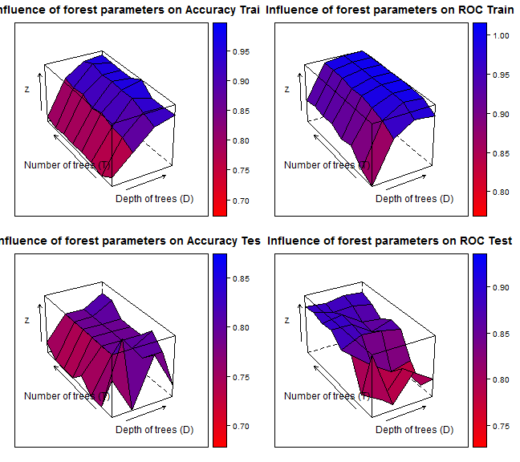 

```r
print(grdperfstage1plot/cplot)
```

```
##     x   y acuTrain rocTrain senTrain speTrain acuTest rocTest senTest
## 1   2   5   0.7352   0.7834   0.9600  0.23077  0.7931  0.9222    1.00
## 2   5   5   0.8182   0.9259   0.9714  0.47436  0.6897  0.7556    0.85
## 3  10   5   0.9051   0.9686   0.9829  0.73077  0.8276  0.8333    0.95
## 4  20   5   0.9289   0.9599   0.9714  0.83333  0.7241  0.7944    0.95
## 5   2  10   0.6917   0.8062   1.0000  0.00000  0.6897  0.7750    1.00
## 6   5  10   0.8419   0.9551   0.9714  0.55128  0.8621  0.7389    1.00
## 7  10  10   0.9289   0.9969   1.0000  0.76923  0.7931  0.8167    1.00
## 8  20  10   0.9249   0.9902   1.0000  0.75641  0.7931  0.7444    0.95
## 9   2  30   0.7075   0.8566   0.9886  0.07692  0.6897  0.8667    1.00
## 10  5  30   0.8458   0.9683   0.9771  0.55128  0.7931  0.8167    1.00
## 11 10  30   0.9526   0.9986   1.0000  0.84615  0.7931  0.7778    0.95
## 12 20  30   0.9289   0.9962   0.9943  0.78205  0.8276  0.7944    1.00
## 13  2  60   0.7115   0.8468   0.9771  0.11538  0.7241  0.8556    1.00
## 14  5  60   0.8735   0.9817   1.0000  0.58974  0.7931  0.8833    0.95
## 15 10  60   0.9526   0.9993   1.0000  0.84615  0.7931  0.8778    0.95
## 16 20  60   0.9763   0.9993   1.0000  0.92308  0.7931  0.8667    0.95
## 17  2 100   0.7075   0.8710   0.9829  0.08974  0.6897  0.8889    1.00
## 18  5 100   0.8538   0.9758   0.9771  0.57692  0.7931  0.8889    0.95
## 19 10 100   0.9565   0.9985   1.0000  0.85897  0.7931  0.8500    0.95
## 20 20 100   0.9486   0.9982   1.0000  0.83333  0.7931  0.8722    0.95
## 21  2 250   0.7115   0.8684   0.9771  0.11538  0.6897  0.8833    1.00
## 22  5 250   0.8814   0.9866   0.9943  0.62821  0.7931  0.8944    0.95
## 23 10 250   0.9486   0.9994   1.0000  0.83333  0.7931  0.8556    0.95
## 24 20 250   0.9486   0.9986   1.0000  0.83333  0.7931  0.8500    0.95
## 25  2 500   0.7036   0.8754   0.9771  0.08974  0.6897  0.8944    1.00
## 26  5 500   0.8775   0.9871   0.9943  0.61538  0.7931  0.8778    0.95
## 27 10 500   0.9684   0.9991   1.0000  0.89744  0.7931  0.8833    0.95
## 28 20 500   0.9486   0.9990   1.0000  0.83333  0.8276  0.8722    0.95
## 29  2 750   0.7194   0.8669   0.9829  0.12821  0.7241  0.8889    1.00
## 30  5 750   0.8893   0.9872   0.9943  0.65385  0.7931  0.8833    0.95
## 31 10 750   0.9486   0.9985   1.0000  0.83333  0.7931  0.8944    0.95
## 32 20 750   0.9565   0.9993   1.0000  0.85897  0.8276  0.8889    0.95
##    speTest
## 1   0.3333
## 2   0.3333
## 3   0.5556
## 4   0.2222
## 5   0.0000
## 6   0.5556
## 7   0.3333
## 8   0.4444
## 9   0.0000
## 10  0.3333
## 11  0.4444
## 12  0.4444
## 13  0.1111
## 14  0.4444
## 15  0.4444
## 16  0.4444
## 17  0.0000
## 18  0.4444
## 19  0.4444
## 20  0.4444
## 21  0.0000
## 22  0.4444
## 23  0.4444
## 24  0.4444
## 25  0.0000
## 26  0.4444
## 27  0.4444
## 28  0.5556
## 29  0.1111
## 30  0.4444
## 31  0.4444
## 32  0.5556
```

```r

# for resamROC
ROCF_train <- plot.roc(resamROC_train$obs, resamROC_train$mass, col = "#000086", 
    lty = 1, legacy.axes = TRUE)
par(new = TRUE)
ROCF_test <- plot.roc(resamROC_test$obs, resamROC_test$mass, col = "#860000", 
    lty = 2, main = "ROC for stage1 max cvFolds", legacy.axes = TRUE)
print(ROCF_train$auc)
```

```
## Area under the curve: 0.783
```

```r
print(mean(grdperfstage1$rocTrain))
```

```
## [1] 0.7834
```

```r

print(ROCF_test$auc)
```

```
## Area under the curve: 0.922
```

```r
print(mean(grdperfstage1$rocTest))
```

```
## [1] 0.9222
```

```r

legend("bottomright", legend = c(paste0("train: AUC=", formatC(ROCF_train$auc, 
    digits = 2, format = "f")), paste0("cv.test: AUC=", formatC(ROCF_test$auc, 
    digits = 2, format = "f"))), col = c("#000086", "#860000"), lwd = 2, lty = c(1, 
    2))
```

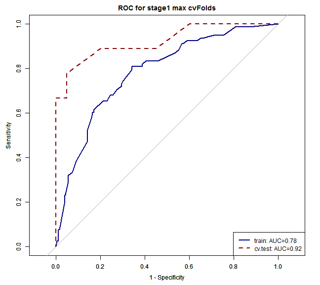 

```r

load("Z:/Cristina/MassNonmass/Section1 - ExperimentsUpToDate/experimentsRadiologypaper-revision/Tree-based-RF/ensemble-Treebased-RF/results/cvKmassgrdperf_all.RData")
resmass = res

# plot ROC of resamples at max perf across cvFolds
cvK = 10
resamROC_train = data.frame()
resamROC_test = data.frame()
count = 0
meanAUCmass = {
}
meanSenmass = {
}
meanSpecmass = {
}
grdperfmass = data.frame()
grdperfmassplot = data.frame()
once = FALSE
for (k in 1:cvK) {
    if (max(resmass$ensemblegrdperf[k]$grdperf$rocTest) > 0.87) {
        resamROC_train = rbind(resamROC_train, resmass$maxM[k]$maxp$trainprob)
        resamROC_test = rbind(resamROC_test, resmass$maxM[k]$maxp$testprob)
        count = count + 1
    }
    if (median(resmass$ensemblegrdperf[k]$grdperf$rocTest) > 0.8) {
        meanAUCmass = append(meanAUCmass, resmass$ensemblegrdperf[k]$grdperf$rocTest)
        meanSenmass = append(meanSenmass, resmass$ensemblegrdperf[k]$grdperf$senTest)
        meanSpecmass = append(meanSpecmass, resmass$ensemblegrdperf[k]$grdperf$speTest)
        # for param plots
        if (!once) {
            grdperfmassplot = resmass$ensemblegrdperf[k]$grdperf
            once = TRUE
            cplot = 1
        }
        grdperfmassplot = grdperfmassplot + resmass$ensemblegrdperf[k]$grdperf
        cplot = cplot + 1
        for (j in 1:length(resmass$maxM[k]$maxp$T)) {
            bestgen = resmass$ensemblegrdperf[k]$grdperf[(resmass$ensemblegrdperf[k]$grdperf$x == 
                resmass$maxM[k]$maxp$D[j] & resmass$ensemblegrdperf[k]$grdperf$y == 
                resmass$maxM[k]$maxp$T[j]), ]
            grdperfmass = rbind(grdperfmass, bestgen)
        }
    }
}
print("sampled AUCstage2 mass")
```

```
## [1] "sampled AUCstage2 mass"
```

```r
print(quantile(meanAUCmass))
```

```
##     0%    25%    50%    75%   100% 
## 0.7692 0.8681 0.8929 0.9615 0.9835
```

```r
print(quantile(meanSenmass))
```

```
##     0%    25%    50%    75%   100% 
## 0.6429 0.8571 0.8571 0.8750 1.0000
```

```r
print(quantile(meanSpecmass))
```

```
##     0%    25%    50%    75%   100% 
## 0.4615 0.6923 0.7692 0.9231 1.0000
```

```r
print(grdperfmass)
```

```
##     x   y acuTrain rocTrain senTrain speTrain acuTest rocTest senTest
## 4  20   5   0.8854   0.9511   0.9077   0.8618  0.8148  0.9341  1.0000
## 26  5 500   0.8972   0.9664   0.8769   0.9187  0.8889  0.9835  0.8571
##    speTest
## 4   0.6154
## 26  0.9231
```

```r
surface_forestperfm(grdperfmassplot/cplot)
```

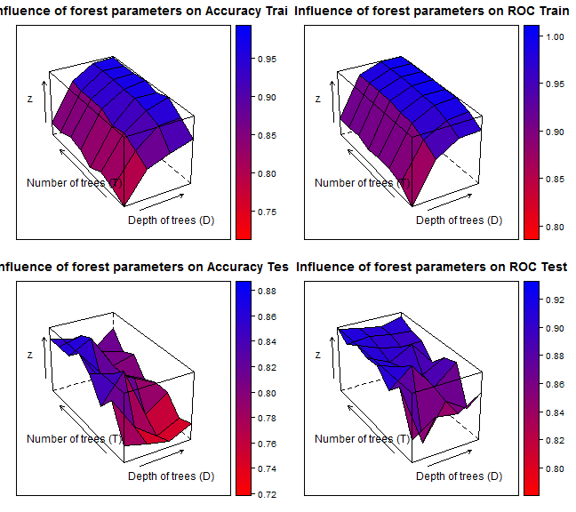 

```r
print(grdperfmassplot/cplot)
```

```
##     x   y acuTrain rocTrain senTrain speTrain acuTest rocTest senTest
## 1   2   5   0.7299   0.7989   0.7513   0.7073  0.7654  0.8333  0.8333
## 2   5   5   0.8379   0.9144   0.8231   0.8537  0.7531  0.8645  0.6667
## 3  10   5   0.8669   0.9544   0.8590   0.8753  0.7407  0.8571  0.6905
## 4  20   5   0.8933   0.9575   0.9154   0.8699  0.7654  0.8846  0.9048
## 5   2  10   0.7549   0.8323   0.7103   0.8022  0.8395  0.9139  0.9048
## 6   5  10   0.8643   0.9401   0.8487   0.8808  0.7654  0.7894  0.8095
## 7  10  10   0.9302   0.9751   0.9385   0.9214  0.7284  0.8608  0.8095
## 8  20  10   0.9341   0.9813   0.9205   0.9485  0.7531  0.8315  0.8810
## 9   2  30   0.7734   0.8452   0.7590   0.7886  0.8025  0.8883  0.8333
## 10  5  30   0.8933   0.9595   0.8744   0.9133  0.8642  0.9231  0.9048
## 11 10  30   0.9486   0.9907   0.9436   0.9539  0.7531  0.8681  0.7857
## 12 20  30   0.9750   0.9959   0.9718   0.9783  0.7901  0.9048  0.8571
## 13  2  60   0.7523   0.8455   0.7282   0.7778  0.8519  0.9176  0.8810
## 14  5  60   0.8827   0.9610   0.8692   0.8970  0.8395  0.9029  0.8810
## 15 10  60   0.9618   0.9929   0.9538   0.9702  0.8148  0.8736  0.8571
## 16 20  60   0.9592   0.9943   0.9513   0.9675  0.7901  0.8956  0.8571
## 17  2 100   0.7800   0.8407   0.7615   0.7995  0.8765  0.9139  0.9286
## 18  5 100   0.9104   0.9679   0.8897   0.9322  0.8025  0.8938  0.8095
## 19 10 100   0.9605   0.9958   0.9513   0.9702  0.8025  0.9176  0.8333
## 20 20 100   0.9710   0.9967   0.9718   0.9702  0.7778  0.8700  0.8095
## 21  2 250   0.7918   0.8549   0.7718   0.8130  0.8519  0.9212  0.8810
## 22  5 250   0.9130   0.9722   0.8897   0.9377  0.8765  0.9048  0.9286
## 23 10 250   0.9657   0.9960   0.9641   0.9675  0.8025  0.8938  0.8571
## 24 20 250   0.9684   0.9963   0.9692   0.9675  0.8148  0.8956  0.8333
## 25  2 500   0.7787   0.8506   0.7590   0.7995  0.8519  0.9066  0.8810
## 26  5 500   0.9130   0.9703   0.8923   0.9350  0.8642  0.9103  0.9048
## 27 10 500   0.9684   0.9966   0.9692   0.9675  0.8148  0.9029  0.8571
## 28 20 500   0.9671   0.9964   0.9641   0.9702  0.8025  0.8993  0.8571
## 29  2 750   0.7787   0.8519   0.7513   0.8076  0.8519  0.9194  0.8810
## 30  5 750   0.9183   0.9704   0.9000   0.9377  0.8395  0.9103  0.8571
## 31 10 750   0.9657   0.9959   0.9692   0.9621  0.8025  0.9029  0.8571
## 32 20 750   0.9697   0.9967   0.9718   0.9675  0.8395  0.9139  0.8571
##    speTest
## 1   0.6923
## 2   0.8462
## 3   0.7949
## 4   0.6154
## 5   0.7692
## 6   0.7179
## 7   0.6410
## 8   0.6154
## 9   0.7692
## 10  0.8205
## 11  0.7179
## 12  0.7179
## 13  0.8205
## 14  0.7949
## 15  0.7692
## 16  0.7179
## 17  0.8205
## 18  0.7949
## 19  0.7692
## 20  0.7436
## 21  0.8205
## 22  0.8205
## 23  0.7436
## 24  0.7949
## 25  0.8205
## 26  0.8205
## 27  0.7692
## 28  0.7436
## 29  0.8205
## 30  0.8205
## 31  0.7436
## 32  0.8205
```

```r

# for resamROC
ROCF_train <- plot.roc(resamROC_train$obs, resamROC_train$C, col = "#000086", 
    lty = 1, legacy.axes = TRUE)
par(new = TRUE)
ROCF_test <- plot.roc(resamROC_test$obs, resamROC_test$C, col = "#860000", lty = 2, 
    legacy.axes = TRUE, main = "ROC for mass max cvFolds")
print(ROCF_train$auc)
```

```
## Area under the curve: 0.955
```

```r
print(mean(grdperfmass$rocTrain))
```

```
## [1] 0.9587
```

```r

print(ROCF_test$auc)
```

```
## Area under the curve: 0.923
```

```r
print(mean(grdperfmass$rocTest))
```

```
## [1] 0.9588
```

```r
legend("bottomright", legend = c(paste0("train: AUC=", formatC(ROCF_train$auc, 
    digits = 2, format = "f")), paste0("cv.test: AUC=", formatC(ROCF_test$auc, 
    digits = 2, format = "f"))), col = c("#000086", "#860000"), lwd = 2, lty = c(1, 
    2))
```

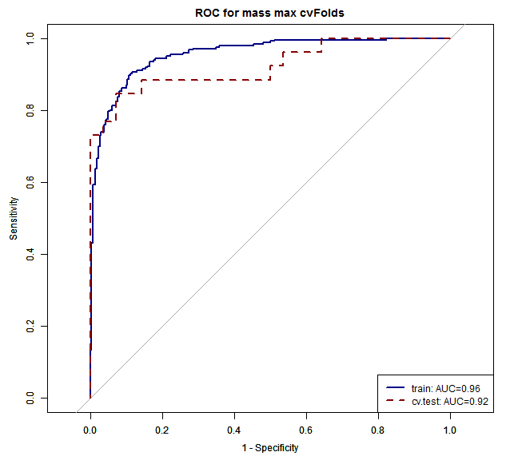 

```r


load("Z:/Cristina/MassNonmass/Section1 - ExperimentsUpToDate/experimentsRadiologypaper-revision/Tree-based-RF/ensemble-Treebased-RF/results/cvKnonmassgrdperf_all.RData")
resnonmass = res

# plot ROC of resamples at max perf across cvFolds
cvK = 10
resamROC_train = data.frame()
resamROC_test = data.frame()
meanAUCnonmass = {
}
meanSennonmass = {
}
meanSpecnonmass = {
}
grdperfnonmass = data.frame()
count = 0
grdperfnonmassplot = data.frame()
once = FALSE
for (k in 1:cvK) {
    if (max(resnonmass$ensemblegrdperf[k]$grdperf$rocTest) > 0.9) {
        resamROC_train = rbind(resamROC_train, resnonmass$maxM[k]$maxp$trainprob)
        resamROC_test = rbind(resamROC_test, resnonmass$maxM[k]$maxp$testprob)
        count = count + 1
    }
    if (median(resnonmass$ensemblegrdperf[k]$grdperf$rocTest) > 0.8) {
        meanAUCnonmass = append(meanAUCnonmass, resnonmass$ensemblegrdperf[k]$grdperf$rocTest)
        meanSennonmass = append(meanSennonmass, resnonmass$ensemblegrdperf[k]$grdperf$senTest)
        meanSpecnonmass = append(meanSpecnonmass, resnonmass$ensemblegrdperf[k]$grdperf$speTest)
        # for param plots
        if (!once) {
            grdperfnonmassplot = resnonmass$ensemblegrdperf[k]$grdperf
            once = TRUE
            cplot = 1
        }
        grdperfnonmassplot = grdperfnonmassplot + resnonmass$ensemblegrdperf[k]$grdperf
        cplot = cplot + 1
        for (j in 1:length(resnonmass$maxM[k]$maxp$T)) {
            bestgen = resnonmass$ensemblegrdperf[k]$grdperf[(resnonmass$ensemblegrdperf[k]$grdperf$x == 
                resnonmass$maxM[k]$maxp$D[j] & resnonmass$ensemblegrdperf[k]$grdperf$y == 
                resnonmass$maxM[k]$maxp$T[j]), ]
            grdperfnonmass = rbind(grdperfnonmass, bestgen)
        }
    }
}
print("sampled AUCstage2 non-mass")
```

```
## [1] "sampled AUCstage2 non-mass"
```

```r
print(quantile(meanAUCnonmass))
```

```
##     0%    25%    50%    75%   100% 
## 0.5972 0.8333 0.9167 0.9524 1.0000
```

```r
print(quantile(meanSennonmass))
```

```
##     0%    25%    50%    75%   100% 
## 0.1667 0.6429 1.0000 1.0000 1.0000
```

```r
print(quantile(meanSpecnonmass))
```

```
##     0%    25%    50%    75%   100% 
## 0.1667 0.4286 0.5714 1.0000 1.0000
```

```r
print(grdperfnonmass)
```

```
##      x   y acuTrain rocTrain senTrain speTrain acuTest rocTest senTest
## 8   20  10   0.9237   0.9810   0.9322   0.9153  0.7500  1.0000  0.5000
## 15  10  60   0.9576   0.9957   0.9492   0.9661  0.7500  1.0000  0.5000
## 4   20   5   0.8534   0.9462   0.8276   0.8793  1.0000  1.0000  1.0000
## 12  20  30   0.9397   0.9914   0.9310   0.9483  0.8571  1.0000  1.0000
## 5    2   5   0.7797   0.8414   0.7966   0.7627  0.8333  1.0000  1.0000
## 41  20   5   0.9068   0.9585   0.9322   0.8814  0.7500  1.0000  1.0000
## 51   2  10   0.7881   0.8834   0.8136   0.7627  0.5833  1.0000  1.0000
## 81  20  10   0.9153   0.9747   0.9153   0.9153  0.9167  1.0000  1.0000
## 10   5  30   0.9322   0.9891   0.9322   0.9322  0.8333  1.0000  1.0000
## 121 20  30   0.9407   0.9885   0.9153   0.9661  0.6667  1.0000  1.0000
## 17   2 100   0.8559   0.9092   0.8305   0.8814  0.7500  1.0000  1.0000
## 18   5 100   0.9576   0.9922   0.9661   0.9492  0.7500  1.0000  1.0000
## 19  10 100   0.9746   0.9963   0.9661   0.9831  0.8333  1.0000  1.0000
## 21   2 250   0.8220   0.9095   0.7966   0.8475  0.8333  1.0000  1.0000
## 23  10 250   0.9746   0.9983   0.9831   0.9661  0.7500  1.0000  1.0000
## 24  20 250   0.9915   0.9966   1.0000   0.9831  0.7500  1.0000  1.0000
## 25   2 500   0.8220   0.9095   0.7966   0.8475  0.8333  1.0000  1.0000
## 26   5 500   0.9492   0.9917   0.9492   0.9492  0.6667  1.0000  1.0000
## 27  10 500   0.9831   0.9960   0.9831   0.9831  0.7500  1.0000  1.0000
## 28  20 500   0.9746   0.9966   0.9661   0.9831  0.6667  1.0000  1.0000
## 29   2 750   0.8390   0.9092   0.8136   0.8644  0.7500  1.0000  1.0000
## 30   5 750   0.9661   0.9928   0.9492   0.9831  0.6667  1.0000  1.0000
## 32  20 750   0.9831   0.9971   0.9831   0.9831  0.7500  1.0000  1.0000
## 42  20   5   0.9060   0.9617   0.9153   0.8966  0.7692  0.9524  0.8333
##     speTest
## 8    1.0000
## 15   1.0000
## 4    1.0000
## 12   0.7143
## 5    0.6667
## 41   0.5000
## 51   0.1667
## 81   0.8333
## 10   0.6667
## 121  0.3333
## 17   0.5000
## 18   0.5000
## 19   0.6667
## 21   0.6667
## 23   0.5000
## 24   0.5000
## 25   0.6667
## 26   0.3333
## 27   0.5000
## 28   0.3333
## 29   0.5000
## 30   0.3333
## 32   0.5000
## 42   0.7143
```

```r
surface_forestperfm(grdperfnonmassplot/cplot)
```

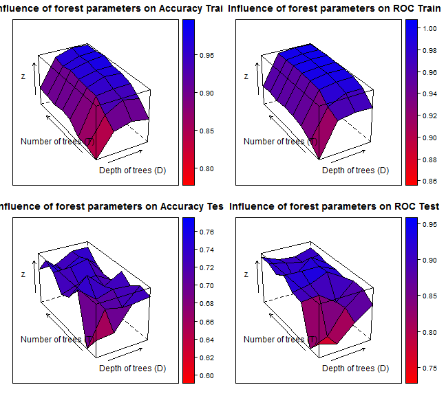 

```r
print(grdperfnonmassplot/cplot)
```

```
##     x   y acuTrain rocTrain senTrain speTrain acuTest rocTest senTest
## 1   2   5   0.7904   0.8648   0.7755   0.8051  0.6553  0.7954  0.6095
## 2   5   5   0.8738   0.9488   0.8875   0.8600  0.6612  0.7732  0.7333
## 3  10   5   0.8893   0.9563   0.8846   0.8940  0.7313  0.8330  0.7667
## 4  20   5   0.8756   0.9535   0.9147   0.8365  0.7372  0.8794  0.6333
## 5   2  10   0.8059   0.8896   0.7994   0.8127  0.6016  0.7416  0.5429
## 6   5  10   0.9029   0.9625   0.8776   0.9284  0.7086  0.7689  0.6714
## 7  10  10   0.9370   0.9832   0.9591   0.9147  0.6969  0.8601  0.6143
## 8  20  10   0.9233   0.9823   0.9251   0.9216  0.7482  0.9109  0.7095
## 9   2  30   0.8110   0.9068   0.8029   0.8193  0.7586  0.8916  0.7333
## 10  5  30   0.9421   0.9860   0.9353   0.9487  0.7136  0.8964  0.7048
## 11 10  30   0.9488   0.9919   0.9456   0.9521  0.7302  0.8500  0.7381
## 12 20  30   0.9523   0.9933   0.9320   0.9726  0.7253  0.9143  0.7333
## 13  2  60   0.8467   0.9139   0.8162   0.8771  0.7123  0.8978  0.7048
## 14  5  60   0.9470   0.9902   0.9386   0.9555  0.7636  0.9100  0.8048
## 15 10  60   0.9677   0.9961   0.9694   0.9659  0.7159  0.9392  0.7381
## 16 20  60   0.9642   0.9959   0.9761   0.9522  0.7480  0.8997  0.7714
## 17  2 100   0.8534   0.9159   0.8333   0.8735  0.6969  0.9354  0.7048
## 18  5 100   0.9506   0.9907   0.9455   0.9556  0.7159  0.9322  0.7714
## 19 10 100   0.9677   0.9960   0.9728   0.9625  0.7289  0.9340  0.7333
## 20 20 100   0.9677   0.9959   0.9796   0.9558  0.6980  0.9059  0.7048
## 21  2 250   0.8449   0.9139   0.8231   0.8667  0.7432  0.9116  0.7048
## 22  5 250   0.9574   0.9935   0.9523   0.9624  0.7480  0.8822  0.7714
## 23 10 250   0.9744   0.9980   0.9728   0.9761  0.7599  0.9435  0.8000
## 24 20 250   0.9829   0.9975   0.9864   0.9795  0.6980  0.9052  0.7048
## 25  2 500   0.8518   0.9171   0.8299   0.8738  0.7623  0.9290  0.7714
## 26  5 500   0.9489   0.9921   0.9421   0.9556  0.7147  0.9147  0.7714
## 27 10 500   0.9727   0.9971   0.9659   0.9795  0.7456  0.9011  0.8000
## 28 20 500   0.9762   0.9972   0.9796   0.9727  0.7136  0.9147  0.8000
## 29  2 750   0.8569   0.9157   0.8333   0.8805  0.7123  0.9290  0.7048
## 30  5 750   0.9591   0.9929   0.9456   0.9726  0.7147  0.9036  0.7714
## 31 10 750   0.9813   0.9974   0.9796   0.9829  0.7456  0.8981  0.8000
## 32 20 750   0.9779   0.9967   0.9762   0.9795  0.7456  0.9188  0.8000
##    speTest
## 1   0.7048
## 2   0.6000
## 3   0.7048
## 4   0.8429
## 5   0.6619
## 6   0.7524
## 7   0.7857
## 8   0.7952
## 9   0.7905
## 10  0.7333
## 11  0.7286
## 12  0.7238
## 13  0.7286
## 14  0.7286
## 15  0.7000
## 16  0.7333
## 17  0.7000
## 18  0.6714
## 19  0.7333
## 20  0.7000
## 21  0.7905
## 22  0.7333
## 23  0.7286
## 24  0.7000
## 25  0.7619
## 26  0.6667
## 27  0.7000
## 28  0.6381
## 29  0.7286
## 30  0.6667
## 31  0.7000
## 32  0.7000
```

```r

# for resamROC
ROCF_train <- plot.roc(resamROC_train$obs, resamROC_train$C, col = "#000086", 
    lty = 1, legacy.axes = TRUE)
par(new = TRUE)
ROCF_test <- plot.roc(resamROC_test$obs, resamROC_test$C, col = "#860000", lty = 2, 
    legacy.axes = TRUE, main = "ROC for non-mass max cvFolds")
print(ROCF_train$auc)
```

```
## Area under the curve: 0.941
```

```r
print(mean(grdperfnonmass$rocTrain))
```

```
## [1] 0.9628
```

```r

print(ROCF_test$auc)
```

```
## Area under the curve: 0.915
```

```r
print(mean(grdperfnonmass$rocTest))
```

```
## [1] 0.998
```

```r

legend("bottomright", legend = c(paste0("train: AUC=", formatC(ROCF_train$auc, 
    digits = 2, format = "f")), paste0("cv.test: AUC=", formatC(ROCF_test$auc, 
    digits = 2, format = "f"))), col = c("#000086", "#860000"), lwd = 2, lty = c(1, 
    2))
```

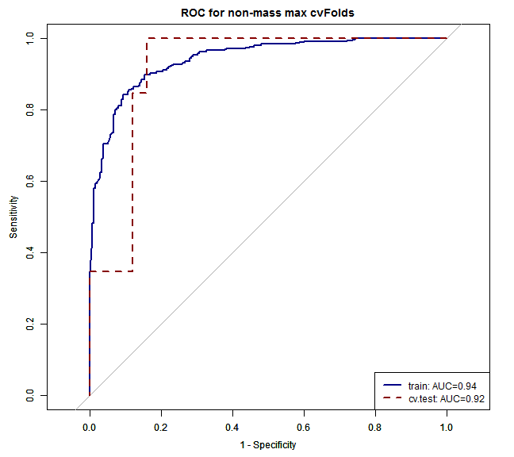 

```r


load("Z:/Cristina/MassNonmass/Section1 - ExperimentsUpToDate/experimentsRadiologypaper-revision/Tree-based-RF/ensemble-Treebased-RF/results/cvKmultigrdperf.RData")
resmulti = res

# plot ROC of resamples at max perf across cvFolds
cvK = 10
resamROC_train = data.frame()
resamROC_test = data.frame()
meanAUCmulti = {
}
meanSenmulti = {
}
meanSpecmulti = {
}
grdperfmulti = data.frame()
count = 0
for (k in 1:cvK) {
    if (max(resmulti$ensemblegrdperf[k]$grdperf$rocTest) > 0.7) {
        resamROC_train = rbind(resamROC_train, resmulti$maxM[k]$maxp$trainprob)
        resamROC_test = rbind(resamROC_test, resmulti$maxM[k]$maxp$testprob)
        count = count + 1
    }
    if (median(resmulti$ensemblegrdperf[k]$grdperf$rocTest) > 0.6) {
        meanAUCmulti = append(meanAUCmulti, resmulti$ensemblegrdperf[k]$grdperf$rocTest)
        meanSenmulti = append(meanSenmulti, resmulti$ensemblegrdperf[k]$grdperf$senTest)
        meanSpecmulti = append(meanSpecmulti, resmulti$ensemblegrdperf[k]$grdperf$speTest)
        for (j in 1:length(resmulti$maxM[k]$maxp$T)) {
            bestgen = resmulti$ensemblegrdperf[k]$grdperf[(resmulti$ensemblegrdperf[k]$grdperf$x == 
                resmulti$maxM[k]$maxp$D[j] & resmulti$ensemblegrdperf[k]$grdperf$y == 
                resmulti$maxM[k]$maxp$T[j]), ]
            grdperfmulti = rbind(grdperfmulti, bestgen)
        }
    }
}
print("sampled AUCstage2 multi")
```

```
## [1] "sampled AUCstage2 multi"
```

```r
print(quantile(meanAUCmulti))
```

```
##     0%    25%    50%    75%   100% 
## 0.5000 0.6338 0.6745 0.7344 0.8516
```

```r
print(quantile(meanSenmulti))
```

```
##     0%    25%    50%    75%   100% 
## 0.0000 0.3750 0.4286 0.6250 0.8750
```

```r
print(quantile(meanSpecmulti))
```

```
##     0%    25%    50%    75%   100% 
## 0.3636 0.7121 0.7500 0.8333 1.0000
```

```r
print(grdperfmulti)
```

```
##     x   y acuTrain rocTrain senTrain speTrain acuTest rocTest senTest
## 1   2   5   0.5429   0.7837   0.6087   0.8585  0.4444  0.7301  0.3750
## 2   2   5   0.5369   0.7024   0.4928   0.8952  0.4643  0.7005  0.3750
## 9   2  30   0.5224   0.7738   0.5217   0.8762  0.4815  0.7656  0.5000
## 20 20 100   0.9547   0.8351   0.9565   1.0000  0.4483  0.7500  0.3750
## 21  5   5   0.6640   0.7686   0.7571   0.8585  0.5200  0.7419  0.8571
## 91  2  30   0.5061   0.7704   0.3623   0.9340  0.5185  0.7386  0.5000
## 29  2 750   0.5469   0.7726   0.5942   0.8857  0.5185  0.8229  0.3750
## 8   2   5   0.5123   0.7554   0.5797   0.8095  0.6071  0.8516  0.7500
## 12 20  30   0.9020   0.8192   0.9143   1.0000  0.5926  0.7143  0.5714
##    speTest
## 1   0.8182
## 2   0.8333
## 9   0.7500
## 20  0.8333
## 21  0.5455
## 91  0.9091
## 29  0.9167
## 8   0.9167
## 12  0.9167
```

```r
surface_forestperfm(grdperfmulti)
```

```
## Error: dims [product 12] do not match the length of object [9]
```

```r

# for resamROC
ROCF_trainmb <- plot.roc(resamROC_train$obs, resamROC_train$massB, col = "#000086", 
    lty = 1, legacy.axes = TRUE)
par(new = TRUE)
ROCF_trainmm <- plot.roc(resamROC_train$obs, resamROC_train$massM, col = "#000086", 
    lty = 1, legacy.axes = TRUE)
par(new = TRUE)
ROCF_trainnb <- plot.roc(resamROC_train$obs, resamROC_train$nonmassB, col = "#000086", 
    lty = 1, legacy.axes = TRUE)
par(new = TRUE)
ROCF_trainnm <- plot.roc(resamROC_train$obs, resamROC_train$nonmassM, col = "#000086", 
    lty = 1, legacy.axes = TRUE)
par(new = TRUE)
ROCF_testmb <- plot.roc(resamROC_test$obs, resamROC_test$massB, col = "#860000", 
    lty = 2, legacy.axes = TRUE)
par(new = TRUE)
ROCF_testmm <- plot.roc(resamROC_test$obs, resamROC_test$massM, col = "#860000", 
    lty = 2, legacy.axes = TRUE)
par(new = TRUE)
ROCF_testnb <- plot.roc(resamROC_test$obs, resamROC_test$nonmassB, col = "#860000", 
    lty = 2, legacy.axes = TRUE)
par(new = TRUE)
ROCF_testnm <- plot.roc(resamROC_test$obs, resamROC_test$nonmassM, col = "#860000", 
    lty = 2, legacy.axes = TRUE, main = "ROC for multi max cvFolds")
ROCF_trainauc = (ROCF_trainmb$auc + ROCF_trainmm$auc + ROCF_trainnb$auc + ROCF_testnm$auc)/4
ROCF_testauc = (ROCF_testmb$auc + ROCF_testmm$auc + ROCF_testnb$auc + ROCF_trainnm$auc)/4
print(ROCF_trainauc)
```

```
## Area under the curve: 0.755
```

```r
print(mean(grdperfmulti$rocTrain))
```

```
## [1] 0.7757
```

```r

print(ROCF_testauc)
```

```
## Area under the curve: 0.702
```

```r
print(mean(grdperfmulti$rocTest))
```

```
## [1] 0.7573
```

```r
legend("bottomright", legend = c(paste0("train: AUC=", formatC(ROCF_trainauc, 
    digits = 2, format = "f")), paste0("cv.test: AUC=", formatC(ROCF_testauc, 
    digits = 2, format = "f"))), col = c("#000086", "#860000"), lwd = 2, lty = c(1, 
    2))
```

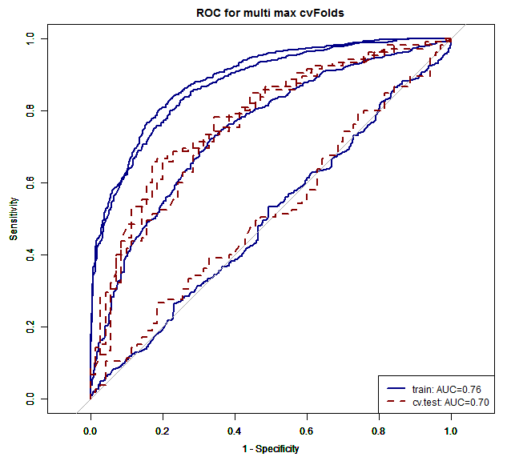 

```r

load("Z:/Cristina/MassNonmass/Section1 - ExperimentsUpToDate/experimentsRadiologypaper-revision/Tree-based-RF/ensemble-Treebased-RF/results/cvKoneshotgrdperf_all.RData")
resoneshot = res

# plot ROC of resamples at max perf across cvFolds
cvK = 10
resamROC_train = data.frame()
resamROC_test = data.frame()
meanAUConeshot = {
}
meanSenoneshot = {
}
meanSpeconeshot = {
}
grdperfoneshot = data.frame()
count = 0
grdperfoneshotplot = data.frame()
once = FALSE
for (k in 1:cvK) {
    if (max(resoneshot$ensemblegrdperf[k]$grdperf$rocTest) > 0.8) {
        resamROC_train = rbind(resamROC_train, resoneshot$maxM[k]$maxp$trainprob)
        resamROC_test = rbind(resamROC_test, resoneshot$maxM[k]$maxp$testprob)
        count = count + 1
    }
    if (median(resoneshot$ensemblegrdperf[k]$grdperf$rocTest) > 0.8) {
        meanAUConeshot = append(meanAUConeshot, resoneshot$ensemblegrdperf[k]$grdperf$rocTest)
        meanSenoneshot = append(meanSenoneshot, resoneshot$ensemblegrdperf[k]$grdperf$senTest)
        meanSpeconeshot = append(meanSpeconeshot, resoneshot$ensemblegrdperf[k]$grdperf$speTest)
        # for param plots
        if (!once) {
            grdperfoneshotplot = resoneshot$ensemblegrdperf[k]$grdperf
            once = TRUE
            cplot = 1
        }
        grdperfoneshotplot = grdperfoneshotplot + resoneshot$ensemblegrdperf[k]$grdperf
        cplot = cplot + 1
        for (j in 1:length(resoneshot$maxM[k]$maxp$T)) {
            bestgen = resoneshot$ensemblegrdperf[k]$grdperf[(resoneshot$ensemblegrdperf[k]$grdperf$x == 
                resoneshot$maxM[k]$maxp$D[j] & resoneshot$ensemblegrdperf[k]$grdperf$y == 
                resoneshot$maxM[k]$maxp$T[j]), ]
            grdperfoneshot = rbind(grdperfoneshot, bestgen)
        }
        
    }
}
print("sampled AUCstage2 non-mass")
```

```
## [1] "sampled AUCstage2 non-mass"
```

```r
print(quantile(meanAUConeshot))
```

```
##     0%    25%    50%    75%   100% 
## 0.6613 0.8068 0.8280 0.8500 0.8962
```

```r
print(quantile(meanSenoneshot))
```

```
##     0%    25%    50%    75%   100% 
## 0.4762 0.6500 0.7619 0.8095 0.9500
```

```r
print(quantile(meanSpeconeshot))
```

```
##   0%  25%  50%  75% 100% 
## 0.55 0.70 0.75 0.80 0.95
```

```r
print(grdperfoneshot)
```

```
##     x   y acuTrain rocTrain senTrain speTrain acuTest rocTest senTest
## 1   2   5   0.7189   0.7750   0.6720   0.7680  0.9000  0.8962  0.9500
## 28 20 500   0.9756   0.9973   0.9787   0.9724  0.7805  0.8548  0.8095
## 10  5  30   0.8889   0.9555   0.8617   0.9171  0.7561  0.8595  0.6190
## 11 10  30   0.9295   0.9896   0.9362   0.9227  0.7805  0.8571  0.7143
## 2   5   5   0.8347   0.9055   0.8085   0.8619  0.7805  0.8833  0.8571
##    speTest
## 1     0.85
## 28    0.75
## 10    0.90
## 11    0.85
## 2     0.70
```

```r
surface_forestperfm(grdperfoneshotplot/cplot)
```

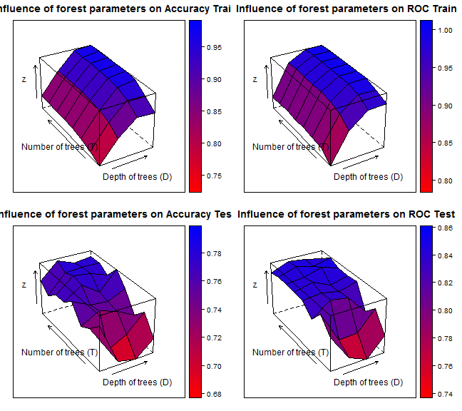 

```r
print(grdperfoneshotplot/cplot)
```

```
##     x   y acuTrain rocTrain senTrain speTrain acuTest rocTest senTest
## 1   2   5   0.7392   0.7973   0.7036   0.7762  0.7715  0.8114  0.7690
## 2   5   5   0.8299   0.9049   0.8318   0.8278  0.6923  0.7595  0.6770
## 3  10   5   0.8953   0.9569   0.8903   0.9006  0.6843  0.7444  0.6532
## 4  20   5   0.8908   0.9591   0.9053   0.8757  0.7132  0.7802  0.7421
## 5   2  10   0.7613   0.8298   0.7628   0.7597  0.7504  0.8393  0.7754
## 6   5  10   0.8624   0.9341   0.8407   0.8849  0.6970  0.7771  0.7016
## 7  10  10   0.9332   0.9827   0.9319   0.9346  0.7171  0.7807  0.7270
## 8  20  10   0.9301   0.9813   0.9345   0.9254  0.7500  0.8175  0.7183
## 9   2  30   0.7780   0.8364   0.7726   0.7836  0.7380  0.8129  0.7675
## 10  5  30   0.8804   0.9487   0.8690   0.8923  0.7583  0.8409  0.7341
## 11 10  30   0.9540   0.9936   0.9531   0.9549  0.7463  0.8349  0.7508
## 12 20  30   0.9666   0.9965   0.9708   0.9622  0.7293  0.7973  0.7341
## 13  2  60   0.7893   0.8431   0.7823   0.7965  0.7709  0.8333  0.7587
## 14  5  60   0.8903   0.9579   0.8726   0.9088  0.7545  0.8387  0.7349
## 15 10  60   0.9621   0.9957   0.9610   0.9632  0.7504  0.8326  0.7349
## 16 20  60   0.9734   0.9973   0.9761   0.9705  0.7669  0.8429  0.7595
## 17  2 100   0.7915   0.8400   0.7814   0.8020  0.7547  0.8357  0.7349
## 18  5 100   0.8940   0.9573   0.8752   0.9134  0.7791  0.8463  0.7833
## 19 10 100   0.9634   0.9962   0.9672   0.9595  0.7545  0.8310  0.7429
## 20 20 100   0.9702   0.9973   0.9778   0.9622  0.7913  0.8400  0.7754
## 21  2 250   0.7915   0.8451   0.7823   0.8011  0.7547  0.8373  0.7270
## 22  5 250   0.8926   0.9600   0.8770   0.9088  0.7831  0.8416  0.7754
## 23 10 250   0.9693   0.9973   0.9699   0.9687  0.7791  0.8529  0.7675
## 24 20 250   0.9729   0.9977   0.9735   0.9724  0.7669  0.8423  0.7595
## 25  2 500   0.7978   0.8452   0.7858   0.8103  0.7382  0.8374  0.7270
## 26  5 500   0.8976   0.9620   0.8814   0.9144  0.7750  0.8504  0.7675
## 27 10 500   0.9662   0.9972   0.9681   0.9641  0.7791  0.8412  0.7595
## 28 20 500   0.9743   0.9980   0.9752   0.9733  0.7791  0.8504  0.7595
## 29  2 750   0.7974   0.8433   0.7858   0.8094  0.7547  0.8328  0.7349
## 30  5 750   0.8944   0.9616   0.8761   0.9134  0.7872  0.8478  0.7675
## 31 10 750   0.9707   0.9972   0.9673   0.9742  0.7750  0.8426  0.7675
## 32 20 750   0.9729   0.9981   0.9770   0.9687  0.7791  0.8369  0.7595
##    speTest
## 1   0.7750
## 2   0.7083
## 3   0.7167
## 4   0.6833
## 5   0.7250
## 6   0.6917
## 7   0.7083
## 8   0.7833
## 9   0.7083
## 10  0.7833
## 11  0.7417
## 12  0.7250
## 13  0.7833
## 14  0.7750
## 15  0.7667
## 16  0.7750
## 17  0.7750
## 18  0.7750
## 19  0.7667
## 20  0.8083
## 21  0.7833
## 22  0.7917
## 23  0.7917
## 24  0.7750
## 25  0.7500
## 26  0.7833
## 27  0.8000
## 28  0.8000
## 29  0.7750
## 30  0.8083
## 31  0.7833
## 32  0.8000
```

```r

# for resamROC
ROCF_train <- plot.roc(resamROC_train$obs, resamROC_train$C, col = "#000086", 
    lty = 1, legacy.axes = TRUE)
par(new = TRUE)
ROCF_test <- plot.roc(resamROC_test$obs, resamROC_test$C, col = "#860000", lty = 2, 
    legacy.axes = TRUE, main = "ROC for oneshot max cvFolds")
print(ROCF_train$auc)
```

```
## Area under the curve: 0.923
```

```r
print(mean(grdperfoneshot$rocTrain))
```

```
## [1] 0.9246
```

```r

print(ROCF_test$auc)
```

```
## Area under the curve: 0.859
```

```r
print(mean(grdperfoneshot$rocTest))
```

```
## [1] 0.8702
```

```r
legend("bottomright", legend = c(paste0("train: AUC=", formatC(ROCF_train$auc, 
    digits = 2, format = "f")), paste0("cv.test: AUC=", formatC(ROCF_test$auc, 
    digits = 2, format = "f"))), col = c("#000086", "#860000"), lwd = 2, lty = c(1, 
    2))
```

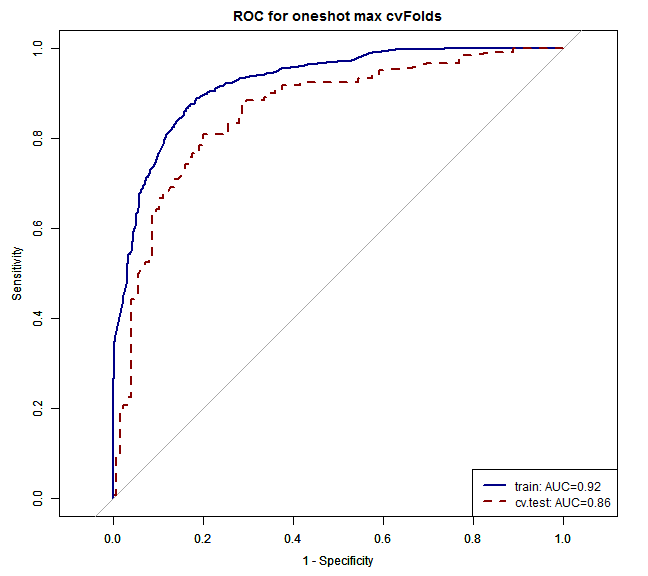 


Plot
====

```r
AUCframestage1 = data.frame(AUC = meanAUCstage1)
AUCframestage1$MorN = "stage1"
AUCframestage1$metric = "AUC"

AUCframestage2mass = data.frame(AUC = meanAUCmass)
AUCframestage2mass$MorN = "stage2_mass"
AUCframestage2mass$metric = "AUC"

AUCframestage2nonmass = data.frame(AUC = meanAUCnonmass)
AUCframestage2nonmass$MorN = "stage2_nonmass"
AUCframestage2nonmass$metric = "AUC"

AUCframeoneshot = data.frame(AUC = meanAUConeshot)
AUCframeoneshot$MorN = "oneshot"
AUCframeoneshot$metric = "AUC"
AUCframe = rbind(AUCframeoneshot, AUCframestage1, AUCframestage2mass, AUCframestage2nonmass)

library(ggplot2)
library(scales)
library(RColorBrewer)

print(ggplot(data = AUCframe, aes(x = MorN, y = AUC)) + geom_boxplot(aes(fill = interaction(MorN))) + 
    theme_bw(base_size = 16) + theme(axis.text.x = element_text(angle = 45, 
    hjust = 1)) + scale_fill_manual(name = "Cascade classifier performance by stages", 
    values = c("#99CC00", "#993366", "#008080", "#0099CC")))
```

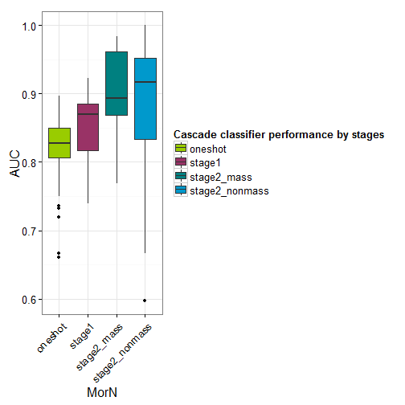 


Cascade vs. oneshot
===

```r
rpart_inputpreddata <- function(subdata, ids) {
    library("RSQLite")
    sqlite <- dbDriver("SQLite")
    conn <- dbConnect(sqlite, "stage1localData.db")
    
    # 2) all T1W features
    lesionsQuery <- dbGetQuery(conn, "SELECT *\n           FROM  stage1features\n           INNER JOIN lesion ON (stage1features.lesion_id = lesion.lesion_id)\n           INNER JOIN f_dynamic ON (stage1features.lesion_id = f_dynamic.lesion_id)\n           INNER JOIN f_morphology ON (stage1features.lesion_id = f_morphology.lesion_id)\n           INNER JOIN f_texture ON (stage1features.lesion_id = f_texture.lesion_id)")
    
    # prune entries and extract feature subsets corresponds to 5 entries
    # lesion info, 34 dynamic, 19 morpho, 34 texture fueatures
    lesionfields = names(lesionsQuery)
    lesioninfo = lesionsQuery[c(1, 2, 150, 151)]
    stage1features = lesionsQuery[c(3:103, 124:127)]
    dynfeatures = lesionsQuery[c(154:187)]
    morphofeatures = lesionsQuery[c(190:208)]
    texfeatures = lesionsQuery[c(211:234)]
    
    # combine all features
    allfeatures = cbind(lesioninfo[c(2, 3)], stage1features, dynfeatures, morphofeatures, 
        texfeatures)
    
    if (subdata == "stage2") {
        # organized the data by subdata
        allfeatures = allfeatures[ids, ]
        M <- subset(allfeatures, lesion_label == "massB" | lesion_label == "massM")
        M$lesion_label <- ifelse(M$lesion_label == "massB", "NC", "C")
        N <- subset(allfeatures, lesion_label == "nonmassB" | lesion_label == 
            "nonmassM")
        N$lesion_label <- ifelse(N$lesion_label == "nonmassB", "NC", "C")
        allfeatures = rbind(M, N)
    }
    if (subdata == "stage1") {
        # organized the data by subdata
        allfeatures = allfeatures[ids, ]
        M <- subset(allfeatures, lesion_label == "massB" | lesion_label == "massM")
        M$lesion_label <- ifelse(M$lesion_label == "massB", "mass", "mass")
        N <- subset(allfeatures, lesion_label == "nonmassB" | lesion_label == 
            "nonmassM")
        N$lesion_label <- ifelse(N$lesion_label == "nonmassB", "nonmass", "nonmass")
        allfeatures = data.frame(rbind(M, N))
    }
    if (subdata == "oneshot") {
        # organized the data by subdata
        allfeatures = allfeatures[ids, ]
        M <- subset(allfeatures, lesion_label == "massB" | lesion_label == "massM")
        M$lesion_label <- ifelse(M$lesion_label == "massB", "NC", "C")
        N <- subset(allfeatures, lesion_label == "nonmassB" | lesion_label == 
            "nonmassM")
        N$lesion_label <- ifelse(N$lesion_label == "nonmassB", "NC", "C")
        allfeatures = data.frame(rbind(M, N))
    }
    # procees data
    allfeatures$lesion_label <- as.factor(allfeatures$lesion_label)
    allfeatures$peakCr_inside <- as.factor(allfeatures$peakCr_inside)
    allfeatures$peakVr_inside <- as.factor(allfeatures$peakVr_inside)
    allfeatures$peakCr_countor <- as.factor(allfeatures$peakCr_countor)
    allfeatures$peakVr_countor <- as.factor(allfeatures$peakVr_countor)
    allfeatures$k_Max_Margin_Grad <- as.factor(allfeatures$k_Max_Margin_Grad)
    allfeatures$max_RGH_mean_k <- as.factor(allfeatures$max_RGH_mean_k)
    allfeatures$max_RGH_var_k <- as.factor(allfeatures$max_RGH_var_k)
    
    output <- allfeatures
    return(output)
}

read_data <- function(subdata, ids) {
    library("RSQLite")
    sqlite <- dbDriver("SQLite")
    conn <- dbConnect(sqlite, "stage1localData.db")
    
    # 2) all T1W features
    lesionsQuery <- dbGetQuery(conn, "SELECT *\n           FROM  stage1features\n           INNER JOIN lesion ON (stage1features.lesion_id = lesion.lesion_id)\n           INNER JOIN f_dynamic ON (stage1features.lesion_id = f_dynamic.lesion_id)\n           INNER JOIN f_morphology ON (stage1features.lesion_id = f_morphology.lesion_id)\n           INNER JOIN f_texture ON (stage1features.lesion_id = f_texture.lesion_id)")
    
    # prune entries and extract feature subsets corresponds to 5 entries
    # lesion info, 34 dynamic, 19 morpho, 34 texture fueatures
    lesionfields = names(lesionsQuery)
    lesioninfo = lesionsQuery[c(1, 2, 150, 151)]
    stage1features = lesionsQuery[c(3:103, 124:127)]
    dynfeatures = lesionsQuery[c(154:187)]
    morphofeatures = lesionsQuery[c(190:208)]
    texfeatures = lesionsQuery[c(211:234)]
    
    # combine all features
    allfeatures = cbind(lesioninfo[c(2, 3)], stage1features, dynfeatures, morphofeatures, 
        texfeatures)
    
    if (subdata == "stage2") {
        # organized the data by subdata
        allfeatures = allfeatures[ids, ]
        M <- subset(allfeatures, lesion_label == "massB" | lesion_label == "massM")
        M$lesion_label <- ifelse(M$lesion_label == "massB", "NC", "C")
        N <- subset(allfeatures, lesion_label == "nonmassB" | lesion_label == 
            "nonmassM")
        N$lesion_label <- ifelse(N$lesion_label == "nonmassB", "NC", "C")
        allfeatures = rbind(M, N)
    }
    if (subdata == "stage1") {
        # organized the data by subdata
        allfeatures = allfeatures[ids, ]
        M <- subset(allfeatures, lesion_label == "massB" | lesion_label == "massM")
        M$lesion_label <- ifelse(M$lesion_label == "massB", "mass", "mass")
        N <- subset(allfeatures, lesion_label == "nonmassB" | lesion_label == 
            "nonmassM")
        N$lesion_label <- ifelse(N$lesion_label == "nonmassB", "nonmass", "nonmass")
        allfeatures = data.frame(rbind(M, N))
    }
    if (subdata == "oneshot") {
        # organized the data by subdata
        allfeatures = allfeatures[ids, ]
        M <- subset(allfeatures, lesion_label == "massB" | lesion_label == "massM")
        M$lesion_label <- ifelse(M$lesion_label == "massB", "NC", "C")
        N <- subset(allfeatures, lesion_label == "nonmassB" | lesion_label == 
            "nonmassM")
        N$lesion_label <- ifelse(N$lesion_label == "nonmassB", "NC", "C")
        allfeatures = data.frame(rbind(M, N))
    }
    # procees data
    allfeatures$lesion_label <- as.factor(allfeatures$lesion_label)
    allfeatures$peakCr_inside <- as.factor(allfeatures$peakCr_inside)
    allfeatures$peakVr_inside <- as.factor(allfeatures$peakVr_inside)
    allfeatures$peakCr_countor <- as.factor(allfeatures$peakCr_countor)
    allfeatures$peakVr_countor <- as.factor(allfeatures$peakVr_countor)
    allfeatures$k_Max_Margin_Grad <- as.factor(allfeatures$k_Max_Margin_Grad)
    allfeatures$max_RGH_mean_k <- as.factor(allfeatures$max_RGH_mean_k)
    allfeatures$max_RGH_var_k <- as.factor(allfeatures$max_RGH_var_k)
    
    # 2) all T1W features
    lesionsQueryinfo <- dbGetQuery(conn, "SELECT *\n           FROM  lesion\n           INNER JOIN stage1features ON (stage1features.lesion_id = lesion.lesion_id)")
    
    # prune entries and extract feature subsets corresponds to 5 entries
    # lesion info, 34 dynamic, 19 morpho, 34 texture fueatures
    lesionsfields = names(lesionsQueryinfo)
    lesionsinfo = lesionsQueryinfo[c(1:24)]
    lesionsinfo = lesionsinfo[lesionsinfo$lesion_id == ids, ]
    
    # 2) all T1W features
    lesionsQuerymass <- dbGetQuery(conn, "SELECT *\n           FROM  lesion\n           INNER JOIN mass_lesion ON (mass_lesion.lesion_id = lesion.lesion_id)\n           INNER JOIN stage1features ON (stage1features.lesion_id = lesion.lesion_id)")
    
    # prune entries and extract mass info
    lesionsmass = names(lesionsQuerymass)
    lesionsmassinfo = lesionsQuerymass[ids, c(1:33)]
    lesionsmassinfo = lesionsmassinfo[lesionsmassinfo$lesion_id == ids, ]
    
    
    # 2) all T1W features
    lesionsQuerynonmass <- dbGetQuery(conn, "SELECT *\n           FROM  lesion\n           INNER JOIN nonmass_lesion ON (nonmass_lesion.lesion_id = lesion.lesion_id)\n           INNER JOIN stage1features ON (stage1features.lesion_id = lesion.lesion_id)")
    
    # prune entries and extract nonmass
    lesionsmass = names(lesionsQuerynonmass)
    lesionsnonmassinfo = lesionsQuerynonmass[ids, c(1:33)]
    lesionsnonmassinfo = lesionsnonmassinfo[lesionsnonmassinfo$lesion_id == 
        ids, ]
    
    
    output <- list(features = allfeatures, info = lesionsinfo, mass = lesionsmassinfo, 
        nonmass = lesionsnonmassinfo)
    return(output)
}
```


Cascade (by aggreggating best generalization forests) vs. one-shot
========================================================

Process Stage1
====

```r
library(caret)
library(MASS)
summary(resstage1)
```

```
##                 Length Class  Mode
## ensemblegrdperf 10     -none- list
## maxM            10     -none- list
```

```r
summary(resstage1$maxM$maxp)
```

```
##           Length Class      Mode   
## D          1     -none-     numeric
## T          1     -none-     numeric
## trainprob  4     data.frame list   
## testprob   4     data.frame list   
## forest    60     -none-     list
```

```r
summary(resstage1$maxM[1]$maxp)
```

```
##           Length Class      Mode   
## D          1     -none-     numeric
## T          1     -none-     numeric
## trainprob  4     data.frame list   
## testprob   4     data.frame list   
## forest    60     -none-     list
```

```r

stage1dat = rpart_inputpreddata(subdata = "stage1", ids = 1:409)
```

```
## Loading required package: DBI
```

```r
nforests = length(resstage1$maxM)
ensclasspo = list()
treemclasspo = list()
count = 0
for (i in 1:nforests) {
    if (max(resstage1$ensemblegrdperf[i]$grdperf$rocTest) > 0.6) {
        D = resstage1$maxM[i]$maxp$D
        T = resstage1$maxM[i]$maxp$T
        cat("RF", i, ": D=", D, ", T=", T, "\n")
        treem = resstage1$maxM[i]$maxp$forest
        count = count + 1
        
        # Calcultate posterior Probabilities on grid points
        fclasspo = list()
        for (t in 1:T) {
            temp <- predict(treem[t]$tree, newdata = stage1dat, type = "prob")  #
            fclasspo <- append(fclasspo, list(cpo = temp))
        }
        
        # performance on Train/Test set separately extract ensamble class
        # probabilities (when T > 1) init ensample class posteriors
        enclasspo <- matrix(, nrow = nrow(as.data.frame(fclasspo[1]$cpo)), ncol = 2)
        enclasspo[, 1] = fclasspo[1]$cpo[, 1]
        enclasspo[, 2] = fclasspo[1]$cpo[, 2]
        if (T >= 2) {
            for (t in 2:T) {
                enclasspo[, 1] = enclasspo[, 1] + fclasspo[t]$cpo[, 1]
                enclasspo[, 2] = enclasspo[, 2] + fclasspo[t]$cpo[, 2]
            }
        }
        # majority voting averaging
        enclasspo[, 1] = (1/T) * enclasspo[, 1]
        enclasspo[, 2] = (1/T) * enclasspo[, 2]
        treemclasspo <- append(treemclasspo, list(cpo = enclasspo))
    }
}
```

```
## RF 1 : D= 10 , T= 60 
## RF 2 : D= 10 , T= 10 
## RF 3 : D= 5 , T= 30 
## RF 4 : D= 2 , T= 60 
## RF 5 : D= 20 , T= 5 
## RF 6 : D= 2 , T= 5 
## RF 7 : D= 10 , T= 750 
## RF 8 : D= 2 , T= 5 
## RF 9 : D= 10 10 , T= 5 60 
## RF 10 : D= 2 , T= 10
```

```r


# performance on Train/Test set separately extract ensamble class
# probabilities (when T > 1) init ensample class posteriors
ensclasspo <- matrix(, nrow = nrow(treemclasspo[1]$cpo), ncol = 2)
ensclasspo[, 1] = treemclasspo[1]$cpo[, 1]
ensclasspo[, 2] = treemclasspo[1]$cpo[, 2]
if (count >= 2) {
    for (t in 2:count) {
        ensclasspo[, 1] = ensclasspo[, 1] + treemclasspo[t]$cpo[, 1]
        ensclasspo[, 2] = ensclasspo[, 2] + treemclasspo[t]$cpo[, 2]
    }
}

# majority voting averaging
ensclasspo[, 1] = (1/count) * ensclasspo[, 1]
ensclasspo[, 2] = (1/count) * ensclasspo[, 2]
# print(ensclasspo)

# on testing
classes = levels(stage1dat$lesion_label)
testprob = data.frame(C1 = ensclasspo[, 1], C2 = ensclasspo[, 2], pred = classes[apply(ensclasspo, 
    1, which.max)], obs = stage1dat$lesion_label, ids = stage1dat$lesion_id)
colnames(testprob)[1:2] <- classes
pred = as.factor(apply(ensclasspo, 1, which.max))
levels(pred) = levels(as.factor(unclass(stage1dat$lesion_label)))

groundT = as.factor(unclass(stage1dat$lesion_label))
levels(groundT) = levels(as.factor(unclass(stage1dat$lesion_label)))

perf_test = confusionMatrix(pred, groundT)
```

```
## Loading required package: class
```

```r
print(perf_test)
```

```
## Confusion Matrix and Statistics
## 
##           Reference
## Prediction   1   2
##          1 272  76
##          2   8  53
##                                         
##                Accuracy : 0.795         
##                  95% CI : (0.752, 0.833)
##     No Information Rate : 0.685         
##     P-Value [Acc > NIR] : 4.46e-07      
##                                         
##                   Kappa : 0.446         
##  Mcnemar's Test P-Value : 2.67e-13      
##                                         
##             Sensitivity : 0.971         
##             Specificity : 0.411         
##          Pos Pred Value : 0.782         
##          Neg Pred Value : 0.869         
##              Prevalence : 0.685         
##          Detection Rate : 0.665         
##    Detection Prevalence : 0.851         
##                                         
##        'Positive' Class : 1             
## 
```

```r

########################################### subset for mass and non-mass
masspredid = subset(testprob, pred == "mass")
nonmasspredid = subset(testprob, pred == "nonmass")

# compare ratio of stage 1 correct predictions
summary(stage1dat$lesion_label)
```

```
##    mass nonmass 
##     280     129
```

```r
# vs.
summary(masspredid)
```

```
##       mass          nonmass            pred          obs     
##  Min.   :0.460   Min.   :0.0927   mass   :348   mass   :272  
##  1st Qu.:0.630   1st Qu.:0.1847   nonmass:  0   nonmass: 76  
##  Median :0.709   Median :0.2370                              
##  Mean   :0.698   Mean   :0.2561                              
##  3rd Qu.:0.774   3rd Qu.:0.3243                              
##  Max.   :0.905   Max.   :0.4992                              
##       ids     
##  Min.   :  1  
##  1st Qu.:102  
##  Median :206  
##  Mean   :206  
##  3rd Qu.:313  
##  Max.   :410
```

```r
summary(nonmasspredid)
```

```
##       mass          nonmass           pred         obs          ids     
##  Min.   :0.281   Min.   :0.457   mass   : 0   mass   : 8   Min.   :  5  
##  1st Qu.:0.362   1st Qu.:0.504   nonmass:61   nonmass:53   1st Qu.:121  
##  Median :0.422   Median :0.555                             Median :205  
##  Mean   :0.407   Mean   :0.551                             Mean   :207  
##  3rd Qu.:0.445   3rd Qu.:0.594                             3rd Qu.:279  
##  Max.   :0.499   Max.   :0.684                             Max.   :407
```

```r

masspreddat = rpart_inputpreddata(subdata = "stage2", masspredid$ids)
nonmasspreddat = rpart_inputpreddata(subdata = "stage2", nonmasspredid$ids)
```


Process stage2: mass
=====

```r
#########################################
nforests = length(resmass$maxM)
ensclasspo = list()
treemclasspo = list()
count = 0
for (i in 1:nforests) {
    if (max(resmass$ensemblegrdperf[i]$grdperf$rocTest) > 0.6) {
        D = resmass$maxM[i]$maxp$D
        T = resmass$maxM[i]$maxp$T
        cat("RF", i, ": D=", D, ", T=", T, "\n")
        treem = resmass$maxM[i]$maxp$forest
        count = count + 1
        
        # Calcultate posterior Probabilities on grid points
        fclasspo = list()
        for (t in 1:T) {
            temp <- predict(treem[t]$tree, newdata = masspreddat, type = "prob")  #
            fclasspo <- append(fclasspo, list(cpo = temp))
        }
        
        # performance on Train/Test set separately extract ensamble class
        # probabilities (when T > 1) init ensample class posteriors
        enclasspo <- matrix(, nrow = nrow(as.data.frame(fclasspo[1]$cpo)), ncol = 2)
        enclasspo[, 1] = fclasspo[1]$cpo[, 1]
        enclasspo[, 2] = fclasspo[1]$cpo[, 2]
        if (T >= 2) {
            for (t in 2:T) {
                enclasspo[, 1] = enclasspo[, 1] + fclasspo[t]$cpo[, 1]
                enclasspo[, 2] = enclasspo[, 2] + fclasspo[t]$cpo[, 2]
            }
        }
        # majority voting averaging
        enclasspo[, 1] = (1/T) * enclasspo[, 1]
        enclasspo[, 2] = (1/T) * enclasspo[, 2]
        treemclasspo <- append(treemclasspo, list(cpo = enclasspo))
    }
}
```

```
## RF 1 : D= 20 , T= 5 
## RF 2 : D= 2 , T= 5 
## RF 3 : D= 10 , T= 10 
## RF 4 : D= 2 , T= 60 
## RF 5 : D= 5 , T= 500 
## RF 6 : D= 10 , T= 60 
## RF 7 : D= 5 , T= 10 
## RF 8 : D= 20 , T= 30 
## RF 9 : D= 20 , T= 5 
## RF 10 : D= 10 , T= 5
```

```r

# performance on Train/Test set separately extract ensamble class
# probabilities (when T > 1) init ensample class posteriors
ensclasspo <- matrix(, nrow = nrow(treemclasspo[1]$cpo), ncol = 2)
ensclasspo[, 1] = treemclasspo[1]$cpo[, 1]
ensclasspo[, 2] = treemclasspo[1]$cpo[, 2]
if (count >= 2) {
    for (t in 2:count) {
        ensclasspo[, 1] = ensclasspo[, 1] + treemclasspo[t]$cpo[, 1]
        ensclasspo[, 2] = ensclasspo[, 2] + treemclasspo[t]$cpo[, 2]
    }
}
# majority voting averaging
ensclasspo[, 1] = (1/count) * ensclasspo[, 1]
ensclasspo[, 2] = (1/count) * ensclasspo[, 2]
# print(ensclasspo)


# on testing
classes = levels(masspreddat$lesion_label)
testprobmass = data.frame(C1 = ensclasspo[, 1], C2 = ensclasspo[, 2], pred = classes[apply(ensclasspo, 
    1, which.max)], obs = masspreddat$lesion_label, ids = masspreddat$lesion_id)
colnames(testprobmass)[1:2] <- classes
pred = as.factor(apply(ensclasspo, 1, which.max))
levels(pred) = levels(as.factor(unclass(masspreddat$lesion_label)))

groundT = as.factor(unclass(masspreddat$lesion_label))
levels(groundT) = levels(as.factor(unclass(masspreddat$lesion_label)))

perf_testmass = confusionMatrix(pred, groundT)
print(perf_testmass)
```

```
## Confusion Matrix and Statistics
## 
##           Reference
## Prediction   1   2
##          1 136  17
##          2  39 155
##                                         
##                Accuracy : 0.839         
##                  95% CI : (0.796, 0.876)
##     No Information Rate : 0.504         
##     P-Value [Acc > NIR] : < 2e-16       
##                                         
##                   Kappa : 0.678         
##  Mcnemar's Test P-Value : 0.00501       
##                                         
##             Sensitivity : 0.777         
##             Specificity : 0.901         
##          Pos Pred Value : 0.889         
##          Neg Pred Value : 0.799         
##              Prevalence : 0.504         
##          Detection Rate : 0.392         
##    Detection Prevalence : 0.441         
##                                         
##        'Positive' Class : 1             
## 
```


Process stage2: nonmass
=====

```r
#########################################
nforests = length(resnonmass$maxM)
ensclasspo = list()
treemclasspo = list()
count = 0
for (i in 1:nforests) {
    if (max(resnonmass$ensemblegrdperf[i]$grdperf$rocTest) > 0.6) {
        D = resnonmass$maxM[i]$maxp$D
        T = resnonmass$maxM[i]$maxp$T
        cat("RF", i, ": D=", D, ", T=", T, "\n")
        treem = resnonmass$maxM[i]$maxp$forest
        count = count + 1
        
        # Calcultate posterior Probabilities on grid points
        fclasspo = list()
        for (t in 1:T) {
            temp <- predict(treem[t]$tree, newdata = nonmasspreddat, type = "prob")  #
            fclasspo <- append(fclasspo, list(cpo = temp))
        }
        
        # performance on Train/Test set separately extract ensamble class
        # probabilities (when T > 1) init ensample class posteriors
        enclasspo <- matrix(, nrow = nrow(as.data.frame(fclasspo[1]$cpo)), ncol = 2)
        enclasspo[, 1] = fclasspo[1]$cpo[, 1]
        enclasspo[, 2] = fclasspo[1]$cpo[, 2]
        if (T >= 2) {
            for (t in 2:T) {
                enclasspo[, 1] = enclasspo[, 1] + fclasspo[t]$cpo[, 1]
                enclasspo[, 2] = enclasspo[, 2] + fclasspo[t]$cpo[, 2]
            }
        }
        # majority voting averaging
        enclasspo[, 1] = (1/T) * enclasspo[, 1]
        enclasspo[, 2] = (1/T) * enclasspo[, 2]
        treemclasspo <- append(treemclasspo, list(cpo = enclasspo))
    }
}
```

```
## RF 1 : D= 20 10 , T= 10 60 
## RF 2 : D= 5 , T= 10 
## RF 3 : D= 20 20 , T= 5 30 
## RF 4 : D= 2 20 2 20 5 20 2 5 10 2 10 20 2 5 10 20 2 5 20 , T= 5 5 10 10 30 30 100 100 100 250 250 250 500 500 500 500 750 750 750 
## RF 5 : D= 20 5 , T= 30 100 
## RF 6 : D= 20 , T= 5 
## RF 7 : D= 5 , T= 30 
## RF 8 : D= 10 20 5 , T= 30 100 250 
## RF 9 : D= 5 , T= 10 
## RF 10 : D= 10 , T= 60
```

```r

# performance on Train/Test set separately extract ensamble class
# probabilities (when T > 1) init ensample class posteriors
ensclasspo <- matrix(, nrow = nrow(treemclasspo[1]$cpo), ncol = 2)
ensclasspo[, 1] = treemclasspo[1]$cpo[, 1]
ensclasspo[, 2] = treemclasspo[1]$cpo[, 2]
if (count >= 2) {
    for (t in 2:count) {
        ensclasspo[, 1] = ensclasspo[, 1] + treemclasspo[t]$cpo[, 1]
        ensclasspo[, 2] = ensclasspo[, 2] + treemclasspo[t]$cpo[, 2]
    }
}
# majority voting averaging
ensclasspo[, 1] = (1/count) * ensclasspo[, 1]
ensclasspo[, 2] = (1/count) * ensclasspo[, 2]
# print(ensclasspo)


# on testing
classes = levels(nonmasspreddat$lesion_label)
testprobnonmass = data.frame(C1 = ensclasspo[, 1], C2 = ensclasspo[, 2], pred = classes[apply(ensclasspo, 
    1, which.max)], obs = nonmasspreddat$lesion_label, ids = nonmasspreddat$lesion_id)
colnames(testprobnonmass)[1:2] <- classes
pred = as.factor(apply(ensclasspo, 1, which.max))
levels(pred) = levels(as.factor(unclass(nonmasspreddat$lesion_label)))

groundT = as.factor(unclass(nonmasspreddat$lesion_label))
levels(groundT) = levels(as.factor(unclass(nonmasspreddat$lesion_label)))

perf_testnonmass = confusionMatrix(pred, groundT)
print(perf_testnonmass)
```

```
## Confusion Matrix and Statistics
## 
##           Reference
## Prediction  1  2
##          1 28 12
##          2  4 17
##                                         
##                Accuracy : 0.738         
##                  95% CI : (0.609, 0.842)
##     No Information Rate : 0.525         
##     P-Value [Acc > NIR] : 0.000538      
##                                         
##                   Kappa : 0.467         
##  Mcnemar's Test P-Value : 0.080118      
##                                         
##             Sensitivity : 0.875         
##             Specificity : 0.586         
##          Pos Pred Value : 0.700         
##          Neg Pred Value : 0.810         
##              Prevalence : 0.525         
##          Detection Rate : 0.459         
##    Detection Prevalence : 0.656         
##                                         
##        'Positive' Class : 1             
## 
```


Process oneshot:
=====

```r
load("Z:/Cristina/MassNonmass/Section1 - ExperimentsUpToDate/experimentsRadiologypaper-revision/Tree-based-RF/ensemble-Treebased-RF/results/cvKoneshotgrdperf.RData")
resoneshot = res
oneshotdat = rpart_inputpreddata(subdata = "oneshot", ids = 1:409)

#########################################
nforests = length(resoneshot$maxM)
ensclasspo = list()
treemclasspo = list()
count = 0
for (i in 1:nforests) {
    D = resoneshot$maxM[i]$maxp$D
    T = resoneshot$maxM[i]$maxp$T
    cat("RF", i, ": D=", D, ", T=", T, "\n")
    treem = resoneshot$maxM[i]$maxp$forest
    count = count + 1
    
    # Calcultate posterior Probabilities on grid points
    fclasspo = list()
    for (t in 1:T) {
        temp <- predict(treem[t]$tree, newdata = oneshotdat, type = "prob")  #
        fclasspo <- append(fclasspo, list(cpo = temp))
    }
    
    # performance on Train/Test set separately extract ensamble class
    # probabilities (when T > 1) init ensample class posteriors
    enclasspo <- matrix(, nrow = nrow(as.data.frame(fclasspo[1]$cpo)), ncol = 2)
    enclasspo[, 1] = fclasspo[1]$cpo[, 1]
    enclasspo[, 2] = fclasspo[1]$cpo[, 2]
    if (T >= 2) {
        for (t in 2:T) {
            enclasspo[, 1] = enclasspo[, 1] + fclasspo[t]$cpo[, 1]
            enclasspo[, 2] = enclasspo[, 2] + fclasspo[t]$cpo[, 2]
        }
        
        # majority voting averaging
        enclasspo[, 1] = (1/T) * enclasspo[, 1]
        enclasspo[, 2] = (1/T) * enclasspo[, 2]
        treemclasspo <- append(treemclasspo, list(cpo = enclasspo))
    }
}
```

```
## RF 1 : D= 20 20 , T= 5 30 
## RF 2 : D= 10 , T= 5 
## RF 3 : D= 5 20 , T= 10 60 
## RF 4 : D= 2 20 , T= 30 60 
## RF 5 : D= 2 , T= 30 
## RF 6 : D= 5 , T= 60 
## RF 7 : D= 20 , T= 100 
## RF 8 : D= 20 2 , T= 5 750 
## RF 9 : D= 5 , T= 60 
## RF 10 : D= 20 , T= 10
```

```r

# performance on Train/Test set separately extract ensamble class
# probabilities (when T > 1) init ensample class posteriors
ensclasspo <- matrix(, nrow = nrow(treemclasspo[1]$cpo), ncol = 2)
ensclasspo[, 1] = treemclasspo[1]$cpo[, 1]
ensclasspo[, 2] = treemclasspo[1]$cpo[, 2]
if (count >= 2) {
    for (t in 2:count) {
        ensclasspo[, 1] = ensclasspo[, 1] + treemclasspo[t]$cpo[, 1]
        ensclasspo[, 2] = ensclasspo[, 2] + treemclasspo[t]$cpo[, 2]
    }
}
# majority voting averaging
ensclasspo[, 1] = (1/count) * ensclasspo[, 1]
ensclasspo[, 2] = (1/count) * ensclasspo[, 2]
# print(ensclasspo)


# on testing
classes = levels(oneshotdat$lesion_label)
testproboneshot = data.frame(C1 = ensclasspo[, 1], C2 = ensclasspo[, 2], pred = classes[apply(ensclasspo, 
    1, which.max)], obs = oneshotdat$lesion_label, ids = oneshotdat$lesion_id)
colnames(testproboneshot)[1:2] <- classes
pred = as.factor(apply(ensclasspo, 1, which.max))
levels(pred) = levels(as.factor(unclass(oneshotdat$lesion_label)))

groundT = as.factor(unclass(oneshotdat$lesion_label))
levels(groundT) = levels(as.factor(unclass(oneshotdat$lesion_label)))

perf_testoneshot = confusionMatrix(pred, groundT)
print(perf_testoneshot)
```

```
## Confusion Matrix and Statistics
## 
##           Reference
## Prediction   1   2
##          1 193  67
##          2  15 134
##                                         
##                Accuracy : 0.8           
##                  95% CI : (0.757, 0.837)
##     No Information Rate : 0.509         
##     P-Value [Acc > NIR] : < 2e-16       
##                                         
##                   Kappa : 0.597         
##  Mcnemar's Test P-Value : 1.78e-08      
##                                         
##             Sensitivity : 0.928         
##             Specificity : 0.667         
##          Pos Pred Value : 0.742         
##          Neg Pred Value : 0.899         
##              Prevalence : 0.509         
##          Detection Rate : 0.472         
##    Detection Prevalence : 0.636         
##                                         
##        'Positive' Class : 1             
## 
```


Plot and compare:
====

```r
# for resamROC
library(pROC)
testprob_stage2 = rbind(testprobmass, testprobnonmass)
summary(testprob_stage2)
```

```
##        C               NC         pred     obs           ids     
##  Min.   :0.108   Min.   :0.0649   C :193   C :207   Min.   :  1  
##  1st Qu.:0.291   1st Qu.:0.2856   NC:215   NC:201   1st Qu.:105  
##  Median :0.450   Median :0.5048                     Median :206  
##  Mean   :0.476   Mean   :0.4874                     Mean   :206  
##  3rd Qu.:0.644   3rd Qu.:0.6946                     3rd Qu.:308  
##  Max.   :0.931   Max.   :0.8657                     Max.   :410
```

```r
#vs.
summary(testproboneshot)
```

```
##        C               NC         pred     obs           ids     
##  Min.   :0.135   Min.   :0.0558   C :260   C :208   Min.   :  1  
##  1st Qu.:0.345   1st Qu.:0.1965   NC:149   NC:201   1st Qu.:104  
##  Median :0.488   Median :0.3231                     Median :206  
##  Mean   :0.498   Mean   :0.3440                     Mean   :206  
##  3rd Qu.:0.621   3rd Qu.:0.4647                     3rd Qu.:308  
##  Max.   :0.917   Max.   :0.7873                     Max.   :410
```

```r

##plot simple
ROCF_cascade <- plot.roc(testprob_stage2$obs, testprob_stage2$C, col="#000086", lty=1, legacy.axes=TRUE,
                      main="ROC for cascade vs one-shot generalization")
par(new=TRUE)
ROCF_oneshot <- plot.roc(testproboneshot$obs, testproboneshot$C, col="#860000", lty=2, legacy.axes=TRUE)

legend("bottomright", legend = c(paste0("cascade AUC=", formatC(ROCF_cascade$auc, 
    digits = 2, format = "f")), paste0("one-shot AUC=", formatC(ROCF_oneshot$auc, 
    digits = 2, format = "f"))), col = c("#000086", "#860000"), lwd = 2, lty = c(1,2))
```

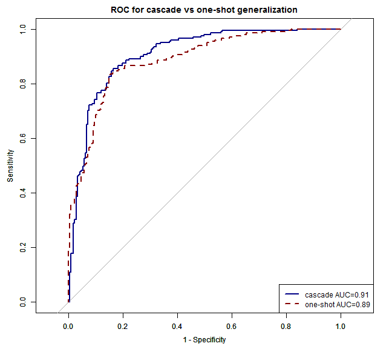 

```r


##plot with CI
ROCF_oneshot <- plot.roc(testproboneshot$obs, testproboneshot$C, col="#860000", lty=2, legacy.axes=TRUE,
                      ci=TRUE, # compute AUC (of AUC by default)  
                      print.auc=TRUE,
                      print.auc.adj=c(-0.5,0)) # print the AUC (will contain the CI)  
ciobj_oneshot <- ci.se(ROCF_oneshot, # CI of sensitivity  
               specificities=seq(0, 1, 0.5)) # over a select set of specificities  
plot(ciobj_oneshot, type="shape", col="#1c61b6AA") # plot as a blue shape  
plot(ci(ROCF_oneshot, of="thresholds", thresholds="best")) # add one threshold
par(new=TRUE)

ROCF_cascade <- plot.roc(testprob_stage2$obs, testprob_stage2$C, col="#000086", lty=1, legacy.axes=TRUE,
                      main="ROC for cascade vs one-shot generalization",
                      ci=TRUE, # compute AUC (of AUC by default)  
                      print.auc=TRUE,
                      print.auc.adj=c(0,1)) # print the AUC (will contain the CI)  
ciobj_cascade <- ci.se(ROCF_cascade, # CI of sensitivity  
               specificities=seq(0, 1, 0.5)) # over a select set of specificities  
plot(ciobj_cascade, type="shape", col="#1c61b6AA") # plot as a blue shape  
plot(ci(ROCF_cascade, of="thresholds", thresholds="best")) # add one threshold

print(ROCF_cascade$auc)
```

```
## Area under the curve: 0.906
```

```r
print(ROCF_oneshot$auc)
```

```
## Area under the curve: 0.886
```

```r
legend("bottomright", 
       legend = c(paste0("cascade: AUC=", formatC(ROCF_cascade$auc,digits=2, format="f")), 
                  paste0("oneshot: AUC=", formatC(ROCF_oneshot$auc,digits=2, format="f"))), 
       col = c("#000086", "#860000"),lwd = 2, lty = c(1,2))
```

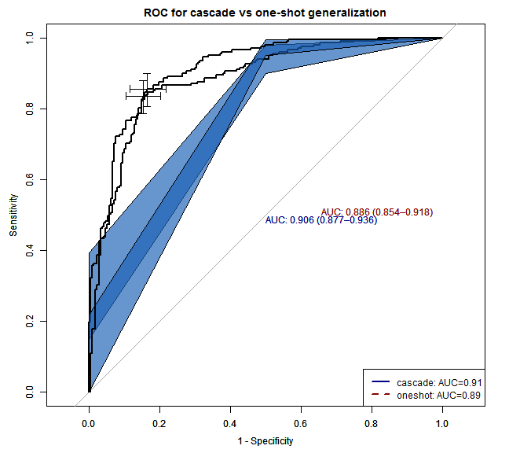 

```r
#testobj <- roc.test(ROCF_oneshot, ROCF_cascade)  
#print(testobj$p.value)
#text(50, 50, labels=paste("p-value =", format.pval(testobj$p.value)), adj=c(0, .5))
```


Resampling-based p-values
====

```r

resample_basedpval <- function(clasf1, clasf2) {
    # using base
    alldata = c(clasf1, clasf2)
    labels = c(rep("clasf1", length(clasf1)), rep("clasf2", length(clasf2)))
    obsdiff = median(alldata[labels == "clasf1"]) - median(alldata[labels == 
        "clasf2"])
    cat("Obser. diff = ", obsdiff, "\n")
    
    # The sample() function re-orders the labels, effectively implementing the
    # supposition that the AUC is no different between cascade and one-shot.
    resample_labels = sample(labels)
    resample_diff = median(alldata[resample_labels == "clasf1"]) - median(alldata[resample_labels == 
        "clasf2"])
    cat("resample diff = ", resample_diff, "\n")
    
    # In a teaching setting, the preceding code could be re-run several times,
    # to mimic the presentation seen in the video linked above. To repeat many
    # times, the most suitable base R tool is replicate(). To use it, we make
    # a function of the resampling procedure shown above.
    resamp_means = function(data, labs) {
        resample_labels = sample(labs)
        resample_diff = median(data[resample_labels == "clasf1"]) - median(data[resample_labels == 
            "clasf2"])
        return(resample_diff)
    }
    
    nulldist = replicate(9999, resamp_means(alldata, labels))
    hist(nulldist, col = "#860000")
    abline(v = obsdiff, col = "blue", lwd = 2)
    
    # The histogram is shown above. The p-value is obtained by counting the
    # proportion of statistics (including the actual observed difference)
    # among greater than or equal to the observed statistic:
    alldiffs = c(obsdiff, nulldist)
    pvalue = sum(abs(alldiffs >= obsdiff)/10000)
    cat("pvalue diff = ", pvalue, "\n")
    
}

# for resamROC
cascadeAUC = {
}
oneshotAUC = {
}
for (i in 1:50) {
    ## plot resample
    res_oneshot = testproboneshot[sample(1:nrow(testproboneshot), 100), ]
    res_cascade = testprob_stage2[sample(1:nrow(testprob_stage2), 100), ]
    # calculate
    ROCF_oneshot <- roc(res_oneshot$obs, res_oneshot$C)
    ROCF_cascade <- roc(res_cascade$obs, res_cascade$C)
    # append
    oneshotAUC = append(oneshotAUC, ROCF_oneshot$auc)
    cascadeAUC = append(cascadeAUC, ROCF_cascade$auc)
}
summary(oneshotAUC)
```

```
##    Min. 1st Qu.  Median    Mean 3rd Qu.    Max. 
##   0.803   0.870   0.889   0.885   0.902   0.949
```

```r
summary(cascadeAUC)
```

```
##    Min. 1st Qu.  Median    Mean 3rd Qu.    Max. 
##   0.845   0.885   0.903   0.904   0.925   0.957
```

```r

# using resample_basedpval
resample_basedpval(cascadeAUC, oneshotAUC)
```

```
## Obser. diff =  0.01381 
## resample diff =  -0.006993
```

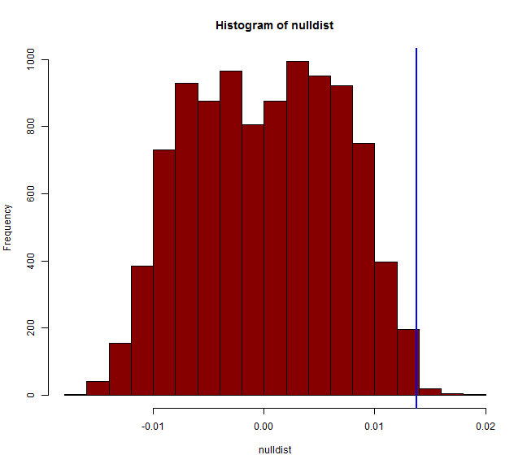 

```
## pvalue diff =  0.0027
```

```r

summary(meanAUConeshot)
```

```
##    Min. 1st Qu.  Median    Mean 3rd Qu.    Max. 
##   0.661   0.807   0.828   0.823   0.850   0.896
```

```r
summary(meanAUCmass)
```

```
##    Min. 1st Qu.  Median    Mean 3rd Qu.    Max. 
##   0.769   0.868   0.893   0.902   0.962   0.984
```

```r
summary(meanAUCnonmass)
```

```
##    Min. 1st Qu.  Median    Mean 3rd Qu.    Max. 
##   0.597   0.833   0.917   0.896   0.952   1.000
```

```r

resample_basedpval(meanAUCmass, meanAUConeshot)
```

```
## Obser. diff =  0.06488 
## resample diff =  -0.01774
```

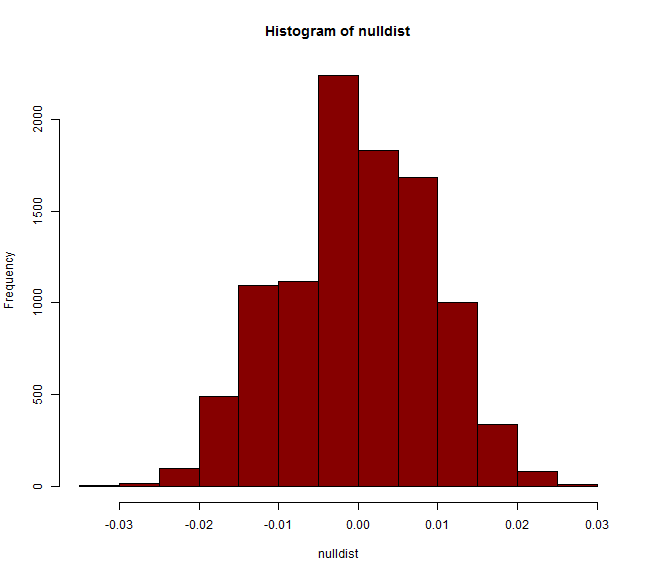 

```
## pvalue diff =  1e-04
```

```r
resample_basedpval(meanAUCnonmass, meanAUConeshot)
```

```
## Obser. diff =  0.08869 
## resample diff =  0.009524
```

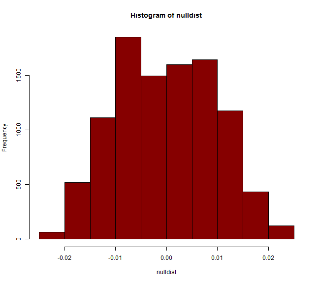 

```
## pvalue diff =  1e-04
```


Process misclassifications
======

```r
library(reshape)
```

```
## 
## Attaching package: 'reshape'
## 
## The following object(s) are masked from 'package:class':
## 
##     condense
## 
## The following object(s) are masked from 'package:reshape2':
## 
##     colsplit, melt, recast
## 
## The following object(s) are masked from 'package:plyr':
## 
##     rename, round_any
```

```r
misclass_stage1 = subset(testprob, pred != obs)
misclass_mass = subset(testprobmass, pred != obs)
misclass_nonmass = subset(testprobnonmass, pred != obs)

misclass_stage2 = rbind(misclass_mass, misclass_nonmass)
misclass_oneshot = subset(testproboneshot, pred != obs)
allmissed = rbind(misclass_stage2, misclass_oneshot)

# missed by both
missall = allmissed$ids[duplicated(allmissed$ids)]
print(length(missall))
```

```
## [1] 28
```

```r
diagnosis = {
}
labels = {
}
# query lesion info by lesion_id
for (i in 1:length(missall)) {
    caseith = read_data("multi", missall[i])
    infocase = caseith$info
    diagnosis = append(diagnosis, infocase$lesion_diagnosis)
    labels = append(labels, infocase$lesion_label)
}

summary(as.factor(labels))
```

```
##    massB    massM nonmassB nonmassM 
##       13        6        4        5
```

```r
summary(as.factor(diagnosis))
```

```
##             BenignTissue                     Cyst    DifuseStromalFibrosis 
##                        3                        2                        1 
## DuctalHyperplasiaWAtypia            DuctPapilloma             Fibroadenoma 
##                        1                        1                        3 
##              Fibrocystic             InsituDuctal           InvasiveDuctal 
##                        4                        5                        5 
##          InvasiveLobular           PhyllodesTumor   UsualDuctalHyperplasia 
##                        1                        1                        1
```

```r

# Find missing by oneshot not by cascade and viceversa
bothmissed = merge(misclass_stage2, misclass_oneshot, by = "ids")

# since allmissed = rbind(misclass_stage2, misclass_oneshot)
misclass_stage2 = rbind(misclass_mass, misclass_nonmass)
misclass_oneshot = subset(testproboneshot, pred != obs)
misclass_oneshot$missedby <- "oneshot"
misclass_stage2$missedby <- "cascade"
allmissed = rbind(misclass_stage2, misclass_oneshot)

onlymissed = allmissed[!allmissed$ids %in% bothmissed$ids, ]
missonlyoneshot = subset(onlymissed, missedby == "oneshot")
print(nrow(missonlyoneshot))
```

```
## [1] 54
```

```r
missonlycascade = subset(onlymissed, missedby == "cascade")
print(nrow(missonlycascade))
```

```
## [1] 44
```

```r

# misclassification by stages
print(nrow(misclass_stage2))
```

```
## [1] 72
```

```r
missed2ndand1st = misclass_stage1[!misclass_stage1$ids %in% misclass_stage2$ids, 
    ]
print(nrow(missed2ndand1st))
```

```
## [1] 68
```

```r
print(missed2ndand1st)
```

```
##       mass nonmass    pred     obs ids
## 18  0.3975  0.5108 nonmass    mass  26
## 116 0.4212  0.4871 nonmass    mass 169
## 145 0.4934  0.5066 nonmass    mass 213
## 227 0.4756  0.5244 nonmass    mass 368
## 254 0.3066  0.6017 nonmass    mass 402
## 258 0.4465  0.4619 nonmass    mass 406
## 280 0.3479  0.5604 nonmass    mass 158
## 282 0.5155  0.3929    mass nonmass  18
## 283 0.5649  0.4351    mass nonmass  22
## 286 0.5385  0.3699    mass nonmass  37
## 289 0.5015  0.4985    mass nonmass  48
## 290 0.5006  0.4078    mass nonmass  49
## 291 0.6217  0.3783    mass nonmass  54
## 298 0.5050  0.4033    mass nonmass  82
## 302 0.4790  0.4293    mass nonmass  99
## 306 0.4788  0.4296    mass nonmass 114
## 309 0.6241  0.3759    mass nonmass 130
## 311 0.5051  0.4949    mass nonmass 138
## 312 0.5059  0.4024    mass nonmass 141
## 315 0.5013  0.4987    mass nonmass 155
## 317 0.5180  0.4820    mass nonmass 159
## 319 0.5665  0.4335    mass nonmass 165
## 320 0.5054  0.4030    mass nonmass 166
## 321 0.6719  0.3281    mass nonmass 170
## 322 0.5125  0.3958    mass nonmass 172
## 324 0.4597  0.4486    mass nonmass 179
## 333 0.5434  0.4566    mass nonmass 206
## 335 0.5370  0.4630    mass nonmass 210
## 336 0.6244  0.2839    mass nonmass 214
## 338 0.5592  0.3491    mass nonmass 226
## 346 0.5140  0.3943    mass nonmass 242
## 348 0.5035  0.4048    mass nonmass 253
## 349 0.6398  0.3602    mass nonmass 254
## 350 0.4905  0.4178    mass nonmass 260
## 352 0.5800  0.3283    mass nonmass 269
## 353 0.5492  0.4508    mass nonmass 270
## 354 0.5082  0.4001    mass nonmass 273
## 357 0.5008  0.4992    mass nonmass 276
## 360 0.5376  0.3707    mass nonmass 283
## 362 0.5883  0.3201    mass nonmass 295
## 368 0.5497  0.3587    mass nonmass 308
## 369 0.7328  0.2672    mass nonmass 317
## 370 0.6528  0.2555    mass nonmass 319
## 373 0.5403  0.4597    mass nonmass 330
## 374 0.6146  0.2938    mass nonmass 331
## 375 0.6031  0.3969    mass nonmass 334
## 376 0.6561  0.2522    mass nonmass 335
## 377 0.6136  0.3864    mass nonmass 336
## 379 0.5863  0.4137    mass nonmass 340
## 381 0.6467  0.3533    mass nonmass 343
## 382 0.5939  0.3145    mass nonmass 344
## 383 0.7899  0.2101    mass nonmass 346
## 384 0.5806  0.3277    mass nonmass 347
## 385 0.7330  0.2670    mass nonmass 348
## 386 0.5760  0.3324    mass nonmass 349
## 388 0.7106  0.1978    mass nonmass 352
## 389 0.7945  0.2055    mass nonmass 354
## 390 0.5718  0.3366    mass nonmass 357
## 393 0.7080  0.2920    mass nonmass 366
## 394 0.4968  0.4115    mass nonmass 369
## 396 0.5488  0.3596    mass nonmass 371
## 398 0.6289  0.2795    mass nonmass 398
## 400 0.6502  0.2581    mass nonmass 401
## 402 0.5275  0.3809    mass nonmass 268
## 403 0.7345  0.2655    mass nonmass 277
## 406 0.6838  0.2246    mass nonmass 328
## 407 0.7599  0.2401    mass nonmass   3
## 408 0.6258  0.2825    mass nonmass 252
```

```r

missed1stnot2 = misclass_stage1[!misclass_stage1$ids %in% missed2ndand1st$ids, 
    ]
print(nrow(missed1stnot2))
```

```
## [1] 16
```

```r
print(missed1stnot2)
```

```
##       mass nonmass    pred     obs ids
## 263 0.4062  0.5938 nonmass    mass 272
## 287 0.6559  0.3441    mass nonmass  41
## 292 0.5878  0.3205    mass nonmass  55
## 293 0.6235  0.3765    mass nonmass  59
## 308 0.5358  0.3726    mass nonmass 126
## 331 0.5894  0.4106    mass nonmass 198
## 351 0.5368  0.4632    mass nonmass 264
## 361 0.5637  0.4363    mass nonmass 286
## 367 0.5144  0.4856    mass nonmass 307
## 372 0.7085  0.1999    mass nonmass 322
## 378 0.7023  0.2060    mass nonmass 339
## 380 0.5821  0.3262    mass nonmass 341
## 387 0.6202  0.3798    mass nonmass 350
## 404 0.5635  0.3448    mass nonmass 291
## 405 0.5169  0.4831    mass nonmass 292
## 409 0.7615  0.2385    mass nonmass 266
```


